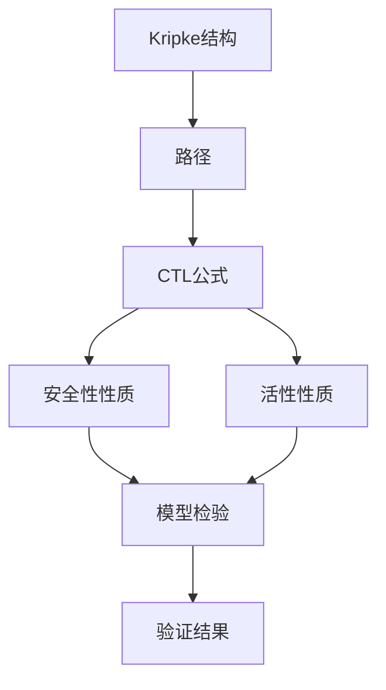
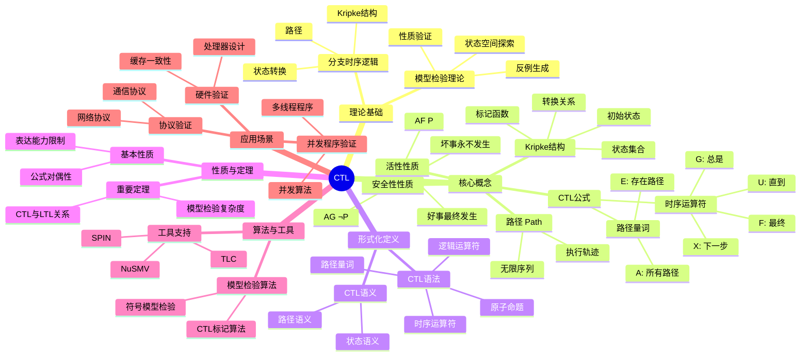
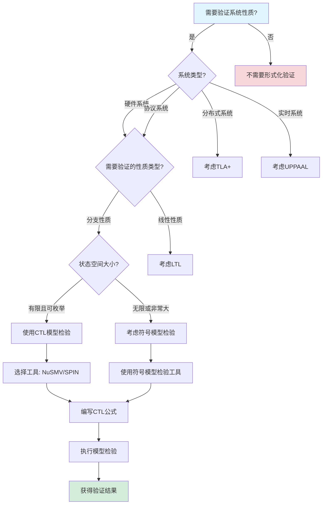
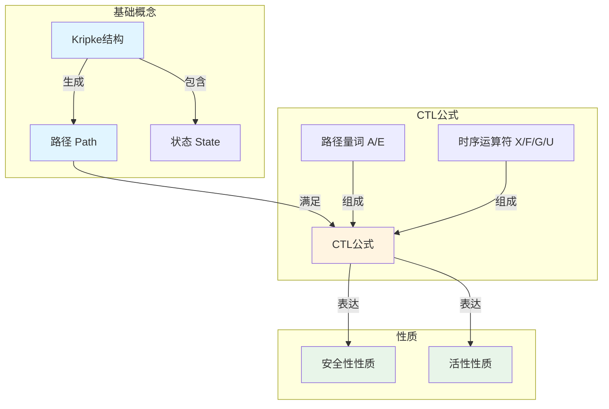
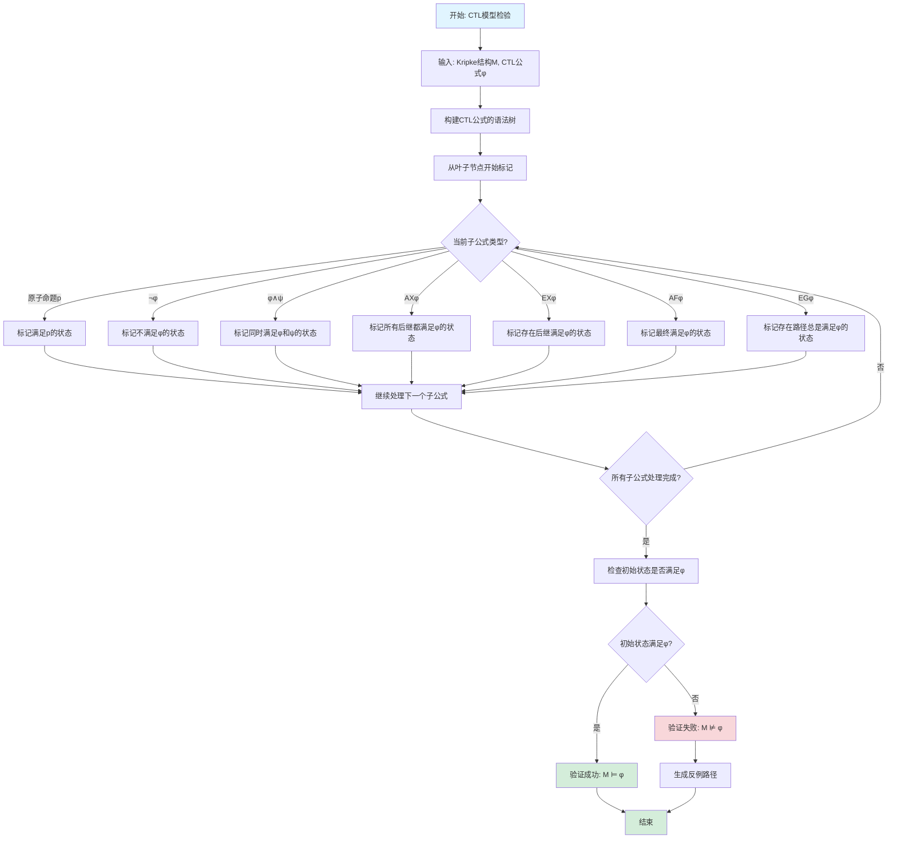

# CTL（Computation Tree Logic）专题文档

## 目录

- [CTL（Computation Tree Logic）专题文档](#ctlcomputation-tree-logic专题文档)
  - [目录](#目录)
  - [一、概述](#一概述)
    - [1.1 CTL简介](#11-ctl简介)
    - [1.2 核心思想](#12-核心思想)
    - [1.3 应用领域](#13-应用领域)
    - [1.4 在本项目中的应用](#14-在本项目中的应用)
  - [二、历史背景](#二历史背景)
    - [2.1 发展历史](#21-发展历史)
    - [2.2 重要人物](#22-重要人物)
    - [2.3 重要里程碑](#23-重要里程碑)
  - [三、核心概念](#三核心概念)
    - [3.1 基本概念](#31-基本概念)
      - [概念1：Kripke结构（Kripke Structure）](#概念1kripke结构kripke-structure)
      - [概念2：路径（Path）](#概念2路径path)
      - [概念3：CTL公式](#概念3ctl公式)
      - [概念4：安全性性质（Safety Property）](#概念4安全性性质safety-property)
      - [概念5：活性性质（Liveness Property）](#概念5活性性质liveness-property)
    - [3.2 概念关系](#32-概念关系)
  - [四、形式化定义](#四形式化定义)
    - [4.1 数学定义](#41-数学定义)
      - [定义1：CTL语法](#定义1ctl语法)
      - [定义2：CTL语义](#定义2ctl语义)
    - [4.2 语法定义](#42-语法定义)
      - [CTL语法要素](#ctl语法要素)
    - [4.3 语义定义](#43-语义定义)
      - [语义1：状态语义](#语义1状态语义)
      - [语义2：路径语义](#语义2路径语义)
  - [五、性质与定理](#五性质与定理)
    - [5.1 基本性质](#51-基本性质)
      - [性质1：CTL公式的对偶性](#性质1ctl公式的对偶性)
      - [性质2：CTL表达能力的限制](#性质2ctl表达能力的限制)
    - [5.2 重要定理](#52-重要定理)
      - [定理1：CTL模型检验复杂度](#定理1ctl模型检验复杂度)
      - [定理2：CTL与LTL的关系](#定理2ctl与ltl的关系)
  - [六、算法与工具](#六算法与工具)
    - [6.1 模型检验算法](#61-模型检验算法)
      - [算法1：CTL标记算法（Labeling Algorithm）](#算法1ctl标记算法labeling-algorithm)
      - [算法2：符号模型检验](#算法2符号模型检验)
    - [6.2 工具支持](#62-工具支持)
      - [工具1：NuSMV](#工具1nusmv)
      - [工具2：SPIN](#工具2spin)
      - [工具3：TLC（TLA+ Model Checker）](#工具3tlctla-model-checker)
  - [七、应用场景](#七应用场景)
    - [7.1 适用场景](#71-适用场景)
      - [场景1：硬件验证](#场景1硬件验证)
      - [场景2：协议验证](#场景2协议验证)
      - [场景3：并发程序验证](#场景3并发程序验证)
    - [7.2 不适用场景](#72-不适用场景)
      - [场景1：无限状态系统](#场景1无限状态系统)
      - [场景2：实时系统](#场景2实时系统)
      - [场景3：概率系统](#场景3概率系统)
  - [八、实践案例](#八实践案例)
    - [8.1 工业界案例](#81-工业界案例)
      - [案例1：Intel处理器验证](#案例1intel处理器验证)
      - [案例2：IBM系统验证](#案例2ibm系统验证)
    - [8.2 学术界案例](#82-学术界案例)
      - [案例1：缓存一致性协议验证](#案例1缓存一致性协议验证)
      - [案例2：互斥算法验证](#案例2互斥算法验证)
  - [九、学习资源](#九学习资源)
    - [9.1 推荐阅读](#91-推荐阅读)
      - [经典教材](#经典教材)
      - [原始论文](#原始论文)
      - [在线教程](#在线教程)
    - [9.2 学习路径](#92-学习路径)
      - [入门路径（1-2周）](#入门路径1-2周)
      - [进阶路径（3-4周）](#进阶路径3-4周)
      - [深入研究路径（持续）](#深入研究路径持续)
  - [十、参考文献](#十参考文献)
    - [10.1 经典文献](#101-经典文献)
      - [原始论文](#原始论文-1)
      - [重要论文](#重要论文)
    - [10.2 在线资源](#102-在线资源)
      - [Wikipedia](#wikipedia)
      - [工具文档](#工具文档)
      - [大学课程](#大学课程)
  - [十一、思维表征](#十一思维表征)
    - [11.1 知识体系思维导图](#111-知识体系思维导图)
    - [11.2 多维知识对比矩阵](#112-多维知识对比矩阵)
      - [矩阵1：时序逻辑对比矩阵](#矩阵1时序逻辑对比矩阵)
      - [矩阵2：CTL工具对比矩阵](#矩阵2ctl工具对比矩阵)
    - [11.3 论证决策树](#113-论证决策树)
      - [决策树1：何时使用CTL进行验证](#决策树1何时使用ctl进行验证)
    - [11.4 概念属性关系图](#114-概念属性关系图)
    - [11.5 形式化证明流程图](#115-形式化证明流程图)
      - [证明流程图1：CTL模型检验算法流程图](#证明流程图1ctl模型检验算法流程图)

---

## 一、概述

### 1.1 CTL简介

**CTL（Computation Tree Logic）** 是一种分支时序逻辑（Branching-time Temporal Logic），用于描述和验证并发系统的性质。它由Edmund M. Clarke和E. Allen Emerson在1981年提出，是模型检验（Model Checking）领域的基础理论。

**来源**：基于Wikipedia [Computation Tree Logic](https://en.wikipedia.org/wiki/Computation_tree_logic) 和 Clarke & Emerson的原始论文

**核心特点**：

1. **分支时间**：考虑系统所有可能的执行路径
2. **路径量词**：使用路径量词（A：所有路径，E：存在路径）和时序运算符
3. **模型检验**：可以自动验证有限状态系统的性质
4. **表达能力**：可以表达安全性和活性性质

### 1.2 核心思想

**核心思想1：计算树**

CTL基于计算树模型，系统的每个状态可以有多条可能的执行路径：

- **状态**：系统在某个时刻的快照
- **转换**：状态之间的转换关系
- **路径**：从某个状态开始的所有可能执行序列
- **计算树**：以某个状态为根的所有路径形成的树

**核心思想2：路径量词和时序运算符**

CTL结合路径量词和时序运算符：

- **路径量词**：
  - $A$（All）：所有路径
  - $E$（Exists）：存在路径
- **时序运算符**：
  - $X$（Next）：下一步
  - $F$（Finally/Eventually）：最终
  - $G$（Globally/Always）：总是
  - $U$（Until）：直到

**核心思想3：性质分类**

CTL可以表达两类性质：

- **安全性（Safety）**：坏事永远不会发生，如 $\Box P$（总是P）
- **活性（Liveness）**：好事最终会发生，如 $\Diamond P$（最终P）

### 1.3 应用领域

**应用领域1：硬件验证**

- 处理器设计验证
- 缓存一致性协议验证
- 总线协议验证

**应用领域2：软件验证**

- 并发程序验证
- 协议验证
- 嵌入式系统验证

**应用领域3：系统验证**

- 分布式系统验证
- 实时系统验证
- 安全协议验证

### 1.4 在本项目中的应用

**在本项目中的应用**：

1. **工作流性质验证**：使用CTL验证工作流的安全性性质
2. **时序一致性验证**：验证工作流的时序一致性
3. **死锁检测**：使用CTL检测工作流的死锁状态
4. **可达性分析**：分析工作流状态的可达性

**相关文档链接**：

- [形式化验证理论](../03-formal-verification/形式化验证理论.md#二时序逻辑验证框架)
- [论证完备性增强](../14-argumentation-enhancement/论证完备性增强.md)

---

## 二、历史背景

### 2.1 发展历史

**1981年**：CTL提出

- **论文**："Design and Synthesis of Synchronization Skeletons Using Branching Time Temporal Logic" by Clarke & Emerson
- **会议**：Logic of Programs Workshop
- **贡献**：提出了CTL语法和语义，建立了模型检验的基础

**1986年**：CTL*提出

- **论文**："Characterizing Correctness Properties of Parallel Programs Using Fixpoints" by Emerson & Halpern
- **贡献**：统一了CTL和LTL，提出了更强大的CTL*逻辑

**1990年代**：模型检验工具发展

- **SMV**：Symbolic Model Verifier，使用BDD进行符号模型检验
- **SPIN**：Promela模型检验器，支持LTL和部分CTL性质
- **NuSMV**：SMV的改进版本

**2000年代至今**：持续发展和应用

- **工业界采用**：Intel、IBM等公司使用CTL验证硬件设计
- **工具改进**：符号模型检验、有界模型检验等技术发展
- **理论研究**：CTL扩展、复杂度分析等研究

**来源**：Wikipedia [Computation Tree Logic](https://en.wikipedia.org/wiki/Computation_tree_logic) 和相关论文

### 2.2 重要人物

**Edmund M. Clarke（1945-）**

- **身份**：CTL的共同提出者，2007年图灵奖获得者
- **背景**：美国计算机科学家，卡内基梅隆大学教授
- **贡献**：
  - 与Emerson共同提出CTL
  - 开发SMV模型检验工具
  - 在模型检验领域做出重要贡献
- **荣誉**：2007年图灵奖（与Allen Emerson和Joseph Sifakis共同获得）

**E. Allen Emerson（1954-）**

- **身份**：CTL的共同提出者，2007年图灵奖获得者
- **背景**：美国计算机科学家，德克萨斯大学奥斯汀分校教授
- **贡献**：
  - 与Clarke共同提出CTL
  - 在模型检验理论方面做出重要贡献
- **荣誉**：2007年图灵奖（与Edmund Clarke和Joseph Sifakis共同获得）

**来源**：Wikipedia [Edmund M. Clarke](https://en.wikipedia.org/wiki/Edmund_M._Clarke) 和 [E. Allen Emerson](https://en.wikipedia.org/wiki/E._Allen_Emerson)

### 2.3 重要里程碑

| 时间 | 里程碑 | 影响 |
|------|--------|------|
| **1981** | CTL提出 | 建立分支时序逻辑基础 |
| **1986** | CTL*提出 | 统一CTL和LTL |
| **1990** | SMV工具发布 | 提供实用模型检验工具 |
| **2007** | 图灵奖 | 认可模型检验重要性 |
| **2010** | 工业界大规模采用 | 证明CTL实用性 |

---

## 三、核心概念

### 3.1 基本概念

#### 概念1：Kripke结构（Kripke Structure）

**定义**：Kripke结构是CTL的语义模型，用于表示系统的状态转换。

**形式化定义**：

$$ M = (S, S_0, R, L) $$

其中：

- $S$ 是状态集合
- $S_0 \subseteq S$ 是初始状态集合
- $R \subseteq S \times S$ 是转换关系
- $L: S \to 2^{AP}$ 是标记函数，$AP$ 是原子命题集合

**来源**：Baier & Katoen, "Principles of Model Checking" (2008), Chapter 2

#### 概念2：路径（Path）

**定义**：路径是状态的无限序列，表示系统的一个可能执行。

**形式化定义**：

$$ \pi = s_0, s_1, s_2, ... $$

其中 $(s_i, s_{i+1}) \in R$ 对所有 $i \ge 0$ 成立。

**来源**：Baier & Katoen, "Principles of Model Checking" (2008), Chapter 2

#### 概念3：CTL公式

**定义**：CTL公式由路径量词和时序运算符组合而成。

**语法**：

$$ \phi ::= \text{true} | \text{false} | p | \neg \phi | \phi \land \psi | \phi \lor \psi | AX\phi | EX\phi | AF\phi | EF\phi | AG\phi | EG\phi | A[\phi U \psi] | E[\phi U \psi] $$

其中：

- $p$ 是原子命题
- $AX\phi$：所有路径的下一步都满足 $\phi$
- $EX\phi$：存在路径的下一步满足 $\phi$
- $AF\phi$：所有路径最终满足 $\phi$
- $EF\phi$：存在路径最终满足 $\phi$
- $AG\phi$：所有路径总是满足 $\phi$
- $EG\phi$：存在路径总是满足 $\phi$
- $A[\phi U \psi]$：所有路径中 $\phi$ 直到 $\psi$ 成立
- $E[\phi U \psi]$：存在路径中 $\phi$ 直到 $\psi$ 成立

**来源**：Clarke & Emerson, "Design and Synthesis of Synchronization Skeletons" (1981)

#### 概念4：安全性性质（Safety Property）

**定义**：安全性性质表示"坏事永远不会发生"。

**CTL表达**：

$$ AG \neg P $$

表示在所有路径上，总是不会发生 $P$。

**来源**：Lamport, "Proving the Correctness of Multiprocess Programs" (1977)

#### 概念5：活性性质（Liveness Property）

**定义**：活性性质表示"好事最终会发生"。

**CTL表达**：

$$ AF P $$

表示在所有路径上，最终会发生 $P$。

**来源**：Lamport, "Proving the Correctness of Multiprocess Programs" (1977)

### 3.2 概念关系

**概念关系图**：



**关系说明**：

1. **Kripke结构 → 路径**：Kripke结构定义了所有可能的路径
2. **路径 → CTL公式**：CTL公式在路径上解释
3. **CTL公式 → 性质**：安全性性质和活性性质是CTL公式的特例
4. **性质 → 模型检验**：模型检验验证性质是否在Kripke结构上成立

---

## 四、形式化定义

### 4.1 数学定义

#### 定义1：CTL语法

**定义**：CTL公式的语法由以下BNF定义：

$$ \phi ::= \text{true} | \text{false} | p | \neg \phi | \phi \land \psi | \phi \lor \psi | AX\phi | EX\phi | AF\phi | EF\phi | AG\phi | EG\phi | A[\phi U \psi] | E[\phi U \psi] $$

**来源**：Clarke & Emerson, "Design and Synthesis of Synchronization Skeletons" (1981)

#### 定义2：CTL语义

**定义**：CTL公式在Kripke结构 $M$ 和状态 $s$ 下的语义定义如下：

- $M, s \models p$ 当且仅当 $p \in L(s)$
- $M, s \models \neg \phi$ 当且仅当 $M, s \not\models \phi$
- $M, s \models \phi \land \psi$ 当且仅当 $M, s \models \phi$ 且 $M, s \models \psi$
- $M, s \models AX\phi$ 当且仅当对所有 $(s, s') \in R$，$M, s' \models \phi$
- $M, s \models EX\phi$ 当且仅当存在 $(s, s') \in R$，$M, s' \models \phi$
- $M, s \models AF\phi$ 当且仅当所有从 $s$ 开始的路径最终满足 $\phi$
- $M, s \models EF\phi$ 当且仅当存在从 $s$ 开始的路径最终满足 $\phi$
- $M, s \models AG\phi$ 当且仅当所有从 $s$ 开始的路径总是满足 $\phi$
- $M, s \models EG\phi$ 当且仅当存在从 $s$ 开始的路径总是满足 $\phi$
- $M, s \models A[\phi U \psi]$ 当且仅当所有从 $s$ 开始的路径中，$\phi$ 直到 $\psi$ 成立
- $M, s \models E[\phi U \psi]$ 当且仅当存在从 $s$ 开始的路径中，$\phi$ 直到 $\psi$ 成立

**来源**：Baier & Katoen, "Principles of Model Checking" (2008), Chapter 6

### 4.2 语法定义

#### CTL语法要素

**1. 原子命题**

```tla
p, q, r  -- 原子命题
```

**2. 逻辑运算符**

```tla
\neg \phi    -- 否定
\phi \land \psi  -- 合取
\phi \lor \psi   -- 析取
\phi \implies \psi  -- 蕴含
```

**3. 路径量词和时序运算符**

```tla
AX \phi  -- 所有路径的下一步
EX \phi  -- 存在路径的下一步
AF \phi  -- 所有路径最终
EF \phi  -- 存在路径最终
AG \phi  -- 所有路径总是
EG \phi  -- 存在路径总是
A[\phi U \psi]  -- 所有路径直到
E[\phi U \psi]  -- 存在路径直到
```

**来源**：Baier & Katoen, "Principles of Model Checking" (2008), Chapter 6

### 4.3 语义定义

#### 语义1：状态语义

**定义**：CTL公式在状态 $s$ 下的真值由状态的性质决定。

**形式化定义**：

$$
[\phi]_s = \begin{cases}
\text{true} & \text{if } M, s \models \phi \\
\text{false} & \text{otherwise}
\end{cases}
$$

**来源**：Baier & Katoen, "Principles of Model Checking" (2008), Chapter 6

#### 语义2：路径语义

**定义**：CTL公式在路径 $\pi$ 上的真值由路径的性质决定。

**形式化定义**：

$$ [X\phi]_\pi = [\phi]_{\pi[1]} $$

$$ [F\phi]_\pi = \exists i \in \mathbb{N}: [\phi]_{\pi[i]} $$

$$ [G\phi]_\pi = \forall i \in \mathbb{N}: [\phi]_{\pi[i]} $$

$$ [\phi U \psi]_\pi = \exists i \in \mathbb{N}: [\psi]_{\pi[i]} \land \forall j < i: [\phi]_{\pi[j]} $$

**来源**：Baier & Katoen, "Principles of Model Checking" (2008), Chapter 6

---

## 五、性质与定理

### 5.1 基本性质

#### 性质1：CTL公式的对偶性

**表述**：CTL公式存在对偶关系。

**形式化表述**：

$$ AX\phi \equiv \neg EX\neg\phi $$

$$ AF\phi \equiv \neg EG\neg\phi $$

$$ AG\phi \equiv \neg EF\neg\phi $$

$$ A[\phi U \psi] \equiv \neg E[\neg\psi U (\neg\phi \land \neg\psi)] \land \neg EG\neg\psi $$

**证明思路**：由语义定义直接可得。

**来源**：Baier & Katoen, "Principles of Model Checking" (2008), Chapter 6

#### 性质2：CTL表达能力的限制

**表述**：CTL不能表达某些时序性质。

**示例**：

- CTL不能表达"存在路径，其中 $p$ 和 $q$ 交替出现"
- 需要使用CTL*或LTL来表达

**来源**：Emerson & Halpern, "Characterizing Correctness Properties" (1986)

### 5.2 重要定理

#### 定理1：CTL模型检验复杂度

**表述**：CTL模型检验的时间复杂度是线性的。

**形式化表述**：

对于CTL公式 $\phi$ 和Kripke结构 $M = (S, R, L)$，模型检验的时间复杂度为：

$$ O(|\phi| \times (|S| + |R|)) $$

其中 $|\phi|$ 是公式的大小，$|S|$ 是状态数，$|R|$ 是转换数。

**证明思路**：

1. 使用标记算法（Labeling Algorithm）
2. 对每个子公式，标记满足该公式的状态
3. 复杂度与公式大小和状态空间大小成线性关系

**来源**：Clarke, Emerson & Sistla, "Automatic Verification of Finite-State Concurrent Systems" (1986)

#### 定理2：CTL与LTL的关系

**表述**：CTL和LTL的表达能力不同，但都包含在CTL*中。

**形式化表述**：

$$ \text{CTL} \subsetneq \text{CTL}^* \supsetneq \text{LTL} $$

**证明**：

- CTL和LTL都是CTL*的子集
- 存在CTL可表达但LTL不可表达的性质
- 存在LTL可表达但CTL不可表达的性质

**来源**：Emerson & Halpern, "Characterizing Correctness Properties" (1986)

---

## 六、算法与工具

### 6.1 模型检验算法

#### 算法1：CTL标记算法（Labeling Algorithm）

**描述**：标记算法是CTL模型检验的标准算法，通过标记满足子公式的状态来验证公式。

**算法步骤**：

```algorithm
CTLModelCheck(M, φ):
输入：Kripke结构 M = (S, S_0, R, L)，CTL公式 φ
输出：满足 φ 的状态集合

1. 将 φ 分解为子公式：φ_1, φ_2, ..., φ_n = φ
2. 对每个子公式 φ_i（从简单到复杂）：
   a. 如果 φ_i 是原子命题 p：
      - 标记所有满足 p 的状态：Sat(φ_i) = {s ∈ S | p ∈ L(s)}
   b. 如果 φ_i = ¬ψ：
      - Sat(φ_i) = S \ Sat(ψ)
   c. 如果 φ_i = ψ_1 ∧ ψ_2：
      - Sat(φ_i) = Sat(ψ_1) ∩ Sat(ψ_2)
   d. 如果 φ_i = EXψ：
      - Sat(φ_i) = {s ∈ S | ∃s' ∈ Sat(ψ): (s, s') ∈ R}
   e. 如果 φ_i = AFψ：
      - 使用不动点计算：Sat(φ_i) = μZ. Sat(ψ) ∪ {s | ∀s': (s, s') ∈ R → s' ∈ Z}
   f. 如果 φ_i = EGψ：
      - 使用不动点计算：Sat(φ_i) = νZ. Sat(ψ) ∩ {s | ∃s': (s, s') ∈ R ∧ s' ∈ Z}
   g. 其他运算符类似处理
3. 返回 Sat(φ)
```

**复杂度分析**：

- **时间复杂度**：$O(|\phi| \times (|S| + |R|))$
- **空间复杂度**：$O(|S|)$

**来源**：Clarke, Emerson & Sistla, "Automatic Verification of Finite-State Concurrent Systems" (1986)

#### 算法2：符号模型检验

**描述**：使用BDD（Binary Decision Diagram）进行符号模型检验，可以处理更大的状态空间。

**优势**：

- 可以处理 $10^{20}$ 甚至更多的状态
- 使用符号表示，避免状态爆炸

**工具**：SMV、NuSMV

**来源**：McMillan, "Symbolic Model Checking" (1993)

### 6.2 工具支持

#### 工具1：NuSMV

**介绍**：NuSMV是SMV的改进版本，支持CTL和LTL模型检验。

**功能**：

- CTL模型检验
- LTL模型检验
- 符号模型检验（BDD）
- 有界模型检验（SAT）

**使用方法**：

```smv
MODULE main
VAR
  x : boolean;
  y : boolean;
ASSIGN
  init(x) := FALSE;
  init(y) := FALSE;
  next(x) := !x;
  next(y) := x;
SPEC
  AG (x -> AF y)  -- CTL公式
```

**来源**：NuSMV文档

#### 工具2：SPIN

**介绍**：SPIN是Promela模型检验器，主要支持LTL，但也支持部分CTL性质。

**功能**：

- LTL模型检验
- 部分CTL性质验证
- 反例生成

**来源**：SPIN文档

#### 工具3：TLC（TLA+ Model Checker）

**介绍**：TLC是TLA+的模型检验器，可以验证TLA+规约中的CTL性质。

**功能**：

- TLA+规约验证
- 不变式验证
- 时序性质验证

**来源**：Lamport, "Specifying Systems" (2002)

---

## 七、应用场景

### 7.1 适用场景

#### 场景1：硬件验证

**描述**：验证处理器、缓存一致性协议等硬件设计的正确性。

**优势**：

- 可以验证所有可能的执行路径
- 可以发现并发bug
- 可以证明设计的正确性

**示例**：Intel处理器验证、缓存一致性协议验证

#### 场景2：协议验证

**描述**：验证通信协议、安全协议的正确性。

**优势**：

- 可以验证协议在所有场景下的行为
- 可以证明协议的性质（安全性、活性）
- 可以发现协议设计中的问题

**示例**：网络协议验证、安全协议验证

#### 场景3：并发程序验证

**描述**：验证多线程程序、并发数据结构的正确性。

**优势**：

- 可以验证所有可能的执行顺序
- 可以发现并发bug
- 可以证明程序的正确性

**示例**：互斥锁验证、无锁数据结构验证

### 7.2 不适用场景

#### 场景1：无限状态系统

**描述**：CTL模型检验器只能处理有限状态系统。

**原因**：

- 状态空间必须是有限的
- 无限状态系统需要使用定理证明或其他方法

#### 场景2：实时系统

**描述**：标准CTL不适合验证实时约束。

**原因**：

- CTL不直接支持时间约束
- 实时系统需要使用时间CTL（TCTL）或时间自动机

#### 场景3：概率系统

**描述**：CTL不适合验证概率性质。

**原因**：

- CTL是确定性的
- 概率系统需要使用概率CTL（PCTL）

---

## 八、实践案例

### 8.1 工业界案例

#### 案例1：Intel处理器验证

**背景**：Intel使用CTL验证处理器的正确性。

**应用**：

- 验证指令执行正确性
- 验证缓存一致性
- 验证流水线正确性

**效果**：

- 发现了设计中的问题
- 提高了处理器可靠性
- 减少了生产bug

**来源**：Intel技术报告

#### 案例2：IBM系统验证

**背景**：IBM使用CTL验证系统设计的正确性。

**应用**：

- 验证系统协议
- 验证并发算法
- 验证安全性质

**效果**：

- 提高了系统可靠性
- 减少了系统bug
- 提高了客户满意度

**来源**：IBM技术报告

### 8.2 学术界案例

#### 案例1：缓存一致性协议验证

**背景**：使用CTL验证缓存一致性协议的正确性。

**应用**：

- 验证协议的安全性
- 验证协议的活性
- 验证协议的公平性

**效果**：

- 提供了协议的形式化证明
- 发现了协议变种的问题
- 推动了协议研究

**来源**：相关学术论文

#### 案例2：互斥算法验证

**背景**：使用CTL验证互斥算法的正确性。

**应用**：

- 验证互斥性质
- 验证无死锁性质
- 验证无饥饿性质

**效果**：

- 提供了算法的形式化证明
- 发现了算法的问题
- 推动了算法研究

**来源**：相关学术论文

---

## 九、学习资源

### 9.1 推荐阅读

#### 经典教材

1. **"Principles of Model Checking"**
   - 作者：Christel Baier, Joost-Pieter Katoen
   - 出版社：MIT Press
   - 出版年份：2008
   - **推荐理由**：模型检验的权威教材，包含CTL的详细讲解

2. **"Model Checking"**
   - 作者：Edmund M. Clarke, Jr., Orna Grumberg, Doron A. Peled
   - 出版社：MIT Press
   - 出版年份：1999
   - **推荐理由**：模型检验的经典教材，由CTL创始人编写

#### 原始论文

1. **"Design and Synthesis of Synchronization Skeletons Using Branching Time Temporal Logic"**
   - 作者：Edmund M. Clarke, E. Allen Emerson
   - 会议：Logic of Programs Workshop
   - 年份：1981
   - **推荐理由**：CTL的原始论文

2. **"Automatic Verification of Finite-State Concurrent Systems Using Temporal Logic Specifications"**
   - 作者：Edmund M. Clarke, E. Allen Emerson, A. Prasad Sistla
   - 期刊：ACM Transactions on Programming Languages and Systems
   - 年份：1986
   - **推荐理由**：CTL模型检验算法的原始论文

#### 在线教程

1. **CMU 15-811: Formal Methods**
   - 课程网站：CMU课程网站
   - **推荐理由**：包含CTL的详细讲解和实际应用

2. **Stanford CS237B: Principles of Model Checking**
   - 课程网站：Stanford课程网站
   - **推荐理由**：包含CTL的理论和实践

### 9.2 学习路径

#### 入门路径（1-2周）

1. **Week 1**：
   - 阅读"Principles of Model Checking"第6章
   - 理解CTL语法和语义
   - 学习CTL公式的写法

2. **Week 2**：
   - 学习CTL模型检验算法
   - 使用NuSMV验证简单的CTL公式
   - 理解安全性和活性性质

#### 进阶路径（3-4周）

1. **Week 3**：
   - 学习符号模型检验
   - 学习CTL与LTL的关系
   - 学习CTL*统一框架

2. **Week 4**：
   - 完成实际项目
   - 验证复杂的系统性质
   - 理解CTL的局限性

#### 深入研究路径（持续）

1. **理论研究**：
   - 深入研究时序逻辑理论
   - 研究模型检验算法
   - 研究CTL扩展

2. **实践应用**：
   - 在实际项目中使用CTL
   - 贡献模型检验工具改进
   - 分享CTL使用经验

---

## 十、参考文献

### 10.1 经典文献

#### 原始论文

1. **Clarke, E. M., & Emerson, E. A. (1981). "Design and Synthesis of Synchronization Skeletons Using Branching Time Temporal Logic"**
   - 会议：Logic of Programs Workshop
   - **重要性**：CTL的原始论文

2. **Clarke, E. M., Emerson, E. A., & Sistla, A. P. (1986). "Automatic Verification of Finite-State Concurrent Systems Using Temporal Logic Specifications"**
   - 期刊：ACM Transactions on Programming Languages and Systems
   - 卷号：8, 2
   - 页码：244-263
   - **重要性**：CTL模型检验算法的原始论文

#### 重要论文

3. **Emerson, E. A., & Halpern, J. Y. (1986). "Characterizing Correctness Properties of Parallel Programs Using Fixpoints"**
   - 会议：ICALP
   - **重要性**：提出CTL*，统一CTL和LTL

4. **McMillan, K. L. (1993). "Symbolic Model Checking"**
   - 出版社：Kluwer Academic Publishers
   - **重要性**：符号模型检验的经典著作

### 10.2 在线资源

#### Wikipedia

- [Computation Tree Logic](https://en.wikipedia.org/wiki/Computation_tree_logic)
- [Model Checking](https://en.wikipedia.org/wiki/Model_checking)
- [Edmund M. Clarke](https://en.wikipedia.org/wiki/Edmund_M._Clarke)
- [E. Allen Emerson](https://en.wikipedia.org/wiki/E._Allen_Emerson)

#### 工具文档

- **NuSMV文档**：NuSMV官方网站
- **SPIN文档**：SPIN官方网站
- **TLC文档**：TLA+工具文档

#### 大学课程

- **CMU 15-811: Formal Methods**：CMU课程网站
- **Stanford CS237B: Principles of Model Checking**：Stanford课程网站
- **MIT 6.512: Formal Methods**：MIT课程网站

---

**文档版本**：1.0

**创建时间**：2024年

**维护者**：项目团队

**最后更新**：2024年

**对标资源**：

- ✅ Wikipedia: [Computation Tree Logic](https://en.wikipedia.org/wiki/Computation_tree_logic)
- ✅ 经典著作: "Principles of Model Checking" by Baier & Katoen (2008)
- ✅ 原始论文: "Design and Synthesis of Synchronization Skeletons" by Clarke & Emerson (1981)
- ✅ 大学课程: CMU 15-811, Stanford CS237B

---

## 十一、思维表征

### 11.1 知识体系思维导图

**CTL知识体系思维导图**：



### 11.2 多维知识对比矩阵

#### 矩阵1：时序逻辑对比矩阵

| 时序逻辑 | 逻辑类型 | 路径量词 | 表达能力 | 模型检验复杂度 | 工具支持 | 适用场景 |
|---------|---------|---------|---------|--------------|---------|---------|
| **CTL** | 分支时序逻辑 | A, E | ⭐⭐⭐⭐ | $O(|S| \times |T| \times |\phi|)$ | ⭐⭐⭐⭐⭐ | 硬件验证、协议验证 |
| **LTL** | 线性时序逻辑 | 无 | ⭐⭐⭐ | $O(|S| \times |T| \times 2^{|\phi|})$ | ⭐⭐⭐⭐⭐ | 协议验证、并发程序 |
| **CTL*** | 统一框架 | A, E | ⭐⭐⭐⭐⭐ | $O(|S| \times |T| \times 2^{|\phi|})$ | ⭐⭐⭐ | 复杂性质验证 |
| **TLA+** | 动作时序逻辑 | 无 | ⭐⭐⭐⭐⭐ | $O(|S| \times |T|)$ | ⭐⭐⭐⭐ | 分布式系统、并发算法 |

#### 矩阵2：CTL工具对比矩阵

| 工具 | 功能 | 性能 | 易用性 | 适用场景 | 维护状态 |
|------|------|------|--------|---------|---------|
| **NuSMV** | CTL/LTL模型检验 | ⭐⭐⭐⭐ | ⭐⭐⭐ | 硬件验证、协议验证 | ⭐⭐⭐⭐ |
| **SPIN** | LTL模型检验 | ⭐⭐⭐⭐ | ⭐⭐⭐ | 协议验证、并发程序 | ⭐⭐⭐⭐⭐ |
| **TLC** | TLA+模型检验 | ⭐⭐⭐ | ⭐⭐⭐⭐ | 分布式系统验证 | ⭐⭐⭐⭐⭐ |

### 11.3 论证决策树

#### 决策树1：何时使用CTL进行验证



### 11.4 概念属性关系图

**CTL核心概念属性关系图**：



### 11.5 形式化证明流程图

#### 证明流程图1：CTL模型检验算法流程图



---

**思维表征说明**：

- **思维导图**：全面展示CTL的知识体系结构
- **对比矩阵**：从多个维度对比CTL与其他时序逻辑和工具
- **决策树**：提供清晰的决策路径，帮助选择合适的验证方法
- **关系图**：详细展示概念、属性、关系之间的网络
- **证明流程图**：可视化CTL模型检验算法的执行流程

**来源**：基于CTL理论、Baier & Katoen的著作和实际应用经验, MIT 6.512
