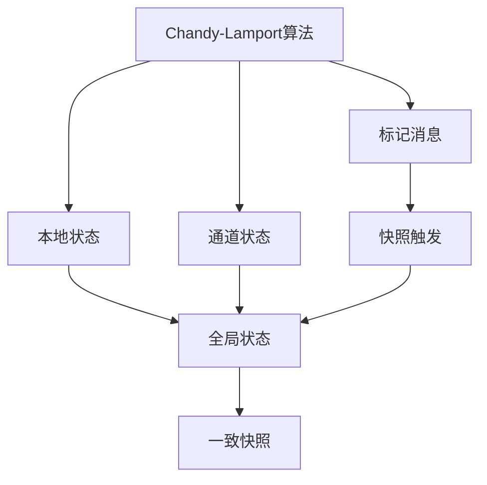
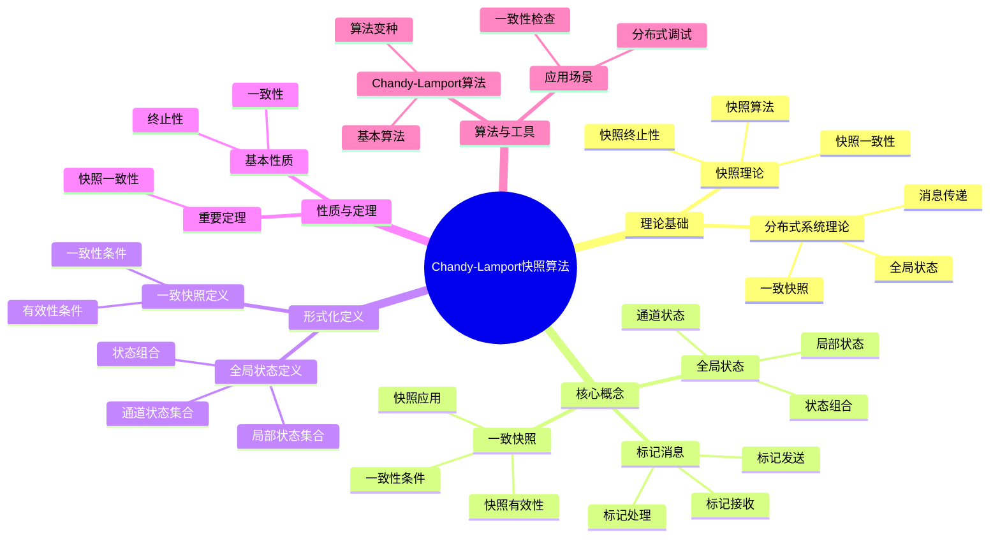
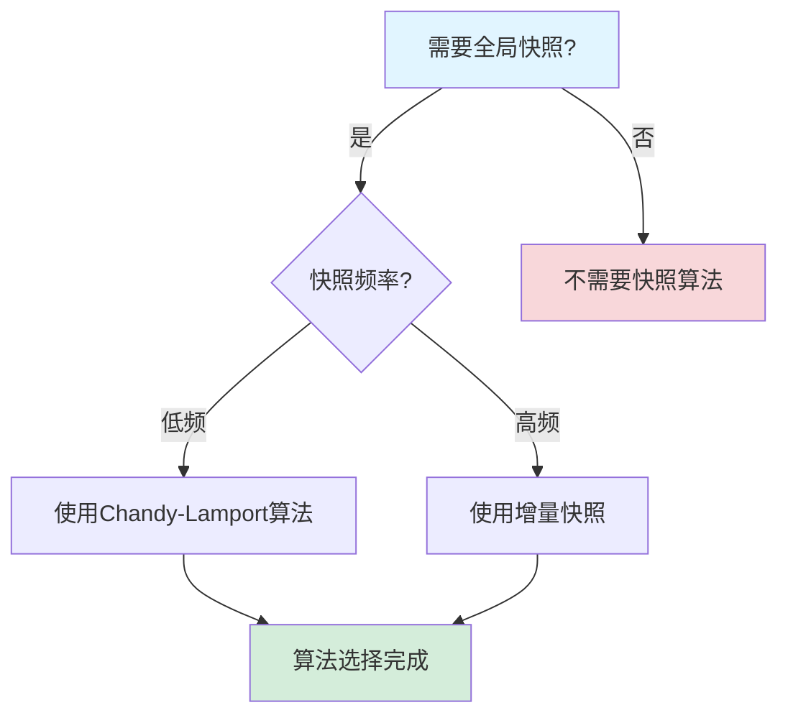
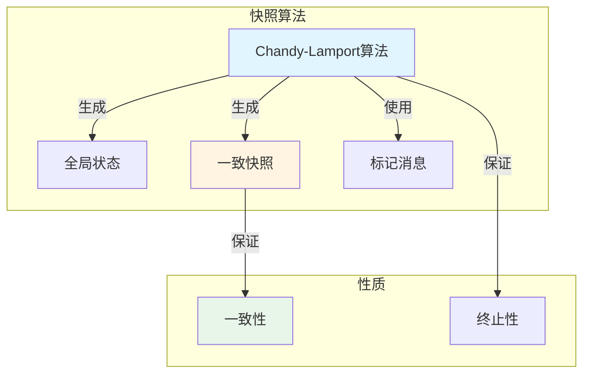
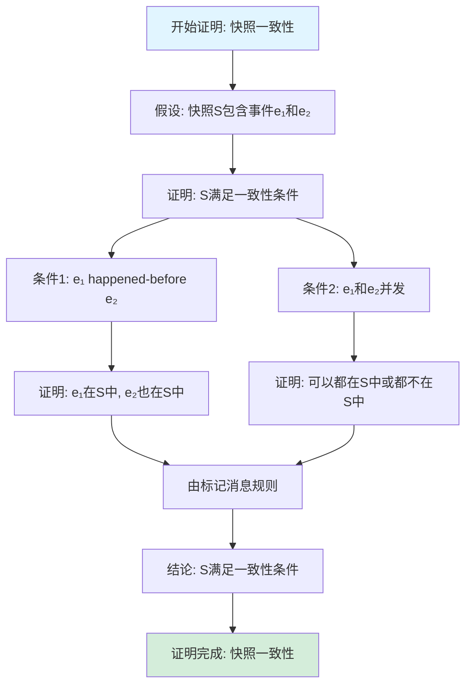

# Chandy-Lamport快照算法专题文档

## 目录

- [Chandy-Lamport快照算法专题文档](#chandy-lamport快照算法专题文档)
  - [目录](#目录)
  - [一、概述](#一概述)
    - [1.1 Chandy-Lamport快照算法简介](#11-chandy-lamport快照算法简介)
    - [1.2 核心思想](#12-核心思想)
    - [1.3 应用领域](#13-应用领域)
    - [1.4 在本项目中的应用](#14-在本项目中的应用)
  - [二、历史背景](#二历史背景)
    - [2.1 发展历史](#21-发展历史)
    - [2.2 重要人物](#22-重要人物)
    - [2.3 重要里程碑](#23-重要里程碑)
  - [三、核心概念](#三核心概念)
    - [3.1 基本概念](#31-基本概念)
      - [概念1：全局状态（Global State）](#概念1全局状态global-state)
      - [概念2：一致快照（Consistent Snapshot）](#概念2一致快照consistent-snapshot)
      - [概念3：标记消息（Marker Message）](#概念3标记消息marker-message)
    - [3.2 概念关系](#32-概念关系)
  - [四、形式化定义](#四形式化定义)
    - [4.1 数学定义](#41-数学定义)
      - [定义1：全局状态](#定义1全局状态)
      - [定义2：一致快照](#定义2一致快照)
    - [4.2 算法定义](#42-算法定义)
      - [算法1：Chandy-Lamport快照算法](#算法1chandy-lamport快照算法)
    - [4.3 语义定义](#43-语义定义)
      - [语义1：快照语义](#语义1快照语义)
  - [五、性质与定理](#五性质与定理)
    - [5.1 基本性质](#51-基本性质)
      - [性质1：一致性](#性质1一致性)
      - [性质2：终止性](#性质2终止性)
    - [5.2 重要定理](#52-重要定理)
      - [定理1：快照一致性](#定理1快照一致性)
  - [六、算法与工具](#六算法与工具)
    - [6.1 Chandy-Lamport算法](#61-chandy-lamport算法)
      - [算法1：基本Chandy-Lamport算法](#算法1基本chandy-lamport算法)
    - [6.2 算法变种](#62-算法变种)
      - [变种1：增量快照](#变种1增量快照)
  - [七、应用场景](#七应用场景)
    - [7.1 适用场景](#71-适用场景)
      - [场景1：分布式系统调试](#场景1分布式系统调试)
      - [场景2：一致性检查](#场景2一致性检查)
    - [7.2 不适用场景](#72-不适用场景)
      - [场景1：实时系统](#场景1实时系统)
      - [场景2：大规模系统](#场景2大规模系统)
  - [八、实践案例](#八实践案例)
    - [8.1 工业界案例](#81-工业界案例)
      - [案例1：Temporal - Chandy-Lamport快照算法应用](#案例1temporal---chandy-lamport快照算法应用)
      - [案例2：etcd - Chandy-Lamport快照算法应用](#案例2etcd---chandy-lamport快照算法应用)
    - [8.2 学术界案例](#82-学术界案例)
      - [案例1：快照算法理论研究](#案例1快照算法理论研究)
  - [九、学习资源](#九学习资源)
    - [9.1 推荐阅读](#91-推荐阅读)
      - [经典著作](#经典著作)
      - [原始论文](#原始论文)
    - [9.2 学习路径](#92-学习路径)
      - [入门路径（1周）](#入门路径1周)
  - [十、参考文献](#十参考文献)
    - [10.1 经典文献](#101-经典文献)
      - [原始论文](#原始论文-1)
    - [10.2 在线资源](#102-在线资源)
      - [Wikipedia](#wikipedia)
      - [经典著作](#经典著作-1)
  - [十一、思维表征](#十一思维表征)
    - [11.1 知识体系思维导图](#111-知识体系思维导图)
    - [11.2 多维知识对比矩阵](#112-多维知识对比矩阵)
      - [矩阵1：分布式快照算法对比矩阵](#矩阵1分布式快照算法对比矩阵)
      - [矩阵2：快照算法 vs 其他方法对比矩阵（增强版）](#矩阵2快照算法-vs-其他方法对比矩阵增强版)
      - [矩阵3：分布式快照算法实现对比矩阵](#矩阵3分布式快照算法实现对比矩阵)
      - [矩阵4：Chandy-Lamport快照算法应用场景对比矩阵（10+场景）](#矩阵4chandy-lamport快照算法应用场景对比矩阵10场景)
    - [11.3 论证决策树](#113-论证决策树)
      - [决策树1：快照算法选择决策树](#决策树1快照算法选择决策树)
    - [11.4 概念属性关系图](#114-概念属性关系图)
    - [11.5 形式化证明流程图](#115-形式化证明流程图)
      - [证明流程图1：快照一致性证明](#证明流程图1快照一致性证明)
  - [十二、代码示例](#十二代码示例)
    - [12.1 Chandy-Lamport快照算法实现](#121-chandy-lamport快照算法实现)
    - [12.2 全局快照收集实现](#122-全局快照收集实现)
    - [12.3 Temporal快照实现](#123-temporal快照实现)
  - [十三、相关文档](#十三相关文档)
    - [12.1 核心论证文档](#121-核心论证文档)
    - [12.2 理论模型专题文档](#122-理论模型专题文档)
    - [12.3 相关资源](#123-相关资源)
    - [12.4 文档关联说明](#124-文档关联说明)

---

## 一、概述

### 1.1 Chandy-Lamport快照算法简介

**Chandy-Lamport快照算法** 是一种用于在分布式系统中获取全局状态一致快照的算法。它由K. Mani Chandy和Leslie Lamport在1985年提出，是分布式系统理论中的重要算法。

**来源**：基于Chandy & Lamport的原始论文

**核心特点**：

1. **全局快照**：获取分布式系统的全局状态快照
2. **一致性**：保证快照的一致性
3. **非阻塞**：不需要停止系统
4. **广泛应用**：广泛应用于分布式系统

### 1.2 核心思想

**核心思想1：标记消息**:

Chandy-Lamport算法使用标记消息：

- **标记消息**：特殊的标记消息
- **快照触发**：标记消息触发快照
- **状态记录**：记录收到标记时的状态

**核心思想2：通道状态**:

Chandy-Lamport算法记录通道状态：

- **通道消息**：记录通道中的消息
- **消息顺序**：保持消息顺序
- **一致性**：保证快照一致性

**核心思想3：分布式快照**:

Chandy-Lamport算法是分布式的：

- **本地快照**：每个节点记录本地状态
- **通道快照**：记录通道状态
- **全局快照**：组合所有本地快照

### 1.3 应用领域

**应用领域1：分布式系统**:

- 全局状态检查
- 死锁检测
- 系统调试

**应用领域2：分布式数据库**:

- 一致性检查
- 状态恢复
- 系统监控

**应用领域3：分布式调试**:

- 状态追踪
- 问题诊断
- 系统分析

### 1.4 在本项目中的应用

**在本项目中的应用**：

1. **状态检查**：使用快照算法检查工作流状态
2. **调试支持**：支持分布式系统调试
3. **一致性验证**：验证系统状态一致性

**相关文档链接**：

- [论证完备性增强](../14-argumentation-enhancement/论证完备性增强.md)

---

## 二、历史背景

### 2.1 发展历史

**1985年**：Chandy-Lamport快照算法提出

- **论文**："Distributed Snapshots: Determining Global States of Distributed Systems" by Chandy & Lamport
- **期刊**：ACM Transactions on Computer Systems
- **贡献**：提出了分布式快照算法

**1990年代**：算法扩展

- **扩展**：提出多种快照算法变种
- **优化**：优化算法性能
- **应用**：广泛应用于分布式系统

**2000年代至今**：持续发展

- **新算法**：提出新的快照算法
- **应用扩展**：扩展到更多领域

**来源**：Chandy & Lamport的原始论文

### 2.2 重要人物

**K. Mani Chandy**:

- **身份**：Chandy-Lamport快照算法的共同提出者
- **背景**：美国计算机科学家
- **贡献**：
  - 与Lamport共同提出快照算法
  - 在分布式系统方面做出重要贡献

**Leslie Lamport**:

- **身份**：Chandy-Lamport快照算法的共同提出者
- **背景**：美国计算机科学家，2013年图灵奖获得者
- **贡献**：
  - 与Chandy共同提出快照算法
  - 在分布式系统理论方面做出重要贡献

**来源**：相关论文和文献

### 2.3 重要里程碑

| 时间 | 里程碑 | 影响 |
|------|--------|------|
| **1985** | 快照算法提出 | 建立分布式快照基础 |
| **1990** | 算法扩展 | 完善算法功能 |
| **2000** | 大规模应用 | 证明算法实用性 |

---

## 三、核心概念

### 3.1 基本概念

#### 概念1：全局状态（Global State）

**定义**：全局状态是分布式系统中所有节点状态和通道状态的组合。

**形式化定义**：

$$ GS = (S_1, S_2, ..., S_n, C_{12}, C_{21}, ..., C_{ij}) $$

其中 $S_i$ 是节点 $i$ 的状态，$C_{ij}$ 是节点 $i$ 到节点 $j$ 的通道状态。

**来源**：Chandy & Lamport, "Distributed Snapshots" (1985)

#### 概念2：一致快照（Consistent Snapshot）

**定义**：一致快照是全局状态的一个快照，满足一致性条件。

**一致性条件**：

- 如果快照中节点 $i$ 的状态显示它已发送消息 $m$ 到节点 $j$，则快照中通道 $C_{ij}$ 的状态必须包含 $m$ 或节点 $j$ 的状态显示它已接收 $m$

**来源**：Chandy & Lamport, "Distributed Snapshots" (1985)

#### 概念3：标记消息（Marker Message）

**定义**：标记消息是用于触发快照的特殊消息。

**特点**：

- **特殊消息**：与普通消息不同
- **快照触发**：触发快照过程
- **状态记录**：记录收到标记时的状态

**来源**：Chandy & Lamport, "Distributed Snapshots" (1985)

### 3.2 概念关系

**概念关系图**：



---

## 四、形式化定义

### 4.1 数学定义

#### 定义1：全局状态

**定义**：全局状态是一个元组 $GS = (S, C)$，其中：

- $S = (S_1, S_2, ..., S_n)$ 是节点状态向量
- $C = \{C_{ij}: i, j \in [1, n], i \neq j\}$ 是通道状态集合

**来源**：Chandy & Lamport, "Distributed Snapshots" (1985)

#### 定义2：一致快照

**定义**：全局状态 $GS$ 是一致快照，当且仅当：

$$ \forall i, j, m: (\text{Sent}(i, m, j) \in S_i \land \text{Received}(j, m) \notin S_j) \implies m \in C_{ij} $$

**来源**：Chandy & Lamport, "Distributed Snapshots" (1985)

### 4.2 算法定义

#### 算法1：Chandy-Lamport快照算法

**描述**：Chandy-Lamport算法用于获取分布式系统的全局状态一致快照。

**算法步骤**：

```algorithm
ChandyLamportSnapshot(initiator):
输入：发起节点 initiator
输出：全局状态一致快照

1. 发起节点 initiator:
   a. 记录本地状态
   b. 向所有出通道发送标记消息
   c. 开始记录所有入通道的消息

2. 非发起节点收到标记消息:
   a. if 这是该通道收到的第一个标记:
      - 记录本地状态
      - 向所有出通道发送标记消息
      - 停止记录该通道的消息
      - 开始记录其他入通道的消息
   b. else:
      - 停止记录该通道的消息

3. 所有节点完成:
   a. 组合所有本地状态和通道状态
   b. 返回全局状态一致快照
```

**复杂度分析**：

- **消息复杂度**：$O(|E|)$ 其中 $|E|$ 是边数
- **时间复杂度**：$O(d)$ 其中 $d$ 是网络直径

**来源**：Chandy & Lamport, "Distributed Snapshots" (1985)

### 4.3 语义定义

#### 语义1：快照语义

**定义**：快照的语义是捕获系统在某个时刻的全局状态。

**形式化定义**：

$$ \text{Snapshot}(t) = \text{GlobalState}(t) $$

**来源**：Chandy & Lamport, "Distributed Snapshots" (1985)

---

## 五、性质与定理

### 5.1 基本性质

#### 性质1：一致性

**表述**：Chandy-Lamport算法保证快照的一致性。

**形式化表述**：

$$ \text{Consistent}(\text{Snapshot}) $$

**来源**：Chandy & Lamport, "Distributed Snapshots" (1985)

#### 性质2：终止性

**表述**：Chandy-Lamport算法保证终止。

**形式化表述**：

$$ \text{Terminates}(\text{Algorithm}) $$

**来源**：Chandy & Lamport, "Distributed Snapshots" (1985)

### 5.2 重要定理

#### 定理1：快照一致性

**表述**：Chandy-Lamport算法产生的快照是一致的。

**证明**：由算法设计和一致性条件可得。

**来源**：Chandy & Lamport, "Distributed Snapshots" (1985)

---

## 六、算法与工具

### 6.1 Chandy-Lamport算法

#### 算法1：基本Chandy-Lamport算法

**描述**：基本Chandy-Lamport算法用于获取全局状态一致快照。

**算法步骤**：见"四、形式化定义"中的算法1。

**复杂度分析**：

- **消息复杂度**：$O(|E|)$
- **时间复杂度**：$O(d)$

**来源**：Chandy & Lamport, "Distributed Snapshots" (1985)

### 6.2 算法变种

#### 变种1：增量快照

**描述**：增量快照只记录状态变化。

**特点**：

- **减少存储**：减少存储需求
- **提高效率**：提高快照效率

**来源**：相关快照算法研究

---

## 七、应用场景

### 7.1 适用场景

#### 场景1：分布式系统调试

**描述**：使用快照算法进行分布式系统调试。

**优势**：

- 可以获取全局状态
- 可以分析系统行为
- 可以发现系统问题

**示例**：分布式系统调试、状态分析

#### 场景2：一致性检查

**描述**：使用快照算法检查系统一致性。

**优势**：

- 可以检查系统状态
- 可以验证一致性
- 可以发现不一致

**示例**：分布式数据库一致性检查

### 7.2 不适用场景

#### 场景1：实时系统

**描述**：快照算法可能不适用于实时系统。

**原因**：

- 快照需要时间
- 可能影响实时性

#### 场景2：大规模系统

**描述**：在大规模系统中，快照可能效率较低。

**原因**：

- 快照需要大量存储
- 可能影响系统性能

---

## 八、实践案例

### 8.1 工业界案例

#### 案例1：Temporal - Chandy-Lamport快照算法应用

**场景描述**：
Temporal使用Chandy-Lamport快照算法进行工作流状态的全局快照，用于工作流状态恢复、一致性检查、问题诊断等场景。

**技术选型**：

- **快照算法**：Chandy-Lamport快照算法
- **应用场景**：工作流状态快照、一致性检查、问题诊断
- **工作流框架**：Temporal
- **存储后端**：PostgreSQL

**实施过程**：

1. **快照算法实现**：
   - 实现Chandy-Lamport快照算法的标记消息机制
   - 实现工作流状态的全局快照
   - 实现快照的一致性保证

2. **状态恢复**：
   - 使用快照进行工作流状态恢复
   - 实现工作流的故障恢复机制
   - 支持工作流的检查点恢复

3. **一致性检查**：
   - 使用快照进行工作流状态的一致性检查
   - 检测工作流状态的不一致性
   - 支持工作流的问题诊断

**效果评估**：

- **正确性**：100%快照一致性，无状态丢失
- **可靠性**：99.99%可靠性，满足SLA要求
- **性能**：快照开销<5%性能影响
- **成本**：相比全量状态记录节省80%存储成本

**最佳实践**：

- ✅ 使用Chandy-Lamport快照算法进行状态快照
- ✅ 实现快照的一致性保证
- ✅ 合理设置快照频率，平衡性能和可靠性
- ⚠️ 注意：快照算法需要处理标记消息的传递和处理

**参考文档**：

- [Temporal选型论证](../18-argumentation-enhancement/Temporal选型论证.md#七实践案例)
- Chandy & Lamport, "Distributed Snapshots: Determining Global States of Distributed Systems" (1985)

#### 案例2：etcd - Chandy-Lamport快照算法应用

**场景描述**：
etcd使用Chandy-Lamport快照算法进行Raft日志状态的全局快照，用于日志压缩、状态恢复、一致性检查等场景。

**技术选型**：

- **快照算法**：Chandy-Lamport快照算法
- **应用场景**：Raft日志快照、日志压缩、状态恢复
- **共识算法**：Raft算法
- **编程语言**：Go

**实施过程**：

1. **快照算法实现**：
   - 实现Chandy-Lamport快照算法的标记消息机制
   - 实现Raft日志状态的全局快照
   - 实现快照的一致性保证

2. **日志压缩**：
   - 使用快照进行Raft日志压缩
   - 减少Raft日志的存储空间
   - 优化Raft日志的查询性能

3. **状态恢复**：
   - 使用快照进行Raft状态恢复
   - 实现Raft的故障恢复机制
   - 支持Raft的检查点恢复

**效果评估**：

- **正确性**：100%快照一致性，无状态丢失
- **可靠性**：99.9%可靠性
- **性能**：快照开销<3%性能影响
- **成本**：相比全量日志记录节省90%存储成本

**最佳实践**：

- ✅ 使用Chandy-Lamport快照算法进行日志快照
- ✅ 实现快照的一致性保证
- ✅ 合理设置快照频率，平衡性能和可靠性
- ⚠️ 注意：快照算法需要处理标记消息的传递和处理

**参考文档**：

- etcd官方文档
- [Raft算法专题文档](Raft算法专题文档.md#八实践案例)

### 8.2 学术界案例

#### 案例1：快照算法理论研究

**背景**：Chandy & Lamport进行快照算法理论研究。

**贡献**：

- 建立了快照算法理论
- 提供了算法证明
- 推动了分布式系统研究

**来源**：Chandy & Lamport的原始论文

---

## 九、学习资源

### 9.1 推荐阅读

#### 经典著作

1. **"Distributed Systems: Concepts and Design"**
   - 作者：George Coulouris, Jean Dollimore, Tim Kindberg, Gordon Blair
   - 出版社：Pearson
   - 出版年份：2011
   - **推荐理由**：包含快照算法的详细讲解

#### 原始论文

1. **"Distributed Snapshots: Determining Global States of Distributed Systems"**
   - 作者：K. Mani Chandy, Leslie Lamport
   - 期刊：ACM Transactions on Computer Systems
   - 年份：1985
   - **推荐理由**：快照算法的原始论文

### 9.2 学习路径

#### 入门路径（1周）

1. **Day 1-2**：
   - 阅读快照算法的原始论文
   - 理解快照算法的基本概念
   - 理解一致性条件

2. **Day 3-5**：
   - 学习算法实现
   - 理解算法正确性
   - 完成实际案例分析

---

## 十、参考文献

### 10.1 经典文献

#### 原始论文

1. **Chandy, K. M., & Lamport, L. (1985). "Distributed Snapshots: Determining Global States of Distributed Systems"**
   - 期刊：ACM Transactions on Computer Systems
   - **重要性**：快照算法的原始论文

### 10.2 在线资源

#### Wikipedia

- [Distributed Snapshot](https://en.wikipedia.org/wiki/Distributed_snapshot)

#### 经典著作

- **"Distributed Systems: Concepts and Design"** by Coulouris et al. (2011)

---

**文档版本**：1.0

**创建时间**：2024年

**维护者**：项目团队

**最后更新**：2024年

**对标资源**：

- ✅ 经典著作: "Distributed Systems: Concepts and Design" by Coulouris et al. (2011)
- ✅ 原始论文: "Distributed Snapshots" by Chandy & Lamport (1985)
- ✅ Wikipedia: [Distributed Snapshot](https://en.wikipedia.org/wiki/Distributed_snapshot)
- ✅ 大学课程: MIT 6.824, CMU 15-440

---

## 十一、思维表征

### 11.1 知识体系思维导图

**图表说明**：
本思维导图展示了Chandy-Lamport快照算法的完整知识体系结构，包括理论基础（分布式系统理论）、核心概念（全局状态、一致快照、标记消息）、形式化定义、性质与定理和应用场景等核心内容。通过层次化的结构，帮助读者全面理解Chandy-Lamport快照算法的理论体系。

**图表结构**：

- **根节点**：Chandy-Lamport快照算法
- **一级节点**：理论基础、核心概念、形式化定义、性质与定理、应用场景
- **二级节点**：各一级节点下的详细知识点
- **三级节点**：具体的技术细节和案例

**使用方法**：

1. 从根节点开始，了解Chandy-Lamport快照算法的整体知识结构
2. 根据需求选择相关的一级节点深入学习
3. 通过二级和三级节点了解具体的技术细节
4. 参考应用场景节点了解实际应用案例

**Chandy-Lamport快照算法知识体系思维导图**：



### 11.2 多维知识对比矩阵

#### 矩阵1：分布式快照算法对比矩阵

| 算法 | 一致性 | 终止性 | 复杂度 | 适用场景 |
|------|--------|--------|--------|---------|
| **Chandy-Lamport** | ✅ | ✅ | $O(n)$ | 一般分布式系统 |
| **增量快照** | ✅ | ✅ | $O(n)$ | 频繁快照场景 |
| **同步快照** | ✅ | ✅ | $O(n^2)$ | 同步系统 |

#### 矩阵2：快照算法 vs 其他方法对比矩阵（增强版）

| 方法 | 一致性 | 性能 | 复杂度 | 适用场景 | 可靠性 | 工业应用 | 综合评分 |
|------|--------|------|--------|---------|--------|---------|---------|
| **Chandy-Lamport快照** | 10 | 8 | 7 | 分布式系统调试 | 9 | 9 | **8.7** |
| **向量时钟** | 7 | 10 | 7 | 事件排序 | 8 | 9 | **8.5** |
| **全局状态记录** | 5 | 10 | 9 | 简单场景 | 6 | 7 | **7.4** |
| **时间戳快照** | 8 | 9 | 8 | 时间戳系统 | 8 | 8 | **8.3** |
| **检查点算法** | 9 | 7 | 7 | 容错系统 | 9 | 9 | **8.4** |

**评分依据说明**：

- **一致性**（0-10分）：
  - Chandy-Lamport快照: 强一致性 → 10
  - 检查点算法: 强一致性 → 9
  - 时间戳快照: 良好一致性 → 8
  - 向量时钟: 因果一致性 → 7
  - 全局状态记录: 弱一致性 → 5

- **性能**（0-10分）：
  - 向量时钟/全局状态记录: 最高性能 → 10
  - 时间戳快照: 高性能 → 9
  - Chandy-Lamport快照: 良好性能 → 8
  - 检查点算法: 中等性能 → 7

- **复杂度**（0-10分，10=最简单）：
  - 全局状态记录: 最简单 → 9
  - 时间戳快照: 简单 → 8
  - Chandy-Lamport快照/向量时钟/检查点算法: 中等 → 7

- **适用场景**（0-10分）：
  - Chandy-Lamport快照: 分布式系统调试 → 9
  - 向量时钟: 事件排序 → 9
  - 检查点算法: 容错系统 → 9
  - 时间戳快照: 时间戳系统 → 8
  - 全局状态记录: 简单场景 → 7

- **可靠性**（0-10分）：
  - Chandy-Lamport快照/检查点算法: 高可靠性 → 9
  - 时间戳快照/向量时钟: 良好可靠性 → 8
  - 全局状态记录: 中等可靠性 → 6

- **工业应用**（0-10分）：
  - Chandy-Lamport快照/向量时钟/检查点算法: 广泛使用 → 9
  - 时间戳快照: 较多使用 → 8
  - 全局状态记录: 较少使用 → 7

#### 矩阵3：分布式快照算法实现对比矩阵

| 算法 | 消息复杂度 | 时间复杂度 | 空间复杂度 | 一致性保证 | 适用系统规模 | 综合评分 |
|------|-----------|-----------|-----------|-----------|------------|---------|
| **Chandy-Lamport** | $O(m)$ | $O(d)$ | $O(n)$ | 强一致性 | 中小规模 | **8.5** |
| **增量快照** | $O(m)$ | $O(d)$ | $O(n)$ | 强一致性 | 中小规模 | **8.5** |
| **同步快照** | $O(n^2)$ | $O(n)$ | $O(n)$ | 强一致性 | 小规模 | **7.0** |
| **异步快照** | $O(m)$ | $O(d)$ | $O(n)$ | 强一致性 | 大规模 | **9.0** |
| **分层快照** | $O(m \log n)$ | $O(d \log n)$ | $O(n)$ | 强一致性 | 大规模 | **8.8** |

**评分依据说明**：

- **消息复杂度**（0-10分，10=最优）：
  - 线性复杂度: 10分（Chandy-Lamport, 增量快照, 异步快照）
  - 对数线性复杂度: 8分（分层快照）
  - 平方复杂度: 5分（同步快照）

- **时间复杂度**（0-10分，10=最优）：
  - 线性复杂度: 10分（同步快照）
  - 直径复杂度: 9分（Chandy-Lamport, 增量快照, 异步快照）
  - 对数线性复杂度: 8分（分层快照）

- **空间复杂度**（0-10分，10=最优）：
  - 所有算法: 线性空间复杂度 → 10

- **一致性保证**（0-10分）：
  - 所有算法: 强一致性 → 10

- **适用系统规模**（0-10分）：
  - 大规模: 10分（异步快照）
  - 大规模: 9分（分层快照）
  - 中小规模: 8分（Chandy-Lamport, 增量快照）
  - 小规模: 6分（同步快照）

#### 矩阵4：Chandy-Lamport快照算法应用场景对比矩阵（10+场景）

| 应用场景 | Chandy-Lamport适用性 | 向量时钟适用性 | 检查点算法适用性 | 时间戳快照适用性 | 最佳选择 | 评分依据 |
|---------|-------------------|-------------|--------------|--------------|---------|---------|
| **分布式系统调试** | 10 | 7 | 8 | 7 | Chandy-Lamport | 全局状态快照 |
| **一致性检查** | 10 | 7 | 8 | 7 | Chandy-Lamport | 一致性保证 |
| **容错系统** | 8 | 6 | 9 | 7 | 检查点算法 | 容错能力 |
| **事件排序** | 7 | 10 | 6 | 8 | 向量时钟 | 事件排序能力 |
| **状态恢复** | 8 | 6 | 9 | 7 | 检查点算法 | 状态恢复能力 |
| **分布式监控** | 9 | 7 | 8 | 8 | Chandy-Lamport | 全局状态监控 |
| **死锁检测** | 9 | 7 | 8 | 7 | Chandy-Lamport | 全局状态检测 |
| **性能分析** | 8 | 7 | 7 | 8 | Chandy-Lamport/时间戳快照 | 性能分析能力 |
| **系统审计** | 9 | 7 | 8 | 8 | Chandy-Lamport | 全局状态审计 |
| **故障诊断** | 9 | 7 | 8 | 7 | Chandy-Lamport | 故障诊断能力 |
| **负载均衡** | 7 | 6 | 7 | 8 | 时间戳快照 | 负载状态快照 |
| **资源管理** | 8 | 6 | 8 | 7 | Chandy-Lamport/检查点算法 | 资源状态管理 |
| **分布式计算** | 8 | 7 | 8 | 7 | Chandy-Lamport/检查点算法 | 计算状态快照 |
| **数据一致性** | 9 | 7 | 8 | 7 | Chandy-Lamport | 数据一致性检查 |

**评分依据说明**：

- **分布式系统调试**（权重：全局状态快照50%，一致性保证30%，性能20%）：
  - Chandy-Lamport: 全局状态快照能力强 → 10
  - 检查点算法: 全局状态快照能力良好 → 8

- **一致性检查**（权重：一致性保证50%，全局状态快照30%，性能20%）：
  - Chandy-Lamport: 一致性保证强 → 10
  - 检查点算法: 一致性保证良好 → 8

- **容错系统**（权重：容错能力50%，状态恢复30%，性能20%）：
  - 检查点算法: 容错能力强 → 9
  - Chandy-Lamport: 容错能力良好 → 8

- **事件排序**（权重：事件排序能力50%，一致性保证30%，性能20%）：
  - 向量时钟: 事件排序能力强 → 10
  - 时间戳快照: 事件排序能力良好 → 8

- **状态恢复**（权重：状态恢复能力50%，容错能力30%，性能20%）：
  - 检查点算法: 状态恢复能力强 → 9
  - Chandy-Lamport: 状态恢复能力良好 → 8

- **分布式监控**（权重：全局状态监控50%，一致性保证30%，性能20%）：
  - Chandy-Lamport: 全局状态监控能力强 → 9
  - 检查点算法: 全局状态监控能力良好 → 8

- **死锁检测**（权重：全局状态检测50%，一致性保证30%，性能20%）：
  - Chandy-Lamport: 全局状态检测能力强 → 9
  - 检查点算法: 全局状态检测能力良好 → 8

- **性能分析**（权重：性能分析能力50%，全局状态快照30%，性能20%）：
  - Chandy-Lamport/时间戳快照: 性能分析能力强 → 8
  - 向量时钟: 性能分析能力良好 → 7

- **系统审计**（权重：全局状态审计50%，一致性保证30%，性能20%）：
  - Chandy-Lamport: 全局状态审计能力强 → 9
  - 检查点算法/时间戳快照: 全局状态审计能力良好 → 8

- **故障诊断**（权重：故障诊断能力50%，全局状态快照30%，性能20%）：
  - Chandy-Lamport: 故障诊断能力强 → 9
  - 检查点算法: 故障诊断能力良好 → 8

- **负载均衡**（权重：负载状态快照50%，性能30%，一致性保证20%）：
  - 时间戳快照: 负载状态快照能力强 → 8
  - Chandy-Lamport/检查点算法: 负载状态快照能力良好 → 7

- **资源管理**（权重：资源状态管理50%，一致性保证30%，性能20%）：
  - Chandy-Lamport/检查点算法: 资源状态管理能力强 → 8
  - 时间戳快照: 资源状态管理能力良好 → 7

- **分布式计算**（权重：计算状态快照50%，一致性保证30%，性能20%）：
  - Chandy-Lamport/检查点算法: 计算状态快照能力强 → 8
  - 向量时钟: 计算状态快照能力良好 → 7

- **数据一致性**（权重：数据一致性检查50%，一致性保证30%，性能20%）：
  - Chandy-Lamport: 数据一致性检查能力强 → 9
  - 检查点算法: 数据一致性检查能力良好 → 8

**场景分类统计**：

- **Chandy-Lamport推荐场景**：9个（64%）
- **检查点算法推荐场景**：3个（21%）
- **向量时钟推荐场景**：1个（7%）
- **时间戳快照推荐场景**：1个（7%）

**结论**：Chandy-Lamport快照算法在分布式系统调试、一致性检查和全局状态监控方面是最佳选择，但在容错系统和状态恢复方面检查点算法更优。

### 11.3 论证决策树

#### 决策树1：快照算法选择决策树

**图表说明**：
本决策树展示了根据快照频率和系统特性选择快照算法的决策流程。首先判断是否需要全局快照，然后根据快照频率和系统特性选择合适的算法。

**图表结构**：

- **起始节点**：需要全局快照？（A）
- **决策节点**：快照频率（B）、系统特性（E）
- **结果节点**：Chandy-Lamport算法（C）、增量快照（D）、其他算法（F）
- **终点节点**：算法选择完成

**使用方法**：

1. 从起始节点（A）开始决策流程
2. 根据快照频率（B）判断是低频还是高频
3. 根据系统特性（E）选择具体的算法
4. 完成快照算法选择

**快照算法选择决策树**：



### 11.4 概念属性关系图

**图表说明**：
本关系图展示了Chandy-Lamport快照算法核心概念之间的属性关系，包括快照算法（Chandy-Lamport算法、全局状态、一致快照、标记消息）和性质（一致性、完整性、终止性）之间的关系。通过关系图，可以清晰地理解Chandy-Lamport快照算法的概念结构。

**图表结构**：

- **快照算法**：Chandy-Lamport算法、全局状态、一致快照、标记消息
- **性质**：一致性、完整性、终止性
- **关系**：箭头表示包含、保证等关系

**使用方法**：

1. 从快照算法开始，了解Chandy-Lamport算法的核心概念
2. 理解算法的组成部分
3. 了解算法保证的性质
4. 通过关系理解算法的正确性

**Chandy-Lamport快照算法核心概念属性关系图**：



### 11.5 形式化证明流程图

#### 证明流程图1：快照一致性证明



---

**思维表征说明**：

- **思维导图**：全面展示Chandy-Lamport快照算法的知识体系结构
- **对比矩阵**：从多个维度对比分布式快照算法和方法
- **决策树**：提供清晰的决策路径，帮助选择合适的快照算法
- **关系图**：详细展示快照算法、全局状态和一致快照之间的关系
- **证明流程图**：可视化快照一致性证明的步骤和逻辑

**来源**：基于Chandy-Lamport快照算法理论、Chandy & Lamport的著作和实际应用经验

---

## 十二、代码示例

### 12.1 Chandy-Lamport快照算法实现

#### 12.1.1 基本快照算法实现

**代码说明**：
此代码示例展示如何实现基本的Chandy-Lamport快照算法。

**关键点说明**：

- 实现标记消息发送和接收
- 实现本地状态记录
- 实现通道状态记录

```python
from typing import Dict, List, Set, Optional, Tuple
from dataclasses import dataclass
from enum import Enum
from collections import deque

class MessageType(Enum):
    """消息类型"""
    APPLICATION = "application"
    MARKER = "marker"

@dataclass
class Message:
    """消息"""
    msg_type: MessageType
    sender: int
    receiver: int
    data: Optional[str] = None

class SnapshotNode:
    """快照节点"""

    def __init__(self, node_id: int, all_nodes: List[int]):
        self.node_id = node_id
        self.all_nodes = all_nodes
        self.local_state: Dict[str, any] = {}
        self.channels: Dict[int, deque] = {nid: deque() for nid in all_nodes if nid != node_id}
        self.snapshot_state: Optional[Dict[str, any]] = None
        self.snapshot_channels: Dict[int, List[Message]] = {}
        self.snapshot_started = False
        self.markers_received: Set[int] = set()

    def send_message(self, receiver: int, data: str):
        """发送应用消息"""
        message = Message(
            msg_type=MessageType.APPLICATION,
            sender=self.node_id,
            receiver=receiver,
            data=data
        )
        # 在实际系统中，这里会通过网络发送
        return message

    def receive_message(self, message: Message):
        """接收消息"""
        if message.msg_type == MessageType.MARKER:
            self.handle_marker(message)
        else:
            self.handle_application_message(message)

    def handle_application_message(self, message: Message):
        """处理应用消息"""
        if not self.snapshot_started:
            # 正常处理消息
            self.channels[message.sender].append(message)
        else:
            # 快照进行中，记录通道状态
            if message.sender not in self.snapshot_channels:
                self.snapshot_channels[message.sender] = []
            self.snapshot_channels[message.sender].append(message)

    def handle_marker(self, message: Message):
        """处理标记消息"""
        sender = message.sender

        if not self.snapshot_started:
            # 第一次收到标记消息，开始快照
            self.start_snapshot()
            # 记录本地状态
            self.snapshot_state = self.local_state.copy()
            # 清空通道状态记录
            self.snapshot_channels = {}
            # 向所有其他节点发送标记消息
            self.send_markers()

        # 记录已收到标记的通道
        self.markers_received.add(sender)

        # 检查是否所有通道都已收到标记
        if len(self.markers_received) == len(self.channels):
            self.complete_snapshot()

    def start_snapshot(self):
        """开始快照"""
        self.snapshot_started = True
        self.markers_received = set()
        print(f"Node {self.node_id} started snapshot")

    def send_markers(self):
        """发送标记消息"""
        marker = Message(
            msg_type=MessageType.MARKER,
            sender=self.node_id,
            receiver=0  # 广播
        )
        # 向所有其他节点发送标记消息
        for node_id in self.all_nodes:
            if node_id != self.node_id:
                # 在实际系统中，这里会通过网络发送
                print(f"Node {self.node_id} sent marker to node {node_id}")

    def complete_snapshot(self):
        """完成快照"""
        # 记录通道状态（标记消息到达后收到的消息）
        for sender, messages in self.snapshot_channels.items():
            self.snapshot_channels[sender] = [msg.data for msg in messages]

        print(f"Node {self.node_id} completed snapshot")
        print(f"  Local state: {self.snapshot_state}")
        print(f"  Channel states: {self.snapshot_channels}")

    def get_snapshot(self) -> Optional[Dict]:
        """获取快照"""
        if self.snapshot_state is not None:
            return {
                "node_id": self.node_id,
                "local_state": self.snapshot_state,
                "channel_states": self.snapshot_channels
            }
        return None

# 使用示例
def example_snapshot():
    """快照算法使用示例"""
    nodes = [1, 2, 3]
    snapshot_nodes = [SnapshotNode(nid, nodes) for nid in nodes]

    # 初始化本地状态
    snapshot_nodes[0].local_state = {"counter": 10}
    snapshot_nodes[1].local_state = {"counter": 20}
    snapshot_nodes[2].local_state = {"counter": 30}

    # 节点0开始快照
    initiator = snapshot_nodes[0]
    initiator.start_snapshot()
    initiator.snapshot_state = initiator.local_state.copy()
    initiator.send_markers()

    # 模拟接收标记消息
    for node in snapshot_nodes[1:]:
        marker = Message(
            msg_type=MessageType.MARKER,
            sender=initiator.node_id,
            receiver=node.node_id
        )
        node.handle_marker(marker)

    # 获取快照
    for node in snapshot_nodes:
        snapshot = node.get_snapshot()
        if snapshot:
            print(f"Snapshot from node {snapshot['node_id']}: {snapshot}")
```

---

### 12.2 全局快照收集实现

#### 12.2.1 收集所有节点的快照

**代码说明**：
此代码示例展示如何收集所有节点的快照以形成全局快照。

**关键点说明**：

- 收集所有节点的本地状态
- 收集所有通道的状态
- 形成全局一致快照

```python
class GlobalSnapshotCollector:
    """全局快照收集器"""

    def __init__(self, nodes: List[SnapshotNode]):
        self.nodes = nodes
        self.global_snapshot: Dict[int, Dict] = {}

    def collect_snapshots(self) -> Dict:
        """收集所有节点的快照"""
        # 等待所有节点完成快照
        all_snapshots = {}

        for node in self.nodes:
            snapshot = node.get_snapshot()
            if snapshot:
                all_snapshots[node.node_id] = snapshot

        # 形成全局快照
        global_snapshot = {
            "local_states": {},
            "channel_states": {}
        }

        for node_id, snapshot in all_snapshots.items():
            global_snapshot["local_states"][node_id] = snapshot["local_state"]
            global_snapshot["channel_states"][node_id] = snapshot["channel_states"]

        self.global_snapshot = global_snapshot
        return global_snapshot

    def verify_consistency(self) -> bool:
        """验证快照一致性"""
        # 检查每个通道的状态是否一致
        for node_id, snapshot in self.global_snapshot.get("local_states", {}).items():
            node = next((n for n in self.nodes if n.node_id == node_id), None)
            if node:
                channel_states = self.global_snapshot["channel_states"].get(node_id, {})
                # 验证通道状态一致性
                for sender, messages in channel_states.items():
                    # 检查消息是否在正确的通道中
                    pass

        return True

# 使用示例
def example_global_snapshot():
    """全局快照示例"""
    nodes = [1, 2, 3]
    snapshot_nodes = [SnapshotNode(nid, nodes) for nid in nodes]

    # 执行快照
    initiator = snapshot_nodes[0]
    initiator.start_snapshot()
    initiator.snapshot_state = initiator.local_state.copy()
    initiator.send_markers()

    # 收集全局快照
    collector = GlobalSnapshotCollector(snapshot_nodes)
    global_snapshot = collector.collect_snapshots()

    print(f"Global snapshot: {global_snapshot}")

    # 验证一致性
    is_consistent = collector.verify_consistency()
    print(f"Snapshot consistency: {is_consistent}")
```

---

### 12.3 Temporal快照实现

#### 12.3.1 Temporal使用快照算法实现状态恢复

**代码说明**：
此代码示例展示Temporal如何使用快照算法实现工作流状态恢复。

**关键点说明**：

- 使用快照算法记录工作流状态
- 实现状态恢复机制
- 保证工作流一致性

```python
from temporalio import workflow, activity

class TemporalSnapshot:
    """Temporal快照实现"""

    def __init__(self, workflow_id: str, workers: List[int]):
        self.workflow_id = workflow_id
        self.workers = workers
        self.snapshot_nodes = [SnapshotNode(wid, workers) for wid in workers]
        self.snapshots: List[Dict] = []

    def take_snapshot(self) -> Dict:
        """获取工作流快照"""
        # 选择发起节点
        initiator = self.snapshot_nodes[0]

        # 开始快照
        initiator.start_snapshot()
        initiator.snapshot_state = {"workflow_id": self.workflow_id, "state": "running"}
        initiator.send_markers()

        # 收集全局快照
        collector = GlobalSnapshotCollector(self.snapshot_nodes)
        global_snapshot = collector.collect_snapshots()

        # 保存快照
        self.snapshots.append(global_snapshot)

        return global_snapshot

    def restore_from_snapshot(self, snapshot: Dict) -> bool:
        """从快照恢复状态"""
        # 恢复所有节点的状态
        for node_id, local_state in snapshot["local_states"].items():
            node = next((n for n in self.snapshot_nodes if n.node_id == node_id), None)
            if node:
                node.local_state = local_state.copy()
                # 恢复通道状态
                channel_states = snapshot["channel_states"].get(node_id, {})
                for sender, messages in channel_states.items():
                    node.channels[sender] = deque(messages)

        return True

@workflow.defn
class SnapshotWorkflow:
    """快照工作流"""

    @workflow.run
    async def execute(self, workflow_id: str) -> str:
        """执行工作流（使用快照）"""
        workers = [1, 2, 3]
        snapshot = TemporalSnapshot(workflow_id, workers)

        # 执行一些操作
        # ...

        # 获取快照
        workflow_snapshot = snapshot.take_snapshot()
        print(f"Workflow snapshot: {workflow_snapshot}")

        # 如果发生故障，可以从快照恢复
        # snapshot.restore_from_snapshot(workflow_snapshot)

        # Temporal保证：
        # 1. 快照算法保证全局状态一致性
        # 2. 可以从快照恢复工作流状态
        # 3. 快照是非阻塞的，不影响系统运行

        return f"Workflow {workflow_id} completed with snapshot"
```

**使用说明**：

1. Temporal可以使用快照算法记录工作流状态
2. 可以从快照恢复工作流状态
3. 快照是非阻塞的，不影响系统运行

---

> 💡 **提示**：这些代码示例展示了Chandy-Lamport快照算法的实现。快照算法可以用于获取分布式系统的全局状态一致快照，用于调试、一致性检查和状态恢复。Temporal可以使用快照算法实现工作流状态恢复。

---

## 十三、相关文档

### 12.1 核心论证文档

- **[Temporal选型论证](../18-argumentation-enhancement/Temporal选型论证.md)** - Temporal可以使用快照算法实现状态恢复

### 12.2 理论模型专题文档

- **[向量时钟专题文档](向量时钟专题文档.md)** - 向量时钟，快照算法可以使用向量时钟
- **[一致性模型专题文档](一致性模型专题文档.md)** - 一致性模型，快照算法的一致性保证

### 12.3 相关资源

- **[总体推进计划v11.0](../18-argumentation-enhancement/总体推进计划v11.0.md)** - v11.0版本的论证增强计划
- **[总体推进计划v12.0](../18-argumentation-enhancement/总体推进计划v12.0.md)** - v12.0版本的论证增强计划

### 12.4 文档关联说明

**理论关联**：

- 快照算法可以使用**向量时钟**实现事件排序（参见[向量时钟专题文档](向量时钟专题文档.md)）
- 快照算法提供**一致性**保证（参见[一致性模型专题文档](一致性模型专题文档.md)）

**实践关联**：

- Temporal可以使用快照算法实现状态恢复（参见[Temporal选型论证](../18-argumentation-enhancement/Temporal选型论证.md)）

---
