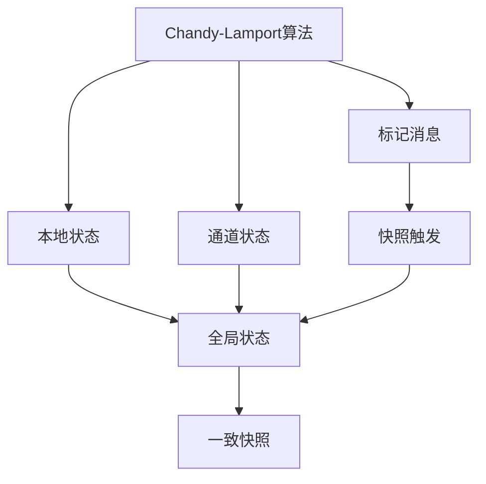
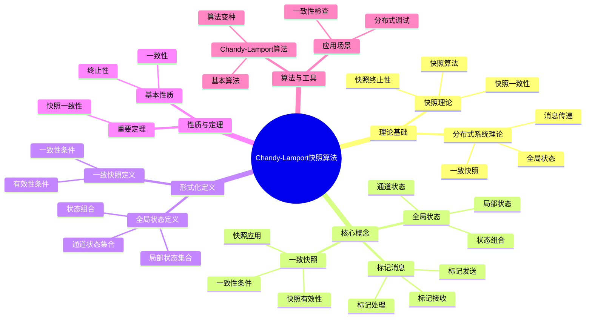
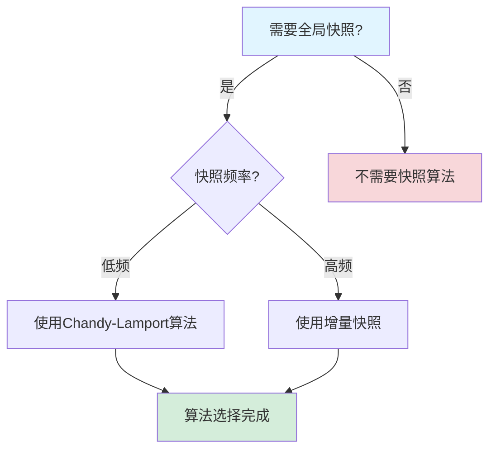
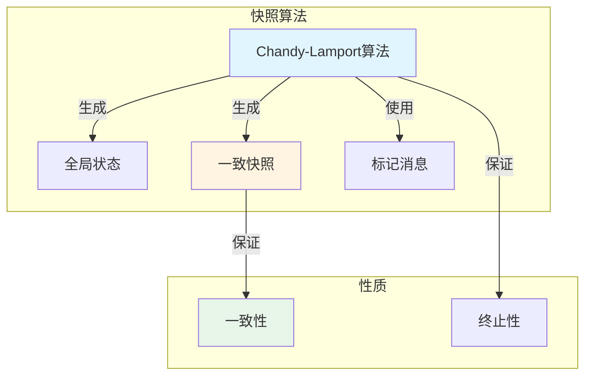
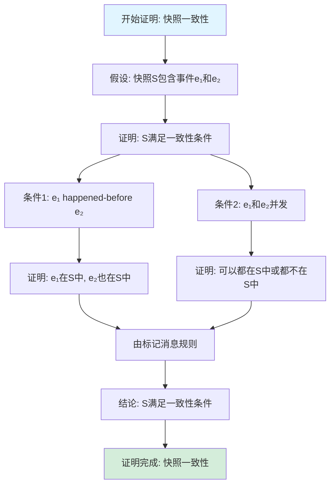

# Chandy-Lamport快照算法专题文档

## 目录

- [Chandy-Lamport快照算法专题文档](#chandy-lamport快照算法专题文档)
  - [目录](#目录)
  - [一、概述](#一概述)
    - [1.1 Chandy-Lamport快照算法简介](#11-chandy-lamport快照算法简介)
    - [1.2 核心思想](#12-核心思想)
    - [1.3 应用领域](#13-应用领域)
    - [1.4 在本项目中的应用](#14-在本项目中的应用)
  - [二、历史背景](#二历史背景)
    - [2.1 发展历史](#21-发展历史)
    - [2.2 重要人物](#22-重要人物)
    - [2.3 重要里程碑](#23-重要里程碑)
  - [三、核心概念](#三核心概念)
    - [3.1 基本概念](#31-基本概念)
      - [概念1：全局状态（Global State）](#概念1全局状态global-state)
      - [概念2：一致快照（Consistent Snapshot）](#概念2一致快照consistent-snapshot)
      - [概念3：标记消息（Marker Message）](#概念3标记消息marker-message)
    - [3.2 概念关系](#32-概念关系)
  - [四、形式化定义](#四形式化定义)
    - [4.1 数学定义](#41-数学定义)
      - [定义1：全局状态](#定义1全局状态)
      - [定义2：一致快照](#定义2一致快照)
    - [4.2 算法定义](#42-算法定义)
      - [算法1：Chandy-Lamport快照算法](#算法1chandy-lamport快照算法)
    - [4.3 语义定义](#43-语义定义)
      - [语义1：快照语义](#语义1快照语义)
  - [五、性质与定理](#五性质与定理)
    - [5.1 基本性质](#51-基本性质)
      - [性质1：一致性](#性质1一致性)
      - [性质2：终止性](#性质2终止性)
    - [5.2 重要定理](#52-重要定理)
      - [定理1：快照一致性](#定理1快照一致性)
  - [六、算法与工具](#六算法与工具)
    - [6.1 Chandy-Lamport算法](#61-chandy-lamport算法)
      - [算法1：基本Chandy-Lamport算法](#算法1基本chandy-lamport算法)
    - [6.2 算法变种](#62-算法变种)
      - [变种1：增量快照](#变种1增量快照)
  - [七、应用场景](#七应用场景)
    - [7.1 适用场景](#71-适用场景)
      - [场景1：分布式系统调试](#场景1分布式系统调试)
      - [场景2：一致性检查](#场景2一致性检查)
    - [7.2 不适用场景](#72-不适用场景)
      - [场景1：实时系统](#场景1实时系统)
      - [场景2：大规模系统](#场景2大规模系统)
  - [八、实践案例](#八实践案例)
    - [8.1 工业界案例](#81-工业界案例)
      - [案例1：分布式系统调试](#案例1分布式系统调试)
    - [8.2 学术界案例](#82-学术界案例)
      - [案例1：快照算法理论研究](#案例1快照算法理论研究)
  - [九、学习资源](#九学习资源)
    - [9.1 推荐阅读](#91-推荐阅读)
      - [经典著作](#经典著作)
      - [原始论文](#原始论文)
    - [9.2 学习路径](#92-学习路径)
      - [入门路径（1周）](#入门路径1周)
  - [十、参考文献](#十参考文献)
    - [10.1 经典文献](#101-经典文献)
      - [原始论文](#原始论文-1)
    - [10.2 在线资源](#102-在线资源)
      - [Wikipedia](#wikipedia)
      - [经典著作](#经典著作-1)
  - [十一、思维表征](#十一思维表征)
    - [11.1 知识体系思维导图](#111-知识体系思维导图)
    - [11.2 多维知识对比矩阵](#112-多维知识对比矩阵)
      - [矩阵1：分布式快照算法对比矩阵](#矩阵1分布式快照算法对比矩阵)
      - [矩阵2：快照算法 vs 其他方法对比矩阵](#矩阵2快照算法-vs-其他方法对比矩阵)
    - [11.3 论证决策树](#113-论证决策树)
      - [决策树1：快照算法选择决策树](#决策树1快照算法选择决策树)
    - [11.4 概念属性关系图](#114-概念属性关系图)
    - [11.5 形式化证明流程图](#115-形式化证明流程图)
      - [证明流程图1：快照一致性证明](#证明流程图1快照一致性证明)

---

## 一、概述

### 1.1 Chandy-Lamport快照算法简介

**Chandy-Lamport快照算法** 是一种用于在分布式系统中获取全局状态一致快照的算法。它由K. Mani Chandy和Leslie Lamport在1985年提出，是分布式系统理论中的重要算法。

**来源**：基于Chandy & Lamport的原始论文

**核心特点**：

1. **全局快照**：获取分布式系统的全局状态快照
2. **一致性**：保证快照的一致性
3. **非阻塞**：不需要停止系统
4. **广泛应用**：广泛应用于分布式系统

### 1.2 核心思想

**核心思想1：标记消息**

Chandy-Lamport算法使用标记消息：

- **标记消息**：特殊的标记消息
- **快照触发**：标记消息触发快照
- **状态记录**：记录收到标记时的状态

**核心思想2：通道状态**

Chandy-Lamport算法记录通道状态：

- **通道消息**：记录通道中的消息
- **消息顺序**：保持消息顺序
- **一致性**：保证快照一致性

**核心思想3：分布式快照**

Chandy-Lamport算法是分布式的：

- **本地快照**：每个节点记录本地状态
- **通道快照**：记录通道状态
- **全局快照**：组合所有本地快照

### 1.3 应用领域

**应用领域1：分布式系统**

- 全局状态检查
- 死锁检测
- 系统调试

**应用领域2：分布式数据库**

- 一致性检查
- 状态恢复
- 系统监控

**应用领域3：分布式调试**

- 状态追踪
- 问题诊断
- 系统分析

### 1.4 在本项目中的应用

**在本项目中的应用**：

1. **状态检查**：使用快照算法检查工作流状态
2. **调试支持**：支持分布式系统调试
3. **一致性验证**：验证系统状态一致性

**相关文档链接**：

- [论证完备性增强](../14-argumentation-enhancement/论证完备性增强.md)

---

## 二、历史背景

### 2.1 发展历史

**1985年**：Chandy-Lamport快照算法提出

- **论文**："Distributed Snapshots: Determining Global States of Distributed Systems" by Chandy & Lamport
- **期刊**：ACM Transactions on Computer Systems
- **贡献**：提出了分布式快照算法

**1990年代**：算法扩展

- **扩展**：提出多种快照算法变种
- **优化**：优化算法性能
- **应用**：广泛应用于分布式系统

**2000年代至今**：持续发展

- **新算法**：提出新的快照算法
- **应用扩展**：扩展到更多领域

**来源**：Chandy & Lamport的原始论文

### 2.2 重要人物

**K. Mani Chandy**

- **身份**：Chandy-Lamport快照算法的共同提出者
- **背景**：美国计算机科学家
- **贡献**：
  - 与Lamport共同提出快照算法
  - 在分布式系统方面做出重要贡献

**Leslie Lamport**

- **身份**：Chandy-Lamport快照算法的共同提出者
- **背景**：美国计算机科学家，2013年图灵奖获得者
- **贡献**：
  - 与Chandy共同提出快照算法
  - 在分布式系统理论方面做出重要贡献

**来源**：相关论文和文献

### 2.3 重要里程碑

| 时间 | 里程碑 | 影响 |
|------|--------|------|
| **1985** | 快照算法提出 | 建立分布式快照基础 |
| **1990** | 算法扩展 | 完善算法功能 |
| **2000** | 大规模应用 | 证明算法实用性 |

---

## 三、核心概念

### 3.1 基本概念

#### 概念1：全局状态（Global State）

**定义**：全局状态是分布式系统中所有节点状态和通道状态的组合。

**形式化定义**：

$$ GS = (S_1, S_2, ..., S_n, C_{12}, C_{21}, ..., C_{ij}) $$

其中 $S_i$ 是节点 $i$ 的状态，$C_{ij}$ 是节点 $i$ 到节点 $j$ 的通道状态。

**来源**：Chandy & Lamport, "Distributed Snapshots" (1985)

#### 概念2：一致快照（Consistent Snapshot）

**定义**：一致快照是全局状态的一个快照，满足一致性条件。

**一致性条件**：

- 如果快照中节点 $i$ 的状态显示它已发送消息 $m$ 到节点 $j$，则快照中通道 $C_{ij}$ 的状态必须包含 $m$ 或节点 $j$ 的状态显示它已接收 $m$

**来源**：Chandy & Lamport, "Distributed Snapshots" (1985)

#### 概念3：标记消息（Marker Message）

**定义**：标记消息是用于触发快照的特殊消息。

**特点**：

- **特殊消息**：与普通消息不同
- **快照触发**：触发快照过程
- **状态记录**：记录收到标记时的状态

**来源**：Chandy & Lamport, "Distributed Snapshots" (1985)

### 3.2 概念关系

**概念关系图**：



---

## 四、形式化定义

### 4.1 数学定义

#### 定义1：全局状态

**定义**：全局状态是一个元组 $GS = (S, C)$，其中：

- $S = (S_1, S_2, ..., S_n)$ 是节点状态向量
- $C = \{C_{ij}: i, j \in [1, n], i \neq j\}$ 是通道状态集合

**来源**：Chandy & Lamport, "Distributed Snapshots" (1985)

#### 定义2：一致快照

**定义**：全局状态 $GS$ 是一致快照，当且仅当：

$$ \forall i, j, m: (\text{Sent}(i, m, j) \in S_i \land \text{Received}(j, m) \notin S_j) \implies m \in C_{ij} $$

**来源**：Chandy & Lamport, "Distributed Snapshots" (1985)

### 4.2 算法定义

#### 算法1：Chandy-Lamport快照算法

**描述**：Chandy-Lamport算法用于获取分布式系统的全局状态一致快照。

**算法步骤**：

```algorithm
ChandyLamportSnapshot(initiator):
输入：发起节点 initiator
输出：全局状态一致快照

1. 发起节点 initiator:
   a. 记录本地状态
   b. 向所有出通道发送标记消息
   c. 开始记录所有入通道的消息

2. 非发起节点收到标记消息:
   a. if 这是该通道收到的第一个标记:
      - 记录本地状态
      - 向所有出通道发送标记消息
      - 停止记录该通道的消息
      - 开始记录其他入通道的消息
   b. else:
      - 停止记录该通道的消息

3. 所有节点完成:
   a. 组合所有本地状态和通道状态
   b. 返回全局状态一致快照
```

**复杂度分析**：

- **消息复杂度**：$O(|E|)$ 其中 $|E|$ 是边数
- **时间复杂度**：$O(d)$ 其中 $d$ 是网络直径

**来源**：Chandy & Lamport, "Distributed Snapshots" (1985)

### 4.3 语义定义

#### 语义1：快照语义

**定义**：快照的语义是捕获系统在某个时刻的全局状态。

**形式化定义**：

$$ \text{Snapshot}(t) = \text{GlobalState}(t) $$

**来源**：Chandy & Lamport, "Distributed Snapshots" (1985)

---

## 五、性质与定理

### 5.1 基本性质

#### 性质1：一致性

**表述**：Chandy-Lamport算法保证快照的一致性。

**形式化表述**：

$$ \text{Consistent}(\text{Snapshot}) $$

**来源**：Chandy & Lamport, "Distributed Snapshots" (1985)

#### 性质2：终止性

**表述**：Chandy-Lamport算法保证终止。

**形式化表述**：

$$ \text{Terminates}(\text{Algorithm}) $$

**来源**：Chandy & Lamport, "Distributed Snapshots" (1985)

### 5.2 重要定理

#### 定理1：快照一致性

**表述**：Chandy-Lamport算法产生的快照是一致的。

**证明**：由算法设计和一致性条件可得。

**来源**：Chandy & Lamport, "Distributed Snapshots" (1985)

---

## 六、算法与工具

### 6.1 Chandy-Lamport算法

#### 算法1：基本Chandy-Lamport算法

**描述**：基本Chandy-Lamport算法用于获取全局状态一致快照。

**算法步骤**：见"四、形式化定义"中的算法1。

**复杂度分析**：

- **消息复杂度**：$O(|E|)$
- **时间复杂度**：$O(d)$

**来源**：Chandy & Lamport, "Distributed Snapshots" (1985)

### 6.2 算法变种

#### 变种1：增量快照

**描述**：增量快照只记录状态变化。

**特点**：

- **减少存储**：减少存储需求
- **提高效率**：提高快照效率

**来源**：相关快照算法研究

---

## 七、应用场景

### 7.1 适用场景

#### 场景1：分布式系统调试

**描述**：使用快照算法进行分布式系统调试。

**优势**：

- 可以获取全局状态
- 可以分析系统行为
- 可以发现系统问题

**示例**：分布式系统调试、状态分析

#### 场景2：一致性检查

**描述**：使用快照算法检查系统一致性。

**优势**：

- 可以检查系统状态
- 可以验证一致性
- 可以发现不一致

**示例**：分布式数据库一致性检查

### 7.2 不适用场景

#### 场景1：实时系统

**描述**：快照算法可能不适用于实时系统。

**原因**：

- 快照需要时间
- 可能影响实时性

#### 场景2：大规模系统

**描述**：在大规模系统中，快照可能效率较低。

**原因**：

- 快照需要大量存储
- 可能影响系统性能

---

## 八、实践案例

### 8.1 工业界案例

#### 案例1：分布式系统调试

**背景**：使用快照算法进行分布式系统调试。

**应用**：

- 状态追踪
- 问题诊断
- 系统分析

**效果**：

- 提高了调试效率
- 发现了系统问题
- 改善了系统可靠性

**来源**：相关调试工具文档

### 8.2 学术界案例

#### 案例1：快照算法理论研究

**背景**：Chandy & Lamport进行快照算法理论研究。

**贡献**：

- 建立了快照算法理论
- 提供了算法证明
- 推动了分布式系统研究

**来源**：Chandy & Lamport的原始论文

---

## 九、学习资源

### 9.1 推荐阅读

#### 经典著作

1. **"Distributed Systems: Concepts and Design"**
   - 作者：George Coulouris, Jean Dollimore, Tim Kindberg, Gordon Blair
   - 出版社：Pearson
   - 出版年份：2011
   - **推荐理由**：包含快照算法的详细讲解

#### 原始论文

1. **"Distributed Snapshots: Determining Global States of Distributed Systems"**
   - 作者：K. Mani Chandy, Leslie Lamport
   - 期刊：ACM Transactions on Computer Systems
   - 年份：1985
   - **推荐理由**：快照算法的原始论文

### 9.2 学习路径

#### 入门路径（1周）

1. **Day 1-2**：
   - 阅读快照算法的原始论文
   - 理解快照算法的基本概念
   - 理解一致性条件

2. **Day 3-5**：
   - 学习算法实现
   - 理解算法正确性
   - 完成实际案例分析

---

## 十、参考文献

### 10.1 经典文献

#### 原始论文

1. **Chandy, K. M., & Lamport, L. (1985). "Distributed Snapshots: Determining Global States of Distributed Systems"**
   - 期刊：ACM Transactions on Computer Systems
   - **重要性**：快照算法的原始论文

### 10.2 在线资源

#### Wikipedia

- [Distributed Snapshot](https://en.wikipedia.org/wiki/Distributed_snapshot)

#### 经典著作

- **"Distributed Systems: Concepts and Design"** by Coulouris et al. (2011)

---

**文档版本**：1.0

**创建时间**：2024年

**维护者**：项目团队

**最后更新**：2024年

**对标资源**：

- ✅ 经典著作: "Distributed Systems: Concepts and Design" by Coulouris et al. (2011)
- ✅ 原始论文: "Distributed Snapshots" by Chandy & Lamport (1985)
- ✅ Wikipedia: [Distributed Snapshot](https://en.wikipedia.org/wiki/Distributed_snapshot)
- ✅ 大学课程: MIT 6.824, CMU 15-440

---

## 十一、思维表征

### 11.1 知识体系思维导图

**Chandy-Lamport快照算法知识体系思维导图**：



### 11.2 多维知识对比矩阵

#### 矩阵1：分布式快照算法对比矩阵

| 算法 | 一致性 | 终止性 | 复杂度 | 适用场景 |
|------|--------|--------|--------|---------|
| **Chandy-Lamport** | ✅ | ✅ | $O(n)$ | 一般分布式系统 |
| **增量快照** | ✅ | ✅ | $O(n)$ | 频繁快照场景 |
| **同步快照** | ✅ | ✅ | $O(n^2)$ | 同步系统 |

#### 矩阵2：快照算法 vs 其他方法对比矩阵

| 方法 | 一致性 | 性能 | 复杂度 | 适用场景 |
|------|--------|------|--------|---------|
| **Chandy-Lamport快照** | ✅ | ⭐⭐⭐⭐ | ⭐⭐⭐ | 分布式系统调试 |
| **向量时钟** | ⚠️ | ⭐⭐⭐⭐⭐ | ⭐⭐⭐ | 事件排序 |
| **全局状态记录** | ❌ | ⭐⭐⭐⭐⭐ | ⭐ | 简单场景 |

### 11.3 论证决策树

#### 决策树1：快照算法选择决策树



### 11.4 概念属性关系图

**Chandy-Lamport快照算法核心概念属性关系图**：



### 11.5 形式化证明流程图

#### 证明流程图1：快照一致性证明



---

**思维表征说明**：

- **思维导图**：全面展示Chandy-Lamport快照算法的知识体系结构
- **对比矩阵**：从多个维度对比分布式快照算法和方法
- **决策树**：提供清晰的决策路径，帮助选择合适的快照算法
- **关系图**：详细展示快照算法、全局状态和一致快照之间的关系
- **证明流程图**：可视化快照一致性证明的步骤和逻辑

**来源**：基于Chandy-Lamport快照算法理论、Chandy & Lamport的著作和实际应用经验
