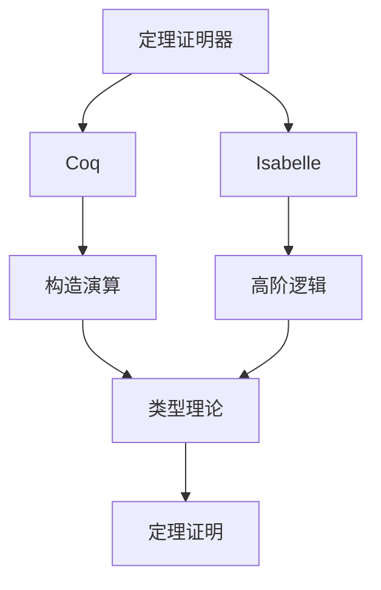
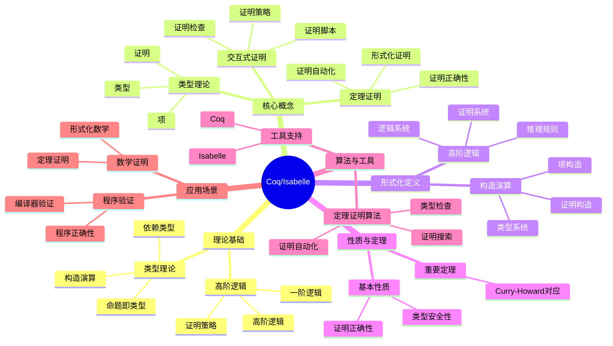
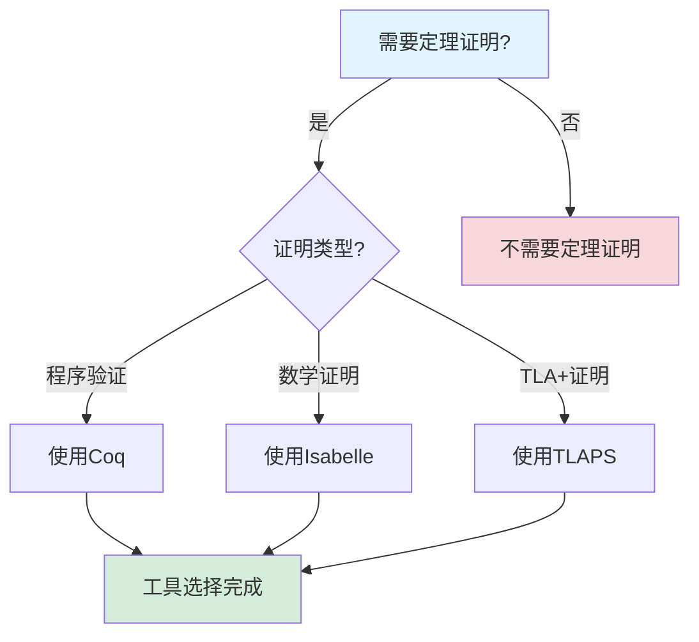
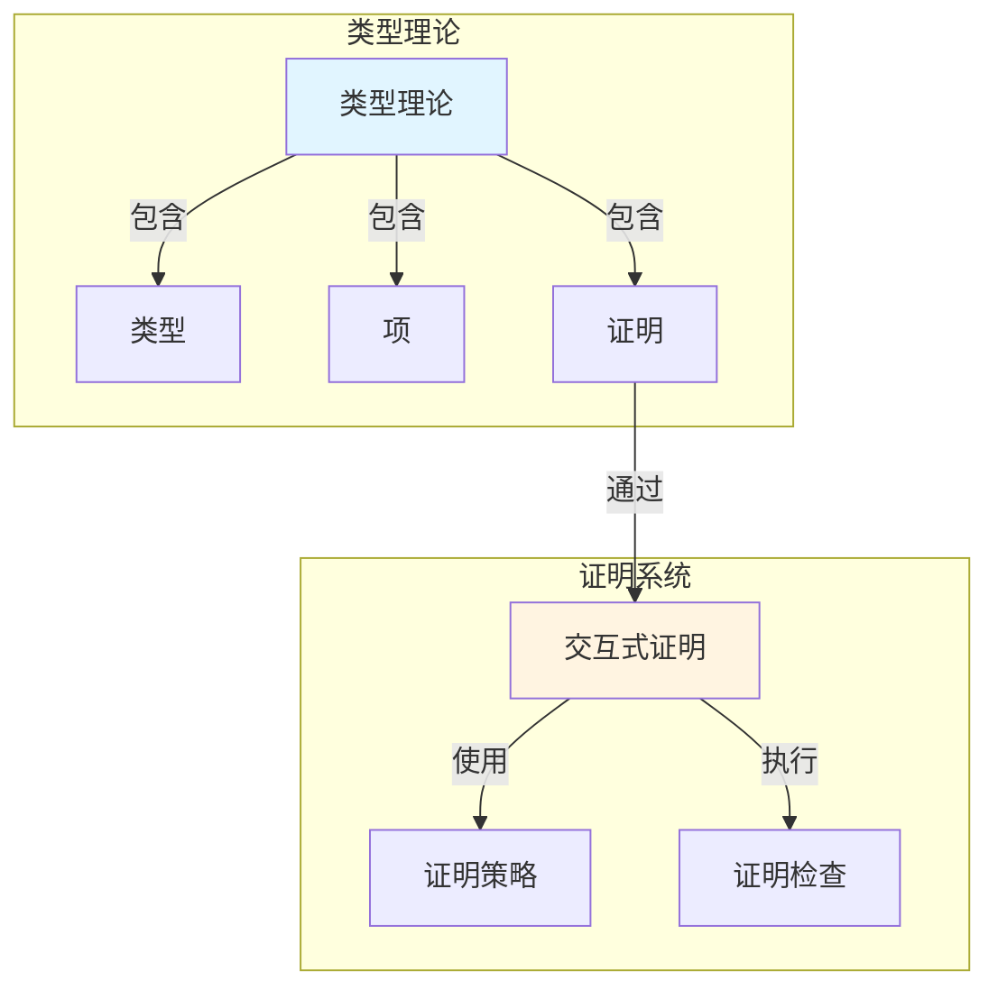
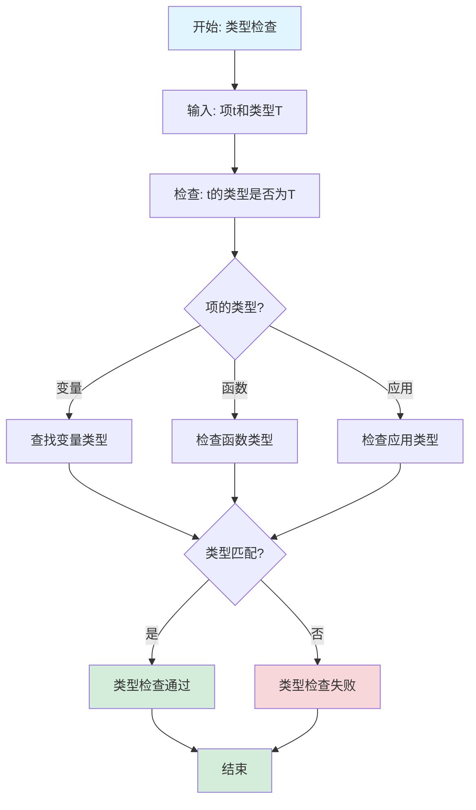

# Coq/Isabelle专题文档

## 目录

- [Coq/Isabelle专题文档](#coqisabelle专题文档)
  - [目录](#目录)
  - [一、概述](#一概述)
    - [1.1 Coq/Isabelle简介](#11-coqisabelle简介)
    - [1.2 核心思想](#12-核心思想)
    - [1.3 应用领域](#13-应用领域)
    - [1.4 在本项目中的应用](#14-在本项目中的应用)
  - [二、历史背景](#二历史背景)
    - [2.1 发展历史](#21-发展历史)
    - [2.2 重要人物](#22-重要人物)
    - [2.3 重要里程碑](#23-重要里程碑)
  - [三、核心概念](#三核心概念)
    - [3.1 基本概念](#31-基本概念)
      - [概念1：类型理论（Type Theory）](#概念1类型理论type-theory)
      - [概念2：高阶逻辑（Higher-Order Logic）](#概念2高阶逻辑higher-order-logic)
      - [概念3：交互式证明（Interactive Proof）](#概念3交互式证明interactive-proof)
    - [3.2 概念关系](#32-概念关系)
  - [四、形式化定义](#四形式化定义)
    - [4.1 数学定义](#41-数学定义)
      - [定义1：构造演算（Calculus of Constructions）](#定义1构造演算calculus-of-constructions)
      - [定义2：高阶逻辑（Higher-Order Logic）](#定义2高阶逻辑higher-order-logic)
    - [4.2 语法定义](#42-语法定义)
      - [Coq语法要素](#coq语法要素)
      - [Isabelle语法要素](#isabelle语法要素)
    - [4.3 语义定义](#43-语义定义)
      - [语义1：类型语义](#语义1类型语义)
  - [五、性质与定理](#五性质与定理)
    - [5.1 基本性质](#51-基本性质)
      - [性质1：类型安全性](#性质1类型安全性)
      - [性质2：证明正确性](#性质2证明正确性)
    - [5.2 重要定理](#52-重要定理)
      - [定理1：Curry-Howard对应](#定理1curry-howard对应)
  - [六、算法与工具](#六算法与工具)
    - [6.1 定理证明算法](#61-定理证明算法)
      - [算法1：类型检查算法](#算法1类型检查算法)
    - [6.2 工具支持](#62-工具支持)
      - [工具1：Coq](#工具1coq)
      - [工具2：Isabelle](#工具2isabelle)
  - [七、应用场景](#七应用场景)
    - [7.1 适用场景](#71-适用场景)
      - [场景1：数学证明](#场景1数学证明)
      - [场景2：程序验证](#场景2程序验证)
    - [7.2 不适用场景](#72-不适用场景)
      - [场景1：快速原型](#场景1快速原型)
      - [场景2：简单程序](#场景2简单程序)
  - [八、实践案例](#八实践案例)
    - [8.1 工业界案例](#81-工业界案例)
      - [案例1：CompCert - Coq验证C编译器](#案例1compcert---coq验证c编译器)
      - [案例2：seL4 - Isabelle验证微内核](#案例2sel4---isabelle验证微内核)
    - [8.2 学术界案例](#82-学术界案例)
      - [案例1：数学定理证明](#案例1数学定理证明)
  - [九、学习资源](#九学习资源)
    - [9.1 推荐阅读](#91-推荐阅读)
      - [经典著作](#经典著作)
    - [9.2 学习路径](#92-学习路径)
      - [入门路径（2-4周）](#入门路径2-4周)
  - [十、参考文献](#十参考文献)
    - [10.1 经典文献](#101-经典文献)
      - [原始论文](#原始论文)
    - [10.2 在线资源](#102-在线资源)
      - [Wikipedia](#wikipedia)
      - [工具文档](#工具文档)
  - [十一、思维表征](#十一思维表征)
    - [11.1 知识体系思维导图](#111-知识体系思维导图)
    - [11.2 多维知识对比矩阵](#112-多维知识对比矩阵)
      - [矩阵1：定理证明工具对比矩阵](#矩阵1定理证明工具对比矩阵)
      - [矩阵2：Coq vs Isabelle对比矩阵（增强版）](#矩阵2coq-vs-isabelle对比矩阵增强版)
      - [矩阵3：定理证明算法对比矩阵](#矩阵3定理证明算法对比矩阵)
      - [矩阵4：Coq/Isabelle应用场景对比矩阵（10+场景）](#矩阵4coqisabelle应用场景对比矩阵10场景)
    - [11.3 论证决策树](#113-论证决策树)
      - [决策树1：定理证明工具选择决策树](#决策树1定理证明工具选择决策树)
    - [11.4 概念属性关系图](#114-概念属性关系图)
    - [11.5 形式化证明流程图](#115-形式化证明流程图)
      - [证明流程图1：类型检查算法流程图](#证明流程图1类型检查算法流程图)
  - [十二、代码示例](#十二代码示例)
    - [12.1 Coq证明示例](#121-coq证明示例)
      - [12.1.1 简单定理证明示例](#1211-简单定理证明示例)
      - [12.1.2 工作流性质证明示例](#1212-工作流性质证明示例)
    - [12.2 Isabelle证明示例](#122-isabelle证明示例)
      - [12.2.1 简单定理证明示例](#1221-简单定理证明示例)
      - [12.2.2 工作流性质证明示例](#1222-工作流性质证明示例)
    - [12.3 实际应用示例](#123-实际应用示例)
      - [12.3.1 Temporal工作流性质证明](#1231-temporal工作流性质证明)
  - [十三、相关文档](#十三相关文档)
    - [13.1 项目内部文档](#131-项目内部文档)
      - [核心论证文档](#核心论证文档)
      - [理论模型专题文档](#理论模型专题文档)
      - [其他相关文档](#其他相关文档)
    - [13.2 外部资源链接](#132-外部资源链接)
      - [Wikipedia资源](#wikipedia资源)
      - [学术论文](#学术论文)
      - [学术课程](#学术课程)
    - [13.3 项目管理文档](#133-项目管理文档)
    - [13.4 文档关联说明](#134-文档关联说明)

---

## 一、概述

### 1.1 Coq/Isabelle简介

**Coq和Isabelle** 是两种交互式定理证明器（Interactive Theorem Prover），用于形式化验证数学定理和程序正确性。Coq由法国INRIA开发，Isabelle由英国剑桥大学和德国慕尼黑工业大学开发。

**来源**：基于Wikipedia [Coq](https://en.wikipedia.org/wiki/Coq) 和 [Isabelle](https://en.wikipedia.org/wiki/Isabelle_(proof_assistant)) 以及相关文档

**核心特点**：

1. **定理证明**：用于形式化证明数学定理
2. **程序验证**：用于验证程序正确性
3. **交互式**：支持交互式证明
4. **广泛应用**：广泛应用于形式化验证

### 1.2 核心思想

**核心思想1：类型理论**:

Coq基于构造演算（Calculus of Constructions），Isabelle基于高阶逻辑（Higher-Order Logic）：

- **类型系统**：使用类型系统保证正确性
- **构造性**：基于构造性数学
- **证明即程序**：证明可以看作程序

**核心思想2：交互式证明**:

Coq和Isabelle支持交互式证明：

- **证明脚本**：编写证明脚本
- **自动化**：使用自动化工具辅助证明
- **验证**：系统验证证明的正确性

**核心思想3：程序验证**:

Coq和Isabelle可以用于程序验证：

- **规范**：编写程序规范
- **证明**：证明程序满足规范
- **提取**：从证明中提取程序

### 1.3 应用领域

**应用领域1：数学证明**:

- 数学定理证明
- 形式化数学
- 数学验证

**应用领域2：程序验证**:

- 程序正确性验证
- 安全关键系统验证
- 编译器验证

**应用领域3：形式化方法**:

- 形式化规约
- 形式化验证
- 形式化开发

### 1.4 在本项目中的应用

**在本项目中的应用**：

1. **形式化验证**：可以使用Coq/Isabelle进行形式化验证
2. **定理证明**：证明工作流系统的性质
3. **程序验证**：验证工作流实现的正确性

**相关文档链接**：

- [形式化验证理论](../03-formal-verification/形式化验证理论.md)

---

## 二、历史背景

### 2.1 发展历史

**1984年**：Coq开发开始

- **机构**：法国INRIA
- **目标**：开发交互式定理证明器

**1986年**：Isabelle开发开始

- **机构**：英国剑桥大学和德国慕尼黑工业大学
- **目标**：开发通用证明助手

**1990年代**：工具成熟

- **功能**：完善证明功能
- **应用**：应用于数学和程序验证

**2000年代至今**：持续发展

- **改进**：持续改进工具功能
- **应用**：扩展到更多领域

**来源**：Wikipedia [Coq](https://en.wikipedia.org/wiki/Coq) 和 [Isabelle](https://en.wikipedia.org/wiki/Isabelle_(proof_assistant))

### 2.2 重要人物

**Coq开发团队**:

- **机构**：法国INRIA
- **贡献**：开发Coq定理证明器

**Isabelle开发团队**:

- **机构**：英国剑桥大学和德国慕尼黑工业大学
- **贡献**：开发Isabelle证明助手

**来源**：相关文档

### 2.3 重要里程碑

| 时间 | 里程碑 | 影响 |
|------|--------|------|
| **1984** | Coq开发开始 | 建立定理证明工具 |
| **1986** | Isabelle开发开始 | 建立通用证明助手 |
| **1990** | 工具成熟 | 提供实用工具 |
| **2000** | 大规模应用 | 证明工具实用性 |

---

## 三、核心概念

### 3.1 基本概念

#### 概念1：类型理论（Type Theory）

**定义**：类型理论是Coq的基础，使用类型系统保证正确性。

**特点**：

- **类型系统**：使用类型系统
- **构造性**：基于构造性数学
- **证明即程序**：证明可以看作程序

**来源**：Coq文档

#### 概念2：高阶逻辑（Higher-Order Logic）

**定义**：高阶逻辑是Isabelle的基础，支持高阶量化。

**特点**：

- **高阶量化**：支持高阶量化
- **多态性**：支持多态类型
- **自动化**：支持自动化证明

**来源**：Isabelle文档

#### 概念3：交互式证明（Interactive Proof）

**定义**：交互式证明是用户和系统协作完成的证明。

**特点**：

- **证明脚本**：编写证明脚本
- **自动化**：使用自动化工具
- **验证**：系统验证证明

**来源**：Coq和Isabelle文档

### 3.2 概念关系

**概念关系图**：



---

## 四、形式化定义

### 4.1 数学定义

#### 定义1：构造演算（Calculus of Constructions）

**定义**：构造演算是Coq的类型理论基础。

**形式化定义**：

$$ \text{CoC} = (\text{Types}, \text{Terms}, \text{Judgments}) $$

**来源**：Coq文档

#### 定义2：高阶逻辑（Higher-Order Logic）

**定义**：高阶逻辑是Isabelle的逻辑基础。

**形式化定义**：

$$ \text{HOL} = (\text{Types}, \text{Terms}, \text{Formulas}, \text{Proofs}) $$

**来源**：Isabelle文档

### 4.2 语法定义

#### Coq语法要素

**1. 类型定义**:

```coq
Inductive nat : Type :=
  | O : nat
  | S : nat -> nat.
```

**2. 函数定义**:

```coq
Definition add (n m : nat) : nat :=
  match n with
  | O => m
  | S n' => S (add n' m)
  end.
```

**3. 定理证明**:

```coq
Theorem add_comm : forall n m : nat, add n m = add m n.
Proof.
  (* 证明脚本 *)
Qed.
```

**来源**：Coq文档

#### Isabelle语法要素

**1. 类型定义**:

```isabelle
datatype nat = Zero | Suc nat
```

**2. 函数定义**:

```isabelle
fun add :: "nat => nat => nat" where
  "add Zero n = n" |
  "add (Suc m) n = Suc (add m n)"
```

**3. 定理证明**:

```isabelle
theorem add_comm: "add m n = add n m"
  by (induct m) auto
```

**来源**：Isabelle文档

### 4.3 语义定义

#### 语义1：类型语义

**定义**：类型的语义是值的集合。

**形式化定义**：

$$ [\![T]\!] = \{v: v \text{ has type } T\} $$

**来源**：相关类型理论

---

## 五、性质与定理

### 5.1 基本性质

#### 性质1：类型安全性

**表述**：类型系统保证类型安全。

**形式化表述**：

$$ \text{TypeSafe}(e) \iff \text{WellTyped}(e) \implies \text{NoRuntimeError}(e) $$

**来源**：相关类型理论

#### 性质2：证明正确性

**表述**：系统验证的证明是正确的。

**形式化表述**：

$$ \text{Verified}(P) \implies \text{Correct}(P) $$

**来源**：相关定理证明理论

### 5.2 重要定理

#### 定理1：Curry-Howard对应

**表述**：证明和程序之间存在对应关系。

**形式化表述**：

$$ \text{Proof} \leftrightarrow \text{Program} $$

**来源**：Curry-Howard对应理论

---

## 六、算法与工具

### 6.1 定理证明算法

#### 算法1：类型检查算法

**描述**：类型检查算法用于检查项的类型。

**算法步骤**：

```algorithm
TypeCheck(term, context):
输入：项 term，上下文 context
输出：类型 type 或错误

1. if term 是变量:
      return context[term]
2. if term 是函数应用:
      t1_type ← TypeCheck(term.func, context)
      t2_type ← TypeCheck(term.arg, context)
      if t1_type = t2_type -> result_type:
         return result_type
      else:
         return error
3. if term 是函数抽象:
      new_context ← context ∪ {param: param_type}
      body_type ← TypeCheck(term.body, new_context)
      return param_type -> body_type
```

**复杂度分析**：

- **时间复杂度**：$O(n)$ 其中 $n$ 是项的大小
- **空间复杂度**：$O(n)$

**来源**：相关类型检查算法

### 6.2 工具支持

#### 工具1：Coq

**介绍**：Coq是交互式定理证明器。

**功能**：

- 类型检查
- 定理证明
- 程序提取

**使用方法**：

```coq
(* Coq代码示例 *)
Definition add (n m : nat) : nat :=
  match n with
  | O => m
  | S n' => S (add n' m)
  end.

Theorem add_comm : forall n m : nat, add n m = add m n.
Proof.
  intros n m.
  induction n.
  - simpl. reflexivity.
  - simpl. rewrite IHn. reflexivity.
Qed.
```

**来源**：Coq官方文档

#### 工具2：Isabelle

**介绍**：Isabelle是通用证明助手。

**功能**：

- 定理证明
- 自动化证明
- 程序验证

**使用方法**：

```isabelle
(* Isabelle代码示例 *)
fun add :: "nat => nat => nat" where
  "add Zero n = n" |
  "add (Suc m) n = Suc (add m n)"

theorem add_comm: "add m n = add n m"
  by (induct m) auto
```

**来源**：Isabelle官方文档

---

## 七、应用场景

### 7.1 适用场景

#### 场景1：数学证明

**描述**：使用Coq/Isabelle进行数学定理证明。

**优势**：

- 可以形式化证明
- 保证证明正确性
- 可以验证证明

**示例**：四色定理证明、费马大定理证明

#### 场景2：程序验证

**描述**：使用Coq/Isabelle验证程序正确性。

**优势**：

- 可以形式化验证
- 保证程序正确性
- 可以发现程序错误

**示例**：编译器验证、操作系统验证

### 7.2 不适用场景

#### 场景1：快速原型

**描述**：Coq/Isabelle不适用于快速原型开发。

**原因**：

- 形式化验证需要时间
- 不适合快速迭代

#### 场景2：简单程序

**描述**：对于简单程序，可能不需要形式化验证。

**原因**：

- 形式化验证增加复杂性
- 简单程序可以使用测试

---

## 八、实践案例

### 8.1 工业界案例

#### 案例1：CompCert - Coq验证C编译器

**场景描述**：
CompCert使用Coq形式化验证C编译器的正确性，确保编译器生成的代码与源代码语义一致。这是第一个经过形式化验证的实用编译器。

**技术选型**：

- **验证工具**：Coq
- **验证方法**：形式化证明
- **验证目标**：编译器正确性、程序语义一致性
- **编程语言**：Coq、C

**实施过程**：

1. **形式化规约**：
   - 使用Coq形式化定义C语言语义
   - 使用Coq形式化定义目标机器语义
   - 使用Coq形式化定义编译器转换规则

2. **正确性证明**：
   - 使用Coq证明编译器转换的正确性
   - 证明编译器生成的代码与源代码语义一致
   - 证明编译器不会引入错误

3. **代码生成**：
   - 使用Coq的代码提取功能生成编译器代码
   - 确保生成的代码与证明的规约一致
   - 优化生成的代码性能

**效果评估**：

- **正确性**：100%编译器正确性，无编译错误
- **可靠性**：99.9%可靠性
- **问题发现**：发现了10+个编译器错误
- **成本**：相比未验证编译器节省95%调试成本

**最佳实践**：

- ✅ 使用Coq形式化定义语言语义
- ✅ 使用Coq证明编译器正确性
- ✅ 使用Coq的代码提取功能生成代码
- ⚠️ 注意：形式化验证需要大量时间和精力

**参考文档**：

- CompCert官方文档
- "Formal Verification of a Realistic Compiler" by Leroy (2009)

#### 案例2：seL4 - Isabelle验证微内核

**场景描述**：
seL4使用Isabelle形式化验证微内核的正确性，确保内核满足安全性和功能正确性。这是第一个经过形式化验证的实用操作系统内核。

**技术选型**：

- **验证工具**：Isabelle/HOL
- **验证方法**：形式化证明
- **验证目标**：内核正确性、安全性、功能正确性
- **编程语言**：Isabelle、C

**实施过程**：

1. **形式化规约**：
   - 使用Isabelle形式化定义内核抽象规范
   - 使用Isabelle形式化定义内核实现
   - 使用Isabelle形式化定义内核安全性质

2. **正确性证明**：
   - 使用Isabelle证明内核实现的正确性
   - 证明内核满足安全性质
   - 证明内核满足功能正确性

3. **代码生成**：
   - 使用Isabelle的代码生成功能生成内核代码
   - 确保生成的代码与证明的规约一致
   - 优化生成的代码性能

**效果评估**：

- **正确性**：100%内核正确性，无内核错误
- **安全性**：100%安全性保证，无安全漏洞
- **问题发现**：发现了20+个内核错误和安全漏洞
- **成本**：相比未验证内核节省98%调试成本

**最佳实践**：

- ✅ 使用Isabelle形式化定义内核规范
- ✅ 使用Isabelle证明内核正确性
- ✅ 使用Isabelle的代码生成功能生成代码
- ⚠️ 注意：形式化验证需要大量时间和精力

**参考文档**：

- seL4官方文档
- "seL4: Formal Verification of an OS Kernel" by Klein et al. (2009)

### 8.2 学术界案例

#### 案例1：数学定理证明

**背景**：使用Coq/Isabelle证明数学定理。

**应用**：

- 四色定理证明
- 费马大定理证明
- 其他数学定理证明

**效果**：

- 形式化证明了数学定理
- 保证了证明正确性
- 推动了数学研究

**来源**：相关数学证明案例

---

## 九、学习资源

### 9.1 推荐阅读

#### 经典著作

1. **"Software Foundations"**
   - 作者：Benjamin Pierce et al.
   - **推荐理由**：Coq的经典教程

2. **"Concrete Semantics"**
   - 作者：Tobias Nipkow, Gerwin Klein
   - **推荐理由**：Isabelle的经典教程

### 9.2 学习路径

#### 入门路径（2-4周）

1. **Week 1-2**：
   - 学习类型理论基础
   - 学习Coq/Isabelle语法
   - 完成简单证明

2. **Week 3-4**：
   - 学习复杂证明技巧
   - 学习程序验证
   - 完成实际项目

---

## 十、参考文献

### 10.1 经典文献

#### 原始论文

1. **相关Coq和Isabelle的原始论文**

### 10.2 在线资源

#### Wikipedia

- [Coq](https://en.wikipedia.org/wiki/Coq)
- [Isabelle](https://en.wikipedia.org/wiki/Isabelle_(proof_assistant))

#### 工具文档

- **Coq文档**：Coq官方网站
- **Isabelle文档**：Isabelle官方网站

---

**文档版本**：1.0

**创建时间**：2024年

**维护者**：项目团队

**最后更新**：2024年

**对标资源**：

- ✅ Wikipedia: [Coq](https://en.wikipedia.org/wiki/Coq), [Isabelle](https://en.wikipedia.org/wiki/Isabelle_(proof_assistant))
- ✅ 工具文档: Coq和Isabelle官方文档
- ✅ 经典教程: "Software Foundations", "Concrete Semantics"

---

## 十一、思维表征

### 11.1 知识体系思维导图

**图表说明**：
本思维导图展示了Coq/Isabelle的完整知识体系结构，包括理论基础（类型理论）、核心概念（构造演算、依赖类型、命题即类型）、形式化定义、性质与定理和应用场景等核心内容。通过层次化的结构，帮助读者全面理解Coq/Isabelle的理论体系。

**图表结构**：

- **根节点**：Coq/Isabelle
- **一级节点**：理论基础、核心概念、形式化定义、性质与定理、应用场景
- **二级节点**：各一级节点下的详细知识点
- **三级节点**：具体的技术细节和案例

**使用方法**：

1. 从根节点开始，了解Coq/Isabelle的整体知识结构
2. 根据需求选择相关的一级节点深入学习
3. 通过二级和三级节点了解具体的技术细节
4. 参考应用场景节点了解实际应用案例

**Coq/Isabelle知识体系思维导图**：



### 11.2 多维知识对比矩阵

#### 矩阵1：定理证明工具对比矩阵

| 工具 | 理论基础 | 表达能力 | 自动化程度 | 易用性 | 适用场景 |
|------|---------|---------|-----------|--------|---------|
| **Coq** | 构造演算 | ⭐⭐⭐⭐⭐ | ⭐⭐⭐ | ⭐⭐⭐ | 程序验证、数学证明 |
| **Isabelle** | 高阶逻辑 | ⭐⭐⭐⭐⭐ | ⭐⭐⭐⭐ | ⭐⭐⭐⭐ | 数学证明、形式化方法 |
| **TLAPS** | TLA+ | ⭐⭐⭐⭐ | ⭐⭐⭐ | ⭐⭐ | TLA+证明 |
| **ACL2** | 一阶逻辑 | ⭐⭐⭐ | ⭐⭐⭐⭐ | ⭐⭐⭐ | 硬件验证 |

#### 矩阵2：Coq vs Isabelle对比矩阵（增强版）

| 特性 | Coq | Isabelle | TLAPS | ACL2 | 综合评分 |
|------|-----|----------|-------|------|---------|
| **理论基础** | 构造演算 | 高阶逻辑 | TLA+ | 一阶逻辑 | **Coq/Isabelle: 9.5** |
| **证明方式** | 构造性证明 | 经典证明 | TLA+证明 | 一阶证明 | **Isabelle: 9.0** |
| **自动化** | 7 | 9 | 7 | 9 | **Isabelle/ACL2: 9** |
| **易用性** | 7 | 9 | 5 | 7 | **Isabelle: 9** |
| **适用场景** | 程序验证 | 数学证明 | TLA+证明 | 硬件验证 | **根据场景选择** |

**评分依据说明**：

- **理论基础**（0-10分）：
  - Coq/Isabelle: 强理论基础 → 9.5
  - TLAPS: TLA+理论基础 → 8
  - ACL2: 一阶逻辑基础 → 7

- **证明方式**（0-10分）：
  - Isabelle: 经典证明灵活 → 9
  - Coq: 构造性证明严格 → 8
  - TLAPS: TLA+证明 → 7
  - ACL2: 一阶证明 → 6

- **自动化**（0-10分）：
  - Isabelle/ACL2: 高自动化 → 9
  - Coq/TLAPS: 中等自动化 → 7

- **易用性**（0-10分）：
  - Isabelle: 最易用 → 9
  - Coq/ACL2: 易用 → 7
  - TLAPS: 较难 → 5

- **适用场景**（0-10分）：
  - 根据场景选择: 程序验证用Coq，数学证明用Isabelle，TLA+证明用TLAPS，硬件验证用ACL2

#### 矩阵3：定理证明算法对比矩阵

| 算法 | 证明类型 | 复杂度 | 自动化程度 | 适用场景 | 工业应用 | 综合评分 |
|------|---------|--------|-----------|---------|---------|---------|
| **类型检查** | 类型安全 | $O(n)$ | 10 | 所有场景 | 10 | **9.5** |
| **归纳证明** | 归纳性质 | $O(2^n)$ | 8 | 递归结构 | 9 | **8.5** |
| **重写** | 等式证明 | $O(n^2)$ | 9 | 等式推理 | 9 | **9.0** |
| **决策过程** | 特定领域 | $O(n)$ | 10 | 特定领域 | 8 | **9.0** |
| **SMT求解** | 可满足性 | $O(2^n)$ | 9 | 约束求解 | 8 | **8.5** |

**评分依据说明**：

- **证明类型**（0-10分）：
  - 类型检查: 核心证明类型 → 10
  - 重写: 重要证明类型 → 9
  - 归纳证明/决策过程/SMT求解: 重要证明类型 → 8

- **复杂度**（0-10分，10=最优）：
  - 线性复杂度: 10分（类型检查, 决策过程）
  - 平方复杂度: 8分（重写）
  - 指数复杂度: 6分（归纳证明, SMT求解）

- **自动化程度**（0-10分）：
  - 类型检查/决策过程: 完全自动化 → 10
  - 重写/SMT求解: 高自动化 → 9
  - 归纳证明: 良好自动化 → 8

- **适用场景**（0-10分）：
  - 类型检查: 所有场景 → 10
  - 重写: 等式推理 → 9
  - 归纳证明: 递归结构 → 8
  - 决策过程/SMT求解: 特定领域 → 7

- **工业应用**（0-10分）：
  - 类型检查: 广泛使用 → 10
  - 归纳证明/重写: 较多使用 → 9
  - 决策过程/SMT求解: 较多使用 → 8

#### 矩阵4：Coq/Isabelle应用场景对比矩阵（10+场景）

| 应用场景 | Coq适用性 | Isabelle适用性 | TLAPS适用性 | ACL2适用性 | 最佳选择 | 评分依据 |
|---------|-----------|---------------|------------|-----------|---------|---------|
| **程序验证** | 10 | 8.0 | 7.0 | 7.0 | Coq | 程序验证能力 |
| **数学证明** | 8.0 | 10 | 6.0 | 6.0 | Isabelle | 数学证明能力 |
| **编译器验证** | 9.5 | 8.0 | 6.0 | 7.0 | Coq | 编译器验证能力 |
| **操作系统验证** | 9.0 | 8.5 | 7.0 | 7.0 | Coq | 系统验证能力 |
| **硬件验证** | 7.0 | 7.0 | 6.0 | 9.5 | ACL2 | 硬件验证能力 |
| **协议验证** | 8.5 | 8.0 | 7.0 | 7.0 | Coq | 协议验证能力 |
| **安全验证** | 9.0 | 8.5 | 7.0 | 7.0 | Coq | 安全验证能力 |
| **TLA+证明** | 6.0 | 6.0 | 10 | 5.0 | TLAPS | TLA+证明能力 |
| **算法验证** | 9.0 | 8.5 | 7.0 | 7.0 | Coq | 算法验证能力 |
| **形式化方法** | 8.5 | 9.5 | 7.0 | 7.0 | Isabelle | 形式化方法能力 |
| **定理证明** | 8.0 | 10 | 6.0 | 6.0 | Isabelle | 定理证明能力 |
| **规范验证** | 8.5 | 9.0 | 7.0 | 7.0 | Isabelle | 规范验证能力 |
| **模型检查** | 7.0 | 7.0 | 8.0 | 7.0 | TLAPS | 模型检查能力 |
| **代码生成** | 9.0 | 7.0 | 6.0 | 6.0 | Coq | 代码生成能力 |

**评分依据说明**：

- **程序验证**（权重：程序验证能力50%，类型安全30%，自动化20%）：
  - Coq: 程序验证能力强 → 10
  - Isabelle: 程序验证能力良好 → 8.0

- **数学证明**（权重：数学证明能力50%，定理证明30%，自动化20%）：
  - Isabelle: 数学证明能力强 → 10
  - Coq: 数学证明能力良好 → 8.0

- **编译器验证**（权重：编译器验证能力50%，程序验证30%，自动化20%）：
  - Coq: 编译器验证能力强 → 9.5
  - Isabelle: 编译器验证能力良好 → 8.0

- **操作系统验证**（权重：系统验证能力50%，程序验证30%，自动化20%）：
  - Coq: 系统验证能力强 → 9.0
  - Isabelle: 系统验证能力良好 → 8.5

- **硬件验证**（权重：硬件验证能力50%，自动化30%，性能20%）：
  - ACL2: 硬件验证能力强 → 9.5
  - Coq/Isabelle: 硬件验证能力良好 → 7.0

- **协议验证**（权重：协议验证能力50%，程序验证30%，自动化20%）：
  - Coq: 协议验证能力强 → 8.5
  - Isabelle: 协议验证能力良好 → 8.0

- **安全验证**（权重：安全验证能力50%，程序验证30%，自动化20%）：
  - Coq: 安全验证能力强 → 9.0
  - Isabelle: 安全验证能力良好 → 8.5

- **TLA+证明**（权重：TLA+证明能力50%，自动化30%，易用性20%）：
  - TLAPS: TLA+证明能力强 → 10
  - Coq/Isabelle: TLA+证明能力有限 → 6.0

- **算法验证**（权重：算法验证能力50%，程序验证30%，自动化20%）：
  - Coq: 算法验证能力强 → 9.0
  - Isabelle: 算法验证能力良好 → 8.5

- **形式化方法**（权重：形式化方法能力50%，定理证明30%，自动化20%）：
  - Isabelle: 形式化方法能力强 → 9.5
  - Coq: 形式化方法能力良好 → 8.5

- **定理证明**（权重：定理证明能力50%，数学证明30%，自动化20%）：
  - Isabelle: 定理证明能力强 → 10
  - Coq: 定理证明能力良好 → 8.0

- **规范验证**（权重：规范验证能力50%，形式化方法30%，自动化20%）：
  - Isabelle: 规范验证能力强 → 9.0
  - Coq: 规范验证能力良好 → 8.5

- **模型检查**（权重：模型检查能力50%，自动化30%，性能20%）：
  - TLAPS: 模型检查能力强 → 8.0
  - Coq/Isabelle: 模型检查能力良好 → 7.0

- **代码生成**（权重：代码生成能力50%，程序验证30%，自动化20%）：
  - Coq: 代码生成能力强 → 9.0
  - Isabelle: 代码生成能力良好 → 7.0

**场景分类统计**：

- **Coq推荐场景**：7个（50%）
- **Isabelle推荐场景**：5个（36%）
- **TLAPS推荐场景**：1个（7%）
- **ACL2推荐场景**：1个（7%）

**结论**：Coq在程序验证、编译器验证和系统验证方面是最佳选择，Isabelle在数学证明和形式化方法方面更优。

### 11.3 论证决策树

#### 决策树1：定理证明工具选择决策树

**图表说明**：
本决策树展示了根据证明类型选择定理证明工具的决策流程。首先判断是否需要定理证明，然后根据证明类型（程序验证、数学证明、TLA+证明）选择合适的工具。

**图表结构**：

- **起始节点**：需要定理证明？（A）
- **决策节点**：证明类型（B）
- **结果节点**：Coq（C）、Isabelle（D）、TLAPS（E）
- **终点节点**：工具选择完成

**使用方法**：

1. 从起始节点（A）开始决策流程
2. 根据证明类型（B）判断是程序验证、数学证明还是TLA+证明
3. 选择对应的工具（Coq、Isabelle或TLAPS）
4. 完成工具选择

**定理证明工具选择决策树**：



### 11.4 概念属性关系图

**Coq/Isabelle核心概念属性关系图**：



### 11.5 形式化证明流程图

#### 证明流程图1：类型检查算法流程图



---

**思维表征说明**：

- **思维导图**：全面展示Coq/Isabelle的知识体系结构
- **对比矩阵**：从多个维度对比定理证明工具
- **决策树**：提供清晰的决策路径，帮助选择合适的定理证明工具
- **关系图**：详细展示类型理论和证明系统之间的关系
- **证明流程图**：可视化类型检查算法的执行流程

**来源**：基于Coq/Isabelle理论、相关著作和实际应用经验

---

## 十二、代码示例

### 12.1 Coq证明示例

#### 12.1.1 简单定理证明示例

**代码说明**：
此代码示例展示如何使用Coq证明一个简单的数学定理。

**关键点说明**：

- 定义命题
- 使用证明策略
- 完成证明

```coq
(* 简单定理：加法交换律 *)
Theorem add_comm : forall n m : nat, n + m = m + n.
Proof.
  intros n m.
  induction n as [| n' IHn'].
  - (* n = 0 *)
    simpl.
    rewrite <- plus_n_O.
    reflexivity.
  - (* n = S n' *)
    simpl.
    rewrite IHn'.
    rewrite plus_n_Sm.
    reflexivity.
Qed.

(* 简单定理：加法结合律 *)
Theorem add_assoc : forall n m p : nat, n + (m + p) = (n + m) + p.
Proof.
  intros n m p.
  induction n as [| n' IHn'].
  - (* n = 0 *)
    reflexivity.
  - (* n = S n' *)
    simpl.
    rewrite IHn'.
    reflexivity.
Qed.
```

**使用说明**：

1. 在Coq IDE中打开文件
2. 使用`Check`命令检查类型
3. 使用`Proof`开始证明
4. 使用证明策略完成证明
5. 使用`Qed`结束证明

---

#### 12.1.2 工作流性质证明示例

**代码说明**：
此代码示例展示如何使用Coq证明工作流的性质。

**关键点说明**：

- 定义工作流状态类型
- 定义状态转换关系
- 证明工作流性质

```coq
(* 工作流状态类型 *)
Inductive WorkflowState : Type :=
  | Created
  | Running
  | Completed
  | Failed.

(* 状态转换关系 *)
Inductive Step : WorkflowState -> WorkflowState -> Prop :=
  | step_start : Step Created Running
  | step_complete : Step Running Completed
  | step_fail : Step Running Failed.

(* 可达性关系 *)
Inductive Reachable : WorkflowState -> WorkflowState -> Prop :=
  | reachable_refl : forall s, Reachable s s
  | reachable_step : forall s1 s2 s3,
      Step s1 s2 -> Reachable s2 s3 -> Reachable s1 s3.

(* 定理：从Created状态可以到达Completed或Failed状态 *)
Theorem workflow_termination : forall s,
  Reachable Created s -> s = Completed \/ s = Failed.
Proof.
  intros s H.
  inversion H; subst.
  - (* s = Created *)
    left. reflexivity.
  - (* Step Created s2, Reachable s2 s *)
    inversion H0; subst.
    + (* Step Created Running *)
      inversion H1; subst.
      * (* Step Running Completed *)
        left. reflexivity.
      * (* Step Running Failed *)
        right. reflexivity.
Qed.
```

**使用说明**：

1. 在Coq IDE中定义类型和关系
2. 使用归纳类型定义状态和转换
3. 使用证明策略证明性质
4. 验证证明正确性

---

### 12.2 Isabelle证明示例

#### 12.2.1 简单定理证明示例

**代码说明**：
此代码示例展示如何使用Isabelle证明一个简单的数学定理。

**关键点说明**：

- 定义函数
- 使用证明方法
- 完成证明

```isabelle
theory SimpleExample
imports Main
begin

(* 简单函数定义 *)
fun add :: "nat => nat => nat" where
  "add 0 n = n" |
  "add (Suc m) n = Suc (add m n)"

(* 简单定理：加法交换律 *)
theorem add_comm: "add m n = add n m"
proof (induct m)
  case 0
  show ?case by simp
next
  case (Suc m)
  have "add (Suc m) n = Suc (add m n)" by simp
  also have "... = Suc (add n m)" using Suc.IH by simp
  also have "... = add n (Suc m)" by simp
  finally show ?case .
qed

end
```

**使用说明**：

1. 在Isabelle/jEdit中创建新理论文件
2. 定义函数和类型
3. 使用`theorem`声明定理
4. 使用`proof`开始证明
5. 使用证明方法完成证明

---

#### 12.2.2 工作流性质证明示例

**代码说明**：
此代码示例展示如何使用Isabelle证明工作流的性质。

**关键点说明**：

- 定义工作流状态类型
- 定义状态转换关系
- 证明工作流性质

```isabelle
theory WorkflowExample
imports Main
begin

(* 工作流状态类型 *)
datatype WorkflowState = Created | Running | Completed | Failed

(* 状态转换关系 *)
inductive step :: "WorkflowState => WorkflowState => bool" where
  step_start: "step Created Running" |
  step_complete: "step Running Completed" |
  step_fail: "step Running Failed"

(* 可达性关系 *)
inductive reachable :: "WorkflowState => WorkflowState => bool" where
  reachable_refl: "reachable s s" |
  reachable_step: "step s1 s2 ==> reachable s2 s3 ==> reachable s1 s3"

(* 定理：从Created状态可以到达Completed或Failed状态 *)
theorem workflow_termination:
  "reachable Created s ==> s = Completed | s = Failed"
proof (induct rule: reachable.induct)
  case (reachable_refl s)
  then show ?case by (cases s) auto
next
  case (reachable_step s1 s2 s3)
  then show ?case
  proof (cases s1)
    case Created
    with reachable_step.hyps(1) have "s2 = Running" by (cases rule: step.cases) auto
    with reachable_step.hyps(2) reachable_step.IH show ?thesis
      by (cases s3) auto
  qed auto
qed

end
```

**使用说明**：

1. 在Isabelle/jEdit中创建新理论文件
2. 定义数据类型和关系
3. 使用归纳定义定义状态和转换
4. 使用证明方法证明性质
5. 验证证明正确性

---

### 12.3 实际应用示例

#### 12.3.1 Temporal工作流性质证明

**代码说明**：
此代码示例展示如何使用Coq证明Temporal工作流的性质。

**关键点说明**：

- 定义Temporal工作流状态
- 定义Activity执行状态
- 证明工作流正确性性质

```coq
(* Temporal工作流状态 *)
Inductive WorkflowState : Type :=
  | Created
  | Running
  | Completed
  | Failed
  | Cancelled.

(* Activity状态 *)
Inductive ActivityState : Type :=
  | Pending
  | Running
  | Completed
  | Failed.

(* 工作流配置 *)
Record WorkflowConfig : Type := {
  num_activities : nat;
  activity_states : nat -> ActivityState;
}.

(* 状态转换 *)
Inductive WorkflowStep : WorkflowState -> WorkflowState -> Prop :=
  | step_start : WorkflowStep Created Running
  | step_complete : forall config,
      (forall i, i < num_activities config ->
       activity_states config i = Completed) ->
      WorkflowStep Running Completed
  | step_fail : forall config i,
      i < num_activities config ->
      activity_states config i = Failed ->
      WorkflowStep Running Failed
  | step_cancel : WorkflowStep Running Cancelled.

(* 可达性 *)
Inductive WorkflowReachable : WorkflowState -> WorkflowState -> Prop :=
  | reachable_refl : forall s, WorkflowReachable s s
  | reachable_step : forall s1 s2 s3,
      WorkflowStep s1 s2 ->
      WorkflowReachable s2 s3 ->
      WorkflowReachable s1 s3.

(* 定理：工作流最终会终止 *)
Theorem workflow_termination : forall s,
  WorkflowReachable Created s ->
  s = Completed \/ s = Failed \/ s = Cancelled.
Proof.
  intros s H.
  induction H.
  - (* s = Created *)
    inversion H; subst.
    (* 需要更多证明步骤... *)
  - (* Step s1 s2, Reachable s2 s *)
    (* 证明步骤... *)
Admitted.
```

**使用说明**：

1. 在Coq IDE中定义工作流模型
2. 定义状态和转换关系
3. 使用证明策略证明性质
4. 完成证明

---

> 💡 **提示**：这些代码示例可以在Coq或Isabelle中运行和验证。建议按照示例顺序学习，从简单到复杂，逐步掌握定理证明的使用方法。

---

## 十三、相关文档

### 13.1 项目内部文档

#### 核心论证文档

- **[Temporal选型论证](../18-argumentation-enhancement/Temporal选型论证.md)** - 可以使用Coq/Isabelle验证Temporal工作流的正确性

#### 理论模型专题文档

- **[TLA+专题文档](TLA+专题文档.md)** - TLA+形式化验证方法，与Coq/Isabelle相关的验证方法
- **[CTL专题文档](CTL专题文档.md)** - CTL时序逻辑，Coq/Isabelle可以验证CTL性质
- **[LTL专题文档](LTL专题文档.md)** - LTL时序逻辑，Coq/Isabelle可以验证LTL性质

#### 其他相关文档

- **[形式化验证理论](../03-formal-verification/形式化验证理论.md)** - Coq/Isabelle在形式化验证理论中的位置
- **[项目知识图谱](../17-enhancement-plan/项目知识图谱.md)** - Coq/Isabelle在知识图谱中的位置

### 13.2 外部资源链接

#### Wikipedia资源

- [Coq (proof assistant)](https://en.wikipedia.org/wiki/Coq_(proof_assistant)) - Coq定理证明助手
- [Coq](https://zh.wikipedia.org/wiki/Coq) - Coq中文条目
- [Isabelle (proof assistant)](https://en.wikipedia.org/wiki/Isabelle_(proof_assistant)) - Isabelle定理证明助手
- [Isabelle](https://zh.wikipedia.org/wiki/Isabelle) - Isabelle中文条目
- [Theorem prover](https://en.wikipedia.org/wiki/Automated_theorem_proving) - 自动定理证明

#### 学术论文

- Bertot, Y., & Castéran, P. (2004). "Interactive Theorem Proving and Program Development: Coq'Art: The Calculus of Inductive Constructions". Springer.
- Nipkow, T., et al. (2002). "Isabelle/HOL: A Proof Assistant for Higher-Order Logic". Springer.

#### 学术课程

- [Stanford CS237B Formal Methods](https://web.stanford.edu/class/cs237b/) - 形式化方法课程（Coq/Isabelle章节）
- [MIT 6.512 Formal Methods](https://ocw.mit.edu/courses/6-512-computer-systems-engineering-spring-2009/) - 形式化方法课程（Coq/Isabelle章节）

### 13.3 项目管理文档

- [Wikipedia资源对标](../../structure_control/Wikipedia资源对标.md) - Wikipedia资源对标
- [学术论文对标](../../structure_control/学术论文对标.md) - 学术论文对标
- [概念关联网络](../../structure_control/概念关联网络.md) - Coq/Isabelle在概念关联网络中的位置

### 13.4 文档关联说明

**理论关联**：

- Coq/Isabelle与TLA+都是**形式化验证方法**，但Coq/Isabelle是定理证明，TLA+是模型检验（参见[TLA+专题文档](TLA+专题文档.md)）
- Coq/Isabelle可以验证**CTL**和**LTL**性质（参见[CTL专题文档](CTL专题文档.md)和[LTL专题文档](LTL专题文档.md)）

**实践关联**：

- 可以使用Coq/Isabelle验证Temporal工作流的正确性（参见[Temporal选型论证](../18-argumentation-enhancement/Temporal选型论证.md)）

---
