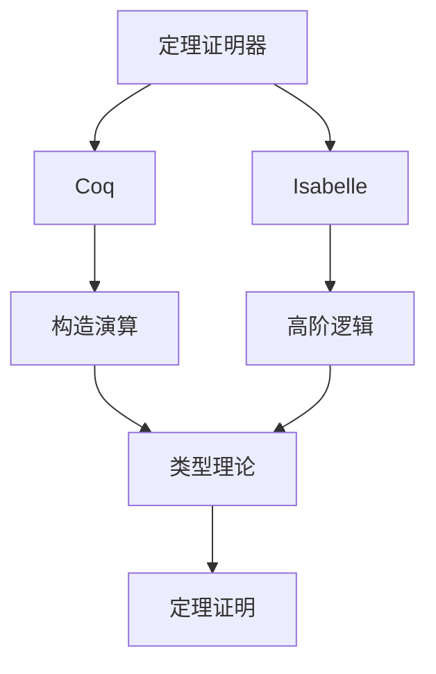
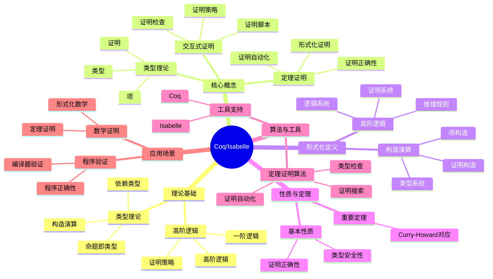
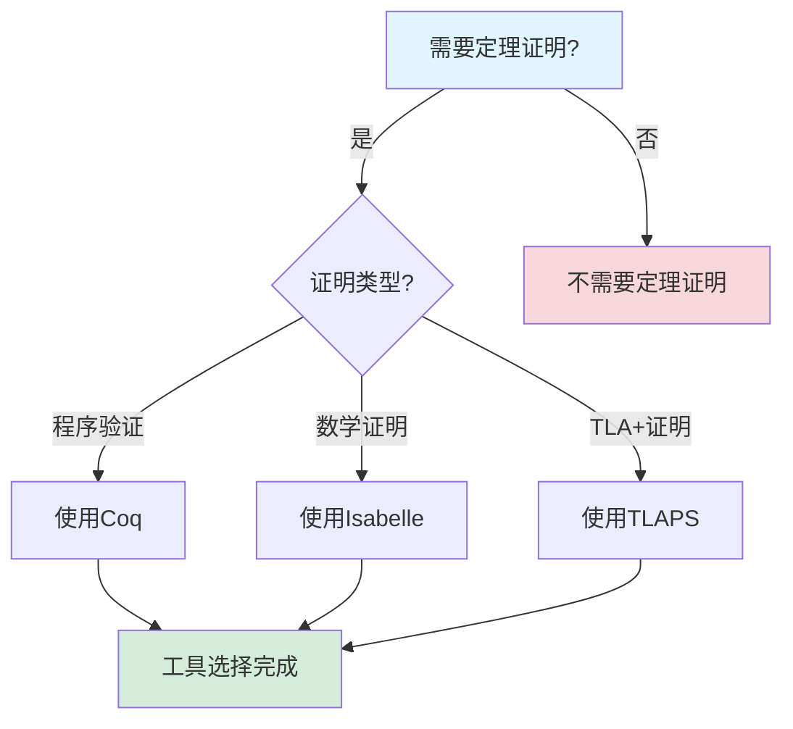
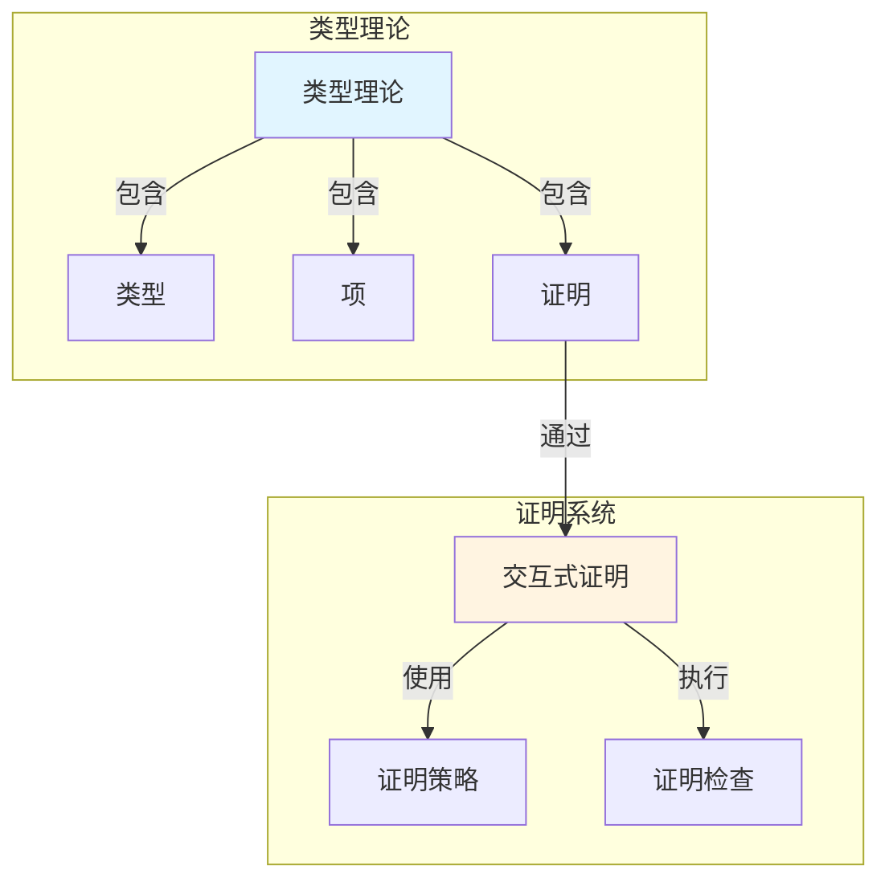
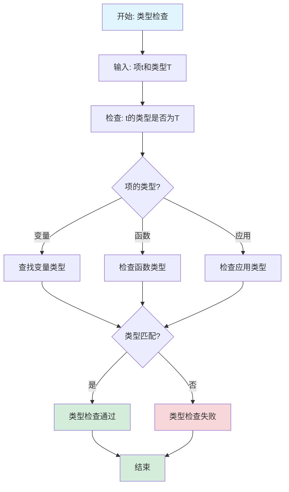

# Coq/Isabelle专题文档

## 目录

- [Coq/Isabelle专题文档](#coqisabelle专题文档)
  - [目录](#目录)
  - [一、概述](#一概述)
    - [1.1 Coq/Isabelle简介](#11-coqisabelle简介)
    - [1.2 核心思想](#12-核心思想)
    - [1.3 应用领域](#13-应用领域)
    - [1.4 在本项目中的应用](#14-在本项目中的应用)
  - [二、历史背景](#二历史背景)
    - [2.1 发展历史](#21-发展历史)
    - [2.2 重要人物](#22-重要人物)
    - [2.3 重要里程碑](#23-重要里程碑)
  - [三、核心概念](#三核心概念)
    - [3.1 基本概念](#31-基本概念)
      - [概念1：类型理论（Type Theory）](#概念1类型理论type-theory)
      - [概念2：高阶逻辑（Higher-Order Logic）](#概念2高阶逻辑higher-order-logic)
      - [概念3：交互式证明（Interactive Proof）](#概念3交互式证明interactive-proof)
    - [3.2 概念关系](#32-概念关系)
  - [四、形式化定义](#四形式化定义)
    - [4.1 数学定义](#41-数学定义)
      - [定义1：构造演算（Calculus of Constructions）](#定义1构造演算calculus-of-constructions)
      - [定义2：高阶逻辑（Higher-Order Logic）](#定义2高阶逻辑higher-order-logic)
    - [4.2 语法定义](#42-语法定义)
      - [Coq语法要素](#coq语法要素)
      - [Isabelle语法要素](#isabelle语法要素)
    - [4.3 语义定义](#43-语义定义)
      - [语义1：类型语义](#语义1类型语义)
  - [五、性质与定理](#五性质与定理)
    - [5.1 基本性质](#51-基本性质)
      - [性质1：类型安全性](#性质1类型安全性)
      - [性质2：证明正确性](#性质2证明正确性)
    - [5.2 重要定理](#52-重要定理)
      - [定理1：Curry-Howard对应](#定理1curry-howard对应)
  - [六、算法与工具](#六算法与工具)
    - [6.1 定理证明算法](#61-定理证明算法)
      - [算法1：类型检查算法](#算法1类型检查算法)
    - [6.2 工具支持](#62-工具支持)
      - [工具1：Coq](#工具1coq)
      - [工具2：Isabelle](#工具2isabelle)
  - [七、应用场景](#七应用场景)
    - [7.1 适用场景](#71-适用场景)
      - [场景1：数学证明](#场景1数学证明)
      - [场景2：程序验证](#场景2程序验证)
    - [7.2 不适用场景](#72-不适用场景)
      - [场景1：快速原型](#场景1快速原型)
      - [场景2：简单程序](#场景2简单程序)
  - [八、实践案例](#八实践案例)
    - [8.1 工业界案例](#81-工业界案例)
      - [案例1：编译器验证](#案例1编译器验证)
    - [8.2 学术界案例](#82-学术界案例)
      - [案例1：数学定理证明](#案例1数学定理证明)
  - [九、学习资源](#九学习资源)
    - [9.1 推荐阅读](#91-推荐阅读)
      - [经典著作](#经典著作)
    - [9.2 学习路径](#92-学习路径)
      - [入门路径（2-4周）](#入门路径2-4周)
  - [十、参考文献](#十参考文献)
    - [10.1 经典文献](#101-经典文献)
      - [原始论文](#原始论文)
    - [10.2 在线资源](#102-在线资源)
      - [Wikipedia](#wikipedia)
      - [工具文档](#工具文档)
  - [十一、思维表征](#十一思维表征)
    - [11.1 知识体系思维导图](#111-知识体系思维导图)
    - [11.2 多维知识对比矩阵](#112-多维知识对比矩阵)
      - [矩阵1：定理证明工具对比矩阵](#矩阵1定理证明工具对比矩阵)
      - [矩阵2：Coq vs Isabelle对比矩阵](#矩阵2coq-vs-isabelle对比矩阵)
    - [11.3 论证决策树](#113-论证决策树)
      - [决策树1：定理证明工具选择决策树](#决策树1定理证明工具选择决策树)
    - [11.4 概念属性关系图](#114-概念属性关系图)
    - [11.5 形式化证明流程图](#115-形式化证明流程图)
      - [证明流程图1：类型检查算法流程图](#证明流程图1类型检查算法流程图)

---

## 一、概述

### 1.1 Coq/Isabelle简介

**Coq和Isabelle** 是两种交互式定理证明器（Interactive Theorem Prover），用于形式化验证数学定理和程序正确性。Coq由法国INRIA开发，Isabelle由英国剑桥大学和德国慕尼黑工业大学开发。

**来源**：基于Wikipedia [Coq](https://en.wikipedia.org/wiki/Coq) 和 [Isabelle](https://en.wikipedia.org/wiki/Isabelle_(proof_assistant)) 以及相关文档

**核心特点**：

1. **定理证明**：用于形式化证明数学定理
2. **程序验证**：用于验证程序正确性
3. **交互式**：支持交互式证明
4. **广泛应用**：广泛应用于形式化验证

### 1.2 核心思想

**核心思想1：类型理论**

Coq基于构造演算（Calculus of Constructions），Isabelle基于高阶逻辑（Higher-Order Logic）：

- **类型系统**：使用类型系统保证正确性
- **构造性**：基于构造性数学
- **证明即程序**：证明可以看作程序

**核心思想2：交互式证明**

Coq和Isabelle支持交互式证明：

- **证明脚本**：编写证明脚本
- **自动化**：使用自动化工具辅助证明
- **验证**：系统验证证明的正确性

**核心思想3：程序验证**

Coq和Isabelle可以用于程序验证：

- **规范**：编写程序规范
- **证明**：证明程序满足规范
- **提取**：从证明中提取程序

### 1.3 应用领域

**应用领域1：数学证明**

- 数学定理证明
- 形式化数学
- 数学验证

**应用领域2：程序验证**

- 程序正确性验证
- 安全关键系统验证
- 编译器验证

**应用领域3：形式化方法**

- 形式化规约
- 形式化验证
- 形式化开发

### 1.4 在本项目中的应用

**在本项目中的应用**：

1. **形式化验证**：可以使用Coq/Isabelle进行形式化验证
2. **定理证明**：证明工作流系统的性质
3. **程序验证**：验证工作流实现的正确性

**相关文档链接**：

- [形式化验证理论](../03-formal-verification/形式化验证理论.md)

---

## 二、历史背景

### 2.1 发展历史

**1984年**：Coq开发开始

- **机构**：法国INRIA
- **目标**：开发交互式定理证明器

**1986年**：Isabelle开发开始

- **机构**：英国剑桥大学和德国慕尼黑工业大学
- **目标**：开发通用证明助手

**1990年代**：工具成熟

- **功能**：完善证明功能
- **应用**：应用于数学和程序验证

**2000年代至今**：持续发展

- **改进**：持续改进工具功能
- **应用**：扩展到更多领域

**来源**：Wikipedia [Coq](https://en.wikipedia.org/wiki/Coq) 和 [Isabelle](https://en.wikipedia.org/wiki/Isabelle_(proof_assistant))

### 2.2 重要人物

**Coq开发团队**

- **机构**：法国INRIA
- **贡献**：开发Coq定理证明器

**Isabelle开发团队**

- **机构**：英国剑桥大学和德国慕尼黑工业大学
- **贡献**：开发Isabelle证明助手

**来源**：相关文档

### 2.3 重要里程碑

| 时间 | 里程碑 | 影响 |
|------|--------|------|
| **1984** | Coq开发开始 | 建立定理证明工具 |
| **1986** | Isabelle开发开始 | 建立通用证明助手 |
| **1990** | 工具成熟 | 提供实用工具 |
| **2000** | 大规模应用 | 证明工具实用性 |

---

## 三、核心概念

### 3.1 基本概念

#### 概念1：类型理论（Type Theory）

**定义**：类型理论是Coq的基础，使用类型系统保证正确性。

**特点**：

- **类型系统**：使用类型系统
- **构造性**：基于构造性数学
- **证明即程序**：证明可以看作程序

**来源**：Coq文档

#### 概念2：高阶逻辑（Higher-Order Logic）

**定义**：高阶逻辑是Isabelle的基础，支持高阶量化。

**特点**：

- **高阶量化**：支持高阶量化
- **多态性**：支持多态类型
- **自动化**：支持自动化证明

**来源**：Isabelle文档

#### 概念3：交互式证明（Interactive Proof）

**定义**：交互式证明是用户和系统协作完成的证明。

**特点**：

- **证明脚本**：编写证明脚本
- **自动化**：使用自动化工具
- **验证**：系统验证证明

**来源**：Coq和Isabelle文档

### 3.2 概念关系

**概念关系图**：



---

## 四、形式化定义

### 4.1 数学定义

#### 定义1：构造演算（Calculus of Constructions）

**定义**：构造演算是Coq的类型理论基础。

**形式化定义**：

$$ \text{CoC} = (\text{Types}, \text{Terms}, \text{Judgments}) $$

**来源**：Coq文档

#### 定义2：高阶逻辑（Higher-Order Logic）

**定义**：高阶逻辑是Isabelle的逻辑基础。

**形式化定义**：

$$ \text{HOL} = (\text{Types}, \text{Terms}, \text{Formulas}, \text{Proofs}) $$

**来源**：Isabelle文档

### 4.2 语法定义

#### Coq语法要素

**1. 类型定义**

```coq
Inductive nat : Type :=
  | O : nat
  | S : nat -> nat.
```

**2. 函数定义**

```coq
Definition add (n m : nat) : nat :=
  match n with
  | O => m
  | S n' => S (add n' m)
  end.
```

**3. 定理证明**

```coq
Theorem add_comm : forall n m : nat, add n m = add m n.
Proof.
  (* 证明脚本 *)
Qed.
```

**来源**：Coq文档

#### Isabelle语法要素

**1. 类型定义**

```isabelle
datatype nat = Zero | Suc nat
```

**2. 函数定义**

```isabelle
fun add :: "nat => nat => nat" where
  "add Zero n = n" |
  "add (Suc m) n = Suc (add m n)"
```

**3. 定理证明**

```isabelle
theorem add_comm: "add m n = add n m"
  by (induct m) auto
```

**来源**：Isabelle文档

### 4.3 语义定义

#### 语义1：类型语义

**定义**：类型的语义是值的集合。

**形式化定义**：

$$ [\![T]\!] = \{v: v \text{ has type } T\} $$

**来源**：相关类型理论

---

## 五、性质与定理

### 5.1 基本性质

#### 性质1：类型安全性

**表述**：类型系统保证类型安全。

**形式化表述**：

$$ \text{TypeSafe}(e) \iff \text{WellTyped}(e) \implies \text{NoRuntimeError}(e) $$

**来源**：相关类型理论

#### 性质2：证明正确性

**表述**：系统验证的证明是正确的。

**形式化表述**：

$$ \text{Verified}(P) \implies \text{Correct}(P) $$

**来源**：相关定理证明理论

### 5.2 重要定理

#### 定理1：Curry-Howard对应

**表述**：证明和程序之间存在对应关系。

**形式化表述**：

$$ \text{Proof} \leftrightarrow \text{Program} $$

**来源**：Curry-Howard对应理论

---

## 六、算法与工具

### 6.1 定理证明算法

#### 算法1：类型检查算法

**描述**：类型检查算法用于检查项的类型。

**算法步骤**：

```algorithm
TypeCheck(term, context):
输入：项 term，上下文 context
输出：类型 type 或错误

1. if term 是变量:
      return context[term]
2. if term 是函数应用:
      t1_type ← TypeCheck(term.func, context)
      t2_type ← TypeCheck(term.arg, context)
      if t1_type = t2_type -> result_type:
         return result_type
      else:
         return error
3. if term 是函数抽象:
      new_context ← context ∪ {param: param_type}
      body_type ← TypeCheck(term.body, new_context)
      return param_type -> body_type
```

**复杂度分析**：

- **时间复杂度**：$O(n)$ 其中 $n$ 是项的大小
- **空间复杂度**：$O(n)$

**来源**：相关类型检查算法

### 6.2 工具支持

#### 工具1：Coq

**介绍**：Coq是交互式定理证明器。

**功能**：

- 类型检查
- 定理证明
- 程序提取

**使用方法**：

```coq
(* Coq代码示例 *)
Definition add (n m : nat) : nat :=
  match n with
  | O => m
  | S n' => S (add n' m)
  end.

Theorem add_comm : forall n m : nat, add n m = add m n.
Proof.
  intros n m.
  induction n.
  - simpl. reflexivity.
  - simpl. rewrite IHn. reflexivity.
Qed.
```

**来源**：Coq官方文档

#### 工具2：Isabelle

**介绍**：Isabelle是通用证明助手。

**功能**：

- 定理证明
- 自动化证明
- 程序验证

**使用方法**：

```isabelle
(* Isabelle代码示例 *)
fun add :: "nat => nat => nat" where
  "add Zero n = n" |
  "add (Suc m) n = Suc (add m n)"

theorem add_comm: "add m n = add n m"
  by (induct m) auto
```

**来源**：Isabelle官方文档

---

## 七、应用场景

### 7.1 适用场景

#### 场景1：数学证明

**描述**：使用Coq/Isabelle进行数学定理证明。

**优势**：

- 可以形式化证明
- 保证证明正确性
- 可以验证证明

**示例**：四色定理证明、费马大定理证明

#### 场景2：程序验证

**描述**：使用Coq/Isabelle验证程序正确性。

**优势**：

- 可以形式化验证
- 保证程序正确性
- 可以发现程序错误

**示例**：编译器验证、操作系统验证

### 7.2 不适用场景

#### 场景1：快速原型

**描述**：Coq/Isabelle不适用于快速原型开发。

**原因**：

- 形式化验证需要时间
- 不适合快速迭代

#### 场景2：简单程序

**描述**：对于简单程序，可能不需要形式化验证。

**原因**：

- 形式化验证增加复杂性
- 简单程序可以使用测试

---

## 八、实践案例

### 8.1 工业界案例

#### 案例1：编译器验证

**背景**：使用Coq验证编译器的正确性。

**应用**：

- 编译器验证
- 程序正确性验证
- 系统验证

**效果**：

- 保证了编译器正确性
- 发现了编译器错误
- 提高了系统可靠性

**来源**：相关编译器验证案例

### 8.2 学术界案例

#### 案例1：数学定理证明

**背景**：使用Coq/Isabelle证明数学定理。

**应用**：

- 四色定理证明
- 费马大定理证明
- 其他数学定理证明

**效果**：

- 形式化证明了数学定理
- 保证了证明正确性
- 推动了数学研究

**来源**：相关数学证明案例

---

## 九、学习资源

### 9.1 推荐阅读

#### 经典著作

1. **"Software Foundations"**
   - 作者：Benjamin Pierce et al.
   - **推荐理由**：Coq的经典教程

2. **"Concrete Semantics"**
   - 作者：Tobias Nipkow, Gerwin Klein
   - **推荐理由**：Isabelle的经典教程

### 9.2 学习路径

#### 入门路径（2-4周）

1. **Week 1-2**：
   - 学习类型理论基础
   - 学习Coq/Isabelle语法
   - 完成简单证明

2. **Week 3-4**：
   - 学习复杂证明技巧
   - 学习程序验证
   - 完成实际项目

---

## 十、参考文献

### 10.1 经典文献

#### 原始论文

1. **相关Coq和Isabelle的原始论文**

### 10.2 在线资源

#### Wikipedia

- [Coq](https://en.wikipedia.org/wiki/Coq)
- [Isabelle](https://en.wikipedia.org/wiki/Isabelle_(proof_assistant))

#### 工具文档

- **Coq文档**：Coq官方网站
- **Isabelle文档**：Isabelle官方网站

---

**文档版本**：1.0

**创建时间**：2024年

**维护者**：项目团队

**最后更新**：2024年

**对标资源**：

- ✅ Wikipedia: [Coq](https://en.wikipedia.org/wiki/Coq), [Isabelle](https://en.wikipedia.org/wiki/Isabelle_(proof_assistant))
- ✅ 工具文档: Coq和Isabelle官方文档
- ✅ 经典教程: "Software Foundations", "Concrete Semantics"

---

## 十一、思维表征

### 11.1 知识体系思维导图

**Coq/Isabelle知识体系思维导图**：



### 11.2 多维知识对比矩阵

#### 矩阵1：定理证明工具对比矩阵

| 工具 | 理论基础 | 表达能力 | 自动化程度 | 易用性 | 适用场景 |
|------|---------|---------|-----------|--------|---------|
| **Coq** | 构造演算 | ⭐⭐⭐⭐⭐ | ⭐⭐⭐ | ⭐⭐⭐ | 程序验证、数学证明 |
| **Isabelle** | 高阶逻辑 | ⭐⭐⭐⭐⭐ | ⭐⭐⭐⭐ | ⭐⭐⭐⭐ | 数学证明、形式化方法 |
| **TLAPS** | TLA+ | ⭐⭐⭐⭐ | ⭐⭐⭐ | ⭐⭐ | TLA+证明 |
| **ACL2** | 一阶逻辑 | ⭐⭐⭐ | ⭐⭐⭐⭐ | ⭐⭐⭐ | 硬件验证 |

#### 矩阵2：Coq vs Isabelle对比矩阵

| 特性 | Coq | Isabelle |
|------|-----|----------|
| **理论基础** | 构造演算 | 高阶逻辑 |
| **证明方式** | 构造性证明 | 经典证明 |
| **自动化** | ⭐⭐⭐ | ⭐⭐⭐⭐ |
| **易用性** | ⭐⭐⭐ | ⭐⭐⭐⭐ |
| **适用场景** | 程序验证 | 数学证明 |

### 11.3 论证决策树

#### 决策树1：定理证明工具选择决策树



### 11.4 概念属性关系图

**Coq/Isabelle核心概念属性关系图**：



### 11.5 形式化证明流程图

#### 证明流程图1：类型检查算法流程图



---

**思维表征说明**：

- **思维导图**：全面展示Coq/Isabelle的知识体系结构
- **对比矩阵**：从多个维度对比定理证明工具
- **决策树**：提供清晰的决策路径，帮助选择合适的定理证明工具
- **关系图**：详细展示类型理论和证明系统之间的关系
- **证明流程图**：可视化类型检查算法的执行流程

**来源**：基于Coq/Isabelle理论、相关著作和实际应用经验
