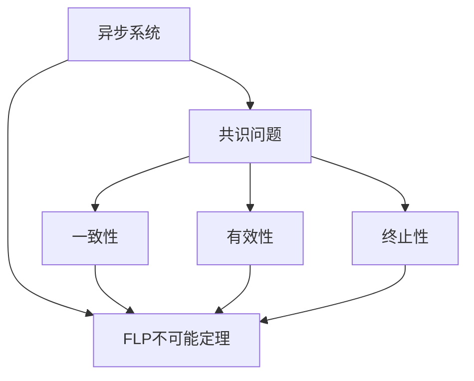
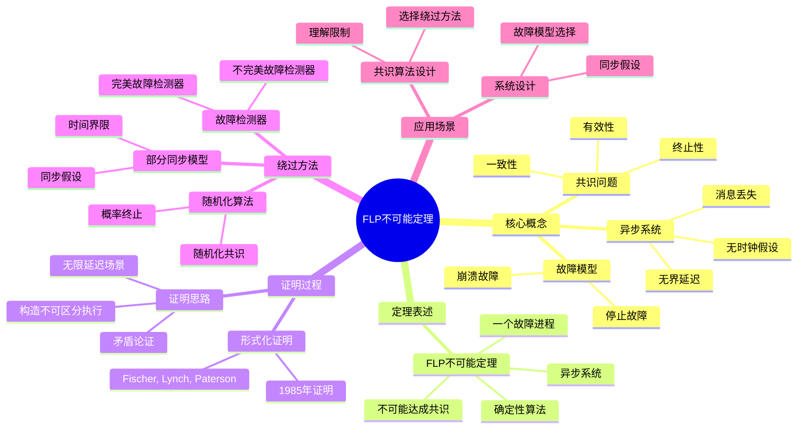
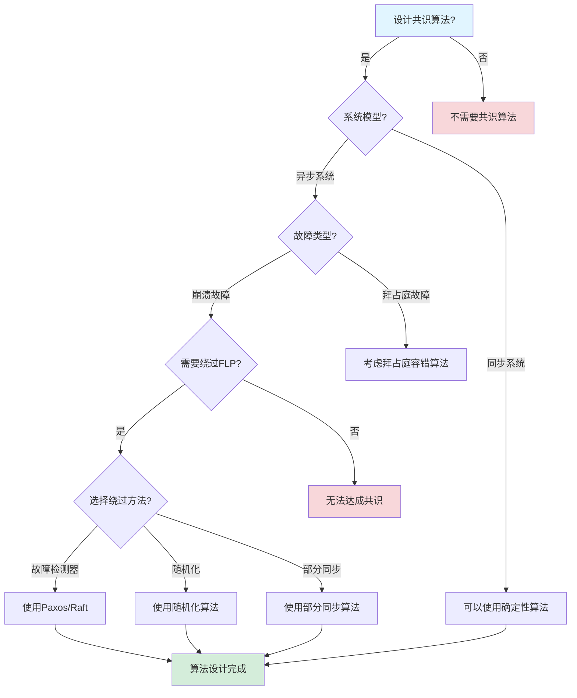
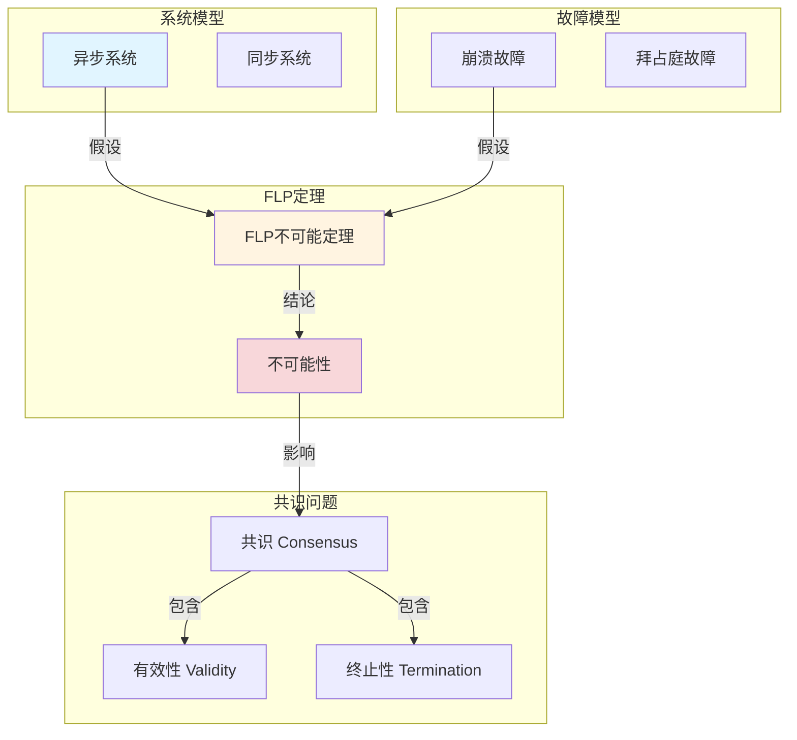
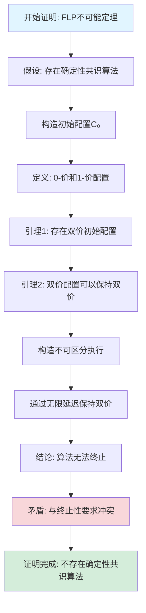

# FLP不可能定理专题文档

## 目录

- [FLP不可能定理专题文档](#flp不可能定理专题文档)
  - [目录](#目录)
  - [一、概述](#一概述)
    - [1.1 FLP不可能定理简介](#11-flp不可能定理简介)
    - [1.2 核心思想](#12-核心思想)
    - [1.3 应用领域](#13-应用领域)
    - [1.4 在本项目中的应用](#14-在本项目中的应用)
  - [二、历史背景](#二历史背景)
    - [2.1 发展历史](#21-发展历史)
    - [2.2 重要人物](#22-重要人物)
    - [2.3 重要里程碑](#23-重要里程碑)
  - [三、核心概念](#三核心概念)
    - [3.1 基本概念](#31-基本概念)
      - [概念1：异步系统](#概念1异步系统)
      - [概念2：共识问题](#概念2共识问题)
      - [概念3：故障模型](#概念3故障模型)
    - [3.2 概念关系](#32-概念关系)
  - [四、形式化定义](#四形式化定义)
    - [4.1 数学定义](#41-数学定义)
      - [定义1：异步系统](#定义1异步系统)
      - [定义2：共识算法](#定义2共识算法)
    - [4.2 定理表述](#42-定理表述)
      - [定理1：FLP不可能定理](#定理1flp不可能定理)
    - [4.3 证明过程](#43-证明过程)
      - [证明：FLP不可能定理](#证明flp不可能定理)
  - [五、性质与定理](#五性质与定理)
    - [5.1 基本性质](#51-基本性质)
      - [性质1：FLP不可能定理的严格性](#性质1flp不可能定理的严格性)
      - [性质2：绕过FLP的方法](#性质2绕过flp的方法)
    - [5.2 重要定理](#52-重要定理)
      - [定理1：故障检测器的充分性](#定理1故障检测器的充分性)
  - [六、绕过方法](#六绕过方法)
    - [6.1 故障检测器](#61-故障检测器)
    - [6.2 随机化算法](#62-随机化算法)
    - [6.3 部分同步模型](#63-部分同步模型)
  - [七、应用场景](#七应用场景)
    - [7.1 适用场景](#71-适用场景)
      - [场景1：共识算法设计](#场景1共识算法设计)
      - [场景2：系统设计](#场景2系统设计)
    - [7.2 不适用场景](#72-不适用场景)
      - [场景1：同步系统](#场景1同步系统)
      - [场景2：拜占庭故障](#场景2拜占庭故障)
  - [八、实践案例](#八实践案例)
    - [8.1 工业界案例](#81-工业界案例)
      - [案例1：Paxos算法](#案例1paxos算法)
      - [案例2：Raft算法](#案例2raft算法)
    - [8.2 学术界案例](#82-学术界案例)
      - [案例1：故障检测器](#案例1故障检测器)
  - [九、学习资源](#九学习资源)
    - [9.1 推荐阅读](#91-推荐阅读)
      - [经典著作](#经典著作)
      - [原始论文](#原始论文)
    - [9.2 学习路径](#92-学习路径)
      - [入门路径（1周）](#入门路径1周)
  - [十、参考文献](#十参考文献)
    - [10.1 经典文献](#101-经典文献)
      - [原始论文](#原始论文-1)
      - [重要论文](#重要论文)
    - [10.2 在线资源](#102-在线资源)
      - [Wikipedia](#wikipedia)
      - [经典著作](#经典著作-1)
  - [十一、思维表征](#十一思维表征)
    - [11.1 知识体系思维导图](#111-知识体系思维导图)
    - [11.2 多维知识对比矩阵](#112-多维知识对比矩阵)
      - [矩阵1：绕过FLP的方法对比矩阵](#矩阵1绕过flp的方法对比矩阵)
      - [矩阵2：FLP vs 其他不可能定理对比矩阵](#矩阵2flp-vs-其他不可能定理对比矩阵)
    - [11.3 论证决策树](#113-论证决策树)
      - [决策树1：共识算法设计决策树](#决策树1共识算法设计决策树)
    - [11.4 概念属性关系图](#114-概念属性关系图)
    - [11.5 形式化证明流程图](#115-形式化证明流程图)
      - [证明流程图1：FLP不可能定理证明步骤](#证明流程图1flp不可能定理证明步骤)

---

## 一、概述

### 1.1 FLP不可能定理简介

**FLP不可能定理（FLP Impossibility）** 是分布式系统理论中的一个重要定理，由Michael J. Fischer、Nancy A. Lynch和Michael S. Paterson在1985年提出。它指出，在异步分布式系统中，即使只有一个进程可能发生故障，也不可能设计出一个确定性的共识算法。

**来源**：基于Wikipedia [FLP Impossibility](https://en.wikipedia.org/wiki/Consensus_(computer_science)#FLP_impossibility_result) 和 Fischer/Lynch/Paterson的原始论文

**核心特点**：

1. **不可能性结果**：证明了在异步系统中确定性共识的不可能性
2. **故障模型**：即使只有一个进程可能故障
3. **影响深远**：对分布式系统设计产生深远影响

### 1.2 核心思想

**核心思想1：异步系统模型**

FLP不可能定理基于异步系统模型：

- **异步通信**：消息传递时间不确定
- **无全局时钟**：没有全局时钟同步
- **进程故障**：进程可能崩溃（crash failure）

**核心思想2：共识问题**

共识问题是分布式系统的核心问题：

- **一致性（Agreement）**：所有正确进程决定相同的值
- **有效性（Validity）**：决定的值必须是某个进程提议的值
- **终止性（Termination）**：所有正确进程最终都会决定

**核心思想3：不可能性**

在异步系统中，即使只有一个进程可能故障，也不可能设计出满足所有三个性质的确定性共识算法。

### 1.3 应用领域

**应用领域1：分布式共识**

- 共识算法设计
- 故障容错
- 系统可靠性

**应用领域2：分布式数据库**

- 数据复制
- 一致性保证
- 故障恢复

**应用领域3：区块链**

- 共识机制
- 故障容错
- 系统设计

### 1.4 在本项目中的应用

**在本项目中的应用**：

1. **Temporal的容错机制**：Temporal使用故障检测和超时机制绕过FLP不可能定理
2. **系统设计指导**：理解异步系统的限制
3. **故障处理**：设计故障检测和恢复机制

**相关文档链接**：

- [论证完备性增强](../14-argumentation-enhancement/论证完备性增强.md#14-flp不可能定理与容错)
- [形式化验证理论](../03-formal-verification/形式化验证理论.md)

---

## 二、历史背景

### 2.1 发展历史

**1985年**：FLP不可能定理提出

- **论文**："Impossibility of Distributed Consensus with One Faulty Process" by Fischer, Lynch & Paterson
- **期刊**：Journal of the ACM
- **贡献**：证明了异步系统中确定性共识的不可能性

**1990年代**：绕过方法研究

- **故障检测器**：Chandra & Toueg提出故障检测器概念
- **随机化算法**：研究随机化共识算法
- **部分同步模型**：研究部分同步模型

**2000年代至今**：持续影响

- **共识算法**：Paxos、Raft等算法考虑FLP限制
- **系统设计**：影响分布式系统设计
- **理论研究**：持续的理论研究

**来源**：Wikipedia [FLP Impossibility](https://en.wikipedia.org/wiki/Consensus_(computer_science)#FLP_impossibility_result) 和相关论文

### 2.2 重要人物

**Michael J. Fischer**

- **身份**：FLP不可能定理的共同提出者
- **背景**：美国计算机科学家，耶鲁大学教授
- **贡献**：
  - 与Lynch和Paterson共同提出FLP不可能定理
  - 在分布式系统理论方面做出重要贡献

**Nancy A. Lynch**

- **身份**：FLP不可能定理的共同提出者
- **背景**：美国计算机科学家，MIT教授
- **贡献**：
  - 与Fischer和Paterson共同提出FLP不可能定理
  - 在分布式系统理论方面做出重要贡献

**Michael S. Paterson**

- **身份**：FLP不可能定理的共同提出者
- **背景**：英国计算机科学家，华威大学教授
- **贡献**：
  - 与Fischer和Lynch共同提出FLP不可能定理
  - 在算法理论方面做出重要贡献

**来源**：Wikipedia和相关论文

### 2.3 重要里程碑

| 时间 | 里程碑 | 影响 |
|------|--------|------|
| **1985** | FLP不可能定理提出 | 证明异步系统共识的不可能性 |
| **1990** | 故障检测器提出 | 提供绕过方法 |
| **2000** | 共识算法发展 | 考虑FLP限制 |

---

## 三、核心概念

### 3.1 基本概念

#### 概念1：异步系统

**定义**：异步系统是指消息传递时间不确定、没有全局时钟的分布式系统。

**特点**：

- **消息延迟不确定**：消息传递时间可能任意长
- **无全局时钟**：没有全局时钟同步
- **进程执行速度不确定**：进程执行速度可能不同

**来源**：Fischer, Lynch & Paterson, "Impossibility of Distributed Consensus" (1985)

#### 概念2：共识问题

**定义**：共识问题是让所有进程就某个值达成一致的问题。

**形式化定义**：

共识问题需要满足三个性质：

1. **一致性（Agreement）**：所有正确进程决定相同的值
2. **有效性（Validity）**：决定的值必须是某个进程提议的值
3. **终止性（Termination）**：所有正确进程最终都会决定

**来源**：Fischer, Lynch & Paterson, "Impossibility of Distributed Consensus" (1985)

#### 概念3：故障模型

**定义**：FLP不可能定理考虑崩溃故障（crash failure）模型。

**特点**：

- **崩溃故障**：进程可能停止工作，不再发送消息
- **最多一个故障**：最多只有一个进程可能故障
- **非拜占庭故障**：不考虑恶意行为

**来源**：Fischer, Lynch & Paterson, "Impossibility of Distributed Consensus" (1985)

### 3.2 概念关系

**概念关系图**：

---

## 四、形式化定义

### 4.1 数学定义

#### 定义1：异步系统

**定义**：异步系统是一个三元组 $AS = (P, M, C)$，其中：

- $P$ 是进程集合
- $M$ 是消息集合
- $C$ 是配置集合

**来源**：Fischer, Lynch & Paterson, "Impossibility of Distributed Consensus" (1985)

#### 定义2：共识算法

**定义**：共识算法是一个函数，将初始配置映射到决定值。

**形式化定义**：

$$ \text{Consensus}: C_0 \to V $$

其中 $C_0$ 是初始配置，$V$ 是值集合。

**来源**：Fischer, Lynch & Paterson, "Impossibility of Distributed Consensus" (1985)

### 4.2 定理表述

#### 定理1：FLP不可能定理

**表述**：在异步分布式系统中，即使只有一个进程可能发生故障，也不可能设计出一个确定性的共识算法，同时满足一致性、有效性和终止性。

**形式化表述**：

$$ \neg \exists \text{Algorithm}: \text{Agreement} \land \text{Validity} \land \text{Termination} $$

即，不存在同时满足三个性质的确定性共识算法。

**来源**：Fischer, Lynch & Paterson, "Impossibility of Distributed Consensus" (1985)

### 4.3 证明过程

#### 证明：FLP不可能定理

**证明思路**：

1. **假设**：假设存在满足三个性质的确定性共识算法
2. **构造初始配置**：构造一个初始配置，使得算法无法决定
3. **推导矛盾**：
   - 由于异步性，可以延迟消息传递
   - 可以构造一个执行，使得算法永远无法决定
   - 违反终止性
4. **结论**：矛盾，因此不存在满足三个性质的确定性共识算法

**详细证明**：

**步骤1**：定义双值配置

配置 $C$ 是双值的（bivalent），如果从 $C$ 开始，算法可能决定0或1。

**步骤2**：证明存在双值初始配置

假设所有初始配置都是单值的（univalent），则算法在初始配置就已经决定，违反有效性。因此，存在双值初始配置。

**步骤3**：保持双值性

从双值配置 $C$ 开始，可以延迟某个进程的消息，使得配置保持双值。

**步骤4**：构造无限执行

通过不断延迟消息，可以构造一个无限执行，使得算法永远无法决定，违反终止性。

**结论**：不存在满足三个性质的确定性共识算法。□

**来源**：Fischer, Lynch & Paterson, "Impossibility of Distributed Consensus" (1985)

---

## 五、性质与定理

### 5.1 基本性质

#### 性质1：FLP不可能定理的严格性

**表述**：FLP不可能定理在异步系统模型下是严格的。

**证明**：由Fischer/Lynch/Paterson的证明可得。

**来源**：Fischer, Lynch & Paterson, "Impossibility of Distributed Consensus" (1985)

#### 性质2：绕过FLP的方法

**表述**：可以通过以下方法绕过FLP不可能定理：

1. **故障检测器**：使用故障检测器
2. **随机化算法**：使用随机化算法
3. **部分同步模型**：使用部分同步模型

**来源**：相关研究

### 5.2 重要定理

#### 定理1：故障检测器的充分性

**表述**：使用故障检测器，可以实现共识。

**证明**：由Chandra & Toueg的证明可得。

**来源**：Chandra & Toueg, "Unreliable Failure Detectors for Reliable Distributed Systems" (1996)

---

## 六、绕过方法

### 6.1 故障检测器

**方法**：使用故障检测器检测进程故障。

**原理**：

- **故障检测器**：提供进程是否故障的信息
- **不完美检测**：故障检测器可能出错
- **最终准确性**：最终能够正确检测故障

**实现**：

- **心跳机制**：使用心跳检测故障
- **超时机制**：使用超时检测故障

**来源**：Chandra & Toueg, "Unreliable Failure Detectors" (1996)

### 6.2 随机化算法

**方法**：使用随机化算法。

**原理**：

- **随机选择**：使用随机数打破对称性
- **概率终止**：以概率1终止
- **期望时间**：期望终止时间有限

**实现**：

- **随机化共识算法**：如Ben-Or算法
- **概率保证**：提供概率性保证

**来源**：相关研究

### 6.3 部分同步模型

**方法**：使用部分同步模型。

**原理**：

- **部分同步**：在某些时候系统是同步的
- **最终同步**：最终系统会同步
- **利用同步**：利用同步时刻达成共识

**实现**：

- **部分同步共识算法**：如DLS算法
- **同步假设**：假设最终会同步

**来源**：Dwork, Lynch & Stockmeyer, "Consensus in the Presence of Partial Synchrony" (1988)

---

## 七、应用场景

### 7.1 适用场景

#### 场景1：共识算法设计

**描述**：理解FLP限制，设计共识算法。

**优势**：

- 理解系统限制
- 选择合适的绕过方法
- 设计可靠的系统

**示例**：Paxos、Raft等算法

#### 场景2：系统设计

**描述**：在系统设计中考虑FLP限制。

**优势**：

- 理解异步系统的限制
- 设计故障检测机制
- 选择合适的模型

**示例**：分布式数据库、区块链系统

### 7.2 不适用场景

#### 场景1：同步系统

**描述**：FLP不可能定理不适用于同步系统。

**原因**：

- 同步系统可以避免某些问题
- 可以设计确定性共识算法

#### 场景2：拜占庭故障

**描述**：FLP不可能定理考虑的是崩溃故障，不是拜占庭故障。

**原因**：

- 拜占庭故障更复杂
- 需要不同的处理方法

---

## 八、实践案例

### 8.1 工业界案例

#### 案例1：Paxos算法

**背景**：Paxos算法使用故障检测和超时机制绕过FLP限制。

**方法**：

- 使用超时检测故障
- 使用多数派保证一致性
- 在网络分区时可能不可用

**效果**：

- 实现了共识
- 保证了系统可靠性
- 在网络分区时需要处理

**来源**：Lamport, "Paxos Made Simple" (2001)

#### 案例2：Raft算法

**背景**：Raft算法也使用故障检测和超时机制。

**方法**：

- 使用心跳检测故障
- 使用多数派保证一致性
- 在网络分区时可能不可用

**效果**：

- 实现了共识
- 保证了系统可靠性
- 比Paxos更容易理解

**来源**：Ongaro & Ousterhout, "In Search of an Understandable Consensus Algorithm" (2014)

### 8.2 学术界案例

#### 案例1：故障检测器

**背景**：Chandra & Toueg提出故障检测器概念。

**贡献**：

- 提供了绕过FLP的方法
- 建立了故障检测器理论
- 推动了共识算法研究

**来源**：Chandra & Toueg, "Unreliable Failure Detectors" (1996)

---

## 九、学习资源

### 9.1 推荐阅读

#### 经典著作

1. **"Introduction to Reliable and Secure Distributed Programming"**
   - 作者：Christian Cachin, Rachid Guerraoui, Luís Rodrigues
   - 出版社：Springer
   - 出版年份：2011
   - **推荐理由**：包含FLP不可能定理的详细讲解

#### 原始论文

1. **"Impossibility of Distributed Consensus with One Faulty Process"**
   - 作者：Michael J. Fischer, Nancy A. Lynch, Michael S. Paterson
   - 期刊：Journal of the ACM
   - 年份：1985
   - **推荐理由**：FLP不可能定理的原始论文

### 9.2 学习路径

#### 入门路径（1周）

1. **Day 1-2**：
   - 阅读FLP不可能定理的原始论文
   - 理解异步系统模型
   - 理解共识问题

2. **Day 3-5**：
   - 学习绕过方法
   - 理解故障检测器
   - 完成实际案例分析

---

## 十、参考文献

### 10.1 经典文献

#### 原始论文

1. **Fischer, M. J., Lynch, N. A., & Paterson, M. S. (1985). "Impossibility of Distributed Consensus with One Faulty Process"**
   - 期刊：Journal of the ACM
   - 卷号：32, 2
   - 页码：374-382
   - **重要性**：FLP不可能定理的原始论文

#### 重要论文

2. **Chandra, T. D., & Toueg, S. (1996). "Unreliable Failure Detectors for Reliable Distributed Systems"**
   - 期刊：Journal of the ACM
   - **重要性**：故障检测器的原始论文

### 10.2 在线资源

#### Wikipedia

- [FLP Impossibility](https://en.wikipedia.org/wiki/Consensus_(computer_science)#FLP_impossibility_result)
- [Distributed Consensus](https://en.wikipedia.org/wiki/Consensus_(computer_science))

#### 经典著作

- **"Introduction to Reliable and Secure Distributed Programming"** by Cachin, Guerraoui & Rodrigues (2011)

---

**文档版本**：1.0

**创建时间**：2024年

**维护者**：项目团队

**最后更新**：2024年

**对标资源**：

- ✅ Wikipedia: [FLP Impossibility](https://en.wikipedia.org/wiki/Consensus_(computer_science)#FLP_impossibility_result)
- ✅ 经典著作: "Introduction to Reliable and Secure Distributed Programming" by Cachin et al. (2011)
- ✅ 原始论文: "Impossibility of Distributed Consensus" by Fischer, Lynch & Paterson (1985)
- ✅ 大学课程: MIT 6.824, CMU 15-440

---

## 十一、思维表征

### 11.1 知识体系思维导图

**FLP不可能定理知识体系思维导图**：

### 11.2 多维知识对比矩阵

#### 矩阵1：绕过FLP的方法对比矩阵

| 绕过方法 | 假设条件 | 复杂度 | 适用场景 | 典型算法 |
|---------|---------|--------|---------|---------|
| **故障检测器** | 完美/不完美故障检测器 | ⭐⭐⭐ | 分布式系统 | Paxos, Raft |
| **随机化算法** | 随机数生成器 | ⭐⭐⭐⭐ | 概率系统 | Ben-Or算法 |
| **部分同步模型** | 时间界限假设 | ⭐⭐⭐ | 实时系统 | DLS算法 |

#### 矩阵2：FLP vs 其他不可能定理对比矩阵

| 不可能定理 | 关注点 | 假设条件 | 结论 | 影响 |
|-----------|--------|---------|------|------|
| **FLP不可能定理** | 异步系统共识 | 异步系统、一个故障 | 不可能达成共识 | ⭐⭐⭐⭐⭐ |
| **CAP定理** | 分布式系统设计 | 网络分区 | 三选二约束 | ⭐⭐⭐⭐⭐ |
| **拜占庭容错** | 恶意故障 | 拜占庭故障 | 需要2f+1节点 | ⭐⭐⭐⭐ |

### 11.3 论证决策树

#### 决策树1：共识算法设计决策树

### 11.4 概念属性关系图

**FLP不可能定理核心概念属性关系图**：

### 11.5 形式化证明流程图

#### 证明流程图1：FLP不可能定理证明步骤

---

**思维表征说明**：

- **思维导图**：全面展示FLP不可能定理的知识体系结构
- **对比矩阵**：从多个维度对比绕过方法和相关定理
- **决策树**：提供清晰的决策路径，帮助选择合适的共识算法设计方法
- **关系图**：详细展示概念、属性、关系之间的网络
- **证明流程图**：可视化FLP不可能定理的证明步骤和逻辑

**来源**：基于FLP不可能定理理论、Fischer, Lynch & Paterson的证明和实际应用经验
