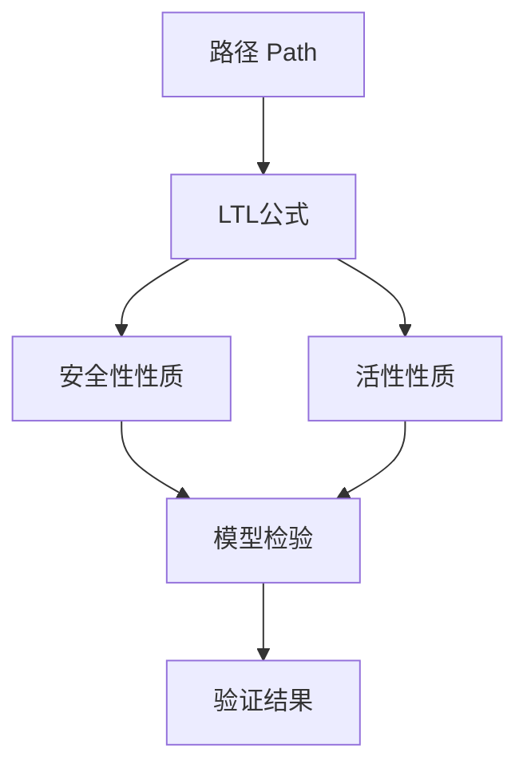
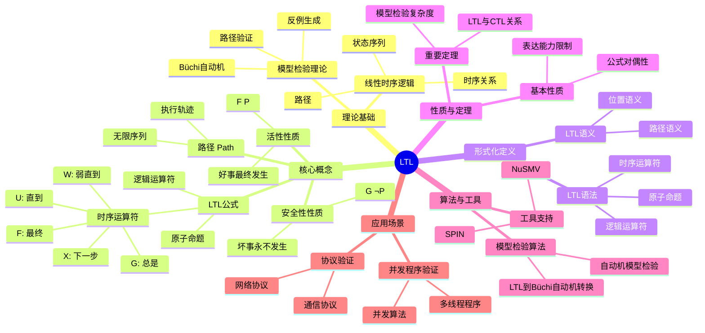
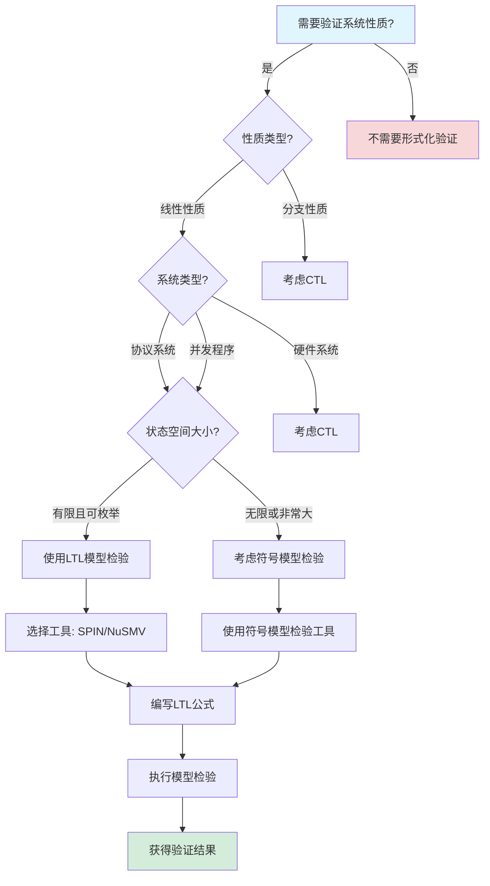
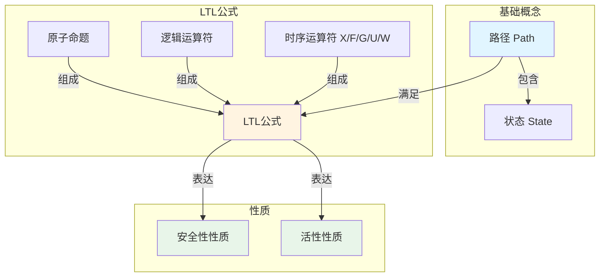

# LTL（Linear Temporal Logic）专题文档

## 目录

- [LTL（Linear Temporal Logic）专题文档](#ltllinear-temporal-logic专题文档)
  - [目录](#目录)
  - [一、概述](#一概述)
    - [1.1 LTL简介](#11-ltl简介)
    - [1.2 核心思想](#12-核心思想)
    - [1.3 应用领域](#13-应用领域)
    - [1.4 在本项目中的应用](#14-在本项目中的应用)
  - [二、历史背景](#二历史背景)
    - [2.1 发展历史](#21-发展历史)
    - [2.2 重要人物](#22-重要人物)
    - [2.3 重要里程碑](#23-重要里程碑)
  - [三、核心概念](#三核心概念)
    - [3.1 基本概念](#31-基本概念)
      - [概念1：路径（Path）](#概念1路径path)
      - [概念2：LTL公式](#概念2ltl公式)
      - [概念3：安全性性质（Safety Property）](#概念3安全性性质safety-property)
      - [概念4：活性性质（Liveness Property）](#概念4活性性质liveness-property)
    - [3.2 概念关系](#32-概念关系)
  - [四、形式化定义](#四形式化定义)
    - [4.1 数学定义](#41-数学定义)
      - [定义1：LTL语法](#定义1ltl语法)
      - [定义2：LTL语义](#定义2ltl语义)
    - [4.2 语法定义](#42-语法定义)
      - [LTL语法要素](#ltl语法要素)
    - [4.3 语义定义](#43-语义定义)
      - [语义1：路径语义](#语义1路径语义)
  - [五、性质与定理](#五性质与定理)
    - [5.1 基本性质](#51-基本性质)
      - [性质1：LTL公式的对偶性](#性质1ltl公式的对偶性)
      - [性质2：LTL表达能力的限制](#性质2ltl表达能力的限制)
    - [5.2 重要定理](#52-重要定理)
      - [定理1：LTL模型检验复杂度](#定理1ltl模型检验复杂度)
      - [定理2：LTL与CTL的关系](#定理2ltl与ctl的关系)
  - [六、算法与工具](#六算法与工具)
    - [6.1 模型检验算法](#61-模型检验算法)
      - [算法1：LTL到Büchi自动机转换](#算法1ltl到büchi自动机转换)
    - [6.2 工具支持](#62-工具支持)
      - [工具1：SPIN](#工具1spin)
      - [工具2：NuSMV](#工具2nusmv)
  - [七、应用场景](#七应用场景)
    - [7.1 适用场景](#71-适用场景)
      - [场景1：协议验证](#场景1协议验证)
      - [场景2：并发程序验证](#场景2并发程序验证)
    - [7.2 不适用场景](#72-不适用场景)
      - [场景1：分支性质](#场景1分支性质)
      - [场景2：实时系统](#场景2实时系统)
  - [八、实践案例](#八实践案例)
    - [8.1 工业界案例](#81-工业界案例)
      - [案例1：协议验证](#案例1协议验证)
    - [8.2 学术界案例](#82-学术界案例)
      - [案例1：并发程序验证](#案例1并发程序验证)
  - [九、学习资源](#九学习资源)
    - [9.1 推荐阅读](#91-推荐阅读)
      - [经典教材](#经典教材)
      - [原始论文](#原始论文)
    - [9.2 学习路径](#92-学习路径)
      - [入门路径（1-2周）](#入门路径1-2周)
  - [十、参考文献](#十参考文献)
    - [10.1 经典文献](#101-经典文献)
      - [原始论文](#原始论文-1)
    - [10.2 在线资源](#102-在线资源)
      - [Wikipedia](#wikipedia)
      - [工具文档](#工具文档)
  - [十一、思维表征](#十一思维表征)
    - [11.1 知识体系思维导图](#111-知识体系思维导图)
    - [11.2 多维知识对比矩阵](#112-多维知识对比矩阵)
      - [矩阵1：LTL vs CTL对比矩阵](#矩阵1ltl-vs-ctl对比矩阵)
      - [矩阵2：LTL工具对比矩阵](#矩阵2ltl工具对比矩阵)
    - [11.3 论证决策树](#113-论证决策树)
      - [决策树1：何时使用LTL进行验证](#决策树1何时使用ltl进行验证)
    - [11.4 概念属性关系图](#114-概念属性关系图)
    - [11.5 形式化证明流程图](#115-形式化证明流程图)
      - [证明流程图1：LTL到Büchi自动机转换算法](#证明流程图1ltl到büchi自动机转换算法)

---

## 一、概述

### 1.1 LTL简介

**LTL（Linear Temporal Logic）** 是一种线性时序逻辑，用于描述和验证并发系统的时序性质。它由Amir Pnueli在1977年提出，是时序逻辑和模型检验领域的基础理论。

**来源**：基于Wikipedia [Linear Temporal Logic](https://en.wikipedia.org/wiki/Linear_temporal_logic) 和 Pnueli的原始论文

**核心特点**：

1. **线性时间**：考虑系统的一条执行路径
2. **时序运算符**：使用时序运算符（X、F、G、U）描述时间相关性质
3. **模型检验**：可以自动验证有限状态系统的性质
4. **表达能力**：可以表达安全性和活性性质

### 1.2 核心思想

**核心思想1：线性路径**:

LTL基于线性路径模型，系统的执行是一条路径：

- **路径**：状态的无限序列，表示系统的一个执行
- **线性性**：每个时刻只有一个状态
- **时间性**：路径上的位置表示时间点

**核心思想2：时序运算符**:

LTL使用时序运算符描述时间相关性质：

- **$X\phi$（Next）**：下一步满足 $\phi$
- **$F\phi$（Finally/Eventually）**：最终满足 $\phi$
- **$G\phi$（Globally/Always）**：总是满足 $\phi$
- **$\phi U \psi$（Until）**：$\phi$ 直到 $\psi$ 成立
- **$\phi W \psi$（Weak Until）**：弱直到

**核心思想3：性质分类**:

LTL可以表达两类性质：

- **安全性（Safety）**：坏事永远不会发生，如 $G \neg P$
- **活性（Liveness）**：好事最终会发生，如 $F P$

### 1.3 应用领域

**应用领域1：程序验证**:

- 并发程序验证
- 协议验证
- 嵌入式系统验证

**应用领域2：硬件验证**:

- 电路验证
- 协议验证
- 系统验证

**应用领域3：系统验证**:

- 分布式系统验证
- 实时系统验证
- 安全协议验证

### 1.4 在本项目中的应用

**在本项目中的应用**：

1. **工作流性质验证**：使用LTL验证工作流的时序性质
2. **安全性验证**：验证工作流的安全性性质
3. **活性验证**：验证工作流的活性性质
4. **公平性验证**：验证工作流的公平性

**相关文档链接**：

- [形式化验证理论](../03-formal-verification/形式化验证理论.md#二时序逻辑验证框架)
- [论证完备性增强](../14-argumentation-enhancement/论证完备性增强.md)

---

## 二、历史背景

### 2.1 发展历史

**1977年**：LTL提出

- **论文**："The Temporal Logic of Programs" by Amir Pnueli
- **会议**：18th Annual Symposium on Foundations of Computer Science
- **贡献**：提出了LTL语法和语义，建立了时序逻辑的基础

**1980年代**：LTL模型检验发展

- **算法**：LTL模型检验算法开发
- **工具**：SPIN等工具开始使用LTL

**1990年代**：符号模型检验

- **BDD**：使用BDD进行符号模型检验
- **工具**：SPIN、NuSMV等工具成熟

**2000年代至今**：持续发展和应用

- **工业界采用**：广泛用于硬件和软件验证
- **工具改进**：符号模型检验、有界模型检验等技术发展
- **理论研究**：LTL扩展、复杂度分析等研究

**来源**：Wikipedia [Linear Temporal Logic](https://en.wikipedia.org/wiki/Linear_temporal_logic) 和相关论文

### 2.2 重要人物

**Amir Pnueli（1941-2009）**:

- **身份**：LTL的创始人，1996年图灵奖获得者
- **背景**：以色列计算机科学家，魏茨曼科学研究所教授
- **贡献**：
  - 提出LTL
  - 在时序逻辑和程序验证领域做出重要贡献
- **荣誉**：1996年图灵奖

**来源**：Wikipedia [Amir Pnueli](https://en.wikipedia.org/wiki/Amir_Pnueli)

### 2.3 重要里程碑

| 时间 | 里程碑 | 影响 |
|------|--------|------|
| **1977** | LTL提出 | 建立线性时序逻辑基础 |
| **1980** | LTL模型检验算法 | 提供实用验证方法 |
| **1990** | 符号模型检验 | 处理更大状态空间 |
| **1996** | Pnueli获得图灵奖 | 认可时序逻辑重要性 |
| **2000** | 工业界大规模采用 | 证明LTL实用性 |

---

## 三、核心概念

### 3.1 基本概念

#### 概念1：路径（Path）

**定义**：路径是状态的无限序列，表示系统的一个可能执行。

**形式化定义**：

$$ \pi = s_0, s_1, s_2, ... $$

其中每个 $s_i$ 是一个状态。

**来源**：Pnueli, "The Temporal Logic of Programs" (1977)

#### 概念2：LTL公式

**定义**：LTL公式由原子命题和时序运算符组成。

**语法**：

$$ \phi ::= \text{true} | \text{false} | p | \neg \phi | \phi \land \psi | \phi \lor \psi | X\phi | F\phi | G\phi | \phi U \psi | \phi W \psi $$

其中：

- $p$ 是原子命题
- $X\phi$：下一步满足 $\phi$
- $F\phi$：最终满足 $\phi$
- $G\phi$：总是满足 $\phi$
- $\phi U \psi$：$\phi$ 直到 $\psi$ 成立
- $\phi W \psi$：弱直到

**来源**：Pnueli, "The Temporal Logic of Programs" (1977)

#### 概念3：安全性性质（Safety Property）

**定义**：安全性性质表示"坏事永远不会发生"。

**LTL表达**：

$$ G \neg P $$

表示总是不会发生 $P$。

**来源**：Lamport, "Proving the Correctness of Multiprocess Programs" (1977)

#### 概念4：活性性质（Liveness Property）

**定义**：活性性质表示"好事最终会发生"。

**LTL表达**：

$$ F P $$

表示最终会发生 $P$。

**来源**：Lamport, "Proving the Correctness of Multiprocess Programs" (1977)

### 3.2 概念关系

**概念关系图**：



---

## 四、形式化定义

### 4.1 数学定义

#### 定义1：LTL语法

**定义**：LTL公式的语法由以下BNF定义：

$$ \phi ::= \text{true} | \text{false} | p | \neg \phi | \phi \land \psi | \phi \lor \psi | X\phi | F\phi | G\phi | \phi U \psi | \phi W \psi $$

**来源**：Pnueli, "The Temporal Logic of Programs" (1977)

#### 定义2：LTL语义

**定义**：LTL公式在路径 $\pi$ 和位置 $i$ 下的语义定义如下：

- $\pi, i \models p$ 当且仅当 $p \in L(\pi[i])$
- $\pi, i \models \neg \phi$ 当且仅当 $\pi, i \not\models \phi$
- $\pi, i \models \phi \land \psi$ 当且仅当 $\pi, i \models \phi$ 且 $\pi, i \models \psi$
- $\pi, i \models X\phi$ 当且仅当 $\pi, i+1 \models \phi$
- $\pi, i \models F\phi$ 当且仅当 $\exists j \ge i: \pi, j \models \phi$
- $\pi, i \models G\phi$ 当且仅当 $\forall j \ge i: \pi, j \models \phi$
- $\pi, i \models \phi U \psi$ 当且仅当 $\exists j \ge i: \pi, j \models \psi \land \forall k \in [i, j): \pi, k \models \phi$
- $\pi, i \models \phi W \psi$ 当且仅当 $\pi, i \models \phi U \psi \lor \pi, i \models G\phi$

**来源**：Baier & Katoen, "Principles of Model Checking" (2008), Chapter 5

### 4.2 语法定义

#### LTL语法要素

**1. 原子命题**:

```tla
p, q, r  -- 原子命题
```

**2. 逻辑运算符**:

```tla
\neg \phi    -- 否定
\phi \land \psi  -- 合取
\phi \lor \psi   -- 析取
```

**3. 时序运算符**:

```tla
X \phi  -- 下一步
F \phi  -- 最终
G \phi  -- 总是
\phi U \psi  -- 直到
\phi W \psi  -- 弱直到
```

**来源**：Baier & Katoen, "Principles of Model Checking" (2008), Chapter 5

### 4.3 语义定义

#### 语义1：路径语义

**定义**：LTL公式在路径 $\pi$ 上的真值由路径的性质决定。

**形式化定义**：

$$ [X\phi]_\pi = [\phi]_{\pi[1]} $$

$$ [F\phi]_\pi = \exists i \in \mathbb{N}: [\phi]_{\pi[i]} $$

$$ [G\phi]_\pi = \forall i \in \mathbb{N}: [\phi]_{\pi[i]} $$

$$ [\phi U \psi]_\pi = \exists i \in \mathbb{N}: [\psi]_{\pi[i]} \land \forall j < i: [\phi]_{\pi[j]} $$

**来源**：Baier & Katoen, "Principles of Model Checking" (2008), Chapter 5

---

## 五、性质与定理

### 5.1 基本性质

#### 性质1：LTL公式的对偶性

**表述**：LTL公式存在对偶关系。

**形式化表述**：

$$ \neg X\phi \equiv X\neg\phi $$

$$ \neg F\phi \equiv G\neg\phi $$

$$ \neg G\phi \equiv F\neg\phi $$

$$ \neg(\phi U \psi) \equiv (\neg\psi) W (\neg\phi \land \neg\psi) $$

**证明思路**：由语义定义直接可得。

**来源**：Baier & Katoen, "Principles of Model Checking" (2008), Chapter 5

#### 性质2：LTL表达能力的限制

**表述**：LTL不能表达某些分支性质。

**示例**：

- LTL不能表达"存在路径满足 $p$"
- 需要使用CTL或CTL*来表达

**来源**：Emerson & Halpern, "Characterizing Correctness Properties" (1986)

### 5.2 重要定理

#### 定理1：LTL模型检验复杂度

**表述**：LTL模型检验的时间复杂度是指数级的。

**形式化表述**：

对于LTL公式 $\phi$ 和Kripke结构 $M = (S, R, L)$，模型检验的时间复杂度为：

$$ O(|\phi| \times 2^{|\phi|} \times (|S| + |R|)) $$

其中 $|\phi|$ 是公式的大小，$|S|$ 是状态数，$|R|$ 是转换数。

**证明思路**：

1. 将LTL公式转换为Büchi自动机
2. 构建乘积自动机
3. 检查空性
4. 复杂度与公式大小成指数关系

**来源**：Vardi & Wolper, "An Automata-Theoretic Approach to Automatic Program Verification" (1986)

#### 定理2：LTL与CTL的关系

**表述**：LTL和CTL的表达能力不同，但都包含在CTL*中。

**形式化表述**：

$$ \text{LTL} \subsetneq \text{CTL}^* \supsetneq \text{CTL} $$

**证明**：

- LTL和CTL都是CTL*的子集
- 存在LTL可表达但CTL不可表达的性质
- 存在CTL可表达但LTL不可表达的性质

**来源**：Emerson & Halpern, "Characterizing Correctness Properties" (1986)

---

## 六、算法与工具

### 6.1 模型检验算法

#### 算法1：LTL到Büchi自动机转换

**描述**：将LTL公式转换为Büchi自动机，然后进行模型检验。

**算法步骤**：

```algorithm
LTLModelCheck(M, φ):
输入：Kripke结构 M = (S, S_0, R, L)，LTL公式 φ
输出：满足 φ 的状态集合

1. 将 φ 转换为Büchi自动机 A_φ
2. 构建乘积自动机 M × A_φ
3. 检查乘积自动机的空性
4. 如果为空，则 M ⊨ φ
5. 否则，生成反例路径
```

**复杂度分析**：

- **时间复杂度**：$O(|\phi| \times 2^{|\phi|} \times (|S| + |R|))$
- **空间复杂度**：$O(2^{|\phi|} \times |S|)$

**来源**：Vardi & Wolper, "An Automata-Theoretic Approach to Automatic Program Verification" (1986)

### 6.2 工具支持

#### 工具1：SPIN

**介绍**：SPIN是Promela模型检验器，主要支持LTL。

**功能**：

- LTL模型检验
- 反例生成
- 部分CTL性质验证

**使用方法**：

```promela
ltl p1 { [] (p -> <> q) }  -- LTL公式
```

**来源**：SPIN文档

#### 工具2：NuSMV

**介绍**：NuSMV支持LTL模型检验。

**功能**：

- LTL模型检验
- CTL模型检验
- 符号模型检验

**使用方法**：

```smv
LTLSPEC G (x -> F y)  -- LTL公式
```

**来源**：NuSMV文档

---

## 七、应用场景

### 7.1 适用场景

#### 场景1：协议验证

**描述**：验证通信协议、安全协议的正确性。

**优势**：

- 可以验证协议在所有场景下的行为
- 可以证明协议的性质（安全性、活性）
- 可以发现协议设计中的问题

**示例**：网络协议验证、安全协议验证

#### 场景2：并发程序验证

**描述**：验证多线程程序、并发数据结构的正确性。

**优势**：

- 可以验证所有可能的执行顺序
- 可以发现并发bug
- 可以证明程序的正确性

**示例**：互斥锁验证、无锁数据结构验证

### 7.2 不适用场景

#### 场景1：分支性质

**描述**：LTL不适合表达分支性质。

**原因**：

- LTL是线性时序逻辑
- 分支性质需要使用CTL或CTL*

#### 场景2：实时系统

**描述**：标准LTL不适合验证实时约束。

**原因**：

- LTL不直接支持时间约束
- 实时系统需要使用时间LTL（MTL）或时间自动机

---

## 八、实践案例

### 8.1 工业界案例

#### 案例1：协议验证

**背景**：使用LTL验证通信协议的正确性。

**应用**：

- 验证协议的安全性
- 验证协议的活性
- 验证协议的公平性

**效果**：

- 发现了协议设计中的问题
- 提高了协议可靠性
- 减少了协议bug

**来源**：相关技术报告

### 8.2 学术界案例

#### 案例1：并发程序验证

**背景**：使用LTL验证并发程序的正确性。

**应用**：

- 验证互斥性质
- 验证无死锁性质
- 验证无饥饿性质

**效果**：

- 提供了程序的形式化证明
- 发现了程序的问题
- 推动了程序验证研究

**来源**：相关学术论文

---

## 九、学习资源

### 9.1 推荐阅读

#### 经典教材

1. **"Principles of Model Checking"**
   - 作者：Christel Baier, Joost-Pieter Katoen
   - 出版社：MIT Press
   - 出版年份：2008
   - **推荐理由**：模型检验的权威教材，包含LTL的详细讲解

#### 原始论文

1. **"The Temporal Logic of Programs"**
   - 作者：Amir Pnueli
   - 会议：18th Annual Symposium on Foundations of Computer Science
   - 年份：1977
   - **推荐理由**：LTL的原始论文

### 9.2 学习路径

#### 入门路径（1-2周）

1. **Week 1**：
   - 阅读"Principles of Model Checking"第5章
   - 理解LTL语法和语义
   - 学习LTL公式的写法

2. **Week 2**：
   - 学习LTL模型检验算法
   - 使用SPIN验证简单的LTL公式
   - 理解安全性和活性性质

---

## 十、参考文献

### 10.1 经典文献

#### 原始论文

1. **Pnueli, A. (1977). "The Temporal Logic of Programs"**
   - 会议：18th Annual Symposium on Foundations of Computer Science
   - **重要性**：LTL的原始论文

### 10.2 在线资源

#### Wikipedia

- [Linear Temporal Logic](https://en.wikipedia.org/wiki/Linear_temporal_logic)
- [Amir Pnueli](https://en.wikipedia.org/wiki/Amir_Pnueli)

#### 工具文档

- **SPIN文档**：SPIN官方网站
- **NuSMV文档**：NuSMV官方网站

---

**文档版本**：1.0

**创建时间**：2024年

**维护者**：项目团队

**最后更新**：2024年

**对标资源**：

- ✅ Wikipedia: [Linear Temporal Logic](https://en.wikipedia.org/wiki/Linear_temporal_logic)
- ✅ 经典著作: "Principles of Model Checking" by Baier & Katoen (2008)
- ✅ 原始论文: "The Temporal Logic of Programs" by Pnueli (1977)
- ✅ 大学课程: CMU 15-811, Stanford CS237B

---

## 十一、思维表征

### 11.1 知识体系思维导图

**LTL知识体系思维导图**：



### 11.2 多维知识对比矩阵

#### 矩阵1：LTL vs CTL对比矩阵

| 特性 | LTL | CTL |
|------|-----|-----|
| **逻辑类型** | 线性时序逻辑 | 分支时序逻辑 |
| **路径量词** | 无 | A（所有路径）、E（存在路径） |
| **表达能力** | ⭐⭐⭐ | ⭐⭐⭐⭐ |
| **语法复杂度** | 低 | 中 |
| **模型检验复杂度** | $O(\|S\| \times \|T\| \times 2^{\|\phi\|})$ | $O(\|S\| \times \|T\| \times \|\phi\|)$ |
| **工具支持** | SPIN, NuSMV | NuSMV, SPIN |
| **适用场景** | 协议验证、并发程序 | 硬件验证、协议验证 |
| **学习曲线** | 低 | 中 |

#### 矩阵2：LTL工具对比矩阵

| 工具 | 功能 | 性能 | 易用性 | 适用场景 | 维护状态 |
|------|------|------|--------|---------|---------|
| **SPIN** | LTL模型检验 | ⭐⭐⭐⭐ | ⭐⭐⭐ | 协议验证、并发程序 | ⭐⭐⭐⭐⭐ |
| **NuSMV** | CTL/LTL模型检验 | ⭐⭐⭐⭐ | ⭐⭐⭐ | 硬件验证、协议验证 | ⭐⭐⭐⭐ |

### 11.3 论证决策树

#### 决策树1：何时使用LTL进行验证



### 11.4 概念属性关系图

**LTL核心概念属性关系图**：



### 11.5 形式化证明流程图

#### 证明流程图1：LTL到Büchi自动机转换算法

```mermaid
flowchart TD
    A[开始: LTL到Büchi自动机转换] --> B[输入: LTL公式φ]
    B --> C[构建LTL公式的语法树]
    C --> D[计算子公式集合Sub(φ)]

    D --> E[为每个状态计算标签]
    E --> F[构建状态集合Q]
    F --> G[定义初始状态q₀]
    G --> H[定义转换关系δ]

    H --> I[定义接受状态F]
    I --> J[构建Büchi自动机A]

    J --> K[验证: L(φ) = L(A)]
    K --> L{语言等价?}
    L -->|是| M[转换成功]
    L -->|否| N[转换失败]

    M --> O[输出: Büchi自动机A]
    N --> P[检查转换过程]

    O --> Q[结束]
    P --> Q

    style A fill:#e1f5ff
    style Q fill:#d4edda
    style M fill:#d4edda
    style N fill:#f8d7da
```

---

**思维表征说明**：

- **思维导图**：全面展示LTL的知识体系结构
- **对比矩阵**：从多个维度对比LTL与CTL和工具
- **决策树**：提供清晰的决策路径，帮助选择合适的验证方法
- **关系图**：详细展示概念、属性、关系之间的网络
- **证明流程图**：可视化LTL到Büchi自动机转换算法的执行流程

**来源**：基于LTL理论、Baier & Katoen的著作和实际应用经验
