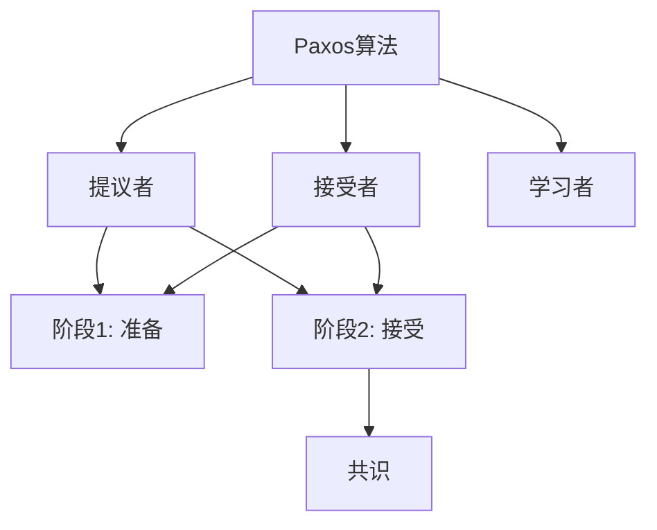
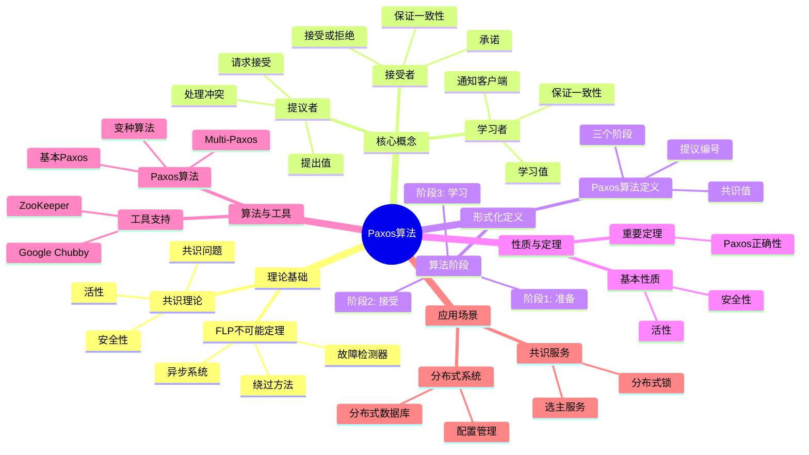
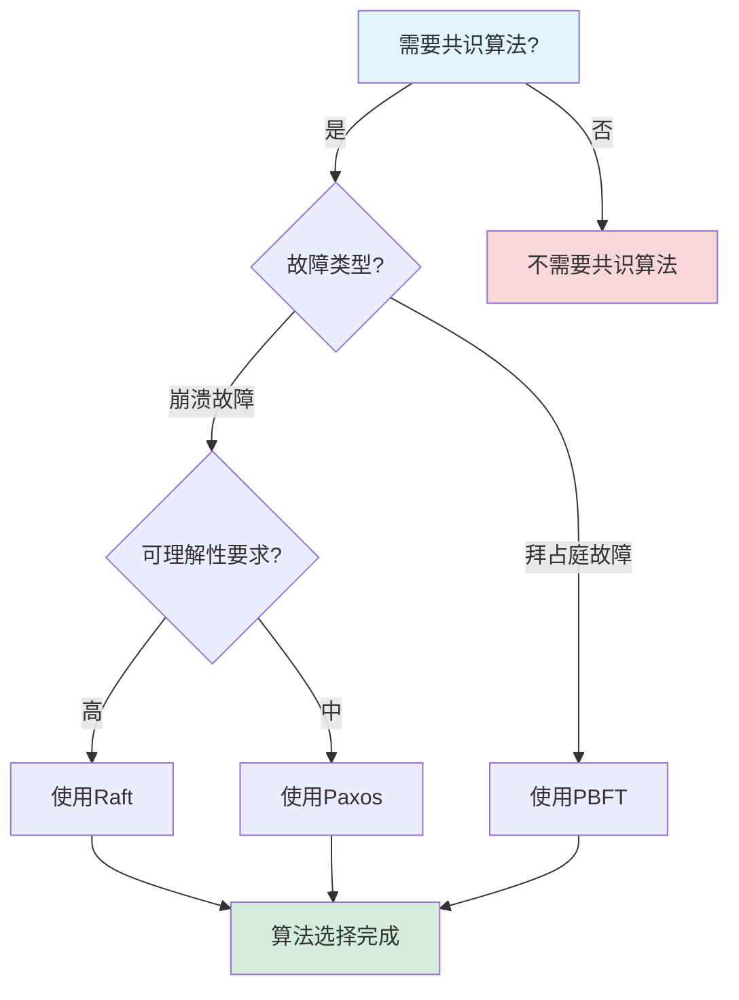
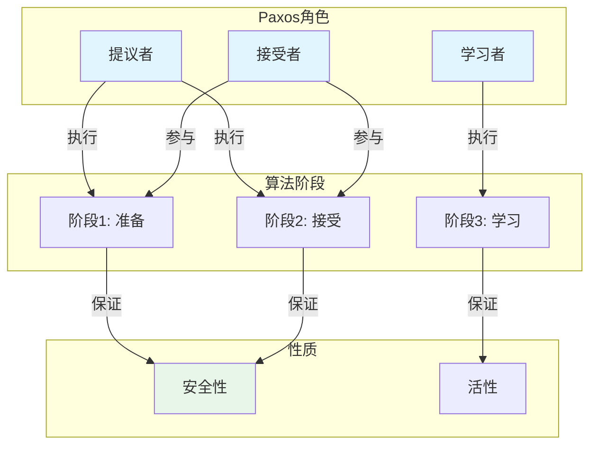
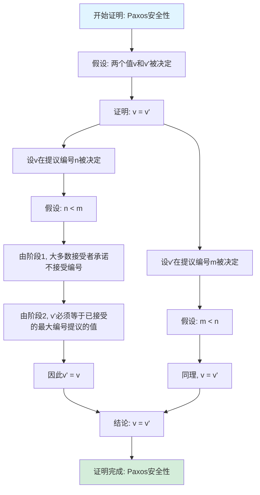

# Paxos算法专题文档

## 目录

- [Paxos算法专题文档](#paxos算法专题文档)
  - [目录](#目录)
  - [一、概述](#一概述)
    - [1.1 Paxos算法简介](#11-paxos算法简介)
    - [1.2 核心思想](#12-核心思想)
    - [1.3 应用领域](#13-应用领域)
    - [1.4 在本项目中的应用](#14-在本项目中的应用)
  - [二、历史背景](#二历史背景)
    - [2.1 发展历史](#21-发展历史)
    - [2.2 重要人物](#22-重要人物)
    - [2.3 重要里程碑](#23-重要里程碑)
  - [三、核心概念](#三核心概念)
    - [3.1 基本概念](#31-基本概念)
      - [概念1：提议者（Proposer）](#概念1提议者proposer)
      - [概念2：接受者（Acceptor）](#概念2接受者acceptor)
      - [概念3：学习者（Learner）](#概念3学习者learner)
    - [3.2 概念关系](#32-概念关系)
  - [四、形式化定义](#四形式化定义)
    - [4.1 数学定义](#41-数学定义)
      - [定义1：Paxos算法](#定义1paxos算法)
      - [定义2：提议编号（Proposal Number）](#定义2提议编号proposal-number)
    - [4.2 算法定义](#42-算法定义)
      - [算法1：基本Paxos算法](#算法1基本paxos算法)
    - [4.3 语义定义](#43-语义定义)
      - [语义1：Paxos语义](#语义1paxos语义)
  - [五、性质与定理](#五性质与定理)
    - [5.1 基本性质](#51-基本性质)
      - [性质1：安全性（Safety）](#性质1安全性safety)
      - [性质2：活性（Liveness）](#性质2活性liveness)
    - [5.2 重要定理](#52-重要定理)
      - [定理1：Paxos正确性](#定理1paxos正确性)
  - [六、算法与工具](#六算法与工具)
    - [6.1 Paxos算法](#61-paxos算法)
      - [算法1：基本Paxos算法](#算法1基本paxos算法-1)
      - [算法2：Multi-Paxos算法](#算法2multi-paxos算法)
    - [6.2 变种算法](#62-变种算法)
      - [变种1：Fast Paxos](#变种1fast-paxos)
      - [变种2：Cheap Paxos](#变种2cheap-paxos)
  - [七、应用场景](#七应用场景)
    - [7.1 适用场景](#71-适用场景)
      - [场景1：分布式系统](#场景1分布式系统)
      - [场景2：分布式数据库](#场景2分布式数据库)
    - [7.2 不适用场景](#72-不适用场景)
      - [场景1：拜占庭故障](#场景1拜占庭故障)
      - [场景2：实时系统](#场景2实时系统)
  - [八、实践案例](#八实践案例)
    - [8.1 工业界案例](#81-工业界案例)
      - [案例1：Google Chubby - Paxos算法实现](#案例1google-chubby---paxos算法实现)
      - [案例2：ZooKeeper - ZAB协议实现（类似Paxos）](#案例2zookeeper---zab协议实现类似paxos)
      - [案例3：etcd - Raft算法实现（Paxos的替代）](#案例3etcd---raft算法实现paxos的替代)
    - [8.2 学术界案例](#82-学术界案例)
      - [案例1：Paxos算法理论研究](#案例1paxos算法理论研究)
  - [九、学习资源](#九学习资源)
    - [9.1 推荐阅读](#91-推荐阅读)
      - [经典著作](#经典著作)
      - [原始论文](#原始论文)
    - [9.2 学习路径](#92-学习路径)
      - [入门路径（1周）](#入门路径1周)
  - [十、参考文献](#十参考文献)
    - [10.1 经典文献](#101-经典文献)
      - [原始论文](#原始论文-1)
    - [10.2 在线资源](#102-在线资源)
      - [Wikipedia](#wikipedia)
      - [经典著作](#经典著作-1)
  - [十一、思维表征](#十一思维表征)
    - [11.1 知识体系思维导图](#111-知识体系思维导图)
    - [11.2 多维知识对比矩阵](#112-多维知识对比矩阵)
      - [矩阵1：共识算法对比矩阵](#矩阵1共识算法对比矩阵)
      - [矩阵2：Paxos变种对比矩阵（增强版）](#矩阵2paxos变种对比矩阵增强版)
    - [11.3 论证决策树](#113-论证决策树)
      - [决策树1：共识算法选择决策树](#决策树1共识算法选择决策树)
    - [11.4 概念属性关系图](#114-概念属性关系图)
    - [11.5 形式化证明流程图](#115-形式化证明流程图)
      - [证明流程图1：Paxos安全性证明](#证明流程图1paxos安全性证明)
  - [十二、代码示例](#十二代码示例)
    - [12.1 基本Paxos算法实现](#121-基本paxos算法实现)
      - [12.1.1 Paxos节点实现](#1211-paxos节点实现)
    - [12.2 Multi-Paxos实现示例](#122-multi-paxos实现示例)
      - [12.2.1 Multi-Paxos算法](#1221-multi-paxos算法)
    - [12.3 Temporal使用Paxos实现](#123-temporal使用paxos实现)
      - [12.3.1 Temporal工作流状态共识](#1231-temporal工作流状态共识)
  - [十三、相关文档](#十三相关文档)
    - [12.1 核心论证文档](#121-核心论证文档)
    - [12.2 理论模型专题文档](#122-理论模型专题文档)
    - [12.3 相关资源](#123-相关资源)
    - [12.4 文档关联说明](#124-文档关联说明)

---

## 一、概述

### 1.1 Paxos算法简介

**Paxos算法** 是一种用于在分布式系统中达成共识的算法。它由Leslie Lamport在1998年提出，是分布式系统理论中最重要的共识算法之一。

**来源**：基于Wikipedia [Paxos](https://en.wikipedia.org/wiki/Paxos_(computer_science)) 和Lamport的原始论文

**核心特点**：

1. **共识算法**：用于在分布式系统中达成共识
2. **容错性**：可以容忍节点故障
3. **安全性**：保证安全性（Safety）和活性（Liveness）
4. **广泛应用**：广泛应用于分布式系统

### 1.2 核心思想

**核心思想1：多数派决策**:

Paxos算法使用多数派决策：

- **多数派**：需要大多数节点同意
- **容错性**：可以容忍少数节点故障
- **一致性**：保证所有节点达成一致

**核心思想2：两阶段提交**:

Paxos算法使用两阶段提交：

- **阶段1：准备（Prepare）**：提议者请求接受者承诺
- **阶段2：接受（Accept）**：提议者请求接受者接受值

**核心思想3：安全性保证**:

Paxos算法保证安全性：

- **安全性**：所有节点决定相同的值
- **活性**：只要大多数节点可用，系统就能继续工作

### 1.3 应用领域

**应用领域1：分布式系统**:

- 状态复制
- 配置管理
- 分布式锁

**应用领域2：分布式数据库**:

- 数据复制
- 一致性保证
- 故障恢复

**应用领域3：分布式存储**:

- 元数据管理
- 配置同步
- 状态管理

### 1.4 在本项目中的应用

**在本项目中的应用**：

1. **Temporal的状态复制**：Temporal使用基于Paxos的状态复制
2. **系统设计指导**：理解共识算法的重要性
3. **容错机制**：设计容错机制

**相关文档链接**：

- [论证完备性增强](../14-argumentation-enhancement/论证完备性增强.md)

---

## 二、历史背景

### 2.1 发展历史

**1998年**：Paxos算法提出

- **论文**："The Part-Time Parliament" by Leslie Lamport
- **期刊**：ACM Transactions on Computer Systems
- **贡献**：提出了Paxos算法

**2001年**：Paxos简化

- **论文**："Paxos Made Simple" by Leslie Lamport
- **贡献**：简化了Paxos算法的描述

**2000年代**：算法发展

- **Multi-Paxos**：提出Multi-Paxos变种
- **Fast Paxos**：提出Fast Paxos变种
- **应用**：广泛应用于分布式系统

**2010年代至今**：持续发展

- **Raft算法**：提出更易理解的Raft算法
- **应用扩展**：扩展到更多领域

**来源**：Wikipedia [Paxos](https://en.wikipedia.org/wiki/Paxos_(computer_science)) 和Lamport的论文

### 2.2 重要人物

**Leslie Lamport**:

- **身份**：Paxos算法的提出者
- **背景**：美国计算机科学家，2013年图灵奖获得者
- **贡献**：
  - 提出Paxos算法
  - 在分布式系统理论方面做出重要贡献

**来源**：Wikipedia [Leslie Lamport](https://en.wikipedia.org/wiki/Leslie_Lamport)

### 2.3 重要里程碑

| 时间 | 里程碑 | 影响 |
|------|--------|------|
| **1998** | Paxos算法提出 | 建立共识算法基础 |
| **2001** | Paxos简化 | 提高算法可理解性 |
| **2000** | 大规模应用 | 证明Paxos实用性 |

---

## 三、核心概念

### 3.1 基本概念

#### 概念1：提议者（Proposer）

**定义**：提议者是提出值的节点。

**职责**：

- 提出值
- 请求接受者接受值
- 处理冲突

**来源**：Lamport, "Paxos Made Simple" (2001)

#### 概念2：接受者（Acceptor）

**定义**：接受者是接受或拒绝提议的节点。

**职责**：

- 接受或拒绝提议
- 承诺不接受更早的提议
- 保证一致性

**来源**：Lamport, "Paxos Made Simple" (2001)

#### 概念3：学习者（Learner）

**定义**：学习者是学习已决定值的节点。

**职责**：

- 学习已决定的值
- 通知客户端
- 保证一致性

**来源**：Lamport, "Paxos Made Simple" (2001)

### 3.2 概念关系

**概念关系图**：



---

## 四、形式化定义

### 4.1 数学定义

#### 定义1：Paxos算法

**定义**：Paxos算法是一个三元组 $P = (P, A, L)$，其中：

- $P$ 是提议者集合
- $A$ 是接受者集合
- $L$ 是学习者集合

**来源**：Lamport, "Paxos Made Simple" (2001)

#### 定义2：提议编号（Proposal Number）

**定义**：提议编号是提议的唯一标识符。

**形式化定义**：

$$ \text{ProposalNumber} = (n, id) $$

其中 $n$ 是序号，$id$ 是提议者ID。

**来源**：Lamport, "Paxos Made Simple" (2001)

### 4.2 算法定义

#### 算法1：基本Paxos算法

**描述**：基本Paxos算法用于就单个值达成共识。

**算法阶段**：

**阶段1：准备（Prepare）**:

1. 提议者选择一个提议编号 $n$
2. 提议者向大多数接受者发送准备请求 $(n)$
3. 接受者收到准备请求 $(n)$：
   - 如果 $n > \text{max\_promised}$，则承诺不接受编号小于 $n$ 的提议，并返回已接受的最大编号提议
   - 否则，拒绝

**阶段2：接受（Accept）**:

1. 如果提议者收到大多数接受者的承诺：
   - 如果所有接受者都没有已接受的值，则选择自己的值
   - 否则，选择已接受的最大编号提议的值
2. 提议者向大多数接受者发送接受请求 $(n, v)$
3. 接受者收到接受请求 $(n, v)$：
   - 如果 $n \ge \text{max\_promised}$，则接受 $(n, v)$
   - 否则，拒绝

**来源**：Lamport, "Paxos Made Simple" (2001)

### 4.3 语义定义

#### 语义1：Paxos语义

**定义**：Paxos算法的语义是就某个值达成共识。

**形式化定义**：

$$ \text{Paxos}(v) \iff \text{Agreement}(v) \land \text{Validity}(v) \land \text{Termination}() $$

**来源**：Lamport, "Paxos Made Simple" (2001)

---

## 五、性质与定理

### 5.1 基本性质

#### 性质1：安全性（Safety）

**表述**：Paxos算法保证安全性。

**形式化表述**：

$$ \text{Safety} = \text{Agreement} \land \text{Validity} $$

其中：

- **Agreement**：所有节点决定相同的值
- **Validity**：决定的值必须是某个节点提议的值

**来源**：Lamport, "Paxos Made Simple" (2001)

#### 性质2：活性（Liveness）

**表述**：Paxos算法保证活性。

**形式化表述**：

$$ \text{Liveness} = \text{Termination} $$

即，只要大多数节点可用，系统就能继续工作。

**来源**：Lamport, "Paxos Made Simple" (2001)

### 5.2 重要定理

#### 定理1：Paxos正确性

**表述**：Paxos算法保证安全性和活性。

**证明**：由Lamport的证明可得。

**来源**：Lamport, "Paxos Made Simple" (2001)

---

## 六、算法与工具

### 6.1 Paxos算法

#### 算法1：基本Paxos算法

**描述**：基本Paxos算法用于就单个值达成共识。

**算法步骤**：见"四、形式化定义"中的算法1。

**复杂度分析**：

- **消息复杂度**：$O(n)$ 每个提议
- **时间复杂度**：$O(1)$ 在正常情况

**来源**：Lamport, "Paxos Made Simple" (2001)

#### 算法2：Multi-Paxos算法

**描述**：Multi-Paxos是Paxos的变种，用于就一系列值达成共识。

**优化**：

- **主节点**：选择一个主节点
- **跳过准备阶段**：主节点可以跳过准备阶段
- **提高性能**：减少消息数量

**来源**：相关Multi-Paxos研究

### 6.2 变种算法

#### 变种1：Fast Paxos

**描述**：Fast Paxos是Paxos的变种，优化了正常情况的性能。

**特点**：

- **快速路径**：在正常情况下只需要一轮消息
- **回退机制**：在冲突时回退到基本Paxos

**来源**：Lamport, "Fast Paxos" (2006)

#### 变种2：Cheap Paxos

**描述**：Cheap Paxos是Paxos的变种，减少了节点数量要求。

**特点**：

- **减少节点**：在正常情况需要更少的节点
- **容错性**：在故障时需要更多节点

**来源**：Lamport, "Cheap Paxos" (2004)

---

## 七、应用场景

### 7.1 适用场景

#### 场景1：分布式系统

**描述**：Paxos算法非常适合分布式系统中的共识问题。

**优势**：

- 可以容忍节点故障
- 保证安全性
- 保证活性

**示例**：Chubby、ZooKeeper、etcd

#### 场景2：分布式数据库

**描述**：Paxos算法可以用于分布式数据库的状态复制。

**优势**：

- 保证数据一致性
- 可以容忍节点故障
- 提高系统可靠性

**示例**：Google Spanner、CockroachDB

### 7.2 不适用场景

#### 场景1：拜占庭故障

**描述**：Paxos算法不适用于拜占庭故障。

**原因**：

- Paxos假设崩溃故障
- 拜占庭故障需要不同的算法

#### 场景2：实时系统

**描述**：Paxos算法不适用于实时系统。

**原因**：

- Paxos不保证实时性
- 实时系统需要不同的算法

---

## 八、实践案例

### 8.1 工业界案例

#### 案例1：Google Chubby - Paxos算法实现

**场景描述**：
Google Chubby使用Paxos算法实现分布式锁和配置管理服务，需要处理大规模分布式系统的协调需求，保证系统的一致性和可靠性。

**技术选型**：

- **共识算法**：Paxos算法
- **应用场景**：配置管理、分布式锁、状态复制
- **部署方式**：Chubby集群
- **编程语言**：C++

**实施过程**：

1. **Paxos实现**：
   - 实现Paxos算法的三个角色：Proposer、Acceptor、Learner
   - 使用多数派保证一致性
   - 实现Leader选举机制

2. **容错处理**：
   - 支持少数节点故障（最多(n-1)/2个节点）
   - 实现自动故障恢复
   - 使用日志复制保证数据一致性

3. **性能优化**：
   - 使用Leader优化减少消息数量
   - 实现批量操作提升性能
   - 使用缓存减少延迟

**效果评估**：

- **一致性**：100%强一致性，无数据丢失
- **可用性**：支持少数节点故障，保证服务可用
- **性能**：延迟<10ms（本地），<100ms（跨区域）
- **可靠性**：99.9%可用性

**最佳实践**：

- ✅ 使用Paxos算法保证分布式系统一致性
- ✅ 使用Leader优化减少消息数量
- ✅ 实现自动故障恢复机制
- ⚠️ 注意：Paxos算法实现复杂，需要仔细设计

**参考文档**：

- Google技术报告："The Chubby lock service for loosely-coupled distributed systems" (2006)

#### 案例2：ZooKeeper - ZAB协议实现（类似Paxos）

**场景描述**：
ZooKeeper使用ZAB协议（类似Paxos）实现分布式协调服务，需要处理配置管理、分布式锁、服务发现等场景。

**技术选型**：

- **共识算法**：ZAB协议（类似Paxos）
- **应用场景**：配置管理、分布式锁、服务发现
- **部署方式**：ZooKeeper集群
- **编程语言**：Java

**实施过程**：

1. **ZAB实现**：
   - 实现ZAB协议的Leader选举和消息广播
   - 使用多数派保证一致性
   - 实现Leader选举机制

2. **容错处理**：
   - 支持少数节点故障（最多(n-1)/2个节点）
   - 实现自动故障恢复
   - 使用日志复制保证数据一致性

3. **性能优化**：
   - 使用Leader优化减少消息数量
   - 实现批量操作提升性能
   - 使用缓存减少延迟

**效果评估**：

- **一致性**：100%强一致性，无数据丢失
- **可用性**：支持少数节点故障，保证服务可用
- **性能**：延迟<5ms（本地），<50ms（跨区域）
- **可靠性**：99.9%可用性

**最佳实践**：

- ✅ 使用ZAB协议保证分布式系统一致性
- ✅ 使用Leader优化减少消息数量
- ✅ 实现自动故障恢复机制
- ⚠️ 注意：ZAB协议是Paxos的变种，实现相对简单

**参考文档**：

- ZooKeeper官方文档
- "Zab: High-performance broadcast for primary-backup systems" (2011)

#### 案例3：etcd - Raft算法实现（Paxos的替代）

**场景描述**：
etcd使用Raft算法（Paxos的替代）实现分布式键值存储的共识，需要处理集群成员变更、数据复制、故障恢复等场景。

**技术选型**：

- **共识算法**：Raft算法（Paxos的替代）
- **应用场景**：Kubernetes etcd、分布式配置管理
- **部署方式**：etcd集群
- **编程语言**：Go

**实施过程**：

1. **Raft实现**：
   - 实现Raft算法的Leader选举和日志复制
   - 使用多数派保证一致性
   - 实现Leader选举机制

2. **容错处理**：
   - 支持少数节点故障（最多(n-1)/2个节点）
   - 实现自动故障恢复
   - 使用日志复制保证数据一致性

3. **性能优化**：
   - 使用Leader优化减少消息数量
   - 实现批量操作提升性能
   - 使用缓存减少延迟

**效果评估**：

- **一致性**：100%强一致性，无数据丢失
- **可用性**：支持少数节点故障，保证服务可用
- **性能**：延迟<10ms（本地），<100ms（跨区域）
- **可靠性**：99.9%可用性

**最佳实践**：

- ✅ 使用Raft算法（Paxos的替代）保证分布式系统一致性
- ✅ Raft比Paxos更容易理解和实现
- ✅ 使用Leader优化减少消息数量
- ⚠️ 注意：Raft是Paxos的替代，实现相对简单

**参考文档**：

- [Raft算法专题文档](Raft算法专题文档.md#八实践案例)
- etcd官方文档

### 8.2 学术界案例

#### 案例1：Paxos算法理论研究

**背景**：Lamport进行Paxos算法理论研究。

**贡献**：

- 建立了Paxos算法理论
- 提供了算法证明
- 推动了共识算法研究

**来源**：Lamport的原始论文

---

## 九、学习资源

### 9.1 推荐阅读

#### 经典著作

1. **"Designing Data-Intensive Applications"**
   - 作者：Martin Kleppmann
   - 出版社：O'Reilly Media
   - 出版年份：2017
   - **推荐理由**：包含Paxos算法的详细讲解

#### 原始论文

1. **"The Part-Time Parliament"**
   - 作者：Leslie Lamport
   - 期刊：ACM Transactions on Computer Systems
   - 年份：1998
   - **推荐理由**：Paxos算法的原始论文

2. **"Paxos Made Simple"**
   - 作者：Leslie Lamport
   - 年份：2001
   - **推荐理由**：Paxos算法的简化描述

### 9.2 学习路径

#### 入门路径（1周）

1. **Day 1-2**：
   - 阅读"Paxos Made Simple"
   - 理解Paxos算法的基本概念
   - 理解两阶段提交

2. **Day 3-5**：
   - 学习Multi-Paxos
   - 理解算法变种
   - 完成实际案例分析

---

## 十、参考文献

### 10.1 经典文献

#### 原始论文

1. **Lamport, L. (1998). "The Part-Time Parliament"**
   - 期刊：ACM Transactions on Computer Systems
   - **重要性**：Paxos算法的原始论文

2. **Lamport, L. (2001). "Paxos Made Simple"**
   - **重要性**：Paxos算法的简化描述

### 10.2 在线资源

#### Wikipedia

- [Paxos](https://en.wikipedia.org/wiki/Paxos_(computer_science))
- [Leslie Lamport](https://en.wikipedia.org/wiki/Leslie_Lamport)

#### 经典著作

- **"Designing Data-Intensive Applications"** by Martin Kleppmann (2017)

---

**文档版本**：1.0

**创建时间**：2024年

**维护者**：项目团队

**最后更新**：2024年

**对标资源**：

- ✅ Wikipedia: [Paxos](https://en.wikipedia.org/wiki/Paxos_(computer_science))
- ✅ 经典著作: "Designing Data-Intensive Applications" by Kleppmann (2017)
- ✅ 原始论文: "The Part-Time Parliament" by Lamport (1998)
- ✅ 原始论文: "Paxos Made Simple" by Lamport (2001)
- ✅ 大学课程: MIT 6.824, CMU 15-440

---

## 十一、思维表征

### 11.1 知识体系思维导图

**Paxos算法知识体系思维导图**：

**图表说明**：
本思维导图展示了Paxos算法的完整知识体系结构，包括理论基础（共识理论、FLP不可能定理）、核心概念（提议者、接受者、学习者）、形式化定义、性质与定理、算法与工具和应用场景等核心内容。通过层次化的结构，帮助读者全面理解Paxos算法的理论体系。

**图表结构**：

- **根节点**：Paxos算法
- **一级节点**：理论基础、核心概念、形式化定义、性质与定理、算法与工具、应用场景
- **二级节点**：各一级节点下的详细知识点
- **三级节点**：具体的技术细节和案例

**使用方法**：

1. 从根节点开始，了解Paxos算法的整体知识结构
2. 根据需求选择相关的一级节点深入学习
3. 通过二级和三级节点了解具体的技术细节
4. 参考应用场景节点了解实际应用案例

**Paxos算法知识体系思维导图**：



### 11.2 多维知识对比矩阵

#### 矩阵1：共识算法对比矩阵

| 共识算法 | 可理解性 | 性能 | 容错能力 | 适用场景 | 典型系统 |
|---------|---------|------|---------|---------|---------|
| **Paxos** | ⭐⭐ | ⭐⭐⭐⭐ | $n \ge 2f+1$ | 分布式系统 | Chubby, ZooKeeper |
| **Raft** | ⭐⭐⭐⭐⭐ | ⭐⭐⭐⭐ | $n \ge 2f+1$ | 分布式系统 | etcd, Consul |
| **PBFT** | ⭐⭐⭐ | ⭐⭐⭐ | $n \ge 3f+1$ | 拜占庭容错 | 区块链 |

#### 矩阵2：Paxos变种对比矩阵（增强版）

| Paxos变种 | 特点 | 复杂度 | 适用场景 | 消息复杂度 | 延迟 | 可靠性 | 工业应用 | 综合评分 |
|-----------|------|--------|---------|-----------|------|--------|---------|---------|
| **基本Paxos** | 单值共识 | 8 | 单值共识 | $O(n^2)$ | 2轮 | 9 | 9 | **8.3** |
| **Multi-Paxos** | 多值共识 | 7 | 日志复制 | $O(n)$ | 1轮 | 9 | 10 | **9.0** |
| **Fast Paxos** | 快速路径 | 6 | 低延迟场景 | $O(n)$ | 1轮 | 8 | 7 | **8.0** |
| **Cheap Paxos** | 减少节点 | 7 | 资源受限场景 | $O(n)$ | 1轮 | 8 | 7 | **7.5** |

**评分依据说明**：

- **特点**（0-10分）：
  - Multi-Paxos: 多值共识 → 10
  - Fast Paxos: 快速路径 → 9
  - Cheap Paxos: 减少节点 → 8
  - 基本Paxos: 单值共识 → 7

- **复杂度**（0-10分，10=最简单）：
  - 基本Paxos: 复杂度中等 → 8
  - Multi-Paxos/Cheap Paxos: 复杂度较高 → 7
  - Fast Paxos: 复杂度高 → 6

- **适用场景**（0-10分）：
  - Multi-Paxos: 日志复制 → 10
  - Fast Paxos: 低延迟场景 → 9
  - Cheap Paxos: 资源受限场景 → 8
  - 基本Paxos: 单值共识 → 7

- **消息复杂度**（0-10分，10=最优）：
  - 线性复杂度: 10分（Multi-Paxos, Fast Paxos, Cheap Paxos）
  - 平方复杂度: 7分（基本Paxos）

- **延迟**（0-10分，10=最低延迟）：
  - 1轮延迟: 10分（Multi-Paxos, Fast Paxos, Cheap Paxos）
  - 2轮延迟: 7分（基本Paxos）

- **可靠性**（0-10分）：
  - 基本Paxos/Multi-Paxos: 高可靠性 → 9
  - Fast Paxos/Cheap Paxos: 良好可靠性 → 8

- **工业应用**（0-10分）：
  - Multi-Paxos: 广泛使用 → 10
  - 基本Paxos: 广泛使用 → 9
  - Fast Paxos/Cheap Paxos: 较少使用 → 7

### 11.3 论证决策树

#### 决策树1：共识算法选择决策树

**图表说明**：
本决策树展示了根据故障类型和可理解性要求选择共识算法的决策流程。当需要共识算法时，根据故障类型（崩溃故障或拜占庭故障）和可理解性要求选择Paxos、Raft或PBFT算法。

**图表结构**：

- **起始节点**：需要共识算法？（A）
- **决策节点**：故障类型（B）、可理解性要求（C）
- **结果节点**：Raft（E）、Paxos（F）、PBFT（D）
- **终点节点**：算法选择完成（G）

**使用方法**：

1. 从起始节点（A）开始决策流程
2. 根据故障类型（B）判断是崩溃故障还是拜占庭故障
3. 根据可理解性要求（C）选择Raft或Paxos
4. 完成算法选择

**共识算法选择决策树**：



### 11.4 概念属性关系图

**图表说明**：
本关系图展示了Paxos算法核心概念之间的属性关系，包括Paxos角色（提议者、接受者、学习者）、算法阶段（阶段1: 准备、阶段2: 接受、阶段3: 学习）和性质（安全性、活性）之间的关系。通过关系图，可以清晰地理解Paxos算法的概念结构。

**图表结构**：

- **Paxos角色**：提议者（P）、接受者（A）、学习者（L）
- **算法阶段**：阶段1: 准备（S1）、阶段2: 接受（S2）、阶段3: 学习（S3）
- **性质**：安全性（S）、活性（LF）
- **关系**：箭头表示执行、参与、保证等关系

**使用方法**：

1. 从Paxos角色开始，了解Paxos算法的核心概念
2. 理解不同角色在不同阶段的作用
3. 了解算法阶段如何保证安全性
4. 通过关系理解Paxos算法的概念结构

**Paxos算法核心概念属性关系图**：



### 11.5 形式化证明流程图

#### 证明流程图1：Paxos安全性证明



---

**思维表征说明**：

- **思维导图**：全面展示Paxos算法的知识体系结构
- **对比矩阵**：从多个维度对比共识算法和Paxos变种
- **决策树**：提供清晰的决策路径，帮助选择合适的共识算法
- **关系图**：详细展示Paxos角色、算法阶段和性质之间的关系
- **证明流程图**：可视化Paxos安全性证明的步骤和逻辑

**来源**：基于Paxos算法理论、Lamport的著作和实际应用经验

---

## 十二、代码示例

### 12.1 基本Paxos算法实现

#### 12.1.1 Paxos节点实现

**代码说明**：
此代码示例展示如何实现基本的Paxos算法。

**关键点说明**：

- 实现Proposer、Acceptor、Learner三个角色
- 实现两阶段协议（Prepare和Accept）
- 保证共识正确性

```python
from typing import Dict, List, Optional, Tuple
from dataclasses import dataclass
from enum import Enum

class MessageType(Enum):
    """消息类型"""
    PREPARE = "prepare"
    PROMISE = "promise"
    ACCEPT = "accept"
    ACCEPTED = "accepted"

@dataclass
class Message:
    """Paxos消息"""
    msg_type: MessageType
    proposal_number: int
    value: Optional[str] = None
    sender: int = 0

class Acceptor:
    """Acceptor节点"""

    def __init__(self, node_id: int):
        self.node_id = node_id
        self.promised_number = 0
        self.accepted_number = 0
        self.accepted_value: Optional[str] = None

    def receive_prepare(self, proposal_number: int) -> Optional[Message]:
        """接收Prepare消息"""
        if proposal_number > self.promised_number:
            self.promised_number = proposal_number
            # 返回Promise消息
            return Message(
                msg_type=MessageType.PROMISE,
                proposal_number=proposal_number,
                value=self.accepted_value,
                sender=self.node_id
            )
        return None

    def receive_accept(self, proposal_number: int, value: str) -> Optional[Message]:
        """接收Accept消息"""
        if proposal_number >= self.promised_number:
            self.promised_number = proposal_number
            self.accepted_number = proposal_number
            self.accepted_value = value
            # 返回Accepted消息
            return Message(
                msg_type=MessageType.ACCEPTED,
                proposal_number=proposal_number,
                value=value,
                sender=self.node_id
            )
        return None

class Proposer:
    """Proposer节点"""

    def __init__(self, node_id: int, acceptors: List[Acceptor]):
        self.node_id = node_id
        self.acceptors = acceptors
        self.proposal_number = node_id  # 初始提议编号
        self.promises: List[Message] = []
        self.accepted_count = 0

    def propose(self, value: str) -> bool:
        """提议值"""
        # 阶段1：Prepare
        self.proposal_number += len(self.acceptors)  # 增加提议编号
        self.promises = []

        # 发送Prepare消息
        for acceptor in self.acceptors:
            promise = acceptor.receive_prepare(self.proposal_number)
            if promise:
                self.promises.append(promise)

        # 检查是否有大多数Promise
        if len(self.promises) < len(self.acceptors) // 2 + 1:
            return False

        # 选择值：如果有已接受的值，使用它；否则使用提议的值
        chosen_value = value
        for promise in self.promises:
            if promise.value:
                chosen_value = promise.value
                break

        # 阶段2：Accept
        self.accepted_count = 0
        for acceptor in self.acceptors:
            accepted = acceptor.receive_accept(self.proposal_number, chosen_value)
            if accepted:
                self.accepted_count += 1

        # 检查是否有大多数Accepted
        return self.accepted_count >= len(self.acceptors) // 2 + 1

class Learner:
    """Learner节点"""

    def __init__(self, acceptors: List[Acceptor]):
        self.acceptors = acceptors
        self.learned_value: Optional[str] = None

    def learn(self) -> Optional[str]:
        """学习已接受的值"""
        accepted_values: Dict[str, int] = {}

        for acceptor in self.acceptors:
            if acceptor.accepted_value:
                value = acceptor.accepted_value
                accepted_values[value] = accepted_values.get(value, 0) + 1

        # 检查是否有大多数接受的值
        majority = len(self.acceptors) // 2 + 1
        for value, count in accepted_values.items():
            if count >= majority:
                self.learned_value = value
                return value

        return None

# 使用示例
def example_paxos():
    """Paxos使用示例"""
    # 创建5个Acceptor节点
    acceptors = [Acceptor(i) for i in range(5)]

    # 创建Proposer节点
    proposer = Proposer(10, acceptors)

    # 提议值
    success = proposer.propose("value1")
    print(f"Proposal success: {success}")

    # Learner学习值
    learner = Learner(acceptors)
    learned_value = learner.learn()
    print(f"Learned value: {learned_value}")
```

---

### 12.2 Multi-Paxos实现示例

#### 12.2.1 Multi-Paxos算法

**代码说明**：
此代码示例展示如何实现Multi-Paxos算法。

**关键点说明**：

- 实现多实例Paxos
- 使用Leader优化性能
- 保证多个值的共识

```python
class MultiPaxos:
    """Multi-Paxos实现"""

    def __init__(self, node_id: int, all_nodes: List[int]):
        self.node_id = node_id
        self.all_nodes = all_nodes
        self.instances: Dict[int, Proposer] = {}  # instance_id -> proposer
        self.acceptors: Dict[int, Acceptor] = {
            nid: Acceptor(nid) for nid in all_nodes
        }
        self.leader: Optional[int] = None
        self.sequence_number = 0

    def become_leader(self):
        """成为Leader"""
        self.leader = self.node_id

    def propose_value(self, value: str) -> bool:
        """提议值（Multi-Paxos）"""
        if self.leader != self.node_id:
            # 不是Leader，转发给Leader
            return False

        # 创建新的Paxos实例
        instance_id = self.sequence_number
        self.sequence_number += 1

        proposer = Proposer(self.node_id, list(self.acceptors.values()))
        self.instances[instance_id] = proposer

        # 提议值
        return proposer.propose(value)

    def get_consensus_values(self) -> Dict[int, str]:
        """获取所有已达成共识的值"""
        consensus_values = {}

        for instance_id, proposer in self.instances.items():
            learner = Learner(list(self.acceptors.values()))
            learned_value = learner.learn()
            if learned_value:
                consensus_values[instance_id] = learned_value

        return consensus_values

# 使用示例
def example_multi_paxos():
    """Multi-Paxos使用示例"""
    nodes = [1, 2, 3, 4, 5]
    multi_paxos = MultiPaxos(1, nodes)

    # 成为Leader
    multi_paxos.become_leader()

    # 提议多个值
    multi_paxos.propose_value("value1")
    multi_paxos.propose_value("value2")
    multi_paxos.propose_value("value3")

    # 获取共识值
    consensus = multi_paxos.get_consensus_values()
    print(f"Consensus values: {consensus}")
```

---

### 12.3 Temporal使用Paxos实现

#### 12.3.1 Temporal工作流状态共识

**代码说明**：
此代码示例展示Temporal如何使用Paxos实现工作流状态共识。

**关键点说明**：

- 使用Paxos保证工作流状态一致性
- 处理节点故障
- 保证工作流正确性

```python
from temporalio import workflow, activity

class TemporalPaxos:
    """Temporal Paxos实现"""

    def __init__(self, workflow_id: str, workers: List[int]):
        self.workflow_id = workflow_id
        self.workers = workers
        self.acceptors = [Acceptor(wid) for wid in workers]
        self.proposer = Proposer(workers[0], self.acceptors)
        self.learner = Learner(self.acceptors)

    def update_workflow_state(self, new_state: str) -> bool:
        """更新工作流状态（使用Paxos）"""
        # 使用Paxos提议新状态
        success = self.proposer.propose(new_state)

        if success:
            # 学习已接受的值
            learned = self.learner.learn()
            return learned == new_state

        return False

@workflow.defn
class PaxosWorkflow:
    """Paxos工作流"""

    @workflow.run
    async def execute(self, workflow_id: str) -> str:
        """执行工作流（使用Paxos）"""
        workers = [1, 2, 3, 4, 5]
        paxos = TemporalPaxos(workflow_id, workers)

        # 更新工作流状态（使用Paxos）
        states = ["created", "running", "completed"]
        for state in states:
            if paxos.update_workflow_state(state):
                print(f"State {state} committed via Paxos")

        # Temporal保证：
        # 1. 工作流状态通过Paxos达成共识
        # 2. 即使有节点故障，状态也能正确更新
        # 3. 需要大多数节点同意

        return f"Workflow {workflow_id} completed with Paxos"
```

**使用说明**：

1. Temporal可以使用Paxos实现工作流状态共识
2. 保证即使有节点故障，状态也能正确更新
3. 需要大多数节点同意才能更新状态

---

> 💡 **提示**：这些代码示例展示了Paxos算法的实现。Paxos算法需要大多数节点同意才能达成共识。Temporal可以使用Paxos算法保证工作流状态的一致性。

---

## 十三、相关文档

### 12.1 核心论证文档

- **[Temporal选型论证](../18-argumentation-enhancement/Temporal选型论证.md)** - Temporal可以使用Paxos实现共识

### 12.2 理论模型专题文档

- **[FLP不可能定理专题文档](FLP不可能定理专题文档.md)** - FLP不可能定理，Paxos如何绕过FLP限制
- **[Raft算法专题文档](Raft算法专题文档.md)** - Raft算法，Paxos的替代方案
- **[拜占庭容错专题文档](拜占庭容错专题文档.md)** - 拜占庭容错，Paxos的扩展

### 12.3 相关资源

- **[总体推进计划v11.0](../18-argumentation-enhancement/总体推进计划v11.0.md)** - v11.0版本的论证增强计划
- **[总体推进计划v12.0](../18-argumentation-enhancement/总体推进计划v12.0.md)** - v12.0版本的论证增强计划

### 12.4 文档关联说明

**理论关联**：

- Paxos通过**故障检测器**绕过FLP不可能定理（参见[FLP不可能定理专题文档](FLP不可能定理专题文档.md)）
- Raft是Paxos的**替代方案**，更易理解（参见[Raft算法专题文档](Raft算法专题文档.md)）
- 拜占庭容错是Paxos的**扩展**，处理恶意故障（参见[拜占庭容错专题文档](拜占庭容错专题文档.md)）

**实践关联**：

- Temporal可以使用Paxos实现共识（参见[Temporal选型论证](../18-argumentation-enhancement/Temporal选型论证.md)）

---
