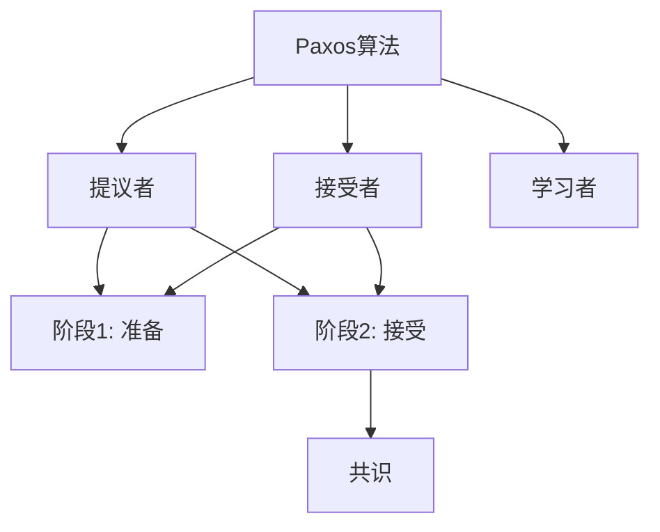
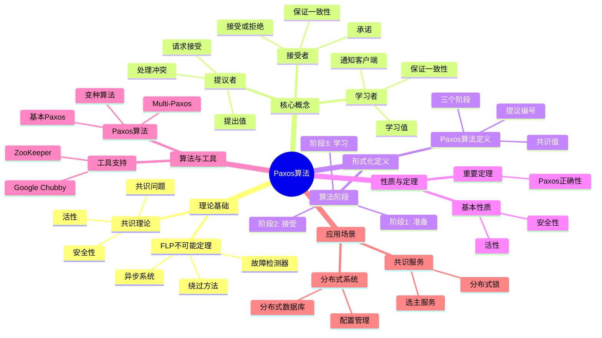
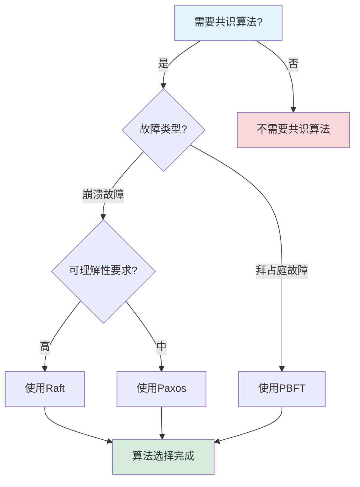
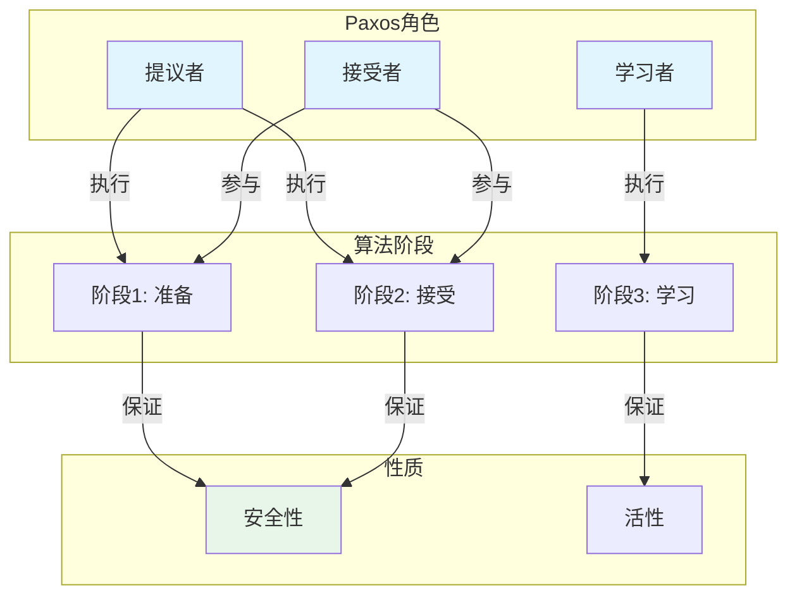
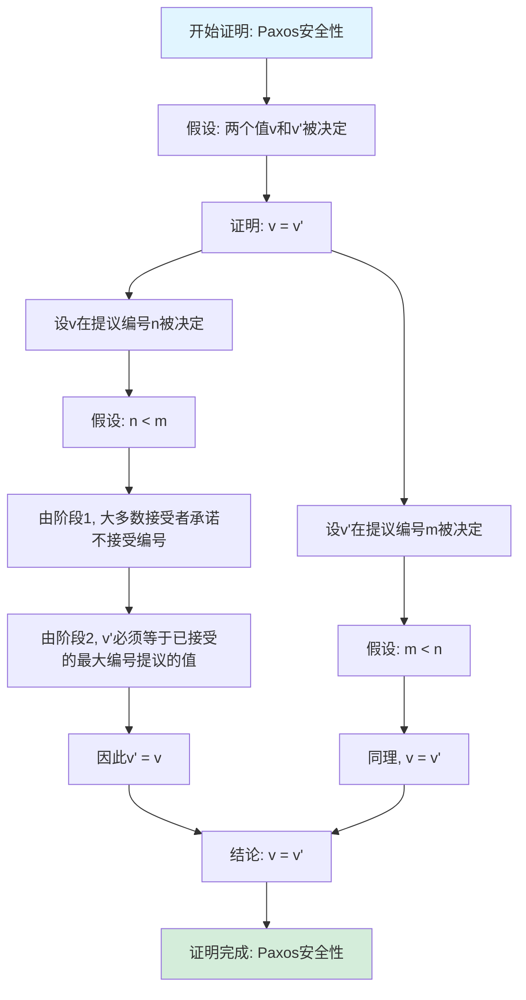

# Paxos算法专题文档

## 目录

- [Paxos算法专题文档](#paxos算法专题文档)
  - [目录](#目录)
  - [一、概述](#一概述)
    - [1.1 Paxos算法简介](#11-paxos算法简介)
    - [1.2 核心思想](#12-核心思想)
    - [1.3 应用领域](#13-应用领域)
    - [1.4 在本项目中的应用](#14-在本项目中的应用)
  - [二、历史背景](#二历史背景)
    - [2.1 发展历史](#21-发展历史)
    - [2.2 重要人物](#22-重要人物)
    - [2.3 重要里程碑](#23-重要里程碑)
  - [三、核心概念](#三核心概念)
    - [3.1 基本概念](#31-基本概念)
      - [概念1：提议者（Proposer）](#概念1提议者proposer)
      - [概念2：接受者（Acceptor）](#概念2接受者acceptor)
      - [概念3：学习者（Learner）](#概念3学习者learner)
    - [3.2 概念关系](#32-概念关系)
  - [四、形式化定义](#四形式化定义)
    - [4.1 数学定义](#41-数学定义)
      - [定义1：Paxos算法](#定义1paxos算法)
      - [定义2：提议编号（Proposal Number）](#定义2提议编号proposal-number)
    - [4.2 算法定义](#42-算法定义)
      - [算法1：基本Paxos算法](#算法1基本paxos算法)
    - [4.3 语义定义](#43-语义定义)
      - [语义1：Paxos语义](#语义1paxos语义)
  - [五、性质与定理](#五性质与定理)
    - [5.1 基本性质](#51-基本性质)
      - [性质1：安全性（Safety）](#性质1安全性safety)
      - [性质2：活性（Liveness）](#性质2活性liveness)
    - [5.2 重要定理](#52-重要定理)
      - [定理1：Paxos正确性](#定理1paxos正确性)
  - [六、算法与工具](#六算法与工具)
    - [6.1 Paxos算法](#61-paxos算法)
      - [算法1：基本Paxos算法](#算法1基本paxos算法-1)
      - [算法2：Multi-Paxos算法](#算法2multi-paxos算法)
    - [6.2 变种算法](#62-变种算法)
      - [变种1：Fast Paxos](#变种1fast-paxos)
      - [变种2：Cheap Paxos](#变种2cheap-paxos)
  - [七、应用场景](#七应用场景)
    - [7.1 适用场景](#71-适用场景)
      - [场景1：分布式系统](#场景1分布式系统)
      - [场景2：分布式数据库](#场景2分布式数据库)
    - [7.2 不适用场景](#72-不适用场景)
      - [场景1：拜占庭故障](#场景1拜占庭故障)
      - [场景2：实时系统](#场景2实时系统)
  - [八、实践案例](#八实践案例)
    - [8.1 工业界案例](#81-工业界案例)
      - [案例1：Google Chubby](#案例1google-chubby)
      - [案例2：ZooKeeper](#案例2zookeeper)
    - [8.2 学术界案例](#82-学术界案例)
      - [案例1：Paxos算法理论研究](#案例1paxos算法理论研究)
  - [九、学习资源](#九学习资源)
    - [9.1 推荐阅读](#91-推荐阅读)
      - [经典著作](#经典著作)
      - [原始论文](#原始论文)
    - [9.2 学习路径](#92-学习路径)
      - [入门路径（1周）](#入门路径1周)
  - [十、参考文献](#十参考文献)
    - [10.1 经典文献](#101-经典文献)
      - [原始论文](#原始论文-1)
    - [10.2 在线资源](#102-在线资源)
      - [Wikipedia](#wikipedia)
      - [经典著作](#经典著作-1)
  - [十一、思维表征](#十一思维表征)
    - [11.1 知识体系思维导图](#111-知识体系思维导图)
    - [11.2 多维知识对比矩阵](#112-多维知识对比矩阵)
      - [矩阵1：共识算法对比矩阵](#矩阵1共识算法对比矩阵)
      - [矩阵2：Paxos变种对比矩阵](#矩阵2paxos变种对比矩阵)
    - [11.3 论证决策树](#113-论证决策树)
      - [决策树1：共识算法选择决策树](#决策树1共识算法选择决策树)
    - [11.4 概念属性关系图](#114-概念属性关系图)
    - [11.5 形式化证明流程图](#115-形式化证明流程图)
      - [证明流程图1：Paxos安全性证明](#证明流程图1paxos安全性证明)

---

## 一、概述

### 1.1 Paxos算法简介

**Paxos算法** 是一种用于在分布式系统中达成共识的算法。它由Leslie Lamport在1998年提出，是分布式系统理论中最重要的共识算法之一。

**来源**：基于Wikipedia [Paxos](https://en.wikipedia.org/wiki/Paxos_(computer_science)) 和Lamport的原始论文

**核心特点**：

1. **共识算法**：用于在分布式系统中达成共识
2. **容错性**：可以容忍节点故障
3. **安全性**：保证安全性（Safety）和活性（Liveness）
4. **广泛应用**：广泛应用于分布式系统

### 1.2 核心思想

**核心思想1：多数派决策**:

Paxos算法使用多数派决策：

- **多数派**：需要大多数节点同意
- **容错性**：可以容忍少数节点故障
- **一致性**：保证所有节点达成一致

**核心思想2：两阶段提交**:

Paxos算法使用两阶段提交：

- **阶段1：准备（Prepare）**：提议者请求接受者承诺
- **阶段2：接受（Accept）**：提议者请求接受者接受值

**核心思想3：安全性保证**:

Paxos算法保证安全性：

- **安全性**：所有节点决定相同的值
- **活性**：只要大多数节点可用，系统就能继续工作

### 1.3 应用领域

**应用领域1：分布式系统**:

- 状态复制
- 配置管理
- 分布式锁

**应用领域2：分布式数据库**:

- 数据复制
- 一致性保证
- 故障恢复

**应用领域3：分布式存储**:

- 元数据管理
- 配置同步
- 状态管理

### 1.4 在本项目中的应用

**在本项目中的应用**：

1. **Temporal的状态复制**：Temporal使用基于Paxos的状态复制
2. **系统设计指导**：理解共识算法的重要性
3. **容错机制**：设计容错机制

**相关文档链接**：

- [论证完备性增强](../14-argumentation-enhancement/论证完备性增强.md)

---

## 二、历史背景

### 2.1 发展历史

**1998年**：Paxos算法提出

- **论文**："The Part-Time Parliament" by Leslie Lamport
- **期刊**：ACM Transactions on Computer Systems
- **贡献**：提出了Paxos算法

**2001年**：Paxos简化

- **论文**："Paxos Made Simple" by Leslie Lamport
- **贡献**：简化了Paxos算法的描述

**2000年代**：算法发展

- **Multi-Paxos**：提出Multi-Paxos变种
- **Fast Paxos**：提出Fast Paxos变种
- **应用**：广泛应用于分布式系统

**2010年代至今**：持续发展

- **Raft算法**：提出更易理解的Raft算法
- **应用扩展**：扩展到更多领域

**来源**：Wikipedia [Paxos](https://en.wikipedia.org/wiki/Paxos_(computer_science)) 和Lamport的论文

### 2.2 重要人物

**Leslie Lamport**:

- **身份**：Paxos算法的提出者
- **背景**：美国计算机科学家，2013年图灵奖获得者
- **贡献**：
  - 提出Paxos算法
  - 在分布式系统理论方面做出重要贡献

**来源**：Wikipedia [Leslie Lamport](https://en.wikipedia.org/wiki/Leslie_Lamport)

### 2.3 重要里程碑

| 时间 | 里程碑 | 影响 |
|------|--------|------|
| **1998** | Paxos算法提出 | 建立共识算法基础 |
| **2001** | Paxos简化 | 提高算法可理解性 |
| **2000** | 大规模应用 | 证明Paxos实用性 |

---

## 三、核心概念

### 3.1 基本概念

#### 概念1：提议者（Proposer）

**定义**：提议者是提出值的节点。

**职责**：

- 提出值
- 请求接受者接受值
- 处理冲突

**来源**：Lamport, "Paxos Made Simple" (2001)

#### 概念2：接受者（Acceptor）

**定义**：接受者是接受或拒绝提议的节点。

**职责**：

- 接受或拒绝提议
- 承诺不接受更早的提议
- 保证一致性

**来源**：Lamport, "Paxos Made Simple" (2001)

#### 概念3：学习者（Learner）

**定义**：学习者是学习已决定值的节点。

**职责**：

- 学习已决定的值
- 通知客户端
- 保证一致性

**来源**：Lamport, "Paxos Made Simple" (2001)

### 3.2 概念关系

**概念关系图**：

---

## 四、形式化定义

### 4.1 数学定义

#### 定义1：Paxos算法

**定义**：Paxos算法是一个三元组 $P = (P, A, L)$，其中：

- $P$ 是提议者集合
- $A$ 是接受者集合
- $L$ 是学习者集合

**来源**：Lamport, "Paxos Made Simple" (2001)

#### 定义2：提议编号（Proposal Number）

**定义**：提议编号是提议的唯一标识符。

**形式化定义**：

$$ \text{ProposalNumber} = (n, id) $$

其中 $n$ 是序号，$id$ 是提议者ID。

**来源**：Lamport, "Paxos Made Simple" (2001)

### 4.2 算法定义

#### 算法1：基本Paxos算法

**描述**：基本Paxos算法用于就单个值达成共识。

**算法阶段**：

**阶段1：准备（Prepare）**:

1. 提议者选择一个提议编号 $n$
2. 提议者向大多数接受者发送准备请求 $(n)$
3. 接受者收到准备请求 $(n)$：
   - 如果 $n > \text{max\_promised}$，则承诺不接受编号小于 $n$ 的提议，并返回已接受的最大编号提议
   - 否则，拒绝

**阶段2：接受（Accept）**:

1. 如果提议者收到大多数接受者的承诺：
   - 如果所有接受者都没有已接受的值，则选择自己的值
   - 否则，选择已接受的最大编号提议的值
2. 提议者向大多数接受者发送接受请求 $(n, v)$
3. 接受者收到接受请求 $(n, v)$：
   - 如果 $n \ge \text{max\_promised}$，则接受 $(n, v)$
   - 否则，拒绝

**来源**：Lamport, "Paxos Made Simple" (2001)

### 4.3 语义定义

#### 语义1：Paxos语义

**定义**：Paxos算法的语义是就某个值达成共识。

**形式化定义**：

$$ \text{Paxos}(v) \iff \text{Agreement}(v) \land \text{Validity}(v) \land \text{Termination}() $$

**来源**：Lamport, "Paxos Made Simple" (2001)

---

## 五、性质与定理

### 5.1 基本性质

#### 性质1：安全性（Safety）

**表述**：Paxos算法保证安全性。

**形式化表述**：

$$ \text{Safety} = \text{Agreement} \land \text{Validity} $$

其中：

- **Agreement**：所有节点决定相同的值
- **Validity**：决定的值必须是某个节点提议的值

**来源**：Lamport, "Paxos Made Simple" (2001)

#### 性质2：活性（Liveness）

**表述**：Paxos算法保证活性。

**形式化表述**：

$$ \text{Liveness} = \text{Termination} $$

即，只要大多数节点可用，系统就能继续工作。

**来源**：Lamport, "Paxos Made Simple" (2001)

### 5.2 重要定理

#### 定理1：Paxos正确性

**表述**：Paxos算法保证安全性和活性。

**证明**：由Lamport的证明可得。

**来源**：Lamport, "Paxos Made Simple" (2001)

---

## 六、算法与工具

### 6.1 Paxos算法

#### 算法1：基本Paxos算法

**描述**：基本Paxos算法用于就单个值达成共识。

**算法步骤**：见"四、形式化定义"中的算法1。

**复杂度分析**：

- **消息复杂度**：$O(n)$ 每个提议
- **时间复杂度**：$O(1)$ 在正常情况

**来源**：Lamport, "Paxos Made Simple" (2001)

#### 算法2：Multi-Paxos算法

**描述**：Multi-Paxos是Paxos的变种，用于就一系列值达成共识。

**优化**：

- **主节点**：选择一个主节点
- **跳过准备阶段**：主节点可以跳过准备阶段
- **提高性能**：减少消息数量

**来源**：相关Multi-Paxos研究

### 6.2 变种算法

#### 变种1：Fast Paxos

**描述**：Fast Paxos是Paxos的变种，优化了正常情况的性能。

**特点**：

- **快速路径**：在正常情况下只需要一轮消息
- **回退机制**：在冲突时回退到基本Paxos

**来源**：Lamport, "Fast Paxos" (2006)

#### 变种2：Cheap Paxos

**描述**：Cheap Paxos是Paxos的变种，减少了节点数量要求。

**特点**：

- **减少节点**：在正常情况需要更少的节点
- **容错性**：在故障时需要更多节点

**来源**：Lamport, "Cheap Paxos" (2004)

---

## 七、应用场景

### 7.1 适用场景

#### 场景1：分布式系统

**描述**：Paxos算法非常适合分布式系统中的共识问题。

**优势**：

- 可以容忍节点故障
- 保证安全性
- 保证活性

**示例**：Chubby、ZooKeeper、etcd

#### 场景2：分布式数据库

**描述**：Paxos算法可以用于分布式数据库的状态复制。

**优势**：

- 保证数据一致性
- 可以容忍节点故障
- 提高系统可靠性

**示例**：Google Spanner、CockroachDB

### 7.2 不适用场景

#### 场景1：拜占庭故障

**描述**：Paxos算法不适用于拜占庭故障。

**原因**：

- Paxos假设崩溃故障
- 拜占庭故障需要不同的算法

#### 场景2：实时系统

**描述**：Paxos算法不适用于实时系统。

**原因**：

- Paxos不保证实时性
- 实时系统需要不同的算法

---

## 八、实践案例

### 8.1 工业界案例

#### 案例1：Google Chubby

**背景**：Google Chubby使用Paxos算法进行状态复制。

**应用**：

- 配置管理
- 分布式锁
- 状态复制

**效果**：

- 实现了分布式系统协调
- 保证了系统一致性
- 提高了系统可靠性

**来源**：Google技术报告

#### 案例2：ZooKeeper

**背景**：ZooKeeper使用ZAB协议（类似Paxos）进行状态复制。

**应用**：

- 配置管理
- 分布式锁
- 服务发现

**效果**：

- 实现了分布式系统协调
- 保证了系统一致性
- 提高了系统可靠性

**来源**：ZooKeeper文档

### 8.2 学术界案例

#### 案例1：Paxos算法理论研究

**背景**：Lamport进行Paxos算法理论研究。

**贡献**：

- 建立了Paxos算法理论
- 提供了算法证明
- 推动了共识算法研究

**来源**：Lamport的原始论文

---

## 九、学习资源

### 9.1 推荐阅读

#### 经典著作

1. **"Designing Data-Intensive Applications"**
   - 作者：Martin Kleppmann
   - 出版社：O'Reilly Media
   - 出版年份：2017
   - **推荐理由**：包含Paxos算法的详细讲解

#### 原始论文

1. **"The Part-Time Parliament"**
   - 作者：Leslie Lamport
   - 期刊：ACM Transactions on Computer Systems
   - 年份：1998
   - **推荐理由**：Paxos算法的原始论文

2. **"Paxos Made Simple"**
   - 作者：Leslie Lamport
   - 年份：2001
   - **推荐理由**：Paxos算法的简化描述

### 9.2 学习路径

#### 入门路径（1周）

1. **Day 1-2**：
   - 阅读"Paxos Made Simple"
   - 理解Paxos算法的基本概念
   - 理解两阶段提交

2. **Day 3-5**：
   - 学习Multi-Paxos
   - 理解算法变种
   - 完成实际案例分析

---

## 十、参考文献

### 10.1 经典文献

#### 原始论文

1. **Lamport, L. (1998). "The Part-Time Parliament"**
   - 期刊：ACM Transactions on Computer Systems
   - **重要性**：Paxos算法的原始论文

2. **Lamport, L. (2001). "Paxos Made Simple"**
   - **重要性**：Paxos算法的简化描述

### 10.2 在线资源

#### Wikipedia

- [Paxos](https://en.wikipedia.org/wiki/Paxos_(computer_science))
- [Leslie Lamport](https://en.wikipedia.org/wiki/Leslie_Lamport)

#### 经典著作

- **"Designing Data-Intensive Applications"** by Martin Kleppmann (2017)

---

**文档版本**：1.0

**创建时间**：2024年

**维护者**：项目团队

**最后更新**：2024年

**对标资源**：

- ✅ Wikipedia: [Paxos](https://en.wikipedia.org/wiki/Paxos_(computer_science))
- ✅ 经典著作: "Designing Data-Intensive Applications" by Kleppmann (2017)
- ✅ 原始论文: "The Part-Time Parliament" by Lamport (1998)
- ✅ 原始论文: "Paxos Made Simple" by Lamport (2001)
- ✅ 大学课程: MIT 6.824, CMU 15-440

---

## 十一、思维表征

### 11.1 知识体系思维导图

**Paxos算法知识体系思维导图**：

### 11.2 多维知识对比矩阵

#### 矩阵1：共识算法对比矩阵

| 共识算法 | 可理解性 | 性能 | 容错能力 | 适用场景 | 典型系统 |
|---------|---------|------|---------|---------|---------|
| **Paxos** | ⭐⭐ | ⭐⭐⭐⭐ | $n \ge 2f+1$ | 分布式系统 | Chubby, ZooKeeper |
| **Raft** | ⭐⭐⭐⭐⭐ | ⭐⭐⭐⭐ | $n \ge 2f+1$ | 分布式系统 | etcd, Consul |
| **PBFT** | ⭐⭐⭐ | ⭐⭐⭐ | $n \ge 3f+1$ | 拜占庭容错 | 区块链 |

#### 矩阵2：Paxos变种对比矩阵

| Paxos变种 | 特点 | 复杂度 | 适用场景 |
|-----------|------|--------|---------|
| **基本Paxos** | 单值共识 | ⭐⭐⭐ | 单值共识 |
| **Multi-Paxos** | 多值共识 | ⭐⭐⭐⭐ | 日志复制 |
| **Fast Paxos** | 快速路径 | ⭐⭐⭐⭐⭐ | 低延迟场景 |
| **Cheap Paxos** | 减少节点 | ⭐⭐⭐⭐ | 资源受限场景 |

### 11.3 论证决策树

#### 决策树1：共识算法选择决策树

### 11.4 概念属性关系图

**Paxos算法核心概念属性关系图**：

### 11.5 形式化证明流程图

#### 证明流程图1：Paxos安全性证明

---

**思维表征说明**：

- **思维导图**：全面展示Paxos算法的知识体系结构
- **对比矩阵**：从多个维度对比共识算法和Paxos变种
- **决策树**：提供清晰的决策路径，帮助选择合适的共识算法
- **关系图**：详细展示Paxos角色、算法阶段和性质之间的关系
- **证明流程图**：可视化Paxos安全性证明的步骤和逻辑

**来源**：基于Paxos算法理论、Lamport的著作和实际应用经验
