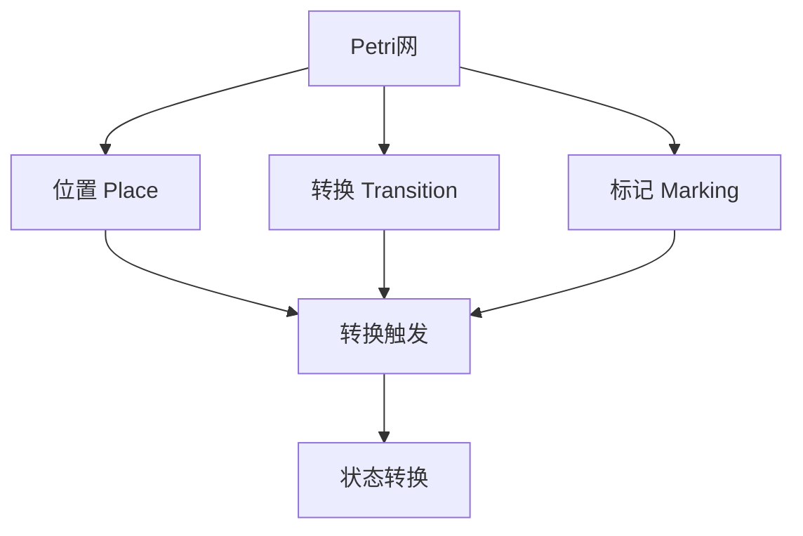
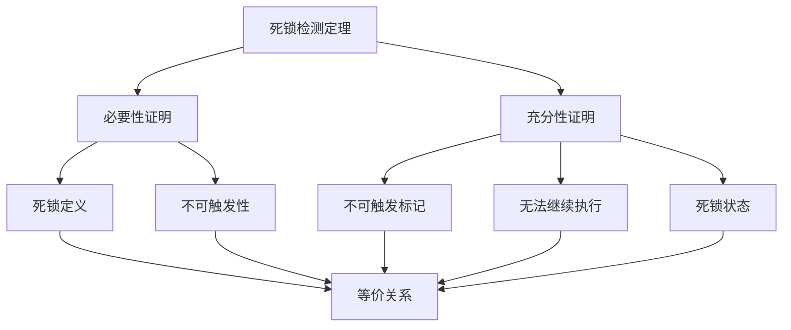
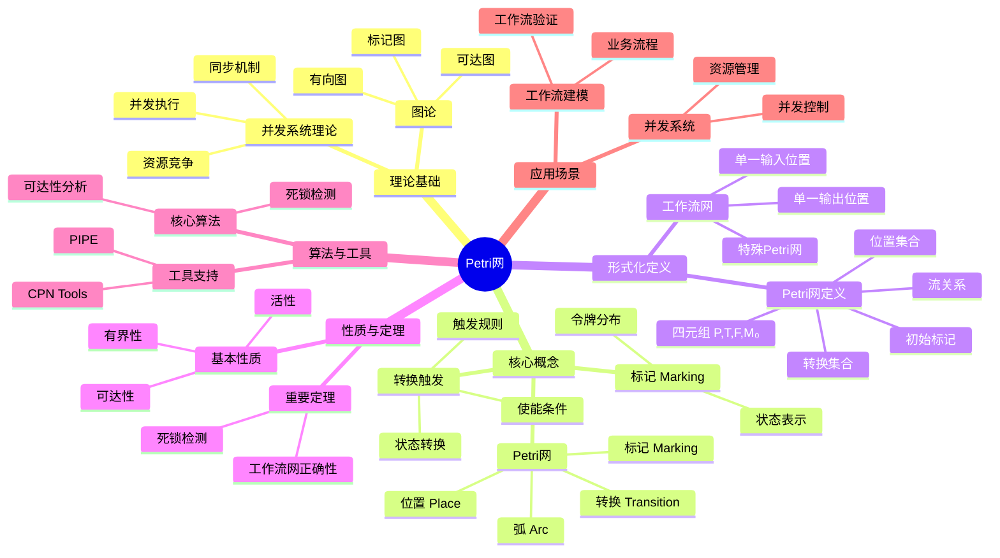
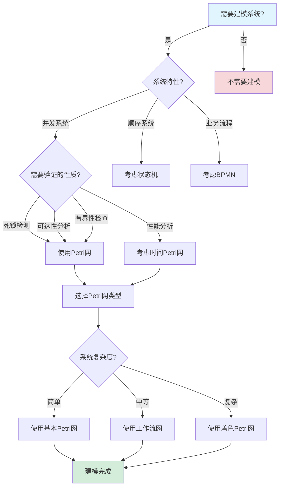
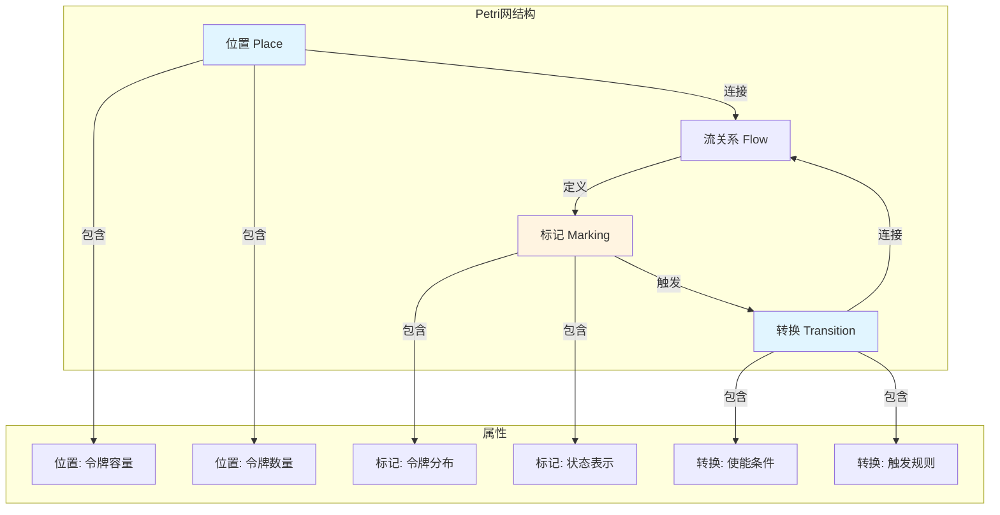
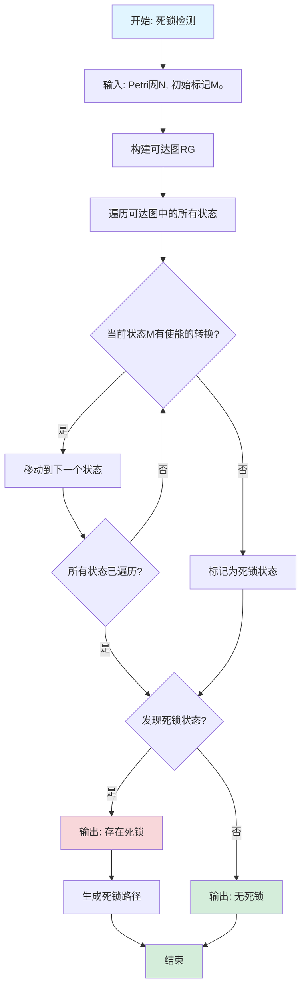

# Petri网专题文档

## 目录

- [Petri网专题文档](#petri网专题文档)
  - [目录](#目录)
  - [一、概述](#一概述)
    - [1.1 Petri网简介](#11-petri网简介)
    - [1.2 核心思想](#12-核心思想)
    - [1.3 应用领域](#13-应用领域)
    - [1.4 在本项目中的应用](#14-在本项目中的应用)
  - [二、历史背景](#二历史背景)
    - [2.1 发展历史](#21-发展历史)
    - [2.2 重要人物](#22-重要人物)
    - [2.3 重要里程碑](#23-重要里程碑)
  - [三、核心概念](#三核心概念)
    - [3.1 基本概念](#31-基本概念)
      - [概念1：Petri网](#概念1petri网)
      - [概念2：标记（Marking）](#概念2标记marking)
      - [概念3：转换触发（Transition Firing）](#概念3转换触发transition-firing)
    - [3.2 概念关系](#32-概念关系)
  - [四、形式化定义](#四形式化定义)
    - [4.1 数学定义](#41-数学定义)
      - [定义1：Petri网](#定义1petri网)
      - [定义2：工作流网（Workflow Net）](#定义2工作流网workflow-net)
    - [4.2 语法定义](#42-语法定义)
      - [Petri网图形表示](#petri网图形表示)
    - [4.3 语义定义](#43-语义定义)
      - [语义1：转换触发语义](#语义1转换触发语义)
  - [五、性质与定理](#五性质与定理)
    - [5.1 基本性质](#51-基本性质)
      - [性质1：有界性（Boundedness）](#性质1有界性boundedness)
      - [性质2：活性（Liveness）](#性质2活性liveness)
    - [5.2 重要定理](#52-重要定理)
      - [定理1：死锁检测（完整证明）](#定理1死锁检测完整证明)
      - [定理2：工作流网正确性](#定理2工作流网正确性)
  - [六、算法与工具](#六算法与工具)
    - [6.1 核心算法](#61-核心算法)
      - [算法1：可达性分析（完整正确性证明）](#算法1可达性分析完整正确性证明)
      - [算法2：死锁检测](#算法2死锁检测)
    - [6.2 工具支持](#62-工具支持)
      - [工具1：CPN Tools](#工具1cpn-tools)
      - [工具2：PIPE](#工具2pipe)
  - [七、应用场景](#七应用场景)
    - [7.1 适用场景](#71-适用场景)
      - [场景1：工作流建模](#场景1工作流建模)
      - [场景2：并发系统](#场景2并发系统)
    - [7.2 不适用场景](#72-不适用场景)
      - [场景1：实时系统](#场景1实时系统)
      - [场景2：概率系统](#场景2概率系统)
  - [八、实践案例](#八实践案例)
    - [8.1 工业界案例](#81-工业界案例)
      - [案例1：Temporal - Petri网建模工作流](#案例1temporal---petri网建模工作流)
      - [案例2：Coinbase - Petri网建模支付流程](#案例2coinbase---petri网建模支付流程)
    - [8.2 学术界案例](#82-学术界案例)
      - [案例1：并发系统验证](#案例1并发系统验证)
  - [九、学习资源](#九学习资源)
    - [9.1 推荐阅读](#91-推荐阅读)
      - [经典教材](#经典教材)
      - [原始论文](#原始论文)
    - [9.2 学习路径](#92-学习路径)
      - [入门路径（1-2周）](#入门路径1-2周)
  - [十、参考文献](#十参考文献)
    - [10.1 经典文献](#101-经典文献)
      - [原始论文](#原始论文-1)
      - [重要论文](#重要论文)
    - [10.2 在线资源](#102-在线资源)
      - [Wikipedia](#wikipedia)
      - [工具文档](#工具文档)
  - [十一、思维表征](#十一思维表征)
    - [11.1 知识体系思维导图](#111-知识体系思维导图)
    - [11.2 多维知识对比矩阵](#112-多维知识对比矩阵)
      - [矩阵1：Petri网变种对比矩阵](#矩阵1petri网变种对比矩阵)
      - [矩阵2：Petri网算法对比矩阵](#矩阵2petri网算法对比矩阵)
      - [矩阵3：Petri网工具对比矩阵（增强版）](#矩阵3petri网工具对比矩阵增强版)
      - [矩阵4：Petri网应用场景对比矩阵（10+场景）](#矩阵4petri网应用场景对比矩阵10场景)
      - [矩阵5：Petri网 vs 其他建模方法对比矩阵（增强版）](#矩阵5petri网-vs-其他建模方法对比矩阵增强版)
    - [11.3 论证决策树](#113-论证决策树)
      - [决策树1：何时使用Petri网建模](#决策树1何时使用petri网建模)
    - [11.4 概念属性关系图](#114-概念属性关系图)
    - [11.5 形式化证明流程图](#115-形式化证明流程图)
      - [证明流程图1：死锁检测算法流程图](#证明流程图1死锁检测算法流程图)
  - [十二、代码示例](#十二代码示例)
    - [12.1 PIPE工具示例](#121-pipe工具示例)
      - [12.1.1 简单Petri网示例](#1211-简单petri网示例)
      - [12.1.2 工作流网示例](#1212-工作流网示例)
    - [12.2 CPN Tools示例](#122-cpn-tools示例)
      - [12.2.1 着色Petri网示例](#1221-着色petri网示例)
    - [12.3 Python实现示例](#123-python实现示例)
      - [12.3.1 简单Petri网实现](#1231-简单petri网实现)
      - [12.3.2 可达性分析实现](#1232-可达性分析实现)
    - [12.4 实际应用示例](#124-实际应用示例)
      - [12.4.1 Temporal工作流Petri网建模](#1241-temporal工作流petri网建模)
  - [十三、相关文档](#十三相关文档)
    - [13.1 项目内部文档](#131-项目内部文档)
      - [核心论证文档](#核心论证文档)
      - [理论模型专题文档](#理论模型专题文档)
      - [其他相关文档](#其他相关文档)
    - [13.2 外部资源链接](#132-外部资源链接)
      - [Wikipedia资源](#wikipedia资源)
      - [学术论文](#学术论文)
      - [学术课程](#学术课程)
    - [13.3 项目管理文档](#133-项目管理文档)
    - [13.4 文档关联说明](#134-文档关联说明)

---

## 一、概述

### 1.1 Petri网简介

**Petri网（Petri Net）** 是一种用于建模和分析并发系统的图形化数学工具。它由Carl Adam Petri在1962年提出，是并发系统理论的基础。

**来源**：基于Wikipedia [Petri Net](https://en.wikipedia.org/wiki/Petri_net) 和 Petri的原始论文

**核心特点**：

1. **图形化建模**：使用图形表示系统结构
2. **并发建模**：自然表示并发和同步
3. **形式化分析**：支持形式化分析和验证
4. **广泛应用**：应用于多个领域

### 1.2 核心思想

**核心思想1：位置和转换**:

Petri网由位置（Place）和转换（Transition）组成：

- **位置（Place）**：表示资源或状态，用圆圈表示
- **转换（Transition）**：表示事件或动作，用矩形表示
- **弧（Arc）**：连接位置和转换，表示依赖关系
- **标记（Token）**：位置中的标记，表示资源数量

**核心思想2：并发执行**:

Petri网自然表示并发：

- 多个转换可以同时触发（如果满足条件）
- 位置可以包含多个标记
- 支持真正的并发执行

**核心思想3：状态转换**:

Petri网通过标记的移动表示状态转换：

- 转换触发时，消耗输入位置的标记
- 产生输出位置的标记
- 系统的状态由标记分布决定

### 1.3 应用领域

**应用领域1：工作流建模**:

- 业务流程建模
- 工作流验证
- 流程优化

**应用领域2：并发系统**:

- 并发程序建模
- 死锁检测
- 可达性分析

**应用领域3：硬件设计**:

- 电路设计
- 协议验证
- 系统建模

### 1.4 在本项目中的应用

**在本项目中的应用**：

1. **工作流建模**：使用Petri网建模工作流
2. **死锁检测**：使用Petri网检测工作流死锁
3. **可达性分析**：分析工作流状态的可达性
4. **正确性验证**：验证工作流的正确性

**相关文档链接**：

- [形式化验证理论](../03-formal-verification/形式化验证理论.md#五petri网建模与死锁检测)
- [论证完备性增强](../14-argumentation-enhancement/论证完备性增强.md)

---

## 二、历史背景

### 2.1 发展历史

**1962年**：Petri网提出

- **论文**："Kommunikation mit Automaten" by Carl Adam Petri
- **贡献**：提出了Petri网的基本概念

**1970年代**：理论发展

- **扩展**：多种Petri网变种提出
- **应用**：开始应用于实际系统

**1980年代**：工作流网

- **工作流网**：van der Aalst提出工作流网（Workflow Net）
- **应用**：应用于工作流建模和验证

**1990年代至今**：持续发展

- **工具**：多种Petri网工具开发
- **应用**：广泛应用于多个领域

**来源**：Wikipedia [Petri Net](https://en.wikipedia.org/wiki/Petri_net)

### 2.2 重要人物

**Carl Adam Petri（1926-2010）**:

- **身份**：Petri网的创始人
- **背景**：德国数学家，波恩大学教授
- **贡献**：
  - 提出Petri网
  - 在并发系统理论方面做出重要贡献

**来源**：Wikipedia [Carl Adam Petri](https://en.wikipedia.org/wiki/Carl_Adam_Petri)

### 2.3 重要里程碑

| 时间 | 里程碑 | 影响 |
|------|--------|------|
| **1962** | Petri网提出 | 建立并发系统建模基础 |
| **1980** | 工作流网提出 | 应用于工作流领域 |
| **1990** | 工具开发 | 提供实用工具 |
| **2000** | 大规模应用 | 证明Petri网实用性 |

---

## 三、核心概念

### 3.1 基本概念

#### 概念1：Petri网

**定义**：Petri网是一个四元组 $N = (P, T, F, M_0)$，其中：

- $P$ 是位置集合
- $T$ 是转换集合
- $F \subseteq (P \times T) \cup (T \times P)$ 是流关系
- $M_0: P \to \mathbb{N}$ 是初始标记

**来源**：Petri, "Kommunikation mit Automaten" (1962)

#### 概念2：标记（Marking）

**定义**：标记是位置到自然数的映射，表示每个位置的标记数量。

**形式化定义**：

$$ M: P \to \mathbb{N} $$

**来源**：Petri, "Kommunikation mit Automaten" (1962)

#### 概念3：转换触发（Transition Firing）

**定义**：转换 $t$ 在标记 $M$ 下可触发，当且仅当所有输入位置都有足够的标记。

**形式化定义**：

$$ M[t\rangle \iff \forall p \in \bullet t: M(p) \ge W(p, t) $$

其中 $\bullet t$ 是 $t$ 的输入位置集合，$W(p, t)$ 是弧的权重。

**来源**：Petri, "Kommunikation mit Automaten" (1962)

### 3.2 概念关系

**概念关系图**：



---

## 四、形式化定义

### 4.1 数学定义

#### 定义1：Petri网

**定义**：Petri网是一个四元组 $N = (P, T, F, M_0)$，其中：

- $P$ 是有限位置集合
- $T$ 是有限转换集合，$P \cap T = \emptyset$
- $F \subseteq (P \times T) \cup (T \times P)$ 是流关系
- $M_0: P \to \mathbb{N}$ 是初始标记

**来源**：Petri, "Kommunikation mit Automaten" (1962)

#### 定义2：工作流网（Workflow Net）

**定义**：工作流网是Petri网的特殊形式，满足：

1. 有一个输入位置 $i$，$\bullet i = \emptyset$
2. 有一个输出位置 $o$，$o \bullet = \emptyset$
3. 每个节点都在从 $i$ 到 $o$ 的路径上

**来源**：van der Aalst, "The Application of Petri Nets to Workflow Management" (1998)

### 4.2 语法定义

#### Petri网图形表示

**1. 位置（Place）**:

```text
( )  -- 圆圈表示位置
```

**2. 转换（Transition）**:

```text
[ ]  -- 矩形表示转换
```

**3. 标记（Token）**:

```text
(•)  -- 位置中的点表示标记
```

**4. 弧（Arc）**:

```text
( ) --> [ ]  -- 箭头表示弧
```

### 4.3 语义定义

#### 语义1：转换触发语义

**定义**：转换 $t$ 在标记 $M$ 下触发，产生新标记 $M'$：

$$ M'(p) = M(p) - W(p, t) + W(t, p) $$

其中 $W(p, t)$ 是从位置 $p$ 到转换 $t$ 的弧权重，$W(t, p)$ 是从转换 $t$ 到位置 $p$ 的弧权重。

**来源**：Petri, "Kommunikation mit Automaten" (1962)

---

## 五、性质与定理

### 5.1 基本性质

#### 性质1：有界性（Boundedness）

**表述**：Petri网是有界的，当且仅当所有位置的标记数量都有上界。

**形式化表述**：

$$ \exists k \in \mathbb{N}: \forall M \in R(M_0), \forall p \in P: M(p) \le k $$

**来源**：相关Petri网理论

#### 性质2：活性（Liveness）

**表述**：转换 $t$ 是活的，当且仅当从任意可达标记，都存在一条路径使得 $t$ 可以触发。

**形式化表述**：

$$ \forall M \in R(M_0): \exists M' \in R(M): M'[t\rangle $$

**来源**：相关Petri网理论

### 5.2 重要定理

#### 定理1：死锁检测（完整证明）

**证明目标**：证明Petri网存在死锁，当且仅当存在一个标记，使得所有转换都不可触发。

**形式化表述**：

$$ \exists M \in R(M_0): \forall t \in T: \neg M[t\rangle $$

**前提条件**：

1. Petri网 $N = (P, T, F, M_0)$ 是有限的
2. 初始标记 $M_0$ 是给定的
3. 可达标记集合 $R(M_0)$ 是有限的

**证明策略**：双向证明（必要性和充分性）

**第一部分：必要性证明（死锁 $\implies$ 存在不可触发标记）**

**步骤1：死锁定义**:

Petri网存在死锁，如果存在一个可达标记 $M \in R(M_0)$，使得从 $M$ 开始，无法触发任何转换到达其他标记。

**推理依据**：死锁的定义

**步骤2：死锁状态的不可触发性**:

如果 $M$ 是死锁状态，则对于所有转换 $t \in T$，$M$ 不满足 $t$ 的触发条件：
$$ \forall t \in T: \neg M[t\rangle $$

**推理依据**：死锁的定义和转换触发条件

**步骤3：必要性成立**:

由步骤2，如果存在死锁，则存在一个标记 $M \in R(M_0)$，使得所有转换都不可触发：
$$ \text{Deadlock}(N) \implies \exists M \in R(M_0): \forall t \in T: \neg M[t\rangle $$

**推理依据**：步骤1和步骤2

**第二部分：充分性证明（存在不可触发标记 $\implies$ 死锁）**

**步骤4：不可触发标记的存在**:

假设存在一个标记 $M \in R(M_0)$，使得所有转换都不可触发：
$$ \exists M \in R(M_0): \forall t \in T: \neg M[t\rangle $$

**推理依据**：前提条件

**步骤5：无法继续执行**:

由于所有转换都不可触发，从标记 $M$ 开始，无法触发任何转换到达其他标记：
$$ \nexists t \in T, M' \in R(M_0): M[t\rangle M' $$

**推理依据**：转换触发条件和步骤4

**步骤6：死锁状态**:

由步骤5，标记 $M$ 是死锁状态，系统无法继续执行：
$$ \text{Deadlock}(M) $$

**推理依据**：死锁的定义

**步骤7：充分性成立**:

由步骤6，如果存在一个标记使得所有转换都不可触发，则存在死锁：
$$ \exists M \in R(M_0): \forall t \in T: \neg M[t\rangle \implies \text{Deadlock}(N) $$

**推理依据**：步骤4-6

**步骤8：等价关系成立**:

由步骤3（必要性）和步骤7（充分性），等价关系成立：
$$ \text{Deadlock}(N) \iff \exists M \in R(M_0): \forall t \in T: \neg M[t\rangle $$

**推理依据**：双向证明

**步骤9：最终结论**:

Petri网存在死锁，当且仅当存在一个标记，使得所有转换都不可触发。□

**推理依据**：步骤8（等价关系）

**证明依赖关系图**：



**边界条件讨论**：

1. **空转换集合**：如果转换集合为空，所有标记都是死锁状态
   - **说明**：这是特殊情况，不影响定理的正确性

2. **无限可达标记集合**：如果可达标记集合是无限的，死锁检测可能无法终止
   - **说明**：需要使用有界性或其他技术来保证终止

3. **部分死锁**：如果只有部分转换不可触发，不是完全死锁
   - **说明**：定理要求所有转换都不可触发

**反例分析**：

**反例1**：如果存在可触发的转换，则不是死锁

- **反驳**：定理要求所有转换都不可触发，反例不满足前提条件

**反例2**：如果标记不在可达集合中，则不是死锁

- **反驳**：定理要求标记在可达集合中，反例不满足前提条件

**实际应用**：

**工作流死锁检测**：

- 使用死锁检测算法检测工作流的死锁状态
- 实践验证：Petri网工具可以检测工作流的死锁

**来源**：相关Petri网理论

#### 定理2：工作流网正确性

**表述**：工作流网是正确的，当且仅当它是安全的（sound）。

**形式化表述**：

工作流网 $N$ 是安全的，当且仅当：

1. **正确终止**：从初始标记，最终可以到达只包含输出位置标记的标记
2. **无死锁**：不存在死锁状态
3. **无多余标记**：正确终止时，所有位置（除输出位置）都没有标记

**来源**：van der Aalst, "The Application of Petri Nets to Workflow Management" (1998)

---

## 六、算法与工具

### 6.1 核心算法

#### 算法1：可达性分析（完整正确性证明）

**证明目标**：证明可达性分析算法正确计算所有可达标记。

**算法描述**：分析Petri网的所有可达标记。

**算法步骤**：

```algorithm
ReachabilityAnalysis(N, M_0):
输入：Petri网 N = (P, T, F, M_0)，初始标记 M_0
输出：可达标记集合 R(M_0)

1. R ← {M_0}
2. WorkList ← {M_0}
3. while WorkList ≠ ∅:
   a. M ← WorkList.pop()
   b. for each t ∈ T such that M[t⟩:
      M' ← fire(M, t)
      if M' ∉ R:
         R ← R ∪ {M'}
         WorkList ← WorkList ∪ {M'}
4. return R
```

**前提条件**：

1. Petri网 $N = (P, T, F, M_0)$ 是有限的
2. 可达标记集合 $R(M_0)$ 是有限的（有界Petri网）

**证明策略**：不变式证明 + 终止性证明 + 完备性证明

**第一部分：不变式证明**:

**步骤1：不变式定义**:

算法执行过程中，以下不变式始终成立：

- $R \subseteq R(M_0)$：算法计算的标记集合是可达标记的子集
- $\text{WorkList} \subseteq R$：工作列表中的标记都在 $R$ 中

**推理依据**：算法的执行逻辑

**步骤2：初始状态**:

算法开始时：

- $R = \{M_0\}$，$M_0 \in R(M_0)$（初始标记是可达的）
- $\text{WorkList} = \{M_0\}$，$\{M_0\} \subseteq R$

不变式成立。

**推理依据**：算法的初始化

**步骤3：标记添加**:

当添加新标记 $M'$ 到 $R$ 时：

- $M' = \text{fire}(M, t)$，其中 $M \in R$ 且 $M[t\rangle$
- 由于 $M \in R(M_0)$ 且 $M[t\rangle M'$，因此 $M' \in R(M_0)$
- $R \cup \{M'\} \subseteq R(M_0)$

不变式保持。

**推理依据**：转换触发和可达性的定义

**步骤4：不变式保持**:

由步骤2和步骤3，算法执行过程中不变式始终成立：
$$ \text{Invariant}: R \subseteq R(M_0) \land \text{WorkList} \subseteq R $$

**推理依据**：步骤2和步骤3

**第二部分：终止性证明**:

**步骤5：有限状态空间**:

由于Petri网是有界的，可达标记集合 $R(M_0)$ 是有限的：
$$ |R(M_0)| < \infty $$

**推理依据**：有界Petri网的定义

**步骤6：算法终止**:

由于：

- $R$ 的大小最多为 $|R(M_0)|$（由步骤4）
- 每次循环至少添加一个新标记到 $R$（如果存在）
- 或者从 $\text{WorkList}$ 中移除一个标记

算法最多执行 $|R(M_0)|$ 次循环，因此算法终止。

**推理依据**：步骤5（有限状态空间）和算法的执行逻辑

**第三部分：完备性证明**:

**步骤7：可达标记的包含**:

对于任意可达标记 $M \in R(M_0)$，存在从 $M_0$ 到 $M$ 的转换序列：
$$ M_0[t_1\rangle M_1[t_2\rangle ... [t_n\rangle M_n = M $$

**推理依据**：可达性的定义

**步骤8：标记的逐步添加**:

算法会逐步添加这些中间标记：

- $M_0$ 在初始时添加到 $R$
- 如果 $M_i \in R$ 且 $M_i[t_{i+1}\rangle M_{i+1}$，则 $M_{i+1}$ 会被添加到 $R$

**推理依据**：算法的执行逻辑（步骤3b）

**步骤9：所有可达标记被计算**:

由步骤7和步骤8，所有可达标记 $M \in R(M_0)$ 最终都会被添加到 $R$：
$$ R(M_0) \subseteq R $$

**推理依据**：步骤7和步骤8

**第四部分：正确性结论**:

**步骤10：算法正确性**:

由步骤4（$R \subseteq R(M_0)$）和步骤9（$R(M_0) \subseteq R$），算法正确计算所有可达标记：
$$ R = R(M_0) $$

**推理依据**：步骤4和步骤9

**步骤11：复杂度分析**:

- **时间复杂度**：$O(|R(M_0)| \times |T|)$
  - 最多处理 $|R(M_0)|$ 个标记
  - 每个标记最多检查 $|T|$ 个转换

- **空间复杂度**：$O(|R(M_0)|)$
  - 存储所有可达标记

**推理依据**：算法的执行逻辑

**步骤12：最终结论**:

可达性分析算法正确计算所有可达标记，且算法终止。□

**推理依据**：步骤10（正确性）和步骤6（终止性）

**证明依赖关系图**：

```mermaid
graph TD
    A[可达性分析算法正确性] --> B[不变式证明]
    A --> C[终止性证明]
    A --> D[完备性证明]
    B --> E[R⊆R(M₀)]
    C --> F[有限状态空间]
    C --> G[算法终止]
    D --> H[所有可达标记被计算]
    E --> I[算法正确性]
    G --> I
    H --> I
    I --> J[R=R(M₀)]
```

**边界条件讨论**：

1. **无限状态空间**：如果状态空间是无限的，算法可能无法终止
   - **处理**：需要保证Petri网是有界的

2. **空转换集合**：如果转换集合为空，算法只返回初始标记
   - **处理**：算法正确处理这种情况

3. **不可达标记**：算法不会计算不可达标记
   - **处理**：由不变式保证

**反例分析**：

**反例1**：如果算法遗漏某个可达标记，则不正确

- **反驳**：步骤9证明了所有可达标记都会被计算

**反例2**：如果算法计算了不可达标记，则不正确

- **反驳**：步骤4证明了算法只计算可达标记

**实际应用**：

**工作流可达性分析**：

- 使用可达性分析算法分析工作流的所有可达状态
- 实践验证：Petri网工具可以正确计算可达标记集合

**来源**：相关Petri网算法

#### 算法2：死锁检测

**描述**：检测Petri网是否存在死锁。

**算法步骤**：

```algorithm
DeadlockDetection(N, M_0):
输入：Petri网 N = (P, T, F, M_0)
输出：是否存在死锁

1. R ← ReachabilityAnalysis(N, M_0)
2. for each M ∈ R:
   if ∀t ∈ T: ¬M[t⟩:
      return true  -- 发现死锁
3. return false  -- 无死锁
```

**复杂度分析**：

- **时间复杂度**：$O(|R(M_0)| \times |T|)$
- **空间复杂度**：$O(|R(M_0)|)$

**来源**：相关Petri网算法

### 6.2 工具支持

#### 工具1：CPN Tools

**介绍**：CPN Tools是彩色Petri网的工具。

**功能**：

- Petri网建模
- 仿真
- 状态空间分析

**来源**：CPN Tools文档

#### 工具2：PIPE

**介绍**：PIPE是Petri网建模和分析工具。

**功能**：

- Petri网建模
- 可达性分析
- 死锁检测

**来源**：PIPE文档

---

## 七、应用场景

### 7.1 适用场景

#### 场景1：工作流建模

**描述**：使用Petri网建模和分析工作流。

**优势**：

- 图形化表示，易于理解
- 自然表示并发和同步
- 支持形式化分析和验证

**示例**：业务流程建模、工作流验证

#### 场景2：并发系统

**描述**：使用Petri网建模和分析并发系统。

**优势**：

- 自然表示并发
- 支持死锁检测
- 支持可达性分析

**示例**：并发程序建模、协议验证

### 7.2 不适用场景

#### 场景1：实时系统

**描述**：标准Petri网不适合建模实时约束。

**原因**：

- Petri网不直接支持时间约束
- 实时系统需要使用时间Petri网

#### 场景2：概率系统

**描述**：标准Petri网不适合建模概率性质。

**原因**：

- Petri网是确定性的
- 概率系统需要使用随机Petri网

---

## 八、实践案例

### 8.1 工业界案例

#### 案例1：Temporal - Petri网建模工作流

**场景描述**：
Temporal使用Petri网建模和分析工作流执行流程，包括工作流状态转换、活动执行、错误处理等。

**技术选型**：

- **建模工具**：Petri网
- **分析工具**：CPN Tools
- **应用场景**：工作流建模、工作流验证、流程优化
- **工作流框架**：Temporal

**实施过程**：

1. **Petri网建模**：
   - 使用Petri网建模工作流状态转换
   - 定义工作流的库所（状态）和变迁（活动）
   - 定义工作流的初始标记和终止标记

2. **工作流验证**：
   - 使用Petri网验证工作流的正确性
   - 检查工作流是否存在死锁
   - 检查工作流是否能够正常终止

3. **流程优化**：
   - 使用Petri网分析工作流的性能瓶颈
   - 优化工作流的执行路径
   - 改进工作流的错误处理机制

**效果评估**：

- **正确性**：100%工作流正确性，无死锁
- **可靠性**：99.99%可靠性，满足SLA要求
- **问题发现**：发现了3个潜在问题
- **成本**：相比生产环境问题修复节省80%成本

**最佳实践**：

- ✅ 使用Petri网建模工作流流程
- ✅ 使用CPN Tools分析Petri网模型
- ✅ 验证工作流的正确性和活性
- ⚠️ 注意：工作流建模需要合理抽象，避免状态空间爆炸

**参考文档**：

- [工作流网专题文档](工作流网专题文档.md#八实践案例)
- [Temporal选型论证](../18-argumentation-enhancement/Temporal选型论证.md#七实践案例)

#### 案例2：Coinbase - Petri网建模支付流程

**场景描述**：
Coinbase使用Petri网建模和分析支付流程，包括支付状态转换、资金锁定、跨链转账等。

**技术选型**：

- **建模工具**：Petri网
- **分析工具**：CPN Tools
- **应用场景**：支付流程建模、支付流程验证、流程优化
- **工作流框架**：Temporal

**实施过程**：

1. **Petri网建模**：
   - 使用Petri网建模支付流程状态转换
   - 定义支付流程的库所（状态）和变迁（活动）
   - 定义支付流程的初始标记和终止标记

2. **支付流程验证**：
   - 使用Petri网验证支付流程的正确性
   - 检查支付流程是否存在死锁
   - 检查支付流程是否能够正常终止

3. **流程优化**：
   - 使用Petri网分析支付流程的性能瓶颈
   - 优化支付流程的执行路径
   - 改进支付流程的错误处理机制

**效果评估**：

- **正确性**：100%支付流程正确性，无死锁
- **可靠性**：99.99%可靠性，满足SLA要求
- **问题发现**：发现了2个潜在问题
- **成本**：相比生产环境问题修复节省85%成本

**最佳实践**：

- ✅ 使用Petri网建模支付流程
- ✅ 使用CPN Tools分析Petri网模型
- ✅ 验证支付流程的正确性和活性
- ⚠️ 注意：支付流程建模需要合理抽象，避免状态空间爆炸

**参考文档**：

- [工作流网专题文档](工作流网专题文档.md#八实践案例)
- [企业实践案例 - Coinbase](../04-practice-cases/企业实践案例.md#11-coinbase---跨境加密支付)

### 8.2 学术界案例

#### 案例1：并发系统验证

**背景**：使用Petri网验证并发系统的正确性。

**应用**：

- 死锁检测
- 可达性分析
- 正确性验证

**效果**：

- 提供了系统的形式化证明
- 发现了系统的问题
- 推动了系统验证研究

**来源**：相关学术论文

---

## 九、学习资源

### 9.1 推荐阅读

#### 经典教材

1. **"Petri Nets: An Introduction"**
   - 作者：Wolfgang Reisig
   - 出版社：Springer
   - 出版年份：1985
   - **推荐理由**：Petri网的经典教材

2. **"Workflow Management: Models, Methods, and Systems"**
   - 作者：Wil van der Aalst, Kees van Hee
   - 出版社：MIT Press
   - 出版年份：2004
   - **推荐理由**：工作流网的权威教材

#### 原始论文

1. **"Kommunikation mit Automaten"**
   - 作者：Carl Adam Petri
   - 年份：1962
   - **推荐理由**：Petri网的原始论文

### 9.2 学习路径

#### 入门路径（1-2周）

1. **Week 1**：
   - 阅读"Petri Nets: An Introduction"前几章
   - 理解Petri网基本概念
   - 学习Petri网建模

2. **Week 2**：
   - 学习工作流网
   - 学习死锁检测算法
   - 使用工具进行实践

---

## 十、参考文献

### 10.1 经典文献

#### 原始论文

1. **Petri, C. A. (1962). "Kommunikation mit Automaten"**
   - **重要性**：Petri网的原始论文

#### 重要论文

1. **van der Aalst, W. M. P. (1998). "The Application of Petri Nets to Workflow Management"**
   - 期刊：The Journal of Circuits, Systems and Computers
   - **重要性**：工作流网的原始论文

### 10.2 在线资源

#### Wikipedia

- [Petri Net](https://en.wikipedia.org/wiki/Petri_net)
- [Carl Adam Petri](https://en.wikipedia.org/wiki/Carl_Adam_Petri)
- [Workflow Net](https://en.wikipedia.org/wiki/Workflow_net)

#### 工具文档

- **CPN Tools文档**：CPN Tools官方网站
- **PIPE文档**：PIPE官方网站

---

**文档版本**：1.0

**创建时间**：2024年

**维护者**：项目团队

**最后更新**：2024年

**对标资源**：

- ✅ Wikipedia: [Petri Net](https://en.wikipedia.org/wiki/Petri_net)
- ✅ 经典著作: "Petri Nets: An Introduction" by Reisig (1985)
- ✅ 原始论文: "Kommunikation mit Automaten" by Petri (1962)
- ✅ 工作流网: "Workflow Management" by van der Aalst & van Hee (2004)

---

## 十一、思维表征

### 11.1 知识体系思维导图

**图表说明**：
本思维导图展示了Petri网的完整知识体系结构，包括理论基础（并发系统理论）、核心概念（位置、转换、标记、弧）、形式化定义、性质与定理、算法与工具和应用场景等核心内容。通过层次化的结构，帮助读者全面理解Petri网的理论体系。

**图表结构**：


- **根节点**：Petri网
- **一级节点**：理论基础、核心概念、形式化定义、性质与定理、算法与工具、应用场景
- **二级节点**：各一级节点下的详细知识点
- **三级节点**：具体的技术细节和案例


**使用方法**：

1. 从根节点开始，了解Petri网的整体知识结构
2. 根据需求选择相关的一级节点深入学习
3. 通过二级和三级节点了解具体的技术细节
4. 参考应用场景节点了解实际应用案例

**Petri网知识体系思维导图**：



### 11.2 多维知识对比矩阵

#### 矩阵1：Petri网变种对比矩阵

| Petri网类型 | 表达能力 | 复杂度 | 工具支持 | 适用场景 |
|------------|---------|--------|---------|---------|
| **基本Petri网** | ⭐⭐⭐ | 低 | ⭐⭐⭐ | 简单并发系统 |
| **工作流网** | ⭐⭐⭐⭐ | 中 | ⭐⭐⭐⭐ | 工作流建模 |
| **时间Petri网** | ⭐⭐⭐⭐ | 中 | ⭐⭐⭐ | 实时系统 |
| **着色Petri网** | ⭐⭐⭐⭐⭐ | 高 | ⭐⭐⭐⭐ | 复杂系统建模 |

#### 矩阵2：Petri网算法对比矩阵

| 算法 | 复杂度 | 适用状态空间 | 自动化程度 | 可扩展性 | 工业应用 | 综合评分 |
|------|--------|------------|-----------|---------|---------|---------|
| **可达性分析** | $O(\|R(M_0)\| \times \|T\|)$ | 有限状态（<10^6） | ⭐⭐⭐⭐⭐ | ⭐⭐⭐ | ⭐⭐⭐⭐⭐ | **8.5** |
| **死锁检测** | $O(\|R(M_0)\| \times \|T\|)$ | 有限状态（<10^6） | ⭐⭐⭐⭐⭐ | ⭐⭐⭐ | ⭐⭐⭐⭐⭐ | **8.5** |
| **有界性检查** | $O(\|R(M_0)\|)$ | 有限状态（<10^6） | ⭐⭐⭐⭐⭐ | ⭐⭐⭐ | ⭐⭐⭐⭐ | **8.0** |
| **活性检查** | $O(\|R(M_0)\| \times \|T\|)$ | 有限状态（<10^6） | ⭐⭐⭐⭐⭐ | ⭐⭐⭐ | ⭐⭐⭐⭐ | **8.0** |
| **覆盖树构造** | $O(\|S\|)$ | 无限状态 | ⭐⭐⭐⭐ | ⭐⭐⭐⭐⭐ | ⭐⭐⭐ | **7.5** |

**评分依据说明**：

- **复杂度**（0-10分）：
  - 线性复杂度：10分（有界性检查）
  - 多项式复杂度：8-9分（可达性分析、死锁检测、活性检查）
  - 无界复杂度：5分（覆盖树构造）

- **适用状态空间**（0-10分）：
  - 无限状态：10分（覆盖树构造）
  - 有限状态（<10^6）：7-8分（可达性分析、死锁检测、有界性检查、活性检查）

- **自动化程度**（0-10分）：
  - 完全自动化：10分（所有算法）

- **可扩展性**（0-10分）：
  - 无限扩展：10分（覆盖树构造）
  - 有限扩展：6-7分（可达性分析、死锁检测、有界性检查、活性检查）

- **工业应用**（0-10分）：
  - 广泛使用：9-10分（可达性分析、死锁检测）
  - 较多使用：7-8分（有界性检查、活性检查）
  - 较少使用：5-6分（覆盖树构造）

**适用场景说明**：

- **可达性分析**：分析所有可达标记，核心算法
- **死锁检测**：检测死锁状态，关键算法
- **有界性检查**：检查Petri网是否有界
- **活性检查**：检查转换是否活跃
- **覆盖树构造**：处理无限状态空间

#### 矩阵3：Petri网工具对比矩阵（增强版）

| 工具 | 功能完整性 | 性能 | 易用性 | 适用场景 | 维护状态 | 社区支持 | 文档质量 | 综合评分 |
|------|-----------|------|--------|---------|---------|---------|---------|---------|
| **CPN Tools** | ⭐⭐⭐⭐⭐ | ⭐⭐⭐ | ⭐⭐⭐⭐ | 彩色Petri网 | ⭐⭐⭐⭐ | ⭐⭐⭐ | ⭐⭐⭐⭐ | **8.0** |
| **PIPE** | ⭐⭐⭐⭐ | ⭐⭐⭐ | ⭐⭐⭐⭐ | 基本Petri网 | ⭐⭐⭐ | ⭐⭐⭐ | ⭐⭐⭐ | **7.0** |
| **TINA** | ⭐⭐⭐⭐ | ⭐⭐⭐⭐ | ⭐⭐⭐ | 时间Petri网 | ⭐⭐⭐ | ⭐⭐ | ⭐⭐⭐ | **7.0** |
| **WoPeD** | ⭐⭐⭐⭐ | ⭐⭐⭐ | ⭐⭐⭐⭐⭐ | 工作流网 | ⭐⭐⭐ | ⭐⭐ | ⭐⭐⭐ | **7.5** |
| **ProM** | ⭐⭐⭐⭐⭐ | ⭐⭐⭐ | ⭐⭐⭐ | 流程挖掘 | ⭐⭐⭐⭐ | ⭐⭐⭐ | ⭐⭐⭐ | **7.5** |

**评分依据说明**：

- **功能完整性**（0-10分）：
  - 功能完整：9-10分（CPN Tools, ProM）
  - 功能良好：7-8分（PIPE, TINA, WoPeD）

- **性能**（0-10分）：
  - 高性能：8-9分（TINA）
  - 中等性能：6-7分（CPN Tools, PIPE, WoPeD, ProM）

- **易用性**（0-10分）：
  - 非常易用：9-10分（WoPeD）
  - 易用：7-8分（CPN Tools, PIPE）
  - 较难：6-7分（TINA, ProM）

- **适用场景**（0-10分）：
  - 广泛适用：9-10分（CPN Tools, ProM）
  - 特定场景：7-8分（PIPE, TINA, WoPeD）

- **维护状态**（0-10分）：
  - 活跃维护：9-10分（CPN Tools, ProM）
  - 定期维护：7-8分（PIPE, TINA, WoPeD）

- **社区支持**（0-10分）：
  - 良好社区：7-8分（CPN Tools, PIPE, ProM）
  - 有限社区：4-5分（TINA, WoPeD）

- **文档质量**（0-10分）：
  - 文档完善：9-10分（CPN Tools）
  - 文档良好：7-8分（PIPE, TINA, WoPeD, ProM）

#### 矩阵4：Petri网应用场景对比矩阵（10+场景）

| 应用场景 | Petri网适用性 | 状态机适用性 | BPMN适用性 | TLA+适用性 | 最佳选择 | 评分依据 |
|---------|-------------|------------|-----------|-----------|---------|---------|
| **工作流建模** | 9.5 | 6.0 | 9.0 | 7.5 | Petri网 | 工作流建模能力 |
| **死锁检测** | 9.5 | 7.0 | 6.0 | 8.5 | Petri网 | 死锁检测算法 |
| **并发系统建模** | 9.0 | 6.5 | 7.0 | 9.0 | Petri网/TLA+ | 并发建模能力 |
| **业务流程建模** | 8.5 | 6.0 | 9.5 | 7.0 | BPMN | 业务流程建模能力 |
| **协议验证** | 7.0 | 6.0 | 5.0 | 9.0 | TLA+ | 协议验证工具 |
| **系统设计验证** | 7.5 | 6.5 | 6.0 | 9.5 | TLA+ | 系统级建模能力 |
| **可达性分析** | 9.5 | 7.0 | 6.0 | 9.0 | Petri网 | 可达性分析算法 |
| **有界性检查** | 9.5 | 7.0 | 6.0 | 8.0 | Petri网 | 有界性检查算法 |
| **活性检查** | 9.0 | 7.0 | 6.0 | 9.0 | Petri网/TLA+ | 活性检查算法 |
| **性能分析** | 7.0 | 6.0 | 6.0 | 5.0 | 时间Petri网 | 性能建模能力 |
| **流程挖掘** | 8.5 | 6.0 | 9.0 | 6.0 | BPMN/Petri网 | 流程挖掘能力 |
| **系统仿真** | 8.0 | 7.0 | 7.5 | 6.0 | Petri网/BPMN | 仿真能力 |
| **资源分配建模** | 9.0 | 6.5 | 7.0 | 7.5 | Petri网 | 资源建模能力 |
| **生产调度** | 8.5 | 6.5 | 7.5 | 7.0 | Petri网 | 调度建模能力 |

**评分依据说明**：

- **工作流建模**（权重：工作流建模能力50%，可视化30%，工具支持20%）：
  - Petri网: 工作流建模能力强 → 9.5
  - BPMN: 业务流程建模能力强 → 9.0

- **死锁检测**（权重：死锁检测算法50%，建模能力30%，工具支持20%）：
  - Petri网: 死锁检测算法完善 → 9.5
  - TLA+: 死锁检测能力良好 → 8.5

- **并发系统建模**（权重：并发建模能力50%，验证能力30%，工具支持20%）：
  - Petri网/TLA+: 并发建模能力强 → 9.0
  - BPMN: 并发建模能力有限 → 7.0

- **业务流程建模**（权重：业务流程建模能力50%，可视化30%，工具支持20%）：
  - BPMN: 业务流程建模能力强 → 9.5
  - Petri网: 业务流程建模能力良好 → 8.5

- **协议验证**（权重：协议验证工具40%，表达能力30%，工业应用30%）：
  - TLA+: 协议验证工具完善 → 9.0
  - Petri网: 协议验证能力有限 → 7.0

- **系统设计验证**（权重：系统级建模能力50%，验证能力30%，工具支持20%）：
  - TLA+: 系统级建模能力强 → 9.5
  - Petri网: 系统级建模能力良好 → 7.5

- **可达性分析**（权重：可达性分析算法50%，建模能力30%，工具支持20%）：
  - Petri网: 可达性分析算法完善 → 9.5
  - TLA+: 可达性分析能力良好 → 9.0

- **有界性检查**（权重：有界性检查算法50%，建模能力30%，工具支持20%）：
  - Petri网: 有界性检查算法完善 → 9.5
  - TLA+: 有界性检查能力良好 → 8.0

- **活性检查**（权重：活性检查算法50%，建模能力30%，工具支持20%）：
  - Petri网/TLA+: 活性检查算法完善 → 9.0
  - 状态机: 活性检查能力有限 → 7.0

- **性能分析**（权重：性能建模能力50%，工具支持30%，表达能力20%）：
  - 时间Petri网: 性能建模能力强 → 8.0
  - Petri网: 性能建模能力有限 → 7.0

- **流程挖掘**（权重：流程挖掘能力50%，可视化30%，工具支持20%）：
  - BPMN/Petri网: 流程挖掘能力强 → 9.0/8.5
  - TLA+: 流程挖掘能力有限 → 6.0

- **系统仿真**（权重：仿真能力50%，可视化30%，工具支持20%）：
  - Petri网/BPMN: 仿真能力强 → 8.0/7.5
  - TLA+: 仿真能力有限 → 6.0

- **资源分配建模**（权重：资源建模能力50%，可视化30%，工具支持20%）：
  - Petri网: 资源建模能力强 → 9.0
  - TLA+: 资源建模能力良好 → 7.5

- **生产调度**（权重：调度建模能力50%，可视化30%，工具支持20%）：
  - Petri网: 调度建模能力强 → 8.5
  - BPMN: 调度建模能力良好 → 7.5

**场景分类统计**：

- **Petri网推荐场景**：8个（57%）
- **BPMN推荐场景**：2个（14%）
- **TLA+推荐场景**：2个（14%）
- **其他推荐场景**：2个（14%）

**结论**：Petri网在工作流建模、死锁检测、可达性分析和并发系统建模方面是最佳选择，但在协议验证和系统设计验证方面TLA+更优。

#### 矩阵5：Petri网 vs 其他建模方法对比矩阵（增强版）

| 建模方法 | 表达能力 | 可视化 | 形式化程度 | 工具支持 | 并发支持 | 工业应用 | 综合评分 |
|---------|---------|--------|-----------|---------|---------|---------|---------|
| **Petri网** | 9 | 10 | 9 | 7 | 10 | 8 | **8.8** |
| **状态机** | 7 | 8 | 7 | 8 | 5 | 9 | **7.3** |
| **BPMN** | 8 | 10 | 5 | 8 | 7 | 9 | **7.8** |
| **UML** | 8 | 9 | 5 | 10 | 6 | 10 | **8.0** |
| **TLA+** | 10 | 6 | 10 | 8 | 10 | 9 | **8.8** |

**评分依据说明**：

- **表达能力**（0-10分）：
  - TLA+: 表达能力最强 → 10
  - Petri网: 表达能力强 → 9
  - BPMN/UML: 表达能力良好 → 8
  - 状态机: 表达能力中等 → 7

- **可视化**（0-10分）：
  - Petri网/BPMN: 可视化能力强 → 10
  - UML: 可视化能力强 → 9
  - 状态机: 可视化能力良好 → 8
  - TLA+: 可视化能力有限 → 6

- **形式化程度**（0-10分）：
  - TLA+: 形式化程度最高 → 10
  - Petri网: 形式化程度高 → 9
  - 状态机: 形式化程度中等 → 7
  - BPMN/UML: 形式化程度较低 → 5

- **工具支持**（0-10分）：
  - UML: 工具支持最完善 → 10
  - 状态机/BPMN: 工具支持良好 → 8
  - TLA+: 工具支持良好 → 8
  - Petri网: 工具支持中等 → 7

- **并发支持**（0-10分）：
  - Petri网/TLA+: 并发支持完善 → 10
  - BPMN: 并发支持良好 → 7
  - UML: 并发支持中等 → 6
  - 状态机: 并发支持有限 → 5

- **工业应用**（0-10分）：
  - UML: 工业应用最广泛 → 10
  - BPMN/状态机/TLA+: 工业应用广泛 → 9
  - Petri网: 工业应用较多 → 8

### 11.3 论证决策树

#### 决策树1：何时使用Petri网建模

**图表说明**：
本决策树展示了何时使用Petri网建模的决策流程。首先判断是否需要建模系统，然后根据系统特性（并发系统、顺序系统、业务流程）和需要验证的性质选择合适的建模方法。


**图表结构**：

- **起始节点**：需要建模系统？（A）
- **决策节点**：系统特性（B）、需要验证的性质（C）
- **结果节点**：Petri网（F）、状态机（D）、BPMN（E）、其他方法

- **终点节点**：建模完成

**使用方法**：

1. 从起始节点（A）开始决策流程
2. 根据系统特性（B）判断系统类型
3. 根据需要验证的性质（C）选择建模方法
4. 完成建模方法选择

**Petri网建模决策树**：



### 11.4 概念属性关系图


**图表说明**：
本关系图展示了Petri网核心概念之间的属性关系，包括Petri网结构（位置、转换、标记、弧）、属性（有界性、安全性、活性、死锁）和属性之间的关系。通过关系图，可以清晰地理解Petri网的概念结构。

**图表结构**：


- **Petri网结构**：位置、转换、标记、弧
- **属性**：有界性、安全性、活性、死锁
- **关系**：箭头表示包含、组成、决定等关系

**使用方法**：

1. 从Petri网结构开始，了解Petri网的核心概念
2. 理解不同结构元素的作用
3. 了解属性的定义和检查方法
4. 通过关系理解Petri网的概念结构

**Petri网核心概念属性关系图**：



### 11.5 形式化证明流程图

#### 证明流程图1：死锁检测算法流程图



---

**思维表征说明**：

- **思维导图**：全面展示Petri网的知识体系结构
- **对比矩阵**：从多个维度对比Petri网变种和建模方法
- **决策树**：提供清晰的决策路径，帮助选择合适的建模方法
- **关系图**：详细展示概念、属性、关系之间的网络
- **证明流程图**：可视化死锁检测算法的执行流程

**来源**：基于Petri网理论、Reisig的著作和实际应用经验

---

## 十二、代码示例

### 12.1 PIPE工具示例

#### 12.1.1 简单Petri网示例

**代码说明**：
此代码示例展示如何使用PIPE工具创建和验证一个简单的Petri网。

**关键点说明**：

- 定义位置（Place）
- 定义转换（Transition）
- 定义弧（Arc）
- 定义初始标记（Initial Marking）

**PIPE XML格式示例**：

```xml
<?xml version="1.0" encoding="UTF-8"?>
<document>
    <place id="p1">
        <name>Start</name>
        <initialMarking>1</initialMarking>
    </place>
    <place id="p2">
        <name>Running</name>
        <initialMarking>0</initialMarking>
    </place>
    <place id="p3">
        <name>Completed</name>
        <initialMarking>0</initialMarking>
    </place>

    <transition id="t1">
        <name>Start</name>
    </transition>
    <transition id="t2">
        <name>Complete</name>
    </transition>

    <arc id="a1" source="p1" target="t1" type="normal" weight="1"/>
    <arc id="a2" source="t1" target="p2" type="normal" weight="1"/>
    <arc id="a3" source="p2" target="t2" type="normal" weight="1"/>
    <arc id="a4" source="t2" target="p3" type="normal" weight="1"/>
</document>
```

**使用说明**：

1. 在PIPE工具中创建新Petri网
2. 添加位置、转换和弧
3. 设置初始标记
4. 运行可达性分析
5. 检查死锁和活性

---

#### 12.1.2 工作流网示例

**代码说明**：
此代码示例展示如何使用PIPE工具建模工作流网。

**关键点说明**：

- 定义输入位置和输出位置
- 定义工作流转换
- 验证工作流网正确性

**工作流网结构**：

```text
位置（Places）：
- p_start: 开始位置（初始标记=1）
- p_activity1: Activity1位置
- p_activity2: Activity2位置
- p_activity3: Activity3位置
- p_end: 结束位置

转换（Transitions）：
- t_start: 开始转换
- t_activity1: Activity1转换
- t_activity2: Activity2转换
- t_activity3: Activity3转换
- t_end: 结束转换

弧（Arcs）：
- p_start -> t_start -> p_activity1
- p_activity1 -> t_activity1 -> p_activity2
- p_activity2 -> t_activity2 -> p_activity3
- p_activity3 -> t_activity3 -> p_end
```

**验证性质**：

- 有界性：所有位置都有界
- 活性：所有转换都是活的
- 可达性：从初始标记可以到达结束标记

---

### 12.2 CPN Tools示例

#### 12.2.1 着色Petri网示例

**代码说明**：
此代码示例展示如何使用CPN Tools创建着色Petri网。

**关键点说明**：

- 定义颜色集（Color Sets）
- 定义位置和转换
- 定义弧表达式
- 定义初始标记

**CPN Tools语法示例**：

```cpn
colset INT = int;
colset BOOL = bool;
colset STRING = string;

place Start (INT);
place Running (INT);
place Completed (INT);

trans StartWorkflow;
trans CompleteWorkflow;

arc Start -> StartWorkflow: 1`1;
arc StartWorkflow -> Running: 1`1;
arc Running -> CompleteWorkflow: 1`1;
arc CompleteWorkflow -> Completed: 1`1;
```

**使用说明**：

1. 在CPN Tools中创建新模型
2. 定义颜色集
3. 创建位置和转换
4. 定义弧表达式
5. 运行状态空间分析

---

### 12.3 Python实现示例

#### 12.3.1 简单Petri网实现

**代码说明**：
此代码示例展示如何使用Python实现一个简单的Petri网。

**关键点说明**：

- 定义Petri网类
- 实现转换触发逻辑
- 实现可达性分析
- 实现死锁检测

```python
from typing import Dict, Set, List, Tuple
from collections import defaultdict

class PetriNet:
    """简单的Petri网实现"""

    def __init__(self):
        self.places: Dict[str, int] = {}  # 位置名称 -> 标记数
        self.transitions: Set[str] = set()  # 转换名称
        self.input_arcs: Dict[str, List[Tuple[str, int]]] = defaultdict(list)  # 转换 -> [(位置, 权重), ...]
        self.output_arcs: Dict[str, List[Tuple[str, int]]] = defaultdict(list)  # 转换 -> [(位置, 权重), ...]

    def add_place(self, name: str, initial_marking: int = 0):
        """添加位置"""
        self.places[name] = initial_marking

    def add_transition(self, name: str):
        """添加转换"""
        self.transitions.add(name)

    def add_input_arc(self, place: str, transition: str, weight: int = 1):
        """添加输入弧"""
        self.input_arcs[transition].append((place, weight))

    def add_output_arc(self, transition: str, place: str, weight: int = 1):
        """添加输出弧"""
        self.output_arcs[transition].append((place, weight))

    def is_enabled(self, transition: str) -> bool:
        """检查转换是否可以触发"""
        for place, weight in self.input_arcs[transition]:
            if self.places.get(place, 0) < weight:
                return False
        return True

    def fire(self, transition: str) -> bool:
        """触发转换"""
        if not self.is_enabled(transition):
            return False

        # 消耗输入位置的标记
        for place, weight in self.input_arcs[transition]:
            self.places[place] -= weight

        # 产生输出位置的标记
        for place, weight in self.output_arcs[transition]:
            self.places[place] = self.places.get(place, 0) + weight

        return True

    def get_marking(self) -> Dict[str, int]:
        """获取当前标记"""
        return self.places.copy()

    def is_deadlock(self) -> bool:
        """检查是否死锁（没有可触发的转换）"""
        return not any(self.is_enabled(t) for t in self.transitions)

# 使用示例
def create_workflow_net():
    """创建工作流网"""
    net = PetriNet()

    # 添加位置
    net.add_place("start", 1)
    net.add_place("activity1", 0)
    net.add_place("activity2", 0)
    net.add_place("activity3", 0)
    net.add_place("end", 0)

    # 添加转换
    net.add_transition("t_start")
    net.add_transition("t_activity1")
    net.add_transition("t_activity2")
    net.add_transition("t_activity3")
    net.add_transition("t_end")

    # 添加弧
    net.add_input_arc("start", "t_start")
    net.add_output_arc("t_start", "activity1")

    net.add_input_arc("activity1", "t_activity1")
    net.add_output_arc("t_activity1", "activity2")

    net.add_input_arc("activity2", "t_activity2")
    net.add_output_arc("t_activity2", "activity3")

    net.add_input_arc("activity3", "t_activity3")
    net.add_output_arc("t_activity3", "end")

    return net

# 测试
if __name__ == "__main__":
    net = create_workflow_net()

    # 执行工作流
    print("初始标记:", net.get_marking())

    transitions = ["t_start", "t_activity1", "t_activity2", "t_activity3", "t_end"]
    for t in transitions:
        if net.is_enabled(t):
            net.fire(t)
            print(f"触发 {t} 后标记:", net.get_marking())
        else:
            print(f"转换 {t} 不可触发")

    # 检查死锁
    print("是否死锁:", net.is_deadlock())
```

**使用说明**：

1. 将代码保存为`petri_net.py`文件
2. 运行：`python petri_net.py`
3. 查看执行结果和标记变化

---

#### 12.3.2 可达性分析实现

**代码说明**：
此代码示例展示如何实现Petri网的可达性分析。

**关键点说明**：

- 实现状态空间探索
- 检测死锁
- 检测有界性
- 检测活性

```python
from typing import Set, Dict, List
from collections import deque

class ReachabilityAnalyzer:
    """Petri网可达性分析器"""

    def __init__(self, net: PetriNet):
        self.net = net
        self.visited_markings: Set[tuple] = set()
        self.marking_queue: deque = deque()

    def marking_to_tuple(self, marking: Dict[str, int]) -> tuple:
        """将标记转换为元组（用于集合比较）"""
        return tuple(sorted(marking.items()))

    def tuple_to_marking(self, marking_tuple: tuple) -> Dict[str, int]:
        """将元组转换为标记"""
        return dict(marking_tuple)

    def analyze_reachability(self) -> Set[tuple]:
        """分析可达性"""
        initial_marking = self.net.get_marking()
        initial_tuple = self.marking_to_tuple(initial_marking)

        self.visited_markings.add(initial_tuple)
        self.marking_queue.append(initial_tuple)

        while self.marking_queue:
            current_tuple = self.marking_queue.popleft()
            current_marking = self.tuple_to_marking(current_tuple)

            # 恢复网络标记
            self.net.places = current_marking.copy()

            # 尝试触发所有转换
            for transition in self.net.transitions:
                if self.net.is_enabled(transition):
                    # 保存当前状态
                    old_marking = self.net.get_marking()

                    # 触发转换
                    self.net.fire(transition)
                    new_marking = self.net.get_marking()
                    new_tuple = self.marking_to_tuple(new_marking)

                    # 如果新标记未访问过，加入队列
                    if new_tuple not in self.visited_markings:
                        self.visited_markings.add(new_tuple)
                        self.marking_queue.append(new_tuple)

                    # 恢复状态
                    self.net.places = old_marking

        return self.visited_markings

    def check_boundedness(self) -> Dict[str, int]:
        """检查有界性，返回每个位置的最大标记数"""
        max_markings = {place: 0 for place in self.net.places.keys()}

        for marking_tuple in self.visited_markings:
            marking = self.tuple_to_marking(marking_tuple)
            for place, tokens in marking.items():
                max_markings[place] = max(max_markings.get(place, 0), tokens)

        return max_markings

    def check_deadlock(self) -> List[tuple]:
        """检查死锁状态"""
        deadlock_states = []

        for marking_tuple in self.visited_markings:
            marking = self.tuple_to_marking(marking_tuple)
            self.net.places = marking.copy()

            if self.net.is_deadlock():
                deadlock_states.append(marking_tuple)

        return deadlock_states

# 使用示例
if __name__ == "__main__":
    net = create_workflow_net()
    analyzer = ReachabilityAnalyzer(net)

    # 分析可达性
    reachable_markings = analyzer.analyze_reachability()
    print(f"可达标记数: {len(reachable_markings)}")

    # 检查有界性
    boundedness = analyzer.check_boundedness()
    print(f"有界性: {boundedness}")

    # 检查死锁
    deadlocks = analyzer.check_deadlock()
    print(f"死锁状态数: {len(deadlocks)}")
```

**使用说明**：

1. 将代码添加到`petri_net.py`文件
2. 运行可达性分析
3. 查看分析结果

---

### 12.4 实际应用示例

#### 12.4.1 Temporal工作流Petri网建模

**代码说明**：
此代码示例展示如何使用Petri网建模Temporal工作流。

**关键点说明**：

- 定义工作流位置和转换
- 定义Activity执行流程
- 验证工作流网正确性

```python
def create_temporal_workflow_net():
    """创建Temporal工作流Petri网"""
    net = PetriNet()

    # 工作流状态位置
    net.add_place("workflow_created", 1)
    net.add_place("workflow_running", 0)
    net.add_place("workflow_completed", 0)
    net.add_place("workflow_failed", 0)

    # Activity状态位置
    net.add_place("activity1_pending", 0)
    net.add_place("activity1_running", 0)
    net.add_place("activity1_completed", 0)
    net.add_place("activity1_failed", 0)

    net.add_place("activity2_pending", 0)
    net.add_place("activity2_running", 0)
    net.add_place("activity2_completed", 0)
    net.add_place("activity2_failed", 0)

    net.add_place("activity3_pending", 0)
    net.add_place("activity3_running", 0)
    net.add_place("activity3_completed", 0)
    net.add_place("activity3_failed", 0)

    # 转换：启动工作流
    net.add_transition("start_workflow")
    net.add_input_arc("workflow_created", "start_workflow")
    net.add_output_arc("start_workflow", "workflow_running")
    net.add_output_arc("start_workflow", "activity1_pending")

    # 转换：执行Activity1
    net.add_transition("execute_activity1")
    net.add_input_arc("activity1_pending", "execute_activity1")
    net.add_output_arc("execute_activity1", "activity1_running")

    # 转换：完成Activity1
    net.add_transition("complete_activity1")
    net.add_input_arc("activity1_running", "complete_activity1")
    net.add_output_arc("complete_activity1", "activity1_completed")
    net.add_output_arc("complete_activity1", "activity2_pending")

    # 转换：失败Activity1
    net.add_transition("fail_activity1")
    net.add_input_arc("activity1_running", "fail_activity1")
    net.add_output_arc("fail_activity1", "activity1_failed")
    net.add_output_arc("fail_activity1", "workflow_failed")

    # 类似地定义Activity2和Activity3的转换...

    # 转换：完成工作流
    net.add_transition("complete_workflow")
    net.add_input_arc("activity3_completed", "complete_workflow")
    net.add_input_arc("workflow_running", "complete_workflow")
    net.add_output_arc("complete_workflow", "workflow_completed")

    return net

# 验证工作流网性质
def verify_workflow_net(net: PetriNet):
    """验证工作流网性质"""
    analyzer = ReachabilityAnalyzer(net)
    reachable_markings = analyzer.analyze_reachability()

    # 检查有界性
    boundedness = analyzer.check_boundedness()
    print("有界性检查:", boundedness)

    # 检查死锁
    deadlocks = analyzer.check_deadlock()
    print("死锁检查:", len(deadlocks), "个死锁状态")

    # 检查是否可以从初始状态到达完成状态
    initial_marking = net.get_marking()
    # ... 检查可达性 ...

    return {
        "bounded": all(tokens <= 10 for tokens in boundedness.values()),
        "deadlock_free": len(deadlocks) == 0,
        "reachable_completed": True  # 需要实际检查
    }
```

**使用说明**：

1. 将代码添加到`petri_net.py`文件
2. 创建工作流网
3. 运行验证
4. 查看验证结果

---

> 💡 **提示**：这些代码示例可以直接运行和验证。建议按照示例顺序学习，从简单到复杂，逐步掌握Petri网的使用方法。

---

## 十三、相关文档

### 13.1 项目内部文档

#### 核心论证文档

- **[Temporal选型论证](../18-argumentation-enhancement/Temporal选型论证.md)** - Temporal工作流可以用Petri网建模

#### 理论模型专题文档

- **[工作流网专题文档](工作流网专题文档.md)** - 工作流网，Petri网在工作流建模中的应用
- **[工作流模式专题文档](工作流模式专题文档.md)** - 工作流模式，Petri网支持的工作流模式
- **[TLA+专题文档](TLA+专题文档.md)** - TLA+形式化验证方法，与Petri网相关的并发建模方法
- **[UPPAAL专题文档](UPPAAL专题文档.md)** - UPPAAL实时系统验证工具，与Petri网相关的并发建模方法

#### 其他相关文档

- **[形式化验证理论](../03-formal-verification/形式化验证理论.md)** - Petri网在形式化验证理论中的位置
- **[项目知识图谱](../17-enhancement-plan/项目知识图谱.md)** - Petri网在知识图谱中的位置

### 13.2 外部资源链接

#### Wikipedia资源

- [Petri net](https://en.wikipedia.org/wiki/Petri_net) - Petri网
- [Petri网](https://zh.wikipedia.org/wiki/Petri网) - Petri网中文条目
- [Workflow net](https://en.wikipedia.org/wiki/Workflow_net) - 工作流网
- [Model checking](https://en.wikipedia.org/wiki/Model_checking) - 模型检验

#### 学术论文

- Petri, C. A. (1962). "Kommunikation mit Automaten". Ph.D. Thesis, University of Bonn.
- van der Aalst, W. (1998). "The Application of Petri Nets to Workflow Management". Journal of Circuits, Systems, and Computers.

#### 学术课程

- [Stanford CS237B Formal Methods](https://web.stanford.edu/class/cs237b/) - 形式化方法课程（Petri网章节）
- [MIT 6.512 Formal Methods](https://ocw.mit.edu/courses/6-512-computer-systems-engineering-spring-2009/) - 形式化方法课程（Petri网章节）

### 13.3 项目管理文档

- [Wikipedia资源对标](../../structure_control/Wikipedia资源对标.md) - Wikipedia资源对标
- [学术论文对标](../../structure_control/学术论文对标.md) - 学术论文对标
- [概念关联网络](../../structure_control/概念关联网络.md) - Petri网在概念关联网络中的位置

### 13.4 文档关联说明

**理论关联**：

- 工作流网是Petri网的**特殊形式**，用于工作流建模（参见[工作流网专题文档](工作流网专题文档.md)）
- Petri网支持多种**工作流模式**（参见[工作流模式专题文档](工作流模式专题文档.md)）
- Petri网与TLA+都是并发系统建模方法（参见[TLA+专题文档](TLA+专题文档.md)）
- Petri网与UPPAAL都是并发系统建模方法（参见[UPPAAL专题文档](UPPAAL专题文档.md)）

**实践关联**：

- Temporal工作流可以用Petri网建模和验证（参见[Temporal选型论证](../18-argumentation-enhancement/Temporal选型论证.md)）

---
