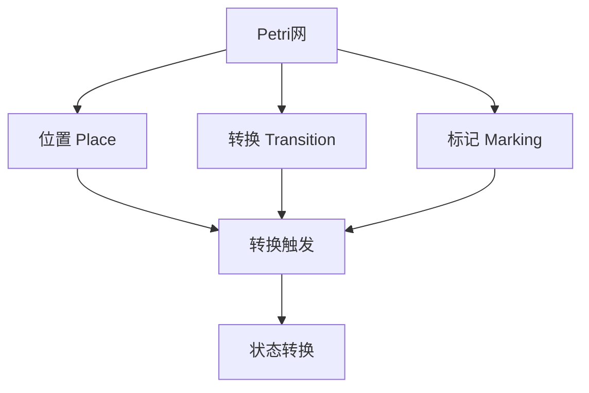
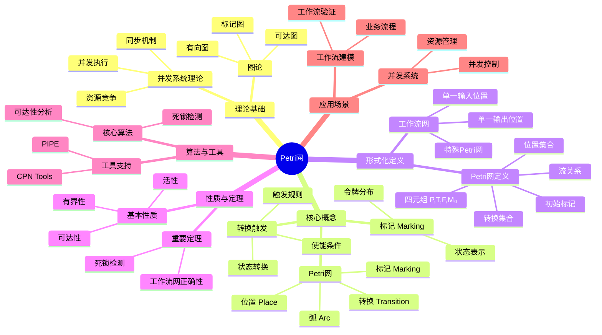
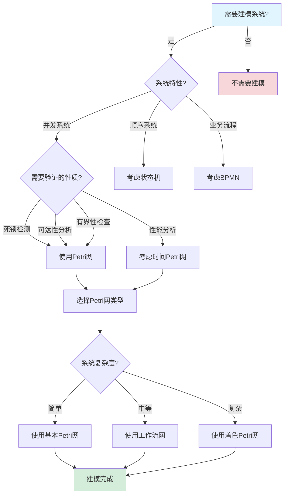
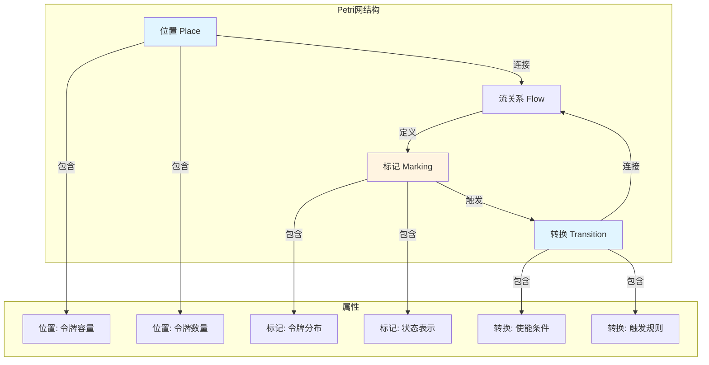
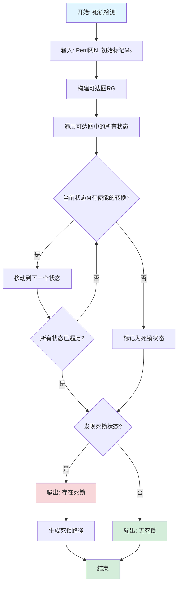

# Petri网专题文档

## 目录

- [Petri网专题文档](#petri网专题文档)
  - [目录](#目录)
  - [一、概述](#一概述)
    - [1.1 Petri网简介](#11-petri网简介)
    - [1.2 核心思想](#12-核心思想)
    - [1.3 应用领域](#13-应用领域)
    - [1.4 在本项目中的应用](#14-在本项目中的应用)
  - [二、历史背景](#二历史背景)
    - [2.1 发展历史](#21-发展历史)
    - [2.2 重要人物](#22-重要人物)
    - [2.3 重要里程碑](#23-重要里程碑)
  - [三、核心概念](#三核心概念)
    - [3.1 基本概念](#31-基本概念)
      - [概念1：Petri网](#概念1petri网)
      - [概念2：标记（Marking）](#概念2标记marking)
      - [概念3：转换触发（Transition Firing）](#概念3转换触发transition-firing)
    - [3.2 概念关系](#32-概念关系)
  - [四、形式化定义](#四形式化定义)
    - [4.1 数学定义](#41-数学定义)
      - [定义1：Petri网](#定义1petri网)
      - [定义2：工作流网（Workflow Net）](#定义2工作流网workflow-net)
    - [4.2 语法定义](#42-语法定义)
      - [Petri网图形表示](#petri网图形表示)
    - [4.3 语义定义](#43-语义定义)
      - [语义1：转换触发语义](#语义1转换触发语义)
  - [五、性质与定理](#五性质与定理)
    - [5.1 基本性质](#51-基本性质)
      - [性质1：有界性（Boundedness）](#性质1有界性boundedness)
      - [性质2：活性（Liveness）](#性质2活性liveness)
    - [5.2 重要定理](#52-重要定理)
      - [定理1：死锁检测](#定理1死锁检测)
      - [定理2：工作流网正确性](#定理2工作流网正确性)
  - [六、算法与工具](#六算法与工具)
    - [6.1 核心算法](#61-核心算法)
      - [算法1：可达性分析](#算法1可达性分析)
      - [算法2：死锁检测](#算法2死锁检测)
    - [6.2 工具支持](#62-工具支持)
      - [工具1：CPN Tools](#工具1cpn-tools)
      - [工具2：PIPE](#工具2pipe)
  - [七、应用场景](#七应用场景)
    - [7.1 适用场景](#71-适用场景)
      - [场景1：工作流建模](#场景1工作流建模)
      - [场景2：并发系统](#场景2并发系统)
    - [7.2 不适用场景](#72-不适用场景)
      - [场景1：实时系统](#场景1实时系统)
      - [场景2：概率系统](#场景2概率系统)
  - [八、实践案例](#八实践案例)
    - [8.1 工业界案例](#81-工业界案例)
      - [案例1：工作流建模](#案例1工作流建模)
    - [8.2 学术界案例](#82-学术界案例)
      - [案例1：并发系统验证](#案例1并发系统验证)
  - [九、学习资源](#九学习资源)
    - [9.1 推荐阅读](#91-推荐阅读)
      - [经典教材](#经典教材)
      - [原始论文](#原始论文)
    - [9.2 学习路径](#92-学习路径)
      - [入门路径（1-2周）](#入门路径1-2周)
  - [十、参考文献](#十参考文献)
    - [10.1 经典文献](#101-经典文献)
      - [原始论文](#原始论文-1)
      - [重要论文](#重要论文)
    - [10.2 在线资源](#102-在线资源)
      - [Wikipedia](#wikipedia)
      - [工具文档](#工具文档)
  - [十一、思维表征](#十一思维表征)
    - [11.1 知识体系思维导图](#111-知识体系思维导图)
    - [11.2 多维知识对比矩阵](#112-多维知识对比矩阵)
      - [矩阵1：Petri网变种对比矩阵](#矩阵1petri网变种对比矩阵)
      - [矩阵2：Petri网 vs 其他建模方法对比矩阵](#矩阵2petri网-vs-其他建模方法对比矩阵)
    - [11.3 论证决策树](#113-论证决策树)
      - [决策树1：何时使用Petri网建模](#决策树1何时使用petri网建模)
    - [11.4 概念属性关系图](#114-概念属性关系图)
    - [11.5 形式化证明流程图](#115-形式化证明流程图)
      - [证明流程图1：死锁检测算法流程图](#证明流程图1死锁检测算法流程图)

---

## 一、概述

### 1.1 Petri网简介

**Petri网（Petri Net）** 是一种用于建模和分析并发系统的图形化数学工具。它由Carl Adam Petri在1962年提出，是并发系统理论的基础。

**来源**：基于Wikipedia [Petri Net](https://en.wikipedia.org/wiki/Petri_net) 和 Petri的原始论文

**核心特点**：

1. **图形化建模**：使用图形表示系统结构
2. **并发建模**：自然表示并发和同步
3. **形式化分析**：支持形式化分析和验证
4. **广泛应用**：应用于多个领域

### 1.2 核心思想

**核心思想1：位置和转换**:

Petri网由位置（Place）和转换（Transition）组成：

- **位置（Place）**：表示资源或状态，用圆圈表示
- **转换（Transition）**：表示事件或动作，用矩形表示
- **弧（Arc）**：连接位置和转换，表示依赖关系
- **标记（Token）**：位置中的标记，表示资源数量

**核心思想2：并发执行**:

Petri网自然表示并发：

- 多个转换可以同时触发（如果满足条件）
- 位置可以包含多个标记
- 支持真正的并发执行

**核心思想3：状态转换**:

Petri网通过标记的移动表示状态转换：

- 转换触发时，消耗输入位置的标记
- 产生输出位置的标记
- 系统的状态由标记分布决定

### 1.3 应用领域

**应用领域1：工作流建模**:

- 业务流程建模
- 工作流验证
- 流程优化

**应用领域2：并发系统**:

- 并发程序建模
- 死锁检测
- 可达性分析

**应用领域3：硬件设计**:

- 电路设计
- 协议验证
- 系统建模

### 1.4 在本项目中的应用

**在本项目中的应用**：

1. **工作流建模**：使用Petri网建模工作流
2. **死锁检测**：使用Petri网检测工作流死锁
3. **可达性分析**：分析工作流状态的可达性
4. **正确性验证**：验证工作流的正确性

**相关文档链接**：

- [形式化验证理论](../03-formal-verification/形式化验证理论.md#五petri网建模与死锁检测)
- [论证完备性增强](../14-argumentation-enhancement/论证完备性增强.md)

---

## 二、历史背景

### 2.1 发展历史

**1962年**：Petri网提出

- **论文**："Kommunikation mit Automaten" by Carl Adam Petri
- **贡献**：提出了Petri网的基本概念

**1970年代**：理论发展

- **扩展**：多种Petri网变种提出
- **应用**：开始应用于实际系统

**1980年代**：工作流网

- **工作流网**：van der Aalst提出工作流网（Workflow Net）
- **应用**：应用于工作流建模和验证

**1990年代至今**：持续发展

- **工具**：多种Petri网工具开发
- **应用**：广泛应用于多个领域

**来源**：Wikipedia [Petri Net](https://en.wikipedia.org/wiki/Petri_net)

### 2.2 重要人物

**Carl Adam Petri（1926-2010）**:

- **身份**：Petri网的创始人
- **背景**：德国数学家，波恩大学教授
- **贡献**：
  - 提出Petri网
  - 在并发系统理论方面做出重要贡献

**来源**：Wikipedia [Carl Adam Petri](https://en.wikipedia.org/wiki/Carl_Adam_Petri)

### 2.3 重要里程碑

| 时间 | 里程碑 | 影响 |
|------|--------|------|
| **1962** | Petri网提出 | 建立并发系统建模基础 |
| **1980** | 工作流网提出 | 应用于工作流领域 |
| **1990** | 工具开发 | 提供实用工具 |
| **2000** | 大规模应用 | 证明Petri网实用性 |

---

## 三、核心概念

### 3.1 基本概念

#### 概念1：Petri网

**定义**：Petri网是一个四元组 $N = (P, T, F, M_0)$，其中：

- $P$ 是位置集合
- $T$ 是转换集合
- $F \subseteq (P \times T) \cup (T \times P)$ 是流关系
- $M_0: P \to \mathbb{N}$ 是初始标记

**来源**：Petri, "Kommunikation mit Automaten" (1962)

#### 概念2：标记（Marking）

**定义**：标记是位置到自然数的映射，表示每个位置的标记数量。

**形式化定义**：

$$ M: P \to \mathbb{N} $$

**来源**：Petri, "Kommunikation mit Automaten" (1962)

#### 概念3：转换触发（Transition Firing）

**定义**：转换 $t$ 在标记 $M$ 下可触发，当且仅当所有输入位置都有足够的标记。

**形式化定义**：

$$ M[t\rangle \iff \forall p \in \bullet t: M(p) \ge W(p, t) $$

其中 $\bullet t$ 是 $t$ 的输入位置集合，$W(p, t)$ 是弧的权重。

**来源**：Petri, "Kommunikation mit Automaten" (1962)

### 3.2 概念关系

**概念关系图**：



---

## 四、形式化定义

### 4.1 数学定义

#### 定义1：Petri网

**定义**：Petri网是一个四元组 $N = (P, T, F, M_0)$，其中：

- $P$ 是有限位置集合
- $T$ 是有限转换集合，$P \cap T = \emptyset$
- $F \subseteq (P \times T) \cup (T \times P)$ 是流关系
- $M_0: P \to \mathbb{N}$ 是初始标记

**来源**：Petri, "Kommunikation mit Automaten" (1962)

#### 定义2：工作流网（Workflow Net）

**定义**：工作流网是Petri网的特殊形式，满足：

1. 有一个输入位置 $i$，$\bullet i = \emptyset$
2. 有一个输出位置 $o$，$o \bullet = \emptyset$
3. 每个节点都在从 $i$ 到 $o$ 的路径上

**来源**：van der Aalst, "The Application of Petri Nets to Workflow Management" (1998)

### 4.2 语法定义

#### Petri网图形表示

**1. 位置（Place）**:

```text
( )  -- 圆圈表示位置
```

**2. 转换（Transition）**:

```text
[ ]  -- 矩形表示转换
```

**3. 标记（Token）**:

```text
(•)  -- 位置中的点表示标记
```

**4. 弧（Arc）**:

```text
( ) --> [ ]  -- 箭头表示弧
```

### 4.3 语义定义

#### 语义1：转换触发语义

**定义**：转换 $t$ 在标记 $M$ 下触发，产生新标记 $M'$：

$$ M'(p) = M(p) - W(p, t) + W(t, p) $$

其中 $W(p, t)$ 是从位置 $p$ 到转换 $t$ 的弧权重，$W(t, p)$ 是从转换 $t$ 到位置 $p$ 的弧权重。

**来源**：Petri, "Kommunikation mit Automaten" (1962)

---

## 五、性质与定理

### 5.1 基本性质

#### 性质1：有界性（Boundedness）

**表述**：Petri网是有界的，当且仅当所有位置的标记数量都有上界。

**形式化表述**：

$$ \exists k \in \mathbb{N}: \forall M \in R(M_0), \forall p \in P: M(p) \le k $$

**来源**：相关Petri网理论

#### 性质2：活性（Liveness）

**表述**：转换 $t$ 是活的，当且仅当从任意可达标记，都存在一条路径使得 $t$ 可以触发。

**形式化表述**：

$$ \forall M \in R(M_0): \exists M' \in R(M): M'[t\rangle $$

**来源**：相关Petri网理论

### 5.2 重要定理

#### 定理1：死锁检测

**表述**：Petri网存在死锁，当且仅当存在一个标记，使得所有转换都不可触发。

**形式化表述**：

$$ \exists M \in R(M_0): \forall t \in T: \neg M[t\rangle $$

**来源**：相关Petri网理论

#### 定理2：工作流网正确性

**表述**：工作流网是正确的，当且仅当它是安全的（sound）。

**形式化表述**：

工作流网 $N$ 是安全的，当且仅当：

1. **正确终止**：从初始标记，最终可以到达只包含输出位置标记的标记
2. **无死锁**：不存在死锁状态
3. **无多余标记**：正确终止时，所有位置（除输出位置）都没有标记

**来源**：van der Aalst, "The Application of Petri Nets to Workflow Management" (1998)

---

## 六、算法与工具

### 6.1 核心算法

#### 算法1：可达性分析

**描述**：分析Petri网的所有可达标记。

**算法步骤**：

```algorithm
ReachabilityAnalysis(N, M_0):
输入：Petri网 N = (P, T, F, M_0)，初始标记 M_0
输出：可达标记集合 R(M_0)

1. R ← {M_0}
2. WorkList ← {M_0}
3. while WorkList ≠ ∅:
   a. M ← WorkList.pop()
   b. for each t ∈ T such that M[t⟩:
      M' ← fire(M, t)
      if M' ∉ R:
         R ← R ∪ {M'}
         WorkList ← WorkList ∪ {M'}
4. return R
```

**复杂度分析**：

- **时间复杂度**：$O(|R(M_0)| \times |T|)$
- **空间复杂度**：$O(|R(M_0)|)$

**来源**：相关Petri网算法

#### 算法2：死锁检测

**描述**：检测Petri网是否存在死锁。

**算法步骤**：

```algorithm
DeadlockDetection(N, M_0):
输入：Petri网 N = (P, T, F, M_0)
输出：是否存在死锁

1. R ← ReachabilityAnalysis(N, M_0)
2. for each M ∈ R:
   if ∀t ∈ T: ¬M[t⟩:
      return true  -- 发现死锁
3. return false  -- 无死锁
```

**复杂度分析**：

- **时间复杂度**：$O(|R(M_0)| \times |T|)$
- **空间复杂度**：$O(|R(M_0)|)$

**来源**：相关Petri网算法

### 6.2 工具支持

#### 工具1：CPN Tools

**介绍**：CPN Tools是彩色Petri网的工具。

**功能**：

- Petri网建模
- 仿真
- 状态空间分析

**来源**：CPN Tools文档

#### 工具2：PIPE

**介绍**：PIPE是Petri网建模和分析工具。

**功能**：

- Petri网建模
- 可达性分析
- 死锁检测

**来源**：PIPE文档

---

## 七、应用场景

### 7.1 适用场景

#### 场景1：工作流建模

**描述**：使用Petri网建模和分析工作流。

**优势**：

- 图形化表示，易于理解
- 自然表示并发和同步
- 支持形式化分析和验证

**示例**：业务流程建模、工作流验证

#### 场景2：并发系统

**描述**：使用Petri网建模和分析并发系统。

**优势**：

- 自然表示并发
- 支持死锁检测
- 支持可达性分析

**示例**：并发程序建模、协议验证

### 7.2 不适用场景

#### 场景1：实时系统

**描述**：标准Petri网不适合建模实时约束。

**原因**：

- Petri网不直接支持时间约束
- 实时系统需要使用时间Petri网

#### 场景2：概率系统

**描述**：标准Petri网不适合建模概率性质。

**原因**：

- Petri网是确定性的
- 概率系统需要使用随机Petri网

---

## 八、实践案例

### 8.1 工业界案例

#### 案例1：工作流建模

**背景**：使用Petri网建模和分析业务流程。

**应用**：

- 业务流程建模
- 工作流验证
- 流程优化

**效果**：

- 提高了流程可靠性
- 发现了流程问题
- 优化了流程效率

**来源**：相关工作流案例

### 8.2 学术界案例

#### 案例1：并发系统验证

**背景**：使用Petri网验证并发系统的正确性。

**应用**：

- 死锁检测
- 可达性分析
- 正确性验证

**效果**：

- 提供了系统的形式化证明
- 发现了系统的问题
- 推动了系统验证研究

**来源**：相关学术论文

---

## 九、学习资源

### 9.1 推荐阅读

#### 经典教材

1. **"Petri Nets: An Introduction"**
   - 作者：Wolfgang Reisig
   - 出版社：Springer
   - 出版年份：1985
   - **推荐理由**：Petri网的经典教材

2. **"Workflow Management: Models, Methods, and Systems"**
   - 作者：Wil van der Aalst, Kees van Hee
   - 出版社：MIT Press
   - 出版年份：2004
   - **推荐理由**：工作流网的权威教材

#### 原始论文

1. **"Kommunikation mit Automaten"**
   - 作者：Carl Adam Petri
   - 年份：1962
   - **推荐理由**：Petri网的原始论文

### 9.2 学习路径

#### 入门路径（1-2周）

1. **Week 1**：
   - 阅读"Petri Nets: An Introduction"前几章
   - 理解Petri网基本概念
   - 学习Petri网建模

2. **Week 2**：
   - 学习工作流网
   - 学习死锁检测算法
   - 使用工具进行实践

---

## 十、参考文献

### 10.1 经典文献

#### 原始论文

1. **Petri, C. A. (1962). "Kommunikation mit Automaten"**
   - **重要性**：Petri网的原始论文

#### 重要论文

1. **van der Aalst, W. M. P. (1998). "The Application of Petri Nets to Workflow Management"**
   - 期刊：The Journal of Circuits, Systems and Computers
   - **重要性**：工作流网的原始论文

### 10.2 在线资源

#### Wikipedia

- [Petri Net](https://en.wikipedia.org/wiki/Petri_net)
- [Carl Adam Petri](https://en.wikipedia.org/wiki/Carl_Adam_Petri)
- [Workflow Net](https://en.wikipedia.org/wiki/Workflow_net)

#### 工具文档

- **CPN Tools文档**：CPN Tools官方网站
- **PIPE文档**：PIPE官方网站

---

**文档版本**：1.0

**创建时间**：2024年

**维护者**：项目团队

**最后更新**：2024年

**对标资源**：

- ✅ Wikipedia: [Petri Net](https://en.wikipedia.org/wiki/Petri_net)
- ✅ 经典著作: "Petri Nets: An Introduction" by Reisig (1985)
- ✅ 原始论文: "Kommunikation mit Automaten" by Petri (1962)
- ✅ 工作流网: "Workflow Management" by van der Aalst & van Hee (2004)

---

## 十一、思维表征

### 11.1 知识体系思维导图

**Petri网知识体系思维导图**：



### 11.2 多维知识对比矩阵

#### 矩阵1：Petri网变种对比矩阵

| Petri网类型 | 表达能力 | 复杂度 | 工具支持 | 适用场景 |
|------------|---------|--------|---------|---------|
| **基本Petri网** | ⭐⭐⭐ | 低 | ⭐⭐⭐ | 简单并发系统 |
| **工作流网** | ⭐⭐⭐⭐ | 中 | ⭐⭐⭐⭐ | 工作流建模 |
| **时间Petri网** | ⭐⭐⭐⭐ | 中 | ⭐⭐⭐ | 实时系统 |
| **着色Petri网** | ⭐⭐⭐⭐⭐ | 高 | ⭐⭐⭐⭐ | 复杂系统建模 |

#### 矩阵2：Petri网 vs 其他建模方法对比矩阵

| 建模方法 | 表达能力 | 可视化 | 形式化程度 | 工具支持 | 适用场景 |
|---------|---------|--------|-----------|---------|---------|
| **Petri网** | ⭐⭐⭐⭐ | ⭐⭐⭐⭐⭐ | ⭐⭐⭐⭐ | ⭐⭐⭐ | 并发系统、工作流 |
| **状态机** | ⭐⭐⭐ | ⭐⭐⭐⭐ | ⭐⭐⭐ | ⭐⭐⭐⭐ | 顺序系统 |
| **BPMN** | ⭐⭐⭐⭐ | ⭐⭐⭐⭐⭐ | ⭐⭐ | ⭐⭐⭐⭐ | 业务流程 |
| **UML** | ⭐⭐⭐⭐ | ⭐⭐⭐⭐ | ⭐⭐ | ⭐⭐⭐⭐⭐ | 软件设计 |

### 11.3 论证决策树

#### 决策树1：何时使用Petri网建模



### 11.4 概念属性关系图

**Petri网核心概念属性关系图**：



### 11.5 形式化证明流程图

#### 证明流程图1：死锁检测算法流程图



---

**思维表征说明**：

- **思维导图**：全面展示Petri网的知识体系结构
- **对比矩阵**：从多个维度对比Petri网变种和建模方法
- **决策树**：提供清晰的决策路径，帮助选择合适的建模方法
- **关系图**：详细展示概念、属性、关系之间的网络
- **证明流程图**：可视化死锁检测算法的执行流程

**来源**：基于Petri网理论、Reisig的著作和实际应用经验
