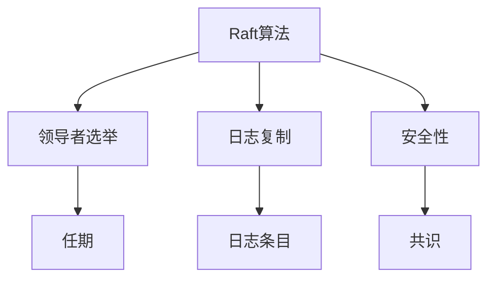
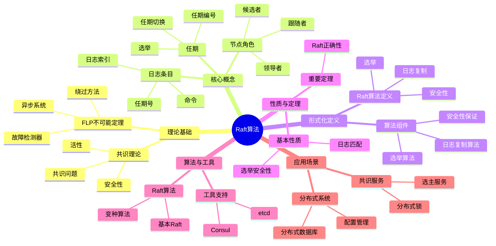
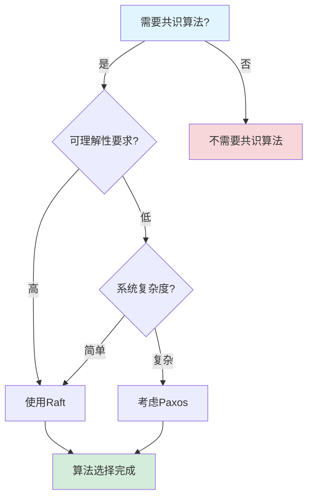
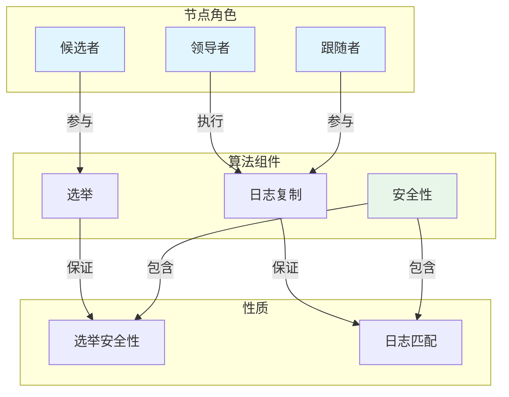
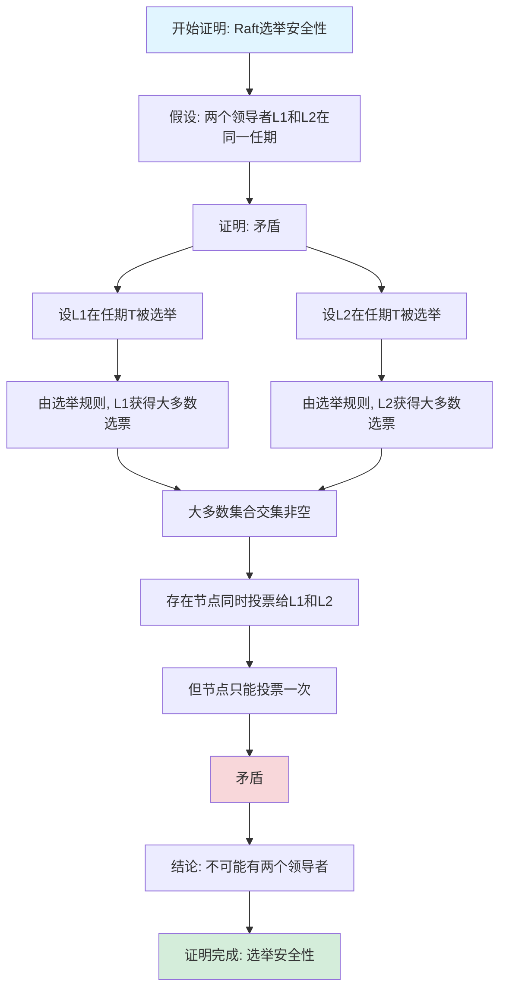

# Raft算法专题文档

## 目录

- [Raft算法专题文档](#raft算法专题文档)
  - [目录](#目录)
  - [一、概述](#一概述)
    - [1.1 Raft算法简介](#11-raft算法简介)
    - [1.2 核心思想](#12-核心思想)
    - [1.3 应用领域](#13-应用领域)
    - [1.4 在本项目中的应用](#14-在本项目中的应用)
  - [二、历史背景](#二历史背景)
    - [2.1 发展历史](#21-发展历史)
    - [2.2 重要人物](#22-重要人物)
    - [2.3 重要里程碑](#23-重要里程碑)
  - [三、核心概念](#三核心概念)
    - [3.1 基本概念](#31-基本概念)
      - [概念1：节点角色](#概念1节点角色)
      - [概念2：任期（Term）](#概念2任期term)
      - [概念3：日志条目（Log Entry）](#概念3日志条目log-entry)
    - [3.2 概念关系](#32-概念关系)
  - [四、形式化定义](#四形式化定义)
    - [4.1 数学定义](#41-数学定义)
      - [定义1：Raft算法](#定义1raft算法)
      - [定义2：日志条目](#定义2日志条目)
    - [4.2 算法定义](#42-算法定义)
      - [算法1：Raft算法](#算法1raft算法)
    - [4.3 语义定义](#43-语义定义)
      - [语义1：Raft语义](#语义1raft语义)
  - [五、性质与定理](#五性质与定理)
    - [5.1 基本性质](#51-基本性质)
      - [性质1：选举安全性](#性质1选举安全性)
      - [性质2：日志匹配](#性质2日志匹配)
    - [5.2 重要定理](#52-重要定理)
      - [定理1：Raft正确性](#定理1raft正确性)
  - [六、算法与工具](#六算法与工具)
    - [6.1 Raft算法](#61-raft算法)
      - [算法1：基本Raft算法](#算法1基本raft算法)
    - [6.2 与Paxos的对比](#62-与paxos的对比)
      - [对比1：可理解性](#对比1可理解性)
      - [对比2：性能](#对比2性能)
      - [对比3：应用](#对比3应用)
  - [七、应用场景](#七应用场景)
    - [7.1 适用场景](#71-适用场景)
      - [场景1：分布式系统](#场景1分布式系统)
      - [场景2：分布式数据库](#场景2分布式数据库)
    - [7.2 不适用场景](#72-不适用场景)
      - [场景1：拜占庭故障](#场景1拜占庭故障)
      - [场景2：实时系统](#场景2实时系统)
  - [八、实践案例](#八实践案例)
    - [8.1 工业界案例](#81-工业界案例)
      - [案例1：etcd](#案例1etcd)
      - [案例2：Consul](#案例2consul)
    - [8.2 学术界案例](#82-学术界案例)
      - [案例1：Raft算法理论研究](#案例1raft算法理论研究)
  - [九、学习资源](#九学习资源)
    - [9.1 推荐阅读](#91-推荐阅读)
      - [经典著作](#经典著作)
      - [原始论文](#原始论文)
    - [9.2 学习路径](#92-学习路径)
      - [入门路径（1周）](#入门路径1周)
  - [十、参考文献](#十参考文献)
    - [10.1 经典文献](#101-经典文献)
      - [原始论文](#原始论文-1)
    - [10.2 在线资源](#102-在线资源)
      - [Wikipedia](#wikipedia)
      - [经典著作](#经典著作-1)
      - [工具文档](#工具文档)
  - [十一、思维表征](#十一思维表征)
    - [11.1 知识体系思维导图](#111-知识体系思维导图)
    - [11.2 多维知识对比矩阵](#112-多维知识对比矩阵)
      - [矩阵1：Raft vs Paxos对比矩阵](#矩阵1raft-vs-paxos对比矩阵)
      - [矩阵2：Raft实现对比矩阵](#矩阵2raft实现对比矩阵)
    - [11.3 论证决策树](#113-论证决策树)
      - [决策树1：Raft vs Paxos选择决策树](#决策树1raft-vs-paxos选择决策树)
    - [11.4 概念属性关系图](#114-概念属性关系图)
    - [11.5 形式化证明流程图](#115-形式化证明流程图)
      - [证明流程图1：Raft选举安全性证明](#证明流程图1raft选举安全性证明)

---

## 一、概述

### 1.1 Raft算法简介

**Raft算法** 是一种用于在分布式系统中达成共识的算法。它由Diego Ongaro和John Ousterhout在2014年提出，旨在提供比Paxos更容易理解和实现的共识算法。

**来源**：基于Wikipedia [Raft](https://en.wikipedia.org/wiki/Raft_(algorithm)) 和Ongaro & Ousterhout的原始论文

**核心特点**：

1. **易于理解**：比Paxos更容易理解
2. **共识算法**：用于在分布式系统中达成共识
3. **容错性**：可以容忍节点故障
4. **广泛应用**：广泛应用于分布式系统

### 1.2 核心思想

**核心思想1：领导者选举**

Raft算法使用领导者选举：

- **领导者（Leader）**：处理所有客户端请求
- **跟随者（Follower）**：被动接收领导者更新
- **候选者（Candidate）**：参与选举

**核心思想2：日志复制**

Raft算法使用日志复制：

- **日志条目**：所有操作记录在日志中
- **复制**：领导者将日志复制到跟随者
- **提交**：大多数节点确认后提交

**核心思想3：安全性保证**

Raft算法保证安全性：

- **安全性**：所有节点决定相同的值
- **活性**：只要大多数节点可用，系统就能继续工作

### 1.3 应用领域

**应用领域1：分布式系统**

- 状态复制
- 配置管理
- 分布式锁

**应用领域2：分布式数据库**

- 数据复制
- 一致性保证
- 故障恢复

**应用领域3：分布式存储**

- 元数据管理
- 配置同步
- 状态管理

### 1.4 在本项目中的应用

**在本项目中的应用**：

1. **Temporal的状态复制**：Temporal可以使用Raft算法进行状态复制
2. **系统设计指导**：理解共识算法的重要性
3. **容错机制**：设计容错机制

**相关文档链接**：

- [论证完备性增强](../14-argumentation-enhancement/论证完备性增强.md)

---

## 二、历史背景

### 2.1 发展历史

**2014年**：Raft算法提出

- **论文**："In Search of an Understandable Consensus Algorithm" by Diego Ongaro and John Ousterhout
- **会议**：USENIX Annual Technical Conference
- **贡献**：提出了Raft算法

**2010年代**：算法发展

- **应用**：广泛应用于分布式系统
- **实现**：多种Raft实现
- **优化**：优化算法性能

**2020年代至今**：持续发展

- **新应用**：扩展到更多领域
- **工具改进**：改进实现工具

**来源**：Wikipedia [Raft](https://en.wikipedia.org/wiki/Raft_(algorithm)) 和Ongaro & Ousterhout的论文

### 2.2 重要人物

**Diego Ongaro**

- **身份**：Raft算法的共同提出者
- **背景**：美国计算机科学家
- **贡献**：
  - 与Ousterhout共同提出Raft算法
  - 在共识算法方面做出重要贡献

**John Ousterhout**

- **身份**：Raft算法的共同提出者
- **背景**：美国计算机科学家，斯坦福大学教授
- **贡献**：
  - 与Ongaro共同提出Raft算法
  - 在分布式系统方面做出重要贡献

**来源**：Wikipedia和相关论文

### 2.3 重要里程碑

| 时间 | 里程碑 | 影响 |
|------|--------|------|
| **2014** | Raft算法提出 | 提供更易理解的共识算法 |
| **2015** | 大规模应用 | 证明Raft实用性 |

---

## 三、核心概念

### 3.1 基本概念

#### 概念1：节点角色

**定义**：Raft算法中的节点有三种角色：

- **领导者（Leader）**：处理所有客户端请求
- **跟随者（Follower）**：被动接收领导者更新
- **候选者（Candidate）**：参与选举

**来源**：Ongaro & Ousterhout, "In Search of an Understandable Consensus Algorithm" (2014)

#### 概念2：任期（Term）

**定义**：任期是Raft算法中的逻辑时间单位。

**特点**：

- **单调递增**：任期号单调递增
- **选举标识**：每次选举开始新的任期
- **一致性**：所有节点维护当前任期

**来源**：Ongaro & Ousterhout, "In Search of an Understandable Consensus Algorithm" (2014)

#### 概念3：日志条目（Log Entry）

**定义**：日志条目是Raft算法中的基本操作单位。

**结构**：

- **索引**：日志条目的位置
- **任期**：创建日志条目的任期
- **命令**：要执行的操作

**来源**：Ongaro & Ousterhout, "In Search of an Understandable Consensus Algorithm" (2014)

### 3.2 概念关系

**概念关系图**：

---

## 四、形式化定义

### 4.1 数学定义

#### 定义1：Raft算法

**定义**：Raft算法是一个四元组 $R = (N, T, L, S)$，其中：

- $N$ 是节点集合
- $T$ 是任期集合
- $L$ 是日志集合
- $S$ 是状态集合

**来源**：Ongaro & Ousterhout, "In Search of an Understandable Consensus Algorithm" (2014)

#### 定义2：日志条目

**定义**：日志条目是一个三元组 $e = (index, term, command)$，其中：

- $index$ 是日志索引
- $term$ 是任期号
- $command$ 是命令

**来源**：Ongaro & Ousterhout, "In Search of an Understandable Consensus Algorithm" (2014)

### 4.2 算法定义

#### 算法1：Raft算法

**描述**：Raft算法包含三个主要部分：领导者选举、日志复制、安全性。

**算法部分**：

**1. 领导者选举（Leader Election）**

1. 节点超时后成为候选者
2. 候选者增加任期号并请求投票
3. 如果获得大多数投票，成为领导者
4. 领导者定期发送心跳

**2. 日志复制（Log Replication）**

1. 领导者接收客户端请求
2. 领导者将日志条目追加到本地日志
3. 领导者并行发送日志条目到所有跟随者
4. 大多数节点确认后，领导者提交日志条目
5. 领导者通知跟随者提交

**3. 安全性（Safety）**

1. 选举安全性：每个任期最多一个领导者
2. 日志匹配：如果两个日志条目有相同的索引和任期，则它们相同
3. 领导者完整性：已提交的日志条目在所有更高任期的领导者中

**来源**：Ongaro & Ousterhout, "In Search of an Understandable Consensus Algorithm" (2014)

### 4.3 语义定义

#### 语义1：Raft语义

**定义**：Raft算法的语义是就一系列值达成共识。

**形式化定义**：

$$ \text{Raft}(v_1, v_2, ..., v_n) \iff \text{Agreement}(v_1, v_2, ..., v_n) \land \text{Validity}() \land \text{Termination}() $$

**来源**：Ongaro & Ousterhout, "In Search of an Understandable Consensus Algorithm" (2014)

---

## 五、性质与定理

### 5.1 基本性质

#### 性质1：选举安全性

**表述**：每个任期最多一个领导者。

**形式化表述**：

$$ \forall t \in T: |\{l: \text{Leader}(l, t)\}| \le 1 $$

**来源**：Ongaro & Ousterhout, "In Search of an Understandable Consensus Algorithm" (2014)

#### 性质2：日志匹配

**表述**：如果两个日志条目有相同的索引和任期，则它们相同。

**形式化表述**：

$$ \forall e_1, e_2: (e_1.index = e_2.index \land e_1.term = e_2.term) \implies e_1 = e_2 $$

**来源**：Ongaro & Ousterhout, "In Search of an Understandable Consensus Algorithm" (2014)

### 5.2 重要定理

#### 定理1：Raft正确性

**表述**：Raft算法保证安全性和活性。

**证明**：由Ongaro & Ousterhout的证明可得。

**来源**：Ongaro & Ousterhout, "In Search of an Understandable Consensus Algorithm" (2014)

---

## 六、算法与工具

### 6.1 Raft算法

#### 算法1：基本Raft算法

**描述**：基本Raft算法包含领导者选举、日志复制、安全性。

**算法步骤**：见"四、形式化定义"中的算法1。

**复杂度分析**：

- **消息复杂度**：$O(n)$ 每个请求
- **时间复杂度**：$O(1)$ 在正常情况

**来源**：Ongaro & Ousterhout, "In Search of an Understandable Consensus Algorithm" (2014)

### 6.2 与Paxos的对比

#### 对比1：可理解性

**Raft**：

- **优点**：更容易理解
- **原因**：分离了领导者选举和日志复制

**Paxos**：

- **缺点**：更难理解
- **原因**：算法描述复杂

#### 对比2：性能

**Raft**：

- **性能**：与Paxos相当
- **优化**：可以通过优化提高性能

**Paxos**：

- **性能**：性能良好
- **优化**：有多种优化方法

#### 对比3：应用

**Raft**：

- **应用**：etcd、Consul、CockroachDB

**Paxos**：

- **应用**：Chubby、ZooKeeper

---

## 七、应用场景

### 7.1 适用场景

#### 场景1：分布式系统

**描述**：Raft算法非常适合分布式系统中的共识问题。

**优势**：

- 更容易理解
- 可以容忍节点故障
- 保证安全性

**示例**：etcd、Consul、CockroachDB

#### 场景2：分布式数据库

**描述**：Raft算法可以用于分布式数据库的状态复制。

**优势**：

- 保证数据一致性
- 可以容忍节点故障
- 提高系统可靠性

**示例**：CockroachDB、TiDB

### 7.2 不适用场景

#### 场景1：拜占庭故障

**描述**：Raft算法不适用于拜占庭故障。

**原因**：

- Raft假设崩溃故障
- 拜占庭故障需要不同的算法

#### 场景2：实时系统

**描述**：Raft算法不适用于实时系统。

**原因**：

- Raft不保证实时性
- 实时系统需要不同的算法

---

## 八、实践案例

### 8.1 工业界案例

#### 案例1：etcd

**背景**：etcd使用Raft算法进行状态复制。

**应用**：

- 配置管理
- 服务发现
- 分布式锁

**效果**：

- 实现了分布式系统协调
- 保证了系统一致性
- 提高了系统可靠性

**来源**：etcd文档

#### 案例2：Consul

**背景**：Consul使用Raft算法进行状态复制。

**应用**：

- 服务发现
- 配置管理
- 健康检查

**效果**：

- 实现了分布式系统协调
- 保证了系统一致性
- 提高了系统可靠性

**来源**：Consul文档

### 8.2 学术界案例

#### 案例1：Raft算法理论研究

**背景**：Ongaro & Ousterhout进行Raft算法理论研究。

**贡献**：

- 建立了Raft算法理论
- 提供了算法证明
- 推动了共识算法研究

**来源**：Ongaro & Ousterhout的原始论文

---

## 九、学习资源

### 9.1 推荐阅读

#### 经典著作

1. **"Designing Data-Intensive Applications"**
   - 作者：Martin Kleppmann
   - 出版社：O'Reilly Media
   - 出版年份：2017
   - **推荐理由**：包含Raft算法的详细讲解

#### 原始论文

1. **"In Search of an Understandable Consensus Algorithm"**
   - 作者：Diego Ongaro, John Ousterhout
   - 会议：USENIX Annual Technical Conference
   - 年份：2014
   - **推荐理由**：Raft算法的原始论文

### 9.2 学习路径

#### 入门路径（1周）

1. **Day 1-2**：
   - 阅读Raft算法的原始论文
   - 理解Raft算法的基本概念
   - 理解领导者选举和日志复制

2. **Day 3-5**：
   - 学习Raft算法的安全性
   - 理解与Paxos的对比
   - 完成实际案例分析

---

## 十、参考文献

### 10.1 经典文献

#### 原始论文

1. **Ongaro, D., & Ousterhout, J. (2014). "In Search of an Understandable Consensus Algorithm"**
   - 会议：USENIX Annual Technical Conference
   - **重要性**：Raft算法的原始论文

### 10.2 在线资源

#### Wikipedia

- [Raft](https://en.wikipedia.org/wiki/Raft_(algorithm))

#### 经典著作

- **"Designing Data-Intensive Applications"** by Martin Kleppmann (2017)

#### 工具文档

- **etcd文档**：etcd官方网站
- **Consul文档**：Consul官方网站

---

**文档版本**：1.0

**创建时间**：2024年

**维护者**：项目团队

**最后更新**：2024年

**对标资源**：

- ✅ Wikipedia: [Raft](https://en.wikipedia.org/wiki/Raft_(algorithm))
- ✅ 经典著作: "Designing Data-Intensive Applications" by Kleppmann (2017)
- ✅ 原始论文: "In Search of an Understandable Consensus Algorithm" by Ongaro & Ousterhout (2014)
- ✅ 大学课程: MIT 6.824, CMU 15-440

---

## 十一、思维表征

### 11.1 知识体系思维导图

**Raft算法知识体系思维导图**：

### 11.2 多维知识对比矩阵

#### 矩阵1：Raft vs Paxos对比矩阵

| 特性 | Raft | Paxos |
|------|------|-------|
| **可理解性** | ⭐⭐⭐⭐⭐ | ⭐⭐ |
| **性能** | ⭐⭐⭐⭐ | ⭐⭐⭐⭐ |
| **容错能力** | $n \ge 2f+1$ | $n \ge 2f+1$ |
| **角色** | 领导者/跟随者 | 提议者/接受者/学习者 |
| **选举** | 明确选举机制 | 隐式选举 |
| **日志复制** | 明确日志复制 | 隐式日志复制 |
| **适用场景** | 一般分布式系统 | 复杂分布式系统 |

#### 矩阵2：Raft实现对比矩阵

| 实现 | 语言 | 性能 | 易用性 | 维护状态 |
|------|------|------|--------|---------|
| **etcd** | Go | ⭐⭐⭐⭐⭐ | ⭐⭐⭐⭐ | ⭐⭐⭐⭐⭐ |
| **Consul** | Go | ⭐⭐⭐⭐ | ⭐⭐⭐⭐⭐ | ⭐⭐⭐⭐⭐ |
| **TiKV** | Rust | ⭐⭐⭐⭐⭐ | ⭐⭐⭐ | ⭐⭐⭐⭐ |

### 11.3 论证决策树

#### 决策树1：Raft vs Paxos选择决策树

### 11.4 概念属性关系图

**Raft算法核心概念属性关系图**：

### 11.5 形式化证明流程图

#### 证明流程图1：Raft选举安全性证明

---

**思维表征说明**：

- **思维导图**：全面展示Raft算法的知识体系结构
- **对比矩阵**：从多个维度对比Raft和Paxos以及Raft实现
- **决策树**：提供清晰的决策路径，帮助选择合适的共识算法
- **关系图**：详细展示Raft节点角色、算法组件和性质之间的关系
- **证明流程图**：可视化Raft选举安全性证明的步骤和逻辑

**来源**：基于Raft算法理论、Ongaro & Ousterhout的著作和实际应用经验
