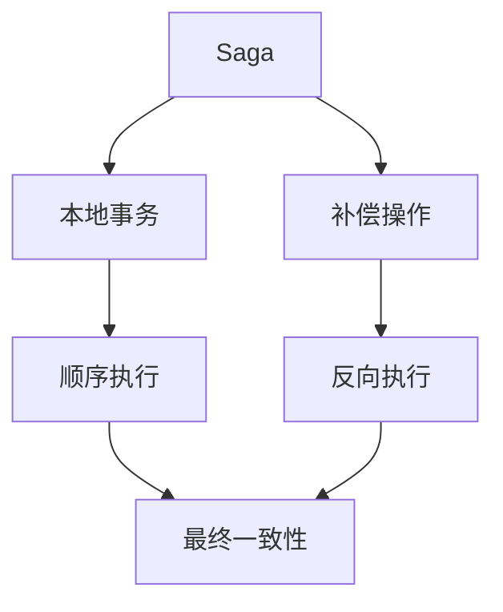
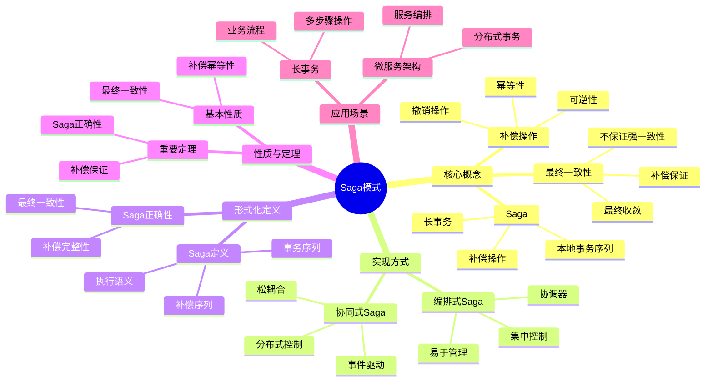
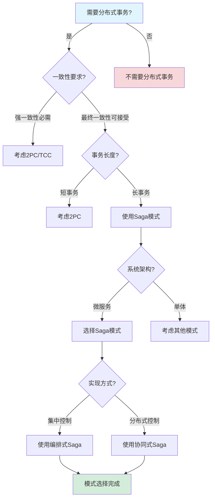
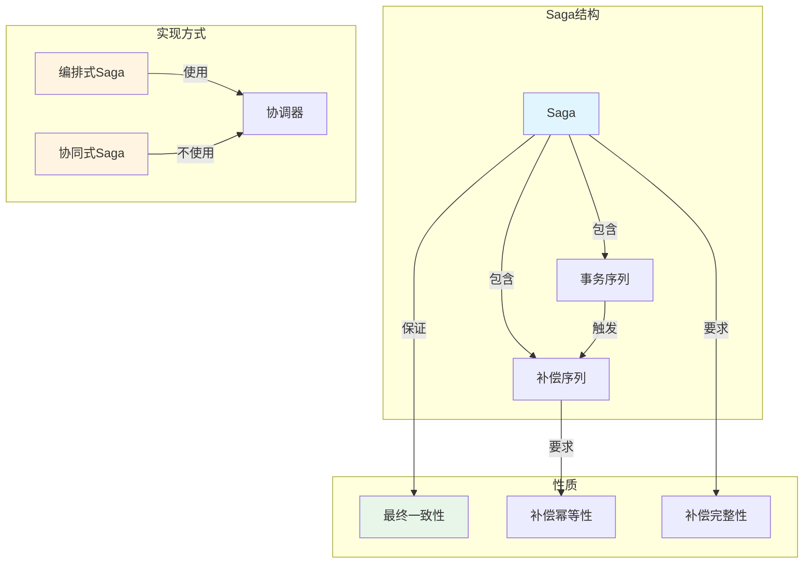
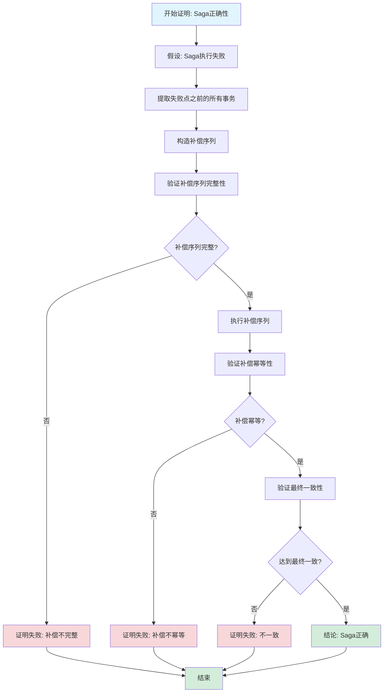

# Saga模式专题文档

## 目录

- [Saga模式专题文档](#saga模式专题文档)
  - [目录](#目录)
  - [一、概述](#一概述)
    - [1.1 Saga模式简介](#11-saga模式简介)
    - [1.2 核心思想](#12-核心思想)
    - [1.3 应用领域](#13-应用领域)
    - [1.4 在本项目中的应用](#14-在本项目中的应用)
  - [二、历史背景](#二历史背景)
    - [2.1 发展历史](#21-发展历史)
    - [2.2 重要人物](#22-重要人物)
    - [2.3 重要里程碑](#23-重要里程碑)
  - [三、核心概念](#三核心概念)
    - [3.1 基本概念](#31-基本概念)
      - [概念1：Saga](#概念1saga)
      - [概念2：补偿操作（Compensation）](#概念2补偿操作compensation)
      - [概念3：最终一致性（Eventual Consistency）](#概念3最终一致性eventual-consistency)
    - [3.2 概念关系](#32-概念关系)
  - [四、形式化定义](#四形式化定义)
    - [4.1 数学定义](#41-数学定义)
      - [定义1：Saga](#定义1saga)
      - [定义2：Saga执行](#定义2saga执行)
    - [4.2 模式定义](#42-模式定义)
      - [模式1：编排式Saga（Orchestration）](#模式1编排式sagaorchestration)
      - [模式2：协同式Saga（Choreography）](#模式2协同式sagachoreography)
    - [4.3 语义定义](#43-语义定义)
      - [语义1：Saga执行语义](#语义1saga执行语义)
  - [五、性质与定理](#五性质与定理)
    - [5.1 基本性质](#51-基本性质)
      - [性质1：补偿幂等性](#性质1补偿幂等性)
      - [性质2：最终一致性](#性质2最终一致性)
    - [5.2 重要定理](#52-重要定理)
      - [定理1：Saga正确性](#定理1saga正确性)
  - [六、实现方式](#六实现方式)
    - [6.1 编排式Saga（Orchestration）](#61-编排式sagaorchestration)
      - [6.1.1 架构](#611-架构)
      - [6.1.2 实现示例](#612-实现示例)
    - [6.2 协同式Saga（Choreography）](#62-协同式sagachoreography)
      - [6.2.1 架构](#621-架构)
      - [6.2.2 实现示例](#622-实现示例)
  - [七、应用场景](#七应用场景)
    - [7.1 适用场景](#71-适用场景)
      - [场景1：微服务架构](#场景1微服务架构)
      - [场景2：长事务](#场景2长事务)
    - [7.2 不适用场景](#72-不适用场景)
      - [场景1：强一致性要求](#场景1强一致性要求)
      - [场景2：简单事务](#场景2简单事务)
  - [八、实践案例](#八实践案例)
    - [8.1 工业界案例](#81-工业界案例)
      - [案例1：Temporal的Saga支持](#案例1temporal的saga支持)
      - [案例2：微服务架构](#案例2微服务架构)
    - [8.2 学术界案例](#82-学术界案例)
      - [案例1：Saga模式理论研究](#案例1saga模式理论研究)
  - [九、学习资源](#九学习资源)
    - [9.1 推荐阅读](#91-推荐阅读)
      - [经典著作](#经典著作)
      - [原始论文](#原始论文)
    - [9.2 学习路径](#92-学习路径)
      - [入门路径（1周）](#入门路径1周)
  - [十、参考文献](#十参考文献)
    - [10.1 经典文献](#101-经典文献)
      - [原始论文](#原始论文-1)
      - [重要论文](#重要论文)
    - [10.2 在线资源](#102-在线资源)
      - [Wikipedia](#wikipedia)
      - [工具文档](#工具文档)
  - [十一、思维表征](#十一思维表征)
    - [11.1 知识体系思维导图](#111-知识体系思维导图)
    - [11.2 多维知识对比矩阵](#112-多维知识对比矩阵)
      - [矩阵1：分布式事务模式对比矩阵](#矩阵1分布式事务模式对比矩阵)
      - [矩阵2：Saga实现方式对比矩阵](#矩阵2saga实现方式对比矩阵)
    - [11.3 论证决策树](#113-论证决策树)
      - [决策树1：分布式事务模式选择决策树](#决策树1分布式事务模式选择决策树)
    - [11.4 概念属性关系图](#114-概念属性关系图)
    - [11.5 形式化证明流程图](#115-形式化证明流程图)
      - [证明流程图1：Saga正确性证明步骤](#证明流程图1saga正确性证明步骤)

---

## 一、概述

### 1.1 Saga模式简介

**Saga模式（Saga Pattern）** 是一种用于管理分布式长事务的设计模式。它由Hector Garcia-Molina和Kenneth Salem在1987年提出，通过将长事务分解为一系列本地事务，并使用补偿操作来处理故障，从而在分布式系统中实现最终一致性。

**来源**：基于Garcia-Molina & Salem的原始论文和相关理论

**核心特点**：

1. **长事务管理**：管理跨多个服务的长时间运行事务
2. **补偿机制**：使用补偿操作处理故障
3. **最终一致性**：保证最终一致性而非强一致性
4. **广泛应用**：广泛应用于微服务架构

### 1.2 核心思想

**核心思想1：事务分解**

Saga模式将长事务分解为一系列本地事务：

- **本地事务**：每个服务执行本地事务
- **顺序执行**：按照定义的顺序执行
- **补偿操作**：每个本地事务都有对应的补偿操作

**核心思想2：补偿机制**

Saga模式使用补偿操作处理故障：

- **补偿操作**：撤销已完成的本地事务
- **反向执行**：按照相反顺序执行补偿操作
- **最终一致性**：保证最终状态的一致性

**核心思想3：最终一致性**

Saga模式保证最终一致性而非强一致性：

- **暂时不一致**：执行过程中可能暂时不一致
- **最终一致**：最终所有服务会达到一致状态
- **性能优势**：比强一致性性能更好

### 1.3 应用领域

**应用领域1：微服务架构**

- 分布式事务管理
- 服务间协调
- 故障处理

**应用领域2：分布式系统**

- 长事务管理
- 最终一致性
- 系统可靠性

**应用领域3：电子商务**

- 订单处理
- 支付处理
- 库存管理

### 1.4 在本项目中的应用

**在本项目中的应用**：

1. **Temporal的Saga支持**：Temporal支持Saga模式实现分布式事务
2. **补偿机制**：使用补偿操作处理故障
3. **最终一致性**：支持最终一致性场景

**相关文档链接**：

- [形式化验证理论](../03-formal-verification/形式化验证理论.md#41-saga模式形式化规约)
- [论证完备性增强](../14-argumentation-enhancement/论证完备性增强.md)

---

## 二、历史背景

### 2.1 发展历史

**1987年**：Saga模式提出

- **论文**："Sagas" by Hector Garcia-Molina and Kenneth Salem
- **会议**：ACM SIGMOD Conference
- **贡献**：提出了Saga模式的概念和补偿机制

**2000年代**：微服务架构

- **应用**：Saga模式在微服务架构中得到广泛应用
- **扩展**：提出编排式和协同式Saga

**2010年代至今**：持续发展

- **工具**：开发Saga实现工具
- **应用**：广泛应用于分布式系统

**来源**：Garcia-Molina & Salem的原始论文和相关文献

### 2.2 重要人物

**Hector Garcia-Molina**

- **身份**：Saga模式的共同提出者
- **背景**：美国计算机科学家，斯坦福大学教授
- **贡献**：
  - 与Salem共同提出Saga模式
  - 在数据库和分布式系统领域做出重要贡献

**Kenneth Salem**

- **身份**：Saga模式的共同提出者
- **背景**：美国计算机科学家
- **贡献**：
  - 与Garcia-Molina共同提出Saga模式
  - 在数据库领域做出重要贡献

**来源**：相关论文和文献

### 2.3 重要里程碑

| 时间 | 里程碑 | 影响 |
|------|--------|------|
| **1987** | Saga模式提出 | 建立分布式事务管理基础 |
| **2000** | 微服务架构应用 | 广泛应用Saga模式 |
| **2010** | 工具开发 | 提供实用工具 |

---

## 三、核心概念

### 3.1 基本概念

#### 概念1：Saga

**定义**：Saga是一个长事务，由一系列本地事务组成，每个本地事务都有对应的补偿操作。

**形式化定义**：

$$ \text{Saga} = (T_1, T_2, ..., T_n, C_1, C_2, ..., C_n) $$

其中：

- $T_i$ 是第 $i$ 个本地事务
- $C_i$ 是 $T_i$ 的补偿操作

**来源**：Garcia-Molina & Salem, "Sagas" (1987)

#### 概念2：补偿操作（Compensation）

**定义**：补偿操作是用于撤销已完成的本地事务的操作。

**形式化定义**：

$$ C_i: \text{Undo}(T_i) $$

**来源**：Garcia-Molina & Salem, "Sagas" (1987)

#### 概念3：最终一致性（Eventual Consistency）

**定义**：Saga模式保证最终一致性，即所有服务最终会达到一致状态。

**形式化定义**：

$$ \lim_{t \to \infty} \text{Consistent}(S) = \text{true} $$

**来源**：相关最终一致性理论

### 3.2 概念关系

**概念关系图**：



---

## 四、形式化定义

### 4.1 数学定义

#### 定义1：Saga

**定义**：Saga是一个三元组 $S = (T, C, O)$，其中：

- $T = (T_1, T_2, ..., T_n)$ 是本地事务序列
- $C = (C_1, C_2, ..., C_n)$ 是补偿操作序列
- $O$ 是执行顺序

**来源**：Garcia-Molina & Salem, "Sagas" (1987)

#### 定义2：Saga执行

**定义**：Saga的执行是从第一个本地事务开始，依次执行所有本地事务，如果某个事务失败，则反向执行已完成的补偿操作。

**形式化定义**：

$$
\text{Execute}(S) = \begin{cases}
T_1; T_2; ...; T_n & \text{if all succeed} \\
T_1; T_2; ...; T_i; C_i; C_{i-1}; ...; C_1 & \text{if } T_i \text{ fails}
\end{cases}
$$

**来源**：Garcia-Molina & Salem, "Sagas" (1987)

### 4.2 模式定义

#### 模式1：编排式Saga（Orchestration）

**定义**：编排式Saga使用一个中央协调器（Orchestrator）来协调所有本地事务的执行。

**特点**：

- **中央协调器**：有一个中央协调器
- **集中控制**：集中控制执行流程
- **易于理解**：执行流程清晰

**来源**：相关Saga实现模式

#### 模式2：协同式Saga（Choreography）

**定义**：协同式Saga没有中央协调器，各个服务通过事件进行协调。

**特点**：

- **无中央协调器**：没有中央协调器
- **分布式控制**：分布式控制执行流程
- **松耦合**：服务之间松耦合

**来源**：相关Saga实现模式

### 4.3 语义定义

#### 语义1：Saga执行语义

**定义**：Saga的执行语义是顺序执行所有本地事务，如果某个事务失败，则反向执行已完成的补偿操作。

**形式化定义**：

$$ \text{Semantics}(S) = \text{Sequential}(T) \land \text{CompensateOnFailure}(C) $$

**来源**：Garcia-Molina & Salem, "Sagas" (1987)

---

## 五、性质与定理

### 5.1 基本性质

#### 性质1：补偿幂等性

**表述**：补偿操作应该是幂等的。

**形式化表述**：

$$ \forall C_i: C_i(C_i(S)) = C_i(S) $$

**来源**：相关Saga理论

#### 性质2：最终一致性

**表述**：Saga模式保证最终一致性。

**形式化表述**：

$$ \lim_{t \to \infty} \text{Consistent}(S) = \text{true} $$

**来源**：相关最终一致性理论

### 5.2 重要定理

#### 定理1：Saga正确性

**表述**：如果所有补偿操作都是幂等的，则Saga保证最终一致性。

**形式化表述**：

$$ \text{Idempotent}(C) \implies \text{EventualConsistent}(S) $$

**证明思路**：

1. 如果所有事务成功，则系统处于一致状态
2. 如果某个事务失败，补偿操作会撤销已完成的更改
3. 由于补偿操作是幂等的，多次执行不会产生副作用
4. 因此，系统最终会达到一致状态

**来源**：相关Saga理论

---

## 六、实现方式

### 6.1 编排式Saga（Orchestration）

#### 6.1.1 架构

**描述**：编排式Saga使用一个中央协调器来协调所有本地事务的执行。

**架构图**：

```text
Orchestrator
    |
    |---> Service 1 (T1, C1)
    |---> Service 2 (T2, C2)
    |---> Service 3 (T3, C3)
```

**特点**：

- **中央协调器**：有一个中央协调器
- **集中控制**：集中控制执行流程
- **易于理解**：执行流程清晰

#### 6.1.2 实现示例

**Temporal实现**：

```go
func OrderSagaWorkflow(ctx workflow.Context, order Order) error {
    // 1. 创建订单
    err := workflow.ExecuteActivity(ctx, CreateOrder, order).Get(ctx, nil)
    if err != nil {
        return err
    }

    // 2. 扣减库存
    err = workflow.ExecuteActivity(ctx, ReserveInventory, order).Get(ctx, nil)
    if err != nil {
        // 补偿：取消订单
        workflow.ExecuteActivity(ctx, CancelOrder, order).Get(ctx, nil)
        return err
    }

    // 3. 处理支付
    err = workflow.ExecuteActivity(ctx, ProcessPayment, order).Get(ctx, nil)
    if err != nil {
        // 补偿：释放库存，取消订单
        workflow.ExecuteActivity(ctx, ReleaseInventory, order).Get(ctx, nil)
        workflow.ExecuteActivity(ctx, CancelOrder, order).Get(ctx, nil)
        return err
    }

    return nil
}
```

**来源**：Temporal文档和示例

### 6.2 协同式Saga（Choreography）

#### 6.2.1 架构

**描述**：协同式Saga没有中央协调器，各个服务通过事件进行协调。

**架构图**：

```text
Service 1 (T1, C1) <---> Event Bus <---> Service 2 (T2, C2)
                              |
                              |
                        Service 3 (T3, C3)
```

**特点**：

- **无中央协调器**：没有中央协调器
- **分布式控制**：分布式控制执行流程
- **松耦合**：服务之间松耦合

#### 6.2.2 实现示例

**事件驱动实现**：

```go
// Service 1: 订单服务
func CreateOrderHandler(event OrderCreatedEvent) {
    // 创建订单
    order := createOrder(event)

    // 发布事件
    publish(InventoryReservationRequestedEvent{OrderID: order.ID})
}

// Service 2: 库存服务
func ReserveInventoryHandler(event InventoryReservationRequestedEvent) {
    // 扣减库存
    err := reserveInventory(event.OrderID)
    if err != nil {
        publish(InventoryReservationFailedEvent{OrderID: event.OrderID})
    } else {
        publish(InventoryReservedEvent{OrderID: event.OrderID})
    }
}
```

**来源**：相关事件驱动架构示例

---

## 七、应用场景

### 7.1 适用场景

#### 场景1：微服务架构

**描述**：Saga模式非常适合微服务架构中的分布式事务管理。

**优势**：

- 管理跨服务的长时间运行事务
- 使用补偿操作处理故障
- 保证最终一致性

**示例**：订单处理、支付处理、库存管理

#### 场景2：长事务

**描述**：Saga模式适合管理长时间运行的事务。

**优势**：

- 避免长时间锁定资源
- 提高系统可用性
- 支持最终一致性

**示例**：工作流处理、批处理任务

### 7.2 不适用场景

#### 场景1：强一致性要求

**描述**：Saga模式不适用于需要强一致性的场景。

**原因**：

- Saga模式只保证最终一致性
- 强一致性需要使用两阶段提交（2PC）

#### 场景2：简单事务

**描述**：Saga模式不适用于简单的短事务。

**原因**：

- Saga模式增加了复杂性
- 简单事务可以使用传统ACID事务

---

## 八、实践案例

### 8.1 工业界案例

#### 案例1：Temporal的Saga支持

**背景**：Temporal支持Saga模式实现分布式事务。

**应用**：

- 订单处理
- 支付处理
- 库存管理

**效果**：

- 实现了分布式事务管理
- 保证了最终一致性
- 提高了系统可靠性

**来源**：Temporal文档和案例

#### 案例2：微服务架构

**背景**：许多微服务架构使用Saga模式管理分布式事务。

**应用**：

- 电商系统
- 金融系统
- 物流系统

**效果**：

- 实现了服务间协调
- 保证了最终一致性
- 提高了系统可用性

**来源**：相关微服务架构案例

### 8.2 学术界案例

#### 案例1：Saga模式理论研究

**背景**：Garcia-Molina & Salem进行Saga模式理论研究。

**贡献**：

- 建立了Saga模式理论
- 提供了补偿机制
- 推动了分布式事务研究

**来源**：Garcia-Molina & Salem, "Sagas" (1987)

---

## 九、学习资源

### 9.1 推荐阅读

#### 经典著作

1. **"Microservices Patterns"**
   - 作者：Chris Richardson
   - 出版社：Manning Publications
   - 出版年份：2018
   - **推荐理由**：包含Saga模式的详细讲解

#### 原始论文

1. **"Sagas"**
   - 作者：Hector Garcia-Molina, Kenneth Salem
   - 会议：ACM SIGMOD Conference
   - 年份：1987
   - **推荐理由**：Saga模式的原始论文

### 9.2 学习路径

#### 入门路径（1周）

1. **Day 1-2**：
   - 阅读Saga模式的原始论文
   - 理解Saga模式的基本概念
   - 理解补偿机制

2. **Day 3-5**：
   - 学习编排式和协同式Saga
   - 使用Temporal实现Saga
   - 完成实际案例分析

---

## 十、参考文献

### 10.1 经典文献

#### 原始论文

1. **Garcia-Molina, H., & Salem, K. (1987). "Sagas"**
   - 会议：ACM SIGMOD Conference
   - **重要性**：Saga模式的原始论文

#### 重要论文

2. **Richardson, C. (2018). "Microservices Patterns"**
   - 出版社：Manning Publications
   - **重要性**：包含Saga模式的详细讲解

### 10.2 在线资源

#### Wikipedia

- [Saga Pattern](https://en.wikipedia.org/wiki/Saga_pattern)
- [Distributed Transaction](https://en.wikipedia.org/wiki/Distributed_transaction)

#### 工具文档

- **Temporal文档**：Temporal官方网站
- **相关微服务框架文档**

---

**文档版本**：1.0

**创建时间**：2024年

**维护者**：项目团队

**最后更新**：2024年

**对标资源**：

- ✅ 原始论文: "Sagas" by Garcia-Molina & Salem (1987)
- ✅ 经典著作: "Microservices Patterns" by Richardson (2018)
- ✅ Wikipedia: [Saga Pattern](https://en.wikipedia.org/wiki/Saga_pattern)
- ✅ 实践案例: Temporal文档和示例

---

## 十一、思维表征

### 11.1 知识体系思维导图

**Saga模式知识体系思维导图**：



### 11.2 多维知识对比矩阵

#### 矩阵1：分布式事务模式对比矩阵

| 事务模式 | 一致性 | 性能 | 复杂度 | 适用场景 | 典型系统 |
|---------|--------|------|--------|---------|---------|
| **Saga模式** | ⭐⭐ | ⭐⭐⭐⭐⭐ | ⭐⭐⭐ | 微服务、长事务 | Temporal, AWS Step Functions |
| **2PC** | ⭐⭐⭐⭐⭐ | ⭐⭐ | ⭐⭐⭐⭐ | 强一致性要求 | 传统数据库 |
| **TCC** | ⭐⭐⭐⭐ | ⭐⭐⭐ | ⭐⭐⭐⭐⭐ | 高一致性要求 | 金融系统 |
| **最终一致性** | ⭐⭐ | ⭐⭐⭐⭐⭐ | ⭐⭐ | 高可用性要求 | 分布式系统 |

#### 矩阵2：Saga实现方式对比矩阵

| 实现方式 | 控制方式 | 复杂度 | 可维护性 | 适用场景 |
|---------|---------|--------|---------|---------|
| **编排式Saga** | 集中式 | ⭐⭐⭐ | ⭐⭐⭐⭐⭐ | 复杂业务流程 |
| **协同式Saga** | 分布式 | ⭐⭐⭐⭐ | ⭐⭐⭐ | 松耦合系统 |

### 11.3 论证决策树

#### 决策树1：分布式事务模式选择决策树



### 11.4 概念属性关系图

**Saga模式核心概念属性关系图**：



### 11.5 形式化证明流程图

#### 证明流程图1：Saga正确性证明步骤



---

**思维表征说明**：

- **思维导图**：全面展示Saga模式的知识体系结构
- **对比矩阵**：从多个维度对比分布式事务模式和Saga实现方式
- **决策树**：提供清晰的决策路径，帮助选择合适的分布式事务模式
- **关系图**：详细展示Saga结构、实现方式和性质之间的关系
- **证明流程图**：可视化Saga正确性证明的步骤和逻辑

**来源**：基于Saga模式理论、Garcia-Molina & Salem的著作和实际应用经验
