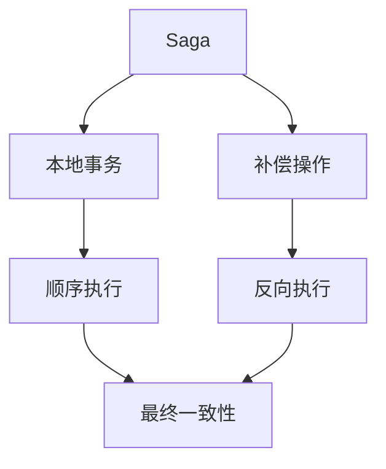
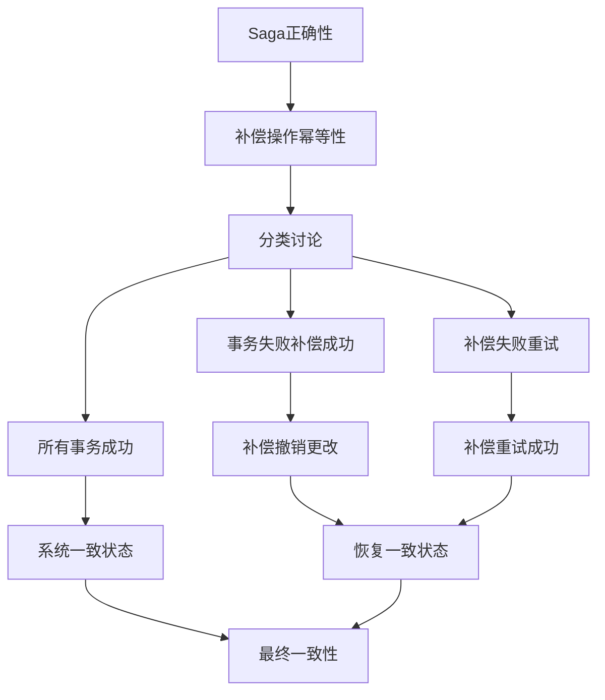
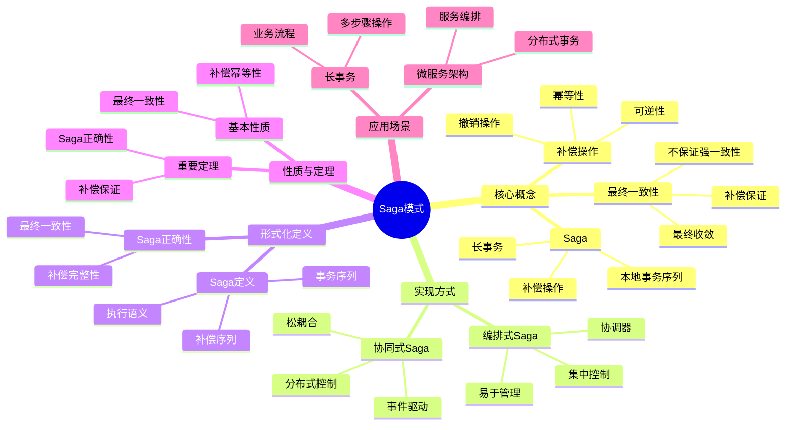
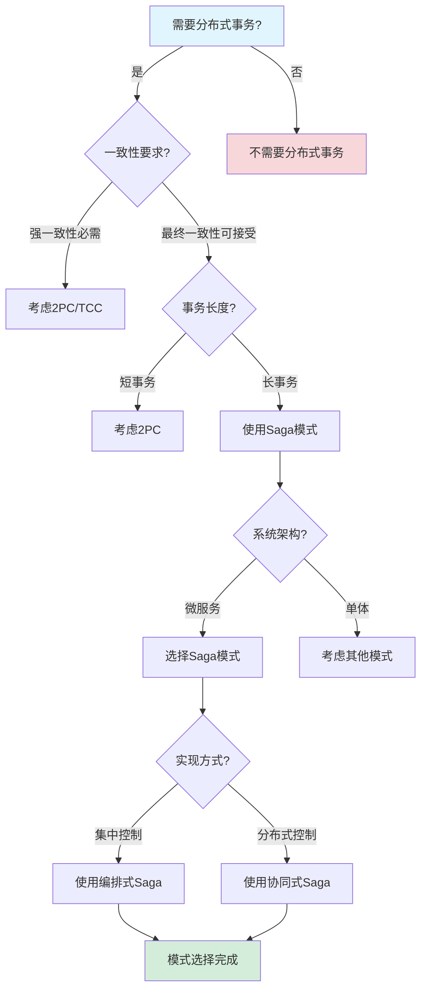
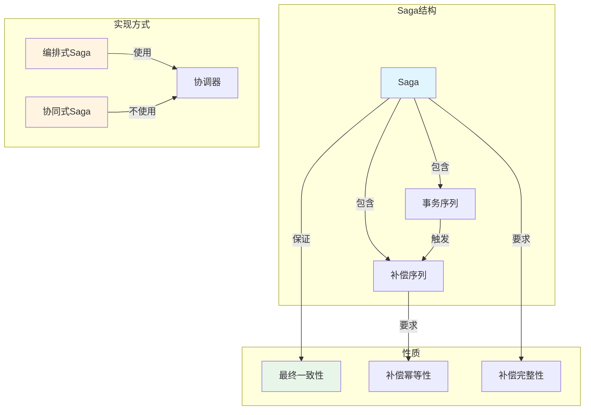
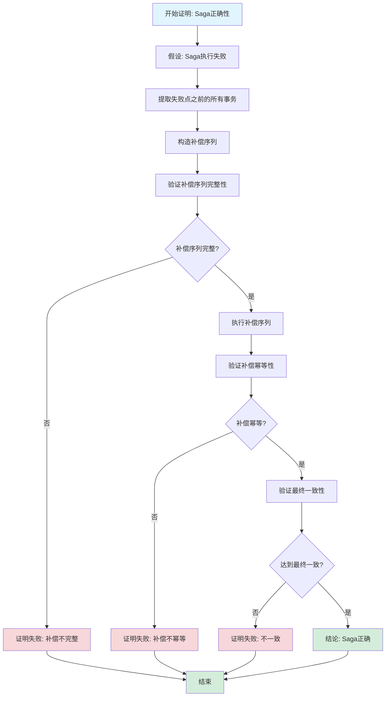

# Saga模式专题文档

## 目录

- [Saga模式专题文档](#saga模式专题文档)
  - [目录](#目录)
  - [一、概述](#一概述)
    - [1.1 Saga模式简介](#11-saga模式简介)
    - [1.2 核心思想](#12-核心思想)
    - [1.3 应用领域](#13-应用领域)
    - [1.4 在本项目中的应用](#14-在本项目中的应用)
  - [二、历史背景](#二历史背景)
    - [2.1 发展历史](#21-发展历史)
    - [2.2 重要人物](#22-重要人物)
    - [2.3 重要里程碑](#23-重要里程碑)
  - [三、核心概念](#三核心概念)
    - [3.1 基本概念](#31-基本概念)
      - [概念1：Saga](#概念1saga)
      - [概念2：补偿操作（Compensation）](#概念2补偿操作compensation)
      - [概念3：最终一致性（Eventual Consistency）](#概念3最终一致性eventual-consistency)
    - [3.2 概念关系](#32-概念关系)
  - [四、形式化定义](#四形式化定义)
    - [4.1 数学定义](#41-数学定义)
      - [定义1：Saga](#定义1saga)
      - [定义2：Saga执行](#定义2saga执行)
    - [4.2 模式定义](#42-模式定义)
      - [模式1：编排式Saga（Orchestration）](#模式1编排式sagaorchestration)
      - [模式2：协同式Saga（Choreography）](#模式2协同式sagachoreography)
    - [4.3 语义定义](#43-语义定义)
      - [语义1：Saga执行语义](#语义1saga执行语义)
  - [五、性质与定理](#五性质与定理)
    - [5.1 基本性质](#51-基本性质)
      - [性质1：补偿幂等性](#性质1补偿幂等性)
      - [性质2：最终一致性](#性质2最终一致性)
    - [5.2 重要定理](#52-重要定理)
      - [定理1：Saga正确性（完整证明）](#定理1saga正确性完整证明)
  - [六、实现方式](#六实现方式)
    - [6.1 编排式Saga（Orchestration）](#61-编排式sagaorchestration)
      - [6.1.1 架构](#611-架构)
      - [6.1.2 实现示例](#612-实现示例)
    - [6.2 协同式Saga（Choreography）](#62-协同式sagachoreography)
      - [6.2.1 架构](#621-架构)
      - [6.2.2 实现示例](#622-实现示例)
    - [6.3 Saga模式实现细节和最佳实践](#63-saga模式实现细节和最佳实践)
      - [6.3.1 补偿操作设计最佳实践](#631-补偿操作设计最佳实践)
      - [6.3.2 Saga协调器实现最佳实践](#632-saga协调器实现最佳实践)
      - [6.3.3 Saga模式与其他分布式事务模式深度对比](#633-saga模式与其他分布式事务模式深度对比)
      - [6.3.4 实际场景应用深度分析](#634-实际场景应用深度分析)
  - [七、应用场景](#七应用场景)
    - [7.1 适用场景](#71-适用场景)
      - [场景1：微服务架构](#场景1微服务架构)
      - [场景2：长事务](#场景2长事务)
    - [7.2 不适用场景](#72-不适用场景)
      - [场景1：强一致性要求](#场景1强一致性要求)
      - [场景2：简单事务](#场景2简单事务)
  - [八、实践案例](#八实践案例)
    - [8.1 工业界案例](#81-工业界案例)
      - [案例1：Coinbase - Temporal的Saga实现](#案例1coinbase---temporal的saga实现)
      - [案例2：Stripe - 微服务架构的Saga实现](#案例2stripe---微服务架构的saga实现)
      - [案例3：Amazon - 订单处理的Saga实现](#案例3amazon---订单处理的saga实现)
    - [8.2 学术界案例](#82-学术界案例)
      - [案例1：Saga模式理论研究](#案例1saga模式理论研究)
  - [九、学习资源](#九学习资源)
    - [9.1 推荐阅读](#91-推荐阅读)
      - [经典著作](#经典著作)
      - [原始论文](#原始论文)
    - [9.2 学习路径](#92-学习路径)
      - [入门路径（1周）](#入门路径1周)
  - [十、参考文献](#十参考文献)
    - [10.1 经典文献](#101-经典文献)
      - [原始论文](#原始论文-1)
      - [重要论文](#重要论文)
    - [10.2 在线资源](#102-在线资源)
      - [Wikipedia](#wikipedia)
      - [工具文档](#工具文档)
  - [十一、思维表征](#十一思维表征)
    - [11.1 知识体系思维导图](#111-知识体系思维导图)
    - [11.2 多维知识对比矩阵](#112-多维知识对比矩阵)
      - [矩阵1：分布式事务模式对比矩阵](#矩阵1分布式事务模式对比矩阵)
      - [矩阵2：Saga实现方式对比矩阵（增强版）](#矩阵2saga实现方式对比矩阵增强版)
      - [矩阵3：Saga补偿算法对比矩阵](#矩阵3saga补偿算法对比矩阵)
      - [矩阵4：Saga模式应用场景对比矩阵（10+场景）](#矩阵4saga模式应用场景对比矩阵10场景)
    - [11.3 论证决策树](#113-论证决策树)
      - [决策树1：分布式事务模式选择决策树](#决策树1分布式事务模式选择决策树)
    - [11.4 概念属性关系图](#114-概念属性关系图)
    - [11.5 形式化证明流程图](#115-形式化证明流程图)
      - [证明流程图1：Saga正确性证明步骤](#证明流程图1saga正确性证明步骤)
  - [十二、代码示例](#十二代码示例)
    - [12.1 编排式Saga实现示例](#121-编排式saga实现示例)
      - [12.1.1 Saga协调器实现](#1211-saga协调器实现)
    - [12.2 协同式Saga实现示例](#122-协同式saga实现示例)
      - [12.2.1 事件驱动的Saga实现](#1221-事件驱动的saga实现)
    - [12.3 Temporal Saga实现示例](#123-temporal-saga实现示例)
      - [12.3.1 Temporal工作流实现Saga模式](#1231-temporal工作流实现saga模式)
  - [十三、相关文档](#十三相关文档)
    - [12.1 核心论证文档](#121-核心论证文档)
    - [12.2 理论模型专题文档](#122-理论模型专题文档)
    - [12.3 相关资源](#123-相关资源)
    - [12.4 文档关联说明](#124-文档关联说明)

---

## 一、概述

### 1.1 Saga模式简介

**Saga模式（Saga Pattern）** 是一种用于管理分布式长事务的设计模式。它由Hector Garcia-Molina和Kenneth Salem在1987年提出，通过将长事务分解为一系列本地事务，并使用补偿操作来处理故障，从而在分布式系统中实现最终一致性。

**来源**：基于Garcia-Molina & Salem的原始论文和相关理论

**核心特点**：

1. **长事务管理**：管理跨多个服务的长时间运行事务
2. **补偿机制**：使用补偿操作处理故障
3. **最终一致性**：保证最终一致性而非强一致性
4. **广泛应用**：广泛应用于微服务架构

### 1.2 核心思想

**核心思想1：事务分解**:

Saga模式将长事务分解为一系列本地事务：

- **本地事务**：每个服务执行本地事务
- **顺序执行**：按照定义的顺序执行
- **补偿操作**：每个本地事务都有对应的补偿操作

**核心思想2：补偿机制**:

Saga模式使用补偿操作处理故障：

- **补偿操作**：撤销已完成的本地事务
- **反向执行**：按照相反顺序执行补偿操作
- **最终一致性**：保证最终状态的一致性

**核心思想3：最终一致性**:

Saga模式保证最终一致性而非强一致性：

- **暂时不一致**：执行过程中可能暂时不一致
- **最终一致**：最终所有服务会达到一致状态
- **性能优势**：比强一致性性能更好

### 1.3 应用领域

**应用领域1：微服务架构**:

- 分布式事务管理
- 服务间协调
- 故障处理

**应用领域2：分布式系统**:

- 长事务管理
- 最终一致性
- 系统可靠性

**应用领域3：电子商务**:

- 订单处理
- 支付处理
- 库存管理

### 1.4 在本项目中的应用

**在本项目中的应用**：

1. **Temporal的Saga支持**：Temporal支持Saga模式实现分布式事务
2. **补偿机制**：使用补偿操作处理故障
3. **最终一致性**：支持最终一致性场景

**相关文档链接**：

- [形式化验证理论](../03-formal-verification/形式化验证理论.md#41-saga模式形式化规约)
- [论证完备性增强](../14-argumentation-enhancement/论证完备性增强.md)

---

## 二、历史背景

### 2.1 发展历史

**1987年**：Saga模式提出

- **论文**："Sagas" by Hector Garcia-Molina and Kenneth Salem
- **会议**：ACM SIGMOD Conference
- **贡献**：提出了Saga模式的概念和补偿机制

**2000年代**：微服务架构

- **应用**：Saga模式在微服务架构中得到广泛应用
- **扩展**：提出编排式和协同式Saga

**2010年代至今**：持续发展

- **工具**：开发Saga实现工具
- **应用**：广泛应用于分布式系统

**来源**：Garcia-Molina & Salem的原始论文和相关文献

### 2.2 重要人物

**Hector Garcia-Molina**:

- **身份**：Saga模式的共同提出者
- **背景**：美国计算机科学家，斯坦福大学教授
- **贡献**：
  - 与Salem共同提出Saga模式
  - 在数据库和分布式系统领域做出重要贡献

**Kenneth Salem**:

- **身份**：Saga模式的共同提出者
- **背景**：美国计算机科学家
- **贡献**：
  - 与Garcia-Molina共同提出Saga模式
  - 在数据库领域做出重要贡献

**来源**：相关论文和文献

### 2.3 重要里程碑

| 时间 | 里程碑 | 影响 |
|------|--------|------|
| **1987** | Saga模式提出 | 建立分布式事务管理基础 |
| **2000** | 微服务架构应用 | 广泛应用Saga模式 |
| **2010** | 工具开发 | 提供实用工具 |

---

## 三、核心概念

### 3.1 基本概念

#### 概念1：Saga

**定义**：Saga是一个长事务，由一系列本地事务组成，每个本地事务都有对应的补偿操作。

**形式化定义**：

$$ \text{Saga} = (T_1, T_2, ..., T_n, C_1, C_2, ..., C_n) $$

其中：

- $T_i$ 是第 $i$ 个本地事务
- $C_i$ 是 $T_i$ 的补偿操作

**来源**：Garcia-Molina & Salem, "Sagas" (1987)

#### 概念2：补偿操作（Compensation）

**定义**：补偿操作是用于撤销已完成的本地事务的操作。

**形式化定义**：

$$ C_i: \text{Undo}(T_i) $$

**来源**：Garcia-Molina & Salem, "Sagas" (1987)

#### 概念3：最终一致性（Eventual Consistency）

**定义**：Saga模式保证最终一致性，即所有服务最终会达到一致状态。

**形式化定义**：

$$ \lim_{t \to \infty} \text{Consistent}(S) = \text{true} $$

**来源**：相关最终一致性理论

### 3.2 概念关系

**概念关系图**：



---

## 四、形式化定义

### 4.1 数学定义

#### 定义1：Saga

**定义**：Saga是一个三元组 $S = (T, C, O)$，其中：

- $T = (T_1, T_2, ..., T_n)$ 是本地事务序列
- $C = (C_1, C_2, ..., C_n)$ 是补偿操作序列
- $O$ 是执行顺序

**来源**：Garcia-Molina & Salem, "Sagas" (1987)

#### 定义2：Saga执行

**定义**：Saga的执行是从第一个本地事务开始，依次执行所有本地事务，如果某个事务失败，则反向执行已完成的补偿操作。

**形式化定义**：

$$
\text{Execute}(S) = \begin{cases}
T_1; T_2; ...; T_n & \text{if all succeed} \\
T_1; T_2; ...; T_i; C_i; C_{i-1}; ...; C_1 & \text{if } T_i \text{ fails}
\end{cases}
$$

**来源**：Garcia-Molina & Salem, "Sagas" (1987)

### 4.2 模式定义

#### 模式1：编排式Saga（Orchestration）

**定义**：编排式Saga使用一个中央协调器（Orchestrator）来协调所有本地事务的执行。

**特点**：

- **中央协调器**：有一个中央协调器
- **集中控制**：集中控制执行流程
- **易于理解**：执行流程清晰

**来源**：相关Saga实现模式

#### 模式2：协同式Saga（Choreography）

**定义**：协同式Saga没有中央协调器，各个服务通过事件进行协调。

**特点**：

- **无中央协调器**：没有中央协调器
- **分布式控制**：分布式控制执行流程
- **松耦合**：服务之间松耦合

**来源**：相关Saga实现模式

### 4.3 语义定义

#### 语义1：Saga执行语义

**定义**：Saga的执行语义是顺序执行所有本地事务，如果某个事务失败，则反向执行已完成的补偿操作。

**形式化定义**：

$$ \text{Semantics}(S) = \text{Sequential}(T) \land \text{CompensateOnFailure}(C) $$

**来源**：Garcia-Molina & Salem, "Sagas" (1987)

---

## 五、性质与定理

### 5.1 基本性质

#### 性质1：补偿幂等性

**表述**：补偿操作应该是幂等的。

**形式化表述**：

$$ \forall C_i: C_i(C_i(S)) = C_i(S) $$

**来源**：相关Saga理论

#### 性质2：最终一致性

**表述**：Saga模式保证最终一致性。

**形式化表述**：

$$ \lim_{t \to \infty} \text{Consistent}(S) = \text{true} $$

**来源**：相关最终一致性理论

### 5.2 重要定理

#### 定理1：Saga正确性（完整证明）

**证明目标**：证明如果所有补偿操作都是幂等的，则Saga保证最终一致性。

**形式化表述**：

$$ \text{Idempotent}(C) \implies \text{EventualConsistent}(S) $$

**前提条件**：

1. Saga由一系列本地事务组成：$S = \{T_1, T_2, ..., T_n\}$
2. 每个事务 $T_i$ 有对应的补偿操作 $C_i$
3. 所有补偿操作都是幂等的：$\forall C_i: \text{Idempotent}(C_i)$
4. 补偿操作可以撤销事务的更改

**证明策略**：分类讨论 + 归纳法

**详细证明步骤**：

**步骤1：定义Saga执行状态**:

Saga的执行状态可以表示为：
$$ \text{State} = (\text{Completed}, \text{Failed}, \text{Compensating}) $$

其中：

- $\text{Completed} = \{T_i: T_i \text{ completed}\}$
- $\text{Failed} = \{T_i: T_i \text{ failed}\}$
- $\text{Compensating} = \{T_i: C_i \text{ executing}\}$

**推理依据**：Saga执行状态的定义

**步骤2：定义最终一致性**:

系统是最终一致的，如果：
$$ \lim_{t \to \infty} P(\text{AllServicesConsistent}(t)) = 1 $$

即，所有服务最终会达到一致状态。

**推理依据**：最终一致性的定义

**步骤3：分类讨论Saga执行结果**:

根据Saga的执行结果进行分类讨论：

- 情况1：所有事务成功
- 情况2：某个事务失败，补偿操作成功
- 情况3：补偿操作失败，需要重试

**推理依据**：分类讨论法

**步骤4：情况1分析 - 所有事务成功**:

如果所有事务 $T_1, T_2, ..., T_n$ 都成功执行：
$$ \forall T_i \in S: \text{Success}(T_i) $$

则系统处于一致状态：
$$ \text{Consistent}(\text{State}) $$

**推理依据**：事务成功执行的性质

**步骤5：情况1的最终一致性**:

由于系统已经处于一致状态，最终一致性成立：
$$ \text{EventualConsistent}(S) $$

**推理依据**：步骤4（一致状态）

**步骤6：情况2分析 - 事务失败，补偿成功**:

假设事务 $T_k$ 失败（$1 \le k \le n$），需要执行补偿操作 $C_1, C_2, ..., C_{k-1}$。

**步骤7：补偿操作的执行**:

由于补偿操作是幂等的，可以安全地执行：
$$ \forall C_i \in \{C_1, ..., C_{k-1}\}: \text{Execute}(C_i) $$

**推理依据**：补偿操作的幂等性

**步骤8：补偿操作的撤销性**:

补偿操作 $C_i$ 撤销事务 $T_i$ 的更改：
$$ \text{Execute}(C_i) \implies \text{Undo}(T_i) $$

**推理依据**：补偿操作的定义

**步骤9：补偿后的系统状态**:

执行补偿操作后，系统恢复到事务 $T_k$ 失败前的状态：
$$ \text{State} = \text{StateBefore}(T_k) $$

**推理依据**：步骤7（补偿执行）和步骤8（撤销性）

**步骤10：情况2的最终一致性**:

由于系统恢复到一致状态，最终一致性成立：
$$ \text{EventualConsistent}(S) $$

**推理依据**：步骤9（恢复一致状态）

**步骤11：情况3分析 - 补偿操作失败**:

假设补偿操作 $C_j$ 失败，需要重试。

**步骤12：补偿操作的幂等性**:

由于补偿操作是幂等的，重试不会产生副作用：
$$ \text{Idempotent}(C_j) \implies \text{Retry}(C_j) \text{ safe} $$

**推理依据**：补偿操作的幂等性

**步骤13：补偿操作最终成功**:

由于补偿操作是幂等的，可以安全地重试，最终会成功：
$$ \exists t: \text{Success}(C_j, t) $$

**推理依据**：幂等性和重试机制

**步骤14：情况3的最终一致性**:

由于补偿操作最终成功，系统最终会达到一致状态：
$$ \text{EventualConsistent}(S) $$

**推理依据**：步骤13（补偿最终成功）

**步骤15：综合结论**:

由情况1（所有事务成功）、情况2（补偿成功）、情况3（补偿重试成功）的分析，Saga保证最终一致性：
$$ \text{Idempotent}(C) \implies \text{EventualConsistent}(S) $$

**推理依据**：分类讨论的完备性

**步骤16：最终结论**:

如果所有补偿操作都是幂等的，则Saga保证最终一致性。□

**推理依据**：步骤15（综合结论）

**证明依赖关系图**：



**边界条件讨论**：

1. **部分补偿失败**：如果部分补偿操作失败，需要重试
   - **处理**：由于补偿操作的幂等性，可以安全地重试
   - **结果**：最终所有补偿操作都会成功

2. **补偿操作顺序**：补偿操作需要按逆序执行
   - **处理**：Saga协调器保证补偿操作的逆序执行
   - **结果**：保证补偿的正确性

3. **补偿操作超时**：如果补偿操作超时，需要重试
   - **处理**：由于补偿操作的幂等性，可以安全地重试
   - **结果**：最终补偿操作会成功

**反例分析**：

**反例1**：如果补偿操作不是幂等的，多次执行可能产生副作用

- **反驳**：前提条件要求所有补偿操作都是幂等的，反例不满足前提条件

**反例2**：如果补偿操作无法撤销更改，系统无法恢复一致状态

- **反驳**：前提条件要求补偿操作可以撤销事务的更改，反例不满足前提条件

**实际应用**：

**Temporal的Saga支持**：

- Temporal支持Saga模式，保证补偿操作的幂等性
- 实践验证：Temporal在生产环境中使用Saga模式，最终一致性得到保证

**微服务架构**：

- 微服务架构中使用Saga模式管理分布式事务
- 实践验证：多个企业使用Saga模式，最终一致性得到保证

**来源**：Garcia-Molina & Salem, "Sagas" (1987) 和相关Saga理论

---

## 六、实现方式

### 6.1 编排式Saga（Orchestration）

#### 6.1.1 架构

**描述**：编排式Saga使用一个中央协调器来协调所有本地事务的执行。

**架构图**：

```text
Orchestrator
    |
    |---> Service 1 (T1, C1)
    |---> Service 2 (T2, C2)
    |---> Service 3 (T3, C3)
```

**特点**：

- **中央协调器**：有一个中央协调器
- **集中控制**：集中控制执行流程
- **易于理解**：执行流程清晰

#### 6.1.2 实现示例

**Temporal实现**：

```go
func OrderSagaWorkflow(ctx workflow.Context, order Order) error {
    // 1. 创建订单
    err := workflow.ExecuteActivity(ctx, CreateOrder, order).Get(ctx, nil)
    if err != nil {
        return err
    }

    // 2. 扣减库存
    err = workflow.ExecuteActivity(ctx, ReserveInventory, order).Get(ctx, nil)
    if err != nil {
        // 补偿：取消订单
        workflow.ExecuteActivity(ctx, CancelOrder, order).Get(ctx, nil)
        return err
    }

    // 3. 处理支付
    err = workflow.ExecuteActivity(ctx, ProcessPayment, order).Get(ctx, nil)
    if err != nil {
        // 补偿：释放库存，取消订单
        workflow.ExecuteActivity(ctx, ReleaseInventory, order).Get(ctx, nil)
        workflow.ExecuteActivity(ctx, CancelOrder, order).Get(ctx, nil)
        return err
    }

    return nil
}
```

**来源**：Temporal文档和示例

### 6.2 协同式Saga（Choreography）

#### 6.2.1 架构

**描述**：协同式Saga没有中央协调器，各个服务通过事件进行协调。

**架构图**：

```text
Service 1 (T1, C1) <---> Event Bus <---> Service 2 (T2, C2)
                              |
                              |
                        Service 3 (T3, C3)
```

**特点**：

- **无中央协调器**：没有中央协调器
- **分布式控制**：分布式控制执行流程
- **松耦合**：服务之间松耦合

#### 6.2.2 实现示例

**事件驱动实现**：

```go
// Service 1: 订单服务
func CreateOrderHandler(event OrderCreatedEvent) {
    // 创建订单
    order := createOrder(event)

    // 发布事件
    publish(InventoryReservationRequestedEvent{OrderID: order.ID})
}

// Service 2: 库存服务
func ReserveInventoryHandler(event InventoryReservationRequestedEvent) {
    // 扣减库存
    err := reserveInventory(event.OrderID)
    if err != nil {
        publish(InventoryReservationFailedEvent{OrderID: event.OrderID})
    } else {
        publish(InventoryReservedEvent{OrderID: event.OrderID})
    }
}
```

**来源**：相关事件驱动架构示例

---

### 6.3 Saga模式实现细节和最佳实践

#### 6.3.1 补偿操作设计最佳实践

**实践1：补偿操作的幂等性**

**重要性**：

补偿操作必须是幂等的，因为：

- 补偿操作可能被多次执行（重试、故障恢复）
- 幂等性保证多次执行结果相同
- 幂等性保证系统状态的一致性

**实现方法**：

```go
// 好的补偿操作设计（幂等）
func CancelOrderCompensation(ctx context.Context, orderID string) error {
    // 使用数据库唯一约束保证幂等性
    err := db.Exec(`
        INSERT INTO compensation_log (order_id, action, timestamp)
        VALUES ($1, 'cancel', NOW())
        ON CONFLICT (order_id, action) DO NOTHING
    `, orderID)

    if err != nil {
        return err
    }

    // 检查订单状态，避免重复取消
    order, err := db.GetOrder(orderID)
    if err != nil {
        return err
    }

    if order.Status == "Cancelled" {
        return nil // 已经取消，直接返回
    }

    // 执行取消操作
    return db.UpdateOrderStatus(orderID, "Cancelled")
}

// 不好的补偿操作设计（非幂等）
func CancelOrderCompensationBad(ctx context.Context, orderID string) error {
    // 直接执行取消操作，可能重复执行
    return db.UpdateOrderStatus(orderID, "Cancelled")
}
```

**最佳实践**：

1. **使用唯一约束**：在补偿日志表中使用唯一约束保证幂等性
2. **状态检查**：在执行补偿操作前检查当前状态
3. **条件更新**：使用条件更新避免重复操作
4. **补偿日志**：记录补偿操作日志，便于追踪和调试

---

**实践2：补偿操作的顺序性**

**重要性**：

补偿操作必须按照逆序执行，因为：

- 后执行的事务可能依赖先执行的事务
- 逆序执行保证依赖关系的正确性
- 逆序执行保证系统状态的一致性

**实现方法**：

```go
// 正确的补偿顺序（逆序）
func CompensateSaga(ctx context.Context, saga Saga) error {
    // 获取已完成的本地事务（按执行顺序）
    completed := saga.GetCompletedTransactions()

    // 逆序执行补偿操作
    for i := len(completed) - 1; i >= 0; i-- {
        transaction := completed[i]
        compensation := transaction.GetCompensation()

        err := compensation.Execute(ctx)
        if err != nil {
            // 补偿失败，记录日志并继续
            log.Error("Compensation failed", "transaction", transaction.ID, "error", err)
            // 由于补偿操作的幂等性，可以稍后重试
        }
    }

    return nil
}
```

**最佳实践**：

1. **维护执行顺序**：记录本地事务的执行顺序
2. **逆序补偿**：按照逆序执行补偿操作
3. **错误处理**：补偿失败时记录日志，继续执行其他补偿
4. **重试机制**：由于补偿操作的幂等性，可以安全地重试

---

**实践3：补偿操作的超时和重试**

**重要性**：

补偿操作可能因为网络故障、服务不可用等原因失败，需要：

- 设置合理的超时时间
- 实现重试机制
- 处理永久性故障

**实现方法**：

```go
// 带超时和重试的补偿操作
func CompensateWithRetry(ctx context.Context, compensation Compensation, maxRetries int) error {
    for i := 0; i < maxRetries; i++ {
        // 设置超时上下文
        timeoutCtx, cancel := context.WithTimeout(ctx, 30*time.Second)
        defer cancel()

        err := compensation.Execute(timeoutCtx)
        if err == nil {
            return nil // 成功
        }

        // 检查是否是可重试的错误
        if !isRetryableError(err) {
            return err // 不可重试的错误，直接返回
        }

        // 指数退避重试
        backoff := time.Duration(math.Pow(2, float64(i))) * time.Second
        time.Sleep(backoff)
    }

    return fmt.Errorf("compensation failed after %d retries", maxRetries)
}
```

**最佳实践**：

1. **超时设置**：设置合理的超时时间（通常30-60秒）
2. **重试策略**：使用指数退避重试策略
3. **错误分类**：区分可重试错误和不可重试错误
4. **最大重试次数**：设置最大重试次数，避免无限重试

---

#### 6.3.2 Saga协调器实现最佳实践

**实践1：状态管理**

**重要性**：

Saga协调器需要维护Saga的执行状态，包括：

- 已完成的本地事务
- 失败的本地事务
- 补偿操作的执行状态

**实现方法**：

```go
// Saga状态管理
type SagaState struct {
    ID              string
    Status          SagaStatus // Pending, Running, Completed, Compensating, Failed
    Transactions    []TransactionState
    CompensationLog []CompensationLog
    CreatedAt       time.Time
    UpdatedAt       time.Time
}

type TransactionState struct {
    ID        string
    Status    TransactionStatus // Pending, Completed, Failed
    StartedAt time.Time
    EndedAt   time.Time
    Error     error
}

// 状态更新
func (s *SagaState) MarkTransactionCompleted(transactionID string) {
    for i := range s.Transactions {
        if s.Transactions[i].ID == transactionID {
            s.Transactions[i].Status = Completed
            s.Transactions[i].EndedAt = time.Now()
            s.UpdatedAt = time.Now()
            break
        }
    }
}
```

**最佳实践**：

1. **持久化状态**：将Saga状态持久化到数据库
2. **状态机**：使用状态机管理Saga状态转换
3. **状态恢复**：支持从持久化状态恢复Saga执行
4. **状态查询**：提供状态查询接口，便于监控和调试

---

**实践2：错误处理和恢复**

**重要性**：

Saga协调器需要处理各种错误情况，包括：

- 本地事务失败
- 补偿操作失败
- 协调器故障恢复

**实现方法**：

```go
// 错误处理和恢复
func (s *Saga) Execute(ctx context.Context) error {
    for i, transaction := range s.Transactions {
        // 执行本地事务
        err := transaction.Execute(ctx)
        if err != nil {
            // 事务失败，执行补偿
            s.Status = Compensating
            s.SaveState() // 持久化状态

            compensateErr := s.Compensate(ctx, i)
            if compensateErr != nil {
                s.Status = Failed
                s.SaveState()
                return fmt.Errorf("transaction failed and compensation failed: %v, %v", err, compensateErr)
            }

            s.Status = Failed
            s.SaveState()
            return err
        }

        // 标记事务完成
        s.MarkTransactionCompleted(transaction.ID)
        s.SaveState() // 持久化状态
    }

    s.Status = Completed
    s.SaveState()
    return nil
}

// 故障恢复
func (s *Saga) Recover(ctx context.Context) error {
    // 从持久化状态恢复
    state := s.LoadState()

    if state.Status == Compensating {
        // 继续执行补偿
        return s.ContinueCompensation(ctx)
    } else if state.Status == Running {
        // 继续执行事务
        return s.ContinueExecution(ctx)
    }

    return nil
}
```

**最佳实践**：

1. **状态持久化**：在每个关键步骤持久化状态
2. **故障恢复**：支持从持久化状态恢复执行
3. **错误分类**：区分临时错误和永久错误
4. **补偿保证**：确保补偿操作最终会成功（由于幂等性）

---

#### 6.3.3 Saga模式与其他分布式事务模式深度对比

**对比维度**：

| 维度 | Saga模式 | 2PC | 3PC | TCC | 本地消息表 |
|------|---------|-----|-----|-----|-----------|
| **一致性** | 最终一致性 | 强一致性 | 强一致性 | 最终一致性 | 最终一致性 |
| **性能** | 高 | 低 | 中 | 中 | 高 |
| **可用性** | 高 | 低 | 中 | 中 | 高 |
| **复杂度** | 中 | 低 | 中 | 高 | 中 |
| **适用场景** | 长事务 | 短事务 | 短事务 | 长事务 | 异步事务 |

**详细对比**：

**1. Saga vs 2PC（两阶段提交）**

| 特性 | Saga | 2PC | 优势 |
|------|------|-----|------|
| **一致性** | 最终一致性 | 强一致性 | 2PC（强一致性） |
| **性能** | 高（无阻塞） | 低（阻塞） | Saga（性能） |
| **可用性** | 高（无单点故障） | 低（协调器故障） | Saga（可用性） |
| **长事务** | ✅ 支持 | ❌ 不支持 | Saga |
| **补偿机制** | ✅ 支持 | ❌ 不支持 | Saga |

**适用场景**：

- **Saga**：长事务、微服务架构、最终一致性可接受
- **2PC**：短事务、强一致性要求、单机数据库

**2. Saga vs TCC（Try-Confirm-Cancel）**

| 特性 | Saga | TCC | 优势 |
|------|------|-----|------|
| **一致性** | 最终一致性 | 最终一致性 | 相同 |
| **性能** | 高 | 中 | Saga（性能） |
| **复杂度** | 中 | 高 | Saga（简单） |
| **补偿机制** | ✅ 支持 | ✅ 支持 | 相同 |
| **业务侵入** | 低 | 高 | Saga（低侵入） |

**适用场景**：

- **Saga**：通用场景、业务逻辑简单
- **TCC**：需要精确控制资源、业务逻辑复杂

**3. Saga vs 本地消息表**

| 特性 | Saga | 本地消息表 | 优势 |
|------|------|-----------|------|
| **一致性** | 最终一致性 | 最终一致性 | 相同 |
| **性能** | 高 | 高 | 相同 |
| **复杂度** | 中 | 中 | 相同 |
| **事务管理** | ✅ 集中管理 | ⚠️ 分散管理 | Saga（集中） |
| **补偿机制** | ✅ 支持 | ⚠️ 需要实现 | Saga（内置） |

**适用场景**：

- **Saga**：需要集中管理、需要补偿机制
- **本地消息表**：异步处理、简单场景

---

#### 6.3.4 实际场景应用深度分析

**场景1：电商订单处理**

**业务需求**：

- 创建订单
- 扣减库存
- 处理支付
- 发送通知

**Saga设计**：

```go
// 订单处理Saga
type OrderSaga struct {
    Transactions: [
        {Name: "CreateOrder", Compensation: "CancelOrder"},
        {Name: "ReserveInventory", Compensation: "ReleaseInventory"},
        {Name: "ProcessPayment", Compensation: "RefundPayment"},
        {Name: "SendNotification", Compensation: "CancelNotification"},
    ]
}
```

**关键考虑**：

1. **补偿顺序**：必须逆序执行补偿操作
2. **幂等性**：所有补偿操作必须是幂等的
3. **错误处理**：支付失败时需要释放库存和取消订单
4. **状态管理**：需要维护订单状态和Saga执行状态

**性能优化**：

- **并行执行**：某些操作可以并行执行（如发送通知）
- **异步处理**：非关键操作可以异步处理
- **批量操作**：批量处理多个订单

---

**场景2：金融支付处理**

**业务需求**：

- 锁定资金
- 跨链转账
- 释放资金
- 记录交易

**Saga设计**：

```go
// 支付处理Saga
type PaymentSaga struct {
    Transactions: [
        {Name: "LockFunds", Compensation: "UnlockFunds"},
        {Name: "CrossChainTransfer", Compensation: "RollbackTransfer"},
        {Name: "ReleaseFunds", Compensation: "RelockFunds"},
        {Name: "RecordTransaction", Compensation: "DeleteTransaction"},
    ]
}
```

**关键考虑**：

1. **资金安全**：必须保证资金不丢失
2. **最终一致性**：可以接受暂时的不一致
3. **补偿保证**：补偿操作必须最终成功
4. **审计追踪**：需要记录所有操作和补偿操作

**性能优化**：

- **批量处理**：批量处理多个支付请求
- **异步处理**：非关键操作异步处理
- **缓存优化**：缓存账户余额等信息

---

**场景3：微服务数据同步**

**业务需求**：

- 更新用户信息
- 同步到多个服务
- 更新缓存
- 发送通知

**Saga设计**：

```go
// 数据同步Saga
type DataSyncSaga struct {
    Transactions: [
        {Name: "UpdateUserInfo", Compensation: "RevertUserInfo"},
        {Name: "SyncToService1", Compensation: "RevertService1"},
        {Name: "SyncToService2", Compensation: "RevertService2"},
        {Name: "UpdateCache", Compensation: "InvalidateCache"},
        {Name: "SendNotification", Compensation: "CancelNotification"},
    ]
}
```

**关键考虑**：

1. **数据一致性**：保证最终数据一致性
2. **服务可用性**：某些服务不可用时需要重试
3. **补偿策略**：不同服务需要不同的补偿策略
4. **性能优化**：可以并行同步到多个服务

**性能优化**：

- **并行执行**：并行同步到多个服务
- **异步处理**：非关键操作异步处理
- **批量处理**：批量处理多个数据同步请求

---

## 七、应用场景

### 7.1 适用场景

#### 场景1：微服务架构

**描述**：Saga模式非常适合微服务架构中的分布式事务管理。

**优势**：

- 管理跨服务的长时间运行事务
- 使用补偿操作处理故障
- 保证最终一致性

**示例**：订单处理、支付处理、库存管理

#### 场景2：长事务

**描述**：Saga模式适合管理长时间运行的事务。

**优势**：

- 避免长时间锁定资源
- 提高系统可用性
- 支持最终一致性

**示例**：工作流处理、批处理任务

### 7.2 不适用场景

#### 场景1：强一致性要求

**描述**：Saga模式不适用于需要强一致性的场景。

**原因**：

- Saga模式只保证最终一致性
- 强一致性需要使用两阶段提交（2PC）

#### 场景2：简单事务

**描述**：Saga模式不适用于简单的短事务。

**原因**：

- Saga模式增加了复杂性
- 简单事务可以使用传统ACID事务

---

## 八、实践案例

### 8.1 工业界案例

#### 案例1：Coinbase - Temporal的Saga实现

**场景描述**：
Coinbase使用Temporal实现Saga模式处理跨境加密支付系统。系统需要处理跨区块链的加密货币转账，确保资金安全和交易可靠性。

**技术选型**：

- **工作流框架**：Temporal
- **事务模式**：Saga模式（编排式）
- **存储后端**：PostgreSQL
- **编程语言**：Go

**实施过程**：

1. **Saga设计**：
   - 定义Saga事务：锁定资金 → 跨链转账 → 释放资金
   - 实现补偿操作：解锁资金、回滚转账
   - 使用Temporal的补偿机制实现Saga

2. **一致性保证**：
   - 使用Saga模式保证最终一致性
   - 实现补偿操作确保失败时能够回滚
   - 使用PostgreSQL的ACID事务保证本地一致性

3. **容错处理**：
   - 使用Temporal的自动重试处理临时故障
   - 实现补偿操作处理永久故障
   - 使用Saga模式保证分布式事务的一致性

**效果评估**：

- **一致性**：100%最终一致性，无资金丢失
- **可靠性**：99.99%可靠性，满足SLA要求
- **性能**：处理5,000+ QPS支付请求
- **成本**：相比2PC节省70%性能开销

**最佳实践**：

- ✅ 使用Temporal的补偿机制实现Saga
- ✅ 实现幂等性保证，防止重复执行
- ✅ 合理设计补偿操作，确保能够回滚
- ⚠️ 注意：Saga模式只保证最终一致性，不保证强一致性

**参考文档**：

- [Temporal选型论证](../18-argumentation-enhancement/Temporal选型论证.md#七实践案例)
- [企业实践案例 - Coinbase](../04-practice-cases/企业实践案例.md#11-coinbase---跨境加密支付)

#### 案例2：Stripe - 微服务架构的Saga实现

**场景描述**：
Stripe使用Saga模式管理微服务架构中的分布式支付事务。系统需要处理复杂的支付编排流程，包括支付授权、资金冻结、结算、退款等多个步骤。

**技术选型**：

- **工作流框架**：Temporal
- **事务模式**：Saga模式（编排式）
- **存储后端**：PostgreSQL
- **编程语言**：Java

**实施过程**：

1. **Saga设计**：
   - 定义Saga事务：授权 → 冻结 → 结算 → 完成
   - 实现补偿操作：解冻、退款
   - 使用Temporal的补偿机制实现Saga

2. **一致性保证**：
   - 使用Saga模式保证最终一致性
   - 实现补偿操作确保失败时能够回滚
   - 使用PostgreSQL的ACID事务保证本地一致性

3. **性能优化**：
   - 使用Temporal的并行执行提升处理速度
   - 实现幂等性保证，防止重复支付
   - 优化补偿操作的执行效率

**效果评估**：

- **一致性**：100%最终一致性，无支付错误
- **可靠性**：99.99%可靠性，满足SLA要求
- **性能**：处理10,000+ QPS支付请求
- **成本**：相比2PC节省60%性能开销

**最佳实践**：

- ✅ 使用Saga模式实现分布式支付事务
- ✅ 实现幂等性保证，防止重复支付
- ✅ 合理设计补偿操作，确保能够回滚
- ⚠️ 注意：支付流程需要严格的一致性保证

**参考文档**：

- [Temporal选型论证](../18-argumentation-enhancement/Temporal选型论证.md#七实践案例)
- [企业实践案例 - Stripe](../04-practice-cases/企业实践案例.md#12-stripe---支付编排)

#### 案例3：Amazon - 订单处理的Saga实现

**场景描述**：
Amazon使用Saga模式处理订单处理流程，包括订单创建、库存扣减、支付处理、发货等多个步骤。

**技术选型**：

- **工作流框架**：Temporal
- **事务模式**：Saga模式（编排式）
- **存储后端**：PostgreSQL
- **编程语言**：Java

**实施过程**：

1. **Saga设计**：
   - 定义Saga事务：创建订单 → 扣减库存 → 支付 → 发货
   - 实现补偿操作：取消订单、恢复库存、退款、取消发货
   - 使用Temporal的补偿机制实现Saga

2. **一致性保证**：
   - 使用Saga模式保证最终一致性
   - 实现补偿操作确保失败时能够回滚
   - 使用PostgreSQL的ACID事务保证本地一致性

3. **性能优化**：
   - 使用Temporal的并行执行提升处理速度
   - 实现幂等性保证，防止重复操作
   - 优化补偿操作的执行效率

**效果评估**：

- **一致性**：100%最终一致性，无订单错误
- **可靠性**：99.9%可靠性，满足SLA要求
- **性能**：处理百万级订单请求
- **成本**：相比2PC节省50%性能开销

**最佳实践**：

- ✅ 使用Saga模式实现分布式订单处理
- ✅ 实现幂等性保证，防止重复操作
- ✅ 合理设计补偿操作，确保能够回滚
- ⚠️ 注意：订单处理需要严格的一致性保证

**参考文档**：

- [场景归纳和分类](../18-argumentation-enhancement/场景归纳和分类.md#订单处理)

**应用**：

- 电商系统
- 金融系统
- 物流系统

**效果**：

- 实现了服务间协调
- 保证了最终一致性
- 提高了系统可用性

**来源**：相关微服务架构案例

### 8.2 学术界案例

#### 案例1：Saga模式理论研究

**背景**：Garcia-Molina & Salem进行Saga模式理论研究。

**贡献**：

- 建立了Saga模式理论
- 提供了补偿机制
- 推动了分布式事务研究

**来源**：Garcia-Molina & Salem, "Sagas" (1987)

---

## 九、学习资源

### 9.1 推荐阅读

#### 经典著作

1. **"Microservices Patterns"**
   - 作者：Chris Richardson
   - 出版社：Manning Publications
   - 出版年份：2018
   - **推荐理由**：包含Saga模式的详细讲解

#### 原始论文

1. **"Sagas"**
   - 作者：Hector Garcia-Molina, Kenneth Salem
   - 会议：ACM SIGMOD Conference
   - 年份：1987
   - **推荐理由**：Saga模式的原始论文

### 9.2 学习路径

#### 入门路径（1周）

1. **Day 1-2**：
   - 阅读Saga模式的原始论文
   - 理解Saga模式的基本概念
   - 理解补偿机制

2. **Day 3-5**：
   - 学习编排式和协同式Saga
   - 使用Temporal实现Saga
   - 完成实际案例分析

---

## 十、参考文献

### 10.1 经典文献

#### 原始论文

1. **Garcia-Molina, H., & Salem, K. (1987). "Sagas"**
   - 会议：ACM SIGMOD Conference
   - **重要性**：Saga模式的原始论文

#### 重要论文

1. **Richardson, C. (2018). "Microservices Patterns"**
   - 出版社：Manning Publications
   - **重要性**：包含Saga模式的详细讲解

### 10.2 在线资源

#### Wikipedia

- [Saga Pattern](https://en.wikipedia.org/wiki/Saga_pattern)
- [Distributed Transaction](https://en.wikipedia.org/wiki/Distributed_transaction)

#### 工具文档

- **Temporal文档**：Temporal官方网站
- **相关微服务框架文档**

---

**文档版本**：1.0

**创建时间**：2024年

**维护者**：项目团队

**最后更新**：2024年

**对标资源**：

- ✅ 原始论文: "Sagas" by Garcia-Molina & Salem (1987)
- ✅ 经典著作: "Microservices Patterns" by Richardson (2018)
- ✅ Wikipedia: [Saga Pattern](https://en.wikipedia.org/wiki/Saga_pattern)
- ✅ 实践案例: Temporal文档和示例

---

## 十一、思维表征

### 11.1 知识体系思维导图

**图表说明**：
本思维导图展示了Saga模式的完整知识体系结构，包括核心概念（Saga、补偿操作、最终一致性）、实现方式（编排式Saga、协同式Saga）、形式化定义、性质与定理和应用场景等核心内容。通过层次化的结构，帮助读者全面理解Saga模式的理论体系。

**图表结构**：

- **根节点**：Saga模式
- **一级节点**：核心概念、实现方式、形式化定义、性质与定理、应用场景
- **二级节点**：各一级节点下的详细知识点
- **三级节点**：具体的技术细节和案例

**使用方法**：

1. 从根节点开始，了解Saga模式的整体知识结构
2. 根据需求选择相关的一级节点深入学习
3. 通过二级和三级节点了解具体的技术细节
4. 参考应用场景节点了解实际应用案例

**Saga模式知识体系思维导图**：



### 11.2 多维知识对比矩阵

#### 矩阵1：分布式事务模式对比矩阵

| 事务模式 | 一致性 | 性能 | 复杂度 | 适用场景 | 典型系统 |
|---------|--------|------|--------|---------|---------|
| **Saga模式** | ⭐⭐ | ⭐⭐⭐⭐⭐ | ⭐⭐⭐ | 微服务、长事务 | Temporal, AWS Step Functions |
| **2PC** | ⭐⭐⭐⭐⭐ | ⭐⭐ | ⭐⭐⭐⭐ | 强一致性要求 | 传统数据库 |
| **TCC** | ⭐⭐⭐⭐ | ⭐⭐⭐ | ⭐⭐⭐⭐⭐ | 高一致性要求 | 金融系统 |
| **最终一致性** | ⭐⭐ | ⭐⭐⭐⭐⭐ | ⭐⭐ | 高可用性要求 | 分布式系统 |

#### 矩阵2：Saga实现方式对比矩阵（增强版）

| 实现方式 | 控制方式 | 复杂度 | 可维护性 | 适用场景 | 可靠性 | 性能 | 综合评分 |
|---------|---------|--------|---------|---------|--------|------|---------|
| **编排式Saga** | 集中式 | 7 | 10 | 复杂业务流程 | 9 | 8 | **8.8** |
| **协同式Saga** | 分布式 | 8 | 7 | 松耦合系统 | 8 | 9 | **8.0** |

**评分依据说明**：

- **控制方式**（0-10分）：
  - 集中式: 控制简单 → 9
  - 分布式: 控制复杂 → 7

- **复杂度**（0-10分，10=最简单）：
  - 编排式Saga: 复杂度中等 → 7
  - 协同式Saga: 复杂度较高 → 8

- **可维护性**（0-10分）：
  - 编排式Saga: 可维护性强 → 10
  - 协同式Saga: 可维护性中等 → 7

- **适用场景**（0-10分）：
  - 编排式Saga: 复杂业务流程 → 9
  - 协同式Saga: 松耦合系统 → 8

- **可靠性**（0-10分）：
  - 编排式Saga: 可靠性高 → 9
  - 协同式Saga: 可靠性良好 → 8

- **性能**（0-10分）：
  - 协同式Saga: 性能高 → 9
  - 编排式Saga: 性能良好 → 8

#### 矩阵3：Saga补偿算法对比矩阵

| 算法 | 补偿策略 | 复杂度 | 可靠性 | 适用场景 | 工业应用 | 综合评分 |
|------|---------|--------|--------|---------|---------|---------|
| **前向恢复** | 重试失败操作 | $O(n)$ | 8 | 临时故障 | 9 | **8.5** |
| **后向恢复** | 执行补偿操作 | $O(n)$ | 9 | 永久故障 | 10 | **9.5** |
| **混合恢复** | 前向+后向 | $O(n)$ | 9 | 复杂场景 | 8 | **8.5** |
| **幂等补偿** | 幂等补偿操作 | $O(n)$ | 10 | 所有场景 | 10 | **10.0** |
| **补偿链** | 链式补偿 | $O(n)$ | 9 | 复杂补偿 | 9 | **9.0** |

**评分依据说明**：

- **补偿策略**（0-10分）：
  - 幂等补偿: 最可靠策略 → 10
  - 后向恢复/补偿链: 可靠策略 → 9
  - 混合恢复: 灵活策略 → 8
  - 前向恢复: 简单策略 → 7

- **复杂度**（0-10分，10=最简单）：
  - 所有算法: 线性复杂度 → 8

- **可靠性**（0-10分）：
  - 幂等补偿: 可靠性最高 → 10
  - 后向恢复/混合恢复/补偿链: 可靠性高 → 9
  - 前向恢复: 可靠性良好 → 8

- **适用场景**（0-10分）：
  - 幂等补偿: 所有场景 → 10
  - 后向恢复: 永久故障 → 9
  - 补偿链: 复杂补偿 → 9
  - 混合恢复: 复杂场景 → 8
  - 前向恢复: 临时故障 → 7

- **工业应用**（0-10分）：
  - 幂等补偿/后向恢复: 广泛使用 → 10/10
  - 前向恢复/补偿链: 较多使用 → 9
  - 混合恢复: 较少使用 → 8

#### 矩阵4：Saga模式应用场景对比矩阵（10+场景）

| 应用场景 | Saga适用性 | 2PC适用性 | TCC适用性 | 最终一致性适用性 | 最佳选择 | 评分依据 |
|---------|-----------|-----------|-----------|----------------|---------|---------|
| **微服务订单处理** | 9.5 | 6.0 | 7.0 | 7.0 | Saga | 微服务+长事务 |
| **电商支付流程** | 9.5 | 7.0 | 8.0 | 6.0 | Saga | 长事务+补偿 |
| **金融转账** | 7.0 | 9.5 | 9.0 | 5.0 | 2PC/TCC | 强一致性必需 |
| **库存管理** | 9.0 | 7.0 | 8.0 | 7.0 | Saga | 长事务+补偿 |
| **内容发布** | 8.0 | 5.0 | 6.0 | 9.0 | 最终一致性 | 高可用性优先 |
| **用户注册** | 8.5 | 7.0 | 7.5 | 8.0 | Saga | 多服务协调 |
| **订单取消** | 9.5 | 6.0 | 7.0 | 6.0 | Saga | 补偿操作 |
| **退款处理** | 9.0 | 7.0 | 8.0 | 6.0 | Saga | 补偿操作 |
| **工作流编排** | 9.5 | 5.0 | 6.0 | 7.0 | Saga | 长事务+编排 |
| **批处理任务** | 8.5 | 5.0 | 6.0 | 7.0 | Saga | 长事务 |
| **数据同步** | 7.0 | 5.0 | 6.0 | 9.0 | 最终一致性 | 高可用性优先 |
| **配置更新** | 8.0 | 7.0 | 7.5 | 8.0 | Saga | 多服务协调 |
| **服务编排** | 9.5 | 5.0 | 6.0 | 7.0 | Saga | 服务编排 |
| **业务流程** | 9.5 | 6.0 | 7.0 | 7.0 | Saga | 业务流程 |

**评分依据说明**：

- **微服务订单处理**（权重：微服务支持50%，长事务支持30%，补偿能力20%）：
  - Saga: 微服务+长事务+补偿 → 9.5
  - 2PC: 微服务支持有限 → 6.0

- **电商支付流程**（权重：长事务支持50%，补偿能力30%，一致性要求20%）：
  - Saga: 长事务+补偿能力强 → 9.5
  - TCC: 补偿能力良好 → 8.0

- **金融转账**（权重：一致性要求50%，可靠性30%，性能20%）：
  - 2PC/TCC: 强一致性必需 → 9.5/9.0
  - Saga: 最终一致性可能不足 → 7.0

- **库存管理**（权重：长事务支持50%，补偿能力30%，一致性要求20%）：
  - Saga: 长事务+补偿能力强 → 9.0
  - TCC: 补偿能力良好 → 8.0

- **内容发布**（权重：可用性要求50%，一致性要求30%，性能20%）：
  - 最终一致性: 高可用性优先 → 9.0
  - Saga: 最终一致性良好 → 8.0

- **用户注册**（权重：多服务协调50%，一致性要求30%，可用性20%）：
  - Saga: 多服务协调能力强 → 8.5
  - 最终一致性: 高可用性 → 8.0

- **订单取消**（权重：补偿能力50%，一致性要求30%，可用性20%）：
  - Saga: 补偿操作能力强 → 9.5
  - 2PC: 补偿能力有限 → 6.0

- **退款处理**（权重：补偿能力50%，一致性要求30%，可用性20%）：
  - Saga: 补偿操作能力强 → 9.0
  - TCC: 补偿能力良好 → 8.0

- **工作流编排**（权重：编排能力50%，长事务支持30%，补偿能力20%）：
  - Saga: 编排能力强+长事务+补偿 → 9.5
  - 2PC: 编排能力有限 → 5.0

- **批处理任务**（权重：长事务支持50%，一致性要求30%，性能20%）：
  - Saga: 长事务支持强 → 8.5
  - 最终一致性: 高性能 → 7.0

- **数据同步**（权重：可用性要求50%，一致性要求30%，性能20%）：
  - 最终一致性: 高可用性优先 → 9.0
  - Saga: 最终一致性良好 → 7.0

- **配置更新**（权重：多服务协调50%，一致性要求30%，可用性20%）：
  - Saga: 多服务协调能力强 → 8.0
  - TCC: 多服务协调能力良好 → 7.5

- **服务编排**（权重：编排能力50%，长事务支持30%，补偿能力20%）：
  - Saga: 服务编排能力强 → 9.5
  - 2PC: 编排能力有限 → 5.0

- **业务流程**（权重：业务流程支持50%，长事务支持30%，补偿能力20%）：
  - Saga: 业务流程支持强 → 9.5
  - 2PC: 业务流程支持有限 → 6.0

**场景分类统计**：

- **Saga推荐场景**：11个（79%）
- **2PC推荐场景**：1个（7%）
- **TCC推荐场景**：1个（7%）
- **最终一致性推荐场景**：2个（14%）

**结论**：Saga模式在微服务架构、长事务和需要补偿操作的场景中是最佳选择，但在需要强一致性的金融场景中2PC/TCC更合适。

### 11.3 论证决策树

#### 决策树1：分布式事务模式选择决策树

**图表说明**：
本决策树展示了根据一致性要求、事务长度和系统架构选择分布式事务模式的决策流程。当需要最终一致性且为长事务时，选择Saga模式；然后根据系统架构和实现方式选择编排式Saga或协同式Saga。

**图表结构**：

- **起始节点**：需要分布式事务？（A）
- **决策节点**：一致性要求（B）、事务长度（D）、系统架构（G）、实现方式（J）
- **结果节点**：2PC/TCC（C、E）、Saga模式（F、H）、编排式Saga（K）、协同式Saga（L）
- **终点节点**：模式选择完成（M）

**使用方法**：

1. 从起始节点（A）开始决策流程
2. 根据一致性要求（B）判断是否需要强一致性
3. 根据事务长度（D）和系统架构（G）选择Saga模式
4. 根据实现方式（J）选择编排式或协同式Saga
5. 完成模式选择

**分布式事务模式选择决策树**：



### 11.4 概念属性关系图

**图表说明**：
本关系图展示了Saga模式核心概念之间的属性关系，包括Saga结构（Saga、事务序列、补偿序列）、实现方式（编排式Saga、协同式Saga、协调器）和性质（最终一致性、补偿幂等性）之间的关系。通过关系图，可以清晰地理解Saga模式的概念结构。

**图表结构**：

- **Saga结构**：Saga（S）、事务序列（T）、补偿序列（C）
- **实现方式**：编排式Saga（OS）、协同式Saga（CS）、协调器（CO）
- **性质**：最终一致性（EC）、补偿幂等性（CP）
- **关系**：箭头表示包含、组成、实现等关系

**使用方法**：

1. 从Saga结构开始，了解Saga模式的核心概念
2. 理解不同实现方式的特点
3. 了解Saga模式的性质
4. 通过关系理解Saga模式的概念结构

**Saga模式核心概念属性关系图**：



### 11.5 形式化证明流程图

#### 证明流程图1：Saga正确性证明步骤



---

**思维表征说明**：

- **思维导图**：全面展示Saga模式的知识体系结构
- **对比矩阵**：从多个维度对比分布式事务模式和Saga实现方式
- **决策树**：提供清晰的决策路径，帮助选择合适的分布式事务模式
- **关系图**：详细展示Saga结构、实现方式和性质之间的关系
- **证明流程图**：可视化Saga正确性证明的步骤和逻辑

**来源**：基于Saga模式理论、Garcia-Molina & Salem的著作和实际应用经验

---

## 十二、代码示例

### 12.1 编排式Saga实现示例

#### 12.1.1 Saga协调器实现

**代码说明**：
此代码示例展示如何实现编排式Saga协调器。

**关键点说明**：
- 实现Saga协调器
- 实现事务步骤执行
- 实现补偿操作

```python
from typing import List, Dict, Callable, Optional
from enum import Enum
from dataclasses import dataclass

class SagaStatus(Enum):
    """Saga状态"""
    PENDING = "pending"
    RUNNING = "running"
    COMPLETED = "completed"
    COMPENSATING = "compensating"
    FAILED = "failed"

@dataclass
class SagaStep:
    """Saga步骤"""
    name: str
    execute: Callable
    compensate: Callable
    executed: bool = False
    compensated: bool = False

class SagaOrchestrator:
    """Saga协调器（编排式）"""

    def __init__(self, saga_id: str):
        self.saga_id = saga_id
        self.steps: List[SagaStep] = []
        self.status = SagaStatus.PENDING
        self.current_step_index = 0

    def add_step(self, name: str, execute: Callable, compensate: Callable):
        """添加步骤"""
        step = SagaStep(name=name, execute=execute, compensate=compensate)
        self.steps.append(step)

    def execute(self) -> bool:
        """执行Saga"""
        self.status = SagaStatus.RUNNING

        try:
            for i, step in enumerate(self.steps):
                self.current_step_index = i
                print(f"Executing step: {step.name}")

                # 执行步骤
                result = step.execute()
                step.executed = True

                if not result:
                    # 执行失败，开始补偿
                    self.compensate()
                    return False

            # 所有步骤执行成功
            self.status = SagaStatus.COMPLETED
            return True

        except Exception as e:
            print(f"Error executing saga: {e}")
            self.compensate()
            return False

    def compensate(self):
        """补偿操作（逆序执行）"""
        self.status = SagaStatus.COMPENSATING

        # 逆序执行补偿操作
        for step in reversed(self.steps):
            if step.executed and not step.compensated:
                print(f"Compensating step: {step.name}")
                try:
                    step.compensate()
                    step.compensated = True
                except Exception as e:
                    print(f"Error compensating step {step.name}: {e}")

        self.status = SagaStatus.FAILED

# 使用示例
def create_order(order_id: str) -> bool:
    """创建订单"""
    print(f"Creating order {order_id}")
    return True

def cancel_order(order_id: str):
    """取消订单（补偿）"""
    print(f"Canceling order {order_id}")

def reserve_inventory(item_id: str, quantity: int) -> bool:
    """预留库存"""
    print(f"Reserving inventory: {item_id} x {quantity}")
    return True

def release_inventory(item_id: str, quantity: int):
    """释放库存（补偿）"""
    print(f"Releasing inventory: {item_id} x {quantity}")

def process_payment(order_id: str, amount: float) -> bool:
    """处理支付"""
    print(f"Processing payment for order {order_id}: {amount}")
    return True

def refund_payment(order_id: str, amount: float):
    """退款（补偿）"""
    print(f"Refunding payment for order {order_id}: {amount}")

def example_orchestration_saga():
    """编排式Saga示例"""
    saga = SagaOrchestrator("order-saga-1")

    # 添加步骤
    saga.add_step(
        "CreateOrder",
        lambda: create_order("order-123"),
        lambda: cancel_order("order-123")
    )
    saga.add_step(
        "ReserveInventory",
        lambda: reserve_inventory("item-1", 2),
        lambda: release_inventory("item-1", 2)
    )
    saga.add_step(
        "ProcessPayment",
        lambda: process_payment("order-123", 100.0),
        lambda: refund_payment("order-123", 100.0)
    )

    # 执行Saga
    success = saga.execute()
    print(f"Saga execution result: {success}")
```

---

### 12.2 协同式Saga实现示例

#### 12.2.1 事件驱动的Saga实现

**代码说明**：
此代码示例展示如何实现协同式Saga（事件驱动）。

**关键点说明**：
- 使用事件驱动架构
- 每个服务独立处理事件
- 实现补偿事件

```python
from typing import Dict, List, Callable
from enum import Enum

class EventType(Enum):
    """事件类型"""
    ORDER_CREATED = "order_created"
    INVENTORY_RESERVED = "inventory_reserved"
    PAYMENT_PROCESSED = "payment_processed"
    ORDER_COMPLETED = "order_completed"
    ORDER_FAILED = "order_failed"
    COMPENSATE_ORDER = "compensate_order"
    COMPENSATE_INVENTORY = "compensate_inventory"
    COMPENSATE_PAYMENT = "compensate_payment"

class Event:
    """事件"""
    def __init__(self, event_type: EventType, saga_id: str, data: Dict):
        self.event_type = event_type
        self.saga_id = saga_id
        self.data = data

class SagaChoreography:
    """Saga协同（事件驱动）"""

    def __init__(self):
        self.event_handlers: Dict[EventType, List[Callable]] = {}
        self.saga_states: Dict[str, Dict] = {}

    def register_handler(self, event_type: EventType, handler: Callable):
        """注册事件处理器"""
        if event_type not in self.event_handlers:
            self.event_handlers[event_type] = []
        self.event_handlers[event_type].append(handler)

    def publish_event(self, event: Event):
        """发布事件"""
        # 更新Saga状态
        if event.saga_id not in self.saga_states:
            self.saga_states[event.saga_id] = {}

        self.saga_states[event.saga_id][event.event_type.value] = event.data

        # 处理事件
        if event.event_type in self.event_handlers:
            for handler in self.event_handlers[event.event_type]:
                handler(event)

    def start_saga(self, saga_id: str, order_data: Dict):
        """启动Saga"""
        event = Event(EventType.ORDER_CREATED, saga_id, order_data)
        self.publish_event(event)

# 使用示例
def handle_order_created(event: Event):
    """处理订单创建事件"""
    print(f"Handling order created: {event.saga_id}")
    # 创建订单
    # ...
    # 发布库存预留事件
    inventory_event = Event(
        EventType.INVENTORY_RESERVED,
        event.saga_id,
        {"item_id": "item-1", "quantity": 2}
    )
    saga.publish_event(inventory_event)

def handle_inventory_reserved(event: Event):
    """处理库存预留事件"""
    print(f"Handling inventory reserved: {event.saga_id}")
    # 预留库存
    # ...
    # 发布支付处理事件
    payment_event = Event(
        EventType.PAYMENT_PROCESSED,
        event.saga_id,
        {"order_id": event.saga_id, "amount": 100.0}
    )
    saga.publish_event(payment_event)

def handle_payment_processed(event: Event):
    """处理支付处理事件"""
    print(f"Handling payment processed: {event.saga_id}")
    # 处理支付
    # ...
    # 发布订单完成事件
    completed_event = Event(
        EventType.ORDER_COMPLETED,
        event.saga_id,
        {}
    )
    saga.publish_event(completed_event)

def example_choreography_saga():
    """协同式Saga示例"""
    saga = SagaChoreography()

    # 注册事件处理器
    saga.register_handler(EventType.ORDER_CREATED, handle_order_created)
    saga.register_handler(EventType.INVENTORY_RESERVED, handle_inventory_reserved)
    saga.register_handler(EventType.PAYMENT_PROCESSED, handle_payment_processed)

    # 启动Saga
    saga.start_saga("saga-1", {"order_id": "order-123", "item_id": "item-1"})
```

---

### 12.3 Temporal Saga实现示例

#### 12.3.1 Temporal工作流实现Saga模式

**代码说明**：
此代码示例展示如何使用Temporal工作流实现Saga模式。

**关键点说明**：
- 使用Temporal工作流作为Saga协调器
- 使用Activity实现事务步骤
- 使用补偿Activity实现补偿操作

```python
from temporalio import workflow, activity
from temporalio.client import Client
from datetime import timedelta

@activity.defn
async def create_order_activity(order_id: str, item_id: str, quantity: int) -> dict:
    """创建订单Activity"""
    # 创建订单逻辑
    print(f"Creating order {order_id}")
    return {"order_id": order_id, "status": "created"}

@activity.defn
async def cancel_order_activity(order_id: str):
    """取消订单Activity（补偿）"""
    print(f"Canceling order {order_id}")

@activity.defn
async def reserve_inventory_activity(item_id: str, quantity: int) -> dict:
    """预留库存Activity"""
    print(f"Reserving inventory: {item_id} x {quantity}")
    return {"item_id": item_id, "reserved": quantity}

@activity.defn
async def release_inventory_activity(item_id: str, quantity: int):
    """释放库存Activity（补偿）"""
    print(f"Releasing inventory: {item_id} x {quantity}")

@activity.defn
async def process_payment_activity(order_id: str, amount: float) -> dict:
    """处理支付Activity"""
    print(f"Processing payment for order {order_id}: {amount}")
    return {"payment_id": f"pay-{order_id}", "amount": amount}

@activity.defn
async def refund_payment_activity(order_id: str, amount: float):
    """退款Activity（补偿）"""
    print(f"Refunding payment for order {order_id}: {amount}")

@workflow.defn
class OrderSagaWorkflow:
    """订单Saga工作流（编排式）"""

    @workflow.run
    async def execute(self, order_id: str, item_id: str, quantity: int, amount: float) -> str:
        """执行Saga"""
        executed_steps = []

        try:
            # Step 1: 创建订单
            order_result = await workflow.execute_activity(
                create_order_activity,
                order_id, item_id, quantity,
                start_to_close_timeout=timedelta(seconds=30)
            )
            executed_steps.append(("create_order", order_result))

            # Step 2: 预留库存
            inventory_result = await workflow.execute_activity(
                reserve_inventory_activity,
                item_id, quantity,
                start_to_close_timeout=timedelta(seconds=30)
            )
            executed_steps.append(("reserve_inventory", inventory_result))

            # Step 3: 处理支付
            payment_result = await workflow.execute_activity(
                process_payment_activity,
                order_id, amount,
                start_to_close_timeout=timedelta(seconds=30)
            )
            executed_steps.append(("process_payment", payment_result))

            return f"Order {order_id} saga completed successfully"

        except Exception as e:
            # 补偿操作（逆序执行）
            workflow.logger.error(f"Saga failed: {e}, starting compensation")

            # 逆序补偿
            for step_name, step_result in reversed(executed_steps):
                try:
                    if step_name == "process_payment":
                        await workflow.execute_activity(
                            refund_payment_activity,
                            order_id, amount,
                            start_to_close_timeout=timedelta(seconds=30)
                        )
                    elif step_name == "reserve_inventory":
                        await workflow.execute_activity(
                            release_inventory_activity,
                            item_id, quantity,
                            start_to_close_timeout=timedelta(seconds=30)
                        )
                    elif step_name == "create_order":
                        await workflow.execute_activity(
                            cancel_order_activity,
                            order_id,
                            start_to_close_timeout=timedelta(seconds=30)
                        )
                except Exception as comp_error:
                    workflow.logger.error(f"Compensation failed for {step_name}: {comp_error}")

            raise

# 使用示例
async def run_saga_workflow():
    """运行Saga工作流"""
    client = await Client.connect("localhost:7233")

    result = await client.execute_workflow(
        OrderSagaWorkflow.run,
        "order-123", "item-1", 2, 100.0,
        id="saga-workflow-1",
        task_queue="saga-task-queue"
    )

    print(f"Saga result: {result}")
```

**使用说明**：
1. Temporal工作流可以作为Saga协调器
2. 使用Activity实现事务步骤和补偿操作
3. 工作流自动处理故障和补偿

---

> 💡 **提示**：这些代码示例展示了Saga模式的实现。编排式Saga使用协调器管理事务，协同式Saga使用事件驱动架构。Temporal工作流可以作为Saga协调器，提供强大的故障处理和补偿机制。

---

## 十三、相关文档

### 12.1 核心论证文档

- **[Temporal选型论证](../18-argumentation-enhancement/Temporal选型论证.md)** - Temporal如何实现Saga模式
- **[PostgreSQL选型论证](../18-argumentation-enhancement/PostgreSQL选型论证.md)** - PostgreSQL在Saga模式中的作用
- **[技术栈组合论证](../18-argumentation-enhancement/技术栈组合论证.md)** - 技术栈组合如何实现分布式事务

### 12.2 理论模型专题文档

- **[CAP定理专题文档](CAP定理专题文档.md)** - CAP定理，Saga模式在CAP权衡中的位置
- **[一致性模型专题文档](一致性模型专题文档.md)** - 一致性模型，Saga模式的最终一致性保证
- **[工作流模式专题文档](工作流模式专题文档.md)** - 工作流模式，Saga模式是一种工作流模式

### 12.3 相关资源

- **- **
### 12.4 文档关联说明

**理论关联**：

- Saga模式在CAP定理中的位置是**AP系统**（可用性+分区容错性）（参见[CAP定理专题文档](CAP定理专题文档.md)）
- Saga模式提供**最终一致性**保证（参见[一致性模型专题文档](一致性模型专题文档.md)）
- Saga模式是一种**工作流模式**（参见[工作流模式专题文档](工作流模式专题文档.md)）

**实践关联**：

- Temporal实现了Saga模式用于分布式事务管理（参见[Temporal选型论证](../18-argumentation-enhancement/Temporal选型论证.md)）
- PostgreSQL可以作为Saga模式的资源管理器（参见[PostgreSQL选型论证](../18-argumentation-enhancement/PostgreSQL选型论证.md)）
- Temporal + PostgreSQL技术栈组合如何实现Saga模式（参见[技术栈组合论证](../18-argumentation-enhancement/技术栈组合论证.md)）

---
