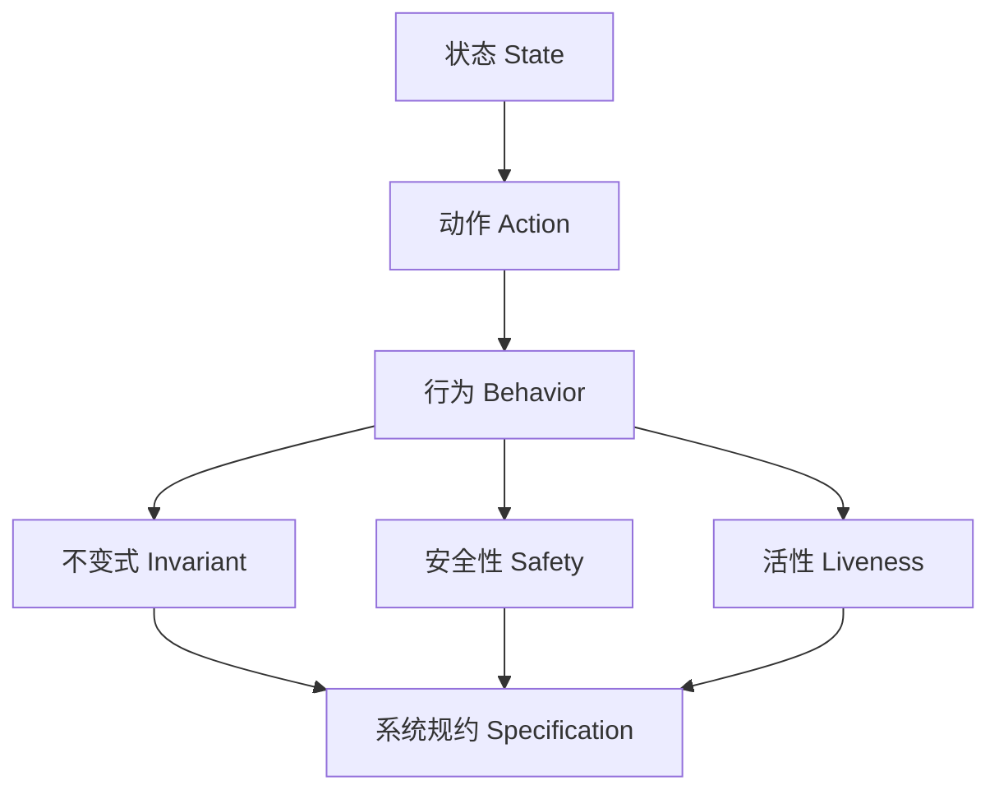
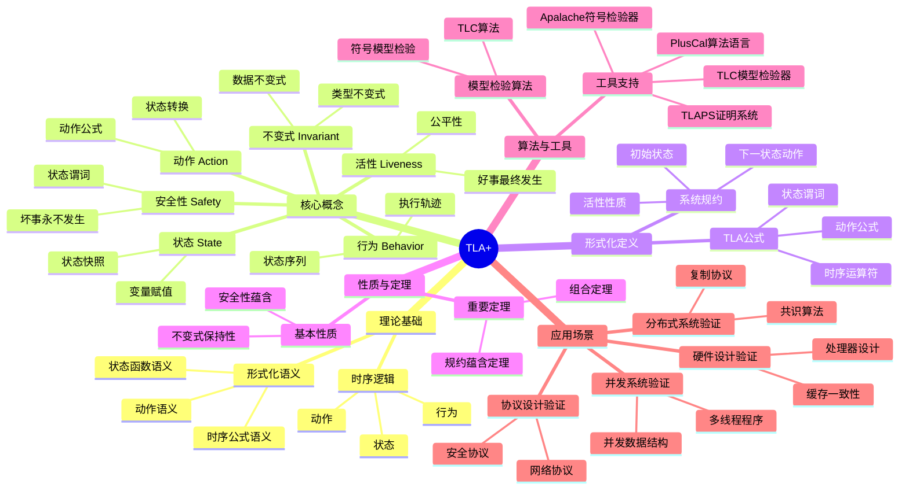
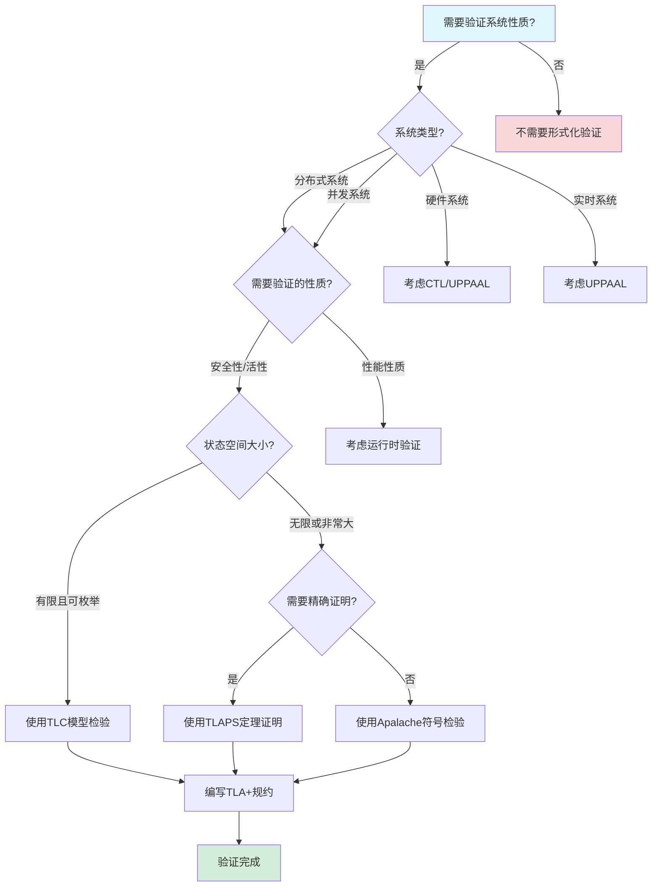
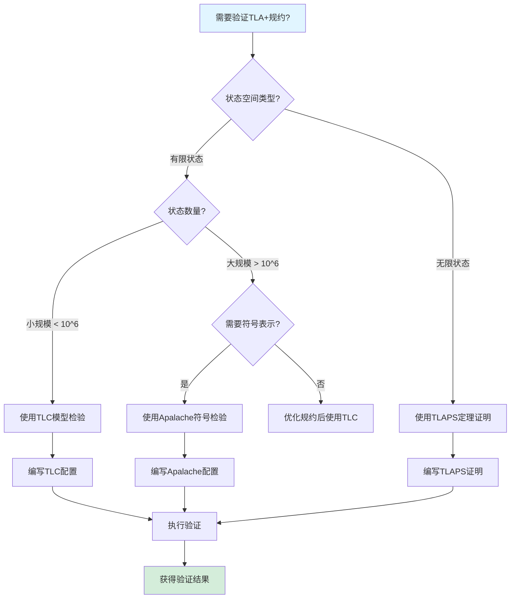
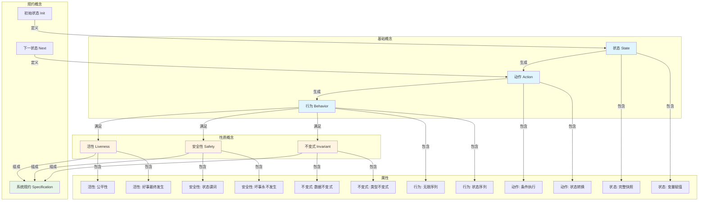
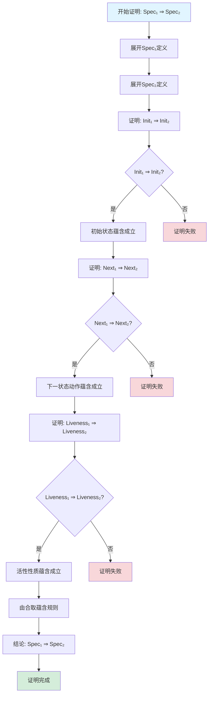

# TLA+ 专题文档

## 目录

- [TLA+ 专题文档](#tla-专题文档)
  - [目录](#目录)
  - [一、概述](#一概述)
    - [1.1 TLA+简介](#11-tla简介)
    - [1.2 核心思想](#12-核心思想)
    - [1.3 应用领域](#13-应用领域)
    - [1.4 在本项目中的应用](#14-在本项目中的应用)
  - [二、历史背景](#二历史背景)
    - [2.1 发展历史](#21-发展历史)
    - [2.2 重要人物](#22-重要人物)
    - [2.3 重要里程碑](#23-重要里程碑)
  - [三、核心概念](#三核心概念)
    - [3.1 基本概念](#31-基本概念)
      - [概念1：状态（State）](#概念1状态state)
      - [概念2：动作（Action）](#概念2动作action)
      - [概念3：行为（Behavior）](#概念3行为behavior)
      - [概念4：不变式（Invariant）](#概念4不变式invariant)
      - [概念5：安全性（Safety）](#概念5安全性safety)
      - [概念6：活性（Liveness）](#概念6活性liveness)
    - [3.2 概念关系](#32-概念关系)
  - [四、形式化定义](#四形式化定义)
    - [4.1 数学定义](#41-数学定义)
      - [定义1：TLA公式](#定义1tla公式)
      - [定义2：系统规约](#定义2系统规约)
    - [4.2 语法定义](#42-语法定义)
      - [TLA+语法要素](#tla语法要素)
    - [4.3 语义定义](#43-语义定义)
      - [语义1：状态函数语义](#语义1状态函数语义)
      - [语义2：动作语义](#语义2动作语义)
      - [语义3：时序公式语义](#语义3时序公式语义)
  - [五、性质与定理](#五性质与定理)
    - [5.1 基本性质](#51-基本性质)
      - [性质1：不变式保持性](#性质1不变式保持性)
      - [性质2：安全性蕴含](#性质2安全性蕴含)
    - [5.2 重要定理](#52-重要定理)
      - [定理1：规约蕴含定理](#定理1规约蕴含定理)
      - [定理2：组合定理](#定理2组合定理)
  - [六、算法与工具](#六算法与工具)
    - [6.1 模型检验算法](#61-模型检验算法)
      - [算法1：TLC模型检验算法](#算法1tlc模型检验算法)
      - [算法2：符号模型检验](#算法2符号模型检验)
    - [6.2 工具支持](#62-工具支持)
      - [工具1：TLC模型检验器](#工具1tlc模型检验器)
      - [工具2：TLAPS证明系统](#工具2tlaps证明系统)
      - [工具3：PlusCal](#工具3pluscal)
      - [工具4：Apalache](#工具4apalache)
  - [七、应用场景](#七应用场景)
    - [7.1 适用场景](#71-适用场景)
      - [场景1：并发算法验证](#场景1并发算法验证)
      - [场景2：分布式协议验证](#场景2分布式协议验证)
      - [场景3：系统设计验证](#场景3系统设计验证)
    - [7.2 不适用场景](#72-不适用场景)
      - [场景1：性能验证](#场景1性能验证)
      - [场景2：无限状态系统](#场景2无限状态系统)
      - [场景3：实时系统](#场景3实时系统)
  - [八、实践案例](#八实践案例)
    - [8.1 工业界案例](#81-工业界案例)
      - [案例1：Amazon DynamoDB](#案例1amazon-dynamodb)
      - [案例2：Microsoft Azure](#案例2microsoft-azure)
      - [案例3：Coinbase支付系统](#案例3coinbase支付系统)
    - [8.2 学术界案例](#82-学术界案例)
      - [案例1：Paxos算法验证](#案例1paxos算法验证)
      - [案例2：Raft算法验证](#案例2raft算法验证)
  - [九、学习资源](#九学习资源)
    - [9.1 推荐阅读](#91-推荐阅读)
      - [经典教材](#经典教材)
      - [在线教程](#在线教程)
      - [大学课程](#大学课程)
    - [9.2 学习路径](#92-学习路径)
      - [入门路径（1-2周）](#入门路径1-2周)
      - [进阶路径（3-4周）](#进阶路径3-4周)
      - [深入研究路径（持续）](#深入研究路径持续)
  - [十、参考文献](#十参考文献)
    - [10.1 经典文献](#101-经典文献)
      - [原始论文](#原始论文)
      - [重要论文](#重要论文)
    - [10.2 在线资源](#102-在线资源)
      - [Wikipedia](#wikipedia)
      - [官方资源](#官方资源)
      - [大学课程](#大学课程-1)
      - [工具文档](#工具文档)
  - [十一、思维表征](#十一思维表征)
    - [11.1 知识体系思维导图](#111-知识体系思维导图)
    - [11.2 多维知识对比矩阵](#112-多维知识对比矩阵)
      - [矩阵1：形式化验证方法对比矩阵](#矩阵1形式化验证方法对比矩阵)
      - [矩阵2：TLA+工具对比矩阵](#矩阵2tla工具对比矩阵)
      - [矩阵3：TLA+ vs CTL vs LTL对比矩阵](#矩阵3tla-vs-ctl-vs-ltl对比矩阵)
    - [11.3 论证决策树](#113-论证决策树)
      - [决策树1：何时使用TLA+进行验证](#决策树1何时使用tla进行验证)
      - [决策树2：TLA+工具选择决策树](#决策树2tla工具选择决策树)
    - [11.4 概念属性关系图](#114-概念属性关系图)
    - [11.5 形式化证明流程图](#115-形式化证明流程图)
      - [证明流程图1：不变式保持性证明](#证明流程图1不变式保持性证明)
      - [证明流程图2：规约蕴含定理证明](#证明流程图2规约蕴含定理证明)

---

## 一、概述

### 1.1 TLA+简介

**TLA+（Temporal Logic of Actions）** 是一种用于指定和验证并发和分布式系统的形式化规约语言。它由Leslie Lamport在1990年代开发，结合了时序逻辑（Temporal Logic）和动作（Actions）的概念，用于描述系统的行为。

**来源**：基于Wikipedia [TLA+](https://en.wikipedia.org/wiki/TLA%2B) 和 Leslie Lamport的原始论文

**核心特点**：

1. **形式化规约**：使用数学符号精确描述系统行为
2. **模型检验**：通过TLC模型检验器验证系统性质
3. **抽象层次**：支持从高层抽象到具体实现的规约
4. **可读性**：语法设计注重可读性，便于理解和交流

### 1.2 核心思想

**核心思想1：状态和动作**

TLA+基于状态机模型，系统由状态和状态转换（动作）组成：

- **状态（State）**：系统在某个时刻的完整快照
- **动作（Action）**：描述状态如何从一个状态转换到另一个状态
- **行为（Behavior）**：状态的无限序列，表示系统的执行轨迹

**核心思想2：时序逻辑**

使用时序逻辑描述系统的时间相关性质：

- **不变式（Invariant）**：在所有状态下都成立的性质
- **安全性（Safety）**：坏事永远不会发生
- **活性（Liveness）**：好事最终会发生

**核心思想3：抽象和细化**

支持从抽象规约到具体实现的逐步细化：

- **抽象规约**：描述系统应该做什么（What）
- **具体实现**：描述系统如何做（How）
- **细化关系**：证明实现满足规约

### 1.3 应用领域

**应用领域1：并发系统**

- 多线程程序
- 分布式算法
- 并发数据结构

**应用领域2：分布式系统**

- 共识算法（Paxos、Raft）
- 复制协议
- 分布式事务

**应用领域3：硬件设计**

- 处理器设计
- 缓存一致性协议
- 总线协议

**应用领域4：协议设计**

- 网络协议
- 安全协议
- 通信协议

### 1.4 在本项目中的应用

**在本项目中的应用**：

1. **Saga模式形式化规约**：使用TLA+规约Saga模式的正确性
2. **工作流一致性验证**：验证工作流的状态一致性
3. **故障恢复验证**：验证故障恢复机制的正确性
4. **性能边界验证**：验证性能保证的性质

**相关文档链接**：

- [形式化验证理论](../03-formal-verification/形式化验证理论.md#四tla规约与模型检验)
- [论证完备性增强](../14-argumentation-enhancement/论证完备性增强.md)

---

## 二、历史背景

### 2.1 发展历史

**1990年**：Leslie Lamport开始开发TLA（Temporal Logic of Actions）

- **背景**：需要一种形式化方法来描述和验证并发系统
- **动机**：传统方法难以处理并发系统的复杂性

**1994年**：发表TLA原始论文

- **论文**："The Temporal Logic of Actions" (ACM Transactions on Programming Languages and Systems, 1994)
- **贡献**：提出了TLA的形式化语义和理论基础

**2002年**：出版TLA+教材

- **著作**："Specifying Systems: The TLA+ Language and Tools for Hardware and Software Engineers"
- **作者**：Leslie Lamport
- **出版社**：Addison-Wesley
- **影响**：成为TLA+的标准参考书

**2009年**：TLA+工具集发布

- **TLC模型检验器**：用于有限状态模型检验
- **TLAPS证明系统**：用于定理证明
- **PlusCal**：更易用的语法，可编译为TLA+

**2014年至今**：持续发展和应用

- **工业界采用**：Amazon、Microsoft等公司使用TLA+验证关键系统
- **工具改进**：TLC性能提升，Apalache符号模型检验器开发
- **社区发展**：TLA+社区和资源不断增长

**来源**：Wikipedia [TLA+](https://en.wikipedia.org/wiki/TLA%2B) 和 Leslie Lamport的著作

### 2.2 重要人物

**Leslie Lamport（1941-）**

- **身份**：TLA+的创始人和主要开发者
- **背景**：美国计算机科学家，2013年图灵奖获得者
- **贡献**：
  - 开发TLA+语言和工具
  - 提出分布式系统理论（Paxos算法、向量时钟、拜占庭容错）
  - 在并发和分布式系统领域做出重要贡献
- **著作**：
  - "Specifying Systems: The TLA+ Language and Tools" (2002)
  - "The Temporal Logic of Actions" (1994)

**来源**：Wikipedia [Leslie Lamport](https://en.wikipedia.org/wiki/Leslie_Lamport)

### 2.3 重要里程碑

| 时间 | 里程碑 | 影响 |
|------|--------|------|
| **1990** | TLA开发开始 | 奠定理论基础 |
| **1994** | TLA原始论文发表 | 建立形式化语义 |
| **2002** | TLA+教材出版 | 推广TLA+使用 |
| **2009** | TLA+工具集发布 | 提供实用工具 |
| **2013** | Lamport获得图灵奖 | 认可形式化方法重要性 |
| **2014** | 工业界大规模采用 | 证明TLA+实用性 |

---

## 三、核心概念

### 3.1 基本概念

#### 概念1：状态（State）

**定义**：状态是系统在某个时刻的完整快照，包含所有变量的值。

**形式化定义**：

$$ \text{State} = \{v_1: V_1, v_2: V_2, ..., v_n: V_n\} $$

其中 $v_i$ 是变量名，$V_i$ 是变量的值域。

**示例**：

```tla
VARIABLES x, y, z

Init == x = 0 /\ y = 0 /\ z = 0
```

**来源**：Lamport, "Specifying Systems" (2002), Chapter 3

#### 概念2：动作（Action）

**定义**：动作是描述状态转换的公式，包含当前状态（未加prime）和下一状态（加prime）的变量。

**形式化定义**：

$$ A(s, s') = \text{Precondition}(s) \land \text{Postcondition}(s, s') $$

其中 $s$ 是当前状态，$s'$ 是下一状态。

**示例**：

```tla
Increment == x' = x + 1 /\ UNCHANGED <<y, z>>
```

**来源**：Lamport, "Specifying Systems" (2002), Chapter 4

#### 概念3：行为（Behavior）

**定义**：行为是状态的无限序列，表示系统的一个可能执行轨迹。

**形式化定义**：

$$ \sigma = s_0, s_1, s_2, ... $$

其中每个 $s_i$ 是一个状态。

**来源**：Lamport, "The Temporal Logic of Actions" (1994)

#### 概念4：不变式（Invariant）

**定义**：不变式是在所有可达状态下都成立的性质。

**形式化定义**：

$$ \Box P = \forall i \in \mathbb{N}: P(s_i) $$

其中 $\Box$ 是"总是"（Always）时序运算符。

**示例**：

```tla
TypeInvariant == x \in Nat /\ y \in Nat /\ z \in Nat
```

**来源**：Lamport, "Specifying Systems" (2002), Chapter 5

#### 概念5：安全性（Safety）

**定义**：安全性性质表示"坏事永远不会发生"，即系统永远不会进入错误状态。

**形式化定义**：

$$ \Box P $$

其中 $P$ 是状态谓词。

**示例**：

```tla
Safety == \Box (x >= 0)
```

**来源**：Lamport, "The Temporal Logic of Actions" (1994)

#### 概念6：活性（Liveness）

**定义**：活性性质表示"好事最终会发生"，即系统最终会达到期望状态。

**形式化定义**：

$$ \Diamond P = \exists i \in \mathbb{N}: P(s_i) $$

其中 $\Diamond$ 是"最终"（Eventually）时序运算符。

**示例**：

```tla
Liveness == \Diamond (x = 10)
```

**来源**：Lamport, "The Temporal Logic of Actions" (1994)

### 3.2 概念关系

**概念关系图**：



**关系说明**：

1. **状态 → 动作**：动作描述状态之间的转换
2. **动作 → 行为**：行为是动作序列产生的状态序列
3. **行为 → 性质**：不变式、安全性、活性都是行为的性质
4. **性质 → 规约**：系统规约由初始状态、动作和性质组成

---

## 四、形式化定义

### 4.1 数学定义

#### 定义1：TLA公式

**定义**：TLA公式是时序逻辑公式，用于描述系统的行为。

**形式化定义**：

$$ \phi ::= P | [A]_v | \Box \phi | \Diamond \phi | \phi \land \psi | \phi \lor \psi | \neg \phi $$

其中：

- $P$ 是状态谓词
- $[A]_v$ 是动作公式（$A$ 是动作，$v$ 是变量列表）
- $\Box \phi$ 表示"总是 $\phi$"
- $\Diamond \phi$ 表示"最终 $\phi$"

**来源**：Lamport, "The Temporal Logic of Actions" (1994), Section 3

#### 定义2：系统规约

**定义**：系统规约由初始状态谓词、动作公式和时序性质组成。

**形式化定义**：

$$ \text{Spec} = \text{Init} \land \Box[\text{Next}]_v \land \text{Liveness} $$

其中：

- $\text{Init}$ 是初始状态谓词
- $\text{Next}$ 是下一状态动作
- $v$ 是变量列表
- $\text{Liveness}$ 是活性性质

**来源**：Lamport, "Specifying Systems" (2002), Chapter 8

### 4.2 语法定义

#### TLA+语法要素

**1. 变量声明**

```tla
VARIABLES x, y, z
```

**2. 常量声明**

```tla
CONSTANTS N, MaxVal
```

**3. 初始状态**

```tla
Init == x = 0 /\ y = 0
```

**4. 动作定义**

```tla
Increment == x' = x + 1 /\ UNCHANGED y
```

**5. 下一状态动作**

```tla
Next == Increment \/ Decrement
```

**6. 系统规约**

```tla
Spec == Init /\ [][Next]_<<x, y>> /\ WF_x(Increment)
```

**来源**：Lamport, "Specifying Systems" (2002), Chapter 2-8

### 4.3 语义定义

#### 语义1：状态函数语义

**定义**：状态函数在状态 $s$ 下的值由状态中变量的值决定。

**形式化定义**：

$$ [f]_s = f(s(v_1), s(v_2), ..., s(v_n)) $$

**来源**：Lamport, "The Temporal Logic of Actions" (1994), Section 2

#### 语义2：动作语义

**定义**：动作 $A$ 在状态对 $(s, t)$ 下为真，当且仅当从状态 $s$ 到状态 $t$ 的转换满足 $A$。

**形式化定义**：

$$ [A]_{(s,t)} = A(s, t) $$

**来源**：Lamport, "The Temporal Logic of Actions" (1994), Section 3

#### 语义3：时序公式语义

**定义**：时序公式在行为 $\sigma$ 下的真值由行为的性质决定。

**形式化定义**：

$$ [\Box P]_\sigma = \forall i \in \mathbb{N}: [P]_{\sigma_i} $$

$$ [\Diamond P]_\sigma = \exists i \in \mathbb{N}: [P]_{\sigma_i} $$

**来源**：Lamport, "The Temporal Logic of Actions" (1994), Section 4

---

## 五、性质与定理

### 5.1 基本性质

#### 性质1：不变式保持性

**表述**：如果 $P$ 是初始状态，且所有动作都保持 $P$，则 $P$ 是不变式。

**形式化表述**：

$$ \text{Init} \Rightarrow P \land \Box[P \Rightarrow P'] \Rightarrow \Box P $$

**证明思路**：

1. 初始状态满足 $P$（由前提）
2. 如果当前状态满足 $P$，且动作保持 $P$，则下一状态也满足 $P$
3. 由归纳法，所有状态都满足 $P$

**来源**：Lamport, "Specifying Systems" (2002), Chapter 5

#### 性质2：安全性蕴含

**表述**：如果 $\Box P$ 成立，则 $\Box Q$ 也成立，当且仅当 $P \Rightarrow Q$。

**形式化表述**：

$$ \Box P \Rightarrow \Box Q \iff P \Rightarrow Q $$

**证明**：

$$ \Box P \Rightarrow \Box Q $$
$$ = \forall i: P(s_i) \Rightarrow \forall i: Q(s_i) $$
$$ = \forall i: P(s_i) \Rightarrow Q(s_i) $$
$$ = P \Rightarrow Q $$

**来源**：Lamport, "The Temporal Logic of Actions" (1994)

### 5.2 重要定理

#### 定理1：规约蕴含定理

**表述**：如果规约 $\text{Spec}_1$ 蕴含规约 $\text{Spec}_2$，则 $\text{Spec}_1$ 的每个行为都是 $\text{Spec}_2$ 的行为。

**形式化表述**：

$$ \text{Spec}_1 \Rightarrow \text{Spec}_2 $$

**应用**：用于证明实现满足规约（细化关系）

**来源**：Lamport, "Specifying Systems" (2002), Chapter 11

#### 定理2：组合定理

**表述**：如果系统由多个组件组成，且每个组件满足其规约，则整个系统满足组合规约。

**形式化表述**：

$$ \text{Spec}_1 \land \text{Spec}_2 \Rightarrow \text{Spec} $$

**应用**：用于模块化验证

**来源**：Lamport, "Specifying Systems" (2002), Chapter 11

---

## 六、算法与工具

### 6.1 模型检验算法

#### 算法1：TLC模型检验算法

**描述**：TLC（TLA+ Model Checker）是TLA+的模型检验器，用于验证有限状态系统的性质。

**算法步骤**：

1. **状态空间生成**：从初始状态开始，生成所有可达状态
2. **状态图构建**：构建状态转换图
3. **性质验证**：对每个状态验证不变式，对每条路径验证时序性质
4. **反例生成**：如果性质不满足，生成反例路径

**复杂度**：

- **时间复杂度**：$O(|S| \times |T|)$，其中 $|S|$ 是状态数，$|T|$ 是转换数
- **空间复杂度**：$O(|S|)$

**来源**：Lamport, "Specifying Systems" (2002), Chapter 14

#### 算法2：符号模型检验

**描述**：使用BDD（Binary Decision Diagram）或SAT求解器进行符号模型检验。

**工具**：Apalache（TLA+的符号模型检验器）

**优势**：

- 可以处理更大的状态空间
- 使用符号表示，避免状态爆炸

**来源**：Apalache文档

### 6.2 工具支持

#### 工具1：TLC模型检验器

**介绍**：TLC是TLA+的标准模型检验器，用于有限状态模型检验。

**功能**：

- 状态空间探索
- 不变式验证
- 时序性质验证
- 反例生成

**使用方法**：

```tla
\* TLA+规约
VARIABLES x
Init == x = 0
Next == x' = x + 1
Spec == Init /\ [][Next]_x

\* TLC配置
CONSTANTS N = 10
```

**来源**：Lamport, "Specifying Systems" (2002), Chapter 14

#### 工具2：TLAPS证明系统

**介绍**：TLAPS（TLA+ Proof System）是TLA+的定理证明系统。

**功能**：

- 交互式定理证明
- 自动化证明
- 证明检查

**来源**：TLAPS文档

#### 工具3：PlusCal

**介绍**：PlusCal是TLA+的算法语言，提供更易用的语法。

**特点**：

- 类似Pascal/C的语法
- 自动编译为TLA+
- 适合算法描述

**示例**：

```tla
--algorithm Example {
    variable x = 0;
    {
        while (x < 10) {
            x := x + 1;
        }
    }
}
```

**来源**：Lamport, "Specifying Systems" (2002), Chapter 16

#### 工具4：Apalache

**介绍**：Apalache是TLA+的符号模型检验器。

**功能**：

- 符号模型检验
- 类型检查
- 约束求解

**来源**：Apalache文档

---

## 七、应用场景

### 7.1 适用场景

#### 场景1：并发算法验证

**描述**：验证多线程算法、并发数据结构的正确性。

**优势**：

- 可以验证所有可能的执行顺序
- 可以发现并发bug
- 可以证明算法的正确性

**示例**：验证互斥锁、读写锁、无锁数据结构

#### 场景2：分布式协议验证

**描述**：验证分布式协议（如Paxos、Raft）的正确性。

**优势**：

- 可以验证协议在所有故障场景下的行为
- 可以证明协议的性质（安全性、活性）
- 可以发现协议设计中的问题

**示例**：Paxos算法、Raft算法、两阶段提交

#### 场景3：系统设计验证

**描述**：在实现之前验证系统设计的正确性。

**优势**：

- 早期发现设计问题
- 降低实现成本
- 提高系统可靠性

**示例**：Amazon DynamoDB设计、Microsoft Azure服务设计

### 7.2 不适用场景

#### 场景1：性能验证

**描述**：TLA+不适合验证性能性质（如延迟、吞吐量）。

**原因**：

- TLA+关注功能正确性，不关注性能
- 性能验证需要运行时测试

#### 场景2：无限状态系统

**描述**：TLA+的模型检验器（TLC）只能处理有限状态系统。

**原因**：

- 状态空间必须是有限的
- 无限状态系统需要使用定理证明

#### 场景3：实时系统

**描述**：TLA+不适合验证实时约束。

**原因**：

- TLA+不直接支持时间约束
- 实时系统需要使用时间自动机（如UPPAAL）

---

## 八、实践案例

### 8.1 工业界案例

#### 案例1：Amazon DynamoDB

**背景**：Amazon使用TLA+验证DynamoDB的一致性协议。

**应用**：

- 验证最终一致性协议
- 验证故障恢复机制
- 验证数据复制协议

**效果**：

- 发现了协议设计中的问题
- 提高了系统可靠性
- 减少了生产环境bug

**来源**：Amazon技术博客

#### 案例2：Microsoft Azure

**背景**：Microsoft使用TLA+验证Azure服务的正确性。

**应用**：

- 验证存储服务的一致性
- 验证计算服务的调度算法
- 验证网络服务的路由协议

**效果**：

- 提高了服务可靠性
- 减少了服务中断
- 提高了客户满意度

**来源**：Microsoft技术博客

#### 案例3：Coinbase支付系统

**背景**：Coinbase使用TLA+验证支付系统的正确性。

**应用**：

- 验证支付原子性
- 验证资金守恒
- 验证故障恢复

**效果**：

- 保证了支付系统的正确性
- 提高了系统可靠性
- 减少了资金损失风险

**来源**：Coinbase技术博客

### 8.2 学术界案例

#### 案例1：Paxos算法验证

**背景**：使用TLA+验证Paxos算法的正确性。

**应用**：

- 验证Paxos的安全性
- 验证Paxos的活性
- 验证Paxos的容错性

**效果**：

- 提供了Paxos的形式化证明
- 发现了Paxos变种的问题
- 推动了共识算法研究

**来源**：Lamport, "Paxos Made Simple" (2001)

#### 案例2：Raft算法验证

**背景**：使用TLA+验证Raft算法的正确性。

**应用**：

- 验证Raft的安全性
- 验证Raft的活性
- 对比Raft和Paxos

**效果**：

- 提供了Raft的形式化证明
- 证明了Raft的正确性
- 推动了共识算法研究

**来源**：Ongaro & Ousterhout, "In Search of an Understandable Consensus Algorithm" (2014)

---

## 九、学习资源

### 9.1 推荐阅读

#### 经典教材

1. **"Specifying Systems: The TLA+ Language and Tools for Hardware and Software Engineers"**
   - 作者：Leslie Lamport
   - 出版社：Addison-Wesley
   - 出版年份：2002
   - **推荐理由**：TLA+的权威教材，由创始人编写

2. **"The Temporal Logic of Actions"**
   - 作者：Leslie Lamport
   - 期刊：ACM Transactions on Programming Languages and Systems
   - 出版年份：1994
   - **推荐理由**：TLA的原始论文，理论基础

#### 在线教程

1. **TLA+官方教程**
   - 网址：<https://learntla.com/>
   - **推荐理由**：官方推荐的学习资源

2. **TLA+视频教程**
   - 作者：Leslie Lamport
   - 平台：YouTube
   - **推荐理由**：由创始人亲自讲解

#### 大学课程

1. **CMU 15-811: Formal Methods**
   - 课程网站：CMU课程网站
   - **推荐理由**：包含TLA+的详细讲解

2. **MIT 6.512: Formal Methods**
   - 课程网站：MIT课程网站
   - **推荐理由**：包含TLA+的实际应用

### 9.2 学习路径

#### 入门路径（1-2周）

1. **Week 1**：
   - 阅读"Specifying Systems"前3章
   - 完成TLA+官方教程基础部分
   - 编写简单的TLA+规约

2. **Week 2**：
   - 学习TLC模型检验器使用
   - 验证简单的系统规约
   - 理解不变式和时序性质

#### 进阶路径（3-4周）

1. **Week 3**：
   - 学习复杂系统的规约方法
   - 学习细化关系
   - 学习组合规约

2. **Week 4**：
   - 学习TLAPS定理证明
   - 学习PlusCal算法语言
   - 完成实际项目

#### 深入研究路径（持续）

1. **理论研究**：
   - 深入研究时序逻辑理论
   - 研究模型检验算法
   - 研究定理证明方法

2. **实践应用**：
   - 在实际项目中使用TLA+
   - 贡献TLA+工具改进
   - 分享TLA+使用经验

---

## 十、参考文献

### 10.1 经典文献

#### 原始论文

1. **Lamport, L. (1994). "The Temporal Logic of Actions"**
   - 期刊：ACM Transactions on Programming Languages and Systems
   - 卷号：16, 3
   - 页码：872-923
   - **重要性**：TLA的原始论文，建立理论基础

2. **Lamport, L. (2002). "Specifying Systems: The TLA+ Language and Tools for Hardware and Software Engineers"**
   - 出版社：Addison-Wesley
   - ISBN：0-321-14306-X
   - **重要性**：TLA+的权威教材

#### 重要论文

3. **Lamport, L. (2001). "Paxos Made Simple"**
   - 期刊：ACM SIGACT News
   - **重要性**：使用TLA+验证Paxos算法

4. **Ongaro, D., & Ousterhout, J. (2014). "In Search of an Understandable Consensus Algorithm"**
   - 会议：USENIX ATC
   - **重要性**：使用TLA+验证Raft算法

### 10.2 在线资源

#### Wikipedia

- [TLA+](https://en.wikipedia.org/wiki/TLA%2B)
- [Temporal Logic](https://en.wikipedia.org/wiki/Temporal_logic)
- [Model Checking](https://en.wikipedia.org/wiki/Model_checking)
- [Leslie Lamport](https://en.wikipedia.org/wiki/Leslie_Lamport)

#### 官方资源

- **TLA+官方网站**：<https://lamport.azurewebsites.net/tla/tla.html>
- **TLA+工具下载**：<https://github.com/tlaplus/tlaplus>
- **TLA+教程**：<https://learntla.com/>
- **TLA+视频教程**：<https://lamport.azurewebsites.net/video/videos.html>

#### 大学课程

- **CMU 15-811: Formal Methods**：CMU课程网站
- **MIT 6.512: Formal Methods**：MIT课程网站
- **Stanford CS237B: Principles of Model Checking**：Stanford课程网站

#### 工具文档

- **TLC文档**：TLA+工具文档
- **TLAPS文档**：TLAPS文档
- **Apalache文档**：Apalache文档

---

**文档版本**：1.0

**创建时间**：2024年

**维护者**：项目团队

**最后更新**：2024年

**对标资源**：

- ✅ Wikipedia: [TLA+](https://en.wikipedia.org/wiki/TLA%2B)
- ✅ 经典著作: "Specifying Systems" by Leslie Lamport (2002)
- ✅ 原始论文: "The Temporal Logic of Actions" (1994)
- ✅ 大学课程: CMU 15-811, MIT 6.512
- ✅ 工具文档: TLC, TLAPS, Apalache

---

## 十一、思维表征

### 11.1 知识体系思维导图

**TLA+知识体系思维导图**：



**思维导图说明**：

- **根节点**：TLA+理论模型
- **一级节点**：6个主要知识领域（理论基础、核心概念、形式化定义、性质与定理、算法与工具、应用场景）
- **二级节点**：每个领域下的具体知识点
- **三级节点**：详细的概念和工具

### 11.2 多维知识对比矩阵

#### 矩阵1：形式化验证方法对比矩阵

| 验证方法 | 表达能力 | 复杂度 | 工具支持 | 适用场景 | 学习曲线 | 工业应用 |
|---------|---------|--------|---------|---------|---------|---------|
| **TLA+** | ⭐⭐⭐⭐⭐ | 中 | ⭐⭐⭐⭐ | 分布式系统、并发算法 | 中 | ⭐⭐⭐⭐ |
| **CTL** | ⭐⭐⭐⭐ | 中 | ⭐⭐⭐⭐⭐ | 硬件验证、协议验证 | 中 | ⭐⭐⭐⭐⭐ |
| **LTL** | ⭐⭐⭐ | 低 | ⭐⭐⭐⭐⭐ | 协议验证、并发程序 | 低 | ⭐⭐⭐⭐ |
| **Petri网** | ⭐⭐⭐ | 低 | ⭐⭐⭐ | 工作流建模、死锁检测 | 低 | ⭐⭐⭐ |
| **UPPAAL** | ⭐⭐⭐⭐ | 中 | ⭐⭐⭐⭐ | 实时系统验证 | 中 | ⭐⭐⭐ |

**对比维度说明**：

- **表达能力**：能够表达的系统性质和复杂度
- **复杂度**：学习和使用的难度
- **工具支持**：可用工具的数量和质量
- **适用场景**：最适合的应用领域
- **学习曲线**：掌握所需的时间和难度
- **工业应用**：在工业界的采用程度

#### 矩阵2：TLA+工具对比矩阵

| 工具 | 功能 | 性能 | 易用性 | 适用场景 | 维护状态 |
|------|------|------|--------|---------|---------|
| **TLC** | 有限状态模型检验 | ⭐⭐⭐ | ⭐⭐⭐⭐ | 中小规模系统 | ⭐⭐⭐⭐⭐ |
| **TLAPS** | 定理证明 | ⭐⭐⭐⭐ | ⭐⭐ | 无限状态系统 | ⭐⭐⭐⭐ |
| **PlusCal** | 算法语言 | ⭐⭐⭐ | ⭐⭐⭐⭐⭐ | 算法描述 | ⭐⭐⭐⭐ |
| **Apalache** | 符号模型检验 | ⭐⭐⭐⭐ | ⭐⭐⭐ | 大规模系统 | ⭐⭐⭐⭐ |

#### 矩阵3：TLA+ vs CTL vs LTL对比矩阵

| 特性 | TLA+ | CTL | LTL |
|------|------|-----|-----|
| **逻辑类型** | 动作时序逻辑 | 分支时序逻辑 | 线性时序逻辑 |
| **表达能力** | 最强（状态+动作+时序） | 强（分支路径） | 中等（单一路径） |
| **语法复杂度** | 中 | 中 | 低 |
| **模型检验复杂度** | $O(|S| \times |T|)$ | $O(|S| \times |T| \times |\phi|)$ | $O(|S| \times |T| \times 2^{|\phi|})$ |
| **工具支持** | TLC, TLAPS, Apalache | NuSMV, SPIN | SPIN, NuSMV |
| **适用场景** | 分布式系统、并发算法 | 硬件验证、协议验证 | 协议验证、并发程序 |
| **工业应用** | Amazon, Microsoft | Intel, IBM | 广泛使用 |

### 11.3 论证决策树

#### 决策树1：何时使用TLA+进行验证



**决策树说明**：

- **判断节点**：系统类型、验证性质、状态空间大小、是否需要精确证明
- **决策结果**：选择合适的验证方法和工具
- **路径说明**：每个路径都有明确的判断标准

#### 决策树2：TLA+工具选择决策树



### 11.4 概念属性关系图

**TLA+核心概念属性关系图**：



**关系说明**：

- **包含关系**：概念包含其属性
- **生成关系**：状态生成动作，动作生成行为
- **满足关系**：行为满足性质（不变式、安全性、活性）
- **定义关系**：初始状态定义状态，下一状态定义动作
- **组成关系**：性质组成系统规约

### 11.5 形式化证明流程图

#### 证明流程图1：不变式保持性证明

```mermaid
flowchart TD
    A[开始证明: 不变式保持性] --> B[假设: Init ⇒ P]
    B --> C[假设: □[P ⇒ P']]
    C --> D[目标: 证明 □P]

    D --> E[基础步骤: 证明 P在初始状态成立]
    E --> F{Init ⇒ P?}
    F -->|是| G[基础步骤完成]
    F -->|否| H[证明失败]

    G --> I[归纳步骤: 假设 P在状态s成立]
    I --> J[证明: P在下一状态s'也成立]
    J --> K{□[P ⇒ P']?}
    K -->|是| L[由动作保持性, P'成立]
    K -->|否| M[证明失败]

    L --> N[归纳步骤完成]
    N --> O[由数学归纳法]
    O --> P[结论: □P成立]

    P --> Q[证明完成]

    style A fill:#e1f5ff
    style Q fill:#d4edda
    style H fill:#f8d7da
    style M fill:#f8d7da
```

**证明步骤说明**：

1. **基础步骤**：证明初始状态满足不变式 $P$
2. **归纳假设**：假设当前状态满足 $P$
3. **归纳步骤**：证明下一状态也满足 $P$（由动作保持性）
4. **结论**：由数学归纳法，所有状态都满足 $P$，即 $\Box P$ 成立

#### 证明流程图2：规约蕴含定理证明



**证明策略**：

1. **展开定义**：展开两个规约的定义
2. **分别证明**：分别证明初始状态、下一状态动作、活性性质的蕴含关系
3. **组合结论**：由合取蕴含规则，组合得到规约蕴含

---

**思维表征说明**：

- **思维导图**：全面展示TLA+的知识体系结构
- **对比矩阵**：从多个维度对比TLA+与其他验证方法和工具
- **决策树**：提供清晰的决策路径，帮助选择合适的验证方法和工具
- **关系图**：详细展示概念、属性、关系之间的网络
- **证明流程图**：可视化形式化证明的步骤和逻辑

**来源**：基于TLA+理论、Lamport的著作和实际应用经验
