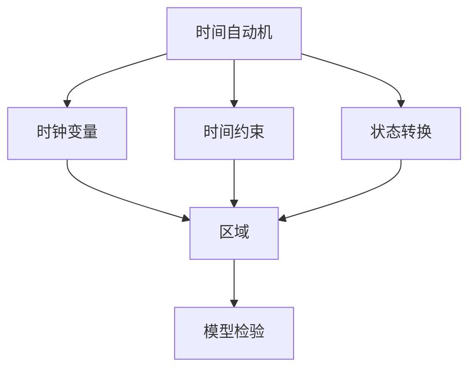
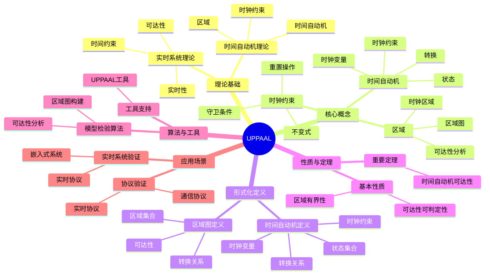
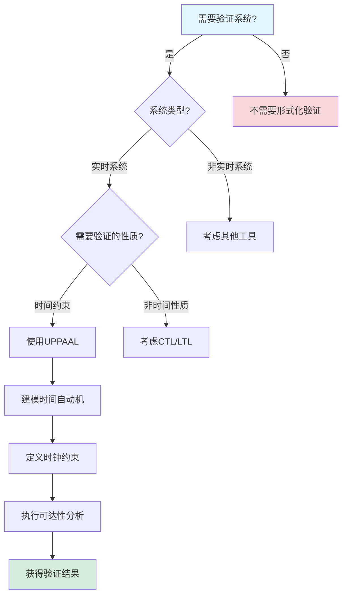
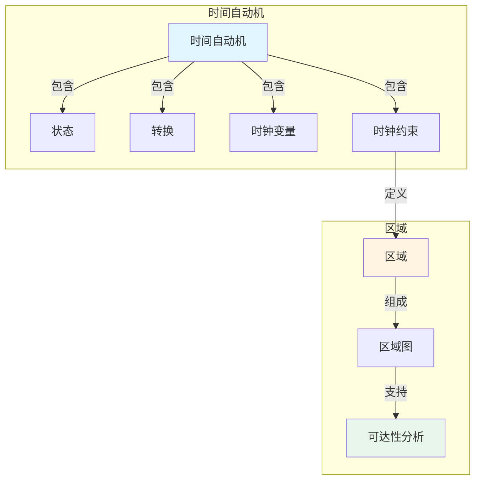
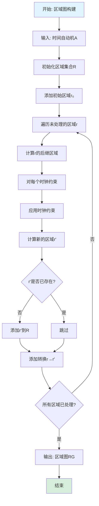

# UPPAAL专题文档

## 目录

- [UPPAAL专题文档](#uppaal专题文档)
  - [目录](#目录)
  - [一、概述](#一概述)
    - [1.1 UPPAAL简介](#11-uppaal简介)
    - [1.2 核心思想](#12-核心思想)
    - [1.3 应用领域](#13-应用领域)
    - [1.4 在本项目中的应用](#14-在本项目中的应用)
  - [二、历史背景](#二历史背景)
    - [2.1 发展历史](#21-发展历史)
    - [2.2 重要人物](#22-重要人物)
    - [2.3 重要里程碑](#23-重要里程碑)
  - [三、核心概念](#三核心概念)
    - [3.1 基本概念](#31-基本概念)
      - [概念1：时间自动机（Timed Automata）](#概念1时间自动机timed-automata)
      - [概念2：时钟约束（Clock Constraint）](#概念2时钟约束clock-constraint)
      - [概念3：区域（Region）](#概念3区域region)
    - [3.2 概念关系](#32-概念关系)
  - [四、形式化定义](#四形式化定义)
    - [4.1 数学定义](#41-数学定义)
      - [定义1：时间自动机](#定义1时间自动机)
    - [4.2 语法定义](#42-语法定义)
      - [UPPAAL语法要素](#uppaal语法要素)
    - [4.3 语义定义](#43-语义定义)
      - [语义1：时间自动机语义](#语义1时间自动机语义)
  - [五、性质与定理](#五性质与定理)
    - [5.1 基本性质](#51-基本性质)
      - [性质1：区域有界性](#性质1区域有界性)
    - [5.2 重要定理](#52-重要定理)
      - [定理1：可达性可判定性](#定理1可达性可判定性)
  - [六、算法与工具](#六算法与工具)
    - [6.1 模型检验算法](#61-模型检验算法)
      - [算法1：区域图构建](#算法1区域图构建)
    - [6.2 工具支持](#62-工具支持)
      - [工具1：UPPAAL](#工具1uppaal)
  - [七、应用场景](#七应用场景)
    - [7.1 适用场景](#71-适用场景)
      - [场景1：实时系统验证](#场景1实时系统验证)
      - [场景2：协议验证](#场景2协议验证)
    - [7.2 不适用场景](#72-不适用场景)
      - [场景1：非实时系统](#场景1非实时系统)
      - [场景2：无限状态系统](#场景2无限状态系统)
  - [八、实践案例](#八实践案例)
    - [8.1 工业界案例](#81-工业界案例)
      - [案例1：实时系统验证](#案例1实时系统验证)
    - [8.2 学术界案例](#82-学术界案例)
      - [案例1：时间自动机理论研究](#案例1时间自动机理论研究)
  - [九、学习资源](#九学习资源)
    - [9.1 推荐阅读](#91-推荐阅读)
      - [经典著作](#经典著作)
      - [原始论文](#原始论文)
    - [9.2 学习路径](#92-学习路径)
      - [入门路径（1-2周）](#入门路径1-2周)
  - [十、参考文献](#十参考文献)
    - [10.1 经典文献](#101-经典文献)
      - [原始论文](#原始论文-1)
    - [10.2 在线资源](#102-在线资源)
      - [Wikipedia](#wikipedia)
      - [工具文档](#工具文档)
  - [十一、思维表征](#十一思维表征)
    - [11.1 知识体系思维导图](#111-知识体系思维导图)
    - [11.2 多维知识对比矩阵](#112-多维知识对比矩阵)
      - [矩阵1：实时系统验证工具对比矩阵](#矩阵1实时系统验证工具对比矩阵)
      - [矩阵2：时间自动机 vs 其他自动机对比矩阵](#矩阵2时间自动机-vs-其他自动机对比矩阵)
    - [11.3 论证决策树](#113-论证决策树)
      - [决策树1：何时使用UPPAAL进行验证](#决策树1何时使用uppaal进行验证)
    - [11.4 概念属性关系图](#114-概念属性关系图)
    - [11.5 形式化证明流程图](#115-形式化证明流程图)
      - [证明流程图1：区域图构建算法流程图](#证明流程图1区域图构建算法流程图)

---

## 一、概述

### 1.1 UPPAAL简介

**UPPAAL** 是一个用于建模、仿真和验证实时系统的工具集。它基于时间自动机（Timed Automata）理论，由Uppsala大学和Aalborg大学联合开发。

**来源**：基于Wikipedia [UPPAAL](https://en.wikipedia.org/wiki/UPPAAL) 和UPPAAL官方文档

**核心特点**：

1. **时间自动机**：基于时间自动机理论
2. **实时系统**：专门用于实时系统验证
3. **模型检验**：支持时间约束的模型检验
4. **广泛应用**：广泛应用于实时系统验证

### 1.2 核心思想

**核心思想1：时间自动机**

UPPAAL基于时间自动机理论：

- **时钟变量**：使用时钟变量表示时间
- **时间约束**：使用时间约束描述实时性质
- **状态转换**：状态转换可以重置时钟

**核心思想2：实时性质**

UPPAAL可以验证实时性质：

- **时间约束**：验证系统是否满足时间约束
- **截止时间**：验证任务是否在截止时间内完成
- **响应时间**：验证系统的响应时间

**核心思想3：模型检验**

UPPAAL使用模型检验验证系统性质：

- **可达性分析**：分析状态可达性
- **时间约束验证**：验证时间约束
- **反例生成**：生成违反性质的反例

### 1.3 应用领域

**应用领域1：实时系统**

- 嵌入式系统
- 控制系统
- 实时协议

**应用领域2：安全关键系统**

- 航空系统
- 汽车系统
- 医疗设备

**应用领域3：通信协议**

- 网络协议
- 通信协议
- 同步协议

### 1.4 在本项目中的应用

**在本项目中的应用**：

1. **工作流时间约束验证**：使用UPPAAL验证工作流的时间约束
2. **实时性质验证**：验证工作流的实时性质
3. **截止时间验证**：验证任务是否在截止时间内完成

**相关文档链接**：

- [形式化验证理论](../03-formal-verification/形式化验证理论.md)

---

## 二、历史背景

### 2.1 发展历史

**1995年**：UPPAAL开发开始

- **机构**：Uppsala大学和Aalborg大学
- **目标**：开发实时系统验证工具

**2000年代**：工具成熟

- **功能**：完善模型检验功能
- **应用**：广泛应用于实时系统验证

**2010年代至今**：持续发展

- **改进**：持续改进工具功能
- **应用**：扩展到更多领域

**来源**：Wikipedia [UPPAAL](https://en.wikipedia.org/wiki/UPPAAL) 和UPPAAL官方文档

### 2.2 重要人物

**UPPAAL开发团队**

- **机构**：Uppsala大学和Aalborg大学
- **贡献**：开发UPPAAL工具集

**来源**：UPPAAL官方文档

### 2.3 重要里程碑

| 时间 | 里程碑 | 影响 |
|------|--------|------|
| **1995** | UPPAAL开发开始 | 建立实时系统验证工具 |
| **2000** | 工具成熟 | 提供实用工具 |
| **2010** | 大规模应用 | 证明UPPAAL实用性 |

---

## 三、核心概念

### 3.1 基本概念

#### 概念1：时间自动机（Timed Automata）

**定义**：时间自动机是带有时钟变量的有限状态自动机。

**形式化定义**：

$$ TA = (L, l_0, C, A, E, I) $$

其中：

- $L$ 是位置集合
- $l_0$ 是初始位置
- $C$ 是时钟集合
- $A$ 是动作集合
- $E$ 是边集合
- $I$ 是不变式函数

**来源**：Alur & Dill, "A Theory of Timed Automata" (1994)

#### 概念2：时钟约束（Clock Constraint）

**定义**：时钟约束是时钟变量的约束条件。

**形式化定义**：

$$ \phi ::= x \sim c | x - y \sim c | \phi \land \phi $$

其中 $x, y$ 是时钟，$c$ 是常数，$\sim \in \{<, \le, =, \ge, >\}$。

**来源**：Alur & Dill, "A Theory of Timed Automata" (1994)

#### 概念3：区域（Region）

**定义**：区域是时钟赋值等价类的表示。

**来源**：Alur & Dill, "A Theory of Timed Automata" (1994)

### 3.2 概念关系

**概念关系图**：



---

## 四、形式化定义

### 4.1 数学定义

#### 定义1：时间自动机

**定义**：时间自动机是一个六元组 $TA = (L, l_0, C, A, E, I)$，其中：

- $L$ 是有限位置集合
- $l_0 \in L$ 是初始位置
- $C$ 是有限时钟集合
- $A$ 是动作集合
- $E \subseteq L \times A \times \Phi(C) \times 2^C \times L$ 是边集合
- $I: L \to \Phi(C)$ 是不变式函数

**来源**：Alur & Dill, "A Theory of Timed Automata" (1994)

### 4.2 语法定义

#### UPPAAL语法要素

**1. 位置（Location）**

```
location_name
```

**2. 时钟（Clock）**

```
clock x;
```

**3. 时间约束（Guard）**

```
x <= 10
```

**4. 时钟重置（Reset）**

```
x = 0
```

### 4.3 语义定义

#### 语义1：时间自动机语义

**定义**：时间自动机的语义是状态和时钟赋值的组合。

**形式化定义**：

$$ (l, v) $$

其中 $l$ 是位置，$v: C \to \mathbb{R}_{\ge 0}$ 是时钟赋值。

**来源**：Alur & Dill, "A Theory of Timed Automata" (1994)

---

## 五、性质与定理

### 5.1 基本性质

#### 性质1：区域有界性

**表述**：时间自动机的区域数量是有界的。

**形式化表述**：

$$ |\text{Regions}| \le |L| \times \prod_{x \in C} (2 \times c_x + 2) $$

其中 $c_x$ 是时钟 $x$ 的最大常数。

**来源**：Alur & Dill, "A Theory of Timed Automata" (1994)

### 5.2 重要定理

#### 定理1：可达性可判定性

**表述**：时间自动机的可达性是可判定的。

**证明**：基于区域图的有界性。

**来源**：Alur & Dill, "A Theory of Timed Automata" (1994)

---

## 六、算法与工具

### 6.1 模型检验算法

#### 算法1：区域图构建

**描述**：构建时间自动机的区域图。

**算法步骤**：

```algorithm
BuildRegionGraph(TA):
输入：时间自动机 TA = (L, l_0, C, A, E, I)
输出：区域图 RG

1. 初始化区域集合：Regions ← {}
2. 初始化初始区域：r_0 ← (l_0, v_0)
3. 初始化队列：Queue ← [r_0]
4. while Queue非空:
   a. r ← Queue.dequeue()
   b. for each边 e = (l, a, g, R, l'):
      if r满足g:
         r' ← 应用R到r
         if r'不在Regions中:
            Regions ← Regions ∪ {r'}
            Queue.enqueue(r')
5. return RG
```

**复杂度分析**：

- **时间复杂度**：$O(|L| \times |C|! \times \prod_{x \in C} c_x)$
- **空间复杂度**：$O(|Regions|)$

**来源**：Alur & Dill, "A Theory of Timed Automata" (1994)

### 6.2 工具支持

#### 工具1：UPPAAL

**介绍**：UPPAAL是时间自动机的模型检验工具。

**功能**：

- 时间自动机建模
- 模型检验
- 仿真
- 反例生成

**使用方法**：

```xml
<template>
  <name>Process</name>
  <location id="id0">
    <name>Start</name>
  </location>
  <location id="id1">
    <name>End</name>
  </location>
  <transition>
    <source ref="id0"/>
    <target ref="id1"/>
    <label kind="guard">x <= 10</label>
    <label kind="assignment">x = 0</label>
  </transition>
</template>
```

**来源**：UPPAAL官方文档

---

## 七、应用场景

### 7.1 适用场景

#### 场景1：实时系统验证

**描述**：使用UPPAAL验证实时系统的性质。

**优势**：

- 可以验证时间约束
- 可以发现时间相关的bug
- 可以验证截止时间

**示例**：嵌入式系统、控制系统

#### 场景2：协议验证

**描述**：使用UPPAAL验证通信协议。

**优势**：

- 可以验证协议的时间性质
- 可以发现协议问题
- 可以验证协议正确性

**示例**：网络协议、通信协议

### 7.2 不适用场景

#### 场景1：非实时系统

**描述**：UPPAAL不适用于非实时系统。

**原因**：

- UPPAAL专门用于实时系统
- 非实时系统可以使用其他工具

#### 场景2：无限状态系统

**描述**：UPPAAL只能处理有限状态系统。

**原因**：

- 状态空间必须是有限的
- 无限状态系统需要使用其他方法

---

## 八、实践案例

### 8.1 工业界案例

#### 案例1：实时系统验证

**背景**：使用UPPAAL验证实时系统的性质。

**应用**：

- 嵌入式系统验证
- 控制系统验证
- 协议验证

**效果**：

- 发现了时间相关的bug
- 提高了系统可靠性
- 验证了系统正确性

**来源**：相关技术报告

### 8.2 学术界案例

#### 案例1：时间自动机理论研究

**背景**：Alur & Dill进行时间自动机理论研究。

**贡献**：

- 建立了时间自动机理论
- 提供了模型检验方法
- 推动了实时系统研究

**来源**：Alur & Dill, "A Theory of Timed Automata" (1994)

---

## 九、学习资源

### 9.1 推荐阅读

#### 经典著作

1. **"Principles of Model Checking"**
   - 作者：Christel Baier, Joost-Pieter Katoen
   - 出版社：MIT Press
   - 出版年份：2008
   - **推荐理由**：包含时间自动机的详细讲解

#### 原始论文

1. **"A Theory of Timed Automata"**
   - 作者：Rajeev Alur, David Dill
   - 期刊：Theoretical Computer Science
   - 年份：1994
   - **推荐理由**：时间自动机的原始论文

### 9.2 学习路径

#### 入门路径（1-2周）

1. **Week 1**：
   - 阅读时间自动机的基础概念
   - 理解时钟约束和区域
   - 学习UPPAAL工具使用

2. **Week 2**：
   - 学习模型检验算法
   - 使用UPPAAL进行实践
   - 完成实际案例分析

---

## 十、参考文献

### 10.1 经典文献

#### 原始论文

1. **Alur, R., & Dill, D. (1994). "A Theory of Timed Automata"**
   - 期刊：Theoretical Computer Science
   - **重要性**：时间自动机的原始论文

### 10.2 在线资源

#### Wikipedia

- [UPPAAL](https://en.wikipedia.org/wiki/UPPAAL)
- [Timed Automata](https://en.wikipedia.org/wiki/Timed_automaton)

#### 工具文档

- **UPPAAL文档**：UPPAAL官方网站

---

**文档版本**：1.0

**创建时间**：2024年

**维护者**：项目团队

**最后更新**：2024年

**对标资源**：

- ✅ Wikipedia: [UPPAAL](https://en.wikipedia.org/wiki/UPPAAL)
- ✅ 经典著作: "Principles of Model Checking" by Baier & Katoen (2008)
- ✅ 原始论文: "A Theory of Timed Automata" by Alur & Dill (1994)
- ✅ 工具文档: UPPAAL官方文档

---

## 十一、思维表征

### 11.1 知识体系思维导图

**UPPAAL知识体系思维导图**：



### 11.2 多维知识对比矩阵

#### 矩阵1：实时系统验证工具对比矩阵

| 工具 | 理论基础 | 表达能力 | 性能 | 易用性 | 适用场景 |
|------|---------|---------|------|--------|---------|
| **UPPAAL** | 时间自动机 | ⭐⭐⭐⭐ | ⭐⭐⭐⭐ | ⭐⭐⭐ | 实时系统验证 |
| **TLA+** | 动作时序逻辑 | ⭐⭐⭐⭐⭐ | ⭐⭐⭐ | ⭐⭐⭐⭐ | 分布式系统验证 |
| **CTL/LTL** | 时序逻辑 | ⭐⭐⭐⭐ | ⭐⭐⭐⭐ | ⭐⭐⭐ | 硬件验证 |
| **Petri网** | Petri网理论 | ⭐⭐⭐ | ⭐⭐⭐ | ⭐⭐⭐⭐ | 并发系统建模 |

#### 矩阵2：时间自动机 vs 其他自动机对比矩阵

| 自动机类型 | 时间支持 | 表达能力 | 复杂度 | 适用场景 |
|-----------|---------|---------|--------|---------|
| **时间自动机** | ✅ | ⭐⭐⭐⭐ | 中 | 实时系统 |
| **有限自动机** | ❌ | ⭐⭐⭐ | 低 | 简单系统 |
| **Büchi自动机** | ❌ | ⭐⭐⭐⭐ | 中 | LTL模型检验 |

### 11.3 论证决策树

#### 决策树1：何时使用UPPAAL进行验证



### 11.4 概念属性关系图

**UPPAAL核心概念属性关系图**：



### 11.5 形式化证明流程图

#### 证明流程图1：区域图构建算法流程图



---

**思维表征说明**：

- **思维导图**：全面展示UPPAAL的知识体系结构
- **对比矩阵**：从多个维度对比实时系统验证工具和时间自动机
- **决策树**：提供清晰的决策路径，帮助选择合适的验证工具
- **关系图**：详细展示时间自动机、区域和可达性分析之间的关系
- **证明流程图**：可视化区域图构建算法的执行流程

**来源**：基于UPPAAL理论、Alur & Dill的著作和实际应用经验
