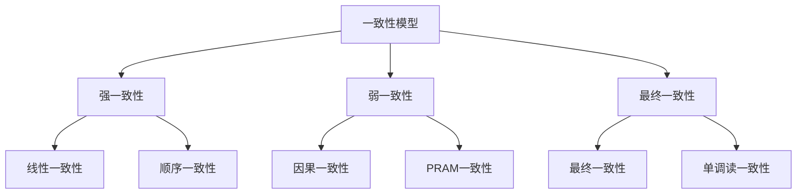
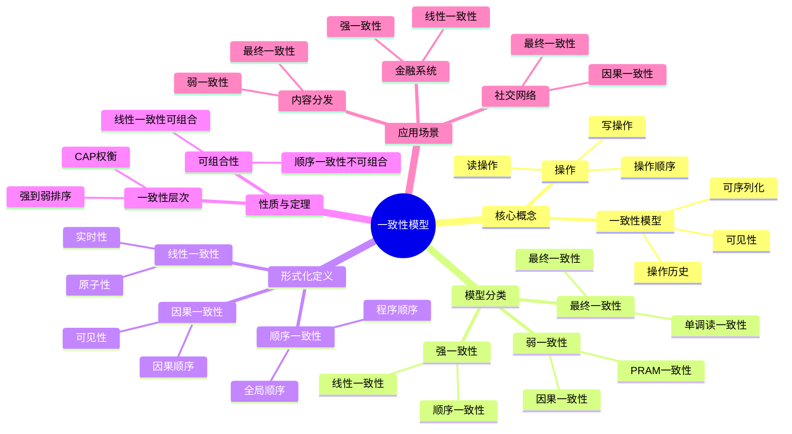
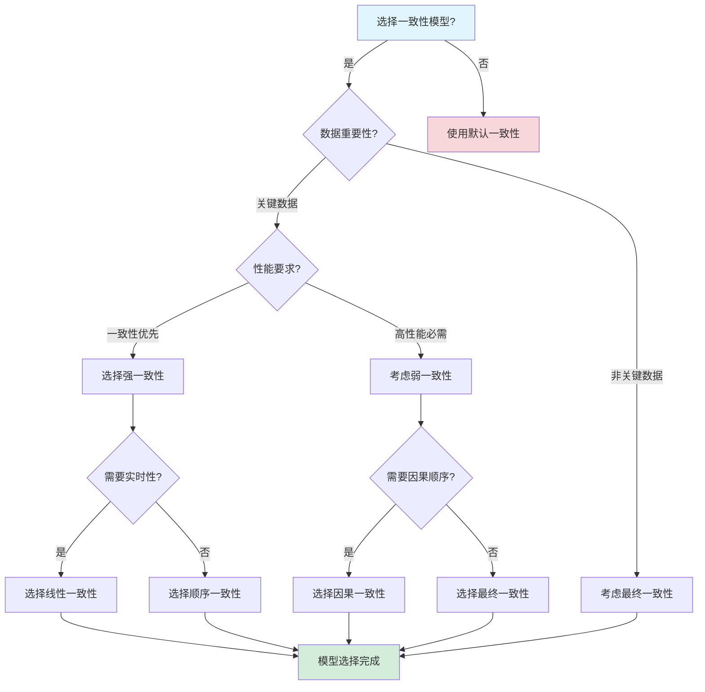
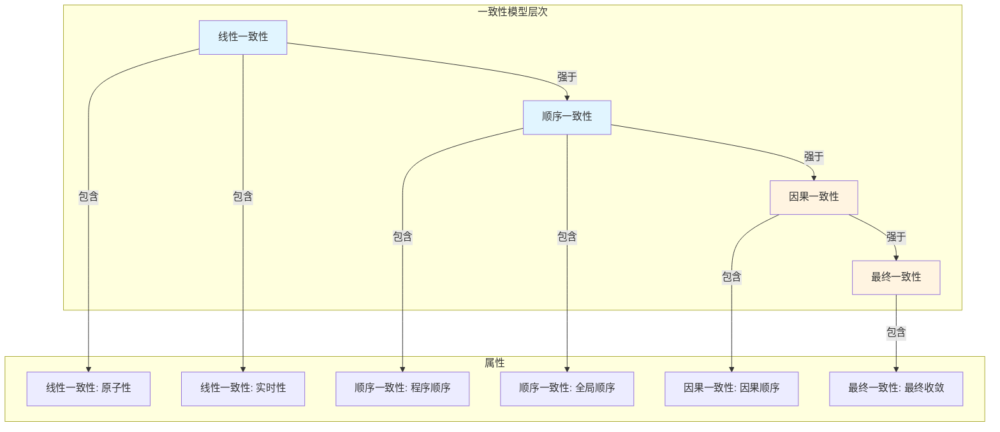
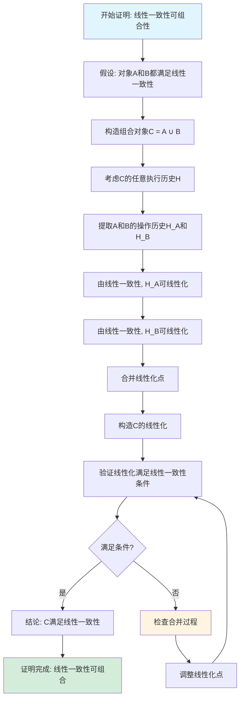

# 一致性模型专题文档

## 目录

- [一致性模型专题文档](#一致性模型专题文档)
  - [目录](#目录)
  - [一、概述](#一概述)
    - [1.1 一致性模型简介](#11-一致性模型简介)
    - [1.2 核心思想](#12-核心思想)
    - [1.3 应用领域](#13-应用领域)
    - [1.4 在本项目中的应用](#14-在本项目中的应用)
  - [二、历史背景](#二历史背景)
    - [2.1 发展历史](#21-发展历史)
    - [2.2 重要人物](#22-重要人物)
    - [2.3 重要里程碑](#23-重要里程碑)
  - [三、核心概念](#三核心概念)
    - [3.1 基本概念](#31-基本概念)
      - [概念1：一致性模型](#概念1一致性模型)
      - [概念2：操作历史](#概念2操作历史)
      - [概念3：可序列化](#概念3可序列化)
    - [3.2 概念关系](#32-概念关系)
  - [四、形式化定义](#四形式化定义)
    - [4.1 数学定义](#41-数学定义)
      - [定义1：操作](#定义1操作)
      - [定义2：操作历史](#定义2操作历史)
    - [4.2 模型定义](#42-模型定义)
      - [定义3：线性一致性（Linearizability）](#定义3线性一致性linearizability)
      - [定义4：顺序一致性（Sequential Consistency）](#定义4顺序一致性sequential-consistency)
      - [定义5：因果一致性（Causal Consistency）](#定义5因果一致性causal-consistency)
      - [定义6：最终一致性（Eventual Consistency）](#定义6最终一致性eventual-consistency)
    - [4.3 语义定义](#43-语义定义)
      - [语义1：线性一致性语义](#语义1线性一致性语义)
  - [五、性质与定理](#五性质与定理)
    - [5.1 基本性质](#51-基本性质)
      - [性质1：一致性模型层次](#性质1一致性模型层次)
      - [性质2：CAP权衡](#性质2cap权衡)
    - [5.2 重要定理](#52-重要定理)
      - [定理1：线性一致性的可组合性](#定理1线性一致性的可组合性)
  - [六、一致性模型分类](#六一致性模型分类)
    - [6.1 强一致性模型](#61-强一致性模型)
      - [6.1.1 线性一致性（Linearizability）](#611-线性一致性linearizability)
      - [6.1.2 顺序一致性（Sequential Consistency）](#612-顺序一致性sequential-consistency)
    - [6.2 弱一致性模型](#62-弱一致性模型)
      - [6.2.1 因果一致性（Causal Consistency）](#621-因果一致性causal-consistency)
      - [6.2.2 PRAM一致性（PRAM Consistency）](#622-pram一致性pram-consistency)
    - [6.3 最终一致性模型](#63-最终一致性模型)
      - [6.3.1 最终一致性（Eventual Consistency）](#631-最终一致性eventual-consistency)
      - [6.3.2 单调读一致性（Monotonic Read Consistency）](#632-单调读一致性monotonic-read-consistency)
  - [七、应用场景](#七应用场景)
    - [7.1 适用场景](#71-适用场景)
      - [场景1：金融系统（强一致性）](#场景1金融系统强一致性)
      - [场景2：社交网络（最终一致性）](#场景2社交网络最终一致性)
      - [场景3：内容分发（弱一致性）](#场景3内容分发弱一致性)
    - [7.2 不适用场景](#72-不适用场景)
      - [场景1：实时系统](#场景1实时系统)
      - [场景2：关键系统](#场景2关键系统)
  - [八、实践案例](#八实践案例)
    - [8.1 工业界案例](#81-工业界案例)
      - [案例1：PostgreSQL（线性一致性）](#案例1postgresql线性一致性)
      - [案例2：Cassandra（最终一致性）](#案例2cassandra最终一致性)
    - [8.2 学术界案例](#82-学术界案例)
      - [案例1：线性一致性理论](#案例1线性一致性理论)
  - [九、学习资源](#九学习资源)
    - [9.1 推荐阅读](#91-推荐阅读)
      - [经典著作](#经典著作)
      - [原始论文](#原始论文)
    - [9.2 学习路径](#92-学习路径)
      - [入门路径（1周）](#入门路径1周)
  - [十、参考文献](#十参考文献)
    - [10.1 经典文献](#101-经典文献)
      - [原始论文](#原始论文-1)
    - [10.2 在线资源](#102-在线资源)
      - [Wikipedia](#wikipedia)
      - [经典著作](#经典著作-1)
  - [十一、思维表征](#十一思维表征)
    - [11.1 知识体系思维导图](#111-知识体系思维导图)
    - [11.2 多维知识对比矩阵](#112-多维知识对比矩阵)
      - [矩阵1：一致性模型对比矩阵](#矩阵1一致性模型对比矩阵)
      - [矩阵2：一致性模型 vs CAP定理](#矩阵2一致性模型-vs-cap定理)
    - [11.3 论证决策树](#113-论证决策树)
      - [决策树1：一致性模型选择决策树](#决策树1一致性模型选择决策树)
    - [11.4 概念属性关系图](#114-概念属性关系图)
    - [11.5 形式化证明流程图](#115-形式化证明流程图)
      - [证明流程图1：线性一致性可组合性证明](#证明流程图1线性一致性可组合性证明)

---

## 一、概述

### 1.1 一致性模型简介

**一致性模型（Consistency Model）** 是分布式系统中定义数据一致性的规则集合。它描述了在分布式系统中，多个副本之间的数据应该如何保持一致。

**来源**：基于Wikipedia [Consistency Model](https://en.wikipedia.org/wiki/Consistency_model) 和相关理论

**核心特点**：

1. **定义规则**：定义数据访问和更新的规则
2. **保证性质**：保证系统的某些性质
3. **权衡选择**：在一致性和性能之间权衡

### 1.2 核心思想

**核心思想1：一致性层次**:

一致性模型形成一个层次结构：

- **强一致性**：线性一致性、顺序一致性
- **弱一致性**：因果一致性、PRAM一致性
- **最终一致性**：最终一致性、单调读一致性

**核心思想2：CAP权衡**:

一致性模型与CAP定理相关：

- **强一致性**：通常选择CP（一致性+分区容错性）
- **弱一致性**：通常选择AP（可用性+分区容错性）

**核心思想3：实际应用**:

不同应用场景需要不同的一致性模型：

- **金融系统**：需要强一致性
- **社交网络**：可以接受最终一致性
- **内容分发**：可以接受弱一致性

### 1.3 应用领域

**应用领域1：分布式数据库**:

- 数据复制
- 一致性保证
- 性能优化

**应用领域2：分布式系统**:

- 系统设计
- 一致性选择
- 性能优化

**应用领域3：云计算**:

- 云存储
- 数据同步
- 服务设计

### 1.4 在本项目中的应用

**在本项目中的应用**：

1. **Temporal的一致性选择**：Temporal使用PostgreSQL提供强一致性（线性一致性）
2. **Saga模式**：支持最终一致性
3. **系统设计指导**：指导一致性模型选择

**相关文档链接**：

- [论证完备性增强](../14-argumentation-enhancement/论证完备性增强.md#12-一致性模型形式化)
- [CAP定理专题文档](CAP定理专题文档.md)

---

## 二、历史背景

### 2.1 发展历史

**1979年**：顺序一致性提出

- **论文**："How to Make a Multiprocessor Computer That Correctly Executes Multiprocess Programs" by Lamport
- **贡献**：提出了顺序一致性模型

**1987年**：线性一致性提出

- **论文**："Linearizability: A Correctness Condition for Concurrent Objects" by Herlihy & Wing
- **贡献**：提出了线性一致性模型

**1990年代**：弱一致性模型

- **因果一致性**：提出因果一致性模型
- **最终一致性**：提出最终一致性模型

**2000年代至今**：持续发展

- **新模型**：提出新的弱一致性模型
- **应用**：广泛应用于分布式系统

**来源**：Wikipedia [Consistency Model](https://en.wikipedia.org/wiki/Consistency_model) 和相关论文

### 2.2 重要人物

**Leslie Lamport**:

- **身份**：顺序一致性的提出者
- **背景**：美国计算机科学家，2013年图灵奖获得者
- **贡献**：
  - 提出顺序一致性
  - 在分布式系统理论方面做出重要贡献

**Maurice Herlihy & Jeannette Wing**:

- **身份**：线性一致性的提出者
- **背景**：美国计算机科学家
- **贡献**：
  - 提出线性一致性
  - 在并发系统理论方面做出重要贡献

**来源**：Wikipedia和相关论文

### 2.3 重要里程碑

| 时间 | 里程碑 | 影响 |
|------|--------|------|
| **1979** | 顺序一致性提出 | 建立一致性模型基础 |
| **1987** | 线性一致性提出 | 建立最强一致性模型 |
| **1990** | 弱一致性模型 | 提供性能优化选择 |
| **2000** | 大规模应用 | 证明一致性模型实用性 |

---

## 三、核心概念

### 3.1 基本概念

#### 概念1：一致性模型

**定义**：一致性模型是定义分布式系统中数据访问和更新规则的集合。

**形式化定义**：

$$ \text{ConsistencyModel} = (R, W, O) $$

其中：

- $R$ 是读操作集合
- $W$ 是写操作集合
- $O$ 是操作顺序关系

**来源**：相关一致性模型理论

#### 概念2：操作历史

**定义**：操作历史是系统中所有操作的序列。

**形式化定义**：

$$ H = (O_1, O_2, ..., O_n) $$

其中每个 $O_i$ 是一个操作。

**来源**：Herlihy & Wing, "Linearizability" (1987)

#### 概念3：可序列化

**定义**：操作历史是可序列化的，如果存在一个等价于该历史的串行执行。

**形式化定义**：

$$ \text{Serializable}(H) \iff \exists H': \text{Equivalent}(H, H') \land \text{Serial}(H') $$

**来源**：相关数据库理论

### 3.2 概念关系

**概念关系图**：

---

## 四、形式化定义

### 4.1 数学定义

#### 定义1：操作

**定义**：操作是一个三元组 $op = (type, key, value)$，其中：

- $type \in \{read, write\}$ 是操作类型
- $key$ 是数据键
- $value$ 是数据值（读操作可能为 $\bot$）

**来源**：Herlihy & Wing, "Linearizability" (1987)

#### 定义2：操作历史

**定义**：操作历史是一个操作序列，每个操作有开始时间和结束时间。

**形式化定义**：

$$ H = \{op_i = (type_i, key_i, value_i, start_i, end_i)\} $$

**来源**：Herlihy & Wing, "Linearizability" (1987)

### 4.2 模型定义

#### 定义3：线性一致性（Linearizability）

**定义**：操作历史是线性一致的，如果存在一个等价于该历史的串行执行，且该执行中每个操作的响应时间都在其实际执行时间范围内。

**形式化定义**：

$$ \text{Linearizable}(H) \iff \exists H': \text{Equivalent}(H, H') \land \text{Serial}(H') \land \text{TimeOrder}(H') $$

**来源**：Herlihy & Wing, "Linearizability" (1987)

#### 定义4：顺序一致性（Sequential Consistency）

**定义**：操作历史是顺序一致的，如果存在一个等价于该历史的串行执行，且该执行中每个进程的操作顺序与其程序顺序一致。

**形式化定义**：

$$ \text{SequentialConsistent}(H) \iff \exists H': \text{Equivalent}(H, H') \land \text{Serial}(H') \land \text{ProgramOrder}(H') $$

**来源**：Lamport, "How to Make a Multiprocessor Computer" (1979)

#### 定义5：因果一致性（Causal Consistency）

**定义**：操作历史是因果一致的，如果所有因果相关的操作在所有进程上以相同的顺序被观察到。

**形式化定义**：

$$ \text{CausalConsistent}(H) \iff \forall p, q: \text{CausalOrder}(op_p, op_q) \implies \text{ObservedOrder}(op_p, op_q) $$

**来源**：相关因果一致性理论

#### 定义6：最终一致性（Eventual Consistency）

**定义**：系统是最终一致的，如果所有副本在没有新的更新时，最终会收敛到相同的值。

**形式化定义**：

$$ \text{EventualConsistent}(S) \iff \forall r_1, r_2: \lim_{t \to \infty} P(\text{Value}_{r_1}(t) = \text{Value}_{r_2}(t)) = 1 $$

**来源**：相关最终一致性理论

### 4.3 语义定义

#### 语义1：线性一致性语义

**定义**：线性一致性要求所有操作看起来像是原子执行的。

**形式化定义**：

$$ \text{Linearizable}(H) = \exists \text{TotalOrder}: \forall op \in H: \text{Atomic}(op) $$

**来源**：Herlihy & Wing, "Linearizability" (1987)

---

## 五、性质与定理

### 5.1 基本性质

#### 性质1：一致性模型层次

**表述**：一致性模型形成一个层次结构。

**形式化表述**：

$$ \text{Linearizability} \implies \text{SequentialConsistency} \implies \text{CausalConsistency} \implies \text{EventualConsistency} $$

**来源**：相关一致性模型理论

#### 性质2：CAP权衡

**表述**：一致性模型与CAP定理相关。

**形式化表述**：

- **强一致性**：通常选择CP（一致性+分区容错性）
- **弱一致性**：通常选择AP（可用性+分区容错性）

**来源**：CAP定理

### 5.2 重要定理

#### 定理1：线性一致性的可组合性

**表述**：如果每个对象都是线性一致的，则整个系统是线性一致的。

**形式化表述**：

$$ \forall obj \in \text{Objects}: \text{Linearizable}(obj) \implies \text{Linearizable}(\text{System}) $$

**来源**：Herlihy & Wing, "Linearizability" (1987)

---

## 六、一致性模型分类

### 6.1 强一致性模型

#### 6.1.1 线性一致性（Linearizability）

**特点**：

- **最强一致性**：所有操作看起来像是原子执行的
- **全局顺序**：存在全局操作顺序
- **实时性**：操作响应时间在其实时执行时间范围内

**应用**：

- **PostgreSQL**：可序列化隔离级别提供线性一致性
- **Temporal**：使用PostgreSQL提供线性一致性

**来源**：Herlihy & Wing, "Linearizability" (1987)

#### 6.1.2 顺序一致性（Sequential Consistency）

**特点**：

- **程序顺序**：每个进程的操作顺序与其程序顺序一致
- **全局顺序**：存在全局操作顺序
- **弱于线性一致性**：不要求实时性

**应用**：

- **多处理器系统**：用于多处理器内存模型
- **分布式系统**：用于某些分布式系统

**来源**：Lamport, "How to Make a Multiprocessor Computer" (1979)

### 6.2 弱一致性模型

#### 6.2.1 因果一致性（Causal Consistency）

**特点**：

- **因果顺序**：保证因果相关的操作顺序
- **非因果操作**：不保证非因果操作的顺序
- **性能优化**：比强一致性性能更好

**应用**：

- **分布式系统**：用于某些分布式系统
- **内容分发**：用于内容分发网络

**来源**：相关因果一致性理论

#### 6.2.2 PRAM一致性（PRAM Consistency）

**特点**：

- **进程顺序**：每个进程的操作顺序一致
- **不同进程**：不同进程的操作顺序可能不同
- **最弱一致性**：最弱的弱一致性模型

**应用**：

- **某些分布式系统**：用于某些特殊场景

**来源**：相关PRAM一致性理论

### 6.3 最终一致性模型

#### 6.3.1 最终一致性（Eventual Consistency）

**特点**：

- **最终收敛**：所有副本最终会收敛到相同的值
- **暂时不一致**：可能暂时不一致
- **高性能**：性能最好

**应用**：

- **Cassandra**：使用最终一致性
- **DynamoDB**：使用最终一致性
- **Saga模式**：支持最终一致性

**来源**：相关最终一致性理论

#### 6.3.2 单调读一致性（Monotonic Read Consistency）

**特点**：

- **单调读**：进程读取的值不会回退
- **最终一致性**：是最终一致性的特例
- **应用场景**：适合某些读多写少的场景

**应用**：

- **某些分布式系统**：用于某些特殊场景

**来源**：相关单调读一致性理论

---

## 七、应用场景

### 7.1 适用场景

#### 场景1：金融系统（强一致性）

**描述**：金融系统需要强一致性保证。

**选择**：

- **线性一致性**：PostgreSQL可序列化隔离
- **保证**：数据一致性和正确性

**示例**：支付系统、银行系统

#### 场景2：社交网络（最终一致性）

**描述**：社交网络可以接受最终一致性。

**选择**：

- **最终一致性**：Cassandra、DynamoDB
- **保证**：高可用性和性能

**示例**：Facebook、Twitter

#### 场景3：内容分发（弱一致性）

**描述**：内容分发可以接受弱一致性。

**选择**：

- **因果一致性**：某些CDN系统
- **保证**：性能和可用性

**示例**：CDN、内容管理系统

### 7.2 不适用场景

#### 场景1：实时系统

**描述**：某些实时系统需要更强的一致性。

**原因**：

- 实时系统需要实时一致性
- 最终一致性可能不满足需求

#### 场景2：关键系统

**描述**：某些关键系统需要强一致性。

**原因**：

- 关键系统不能容忍不一致
- 必须使用强一致性

---

## 八、实践案例

### 8.1 工业界案例

#### 案例1：PostgreSQL（线性一致性）

**背景**：PostgreSQL使用可序列化隔离级别提供线性一致性。

**特点**：

- **线性一致性**：所有操作看起来像是原子执行的
- **ACID保证**：满足ACID属性
- **性能**：性能较好

**效果**：

- 保证了数据一致性
- 适合金融、支付等场景
- 性能可接受

**来源**：PostgreSQL文档

#### 案例2：Cassandra（最终一致性）

**背景**：Cassandra使用最终一致性。

**特点**：

- **最终一致性**：所有副本最终会收敛
- **高可用性**：保证高可用性
- **高性能**：性能很好

**效果**：

- 保证了高可用性
- 适合大规模分布式系统
- 需要处理一致性问题

**来源**：Cassandra文档

### 8.2 学术界案例

#### 案例1：线性一致性理论

**背景**：Herlihy & Wing提出线性一致性理论。

**贡献**：

- 建立了线性一致性理论
- 提供了形式化定义
- 推动了并发系统研究

**来源**：Herlihy & Wing, "Linearizability" (1987)

---

## 九、学习资源

### 9.1 推荐阅读

#### 经典著作

1. **"Designing Data-Intensive Applications"**
   - 作者：Martin Kleppmann
   - 出版社：O'Reilly Media
   - 出版年份：2017
   - **推荐理由**：包含一致性模型的详细讲解

#### 原始论文

1. **"Linearizability: A Correctness Condition for Concurrent Objects"**
   - 作者：Maurice Herlihy, Jeannette Wing
   - 期刊：ACM Transactions on Programming Languages and Systems
   - 年份：1987
   - **推荐理由**：线性一致性的原始论文

2. **"How to Make a Multiprocessor Computer That Correctly Executes Multiprocess Programs"**
   - 作者：Leslie Lamport
   - 年份：1979
   - **推荐理由**：顺序一致性的原始论文

### 9.2 学习路径

#### 入门路径（1周）

1. **Day 1-2**：
   - 阅读一致性模型的基础概念
   - 理解强一致性和弱一致性
   - 理解最终一致性

2. **Day 3-5**：
   - 学习线性一致性和顺序一致性
   - 学习因果一致性和最终一致性
   - 完成实际案例分析

---

## 十、参考文献

### 10.1 经典文献

#### 原始论文

1. **Herlihy, M., & Wing, J. (1987). "Linearizability: A Correctness Condition for Concurrent Objects"**
   - 期刊：ACM Transactions on Programming Languages and Systems
   - **重要性**：线性一致性的原始论文

2. **Lamport, L. (1979). "How to Make a Multiprocessor Computer That Correctly Executes Multiprocess Programs"**
   - **重要性**：顺序一致性的原始论文

### 10.2 在线资源

#### Wikipedia

- [Consistency Model](https://en.wikipedia.org/wiki/Consistency_model)
- [Linearizability](https://en.wikipedia.org/wiki/Linearizability)
- [Sequential Consistency](https://en.wikipedia.org/wiki/Sequential_consistency)

#### 经典著作

- **"Designing Data-Intensive Applications"** by Martin Kleppmann (2017)

---

**文档版本**：1.0

**创建时间**：2024年

**维护者**：项目团队

**最后更新**：2024年

**对标资源**：

- ✅ Wikipedia: [Consistency Model](https://en.wikipedia.org/wiki/Consistency_model)
- ✅ 经典著作: "Designing Data-Intensive Applications" by Kleppmann (2017)
- ✅ 原始论文: "Linearizability" by Herlihy & Wing (1987)
- ✅ 原始论文: "How to Make a Multiprocessor Computer" by Lamport (1979)
- ✅ 大学课程: MIT 6.824, CMU 15-440

---

## 十一、思维表征

### 11.1 知识体系思维导图

**一致性模型知识体系思维导图**：

### 11.2 多维知识对比矩阵

#### 矩阵1：一致性模型对比矩阵

| 一致性模型 | 强度 | 性能 | 可用性 | 适用场景 | 典型系统 |
|-----------|------|------|--------|---------|---------|
| **线性一致性** | ⭐⭐⭐⭐⭐ | ⭐⭐ | ⭐⭐ | 金融系统、关键数据 | PostgreSQL, etcd |
| **顺序一致性** | ⭐⭐⭐⭐ | ⭐⭐⭐ | ⭐⭐⭐ | 多处理器系统 | 共享内存系统 |
| **因果一致性** | ⭐⭐⭐ | ⭐⭐⭐⭐ | ⭐⭐⭐⭐ | 社交网络、协作系统 | Riak, DynamoDB |
| **最终一致性** | ⭐⭐ | ⭐⭐⭐⭐⭐ | ⭐⭐⭐⭐⭐ | 内容分发、CDN | Cassandra, S3 |

#### 矩阵2：一致性模型 vs CAP定理

| 一致性模型 | 一致性C | 可用性A | 分区容错性P | CAP选择 |
|-----------|---------|---------|------------|---------|
| **线性一致性** | ✅ | ❌ | ✅ | CP |
| **顺序一致性** | ✅ | ⚠️ | ✅ | CP |
| **因果一致性** | ⚠️ | ✅ | ✅ | AP |
| **最终一致性** | ❌ | ✅ | ✅ | AP |

### 11.3 论证决策树

#### 决策树1：一致性模型选择决策树

### 11.4 概念属性关系图

**一致性模型核心概念属性关系图**：

### 11.5 形式化证明流程图

#### 证明流程图1：线性一致性可组合性证明

---

**思维表征说明**：

- **思维导图**：全面展示一致性模型的知识体系结构
- **对比矩阵**：从多个维度对比不同一致性模型和CAP选择
- **决策树**：提供清晰的决策路径，帮助选择合适的一致性模型
- **关系图**：详细展示一致性模型层次和属性关系
- **证明流程图**：可视化线性一致性可组合性证明的步骤和逻辑

**来源**：基于一致性模型理论、Herlihy & Wing的著作和实际应用经验
