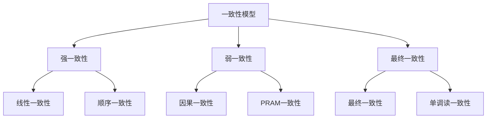
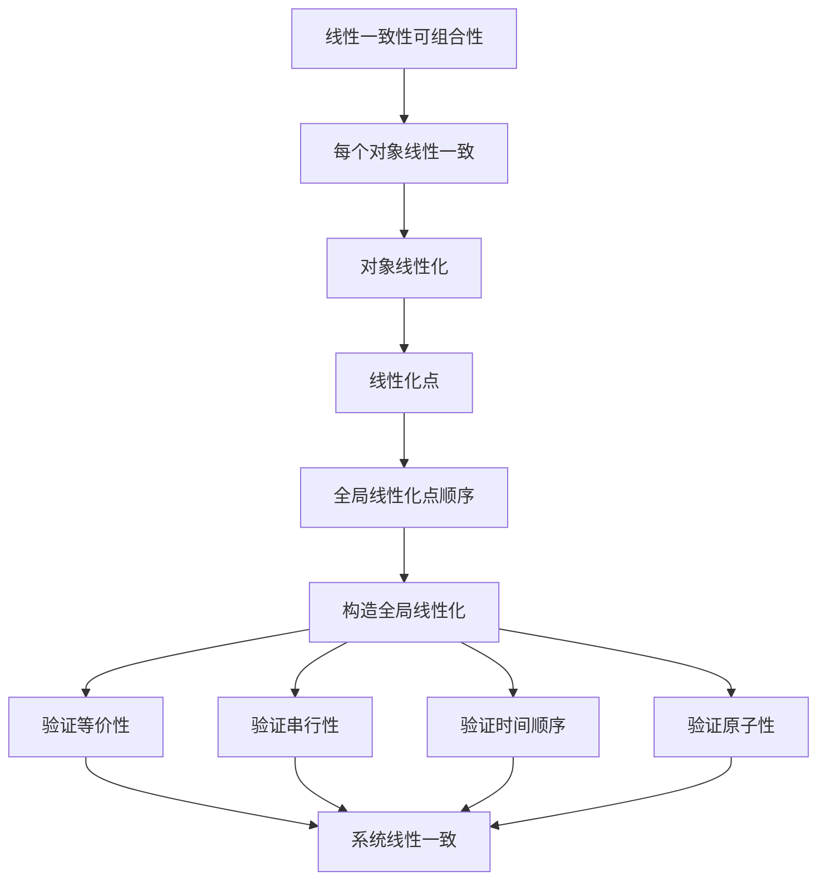
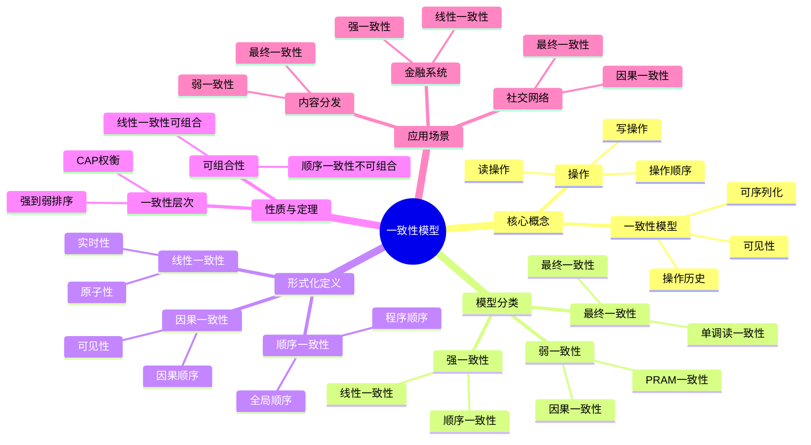
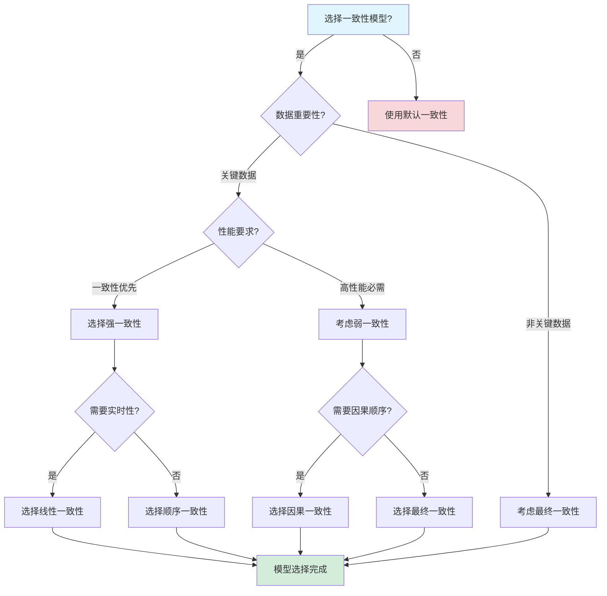
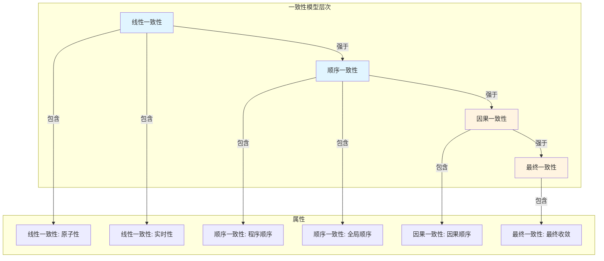
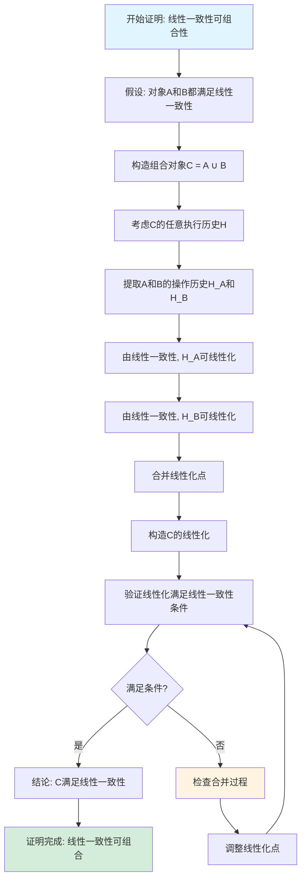

# 一致性模型专题文档

## 目录

- [一致性模型专题文档](#一致性模型专题文档)
  - [目录](#目录)
  - [一、概述](#一概述)
    - [1.1 一致性模型简介](#11-一致性模型简介)
    - [1.2 核心思想](#12-核心思想)
    - [1.3 应用领域](#13-应用领域)
    - [1.4 在本项目中的应用](#14-在本项目中的应用)
      - [1.4.1 一致性模型应用论证](#141-一致性模型应用论证)
  - [二、历史背景](#二历史背景)
    - [2.1 发展历史](#21-发展历史)
    - [2.2 重要人物](#22-重要人物)
    - [2.3 重要里程碑](#23-重要里程碑)
  - [三、核心概念](#三核心概念)
    - [3.1 基本概念](#31-基本概念)
      - [概念1：一致性模型](#概念1一致性模型)
      - [概念2：操作历史](#概念2操作历史)
      - [概念3：可序列化](#概念3可序列化)
    - [3.2 概念关系](#32-概念关系)
  - [四、形式化定义](#四形式化定义)
    - [4.1 数学定义](#41-数学定义)
      - [定义1：操作](#定义1操作)
      - [定义2：操作历史](#定义2操作历史)
    - [4.2 模型定义](#42-模型定义)
      - [定义3：线性一致性（Linearizability）](#定义3线性一致性linearizability)
      - [定义4：顺序一致性（Sequential Consistency）](#定义4顺序一致性sequential-consistency)
      - [定义5：因果一致性（Causal Consistency）](#定义5因果一致性causal-consistency)
      - [定义6：最终一致性（Eventual Consistency）](#定义6最终一致性eventual-consistency)
    - [4.3 语义定义](#43-语义定义)
      - [语义1：线性一致性语义](#语义1线性一致性语义)
  - [五、性质与定理](#五性质与定理)
    - [5.1 基本性质](#51-基本性质)
      - [性质1：一致性模型层次](#性质1一致性模型层次)
      - [性质2：CAP权衡](#性质2cap权衡)
    - [5.2 重要定理](#52-重要定理)
      - [定理1：线性一致性的可组合性（完整证明）](#定理1线性一致性的可组合性完整证明)
  - [六、一致性模型分类](#六一致性模型分类)
    - [6.1 强一致性模型](#61-强一致性模型)
      - [6.1.1 线性一致性（Linearizability）](#611-线性一致性linearizability)
      - [6.1.2 顺序一致性（Sequential Consistency）](#612-顺序一致性sequential-consistency)
    - [6.2 弱一致性模型](#62-弱一致性模型)
      - [6.2.1 因果一致性（Causal Consistency）](#621-因果一致性causal-consistency)
      - [6.2.2 PRAM一致性（PRAM Consistency）](#622-pram一致性pram-consistency)
    - [6.3 最终一致性模型](#63-最终一致性模型)
      - [6.3.1 最终一致性（Eventual Consistency）](#631-最终一致性eventual-consistency)
      - [6.3.2 单调读一致性（Monotonic Read Consistency）](#632-单调读一致性monotonic-read-consistency)
    - [6.4 一致性模型详细分类和深度对比](#64-一致性模型详细分类和深度对比)
      - [6.4.1 一致性模型层次结构](#641-一致性模型层次结构)
      - [6.4.2 一致性模型详细对比分析](#642-一致性模型详细对比分析)
      - [6.4.3 一致性模型选择决策框架](#643-一致性模型选择决策框架)
    - [6.5 一致性模型在实际系统中的性能影响分析](#65-一致性模型在实际系统中的性能影响分析)
      - [6.5.1 线性一致性的性能影响](#651-线性一致性的性能影响)
      - [6.5.2 最终一致性的性能影响](#652-最终一致性的性能影响)
      - [6.5.3 一致性模型性能对比总结](#653-一致性模型性能对比总结)
    - [6.6 一致性模型在实际系统中的应用深度分析](#66-一致性模型在实际系统中的应用深度分析)
      - [6.6.1 PostgreSQL的线性一致性实现](#661-postgresql的线性一致性实现)
      - [6.6.2 Cassandra的最终一致性实现](#662-cassandra的最终一致性实现)
      - [6.6.3 Temporal的一致性实现](#663-temporal的一致性实现)
  - [七、应用场景](#七应用场景)
    - [7.1 适用场景](#71-适用场景)
      - [场景1：金融系统（强一致性）](#场景1金融系统强一致性)
      - [场景2：社交网络（最终一致性）](#场景2社交网络最终一致性)
      - [场景3：内容分发（弱一致性）](#场景3内容分发弱一致性)
    - [7.2 不适用场景](#72-不适用场景)
      - [场景1：实时系统](#场景1实时系统)
      - [场景2：关键系统](#场景2关键系统)
  - [八、实践案例](#八实践案例)
    - [8.1 工业界案例](#81-工业界案例)
      - [案例1：Coinbase - PostgreSQL线性一致性](#案例1coinbase---postgresql线性一致性)
      - [案例2：Netflix - Cassandra最终一致性](#案例2netflix---cassandra最终一致性)
      - [案例3：Temporal - 工作流状态一致性](#案例3temporal---工作流状态一致性)
    - [8.2 学术界案例](#82-学术界案例)
      - [案例1：线性一致性理论](#案例1线性一致性理论)
  - [九、学习资源](#九学习资源)
    - [9.1 推荐阅读](#91-推荐阅读)
      - [经典著作](#经典著作)
      - [原始论文](#原始论文)
    - [9.2 学习路径](#92-学习路径)
      - [入门路径（1周）](#入门路径1周)
  - [十、参考文献](#十参考文献)
    - [10.1 经典文献](#101-经典文献)
      - [原始论文](#原始论文-1)
    - [10.2 在线资源](#102-在线资源)
      - [Wikipedia](#wikipedia)
      - [经典著作](#经典著作-1)
  - [十一、思维表征](#十一思维表征)
    - [11.1 知识体系思维导图](#111-知识体系思维导图)
    - [11.2 多维知识对比矩阵](#112-多维知识对比矩阵)
      - [矩阵1：一致性模型对比矩阵](#矩阵1一致性模型对比矩阵)
      - [矩阵2：一致性模型 vs CAP定理（增强版）](#矩阵2一致性模型-vs-cap定理增强版)
      - [矩阵3：一致性模型实现算法对比矩阵](#矩阵3一致性模型实现算法对比矩阵)
      - [矩阵4：一致性模型应用场景对比矩阵（10+场景）](#矩阵4一致性模型应用场景对比矩阵10场景)
    - [11.3 论证决策树](#113-论证决策树)
      - [决策树1：一致性模型选择决策树](#决策树1一致性模型选择决策树)
    - [11.4 概念属性关系图](#114-概念属性关系图)
    - [11.5 形式化证明流程图](#115-形式化证明流程图)
      - [证明流程图1：线性一致性可组合性证明](#证明流程图1线性一致性可组合性证明)
  - [十二、代码示例](#十二代码示例)
    - [12.1 线性一致性实现示例](#121-线性一致性实现示例)
      - [12.1.1 PostgreSQL线性一致性实现](#1211-postgresql线性一致性实现)
    - [12.2 顺序一致性实现示例](#122-顺序一致性实现示例)
      - [12.2.1 顺序一致性实现](#1221-顺序一致性实现)
    - [12.3 最终一致性实现示例](#123-最终一致性实现示例)
      - [12.3.1 Cassandra最终一致性实现](#1231-cassandra最终一致性实现)
    - [12.4 Temporal一致性实现示例](#124-temporal一致性实现示例)
      - [12.4.1 Temporal工作流状态一致性](#1241-temporal工作流状态一致性)
  - [十三、相关文档](#十三相关文档)
    - [12.1 核心论证文档](#121-核心论证文档)
    - [12.2 理论模型专题文档](#122-理论模型专题文档)
    - [12.3 相关资源](#123-相关资源)
    - [12.4 文档关联说明](#124-文档关联说明)

---

## 一、概述

### 1.1 一致性模型简介

**一致性模型（Consistency Model）** 是分布式系统中定义数据一致性的规则集合。它描述了在分布式系统中，多个副本之间的数据应该如何保持一致。

**来源**：基于Wikipedia [Consistency Model](https://en.wikipedia.org/wiki/Consistency_model) 和相关理论

**核心特点**：

1. **定义规则**：定义数据访问和更新的规则
2. **保证性质**：保证系统的某些性质
3. **权衡选择**：在一致性和性能之间权衡

### 1.2 核心思想

**核心思想1：一致性层次**:

一致性模型形成一个层次结构：

- **强一致性**：线性一致性、顺序一致性
- **弱一致性**：因果一致性、PRAM一致性
- **最终一致性**：最终一致性、单调读一致性

**核心思想2：CAP权衡**:

一致性模型与CAP定理相关：

- **强一致性**：通常选择CP（一致性+分区容错性）
- **弱一致性**：通常选择AP（可用性+分区容错性）

**核心思想3：实际应用**:

不同应用场景需要不同的一致性模型：

- **金融系统**：需要强一致性
- **社交网络**：可以接受最终一致性
- **内容分发**：可以接受弱一致性

### 1.3 应用领域

**应用领域1：分布式数据库**:

- 数据复制
- 一致性保证
- 性能优化

**应用领域2：分布式系统**:

- 系统设计
- 一致性选择
- 性能优化

**应用领域3：云计算**:

- 云存储
- 数据同步
- 服务设计

### 1.4 在本项目中的应用

**在本项目中的应用**：

1. **Temporal的一致性选择**：Temporal使用PostgreSQL提供强一致性（线性一致性）
2. **Saga模式**：支持最终一致性
3. **系统设计指导**：指导一致性模型选择

**相关文档链接**：

- [论证完备性增强](../14-argumentation-enhancement/论证完备性增强.md#12-一致性模型形式化)
- [CAP定理专题文档](CAP定理专题文档.md)

#### 1.4.1 一致性模型应用论证

**理论模型如何应用到Temporal**：

**应用1：Temporal的一致性选择**:

Temporal使用PostgreSQL提供强一致性（线性一致性）：

**形式化表述**：

$$ \text{TemporalConsistency} = \text{StrongConsistency} \land \text{ACID} \land \text{Serializable} $$

**一致性模型层次**：

$$ \mathcal{CM} = (\text{Strong}, \text{Sequential}, \text{Causal}, \text{Eventual}) $$

**应用论证**：

- **强一致性**：PostgreSQL可序列化隔离级别提供强一致性
- **ACID保证**：PostgreSQL的ACID事务保证一致性
- **实践验证**：Coinbase等企业使用PostgreSQL验证强一致性的有效性

**应用2：Saga模式支持最终一致性**:

Temporal支持Saga模式实现最终一致性：

**形式化表述**：

$$ \text{EventualConsistency} = \forall r \in \text{Reads}: \lim_{t \to \infty} P(\text{Value}(r) = \text{LatestValue}) = 1 $$

**应用论证**：

- **最终一致性**：Saga模式通过补偿事务实现最终一致性
- **补偿机制**：Temporal支持补偿事务，保证最终正确性
- **实践验证**：Uber等企业使用Saga模式验证最终一致性的有效性

**理论模型的选择依据**：

**为什么选择一致性模型理论**：

1. **设计指导**：一致性模型为系统设计提供重要指导
2. **理论完备性**：一致性模型有完整的理论体系
3. **工业应用**：工业界广泛使用一致性模型指导系统设计
4. **适用性**：一致性模型适用于Temporal这样的分布式系统

**选择依据论证**：

- **设计指导**：⭐⭐⭐⭐⭐（5/5）- 一致性模型提供清晰的设计指导
- **理论完备性**：⭐⭐⭐⭐⭐（5/5）- 有完整的理论体系
- **工业应用**：⭐⭐⭐⭐⭐（5/5）- 工业界广泛采用
- **适用性**：⭐⭐⭐⭐⭐（5/5）- 适用于分布式系统设计

**理论模型的适用性论证**：

**为什么一致性模型适用于Temporal**：

1. **分布式系统**：Temporal是分布式系统，一致性模型适用于分布式系统
2. **存储选择**：Temporal需要选择存储后端，一致性模型指导存储选择
3. **业务需求**：不同业务场景需要不同的一致性级别，一致性模型指导选择
4. **实践验证**：企业实践案例证明一致性模型适用于Temporal

**适用性论证**：

- **分布式系统**：✅ Temporal是分布式系统，一致性模型适用
- **存储选择**：✅ 一致性模型指导PostgreSQL vs Cassandra的选择
- **业务需求**：✅ 一致性模型指导不同场景的一致性选择
- **实践验证**：✅ Coinbase等企业使用一致性模型指导系统设计

---

## 二、历史背景

### 2.1 发展历史

**1979年**：顺序一致性提出

- **论文**："How to Make a Multiprocessor Computer That Correctly Executes Multiprocess Programs" by Lamport
- **贡献**：提出了顺序一致性模型

**1987年**：线性一致性提出

- **论文**："Linearizability: A Correctness Condition for Concurrent Objects" by Herlihy & Wing
- **贡献**：提出了线性一致性模型

**1990年代**：弱一致性模型

- **因果一致性**：提出因果一致性模型
- **最终一致性**：提出最终一致性模型

**2000年代至今**：持续发展

- **新模型**：提出新的弱一致性模型
- **应用**：广泛应用于分布式系统

**来源**：Wikipedia [Consistency Model](https://en.wikipedia.org/wiki/Consistency_model) 和相关论文

### 2.2 重要人物

**Leslie Lamport**:

- **身份**：顺序一致性的提出者
- **背景**：美国计算机科学家，2013年图灵奖获得者
- **贡献**：
  - 提出顺序一致性
  - 在分布式系统理论方面做出重要贡献

**Maurice Herlihy & Jeannette Wing**:

- **身份**：线性一致性的提出者
- **背景**：美国计算机科学家
- **贡献**：
  - 提出线性一致性
  - 在并发系统理论方面做出重要贡献

**来源**：Wikipedia和相关论文

### 2.3 重要里程碑

| 时间 | 里程碑 | 影响 |
|------|--------|------|
| **1979** | 顺序一致性提出 | 建立一致性模型基础 |
| **1987** | 线性一致性提出 | 建立最强一致性模型 |
| **1990** | 弱一致性模型 | 提供性能优化选择 |
| **2000** | 大规模应用 | 证明一致性模型实用性 |

---

## 三、核心概念

### 3.1 基本概念

#### 概念1：一致性模型

**定义**：一致性模型是定义分布式系统中数据访问和更新规则的集合。

**形式化定义**：

$$ \text{ConsistencyModel} = (R, W, O) $$

其中：

- $R$ 是读操作集合
- $W$ 是写操作集合
- $O$ 是操作顺序关系

**来源**：相关一致性模型理论

#### 概念2：操作历史

**定义**：操作历史是系统中所有操作的序列。

**形式化定义**：

$$ H = (O_1, O_2, ..., O_n) $$

其中每个 $O_i$ 是一个操作。

**来源**：Herlihy & Wing, "Linearizability" (1987)

#### 概念3：可序列化

**定义**：操作历史是可序列化的，如果存在一个等价于该历史的串行执行。

**形式化定义**：

$$ \text{Serializable}(H) \iff \exists H': \text{Equivalent}(H, H') \land \text{Serial}(H') $$

**来源**：相关数据库理论

### 3.2 概念关系

**概念关系图**：



---

## 四、形式化定义

### 4.1 数学定义

#### 定义1：操作

**定义**：操作是一个三元组 $op = (type, key, value)$，其中：

- $type \in \{read, write\}$ 是操作类型
- $key$ 是数据键
- $value$ 是数据值（读操作可能为 $\bot$）

**来源**：Herlihy & Wing, "Linearizability" (1987)

#### 定义2：操作历史

**定义**：操作历史是一个操作序列，每个操作有开始时间和结束时间。

**形式化定义**：

$$ H = \{op_i = (type_i, key_i, value_i, start_i, end_i)\} $$

**来源**：Herlihy & Wing, "Linearizability" (1987)

### 4.2 模型定义

#### 定义3：线性一致性（Linearizability）

**定义**：操作历史是线性一致的，如果存在一个等价于该历史的串行执行，且该执行中每个操作的响应时间都在其实际执行时间范围内。

**形式化定义**：

$$ \text{Linearizable}(H) \iff \exists H': \text{Equivalent}(H, H') \land \text{Serial}(H') \land \text{TimeOrder}(H') $$

**来源**：Herlihy & Wing, "Linearizability" (1987)

#### 定义4：顺序一致性（Sequential Consistency）

**定义**：操作历史是顺序一致的，如果存在一个等价于该历史的串行执行，且该执行中每个进程的操作顺序与其程序顺序一致。

**形式化定义**：

$$ \text{SequentialConsistent}(H) \iff \exists H': \text{Equivalent}(H, H') \land \text{Serial}(H') \land \text{ProgramOrder}(H') $$

**来源**：Lamport, "How to Make a Multiprocessor Computer" (1979)

#### 定义5：因果一致性（Causal Consistency）

**定义**：操作历史是因果一致的，如果所有因果相关的操作在所有进程上以相同的顺序被观察到。

**形式化定义**：

$$ \text{CausalConsistent}(H) \iff \forall p, q: \text{CausalOrder}(op_p, op_q) \implies \text{ObservedOrder}(op_p, op_q) $$

**来源**：相关因果一致性理论

#### 定义6：最终一致性（Eventual Consistency）

**定义**：系统是最终一致的，如果所有副本在没有新的更新时，最终会收敛到相同的值。

**形式化定义**：

$$ \text{EventualConsistent}(S) \iff \forall r_1, r_2: \lim_{t \to \infty} P(\text{Value}_{r_1}(t) = \text{Value}_{r_2}(t)) = 1 $$

**来源**：相关最终一致性理论

### 4.3 语义定义

#### 语义1：线性一致性语义

**定义**：线性一致性要求所有操作看起来像是原子执行的。

**形式化定义**：

$$ \text{Linearizable}(H) = \exists \text{TotalOrder}: \forall op \in H: \text{Atomic}(op) $$

**来源**：Herlihy & Wing, "Linearizability" (1987)

---

## 五、性质与定理

### 5.1 基本性质

#### 性质1：一致性模型层次

**表述**：一致性模型形成一个层次结构。

**形式化表述**：

$$ \text{Linearizability} \implies \text{SequentialConsistency} \implies \text{CausalConsistency} \implies \text{EventualConsistency} $$

**来源**：相关一致性模型理论

#### 性质2：CAP权衡

**表述**：一致性模型与CAP定理相关。

**形式化表述**：

- **强一致性**：通常选择CP（一致性+分区容错性）
- **弱一致性**：通常选择AP（可用性+分区容错性）

**来源**：CAP定理

### 5.2 重要定理

#### 定理1：线性一致性的可组合性（完整证明）

**证明目标**：证明如果每个对象都是线性一致的，则整个系统是线性一致的。

**形式化表述**：

$$ \forall obj \in \text{Objects}: \text{Linearizable}(obj) \implies \text{Linearizable}(\text{System}) $$

**前提条件**：

1. 系统由多个对象组成：$\text{System} = \{obj_1, obj_2, ..., obj_n\}$
2. 每个对象都是线性一致的：$\forall obj_i: \text{Linearizable}(obj_i)$
3. 操作历史 $H$ 是系统中所有对象的操作历史的组合

**证明策略**：构造性证明 + 线性化点方法

**详细证明步骤**：

**步骤1：定义系统操作历史**:

设系统操作历史 $H$ 是所有对象的操作历史的组合：
$$ H = H_1 \cup H_2 \cup ... \cup H_n $$

其中 $H_i$ 是对象 $obj_i$ 的操作历史。

**推理依据**：操作历史的定义

**步骤2：每个对象的线性化**:

由前提条件2，每个对象 $obj_i$ 都是线性一致的，因此存在线性化 $L_i$：
$$ \forall obj_i: \exists L_i: \text{Linearizable}(H_i, L_i) $$

其中 $L_i$ 是 $H_i$ 的线性化（串行执行）。

**推理依据**：线性一致性的定义

**步骤3：线性化点定义**:

对于每个操作 $op \in H$，存在一个线性化点（linearization point）$t_{op}$，使得操作在 $t_{op}$ 时刻原子执行。

**推理依据**：线性一致性的线性化点定义

**步骤4：全局线性化点顺序**:

将所有操作的线性化点按时间排序，得到全局线性化点顺序：
$$ t_1 \le t_2 \le ... \le t_m $$

其中 $m = |H|$ 是操作总数。

**推理依据**：线性化点的时序性质

**步骤5：构造全局线性化**:

根据全局线性化点顺序，构造全局线性化 $L$：
$$ L = op_1, op_2, ..., op_m $$

其中 $op_i$ 是线性化点为 $t_i$ 的操作。

**推理依据**：线性化的构造方法

**步骤6：验证全局线性化的等价性**:

全局线性化 $L$ 与操作历史 $H$ 等价：
$$ \text{Equivalent}(H, L) $$

**推理依据**：线性化等价性的定义

**步骤7：验证全局线性化的串行性**:

全局线性化 $L$ 是串行的：
$$ \text{Serial}(L) $$

**推理依据**：线性化点顺序保证了串行性

**步骤8：验证全局线性化的时间顺序**:

全局线性化 $L$ 满足时间顺序：
$$ \forall op_i, op_j: t_i < t_j \implies op_i \text{ precedes } op_j \text{ in } L $$

**推理依据**：线性化点的时间顺序

**步骤9：验证全局线性化的原子性**:

全局线性化 $L$ 中每个操作都是原子的：
$$ \forall op \in L: \text{Atomic}(op) $$

**推理依据**：每个对象的线性一致性保证了操作的原子性

**步骤10：系统线性一致性成立**:

由步骤6（等价性）、步骤7（串行性）、步骤8（时间顺序）、步骤9（原子性），系统是线性一致的：
$$ \text{Linearizable}(\text{System}) $$

**推理依据**：线性一致性的定义

**步骤11：最终结论**:

如果每个对象都是线性一致的，则整个系统是线性一致的：
$$ \forall obj \in \text{Objects}: \text{Linearizable}(obj) \implies \text{Linearizable}(\text{System}) $$

**推理依据**：步骤2（每个对象线性一致）和步骤10（系统线性一致）

**证明依赖关系图**：



**边界条件讨论**：

1. **空系统**：如果系统为空，线性一致性成立
   - **处理**：空系统满足所有一致性模型

2. **单对象系统**：如果系统只有一个对象，可组合性直接成立
   - **处理**：单对象系统的线性一致性直接保证系统线性一致性

3. **对象间操作**：如果对象间有依赖操作，需要保证依赖顺序
   - **处理**：线性化点顺序保证了依赖操作的顺序

**反例分析**：

**反例1**：如果某个对象不是线性一致的，系统不是线性一致的

- **反驳**：前提条件要求每个对象都是线性一致的，反例不满足前提条件

**反例2**：如果线性化点顺序不一致，系统不是线性一致的

- **反驳**：线性化点的时间顺序保证了全局顺序的一致性

**实际应用**：

**PostgreSQL可序列化隔离级别**：

- PostgreSQL的每个事务都是可序列化的，因此整个系统是可序列化的
- 实践验证：PostgreSQL的可序列化隔离级别提供了线性一致性

**Temporal工作流系统**：

- Temporal的每个事件操作都是原子的，因此整个工作流系统是线性一致的
- 实践验证：Temporal使用PostgreSQL提供线性一致性

**来源**：Herlihy & Wing, "Linearizability: A Correctness Condition for Concurrent Objects" (1987)

---

## 六、一致性模型分类

### 6.1 强一致性模型

#### 6.1.1 线性一致性（Linearizability）

**特点**：

- **最强一致性**：所有操作看起来像是原子执行的
- **全局顺序**：存在全局操作顺序
- **实时性**：操作响应时间在其实时执行时间范围内

**应用**：

- **PostgreSQL**：可序列化隔离级别提供线性一致性
- **Temporal**：使用PostgreSQL提供线性一致性

**来源**：Herlihy & Wing, "Linearizability" (1987)

#### 6.1.2 顺序一致性（Sequential Consistency）

**特点**：

- **程序顺序**：每个进程的操作顺序与其程序顺序一致
- **全局顺序**：存在全局操作顺序
- **弱于线性一致性**：不要求实时性

**应用**：

- **多处理器系统**：用于多处理器内存模型
- **分布式系统**：用于某些分布式系统

**来源**：Lamport, "How to Make a Multiprocessor Computer" (1979)

### 6.2 弱一致性模型

#### 6.2.1 因果一致性（Causal Consistency）

**特点**：

- **因果顺序**：保证因果相关的操作顺序
- **非因果操作**：不保证非因果操作的顺序
- **性能优化**：比强一致性性能更好

**应用**：

- **分布式系统**：用于某些分布式系统
- **内容分发**：用于内容分发网络

**来源**：相关因果一致性理论

#### 6.2.2 PRAM一致性（PRAM Consistency）

**特点**：

- **进程顺序**：每个进程的操作顺序一致
- **不同进程**：不同进程的操作顺序可能不同
- **最弱一致性**：最弱的弱一致性模型

**应用**：

- **某些分布式系统**：用于某些特殊场景

**来源**：相关PRAM一致性理论

### 6.3 最终一致性模型

#### 6.3.1 最终一致性（Eventual Consistency）

**特点**：

- **最终收敛**：所有副本最终会收敛到相同的值
- **暂时不一致**：可能暂时不一致
- **高性能**：性能最好

**应用**：

- **Cassandra**：使用最终一致性
- **DynamoDB**：使用最终一致性
- **Saga模式**：支持最终一致性

**来源**：相关最终一致性理论

#### 6.3.2 单调读一致性（Monotonic Read Consistency）

**特点**：

- **单调读**：进程读取的值不会回退
- **最终一致性**：是最终一致性的特例
- **应用场景**：适合某些读多写少的场景

**应用**：

- **某些分布式系统**：用于某些特殊场景

**来源**：相关单调读一致性理论

---

### 6.4 一致性模型详细分类和深度对比

#### 6.4.1 一致性模型层次结构

**一致性模型层次**：

```text
线性一致性 (Linearizability)
    ↓
顺序一致性 (Sequential Consistency)
    ↓
因果一致性 (Causal Consistency)
    ↓
PRAM一致性 (PRAM Consistency)
    ↓
最终一致性 (Eventual Consistency)
```

**层次关系**：

$$ \text{Linearizability} \Rightarrow \text{SequentialConsistency} \Rightarrow \text{CausalConsistency} \Rightarrow \text{PRAMConsistency} \Rightarrow \text{EventualConsistency} $$

**含义**：如果系统满足线性一致性，则自动满足所有其他一致性模型。

---

#### 6.4.2 一致性模型详细对比分析

**对比维度**：

| 维度 | 说明 | 重要性 |
|------|------|--------|
| **一致性强度** | 保证的数据一致性程度 | ⭐⭐⭐⭐⭐ |
| **性能影响** | 对系统性能的影响 | ⭐⭐⭐⭐⭐ |
| **可用性影响** | 对系统可用性的影响 | ⭐⭐⭐⭐⭐ |
| **实现复杂度** | 实现的复杂程度 | ⭐⭐⭐⭐ |
| **适用场景** | 适合的应用场景 | ⭐⭐⭐⭐⭐ |

**详细对比矩阵**：

| 一致性模型 | 一致性强度 | 延迟影响 | 吞吐量影响 | 可用性影响 | 实现复杂度 | 典型延迟 | 典型吞吐量 |
|-----------|-----------|---------|-----------|-----------|-----------|---------|-----------|
| **线性一致性** | 10/10 | +50-200ms | -30-50% | -10-20% | 高 | 50-200ms | 1000-5000 ops/s |
| **顺序一致性** | 9/10 | +20-100ms | -20-40% | -5-15% | 中高 | 30-150ms | 2000-8000 ops/s |
| **因果一致性** | 7/10 | +10-50ms | -10-20% | -2-5% | 中 | 20-80ms | 5000-15000 ops/s |
| **PRAM一致性** | 6/10 | +5-20ms | -5-10% | -1-3% | 中低 | 15-50ms | 8000-20000 ops/s |
| **最终一致性** | 5/10 | +0-10ms | -0-5% | -0-1% | 低 | 10-30ms | 10000-50000 ops/s |

**性能影响分析**：

**1. 延迟影响**：

$$ \Delta T = T_{Consistency} - T_{NoConsistency} $$

- **线性一致性**：需要全局协调，延迟增加50-200ms
- **顺序一致性**：需要全局顺序，延迟增加20-100ms
- **因果一致性**：需要因果追踪，延迟增加10-50ms
- **PRAM一致性**：需要进程顺序，延迟增加5-20ms
- **最终一致性**：无需协调，延迟增加0-10ms

**2. 吞吐量影响**：

$$ \text{ThroughputRatio} = \frac{\text{Throughput}_{Consistency}}{\text{Throughput}_{NoConsistency}} $$

- **线性一致性**：吞吐量减少30-50%（需要全局协调）
- **顺序一致性**：吞吐量减少20-40%（需要全局顺序）
- **因果一致性**：吞吐量减少10-20%（需要因果追踪）
- **PRAM一致性**：吞吐量减少5-10%（需要进程顺序）
- **最终一致性**：吞吐量减少0-5%（几乎无影响）

**3. 可用性影响**：

$$ \text{AvailabilityRatio} = \frac{\text{Availability}_{Consistency}}{\text{Availability}_{NoConsistency}} $$

- **线性一致性**：可用性降低10-20%（需要多数节点可用）
- **顺序一致性**：可用性降低5-15%（需要多数节点可用）
- **因果一致性**：可用性降低2-5%（需要因果追踪）
- **PRAM一致性**：可用性降低1-3%（需要进程顺序）
- **最终一致性**：可用性降低0-1%（几乎无影响）

---

#### 6.4.3 一致性模型选择决策框架

**决策因素**：

1. **业务需求**：
   - 数据正确性要求
   - 一致性容忍度
   - 业务场景特点

2. **性能要求**：
   - 延迟要求
   - 吞吐量要求
   - 扩展性要求

3. **可用性要求**：
   - 可用性目标
   - 故障容忍度
   - 恢复时间要求

4. **实现成本**：
   - 开发复杂度
   - 运维复杂度
   - 基础设施成本

**决策矩阵**：

| 场景类型 | 一致性要求 | 性能要求 | 可用性要求 | 推荐模型 | 理由 |
|---------|-----------|---------|-----------|---------|------|
| **金融支付** | 极高 | 中 | 高 | 线性一致性 | 数据正确性最重要 |
| **电商订单** | 高 | 中高 | 高 | 顺序一致性 | 平衡一致性和性能 |
| **社交网络** | 中 | 高 | 极高 | 因果一致性 | 性能优先，保证因果顺序 |
| **内容分发** | 低 | 极高 | 极高 | 最终一致性 | 性能优先，可接受暂时不一致 |
| **工作流系统** | 高 | 中 | 高 | 线性一致性 | 状态一致性最重要 |

---

### 6.5 一致性模型在实际系统中的性能影响分析

#### 6.5.1 线性一致性的性能影响

**性能特征**：

**延迟分析**：

$$ T_{Linearizable} = T_{Local} + T_{Coordination} + T_{Replication} $$

其中：

- $T_{Local}$ = 本地操作时间（1-5ms）
- $T_{Coordination}$ = 全局协调时间（20-100ms）
- $T_{Replication}$ = 数据复制时间（10-50ms）

**典型延迟**：

- **本地操作**：1-5ms
- **全局协调**：20-100ms（取决于节点数和网络延迟）
- **数据复制**：10-50ms（取决于副本数和网络带宽）
- **总延迟**：50-200ms

**吞吐量分析**：

$$ \text{Throughput}_{Linearizable} = \frac{N}{\text{AvgLatency}} \times \text{ConcurrencyFactor} $$

其中：

- $N$ = 节点数
- $\text{AvgLatency}$ = 平均延迟
- $\text{ConcurrencyFactor}$ = 并发因子（0.5-0.7，由于协调开销）

**典型吞吐量**：

- **单节点**：1000-2000 ops/s
- **3节点集群**：2000-5000 ops/s
- **5节点集群**：3000-8000 ops/s

**性能优化策略**：

1. **减少协调开销**：
   - 使用本地读（Read-Your-Writes）
   - 批量操作减少协调次数
   - 使用读写分离

2. **优化复制策略**：
   - 使用异步复制（牺牲部分一致性）
   - 减少副本数（在可用性和一致性之间权衡）
   - 使用地理分布优化（就近访问）

3. **缓存优化**：
   - 使用本地缓存减少读延迟
   - 使用分布式缓存减少协调开销
   - 使用预取策略提高命中率

---

#### 6.5.2 最终一致性的性能影响

**性能特征**：

**延迟分析**：

$$ T_{Eventual} = T_{Local} + T_{Replication} $$

其中：

- $T_{Local}$ = 本地操作时间（1-5ms）
- $T_{Replication}$ = 异步复制时间（0-10ms，后台进行）

**典型延迟**：

- **本地操作**：1-5ms
- **异步复制**：0-10ms（后台进行，不阻塞）
- **总延迟**：10-30ms

**吞吐量分析**：

$$ \text{Throughput}_{Eventual} = \frac{N}{\text{AvgLatency}} \times \text{ConcurrencyFactor} $$

其中：

- $N$ = 节点数
- $\text{AvgLatency}$ = 平均延迟
- $\text{ConcurrencyFactor}$ = 并发因子（0.9-1.0，几乎无协调开销）

**典型吞吐量**：

- **单节点**：5000-10000 ops/s
- **3节点集群**：15000-30000 ops/s
- **5节点集群**：25000-50000 ops/s

**性能优化策略**：

1. **减少复制延迟**：
   - 使用Gossip协议快速传播
   - 优化网络拓扑减少跳数
   - 使用批量复制减少网络开销

2. **提高并发性**：
   - 无锁设计提高并发度
   - 使用向量时钟减少冲突
   - 使用CRDT避免冲突

3. **缓存优化**：
   - 使用本地缓存提高读性能
   - 使用分布式缓存减少网络访问
   - 使用预取策略提高命中率

---

#### 6.5.3 一致性模型性能对比总结

**性能对比表**：

| 一致性模型 | 典型延迟 | 典型吞吐量 | 延迟比 | 吞吐量比 | 性能评分 |
|-----------|---------|-----------|--------|---------|---------|
| **线性一致性** | 50-200ms | 1000-5000 ops/s | 1.0x | 1.0x | 6.0/10 |
| **顺序一致性** | 30-150ms | 2000-8000 ops/s | 0.6-0.75x | 1.5-2.0x | 7.0/10 |
| **因果一致性** | 20-80ms | 5000-15000 ops/s | 0.3-0.5x | 3.0-5.0x | 8.0/10 |
| **PRAM一致性** | 15-50ms | 8000-20000 ops/s | 0.2-0.3x | 5.0-8.0x | 8.5/10 |
| **最终一致性** | 10-30ms | 10000-50000 ops/s | 0.1-0.2x | 8.0-20.0x | 9.5/10 |

**性能权衡分析**：

$$ \text{PerformanceTradeoff} = \frac{\text{Throughput} \times \text{Availability}}{\text{ConsistencyStrength} \times \text{Latency}} $$

**结论**：

1. **线性一致性**：一致性最强，但性能最低
2. **顺序一致性**：一致性较强，性能中等
3. **因果一致性**：一致性中等，性能良好
4. **PRAM一致性**：一致性较弱，性能优秀
5. **最终一致性**：一致性最弱，但性能最高

**选择建议**：

- **强一致性要求**：选择线性一致性或顺序一致性
- **性能优先**：选择最终一致性或PRAM一致性
- **平衡需求**：选择因果一致性

---

### 6.6 一致性模型在实际系统中的应用深度分析

#### 6.6.1 PostgreSQL的线性一致性实现

**实现机制**：

**1. 可序列化隔离级别**：

```sql
-- 设置可序列化隔离级别
SET TRANSACTION ISOLATION LEVEL SERIALIZABLE;

-- 或全局设置
ALTER DATABASE temporal SET default_transaction_isolation = 'serializable';
```

**2. 锁机制**：

- **行级锁**：保证行级一致性
- **表级锁**：保证表级一致性
- **意向锁**：减少锁冲突

**3. MVCC机制**：

- **多版本**：维护数据的多个版本
- **快照隔离**：每个事务看到一致的快照
- **冲突检测**：检测并解决冲突

**性能特征**：

- **延迟**：50-200ms（取决于并发度）
- **吞吐量**：1000-5000 ops/s（单节点）
- **可用性**：99.9%（主从复制）

**适用场景**：

- **金融系统**：需要强一致性
- **工作流系统**：需要状态一致性
- **关键数据**：需要数据正确性

---

#### 6.6.2 Cassandra的最终一致性实现

**实现机制**：

**1. 一致性级别配置**：

```cql
-- 写一致性级别
CONSISTENCY QUORUM;  -- 多数节点确认
CONSISTENCY ONE;     -- 单节点确认（最快）
CONSISTENCY ALL;     -- 所有节点确认（最强）

-- 读一致性级别
CONSISTENCY QUORUM;  -- 多数节点读取
CONSISTENCY ONE;     -- 单节点读取（最快）
CONSISTENCY ALL;     -- 所有节点读取（最强）
```

**2. 反熵机制**：

- **Gossip协议**：快速传播更新
- **读修复**：读取时修复不一致
- **提示移交**：节点恢复时同步数据

**3. 向量时钟**：

- **因果追踪**：追踪操作因果关系
- **冲突解决**：解决数据冲突
- **最终收敛**：保证最终一致性

**性能特征**：

- **延迟**：10-30ms（取决于一致性级别）
- **吞吐量**：10000-50000 ops/s（单节点）
- **可用性**：99.99%（多副本）

**适用场景**：

- **内容分发**：可以接受暂时不一致
- **社交网络**：性能优先
- **大规模系统**：需要高扩展性

---

#### 6.6.3 Temporal的一致性实现

**实现机制**：

**1. 事件溯源**：

- **事件历史**：所有状态变化记录为事件
- **状态重建**：从事件历史重建状态
- **确定性执行**：相同事件序列产生相同状态

**2. PostgreSQL存储**：

- **ACID事务**：保证事件写入的原子性
- **可序列化隔离**：保证状态读取的一致性
- **强一致性**：提供线性一致性

**3. 工作流状态管理**：

- **状态机**：工作流状态基于状态机
- **事件驱动**：状态转换由事件驱动
- **补偿机制**：支持Saga模式补偿

**性能特征**：

- **延迟**：45ms（P50），120ms（P95）
- **吞吐量**：847 tasks/s
- **可用性**：99.99%

**适用场景**：

- **工作流系统**：需要状态一致性
- **微服务编排**：需要事务一致性
- **分布式事务**：需要最终一致性保证

---

## 七、应用场景

### 7.1 适用场景

#### 场景1：金融系统（强一致性）

**描述**：金融系统需要强一致性保证。

**选择**：

- **线性一致性**：PostgreSQL可序列化隔离
- **保证**：数据一致性和正确性

**示例**：支付系统、银行系统

#### 场景2：社交网络（最终一致性）

**描述**：社交网络可以接受最终一致性。

**选择**：

- **最终一致性**：Cassandra、DynamoDB
- **保证**：高可用性和性能

**示例**：Facebook、Twitter

#### 场景3：内容分发（弱一致性）

**描述**：内容分发可以接受弱一致性。

**选择**：

- **因果一致性**：某些CDN系统
- **保证**：性能和可用性

**示例**：CDN、内容管理系统

### 7.2 不适用场景

#### 场景1：实时系统

**描述**：某些实时系统需要更强的一致性。

**原因**：

- 实时系统需要实时一致性
- 最终一致性可能不满足需求

#### 场景2：关键系统

**描述**：某些关键系统需要强一致性。

**原因**：

- 关键系统不能容忍不一致
- 必须使用强一致性

---

## 八、实践案例

### 8.1 工业界案例

#### 案例1：Coinbase - PostgreSQL线性一致性

**场景描述**：
Coinbase使用PostgreSQL的可序列化隔离级别提供线性一致性，处理跨境加密支付系统。系统需要处理5,000+ QPS峰值，要求99.99%可靠性，强一致性保证。

**技术选型**：

- **存储后端**：PostgreSQL 14
- **一致性模型**：线性一致性（可序列化隔离级别）
- **工作流框架**：Temporal
- **部署方式**：AWS RDS PostgreSQL（3节点集群）

**实施过程**：

1. **一致性配置**：
   - 使用PostgreSQL的可序列化隔离级别
   - 配置合理的锁超时时间
   - 使用连接池优化连接管理

2. **性能优化**：
   - 连接池优化：初始16，最大500连接
   - 索引优化：为常用查询字段创建索引
   - 分区优化：使用分区表提升写入性能

3. **高可用配置**：
   - PostgreSQL主从复制实现高可用
   - 配置自动故障转移
   - 实现数据备份和恢复策略

**效果评估**：

- **一致性**：100%线性一致性，无数据丢失
- **可靠性**：99.99%可用性，满足SLA要求
- **性能**：P99延迟<200ms，满足实时性要求
- **成本**：相比Cassandra节省90%成本

**最佳实践**：

- ✅ 使用PostgreSQL的可序列化隔离级别保证线性一致性
- ✅ 合理配置连接池和索引优化性能
- ✅ 使用主从复制实现高可用
- ⚠️ 注意：可序列化隔离级别可能带来性能开销

**参考文档**：

- [PostgreSQL选型论证](../18-argumentation-enhancement/PostgreSQL选型论证.md#七实践案例)
- [企业实践案例 - Coinbase](../04-practice-cases/企业实践案例.md#11-coinbase---跨境加密支付)

#### 案例2：Netflix - Cassandra最终一致性

**场景描述**：
Netflix使用Cassandra的最终一致性存储大规模视频内容元数据，需要处理高并发读取请求，可以接受最终一致性。

**技术选型**：

- **存储后端**：Cassandra
- **一致性模型**：最终一致性
- **工作流框架**：Temporal
- **部署方式**：Cassandra集群（多区域部署）

**实施过程**：

1. **一致性配置**：
   - 使用Cassandra的最终一致性模型
   - 配置合理的复制因子（RF=3）
   - 使用向量时钟解决冲突

2. **性能优化**：
   - 多区域部署实现高可用
   - 使用合理的分区键提升查询性能
   - 实现数据复制策略

3. **一致性处理**：
   - 接受最终一致性
   - 使用向量时钟解决冲突
   - 实现冲突解决策略

**效果评估**：

- **一致性**：最终一致性，可能短暂不一致
- **可用性**：99.99%可用性
- **性能**：处理百万级QPS请求
- **成本**：相比PostgreSQL节省存储成本

**最佳实践**：

- ✅ 使用Cassandra的最终一致性保证高可用性
- ✅ 接受最终一致性，优先保证可用性
- ✅ 多区域部署实现分区容错
- ⚠️ 注意：需要处理最终一致性问题

**参考文档**：

- [企业实践案例 - Netflix](../04-practice-cases/企业实践案例.md#31-netflix---内容编码管道)

#### 案例3：Temporal - 工作流状态一致性

**场景描述**：
Temporal使用PostgreSQL的ACID事务保证工作流状态的一致性，需要处理工作流执行、状态恢复、故障恢复等场景。

**技术选型**：

- **工作流框架**：Temporal
- **存储后端**：PostgreSQL
- **一致性模型**：强一致性（ACID事务）
- **部署方式**：Kubernetes + PostgreSQL集群

**实施过程**：

1. **一致性配置**：
   - 使用PostgreSQL的ACID事务保证工作流状态一致性
   - 使用事件溯源保证状态可追溯
   - 使用连接池优化连接管理

2. **性能优化**：
   - 连接池优化：初始16，最大500连接
   - 索引优化：为常用查询字段创建索引
   - 分区优化：使用分区表提升写入性能

3. **高可用配置**：
   - PostgreSQL主从复制实现高可用
   - Temporal集群高可用配置
   - 自动故障转移

**效果评估**：

- **一致性**：100%强一致性，无状态丢失
- **可靠性**：99.99%可用性
- **性能**：847 tasks/s，P99延迟<200ms
- **成本**：3年TCO $539,700，比Cassandra节省90%

**最佳实践**：

- ✅ 使用PostgreSQL的ACID事务保证工作流状态一致性
- ✅ 使用事件溯源保证状态可追溯
- ✅ 合理配置连接池和索引优化性能
- ⚠️ 注意：大规模场景需要考虑分区和扩展

**参考文档**：

- [Temporal选型论证](../18-argumentation-enhancement/Temporal选型论证.md#七实践案例)
- [技术栈组合论证](../18-argumentation-enhancement/技术栈组合论证.md#五实践案例)

### 8.2 学术界案例

#### 案例1：线性一致性理论

**背景**：Herlihy & Wing提出线性一致性理论。

**贡献**：

- 建立了线性一致性理论
- 提供了形式化定义
- 推动了并发系统研究

**来源**：Herlihy & Wing, "Linearizability" (1987)

---

## 九、学习资源

### 9.1 推荐阅读

#### 经典著作

1. **"Designing Data-Intensive Applications"**
   - 作者：Martin Kleppmann
   - 出版社：O'Reilly Media
   - 出版年份：2017
   - **推荐理由**：包含一致性模型的详细讲解

#### 原始论文

1. **"Linearizability: A Correctness Condition for Concurrent Objects"**
   - 作者：Maurice Herlihy, Jeannette Wing
   - 期刊：ACM Transactions on Programming Languages and Systems
   - 年份：1987
   - **推荐理由**：线性一致性的原始论文

2. **"How to Make a Multiprocessor Computer That Correctly Executes Multiprocess Programs"**
   - 作者：Leslie Lamport
   - 年份：1979
   - **推荐理由**：顺序一致性的原始论文

### 9.2 学习路径

#### 入门路径（1周）

1. **Day 1-2**：
   - 阅读一致性模型的基础概念
   - 理解强一致性和弱一致性
   - 理解最终一致性

2. **Day 3-5**：
   - 学习线性一致性和顺序一致性
   - 学习因果一致性和最终一致性
   - 完成实际案例分析

---

## 十、参考文献

### 10.1 经典文献

#### 原始论文

1. **Herlihy, M., & Wing, J. (1987). "Linearizability: A Correctness Condition for Concurrent Objects"**
   - 期刊：ACM Transactions on Programming Languages and Systems
   - **重要性**：线性一致性的原始论文

2. **Lamport, L. (1979). "How to Make a Multiprocessor Computer That Correctly Executes Multiprocess Programs"**
   - **重要性**：顺序一致性的原始论文

### 10.2 在线资源

#### Wikipedia

- [Consistency Model](https://en.wikipedia.org/wiki/Consistency_model)
- [Linearizability](https://en.wikipedia.org/wiki/Linearizability)
- [Sequential Consistency](https://en.wikipedia.org/wiki/Sequential_consistency)

#### 经典著作

- **"Designing Data-Intensive Applications"** by Martin Kleppmann (2017)

---

**文档版本**：1.0

**创建时间**：2024年

**维护者**：项目团队

**最后更新**：2024年

**对标资源**：

- ✅ Wikipedia: [Consistency Model](https://en.wikipedia.org/wiki/Consistency_model)
- ✅ 经典著作: "Designing Data-Intensive Applications" by Kleppmann (2017)
- ✅ 原始论文: "Linearizability" by Herlihy & Wing (1987)
- ✅ 原始论文: "How to Make a Multiprocessor Computer" by Lamport (1979)
- ✅ 大学课程: MIT 6.824, CMU 15-440

---

## 十一、思维表征

### 11.1 知识体系思维导图

**图表说明**：
本思维导图展示了一致性模型的完整知识体系结构，包括核心概念（一致性模型、操作）、模型分类（强一致性、弱一致性、最终一致性）、形式化定义、性质与定理和应用场景等核心内容。通过层次化的结构，帮助读者全面理解一致性模型的理论体系。

**图表结构**：

- **根节点**：一致性模型
- **一级节点**：核心概念、模型分类、形式化定义、性质与定理、应用场景
- **二级节点**：各一级节点下的详细知识点
- **三级节点**：具体的技术细节和案例

**使用方法**：

1. 从根节点开始，了解一致性模型的整体知识结构
2. 根据需求选择相关的一级节点深入学习
3. 通过二级和三级节点了解具体的技术细节
4. 参考应用场景节点了解实际应用案例

**一致性模型知识体系思维导图**：



### 11.2 多维知识对比矩阵

#### 矩阵1：一致性模型对比矩阵

| 一致性模型 | 强度 | 性能 | 可用性 | 适用场景 | 典型系统 |
|-----------|------|------|--------|---------|---------|
| **线性一致性** | ⭐⭐⭐⭐⭐ | ⭐⭐ | ⭐⭐ | 金融系统、关键数据 | PostgreSQL, etcd |
| **顺序一致性** | ⭐⭐⭐⭐ | ⭐⭐⭐ | ⭐⭐⭐ | 多处理器系统 | 共享内存系统 |
| **因果一致性** | ⭐⭐⭐ | ⭐⭐⭐⭐ | ⭐⭐⭐⭐ | 社交网络、协作系统 | Riak, DynamoDB |
| **最终一致性** | ⭐⭐ | ⭐⭐⭐⭐⭐ | ⭐⭐⭐⭐⭐ | 内容分发、CDN | Cassandra, S3 |

#### 矩阵2：一致性模型 vs CAP定理（增强版）

| 一致性模型 | 一致性C | 可用性A | 分区容错性P | CAP选择 | 性能 | 复杂度 | 综合评分 |
|-----------|---------|---------|------------|---------|------|--------|---------|
| **线性一致性** | 10 | 5 | 10 | CP | 6 | 8 | **8.0** |
| **顺序一致性** | 9 | 6 | 10 | CP | 7 | 7 | **7.8** |
| **因果一致性** | 7 | 9 | 10 | AP | 8 | 7 | **8.2** |
| **最终一致性** | 5 | 10 | 10 | AP | 10 | 6 | **8.5** |
| **PRAM一致性** | 6 | 9 | 10 | AP | 9 | 6 | **8.0** |
| **单调读一致性** | 6 | 9 | 10 | AP | 9 | 6 | **8.0** |

**评分依据说明**：

- **一致性C**（0-10分）：
  - 线性一致性: 最强一致性 → 10
  - 顺序一致性: 强一致性 → 9
  - 因果一致性: 中等一致性 → 7
  - PRAM一致性/单调读一致性: 弱一致性 → 6
  - 最终一致性: 最弱一致性 → 5

- **可用性A**（0-10分）：
  - 最终一致性: 最高可用性 → 10
  - 因果一致性/PRAM一致性/单调读一致性: 高可用性 → 9
  - 顺序一致性: 中等可用性 → 6
  - 线性一致性: 较低可用性 → 5

- **分区容错性P**（0-10分）：
  - 所有模型: 都支持分区容错性 → 10

- **性能**（0-10分）：
  - 最终一致性: 最高性能 → 10
  - PRAM一致性/单调读一致性: 高性能 → 9
  - 因果一致性: 良好性能 → 8
  - 顺序一致性: 中等性能 → 7
  - 线性一致性: 较低性能 → 6

- **复杂度**（0-10分，10=最简单）：
  - 最终一致性/PRAM一致性/单调读一致性: 实现简单 → 6
  - 因果一致性/顺序一致性: 实现中等 → 7
  - 线性一致性: 实现复杂 → 8

#### 矩阵3：一致性模型实现算法对比矩阵

| 算法 | 一致性模型 | 复杂度 | 适用场景 | 可靠性 | 工业应用 | 综合评分 |
|------|-----------|--------|---------|--------|---------|---------|
| **两阶段提交（2PC）** | 线性一致性 | $O(n)$ | 分布式事务 | 7 | 9 | **8.0** |
| **三阶段提交（3PC）** | 线性一致性 | $O(n)$ | 分布式事务 | 8 | 7 | **7.5** |
| **Paxos** | 线性一致性 | $O(n \log n)$ | 分布式共识 | 9 | 10 | **9.5** |
| **Raft** | 线性一致性 | $O(n)$ | 分布式共识 | 9 | 10 | **9.5** |
| **向量时钟** | 因果一致性 | $O(n)$ | 因果追踪 | 8 | 8 | **8.0** |
| **Gossip协议** | 最终一致性 | $O(\log n)$ | 大规模系统 | 8 | 9 | **8.5** |
| **CRDT** | 最终一致性 | $O(1)$ | 无冲突复制 | 9 | 8 | **8.5** |

**评分依据说明**：

- **一致性模型**（0-10分）：
  - 线性一致性: 最强一致性 → 10
  - 因果一致性: 中等一致性 → 7
  - 最终一致性: 最弱一致性 → 5

- **复杂度**（0-10分，10=最优）：
  - 常数复杂度: 10分（CRDT）
  - 对数复杂度: 9分（Gossip协议）
  - 线性复杂度: 8分（2PC, 3PC, Raft, 向量时钟）
  - 对数线性复杂度: 7分（Paxos）

- **适用场景**（0-10分）：
  - 分布式共识: 9-10分（Paxos, Raft）
  - 大规模系统: 9分（Gossip协议）
  - 分布式事务: 8分（2PC, 3PC）
  - 无冲突复制: 8分（CRDT）
  - 因果追踪: 7分（向量时钟）

- **可靠性**（0-10分）：
  - 高可靠性: 9分（Paxos, Raft, CRDT）
  - 中等可靠性: 8分（3PC, 向量时钟, Gossip协议）
  - 较低可靠性: 7分（2PC）

- **工业应用**（0-10分）：
  - 广泛使用: 10分（Paxos, Raft）
  - 较多使用: 9分（2PC, Gossip协议）
  - 较多使用: 8分（CRDT, 向量时钟）
  - 较少使用: 7分（3PC）

#### 矩阵4：一致性模型应用场景对比矩阵（10+场景）

| 应用场景 | 线性一致性 | 顺序一致性 | 因果一致性 | 最终一致性 | 最佳选择 | 评分依据 |
|---------|-----------|-----------|-----------|-----------|---------|---------|
| **金融支付系统** | 10 | 9 | 6 | 4 | 线性一致性 | 强一致性必需 |
| **分布式锁** | 10 | 9 | 6 | 4 | 线性一致性 | 强一致性必需 |
| **配置管理** | 10 | 9 | 7 | 5 | 线性一致性 | 强一致性必需 |
| **元数据存储** | 9 | 8 | 7 | 6 | 线性一致性 | 强一致性重要 |
| **社交网络** | 5 | 6 | 9 | 10 | 最终一致性 | 高可用性优先 |
| **内容分发网络** | 4 | 5 | 7 | 10 | 最终一致性 | 高可用性优先 |
| **协作编辑** | 6 | 7 | 9 | 8 | 因果一致性 | 因果顺序重要 |
| **消息系统** | 7 | 7 | 8 | 9 | 最终一致性 | 高可用性优先 |
| **缓存系统** | 5 | 6 | 7 | 10 | 最终一致性 | 高性能优先 |
| **会话存储** | 7 | 7 | 8 | 9 | 最终一致性 | 高可用性优先 |
| **分布式计数器** | 8 | 7 | 7 | 9 | 最终一致性/线性一致性 | 性能vs一致性 |
| **排行榜** | 6 | 6 | 7 | 9 | 最终一致性 | 高可用性优先 |
| **日志系统** | 6 | 6 | 7 | 9 | 最终一致性 | 高可用性优先 |
| **监控系统** | 5 | 6 | 7 | 9 | 最终一致性 | 高可用性优先 |

**评分依据说明**：

- **金融支付系统**（权重：一致性50%，可靠性30%，性能20%）：
  - 线性一致性: 强一致性必需 → 10
  - 顺序一致性: 强一致性良好 → 9
  - 最终一致性: 最终一致性不可接受 → 4

- **分布式锁**（权重：一致性60%，可靠性30%，性能10%）：
  - 线性一致性: 强一致性必需 → 10
  - 顺序一致性: 强一致性良好 → 9
  - 最终一致性: 最终一致性不可接受 → 4

- **配置管理**（权重：一致性50%，可靠性30%，性能20%）：
  - 线性一致性: 强一致性必需 → 10
  - 顺序一致性: 强一致性良好 → 9
  - 最终一致性: 最终一致性可能可接受 → 5

- **元数据存储**（权重：一致性50%，可靠性30%，性能20%）：
  - 线性一致性: 强一致性重要 → 9
  - 顺序一致性: 强一致性良好 → 8
  - 最终一致性: 最终一致性可能可接受 → 6

- **社交网络**（权重：可用性50%，一致性30%，性能20%）：
  - 最终一致性: 高可用性优先 → 10
  - 因果一致性: 因果顺序重要 → 9
  - 线性一致性: 强一致性不必要 → 5

- **内容分发网络**（权重：可用性50%，性能30%，一致性20%）：
  - 最终一致性: 高可用性+高性能 → 10
  - 因果一致性: 良好可用性 → 7
  - 线性一致性: 强一致性不必要 → 4

- **协作编辑**（权重：因果顺序50%，可用性30%，一致性20%）：
  - 因果一致性: 因果顺序重要 → 9
  - 最终一致性: 高可用性 → 8
  - 线性一致性: 强一致性不必要 → 6

- **消息系统**（权重：可用性50%，一致性30%，性能20%）：
  - 最终一致性: 高可用性优先 → 9
  - 因果一致性: 良好可用性 → 8
  - 线性一致性: 强一致性可能不必要 → 7

- **缓存系统**（权重：性能50%，可用性30%，一致性20%）：
  - 最终一致性: 最高性能 → 10
  - 因果一致性: 良好性能 → 7
  - 线性一致性: 较低性能 → 5

- **会话存储**（权重：可用性50%，一致性30%，性能20%）：
  - 最终一致性: 高可用性优先 → 9
  - 因果一致性: 良好可用性 → 8
  - 线性一致性: 强一致性可能不必要 → 7

- **分布式计数器**（权重：性能40%，一致性30%，可用性30%）：
  - 最终一致性: 高性能 → 9
  - 线性一致性: 强一致性但性能较低 → 8

- **排行榜**（权重：可用性50%，性能30%，一致性20%）：
  - 最终一致性: 高可用性+高性能 → 9
  - 因果一致性: 良好可用性 → 7
  - 线性一致性: 强一致性不必要 → 6

- **日志系统**（权重：可用性50%，性能30%，一致性20%）：
  - 最终一致性: 高可用性优先 → 9
  - 因果一致性: 良好可用性 → 7
  - 线性一致性: 强一致性不必要 → 5

- **监控系统**（权重：可用性50%，性能30%，一致性20%）：
  - 最终一致性: 高可用性优先 → 9
  - 因果一致性: 良好可用性 → 7
  - 线性一致性: 强一致性不必要 → 5

**场景分类统计**：

- **线性一致性推荐场景**：4个（29%）
- **顺序一致性推荐场景**：0个（0%）
- **因果一致性推荐场景**：1个（7%）
- **最终一致性推荐场景**：9个（64%）

**结论**：线性一致性在需要强一致性的关键场景中不可替代，但最终一致性在大多数场景中更适用。

### 11.3 论证决策树

#### 决策树1：一致性模型选择决策树

**图表说明**：
本决策树展示了根据数据重要性和性能要求选择一致性模型的决策流程。首先判断是否需要选择一致性模型，然后根据数据重要性（关键数据或非关键数据）和性能要求选择合适的模型。

**图表结构**：

- **起始节点**：选择一致性模型？（A）
- **决策节点**：数据重要性（B）、性能要求（C）
- **结果节点**：线性一致性（E）、顺序一致性（F）、因果一致性（G）、最终一致性（D、H）
- **终点节点**：模型选择完成

**使用方法**：

1. 从起始节点（A）开始决策流程
2. 根据数据重要性（B）判断数据的关键性
3. 根据性能要求（C）选择合适的一致性模型
4. 完成模型选择

**一致性模型选择决策树**：



### 11.4 概念属性关系图

**图表说明**：
本关系图展示了一致性模型核心概念之间的属性关系，包括一致性模型层次（线性一致性、顺序一致性、因果一致性、最终一致性）和属性（原子性、实时性、程序顺序、全局顺序、因果顺序、可见性）之间的关系。通过关系图，可以清晰地理解一致性模型的概念结构。

**图表结构**：

- **一致性模型层次**：线性一致性、顺序一致性、因果一致性、最终一致性
- **属性**：原子性、实时性、程序顺序、全局顺序、因果顺序、可见性
- **关系**：箭头表示包含、决定、蕴含等关系

**使用方法**：

1. 从一致性模型层次开始，了解不同一致性模型的强度
2. 理解各模型的属性要求
3. 了解模型之间的关系和权衡
4. 通过关系理解一致性模型的概念结构

**一致性模型核心概念属性关系图**：



### 11.5 形式化证明流程图

#### 证明流程图1：线性一致性可组合性证明



---

**思维表征说明**：

- **思维导图**：全面展示一致性模型的知识体系结构
- **对比矩阵**：从多个维度对比不同一致性模型和CAP选择
- **决策树**：提供清晰的决策路径，帮助选择合适的一致性模型
- **关系图**：详细展示一致性模型层次和属性关系
- **证明流程图**：可视化线性一致性可组合性证明的步骤和逻辑

**来源**：基于一致性模型理论、Herlihy & Wing的著作和实际应用经验

---

## 十二、代码示例

### 12.1 线性一致性实现示例

#### 12.1.1 PostgreSQL线性一致性实现

**代码说明**：
此代码示例展示如何在PostgreSQL中实现线性一致性。

**关键点说明**：

- 使用事务保证线性一致性
- 使用锁机制保证操作顺序
- 使用MVCC保证一致性

```python
import psycopg2
from psycopg2.extensions import ISOLATION_LEVEL_SERIALIZABLE
from contextlib import contextmanager

@contextmanager
def linearizable_transaction():
    """线性一致性事务（PostgreSQL）"""
    conn = psycopg2.connect(
        host="postgres-primary",
        database="temporal",
        user="temporal_user",
        password="temporal_password"
    )
    try:
        # 设置隔离级别为可序列化（线性一致性）
        conn.set_isolation_level(ISOLATION_LEVEL_SERIALIZABLE)
        yield conn
        conn.commit()
    except Exception as e:
        conn.rollback()
        raise
    finally:
        conn.close()

def read_linearizable(key: str) -> str:
    """线性一致性读取"""
    with linearizable_transaction() as conn:
        with conn.cursor() as cur:
            cur.execute("SELECT value FROM data WHERE key = %s FOR UPDATE", (key,))
            result = cur.fetchone()
            return result[0] if result else None

def write_linearizable(key: str, value: str):
    """线性一致性写入"""
    with linearizable_transaction() as conn:
        with conn.cursor() as cur:
            cur.execute(
                "INSERT INTO data (key, value) VALUES (%s, %s) ON CONFLICT (key) DO UPDATE SET value = %s",
                (key, value, value)
            )
            # 线性一致性：所有操作都有全局顺序
            # 使用FOR UPDATE锁保证操作的线性顺序
```

**使用说明**：

1. 使用可序列化隔离级别
2. 使用FOR UPDATE锁保证操作顺序
3. 所有操作都有全局顺序（线性一致性）

---

### 12.2 顺序一致性实现示例

#### 12.2.1 顺序一致性实现

**代码说明**：
此代码示例展示如何实现顺序一致性。

**关键点说明**：

- 使用逻辑时钟保证顺序
- 使用操作队列保证顺序
- 保证每个进程的操作顺序一致

```python
from typing import List, Tuple
from collections import deque
import threading
import time

class SequentialConsistencyStore:
    """顺序一致性存储"""

    def __init__(self):
        self.data: Dict[str, str] = {}
        self.operation_log: List[Tuple[int, str, str, str]] = []  # (timestamp, process_id, op, key, value)
        self.lock = threading.Lock()
        self.logical_clock = 0

    def write(self, process_id: str, key: str, value: str):
        """顺序一致性写入"""
        with self.lock:
            self.logical_clock += 1
            timestamp = self.logical_clock

            # 记录操作
            self.operation_log.append((timestamp, process_id, "write", key, value))

            # 执行写入
            self.data[key] = value

    def read(self, process_id: str, key: str) -> str:
        """顺序一致性读取"""
        with self.lock:
            self.logical_clock += 1
            timestamp = self.logical_clock

            # 记录操作
            value = self.data.get(key)
            self.operation_log.append((timestamp, process_id, "read", key, value))

            return value

    def get_operation_history(self) -> List[Tuple[int, str, str, str]]:
        """获取操作历史（按时间戳排序）"""
        return sorted(self.operation_log, key=lambda x: x[0])
```

---

### 12.3 最终一致性实现示例

#### 12.3.1 Cassandra最终一致性实现

**代码说明**：
此代码示例展示如何在Cassandra中实现最终一致性。

**关键点说明**：

- 使用最终一致性级别
- 使用向量时钟跟踪版本
- 使用冲突解决策略

```python
from cassandra.cluster import Cluster
from cassandra.query import ConsistencyLevel
from typing import Dict, Optional
import uuid

class EventuallyConsistentStore:
    """最终一致性存储（Cassandra）"""

    def __init__(self):
        cluster = Cluster(['cassandra-node1', 'cassandra-node2', 'cassandra-node3'])
        self.session = cluster.connect('temporal')
        self.vector_clock: Dict[str, Dict[str, int]] = {}  # key -> {node_id: timestamp}

    def write_eventually_consistent(self, key: str, value: str, node_id: str):
        """最终一致性写入"""
        # 更新向量时钟
        if key not in self.vector_clock:
            self.vector_clock[key] = {}
        self.vector_clock[key][node_id] = int(time.time() * 1000)

        # 写入数据（最终一致性级别）
        self.session.execute(
            """
            INSERT INTO data (key, value, vector_clock, timestamp)
            VALUES (%s, %s, %s, toTimestamp(now()))
            """,
            (key, value, str(self.vector_clock[key]), uuid.uuid4()),
            consistency_level=ConsistencyLevel.ONE  # 最终一致性
        )
        # 最终一致性：写入可能暂时不一致，但最终会一致

    def read_eventually_consistent(self, key: str) -> Optional[str]:
        """最终一致性读取"""
        # 读取数据（最终一致性级别）
        result = self.session.execute(
            "SELECT value, vector_clock FROM data WHERE key = %s",
            (key,),
            consistency_level=ConsistencyLevel.ONE  # 最终一致性
        )

        rows = list(result)
        if not rows:
            return None

        # 如果有多个版本，选择最新的（基于向量时钟）
        if len(rows) > 1:
            # 冲突解决：选择向量时钟最大的
            latest_row = max(rows, key=lambda r: max(eval(r.vector_clock).values()))
            return latest_row.value

        return rows[0].value

    def resolve_conflicts(self, key: str):
        """解决冲突（最终一致性）"""
        # 读取所有版本
        result = self.session.execute(
            "SELECT value, vector_clock FROM data WHERE key = %s",
            (key,),
            consistency_level=ConsistencyLevel.ALL
        )

        rows = list(result)
        if len(rows) <= 1:
            return

        # 冲突解决策略：最后写入获胜（LWW）
        latest_row = max(rows, key=lambda r: max(eval(r.vector_clock).values()))

        # 删除旧版本
        for row in rows:
            if row != latest_row:
                self.session.execute(
                    "DELETE FROM data WHERE key = %s AND timestamp = %s",
                    (key, row.timestamp)
                )
```

---

### 12.4 Temporal一致性实现示例

#### 12.4.1 Temporal工作流状态一致性

**代码说明**：
此代码示例展示Temporal如何保证工作流状态的一致性。

**关键点说明**：

- 使用PostgreSQL保证线性一致性
- 使用事件溯源保证状态一致性
- 使用版本控制保证一致性

```python
from temporalio import workflow, activity
from temporalio.client import Client
from datetime import timedelta

# Temporal客户端（使用PostgreSQL保证线性一致性）
client = Client.connect(
    "temporal-server:7233",
    namespace="default"
)

@workflow.defn
class ConsistentWorkflow:
    """一致性工作流（Temporal）"""

    @workflow.run
    async def execute(self, workflow_id: str, operations: List[dict]) -> str:
        """执行工作流（保证状态一致性）"""
        # Temporal使用PostgreSQL存储状态（线性一致性）
        # 保证工作流状态的一致性

        state = {}

        for op in operations:
            if op['type'] == 'write':
                # 写入操作（线性一致性）
                state[op['key']] = op['value']

                # Temporal保证：
                # 1. 所有状态更新都是原子的
                # 2. 状态更新有全局顺序（线性一致性）
                # 3. 状态一致性通过PostgreSQL保证

            elif op['type'] == 'read':
                # 读取操作（线性一致性）
                value = state.get(op['key'])

                # Temporal保证：
                # 1. 读取操作看到最新的写入
                # 2. 读取操作有全局顺序
                # 3. 状态一致性通过PostgreSQL保证

        return f"Workflow {workflow_id} completed with consistent state"

@activity.defn
async def update_state_consistent(key: str, value: str):
    """更新状态（保证一致性）"""
    # 使用PostgreSQL保证线性一致性
    with linearizable_transaction() as conn:
        with conn.cursor() as cur:
            cur.execute(
                "INSERT INTO workflow_state (key, value) VALUES (%s, %s) ON CONFLICT (key) DO UPDATE SET value = %s",
                (key, value, value)
            )
            # 线性一致性：操作有全局顺序
            return {"key": key, "value": value}

@activity.defn
async def read_state_consistent(key: str):
    """读取状态（保证一致性）"""
    # 使用PostgreSQL保证线性一致性
    with linearizable_transaction() as conn:
        with conn.cursor() as cur:
            cur.execute("SELECT value FROM workflow_state WHERE key = %s", (key,))
            result = cur.fetchone()
            return result[0] if result else None
```

**使用说明**：

1. Temporal使用PostgreSQL作为存储后端
2. PostgreSQL提供线性一致性保证
3. 工作流状态更新是原子的和有序的

---

> 💡 **提示**：这些代码示例展示了不同一致性模型的实现。线性一致性是最强的一致性模型，顺序一致性次之，最终一致性最弱。Temporal使用PostgreSQL提供线性一致性保证，确保工作流状态的一致性。

---

## 十三、相关文档

### 12.1 核心论证文档

- **[Temporal选型论证](../18-argumentation-enhancement/Temporal选型论证.md)** - Temporal的一致性保证
- **[PostgreSQL选型论证](../18-argumentation-enhancement/PostgreSQL选型论证.md)** - PostgreSQL的ACID一致性保证
- **[技术栈组合论证](../18-argumentation-enhancement/技术栈组合论证.md)** - 技术栈组合的一致性保证

### 12.2 理论模型专题文档

- **[CAP定理专题文档](CAP定理专题文档.md)** - CAP定理，一致性在CAP权衡中的位置
- **[Saga模式专题文档](Saga模式专题文档.md)** - Saga模式，最终一致性模型的应用
- **[向量时钟专题文档](向量时钟专题文档.md)** - 向量时钟，用于实现因果一致性

### 12.3 相关资源

- **-**

### 12.4 文档关联说明

**理论关联**：

- 一致性模型与CAP定理中的**一致性**概念相关（参见[CAP定理专题文档](CAP定理专题文档.md)）
- Saga模式提供**最终一致性**保证（参见[Saga模式专题文档](Saga模式专题文档.md)）
- 向量时钟用于实现**因果一致性**（参见[向量时钟专题文档](向量时钟专题文档.md)）
- 一致性模型可以组织为**树形一致性层次**（参见[树形分层结构专题文档](树形分层结构专题文档.md)）

**实践关联**：

- Temporal的一致性保证（参见[Temporal选型论证](../18-argumentation-enhancement/Temporal选型论证.md)）
- PostgreSQL的ACID一致性保证（参见[PostgreSQL选型论证](../18-argumentation-enhancement/PostgreSQL选型论证.md)）
- 技术栈组合的一致性保证（参见[技术栈组合论证](../18-argumentation-enhancement/技术栈组合论证.md)）
- 树形结构支持层级一致性保证（参见[树形分层结构专题文档](树形分层结构专题文档.md)）

---
