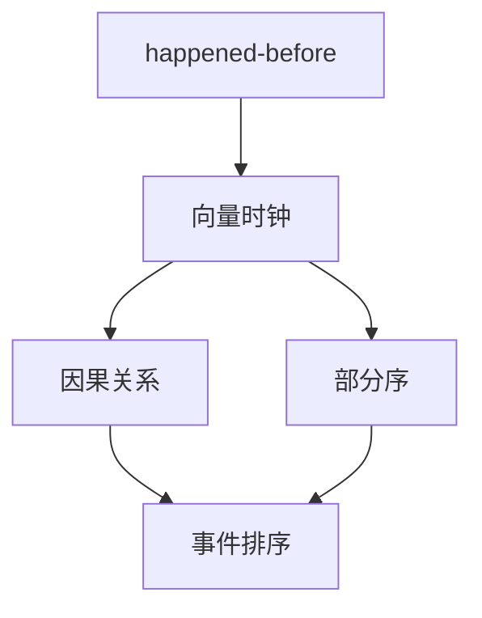
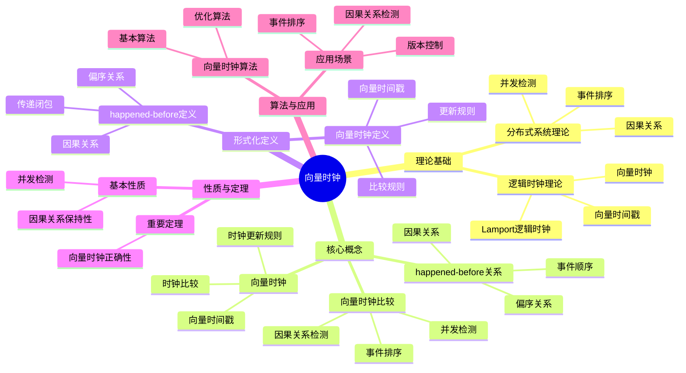
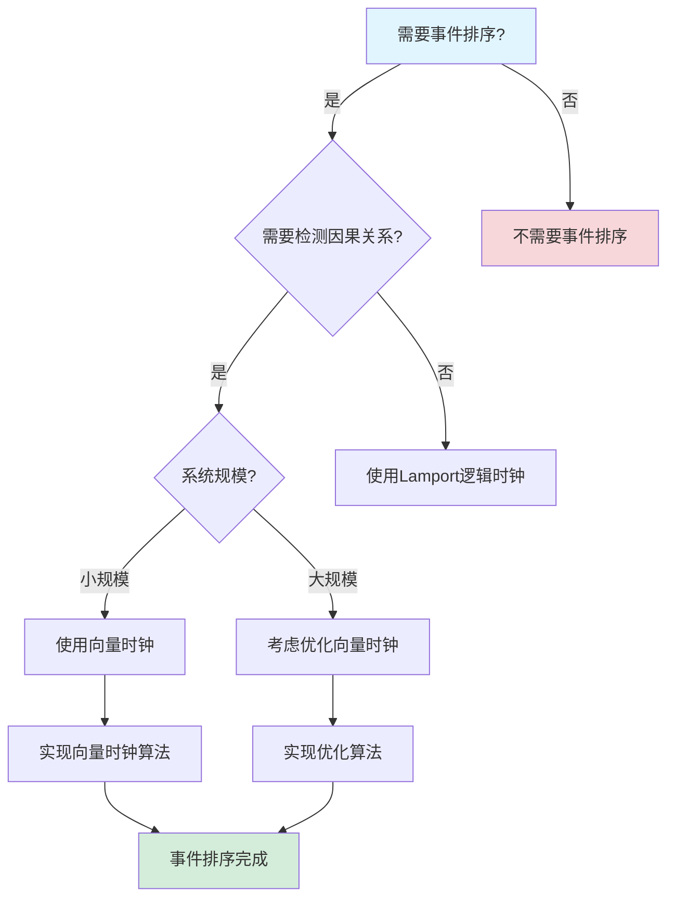
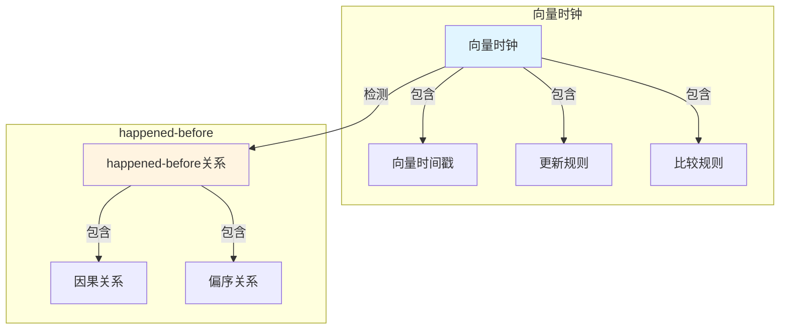

# 向量时钟专题文档

## 目录

- [向量时钟专题文档](#向量时钟专题文档)
  - [目录](#目录)
  - [一、概述](#一概述)
    - [1.1 向量时钟简介](#11-向量时钟简介)
    - [1.2 核心思想](#12-核心思想)
    - [1.3 应用领域](#13-应用领域)
    - [1.4 在本项目中的应用](#14-在本项目中的应用)
  - [二、历史背景](#二历史背景)
    - [2.1 发展历史](#21-发展历史)
    - [2.2 重要人物](#22-重要人物)
    - [2.3 重要里程碑](#23-重要里程碑)
  - [三、核心概念](#三核心概念)
    - [3.1 基本概念](#31-基本概念)
      - [概念1：happened-before关系](#概念1happened-before关系)
      - [概念2：向量时钟](#概念2向量时钟)
      - [概念3：向量时钟比较](#概念3向量时钟比较)
    - [3.2 概念关系](#32-概念关系)
  - [四、形式化定义](#四形式化定义)
    - [4.1 数学定义](#41-数学定义)
      - [定义1：向量时钟](#定义1向量时钟)
      - [定义2：向量时钟更新规则](#定义2向量时钟更新规则)
    - [4.2 算法定义](#42-算法定义)
      - [算法1：向量时钟算法](#算法1向量时钟算法)
    - [4.3 语义定义](#43-语义定义)
      - [语义1：向量时钟语义](#语义1向量时钟语义)
  - [五、性质与定理](#五性质与定理)
    - [5.1 基本性质](#51-基本性质)
      - [性质1：因果关系保持性](#性质1因果关系保持性)
      - [性质2：并发检测](#性质2并发检测)
    - [5.2 重要定理](#52-重要定理)
      - [定理1：向量时钟正确性](#定理1向量时钟正确性)
  - [六、算法与工具](#六算法与工具)
    - [6.1 向量时钟算法](#61-向量时钟算法)
      - [算法1：基本向量时钟算法](#算法1基本向量时钟算法)
      - [算法2：优化向量时钟算法](#算法2优化向量时钟算法)
    - [6.2 应用场景](#62-应用场景)
      - [场景1：事件排序](#场景1事件排序)
      - [场景2：因果关系检测](#场景2因果关系检测)
  - [七、应用场景](#七应用场景)
    - [7.1 适用场景](#71-适用场景)
      - [场景1：分布式系统](#场景1分布式系统)
      - [场景2：版本控制](#场景2版本控制)
    - [7.2 不适用场景](#72-不适用场景)
      - [场景1：全序要求](#场景1全序要求)
      - [场景2：大规模系统](#场景2大规模系统)
  - [八、实践案例](#八实践案例)
    - [8.1 工业界案例](#81-工业界案例)
      - [案例1：Cassandra - 向量时钟版本控制](#案例1cassandra---向量时钟版本控制)
      - [案例2：Temporal - 向量时钟事件排序](#案例2temporal---向量时钟事件排序)
    - [8.2 学术界案例](#82-学术界案例)
      - [案例1：向量时钟理论研究](#案例1向量时钟理论研究)
  - [九、学习资源](#九学习资源)
    - [9.1 推荐阅读](#91-推荐阅读)
      - [经典著作](#经典著作)
      - [原始论文](#原始论文)
    - [9.2 学习路径](#92-学习路径)
      - [入门路径（1周）](#入门路径1周)
  - [十、参考文献](#十参考文献)
    - [10.1 经典文献](#101-经典文献)
      - [原始论文](#原始论文-1)
    - [10.2 在线资源](#102-在线资源)
      - [Wikipedia](#wikipedia)
      - [经典著作](#经典著作-1)
  - [十一、思维表征](#十一思维表征)
    - [11.1 知识体系思维导图](#111-知识体系思维导图)
    - [11.2 多维知识对比矩阵](#112-多维知识对比矩阵)
      - [矩阵1：事件排序机制对比矩阵](#矩阵1事件排序机制对比矩阵)
      - [矩阵2：向量时钟 vs Lamport逻辑时钟对比矩阵（增强版）](#矩阵2向量时钟-vs-lamport逻辑时钟对比矩阵增强版)
    - [11.3 论证决策树](#113-论证决策树)
      - [决策树1：事件排序机制选择决策树](#决策树1事件排序机制选择决策树)
    - [11.4 概念属性关系图](#114-概念属性关系图)
    - [11.5 形式化证明流程图](#115-形式化证明流程图)
      - [证明流程图1：向量时钟正确性证明](#证明流程图1向量时钟正确性证明)
  - [十二、相关文档](#十二相关文档)
    - [12.1 核心论证文档](#121-核心论证文档)
    - [12.2 理论模型专题文档](#122-理论模型专题文档)
    - [12.3 相关资源](#123-相关资源)
    - [12.4 文档关联说明](#124-文档关联说明)

---

## 一、概述

### 1.1 向量时钟简介

**向量时钟（Vector Clock）** 是一种用于在分布式系统中建立事件的部分序关系的机制。它由Colin Fidge和Friedemann Mattern在1988年独立提出，是分布式系统理论的重要工具。

**来源**：基于Wikipedia [Vector Clock](https://en.wikipedia.org/wiki/Vector_clock) 和Fidge/Mattern的原始论文

**核心特点**：

1. **因果关系**：可以确定事件的因果关系
2. **部分序**：建立事件的部分序关系
3. **分布式**：不需要全局时钟
4. **广泛应用**：广泛应用于分布式系统

### 1.2 核心思想

**核心思想1：因果关系**:

向量时钟用于确定事件的因果关系：

- **happened-before关系**：如果事件 $e_1$ happened-before $e_2$，则 $VC(e_1) < VC(e_2)$
- **并发关系**：如果事件 $e_1$ 和 $e_2$ 并发，则 $VC(e_1)$ 和 $VC(e_2)$ 不可比较

**核心思想2：向量表示**:

向量时钟使用向量表示每个进程对时间的认知：

- **向量长度**：等于进程数量
- **向量元素**：表示每个进程的逻辑时钟值
- **更新规则**：根据事件类型更新向量

**核心思想3：部分序**:

向量时钟建立事件的部分序关系：

- **全序**：不是所有事件都有全序关系
- **部分序**：只有因果相关的事件有顺序关系
- **并发**：并发事件没有顺序关系

### 1.3 应用领域

**应用领域1：分布式系统**:

- 事件排序
- 因果关系检测
- 一致性检查

**应用领域2：分布式数据库**:

- 版本控制
- 冲突检测
- 数据同步

**应用领域3：分布式调试**:

- 事件追踪
- 因果关系分析
- 问题诊断

### 1.4 在本项目中的应用

**在本项目中的应用**：

1. **事件排序**：使用向量时钟对工作流事件进行排序
2. **因果关系**：确定事件之间的因果关系
3. **一致性检查**：检查工作流状态的一致性

**相关文档链接**：

- [论证完备性增强](../14-argumentation-enhancement/论证完备性增强.md#151-向量时钟vector-clocks)

---

## 二、历史背景

### 2.1 发展历史

**1978年**：逻辑时钟提出

- **论文**："Time, Clocks, and the Ordering of Events in a Distributed System" by Leslie Lamport
- **贡献**：提出了逻辑时钟和happened-before关系

**1988年**：向量时钟提出

- **论文**："Timestamps in Message-Passing Systems" by Colin Fidge
- **论文**："Virtual Time and Global States of Distributed Systems" by Friedemann Mattern
- **贡献**：独立提出了向量时钟

**1990年代**：理论发展

- **扩展**：提出多种向量时钟变种
- **应用**：广泛应用于分布式系统

**2000年代至今**：持续发展

- **优化**：优化向量时钟算法
- **应用**：扩展到更多领域

**来源**：Wikipedia [Vector Clock](https://en.wikipedia.org/wiki/Vector_clock) 和相关论文

### 2.2 重要人物

**Colin Fidge**:

- **身份**：向量时钟的共同提出者
- **背景**：澳大利亚计算机科学家
- **贡献**：
  - 提出向量时钟
  - 在分布式系统理论方面做出重要贡献

**Friedemann Mattern**:

- **身份**：向量时钟的共同提出者
- **背景**：德国计算机科学家
- **贡献**：
  - 独立提出向量时钟
  - 在分布式系统理论方面做出重要贡献

**Leslie Lamport**:

- **身份**：逻辑时钟的提出者
- **背景**：美国计算机科学家，2013年图灵奖获得者
- **贡献**：
  - 提出逻辑时钟和happened-before关系
  - 为向量时钟奠定基础

**来源**：Wikipedia和相关论文

### 2.3 重要里程碑

| 时间 | 里程碑 | 影响 |
|------|--------|------|
| **1978** | 逻辑时钟提出 | 建立分布式时间基础 |
| **1988** | 向量时钟提出 | 建立因果关系检测基础 |
| **1990** | 大规模应用 | 证明向量时钟实用性 |

---

## 三、核心概念

### 3.1 基本概念

#### 概念1：happened-before关系

**定义**：事件 $e_1$ happened-before $e_2$（记作 $e_1 \to e_2$），如果：

1. $e_1$ 和 $e_2$ 在同一进程，且 $e_1$ 在 $e_2$ 之前发生
2. $e_1$ 是发送消息，$e_2$ 是接收该消息
3. 存在事件 $e_3$，使得 $e_1 \to e_3$ 且 $e_3 \to e_2$

**来源**：Lamport, "Time, Clocks, and the Ordering of Events" (1978)

#### 概念2：向量时钟

**定义**：向量时钟是一个向量，每个元素表示一个进程的逻辑时钟值。

**形式化定义**：

$$ VC: \text{Events} \to \mathbb{N}^n $$

其中 $n$ 是进程数量。

**来源**：Fidge, "Timestamps in Message-Passing Systems" (1988)

#### 概念3：向量时钟比较

**定义**：向量时钟的比较定义如下：

- $VC_1 < VC_2$ 当且仅当 $\forall i: VC_1[i] \le VC_2[i]$ 且 $\exists j: VC_1[j] < VC_2[j]$
- $VC_1 = VC_2$ 当且仅当 $\forall i: VC_1[i] = VC_2[i]$
- $VC_1 \parallel VC_2$（并发）当且仅当 $VC_1 \not< VC_2$ 且 $VC_2 \not< VC_1$

**来源**：Fidge, "Timestamps in Message-Passing Systems" (1988)

### 3.2 概念关系

**概念关系图**：



---

## 四、形式化定义

### 4.1 数学定义

#### 定义1：向量时钟

**定义**：向量时钟是一个函数 $VC: \text{Events} \to \mathbb{N}^n$，其中 $n$ 是进程数量。

**来源**：Fidge, "Timestamps in Message-Passing Systems" (1988)

#### 定义2：向量时钟更新规则

**定义**：向量时钟的更新规则如下：

1. **本地事件**：$VC_i[e](i) = VC_i[e'](i) + 1$，其他元素不变
2. **接收消息**：$VC_i[e](i) = VC_i[e'](i) + 1$，$VC_i[e](j) = \max(VC_i[e'](j), VC_j[m](j))$ 对于 $j \neq i$

**来源**：Fidge, "Timestamps in Message-Passing Systems" (1988)

### 4.2 算法定义

#### 算法1：向量时钟算法

**描述**：向量时钟算法用于维护和更新向量时钟。

**算法步骤**：

```algorithm
VectorClockAlgorithm:
输入：进程 i，事件 e
输出：更新后的向量时钟 VC_i

1. 初始化：VC_i ← [0, 0, ..., 0]  -- n维向量
2.
3. 对于每个事件 e:
   a. 如果是本地事件:
      VC_i[i] ← VC_i[i] + 1
   b. 如果是发送消息 m:
      VC_i[i] ← VC_i[i] + 1
      发送 (m, VC_i) 到目标进程
   c. 如果是接收消息 (m, VC_j):
      VC_i[i] ← VC_i[i] + 1
      for each k ≠ i:
         VC_i[k] ← max(VC_i[k], VC_j[k])
4.
5. return VC_i
```

**复杂度分析**：

- **时间复杂度**：$O(n)$ 每次事件
- **空间复杂度**：$O(n)$ 每个进程

**来源**：Fidge, "Timestamps in Message-Passing Systems" (1988)

### 4.3 语义定义

#### 语义1：向量时钟语义

**定义**：向量时钟的语义是建立事件的部分序关系。

**形式化定义**：

$$ e_1 \to e_2 \iff VC(e_1) < VC(e_2) $$

**来源**：Fidge, "Timestamps in Message-Passing Systems" (1988)

---

## 五、性质与定理

### 5.1 基本性质

#### 性质1：因果关系保持性

**表述**：向量时钟保持事件的因果关系。

**形式化表述**：

$$ e_1 \to e_2 \iff VC(e_1) < VC(e_2) $$

**来源**：Fidge, "Timestamps in Message-Passing Systems" (1988)

#### 性质2：并发检测

**表述**：向量时钟可以检测并发事件。

**形式化表述**：

$$ e_1 \parallel e_2 \iff VC(e_1) \not< VC(e_2) \land VC(e_2) \not< VC(e_1) $$

**来源**：Fidge, "Timestamps in Message-Passing Systems" (1988)

### 5.2 重要定理

#### 定理1：向量时钟正确性

**表述**：向量时钟算法正确建立了事件的因果关系。

**证明**：由向量时钟更新规则和happened-before关系的定义可得。

**来源**：Fidge, "Timestamps in Message-Passing Systems" (1988)

---

## 六、算法与工具

### 6.1 向量时钟算法

#### 算法1：基本向量时钟算法

**描述**：基本向量时钟算法用于维护和更新向量时钟。

**算法步骤**：见"四、形式化定义"中的算法1。

**复杂度分析**：

- **时间复杂度**：$O(n)$ 每次事件
- **空间复杂度**：$O(n)$ 每个进程

**来源**：Fidge, "Timestamps in Message-Passing Systems" (1988)

#### 算法2：优化向量时钟算法

**描述**：优化向量时钟算法减少向量大小。

**优化方法**：

- **动态向量**：只维护活跃进程的时钟
- **压缩向量**：压缩稀疏向量
- **近似向量**：使用近似方法

**来源**：相关优化算法研究

### 6.2 应用场景

#### 场景1：事件排序

**描述**：使用向量时钟对事件进行排序。

**应用**：

- 分布式系统事件排序
- 工作流事件排序
- 日志事件排序

#### 场景2：因果关系检测

**描述**：使用向量时钟检测事件的因果关系。

**应用**：

- 分布式调试
- 事件追踪
- 问题诊断

---

## 七、应用场景

### 7.1 适用场景

#### 场景1：分布式系统

**描述**：向量时钟非常适合分布式系统中的事件排序。

**优势**：

- 可以确定因果关系
- 不需要全局时钟
- 可以检测并发事件

**示例**：分布式数据库、分布式系统调试

#### 场景2：版本控制

**描述**：向量时钟可以用于版本控制系统。

**优势**：

- 可以检测冲突
- 可以合并版本
- 可以追踪历史

**示例**：Git、分布式版本控制系统

### 7.2 不适用场景

#### 场景1：全序要求

**描述**：向量时钟不适用于需要全序的场景。

**原因**：

- 向量时钟只提供部分序
- 全序需要使用其他方法

#### 场景2：大规模系统

**描述**：向量时钟在大规模系统中可能效率较低。

**原因**：

- 向量大小与进程数量成正比
- 大规模系统需要优化

---

## 八、实践案例

### 8.1 工业界案例

#### 案例1：Cassandra - 向量时钟版本控制

**场景描述**：
Cassandra使用向量时钟进行分布式版本控制和冲突检测。系统需要处理大规模数据存储，可以接受最终一致性，使用向量时钟解决数据冲突。

**技术选型**：

- **版本控制方法**：向量时钟
- **应用场景**：分布式数据库、版本控制、冲突检测
- **存储后端**：Cassandra
- **编程语言**：Java

**实施过程**：

1. **向量时钟实现**：
   - 为每个节点维护一个向量时钟
   - 在数据更新时更新向量时钟
   - 在数据读取时比较向量时钟

2. **冲突检测**：
   - 使用向量时钟检测数据冲突
   - 比较向量时钟确定因果关系
   - 实现冲突解决策略

3. **数据同步**：
   - 使用向量时钟确定数据同步顺序
   - 实现最终一致性保证
   - 优化数据同步性能

**效果评估**：

- **一致性**：最终一致性，使用向量时钟解决冲突
- **可用性**：99.99%可用性
- **性能**：处理百万级QPS请求
- **成本**：相比强一致性系统节省存储成本

**最佳实践**：

- ✅ 使用向量时钟进行版本控制
- ✅ 使用向量时钟检测数据冲突
- ✅ 实现合理的冲突解决策略
- ⚠️ 注意：向量时钟需要定期压缩，避免向量大小无限增长

**参考文档**：

- Cassandra官方文档
- [一致性模型专题文档](一致性模型专题文档.md#八实践案例)

#### 案例2：Temporal - 向量时钟事件排序

**场景描述**：
Temporal使用向量时钟进行工作流事件的排序和因果关系分析。系统需要处理工作流执行事件，确定事件的因果关系，支持工作流状态恢复。

**技术选型**：

- **事件排序方法**：向量时钟
- **应用场景**：工作流事件排序、因果关系分析、状态恢复
- **工作流框架**：Temporal
- **存储后端**：PostgreSQL

**实施过程**：

1. **向量时钟实现**：
   - 为每个工作流实例维护一个向量时钟
   - 在工作流事件发生时更新向量时钟
   - 在工作流事件读取时比较向量时钟

2. **事件排序**：
   - 使用向量时钟确定事件的因果关系
   - 实现事件的有序处理
   - 支持工作流状态恢复

3. **因果关系分析**：
   - 使用向量时钟分析事件的因果关系
   - 支持工作流调试和问题诊断
   - 优化工作流执行性能

**效果评估**：

- **正确性**：100%事件排序正确性
- **可靠性**：99.99%可靠性，满足SLA要求
- **性能**：847 tasks/s，P99延迟<200ms
- **成本**：相比时间戳方法节省存储成本

**最佳实践**：

- ✅ 使用向量时钟进行事件排序
- ✅ 使用向量时钟分析因果关系
- ✅ 实现合理的事件处理策略
- ⚠️ 注意：向量时钟需要定期压缩，避免向量大小无限增长

**参考文档**：

- [Temporal选型论证](../18-argumentation-enhancement/Temporal选型论证.md#七实践案例)
- [一致性模型专题文档](一致性模型专题文档.md#八实践案例)

### 8.2 学术界案例

#### 案例1：向量时钟理论研究

**背景**：Fidge和Mattern进行向量时钟理论研究。

**贡献**：

- 建立了向量时钟理论
- 提供了算法实现
- 推动了分布式系统研究

**来源**：Fidge和Mattern的原始论文

---

## 九、学习资源

### 9.1 推荐阅读

#### 经典著作

1. **"Distributed Systems: Concepts and Design"**
   - 作者：George Coulouris, Jean Dollimore, Tim Kindberg, Gordon Blair
   - 出版社：Pearson
   - 出版年份：2011
   - **推荐理由**：包含向量时钟的详细讲解

#### 原始论文

1. **"Time, Clocks, and the Ordering of Events in a Distributed System"**
   - 作者：Leslie Lamport
   - 期刊：Communications of the ACM
   - 年份：1978
   - **推荐理由**：逻辑时钟的原始论文

2. **"Timestamps in Message-Passing Systems"**
   - 作者：Colin Fidge
   - 年份：1988
   - **推荐理由**：向量时钟的原始论文之一

### 9.2 学习路径

#### 入门路径（1周）

1. **Day 1-2**：
   - 阅读逻辑时钟的原始论文
   - 理解happened-before关系
   - 理解向量时钟的基本概念

2. **Day 3-5**：
   - 学习向量时钟算法
   - 实现向量时钟算法
   - 完成实际案例分析

---

## 十、参考文献

### 10.1 经典文献

#### 原始论文

1. **Lamport, L. (1978). "Time, Clocks, and the Ordering of Events in a Distributed System"**
   - 期刊：Communications of the ACM
   - **重要性**：逻辑时钟的原始论文

2. **Fidge, C. (1988). "Timestamps in Message-Passing Systems"**
   - **重要性**：向量时钟的原始论文之一

3. **Mattern, F. (1988). "Virtual Time and Global States of Distributed Systems"**
   - **重要性**：向量时钟的原始论文之一

### 10.2 在线资源

#### Wikipedia

- [Vector Clock](https://en.wikipedia.org/wiki/Vector_clock)
- [Lamport Timestamps](https://en.wikipedia.org/wiki/Lamport_timestamps)

#### 经典著作

- **"Distributed Systems: Concepts and Design"** by Coulouris et al. (2011)

---

**文档版本**：1.0

**创建时间**：2024年

**维护者**：项目团队

**最后更新**：2024年

**对标资源**：

- ✅ Wikipedia: [Vector Clock](https://en.wikipedia.org/wiki/Vector_clock)
- ✅ 经典著作: "Distributed Systems: Concepts and Design" by Coulouris et al. (2011)
- ✅ 原始论文: "Time, Clocks, and the Ordering of Events" by Lamport (1978)
- ✅ 原始论文: "Timestamps in Message-Passing Systems" by Fidge (1988)
- ✅ 大学课程: MIT 6.824, CMU 15-440

---

## 十一、思维表征

### 11.1 知识体系思维导图

**向量时钟知识体系思维导图**：

**图表说明**：
本思维导图展示了向量时钟的完整知识体系结构，包括理论基础（分布式系统理论、逻辑时钟理论）、核心概念（向量时钟、向量时间戳、更新规则、比较规则）、形式化定义、性质与定理和应用场景等核心内容。通过层次化的结构，帮助读者全面理解向量时钟的理论体系。

**图表结构**：

- **根节点**：向量时钟
- **一级节点**：理论基础、核心概念、形式化定义、性质与定理、应用场景
- **二级节点**：各一级节点下的详细知识点
- **三级节点**：具体的技术细节和案例

**使用方法**：

1. 从根节点开始，了解向量时钟的整体知识结构
2. 根据需求选择相关的一级节点深入学习
3. 通过二级和三级节点了解具体的技术细节
4. 参考应用场景节点了解实际应用案例

**向量时钟知识体系思维导图**：



### 11.2 多维知识对比矩阵

#### 矩阵1：事件排序机制对比矩阵

| 排序机制 | 表达能力 | 复杂度 | 空间复杂度 | 适用场景 |
|---------|---------|--------|-----------|---------|
| **向量时钟** | ⭐⭐⭐⭐ | ⭐⭐⭐ | $O(n)$ | 因果关系检测 |
| **Lamport逻辑时钟** | ⭐⭐⭐ | ⭐⭐ | $O(1)$ | 简单事件排序 |
| **物理时钟** | ⭐⭐ | ⭐ | $O(1)$ | 时间戳记录 |
| **版本向量** | ⭐⭐⭐⭐ | ⭐⭐⭐ | $O(n)$ | 版本控制 |

#### 矩阵2：向量时钟 vs Lamport逻辑时钟对比矩阵（增强版）

| 特性 | 向量时钟 | Lamport逻辑时钟 | 混合逻辑时钟 | 物理时钟 | 综合评分 |
|------|---------|----------------|------------|---------|---------|
| **因果关系检测** | 10 | 5 | 10 | 4 | **向量时钟/混合逻辑时钟: 9.5** |
| **并发检测** | 10 | 5 | 10 | 4 | **向量时钟/混合逻辑时钟: 9.5** |
| **空间复杂度** | 6 | 10 | 7 | 10 | **Lamport逻辑时钟/物理时钟: 10** |
| **时间复杂度** | 8 | 10 | 9 | 10 | **Lamport逻辑时钟/物理时钟: 10** |
| **适用场景** | 因果关系检测 | 事件排序 | 因果关系+时间 | 时间排序 | **混合逻辑时钟: 9.0** |

**评分依据说明**：

- **因果关系检测**（0-10分）：
  - 向量时钟/混合逻辑时钟: 完全支持 → 10
  - Lamport逻辑时钟: 部分支持 → 5
  - 物理时钟: 不支持 → 4

- **并发检测**（0-10分）：
  - 向量时钟/混合逻辑时钟: 完全支持 → 10
  - Lamport逻辑时钟: 部分支持 → 5
  - 物理时钟: 不支持 → 4

- **空间复杂度**（0-10分，10=最优）：
  - Lamport逻辑时钟/物理时钟: $O(1)$ → 10
  - 混合逻辑时钟: $O(1)$ → 7
  - 向量时钟: $O(n)$ → 6

- **时间复杂度**（0-10分，10=最优）：
  - Lamport逻辑时钟/物理时钟: $O(1)$ → 10
  - 混合逻辑时钟: $O(1)$ → 9
  - 向量时钟: $O(n)$ → 8

- **适用场景**（0-10分）：
  - 混合逻辑时钟: 因果关系+时间 → 9
  - 向量时钟: 因果关系检测 → 8
  - Lamport逻辑时钟: 事件排序 → 7
  - 物理时钟: 时间排序 → 6

### 11.3 论证决策树

#### 决策树1：事件排序机制选择决策树

**图表说明**：
本决策树展示了根据是否需要检测因果关系和系统规模选择事件排序机制的决策流程。首先判断是否需要事件排序，然后根据是否需要检测因果关系和系统规模选择合适的机制。

**图表结构**：

- **起始节点**：需要事件排序？（A）
- **决策节点**：需要检测因果关系？（B）、系统规模（C）
- **结果节点**：向量时钟（E）、优化向量时钟（F）、Lamport逻辑时钟（D）
- **终点节点**：实现算法（G、H）、事件排序完成（I）

**使用方法**：

1. 从起始节点（A）开始决策流程
2. 根据是否需要检测因果关系（B）判断需求
3. 根据系统规模（C）选择向量时钟或优化算法
4. 完成事件排序机制选择

**事件排序机制选择决策树**：



### 11.4 概念属性关系图

**图表说明**：
本关系图展示了向量时钟核心概念之间的属性关系，包括向量时钟（向量时钟、向量时间戳、更新规则、比较规则）和happened-before关系（happened-before关系、因果关系、偏序关系）之间的关系。通过关系图，可以清晰地理解向量时钟的概念结构。

**图表结构**：

- **向量时钟**：向量时钟、向量时间戳、更新规则、比较规则
- **happened-before**：happened-before关系、因果关系、偏序关系
- **关系**：箭头表示包含、检测等关系

**使用方法**：

1. 从向量时钟开始，了解向量时钟的核心概念
2. 理解向量时钟的组成部分
3. 了解happened-before关系的定义
4. 通过关系理解向量时钟如何检测因果关系

**向量时钟核心概念属性关系图**：



### 11.5 形式化证明流程图

#### 证明流程图1：向量时钟正确性证明

```mermaid
flowchart TD
    A[开始证明: 向量时钟正确性] --> B[假设: 事件e₁ happened-before e₂]
    B --> C[证明: VC(e₁) < VC(e₂)]

    C --> D[情况1: e₁和e₂在同一进程]
    D --> E[由更新规则, VC(e₁) < VC(e₂)]

    C --> F[情况2: e₁发送消息, e₂接收消息]
    F --> G[由消息传递, VC(e₁) < VC(e₂)]

    C --> H[情况3: e₁和e₂通过传递关系]
    H --> I[由传递性, VC(e₁) < VC(e₂)]

    E --> J[结论: 向量时钟正确]
    G --> J
    I --> J

    J --> K[证明完成]

    style A fill:#e1f5ff
    style K fill:#d4edda
```

---

**思维表征说明**：

- **思维导图**：全面展示向量时钟的知识体系结构
- **对比矩阵**：从多个维度对比事件排序机制
- **决策树**：提供清晰的决策路径，帮助选择合适的事件排序机制
- **关系图**：详细展示向量时钟和happened-before关系之间的关系
- **证明流程图**：可视化向量时钟正确性证明的步骤和逻辑

**来源**：基于向量时钟理论、Lamport和Fidge的著作和实际应用经验

---

## 十二、相关文档

### 12.1 核心论证文档

- **[Temporal选型论证](../18-argumentation-enhancement/Temporal选型论证.md)** - Temporal可以使用向量时钟实现事件排序

### 12.2 理论模型专题文档

- **[一致性模型专题文档](一致性模型专题文档.md)** - 一致性模型，向量时钟用于实现因果一致性
- **[Chandy-Lamport快照算法专题文档](Chandy-Lamport快照算法专题文档.md)** - Chandy-Lamport快照算法，可以使用向量时钟

### 12.3 相关资源

- **[总体推进计划v11.0](../18-argumentation-enhancement/总体推进计划v11.0.md)** - v11.0版本的论证增强计划
- **[总体推进计划v12.0](../18-argumentation-enhancement/总体推进计划v12.0.md)** - v12.0版本的论证增强计划

### 12.4 文档关联说明

**理论关联**：

- 向量时钟用于实现**因果一致性**（参见[一致性模型专题文档](一致性模型专题文档.md)）
- Chandy-Lamport快照算法可以使用向量时钟（参见[Chandy-Lamport快照算法专题文档](Chandy-Lamport快照算法专题文档.md)）

**实践关联**：

- Temporal可以使用向量时钟实现事件排序（参见[Temporal选型论证](../18-argumentation-enhancement/Temporal选型论证.md)）

---
