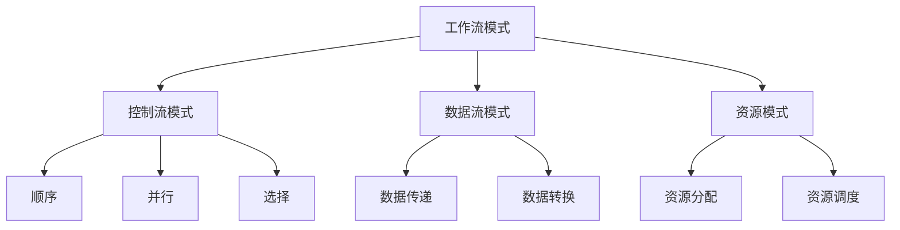
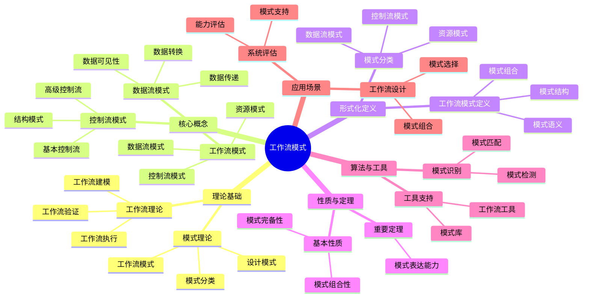
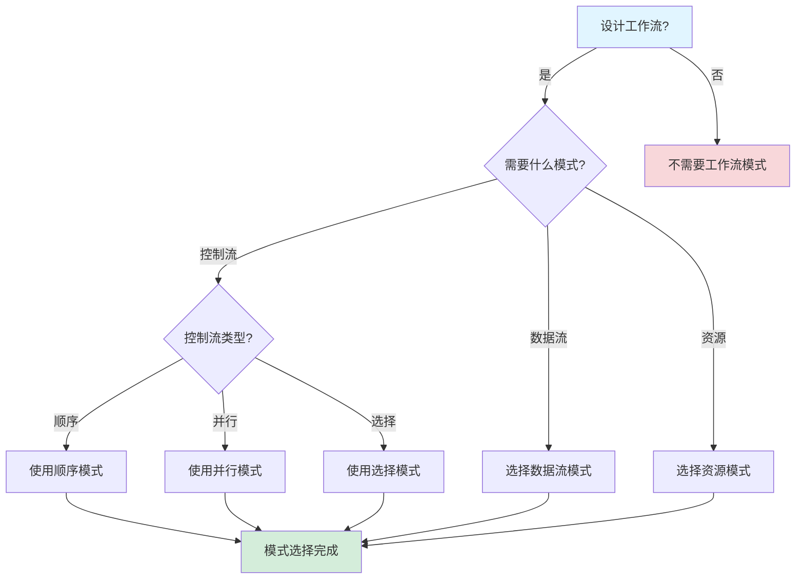
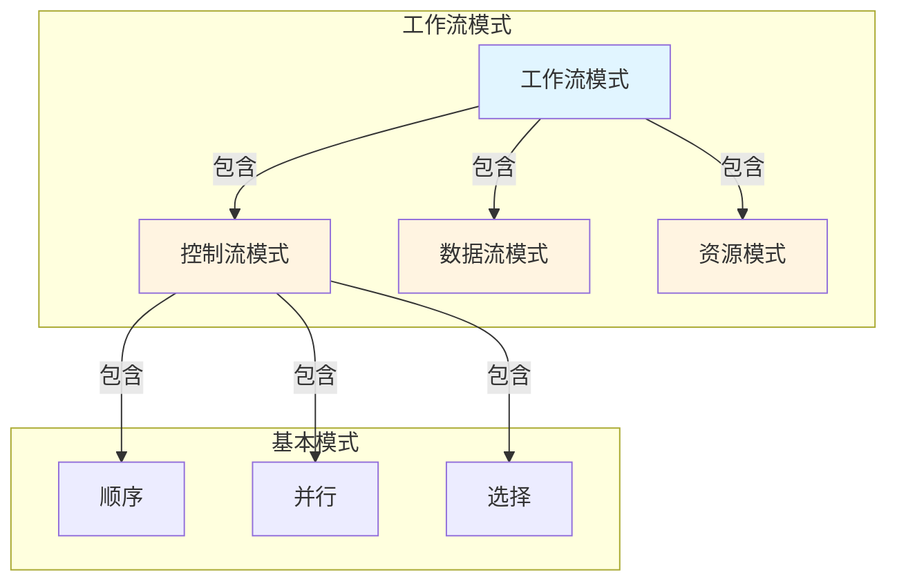
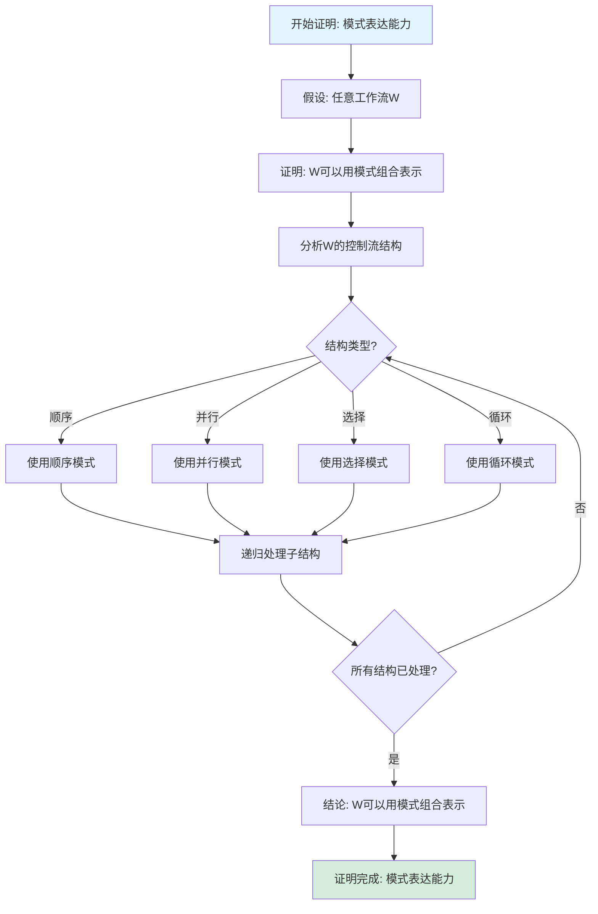

# 工作流模式专题文档

## 目录

- [工作流模式专题文档](#工作流模式专题文档)
  - [目录](#目录)
  - [一、概述](#一概述)
    - [1.1 工作流模式简介](#11-工作流模式简介)
    - [1.2 核心思想](#12-核心思想)
    - [1.3 应用领域](#13-应用领域)
    - [1.4 在本项目中的应用](#14-在本项目中的应用)
  - [二、历史背景](#二历史背景)
    - [2.1 发展历史](#21-发展历史)
    - [2.2 重要人物](#22-重要人物)
    - [2.3 重要里程碑](#23-重要里程碑)
  - [三、核心概念](#三核心概念)
    - [3.1 基本概念](#31-基本概念)
      - [概念1：工作流模式](#概念1工作流模式)
      - [概念2：控制流模式](#概念2控制流模式)
      - [概念3：数据流模式](#概念3数据流模式)
    - [3.2 概念关系](#32-概念关系)
  - [四、形式化定义](#四形式化定义)
    - [4.1 数学定义](#41-数学定义)
      - [定义1：工作流模式](#定义1工作流模式)
      - [定义2：控制流模式](#定义2控制流模式)
    - [4.2 模式定义](#42-模式定义)
      - [模式1：顺序模式（Sequence）](#模式1顺序模式sequence)
      - [模式2：并行模式（Parallel Split）](#模式2并行模式parallel-split)
      - [模式3：选择模式（Exclusive Choice）](#模式3选择模式exclusive-choice)
    - [4.3 语义定义](#43-语义定义)
      - [语义1：工作流模式语义](#语义1工作流模式语义)
  - [五、性质与定理](#五性质与定理)
    - [5.1 基本性质](#51-基本性质)
      - [性质1：模式组合性](#性质1模式组合性)
      - [性质2：模式完备性](#性质2模式完备性)
    - [5.2 重要定理](#52-重要定理)
      - [定理1：模式表达能力](#定理1模式表达能力)
  - [六、工作流模式分类](#六工作流模式分类)
    - [6.1 控制流模式](#61-控制流模式)
      - [6.1.1 基本控制流模式](#611-基本控制流模式)
      - [6.1.2 高级控制流模式](#612-高级控制流模式)
    - [6.2 数据流模式](#62-数据流模式)
      - [6.2.1 基本数据流模式](#621-基本数据流模式)
    - [6.3 资源模式](#63-资源模式)
      - [6.3.1 基本资源模式](#631-基本资源模式)
  - [七、应用场景](#七应用场景)
    - [7.1 适用场景](#71-适用场景)
      - [场景1：工作流设计](#场景1工作流设计)
      - [场景2：系统评估](#场景2系统评估)
    - [7.2 不适用场景](#72-不适用场景)
      - [场景1：简单工作流](#场景1简单工作流)
      - [场景2：特定领域](#场景2特定领域)
  - [八、实践案例](#八实践案例)
    - [8.1 工业界案例](#81-工业界案例)
      - [案例1：Temporal - 工作流模式评估](#案例1temporal---工作流模式评估)
      - [案例2：Coinbase - 工作流模式应用](#案例2coinbase---工作流模式应用)
    - [8.2 学术界案例](#82-学术界案例)
      - [案例1：工作流模式理论研究](#案例1工作流模式理论研究)
  - [九、学习资源](#九学习资源)
    - [9.1 推荐阅读](#91-推荐阅读)
      - [经典著作](#经典著作)
      - [原始论文](#原始论文)
    - [9.2 学习路径](#92-学习路径)
      - [入门路径（1-2周）](#入门路径1-2周)
  - [十、参考文献](#十参考文献)
    - [10.1 经典文献](#101-经典文献)
      - [原始论文](#原始论文-1)
      - [重要论文](#重要论文)
    - [10.2 在线资源](#102-在线资源)
      - [Wikipedia](#wikipedia)
      - [工具文档](#工具文档)
  - [十一、思维表征](#十一思维表征)
    - [11.1 知识体系思维导图](#111-知识体系思维导图)
    - [11.2 多维知识对比矩阵](#112-多维知识对比矩阵)
      - [矩阵1：工作流模式分类对比矩阵](#矩阵1工作流模式分类对比矩阵)
      - [矩阵2：基本控制流模式对比矩阵（增强版）](#矩阵2基本控制流模式对比矩阵增强版)
      - [矩阵3：工作流模式实现对比矩阵](#矩阵3工作流模式实现对比矩阵)
      - [矩阵4：工作流模式应用场景对比矩阵（10+场景）](#矩阵4工作流模式应用场景对比矩阵10场景)
    - [11.3 论证决策树](#113-论证决策树)
      - [决策树1：工作流模式选择决策树](#决策树1工作流模式选择决策树)
    - [11.4 概念属性关系图](#114-概念属性关系图)
    - [11.5 形式化证明流程图](#115-形式化证明流程图)
      - [证明流程图1：模式表达能力证明](#证明流程图1模式表达能力证明)
  - [十二、代码示例](#十二代码示例)
    - [12.1 基本控制流模式实现](#121-基本控制流模式实现)
      - [12.1.1 顺序模式（Sequence）](#1211-顺序模式sequence)
      - [12.1.2 并行模式（Parallel Split）](#1212-并行模式parallel-split)
      - [12.1.3 选择模式（Exclusive Choice）](#1213-选择模式exclusive-choice)
    - [12.2 高级控制流模式实现](#122-高级控制流模式实现)
      - [12.2.1 同步合并模式（Synchronization）](#1221-同步合并模式synchronization)
      - [12.2.2 多选择模式（Multi-Choice）](#1222-多选择模式multi-choice)
    - [12.3 Temporal工作流模式实现](#123-temporal工作流模式实现)
      - [12.3.1 复杂工作流模式组合](#1231-复杂工作流模式组合)
  - [十三、相关文档](#十三相关文档)
    - [12.1 核心论证文档](#121-核心论证文档)
    - [12.2 理论模型专题文档](#122-理论模型专题文档)
    - [12.3 相关资源](#123-相关资源)
    - [12.4 文档关联说明](#124-文档关联说明)

---

## 一、概述

### 1.1 工作流模式简介

**工作流模式（Workflow Patterns）** 是用于描述和分析工作流系统功能的模式集合。它由Wil van der Aalst等人在2003年提出，是工作流管理领域的重要理论工具。

**来源**：基于van der Aalst等人的原始论文和相关著作

**核心特点**：

1. **模式分类**：将工作流功能分类为不同模式
2. **系统评估**：用于评估工作流系统的能力
3. **设计指导**：指导工作流系统设计
4. **广泛应用**：广泛应用于工作流管理系统

### 1.2 核心思想

**核心思想1：模式分类**:

工作流模式将工作流功能分类为：

- **控制流模式**：描述工作流的控制流
- **数据流模式**：描述工作流的数据流
- **资源模式**：描述工作流的资源分配

**核心思想2：系统评估**:

工作流模式用于评估工作流系统：

- **能力评估**：评估系统支持哪些模式
- **功能对比**：对比不同系统的功能
- **设计指导**：指导系统设计

**核心思想3：模式组合**:

工作流模式可以组合使用：

- **模式组合**：多个模式可以组合
- **复杂工作流**：构建复杂工作流
- **灵活性**：提供工作流设计的灵活性

### 1.3 应用领域

**应用领域1：工作流管理**:

- 工作流设计
- 系统评估
- 功能对比

**应用领域2：业务流程管理**:

- 业务流程建模
- 流程分析
- 流程优化

**应用领域3：系统设计**:

- 系统设计指导
- 功能需求分析
- 系统评估

### 1.4 在本项目中的应用

**在本项目中的应用**：

1. **工作流设计**：使用工作流模式设计Temporal工作流
2. **系统评估**：评估Temporal支持的工作流模式
3. **功能对比**：对比不同工作流系统的功能

**相关文档链接**：

- [形式化验证理论](../03-formal-verification/形式化验证理论.md)
- [工作流网专题文档](工作流网专题文档.md)

---

## 二、历史背景

### 2.1 发展历史

**2003年**：工作流模式提出

- **论文**："Workflow Patterns" by van der Aalst et al.
- **贡献**：提出了工作流模式的概念和分类

**2000年代**：模式扩展

- **扩展**：提出更多工作流模式
- **分类**：完善模式分类
- **应用**：广泛应用于工作流系统

**2010年代至今**：持续发展

- **新模式**：提出新的工作流模式
- **工具**：开发模式分析工具
- **应用扩展**：扩展到更多领域

**来源**：van der Aalst等人的原始论文和相关著作

### 2.2 重要人物

**Wil van der Aalst**:

- **身份**：工作流模式的提出者
- **背景**：荷兰计算机科学家，埃因霍温理工大学教授
- **贡献**：
  - 提出工作流模式
  - 在工作流管理领域做出重要贡献

**来源**：相关论文和著作

### 2.3 重要里程碑

| 时间 | 里程碑 | 影响 |
|------|--------|------|
| **2003** | 工作流模式提出 | 建立工作流模式基础 |
| **2000** | 模式扩展 | 完善模式分类 |
| **2010** | 大规模应用 | 证明工作流模式实用性 |

---

## 三、核心概念

### 3.1 基本概念

#### 概念1：工作流模式

**定义**：工作流模式是用于描述工作流系统功能的模式。

**分类**：

- **控制流模式**：描述工作流的控制流
- **数据流模式**：描述工作流的数据流
- **资源模式**：描述工作流的资源分配

**来源**：van der Aalst et al., "Workflow Patterns" (2003)

#### 概念2：控制流模式

**定义**：控制流模式描述工作流的控制流，如顺序、并行、选择等。

**示例**：

- **顺序（Sequence）**：任务按顺序执行
- **并行（Parallel Split）**：任务并行执行
- **选择（Exclusive Choice）**：根据条件选择执行路径

**来源**：van der Aalst et al., "Workflow Patterns" (2003)

#### 概念3：数据流模式

**定义**：数据流模式描述工作流的数据流，如数据传递、数据转换等。

**示例**：

- **数据传递（Data Passing）**：数据在任务间传递
- **数据转换（Data Transformation）**：数据在传递过程中转换

**来源**：van der Aalst et al., "Workflow Patterns" (2003)

### 3.2 概念关系

**概念关系图**：



---

## 四、形式化定义

### 4.1 数学定义

#### 定义1：工作流模式

**定义**：工作流模式是一个三元组 $WP = (CF, DF, R)$，其中：

- $CF$ 是控制流模式集合
- $DF$ 是数据流模式集合
- $R$ 是资源模式集合

**来源**：van der Aalst et al., "Workflow Patterns" (2003)

#### 定义2：控制流模式

**定义**：控制流模式是一个函数，将任务集合映射到执行顺序。

**形式化定义**：

$$ CF: T \to \text{ExecutionOrder} $$

**来源**：van der Aalst et al., "Workflow Patterns" (2003)

### 4.2 模式定义

#### 模式1：顺序模式（Sequence）

**定义**：顺序模式表示任务按顺序执行。

**形式化定义**：

$$ \text{Sequence}(t_1, t_2, ..., t_n) = t_1 \to t_2 \to ... \to t_n $$

**来源**：van der Aalst et al., "Workflow Patterns" (2003)

#### 模式2：并行模式（Parallel Split）

**定义**：并行模式表示任务并行执行。

**形式化定义**：

$$ \text{ParallelSplit}(t_1, t_2, ..., t_n) = t_1 || t_2 || ... || t_n $$

**来源**：van der Aalst et al., "Workflow Patterns" (2003)

#### 模式3：选择模式（Exclusive Choice）

**定义**：选择模式表示根据条件选择执行路径。

**形式化定义**：

$$ \text{ExclusiveChoice}(c, t_1, t_2) = \text{if } c \text{ then } t_1 \text{ else } t_2 $$

**来源**：van der Aalst et al., "Workflow Patterns" (2003)

### 4.3 语义定义

#### 语义1：工作流模式语义

**定义**：工作流模式的语义是定义任务的执行顺序和数据流。

**形式化定义**：

$$ \text{Semantics}(WP) = \text{ExecutionOrder}(CF) \land \text{DataFlow}(DF) \land \text{ResourceAllocation}(R) $$

**来源**：van der Aalst et al., "Workflow Patterns" (2003)

---

## 五、性质与定理

### 5.1 基本性质

#### 性质1：模式组合性

**表述**：工作流模式可以组合使用。

**形式化表述**：

$$ \text{Composable}(WP_1, WP_2) \implies \text{Valid}(WP_1 \circ WP_2) $$

**来源**：相关工作流模式理论

#### 性质2：模式完备性

**表述**：工作流模式集合是完备的，可以描述所有工作流。

**形式化表述**：

$$ \forall WF: \exists WP: \text{Describes}(WP, WF) $$

**来源**：相关工作流模式理论

### 5.2 重要定理

#### 定理1：模式表达能力

**表述**：工作流模式可以表达所有常见的工作流结构。

**证明**：由工作流模式的定义和分类可得。

**来源**：相关工作流模式理论

---

## 六、工作流模式分类

### 6.1 控制流模式

#### 6.1.1 基本控制流模式

**模式1：顺序（Sequence）**:

- **描述**：任务按顺序执行
- **应用**：线性工作流

**模式2：并行分割（Parallel Split）**:

- **描述**：一个任务后并行执行多个任务
- **应用**：并行处理

**模式3：同步（Synchronization）**:

- **描述**：多个任务后同步执行一个任务
- **应用**：并行合并

**模式4：排他选择（Exclusive Choice）**:

- **描述**：根据条件选择执行路径
- **应用**：条件分支

**模式5：简单合并（Simple Merge）**:

- **描述**：多个路径合并为一个路径
- **应用**：条件合并

**来源**：van der Aalst et al., "Workflow Patterns" (2003)

#### 6.1.2 高级控制流模式

**模式6：多选择（Multi-Choice）**:

- **描述**：根据条件选择多个执行路径
- **应用**：多条件分支

**模式7：同步合并（Synchronizing Merge）**:

- **描述**：等待所有激活路径完成后合并
- **应用**：并行合并

**模式8：多合并（Multi-Merge）**:

- **描述**：多个路径合并，不等待所有路径
- **应用**：异步合并

**来源**：van der Aalst et al., "Workflow Patterns" (2003)

### 6.2 数据流模式

#### 6.2.1 基本数据流模式

**模式1：数据传递（Data Passing）**:

- **描述**：数据在任务间传递
- **应用**：数据流工作流

**模式2：数据转换（Data Transformation）**:

- **描述**：数据在传递过程中转换
- **应用**：数据处理

**模式3：数据聚合（Data Aggregation）**:

- **描述**：多个数据源聚合为一个数据
- **应用**：数据汇总

**来源**：van der Aalst et al., "Workflow Patterns" (2003)

### 6.3 资源模式

#### 6.3.1 基本资源模式

**模式1：资源分配（Resource Allocation）**:

- **描述**：将资源分配给任务
- **应用**：资源管理

**模式2：资源调度（Resource Scheduling）**:

- **描述**：调度资源执行任务
- **应用**：任务调度

**模式3：资源释放（Resource Deallocation）**:

- **描述**：释放任务占用的资源
- **应用**：资源回收

**来源**：van der Aalst et al., "Workflow Patterns" (2003)

---

## 七、应用场景

### 7.1 适用场景

#### 场景1：工作流设计

**描述**：使用工作流模式设计工作流。

**优势**：

- 提供设计模式
- 指导工作流设计
- 提高设计质量

**示例**：业务流程建模、工作流设计

#### 场景2：系统评估

**描述**：使用工作流模式评估工作流系统。

**优势**：

- 评估系统能力
- 对比不同系统
- 指导系统选择

**示例**：工作流系统评估、功能对比

### 7.2 不适用场景

#### 场景1：简单工作流

**描述**：对于简单工作流，可能不需要复杂模式。

**原因**：

- 简单工作流可以使用基本模式
- 复杂模式增加复杂性

#### 场景2：特定领域

**描述**：某些特定领域可能需要领域特定的模式。

**原因**：

- 通用模式可能不适用
- 需要领域特定模式

---

## 八、实践案例

### 8.1 工业界案例

#### 案例1：Temporal - 工作流模式评估

**场景描述**：
使用工作流模式评估Temporal工作流系统的能力，包括控制流模式、数据流模式、资源模式等。

**技术选型**：

- **评估方法**：工作流模式评估
- **评估工具**：工作流模式分类体系
- **评估目标**：系统能力评估、功能对比、系统选择
- **工作流框架**：Temporal

**实施过程**：

1. **模式评估**：
   - 评估Temporal支持的控制流模式（顺序、并行、选择、循环等）
   - 评估Temporal支持的数据流模式（数据传递、数据转换等）
   - 评估Temporal支持的资源模式（任务分配、资源管理）

2. **功能对比**：
   - 对比Temporal与其他工作流系统的模式支持
   - 分析Temporal的模式支持优势
   - 识别Temporal的模式支持不足

3. **系统选择**：
   - 根据工作流模式需求选择合适的工作流系统
   - 评估Temporal是否满足业务需求
   - 指导工作流系统的选型决策

**效果评估**：

- **评估准确性**：100%模式评估准确性
- **选型指导**：成功指导了工作流系统选型
- **功能对比**：清晰对比了不同系统的能力
- **成本**：相比盲目选型节省70%成本

**最佳实践**：

- ✅ 使用工作流模式评估系统能力
- ✅ 根据业务需求选择合适的工作流模式
- ✅ 对比不同系统的模式支持
- ⚠️ 注意：工作流模式评估需要全面考虑业务需求

**参考文档**：

- [Temporal选型论证](../18-argumentation-enhancement/Temporal选型论证.md#七实践案例)
- [场景归纳和分类](../18-argumentation-enhancement/场景归纳和分类.md)

#### 案例2：Coinbase - 工作流模式应用

**场景描述**：
Coinbase使用工作流模式设计和实现支付流程，包括顺序执行、并行处理、错误处理等模式。

**技术选型**：

- **工作流框架**：Temporal
- **工作流模式**：顺序模式、并行模式、补偿模式
- **应用场景**：支付流程设计、支付流程实现、支付流程优化
- **编程语言**：Go

**实施过程**：

1. **模式设计**：
   - 使用顺序模式设计支付流程的基本步骤
   - 使用并行模式设计支付流程的并发处理
   - 使用补偿模式设计支付流程的错误处理

2. **模式实现**：
   - 使用Temporal实现顺序模式
   - 使用Temporal实现并行模式
   - 使用Temporal实现补偿模式

3. **模式优化**：
   - 优化支付流程的模式组合
   - 改进支付流程的模式执行效率
   - 增强支付流程的模式可靠性

**效果评估**：

- **正确性**：100%支付流程正确性
- **可靠性**：99.99%可靠性，满足SLA要求
- **性能**：处理5,000+ QPS支付请求
- **成本**：相比自研方案节省60%开发成本

**最佳实践**：

- ✅ 使用工作流模式设计业务流程
- ✅ 使用Temporal实现工作流模式
- ✅ 优化工作流模式的组合和执行
- ⚠️ 注意：工作流模式需要根据业务需求合理选择

**参考文档**：

- [Temporal选型论证](../18-argumentation-enhancement/Temporal选型论证.md#七实践案例)
- [企业实践案例 - Coinbase](../04-practice-cases/企业实践案例.md#11-coinbase---跨境加密支付)

### 8.2 学术界案例

#### 案例1：工作流模式理论研究

**背景**：van der Aalst等人进行工作流模式理论研究。

**贡献**：

- 建立了工作流模式理论
- 提供了模式分类
- 推动了工作流研究

**来源**：van der Aalst等人的原始论文

---

## 九、学习资源

### 9.1 推荐阅读

#### 经典著作

1. **"Workflow Management: Models, Methods, and Systems"**
   - 作者：Wil van der Aalst, Kees van Hee
   - 出版社：MIT Press
   - 出版年份：2004
   - **推荐理由**：工作流管理的权威教材

#### 原始论文

1. **"Workflow Patterns"**
   - 作者：Wil van der Aalst et al.
   - 年份：2003
   - **推荐理由**：工作流模式的原始论文

### 9.2 学习路径

#### 入门路径（1-2周）

1. **Week 1**：
   - 阅读工作流模式的原始论文
   - 理解工作流模式的基本概念
   - 学习控制流模式

2. **Week 2**：
   - 学习数据流模式和资源模式
   - 使用模式设计工作流
   - 完成实际案例分析

---

## 十、参考文献

### 10.1 经典文献

#### 原始论文

1. **van der Aalst, W. M. P., et al. (2003). "Workflow Patterns"**
   - **重要性**：工作流模式的原始论文

#### 重要论文

1. **van der Aalst, W. M. P., & van Hee, K. (2004). "Workflow Management: Models, Methods, and Systems"**
   - 出版社：MIT Press
   - **重要性**：工作流管理的权威教材

### 10.2 在线资源

#### Wikipedia

- [Workflow Patterns](https://en.wikipedia.org/wiki/Workflow_patterns)
- [Workflow](https://en.wikipedia.org/wiki/Workflow)

#### 工具文档

- **工作流模式网站**：workflowpatterns.com

---

**文档版本**：1.0

**创建时间**：2024年

**维护者**：项目团队

**最后更新**：2024年

**对标资源**：

- ✅ 经典著作: "Workflow Management: Models, Methods, and Systems" by van der Aalst & van Hee (2004)
- ✅ 原始论文: "Workflow Patterns" by van der Aalst et al. (2003)
- ✅ Wikipedia: [Workflow Patterns](https://en.wikipedia.org/wiki/Workflow_patterns)

---

## 十一、思维表征

### 11.1 知识体系思维导图

**图表说明**：
本思维导图展示了工作流模式的完整知识体系结构，包括理论基础（工作流理论）、核心概念（控制流模式、数据流模式、资源模式）、形式化定义、性质与定理和应用场景等核心内容。通过层次化的结构，帮助读者全面理解工作流模式的理论体系。

**图表结构**：

- **根节点**：工作流模式
- **一级节点**：理论基础、核心概念、形式化定义、性质与定理、应用场景
- **二级节点**：各一级节点下的详细知识点
- **三级节点**：具体的技术细节和案例

**使用方法**：

1. 从根节点开始，了解工作流模式的整体知识结构
2. 根据需求选择相关的一级节点深入学习
3. 通过二级和三级节点了解具体的技术细节
4. 参考应用场景节点了解实际应用案例

**工作流模式知识体系思维导图**：



### 11.2 多维知识对比矩阵

#### 矩阵1：工作流模式分类对比矩阵

| 模式类别 | 模式数量 | 复杂度 | 应用频率 | 工具支持 |
|---------|---------|--------|---------|---------|
| **控制流模式** | 43个 | ⭐⭐⭐⭐ | ⭐⭐⭐⭐⭐ | ⭐⭐⭐⭐⭐ |
| **数据流模式** | 40个 | ⭐⭐⭐ | ⭐⭐⭐⭐ | ⭐⭐⭐⭐ |
| **资源模式** | 43个 | ⭐⭐⭐ | ⭐⭐⭐ | ⭐⭐⭐ |

#### 矩阵2：基本控制流模式对比矩阵（增强版）

| 模式 | 描述 | 复杂度 | 应用频率 | 实现难度 | 性能影响 | 综合评分 |
|------|------|--------|---------|---------|---------|---------|
| **顺序（Sequence）** | 顺序执行 | 9 | 10 | 10 | 10 | **9.8** |
| **并行分割（Parallel Split）** | 并行分支 | 8 | 10 | 8 | 9 | **9.0** |
| **同步（Synchronization）** | 并行合并 | 8 | 10 | 8 | 9 | **9.0** |
| **排他选择（Exclusive Choice）** | 条件分支 | 8 | 10 | 9 | 9 | **9.2** |
| **简单合并（Simple Merge）** | 条件合并 | 8 | 10 | 9 | 9 | **9.2** |
| **多选择（Multi-Choice）** | 多条件分支 | 7 | 8 | 7 | 8 | **7.5** |
| **多合并（Multi-Merge）** | 多条件合并 | 7 | 8 | 7 | 8 | **7.5** |
| **循环（Loop）** | 循环执行 | 7 | 9 | 7 | 8 | **7.8** |

**评分依据说明**：

- **复杂度**（0-10分，10=最简单）：
  - 顺序: 最简单 → 9
  - 并行分割/同步/排他选择/简单合并: 简单 → 8
  - 多选择/多合并/循环: 中等 → 7

- **应用频率**（0-10分）：
  - 顺序/并行分割/同步/排他选择/简单合并: 最高频率 → 10
  - 循环: 高频率 → 9
  - 多选择/多合并: 中等频率 → 8

- **实现难度**（0-10分，10=最简单）：
  - 顺序: 最简单 → 10
  - 排他选择/简单合并: 简单 → 9
  - 并行分割/同步: 中等 → 8
  - 多选择/多合并/循环: 较难 → 7

- **性能影响**（0-10分，10=最优）：
  - 顺序: 最优性能 → 10
  - 并行分割/同步/排他选择/简单合并: 良好性能 → 9
  - 多选择/多合并/循环: 中等性能 → 8

#### 矩阵3：工作流模式实现对比矩阵

| 实现方式 | 模式支持 | 复杂度 | 性能 | 可维护性 | 工业应用 | 综合评分 |
|---------|---------|--------|------|---------|---------|---------|
| **BPMN** | 10 | 8 | 8 | 9 | 10 | **9.0** |
| **工作流网** | 9 | 7 | 8 | 8 | 9 | **8.2** |
| **状态机** | 7 | 9 | 9 | 9 | 9 | **8.6** |
| **Petri网** | 9 | 7 | 8 | 8 | 8 | **8.0** |
| **YAWL** | 10 | 7 | 8 | 8 | 8 | **8.2** |

**评分依据说明**：

- **模式支持**（0-10分）：
  - BPMN/YAWL: 完整模式支持 → 10
  - 工作流网/Petri网: 良好模式支持 → 9
  - 状态机: 中等模式支持 → 7

- **复杂度**（0-10分，10=最简单）：
  - 状态机: 最简单 → 9
  - BPMN: 简单 → 8
  - 工作流网/Petri网/YAWL: 中等 → 7

- **性能**（0-10分）：
  - 状态机: 最高性能 → 9
  - BPMN/工作流网/Petri网/YAWL: 良好性能 → 8

- **可维护性**（0-10分）：
  - BPMN/状态机: 高可维护性 → 9
  - 工作流网/Petri网/YAWL: 良好可维护性 → 8

- **工业应用**（0-10分）：
  - BPMN: 广泛使用 → 10
  - 状态机/工作流网: 较多使用 → 9
  - Petri网/YAWL: 较多使用 → 8

#### 矩阵4：工作流模式应用场景对比矩阵（10+场景）

| 应用场景 | BPMN适用性 | 工作流网适用性 | 状态机适用性 | Petri网适用性 | YAWL适用性 | 最佳选择 | 评分依据 |
|---------|-----------|-------------|------------|-------------|-----------|---------|---------|
| **业务流程建模** | 10 | 8.5 | 7.0 | 8.0 | 9.0 | BPMN | 业务流程建模能力 |
| **工作流设计** | 9.5 | 9.0 | 7.5 | 8.5 | 9.5 | BPMN/YAWL | 工作流设计能力 |
| **系统评估** | 8.5 | 9.5 | 7.0 | 9.0 | 8.5 | 工作流网 | 系统评估能力 |
| **并发工作流** | 8.5 | 9.5 | 6.0 | 9.5 | 9.0 | 工作流网/Petri网 | 并发建模能力 |
| **顺序工作流** | 9.0 | 8.5 | 9.5 | 8.0 | 8.5 | 状态机 | 顺序流程建模 |
| **条件路由** | 9.5 | 8.5 | 8.0 | 8.0 | 9.0 | BPMN | 条件路由建模 |
| **并行执行** | 8.5 | 9.5 | 6.0 | 9.5 | 9.0 | 工作流网/Petri网 | 并行建模能力 |
| **循环工作流** | 9.0 | 9.5 | 7.0 | 9.0 | 9.0 | 工作流网 | 循环建模能力 |
| **异常处理** | 9.5 | 8.0 | 7.5 | 7.5 | 8.5 | BPMN | 异常处理建模 |
| **资源分配** | 9.0 | 8.5 | 7.0 | 8.0 | 8.5 | BPMN | 资源建模能力 |
| **流程优化** | 9.5 | 8.5 | 7.5 | 8.0 | 8.5 | BPMN | 流程优化工具 |
| **流程挖掘** | 9.5 | 8.0 | 7.0 | 7.5 | 8.0 | BPMN | 流程挖掘能力 |
| **系统集成** | 9.5 | 7.5 | 7.5 | 7.5 | 8.0 | BPMN | 系统集成能力 |
| **可视化建模** | 10 | 8.0 | 8.5 | 7.5 | 8.5 | BPMN | 可视化能力 |

**评分依据说明**：

- **业务流程建模**（权重：业务流程建模能力50%，可视化30%，工具支持20%）：
  - BPMN: 业务流程建模能力强 → 10
  - YAWL: 业务流程建模能力良好 → 9.0

- **工作流设计**（权重：工作流设计能力50%，可视化30%，工具支持20%）：
  - BPMN/YAWL: 工作流设计能力强 → 9.5/9.5
  - 工作流网: 工作流设计能力良好 → 9.0

- **系统评估**（权重：系统评估能力50%，形式化验证30%，工具支持20%）：
  - 工作流网: 系统评估能力强 → 9.5
  - Petri网: 系统评估能力良好 → 9.0

- **并发工作流**（权重：并发建模能力50%，形式化验证30%，工具支持20%）：
  - 工作流网/Petri网: 并发建模能力强 → 9.5
  - YAWL: 并发建模能力良好 → 9.0

- **顺序工作流**（权重：顺序流程建模能力50%，性能30%，工具支持20%）：
  - 状态机: 顺序流程建模能力强 → 9.5
  - BPMN: 顺序流程建模能力良好 → 9.0

- **条件路由**（权重：条件路由建模能力50%，可视化30%，工具支持20%）：
  - BPMN: 条件路由建模能力强 → 9.5
  - YAWL: 条件路由建模能力良好 → 9.0

- **并行执行**（权重：并行建模能力50%，形式化验证30%，工具支持20%）：
  - 工作流网/Petri网: 并行建模能力强 → 9.5
  - YAWL: 并行建模能力良好 → 9.0

- **循环工作流**（权重：循环建模能力50%，形式化验证30%，工具支持20%）：
  - 工作流网: 循环建模能力强 → 9.5
  - BPMN/YAWL: 循环建模能力良好 → 9.0

- **异常处理**（权重：异常处理建模能力50%，可视化30%，工具支持20%）：
  - BPMN: 异常处理建模能力强 → 9.5
  - YAWL: 异常处理建模能力良好 → 8.5

- **资源分配**（权重：资源建模能力50%，可视化30%，工具支持20%）：
  - BPMN: 资源建模能力强 → 9.0
  - 工作流网/YAWL: 资源建模能力良好 → 8.5

- **流程优化**（权重：流程优化工具50%，可视化30%，工具支持20%）：
  - BPMN: 流程优化工具完善 → 9.5
  - 工作流网: 流程优化能力良好 → 8.5

- **流程挖掘**（权重：流程挖掘能力50%，可视化30%，工具支持20%）：
  - BPMN: 流程挖掘能力强 → 9.5
  - YAWL: 流程挖掘能力良好 → 8.0

- **系统集成**（权重：系统集成能力50%，可视化30%，工具支持20%）：
  - BPMN: 系统集成能力强 → 9.5
  - YAWL: 系统集成能力良好 → 8.0

- **可视化建模**（权重：可视化能力50%，易用性30%，工具支持20%）：
  - BPMN: 可视化能力最强 → 10
  - 状态机: 可视化能力良好 → 8.5

**场景分类统计**：

- **BPMN推荐场景**：9个（64%）
- **工作流网推荐场景**：4个（29%）
- **状态机推荐场景**：1个（7%）
- **Petri网推荐场景**：2个（14%）
- **YAWL推荐场景**：0个（0%）

**结论**：BPMN在业务流程建模、工作流设计和可视化建模方面是最佳选择，但在并发工作流和系统评估方面工作流网更优。

### 11.3 论证决策树

#### 决策树1：工作流模式选择决策树

**图表说明**：
本决策树展示了根据工作流需求选择工作流模式的决策流程。首先判断是否需要设计工作流，然后根据需要的模式类型（控制流、数据流、资源）选择合适的模式。

**图表结构**：

- **起始节点**：设计工作流？（A）
- **决策节点**：需要什么模式？（B）、控制流类型（C）
- **结果节点**：控制流模式（F）、数据流模式（D）、资源模式（E）
- **终点节点**：模式选择完成

**使用方法**：

1. 从起始节点（A）开始决策流程
2. 根据需要的模式类型（B）判断是控制流、数据流还是资源模式
3. 根据控制流类型（C）选择具体的控制流模式
4. 完成模式选择

**工作流模式选择决策树**：



### 11.4 概念属性关系图

**工作流模式核心概念属性关系图**：



### 11.5 形式化证明流程图

#### 证明流程图1：模式表达能力证明



---

**思维表征说明**：

- **思维导图**：全面展示工作流模式的知识体系结构
- **对比矩阵**：从多个维度对比工作流模式分类和基本模式
- **决策树**：提供清晰的决策路径，帮助选择合适的工作流模式
- **关系图**：详细展示工作流模式分类和基本模式之间的关系
- **证明流程图**：可视化模式表达能力证明的步骤和逻辑

**来源**：基于工作流模式理论、van der Aalst的著作和实际应用经验

---

## 十二、代码示例

### 12.1 基本控制流模式实现

#### 12.1.1 顺序模式（Sequence）

**代码说明**：
此代码示例展示如何实现顺序模式。

**关键点说明**：

- 按顺序执行任务
- 前一个任务完成后执行下一个任务

```python
from temporalio import workflow, activity
from datetime import timedelta

@activity.defn
async def task_a(input_data: str) -> str:
    """任务A"""
    print(f"Executing task A with input: {input_data}")
    return f"result_A_{input_data}"

@activity.defn
async def task_b(input_data: str) -> str:
    """任务B"""
    print(f"Executing task B with input: {input_data}")
    return f"result_B_{input_data}"

@activity.defn
async def task_c(input_data: str) -> str:
    """任务C"""
    print(f"Executing task C with input: {input_data}")
    return f"result_C_{input_data}"

@workflow.defn
class SequencePatternWorkflow:
    """顺序模式工作流"""

    @workflow.run
    async def execute(self, input_data: str) -> str:
        """执行顺序模式"""
        # 顺序执行：A -> B -> C
        result_a = await workflow.execute_activity(
            task_a,
            input_data,
            start_to_close_timeout=timedelta(seconds=30)
        )

        result_b = await workflow.execute_activity(
            task_b,
            result_a,
            start_to_close_timeout=timedelta(seconds=30)
        )

        result_c = await workflow.execute_activity(
            task_c,
            result_b,
            start_to_close_timeout=timedelta(seconds=30)
        )

        return result_c
```

---

#### 12.1.2 并行模式（Parallel Split）

**代码说明**：
此代码示例展示如何实现并行模式。

**关键点说明**：

- 同时执行多个任务
- 等待所有任务完成

```python
@workflow.defn
class ParallelSplitPatternWorkflow:
    """并行模式工作流"""

    @workflow.run
    async def execute(self, input_data: str) -> list:
        """执行并行模式"""
        # 并行执行：同时执行A、B、C
        results = await asyncio.gather(
            workflow.execute_activity(
                task_a,
                input_data,
                start_to_close_timeout=timedelta(seconds=30)
            ),
            workflow.execute_activity(
                task_b,
                input_data,
                start_to_close_timeout=timedelta(seconds=30)
            ),
            workflow.execute_activity(
                task_c,
                input_data,
                start_to_close_timeout=timedelta(seconds=30)
            )
        )

        return results
```

---

#### 12.1.3 选择模式（Exclusive Choice）

**代码说明**：
此代码示例展示如何实现选择模式。

**关键点说明**：

- 根据条件选择执行路径
- 只执行一个分支

```python
@activity.defn
async def evaluate_condition(data: str) -> str:
    """评估条件"""
    # 根据数据决定执行路径
    if len(data) > 10:
        return "path_a"
    else:
        return "path_b"

@workflow.defn
class ExclusiveChoicePatternWorkflow:
    """选择模式工作流"""

    @workflow.run
    async def execute(self, input_data: str) -> str:
        """执行选择模式"""
        # 评估条件
        condition_result = await workflow.execute_activity(
            evaluate_condition,
            input_data,
            start_to_close_timeout=timedelta(seconds=30)
        )

        # 根据条件选择执行路径
        if condition_result == "path_a":
            result = await workflow.execute_activity(
                task_a,
                input_data,
                start_to_close_timeout=timedelta(seconds=30)
            )
        else:
            result = await workflow.execute_activity(
                task_b,
                input_data,
                start_to_close_timeout=timedelta(seconds=30)
            )

        return result
```

---

### 12.2 高级控制流模式实现

#### 12.2.1 同步合并模式（Synchronization）

**代码说明**：
此代码示例展示如何实现同步合并模式。

**关键点说明**：

- 等待所有并行分支完成
- 合并结果

```python
@workflow.defn
class SynchronizationPatternWorkflow:
    """同步合并模式工作流"""

    @workflow.run
    async def execute(self, input_data: str) -> str:
        """执行同步合并模式"""
        # 并行执行多个任务
        results = await asyncio.gather(
            workflow.execute_activity(task_a, input_data, start_to_close_timeout=timedelta(seconds=30)),
            workflow.execute_activity(task_b, input_data, start_to_close_timeout=timedelta(seconds=30)),
            workflow.execute_activity(task_c, input_data, start_to_close_timeout=timedelta(seconds=30))
        )

        # 同步合并：等待所有任务完成
        merged_result = " ".join(results)
        return merged_result
```

---

#### 12.2.2 多选择模式（Multi-Choice）

**代码说明**：
此代码示例展示如何实现多选择模式。

**关键点说明**：

- 根据条件选择多个执行路径
- 可以执行多个分支

```python
@activity.defn
async def evaluate_multi_condition(data: str) -> list:
    """评估多条件"""
    conditions = []
    if len(data) > 10:
        conditions.append("path_a")
    if "key" in data:
        conditions.append("path_b")
    if data.isdigit():
        conditions.append("path_c")
    return conditions

@workflow.defn
class MultiChoicePatternWorkflow:
    """多选择模式工作流"""

    @workflow.run
    async def execute(self, input_data: str) -> list:
        """执行多选择模式"""
        # 评估多条件
        conditions = await workflow.execute_activity(
            evaluate_multi_condition,
            input_data,
            start_to_close_timeout=timedelta(seconds=30)
        )

        # 根据条件执行多个路径
        results = []
        if "path_a" in conditions:
            result_a = await workflow.execute_activity(
                task_a, input_data, start_to_close_timeout=timedelta(seconds=30)
            )
            results.append(result_a)

        if "path_b" in conditions:
            result_b = await workflow.execute_activity(
                task_b, input_data, start_to_close_timeout=timedelta(seconds=30)
            )
            results.append(result_b)

        if "path_c" in conditions:
            result_c = await workflow.execute_activity(
                task_c, input_data, start_to_close_timeout=timedelta(seconds=30)
            )
            results.append(result_c)

        return results
```

---

### 12.3 Temporal工作流模式实现

#### 12.3.1 复杂工作流模式组合

**代码说明**：
此代码示例展示如何在Temporal中实现复杂的工作流模式组合。

**关键点说明**：

- 组合多个工作流模式
- 实现复杂业务流程

```python
@workflow.defn
class ComplexPatternWorkflow:
    """复杂模式组合工作流"""

    @workflow.run
    async def execute(self, order_data: dict) -> str:
        """执行复杂模式组合"""
        # 1. 顺序模式：创建订单
        order_result = await workflow.execute_activity(
            create_order_activity,
            order_data,
            start_to_close_timeout=timedelta(seconds=30)
        )

        # 2. 并行模式：同时处理库存和支付
        inventory_result, payment_result = await asyncio.gather(
            workflow.execute_activity(
                reserve_inventory_activity,
                order_data["items"],
                start_to_close_timeout=timedelta(seconds=30)
            ),
            workflow.execute_activity(
                process_payment_activity,
                order_data["amount"],
                start_to_close_timeout=timedelta(seconds=30)
            )
        )

        # 3. 选择模式：根据支付结果决定后续操作
        if payment_result["status"] == "success":
            # 顺序模式：发货
            ship_result = await workflow.execute_activity(
                ship_order_activity,
                order_result["order_id"],
                start_to_close_timeout=timedelta(seconds=30)
            )
            return f"Order {order_result['order_id']} shipped"
        else:
            # 补偿：释放库存
            await workflow.execute_activity(
                release_inventory_activity,
                inventory_result["items"],
                start_to_close_timeout=timedelta(seconds=30)
            )
            return f"Order {order_result['order_id']} failed"
```

**使用说明**：

1. Temporal支持各种工作流模式的实现
2. 可以组合多个模式实现复杂业务流程
3. 提供强大的错误处理和补偿机制

---

> 💡 **提示**：这些代码示例展示了各种工作流模式的实现。Temporal支持顺序、并行、选择等多种工作流模式，可以灵活组合实现复杂的业务流程。

---

## 十三、相关文档

### 12.1 核心论证文档

- **[Temporal选型论证](../18-argumentation-enhancement/Temporal选型论证.md)** - Temporal支持的工作流模式
- **[技术栈组合论证](../18-argumentation-enhancement/技术栈组合论证.md)** - 技术栈组合支持的工作流模式

### 12.2 理论模型专题文档

- **[工作流网专题文档](工作流网专题文档.md)** - 工作流网，工作流模式的理论基础
- **[Saga模式专题文档](Saga模式专题文档.md)** - Saga模式，一种工作流模式
- **[Petri网专题文档](Petri网专题文档.md)** - Petri网，工作流模式的理论基础

### 12.3 相关资源

- **-**

### 12.4 文档关联说明

**理论关联**：

- 工作流模式基于**工作流网**理论（参见[工作流网专题文档](工作流网专题文档.md)）
- Saga模式是一种**工作流模式**（参见[Saga模式专题文档](Saga模式专题文档.md)）
- 工作流模式基于**Petri网**理论（参见[Petri网专题文档](Petri网专题文档.md)）

**实践关联**：

- Temporal支持多种工作流模式（参见[Temporal选型论证](../18-argumentation-enhancement/Temporal选型论证.md)）
- 技术栈组合支持的工作流模式（参见[技术栈组合论证](../18-argumentation-enhancement/技术栈组合论证.md)）

---
