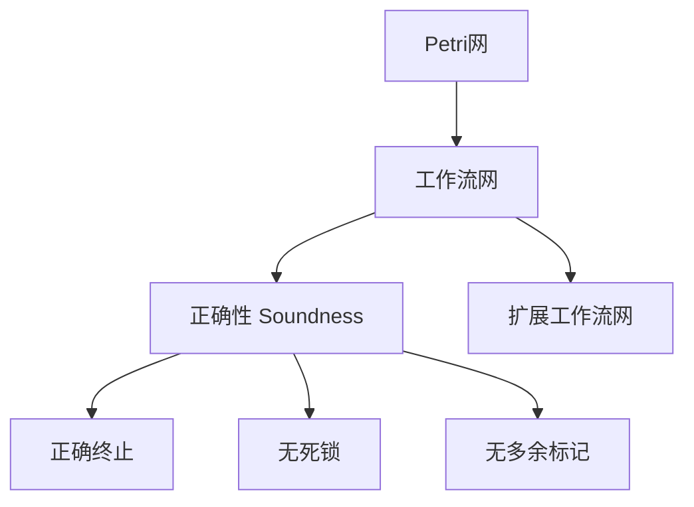
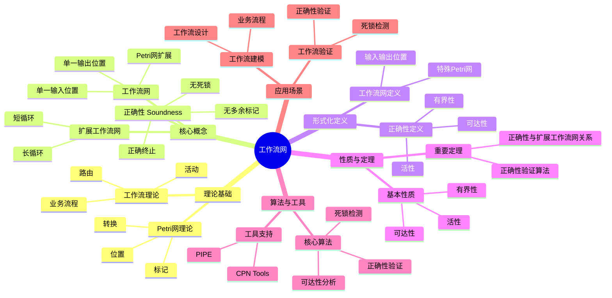
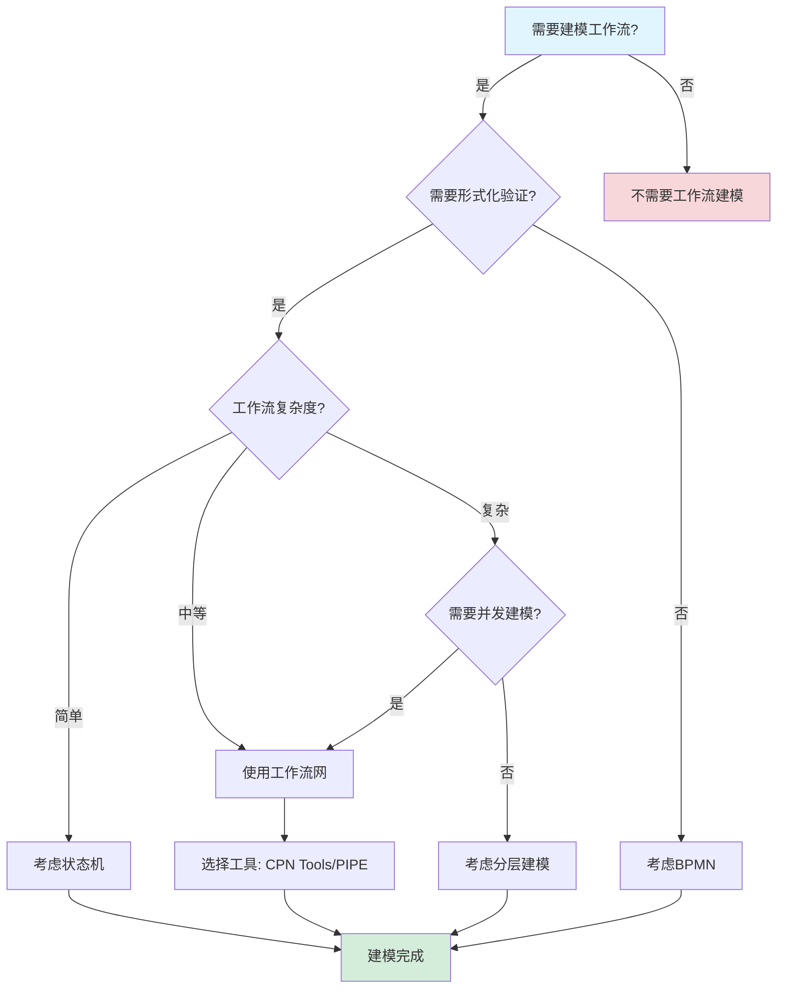
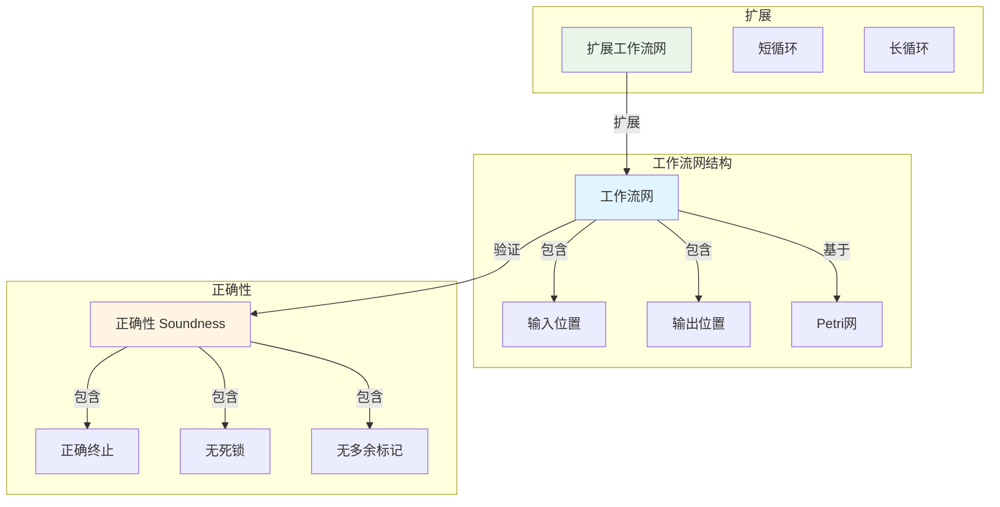
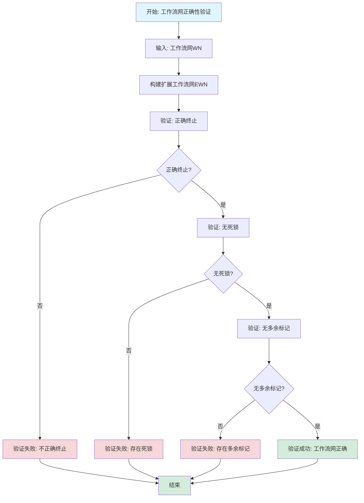

# 工作流网专题文档

## 目录

- [工作流网专题文档](#工作流网专题文档)
  - [目录](#目录)
  - [一、概述](#一概述)
    - [1.1 工作流网简介](#11-工作流网简介)
    - [1.2 核心思想](#12-核心思想)
    - [1.3 应用领域](#13-应用领域)
    - [1.4 在本项目中的应用](#14-在本项目中的应用)
  - [二、历史背景](#二历史背景)
    - [2.1 发展历史](#21-发展历史)
    - [2.2 重要人物](#22-重要人物)
    - [2.3 重要里程碑](#23-重要里程碑)
  - [三、核心概念](#三核心概念)
    - [3.1 基本概念](#31-基本概念)
      - [概念1：工作流网（Workflow Net）](#概念1工作流网workflow-net)
      - [概念2：正确性（Soundness）](#概念2正确性soundness)
      - [概念3：扩展工作流网（Extended Workflow Net）](#概念3扩展工作流网extended-workflow-net)
    - [3.2 概念关系](#32-概念关系)
  - [四、形式化定义](#四形式化定义)
    - [4.1 数学定义](#41-数学定义)
      - [定义1：工作流网](#定义1工作流网)
      - [定义2：正确性（Soundness）](#定义2正确性soundness)
    - [4.2 语法定义](#42-语法定义)
      - [工作流网图形表示](#工作流网图形表示)
    - [4.3 语义定义](#43-语义定义)
      - [语义1：工作流执行语义](#语义1工作流执行语义)
  - [五、性质与定理](#五性质与定理)
    - [5.1 基本性质](#51-基本性质)
      - [性质1：工作流网的有界性](#性质1工作流网的有界性)
      - [性质2：工作流网的活性](#性质2工作流网的活性)
    - [5.2 重要定理](#52-重要定理)
      - [定理1：正确性与扩展工作流网的关系](#定理1正确性与扩展工作流网的关系)
  - [六、正确性标准](#六正确性标准)
    - [6.1 安全性（Soundness）](#61-安全性soundness)
      - [6.1.1 正确终止（Proper Termination）](#611-正确终止proper-termination)
      - [6.1.2 无死锁（No Deadlock）](#612-无死锁no-deadlock)
      - [6.1.3 无多余标记（No Extra Tokens）](#613-无多余标记no-extra-tokens)
    - [6.2 验证方法](#62-验证方法)
      - [方法1：可达性分析](#方法1可达性分析)
      - [方法2：死锁检测](#方法2死锁检测)
  - [七、应用场景](#七应用场景)
    - [7.1 适用场景](#71-适用场景)
      - [场景1：工作流建模](#场景1工作流建模)
      - [场景2：工作流验证](#场景2工作流验证)
    - [7.2 不适用场景](#72-不适用场景)
      - [场景1：实时系统](#场景1实时系统)
      - [场景2：概率系统](#场景2概率系统)
  - [八、实践案例](#八实践案例)
    - [8.1 工业界案例](#81-工业界案例)
      - [案例1：工作流管理系统](#案例1工作流管理系统)
    - [8.2 学术界案例](#82-学术界案例)
      - [案例1：工作流网理论研究](#案例1工作流网理论研究)
  - [九、学习资源](#九学习资源)
    - [9.1 推荐阅读](#91-推荐阅读)
      - [经典著作](#经典著作)
      - [原始论文](#原始论文)
    - [9.2 学习路径](#92-学习路径)
      - [入门路径（1-2周）](#入门路径1-2周)
  - [十、参考文献](#十参考文献)
    - [10.1 经典文献](#101-经典文献)
      - [原始论文](#原始论文-1)
      - [重要论文](#重要论文)
    - [10.2 在线资源](#102-在线资源)
      - [Wikipedia](#wikipedia)
      - [工具文档](#工具文档)
  - [十一、思维表征](#十一思维表征)
    - [11.1 知识体系思维导图](#111-知识体系思维导图)
    - [11.2 多维知识对比矩阵](#112-多维知识对比矩阵)
      - [矩阵1：工作流建模方法对比矩阵](#矩阵1工作流建模方法对比矩阵)
      - [矩阵2：工作流网正确性标准对比矩阵](#矩阵2工作流网正确性标准对比矩阵)
    - [11.3 论证决策树](#113-论证决策树)
      - [决策树1：工作流建模方法选择决策树](#决策树1工作流建模方法选择决策树)
    - [11.4 概念属性关系图](#114-概念属性关系图)
    - [11.5 形式化证明流程图](#115-形式化证明流程图)
      - [证明流程图1：工作流网正确性验证算法](#证明流程图1工作流网正确性验证算法)

---

## 一、概述

### 1.1 工作流网简介

**工作流网（Workflow Net）** 是Petri网的一种特殊形式，用于建模和分析工作流系统。它由Wil van der Aalst在1998年提出，是工作流管理领域的重要理论工具。

**来源**：基于van der Aalst的原始论文和相关著作

**核心特点**：

1. **基于Petri网**：工作流网是Petri网的特殊形式
2. **工作流建模**：专门用于工作流系统建模
3. **正确性验证**：支持工作流正确性验证
4. **广泛应用**：广泛应用于工作流管理系统

### 1.2 核心思想

**核心思想1：Petri网扩展**

工作流网基于Petri网，但增加了工作流特定的约束：

- **输入位置**：有一个输入位置（源位置）
- **输出位置**：有一个输出位置（汇位置）
- **连通性**：所有节点都在从输入到输出的路径上

**核心思想2：正确性标准**

工作流网定义了正确性标准（Soundness）：

- **正确终止**：从初始标记可以到达只包含输出位置标记的标记
- **无死锁**：不存在死锁状态
- **无多余标记**：正确终止时，所有位置（除输出位置）都没有标记

**核心思想3：验证方法**

工作流网支持形式化验证：

- **可达性分析**：分析状态可达性
- **死锁检测**：检测死锁状态
- **正确性验证**：验证工作流正确性

### 1.3 应用领域

**应用领域1：工作流管理**

- 业务流程建模
- 工作流设计
- 工作流验证

**应用领域2：业务流程管理**

- 业务流程分析
- 流程优化
- 流程自动化

**应用领域3：系统设计**

- 系统建模
- 系统验证
- 系统优化

### 1.4 在本项目中的应用

**在本项目中的应用**：

1. **工作流建模**：使用工作流网建模Temporal工作流
2. **正确性验证**：验证工作流的正确性
3. **死锁检测**：检测工作流的死锁状态

**相关文档链接**：

- [形式化验证理论](../03-formal-verification/形式化验证理论.md#五petri网建模与死锁检测)
- [Petri网专题文档](Petri网专题文档.md)

---

## 二、历史背景

### 2.1 发展历史

**1998年**：工作流网提出

- **论文**："The Application of Petri Nets to Workflow Management" by Wil van der Aalst
- **期刊**：The Journal of Circuits, Systems and Computers
- **贡献**：提出了工作流网的概念和正确性标准

**2000年代**：理论发展

- **扩展**：提出多种工作流网变种
- **工具**：开发工作流网分析工具
- **应用**：广泛应用于工作流管理系统

**2010年代至今**：持续发展

- **新模型**：提出新的工作流模型
- **工具改进**：改进分析工具
- **应用扩展**：扩展到更多领域

**来源**：van der Aalst的原始论文和相关著作

### 2.2 重要人物

**Wil van der Aalst**

- **身份**：工作流网的提出者
- **背景**：荷兰计算机科学家，埃因霍温理工大学教授
- **贡献**：
  - 提出工作流网
  - 在工作流管理领域做出重要贡献
  - 提出过程挖掘（Process Mining）理论

**来源**：相关论文和著作

### 2.3 重要里程碑

| 时间 | 里程碑 | 影响 |
|------|--------|------|
| **1998** | 工作流网提出 | 建立工作流建模基础 |
| **2000** | 工具开发 | 提供实用工具 |
| **2010** | 大规模应用 | 证明工作流网实用性 |

---

## 三、核心概念

### 3.1 基本概念

#### 概念1：工作流网（Workflow Net）

**定义**：工作流网是一个Petri网 $N = (P, T, F, M_0)$，满足：

1. 有一个输入位置 $i \in P$，使得 $\bullet i = \emptyset$
2. 有一个输出位置 $o \in P$，使得 $o \bullet = \emptyset$
3. 每个节点都在从 $i$ 到 $o$ 的路径上

**来源**：van der Aalst, "The Application of Petri Nets to Workflow Management" (1998)

#### 概念2：正确性（Soundness）

**定义**：工作流网是正确的（sound），如果：

1. **正确终止**：从初始标记 $M_0 = [i]$，可以到达只包含输出位置标记的标记 $M_f = [o]$
2. **无死锁**：不存在死锁状态
3. **无多余标记**：正确终止时，所有位置（除输出位置）都没有标记

**来源**：van der Aalst, "The Application of Petri Nets to Workflow Management" (1998)

#### 概念3：扩展工作流网（Extended Workflow Net）

**定义**：扩展工作流网是在工作流网的基础上，添加一个额外的转换 $t^*$，连接输出位置和输入位置。

**形式化定义**：

$$ N^* = (P, T \cup \{t^*\}, F \cup \{(o, t^*), (t^*, i)\}, M_0) $$

**来源**：van der Aalst, "The Application of Petri Nets to Workflow Management" (1998)

### 3.2 概念关系

**概念关系图**：



---

## 四、形式化定义

### 4.1 数学定义

#### 定义1：工作流网

**定义**：工作流网是一个Petri网 $N = (P, T, F, M_0)$，满足：

1. **输入位置**：$\exists i \in P: \bullet i = \emptyset \land M_0(i) = 1 \land \forall p \in P \setminus \{i\}: M_0(p) = 0$
2. **输出位置**：$\exists o \in P: o \bullet = \emptyset$
3. **连通性**：$\forall n \in P \cup T: (i, n) \in F^* \land (n, o) \in F^*$

其中 $F^*$ 是 $F$ 的传递闭包。

**来源**：van der Aalst, "The Application of Petri Nets to Workflow Management" (1998)

#### 定义2：正确性（Soundness）

**定义**：工作流网 $N$ 是正确的（sound），如果：

1. **正确终止**：$\exists M_f: M_0 \to^* M_f \land M_f(o) = 1 \land \forall p \in P \setminus \{o\}: M_f(p) = 0$
2. **无死锁**：$\forall M \in R(M_0): M \to^* M_f \lor \exists t \in T: M[t\rangle$
3. **无多余标记**：$\forall M \in R(M_0): M \to^* M_f \implies M = M_f$

**来源**：van der Aalst, "The Application of Petri Nets to Workflow Management" (1998)

### 4.2 语法定义

#### 工作流网图形表示

**1. 输入位置（Source Place）**

```text
(i)  -- 输入位置，初始有一个标记
```

**2. 输出位置（Sink Place）**

```text
(o)  -- 输出位置，正确终止时有一个标记
```

**3. 转换（Transition）**

```text
[t]  -- 转换，表示工作流步骤
```

**4. 位置（Place）**

```text
(p)  -- 位置，表示工作流状态
```

### 4.3 语义定义

#### 语义1：工作流执行语义

**定义**：工作流的执行是从输入位置开始，通过转换触发，最终到达输出位置的过程。

**形式化定义**：

$$ \text{Execution} = M_0 \to^{t_1} M_1 \to^{t_2} M_2 \to^{t_3} ... \to^{t_n} M_f $$

其中 $M_0 = [i]$，$M_f = [o]$。

**来源**：van der Aalst, "The Application of Petri Nets to Workflow Management" (1998)

---

## 五、性质与定理

### 5.1 基本性质

#### 性质1：工作流网的有界性

**表述**：工作流网是有界的。

**形式化表述**：

$$ \forall M \in R(M_0), \forall p \in P: M(p) \le k $$

其中 $k$ 是某个常数。

**来源**：相关工作流网理论

#### 性质2：工作流网的活性

**表述**：正确的工作流网是活的。

**形式化表述**：

$$ \text{Sound}(N) \implies \forall t \in T: \text{Live}(t) $$

**来源**：相关工作流网理论

### 5.2 重要定理

#### 定理1：正确性与扩展工作流网的关系

**表述**：工作流网 $N$ 是正确的，当且仅当其扩展工作流网 $N^*$ 是活的且有界的。

**形式化表述**：

$$ \text{Sound}(N) \iff \text{Live}(N^*) \land \text{Bounded}(N^*) $$

**证明思路**：

1. **必要性**：如果 $N$ 是正确的，则 $N^*$ 是活的且有界的
2. **充分性**：如果 $N^*$ 是活的且有界的，则 $N$ 是正确的

**来源**：van der Aalst, "The Application of Petri Nets to Workflow Management" (1998)

---

## 六、正确性标准

### 6.1 安全性（Soundness）

#### 6.1.1 正确终止（Proper Termination）

**定义**：从初始标记可以到达只包含输出位置标记的标记。

**形式化定义**：

$$ \exists M_f: M_0 \to^* M_f \land M_f(o) = 1 \land \forall p \in P \setminus \{o\}: M_f(p) = 0 $$

**来源**：van der Aalst, "The Application of Petri Nets to Workflow Management" (1998)

#### 6.1.2 无死锁（No Deadlock）

**定义**：不存在死锁状态，即从任意可达标记，都可以继续执行或到达终止状态。

**形式化定义**：

$$ \forall M \in R(M_0): M \to^* M_f \lor \exists t \in T: M[t\rangle $$

**来源**：van der Aalst, "The Application of Petri Nets to Workflow Management" (1998)

#### 6.1.3 无多余标记（No Extra Tokens）

**定义**：正确终止时，所有位置（除输出位置）都没有标记。

**形式化定义**：

$$ \forall M \in R(M_0): M \to^* M_f \implies M = M_f $$

**来源**：van der Aalst, "The Application of Petri Nets to Workflow Management" (1998)

### 6.2 验证方法

#### 方法1：可达性分析

**描述**：通过可达性分析验证正确终止。

**算法**：

```algorithm
VerifyProperTermination(N):
输入：工作流网 N = (P, T, F, M_0)
输出：是否满足正确终止

1. M_f ← [o]  -- 目标标记
2. R ← ReachabilityAnalysis(N, M_0)
3. if M_f ∈ R:
      return true
   else:
      return false
```

**来源**：相关工作流网验证方法

#### 方法2：死锁检测

**描述**：通过死锁检测验证无死锁。

**算法**：

```algorithm
VerifyNoDeadlock(N):
输入：工作流网 N = (P, T, F, M_0)
输出：是否存在死锁

1. R ← ReachabilityAnalysis(N, M_0)
2. M_f ← [o]
3. for each M ∈ R:
      if M ≠ M_f and ∀t ∈ T: ¬M[t⟩:
         return false  -- 发现死锁
4. return true  -- 无死锁
```

**来源**：相关工作流网验证方法

---

## 七、应用场景

### 7.1 适用场景

#### 场景1：工作流建模

**描述**：使用工作流网建模业务流程。

**优势**：

- 图形化表示，易于理解
- 支持形式化验证
- 可以发现设计问题

**示例**：业务流程建模、工作流设计

#### 场景2：工作流验证

**描述**：使用工作流网验证工作流的正确性。

**优势**：

- 可以验证正确性
- 可以发现死锁
- 可以优化工作流

**示例**：工作流正确性验证、死锁检测

### 7.2 不适用场景

#### 场景1：实时系统

**描述**：标准工作流网不适合建模实时约束。

**原因**：

- 工作流网不直接支持时间约束
- 实时系统需要使用时间工作流网

#### 场景2：概率系统

**描述**：标准工作流网不适合建模概率性质。

**原因**：

- 工作流网是确定性的
- 概率系统需要使用随机工作流网

---

## 八、实践案例

### 8.1 工业界案例

#### 案例1：工作流管理系统

**背景**：使用工作流网建模和验证工作流管理系统。

**应用**：

- 业务流程建模
- 工作流验证
- 流程优化

**效果**：

- 提高了工作流可靠性
- 发现了工作流问题
- 优化了工作流效率

**来源**：相关工作流管理系统案例

### 8.2 学术界案例

#### 案例1：工作流网理论研究

**背景**：van der Aalst等学者进行工作流网理论研究。

**贡献**：

- 建立了工作流网理论
- 提供了验证方法
- 推动了工作流研究

**来源**：van der Aalst的论文和著作

---

## 九、学习资源

### 9.1 推荐阅读

#### 经典著作

1. **"Workflow Management: Models, Methods, and Systems"**
   - 作者：Wil van der Aalst, Kees van Hee
   - 出版社：MIT Press
   - 出版年份：2004
   - **推荐理由**：工作流管理的权威教材

#### 原始论文

1. **"The Application of Petri Nets to Workflow Management"**
   - 作者：Wil van der Aalst
   - 期刊：The Journal of Circuits, Systems and Computers
   - 年份：1998
   - **推荐理由**：工作流网的原始论文

### 9.2 学习路径

#### 入门路径（1-2周）

1. **Week 1**：
   - 阅读工作流网的原始论文
   - 理解工作流网的基本概念
   - 学习正确性标准

2. **Week 2**：
   - 学习验证方法
   - 使用工具进行实践
   - 完成实际案例分析

---

## 十、参考文献

### 10.1 经典文献

#### 原始论文

1. **van der Aalst, W. M. P. (1998). "The Application of Petri Nets to Workflow Management"**
   - 期刊：The Journal of Circuits, Systems and Computers
   - **重要性**：工作流网的原始论文

#### 重要论文

2. **van der Aalst, W. M. P., & van Hee, K. (2004). "Workflow Management: Models, Methods, and Systems"**
   - 出版社：MIT Press
   - **重要性**：工作流管理的权威教材

### 10.2 在线资源

#### Wikipedia

- [Workflow Net](https://en.wikipedia.org/wiki/Workflow_net)
- [Petri Net](https://en.wikipedia.org/wiki/Petri_net)

#### 工具文档

- **CPN Tools文档**：CPN Tools官方网站
- **PIPE文档**：PIPE官方网站

---

**文档版本**：1.0

**创建时间**：2024年

**维护者**：项目团队

**最后更新**：2024年

**对标资源**：

- ✅ 经典著作: "Workflow Management: Models, Methods, and Systems" by van der Aalst & van Hee (2004)
- ✅ 原始论文: "The Application of Petri Nets to Workflow Management" by van der Aalst (1998)
- ✅ Wikipedia: [Workflow Net](https://en.wikipedia.org/wiki/Workflow_net)

---

## 十一、思维表征

### 11.1 知识体系思维导图

**工作流网知识体系思维导图**：



### 11.2 多维知识对比矩阵

#### 矩阵1：工作流建模方法对比矩阵

| 建模方法 | 形式化程度 | 可视化 | 验证能力 | 工具支持 | 适用场景 |
|---------|-----------|--------|---------|---------|---------|
| **工作流网** | ⭐⭐⭐⭐⭐ | ⭐⭐⭐⭐ | ⭐⭐⭐⭐⭐ | ⭐⭐⭐ | 工作流建模、验证 |
| **BPMN** | ⭐⭐⭐ | ⭐⭐⭐⭐⭐ | ⭐⭐ | ⭐⭐⭐⭐⭐ | 业务流程建模 |
| **Petri网** | ⭐⭐⭐⭐ | ⭐⭐⭐⭐ | ⭐⭐⭐⭐ | ⭐⭐⭐ | 并发系统建模 |
| **状态机** | ⭐⭐⭐ | ⭐⭐⭐⭐ | ⭐⭐⭐ | ⭐⭐⭐⭐ | 顺序流程建模 |

#### 矩阵2：工作流网正确性标准对比矩阵

| 正确性标准 | 严格程度 | 验证复杂度 | 适用场景 |
|-----------|---------|-----------|---------|
| **正确终止** | ⭐⭐⭐⭐⭐ | ⭐⭐⭐ | 所有工作流 |
| **无死锁** | ⭐⭐⭐⭐ | ⭐⭐⭐⭐ | 并发工作流 |
| **无多余标记** | ⭐⭐⭐⭐⭐ | ⭐⭐⭐ | 所有工作流 |

### 11.3 论证决策树

#### 决策树1：工作流建模方法选择决策树



### 11.4 概念属性关系图

**工作流网核心概念属性关系图**：



### 11.5 形式化证明流程图

#### 证明流程图1：工作流网正确性验证算法



---

**思维表征说明**：

- **思维导图**：全面展示工作流网的知识体系结构
- **对比矩阵**：从多个维度对比工作流建模方法和正确性标准
- **决策树**：提供清晰的决策路径，帮助选择合适的工作流建模方法
- **关系图**：详细展示工作流网结构、正确性和扩展之间的关系
- **证明流程图**：可视化工作流网正确性验证算法的执行流程

**来源**：基于工作流网理论、van der Aalst的著作和实际应用经验
