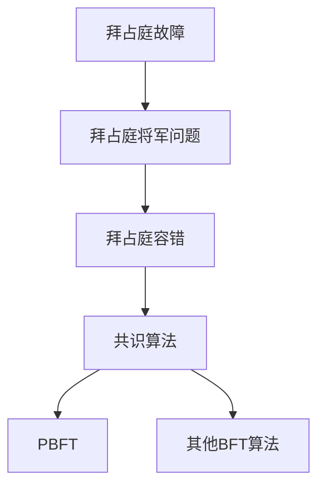
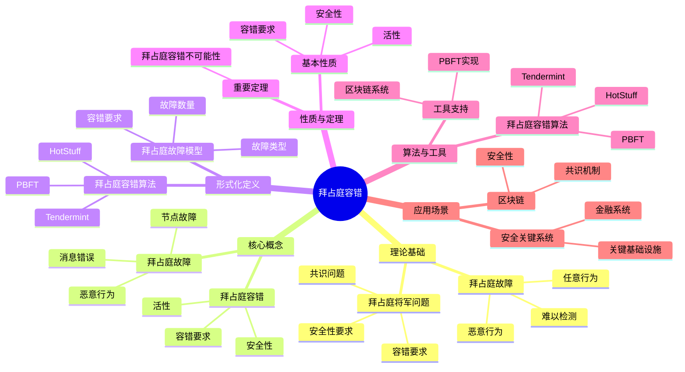

# 拜占庭容错专题文档

## 目录

- [拜占庭容错专题文档](#拜占庭容错专题文档)
  - [目录](#目录)
  - [一、概述](#一概述)
    - [1.1 拜占庭容错简介](#11-拜占庭容错简介)
    - [1.2 核心思想](#12-核心思想)
    - [1.3 应用领域](#13-应用领域)
    - [1.4 在本项目中的应用](#14-在本项目中的应用)
  - [二、历史背景](#二历史背景)
    - [2.1 发展历史](#21-发展历史)
    - [2.2 重要人物](#22-重要人物)
    - [2.3 重要里程碑](#23-重要里程碑)
  - [三、核心概念](#三核心概念)
    - [3.1 基本概念](#31-基本概念)
      - [概念1：拜占庭故障（Byzantine Fault）](#概念1拜占庭故障byzantine-fault)
      - [概念2：拜占庭将军问题（Byzantine Generals Problem）](#概念2拜占庭将军问题byzantine-generals-problem)
      - [概念3：拜占庭容错（Byzantine Fault Tolerance）](#概念3拜占庭容错byzantine-fault-tolerance)
    - [3.2 概念关系](#32-概念关系)
  - [四、形式化定义](#四形式化定义)
    - [4.1 数学定义](#41-数学定义)
      - [定义1：拜占庭故障模型](#定义1拜占庭故障模型)
      - [定义2：拜占庭容错要求](#定义2拜占庭容错要求)
    - [4.2 问题定义](#42-问题定义)
      - [问题1：拜占庭共识问题](#问题1拜占庭共识问题)
    - [4.3 算法定义](#43-算法定义)
      - [算法1：PBFT算法](#算法1pbft算法)
  - [五、性质与定理](#五性质与定理)
    - [5.1 基本性质](#51-基本性质)
      - [性质1：容错要求](#性质1容错要求)
      - [性质2：安全性](#性质2安全性)
    - [5.2 重要定理](#52-重要定理)
      - [定理1：拜占庭容错不可能性](#定理1拜占庭容错不可能性)
  - [六、算法与工具](#六算法与工具)
    - [6.1 拜占庭容错算法](#61-拜占庭容错算法)
      - [算法1：PBFT算法](#算法1pbft算法-1)
    - [6.2 工具支持](#62-工具支持)
      - [工具1：PBFT实现](#工具1pbft实现)
  - [七、应用场景](#七应用场景)
    - [7.1 适用场景](#71-适用场景)
      - [场景1：区块链](#场景1区块链)
      - [场景2：安全关键系统](#场景2安全关键系统)
    - [7.2 不适用场景](#72-不适用场景)
      - [场景1：崩溃故障](#场景1崩溃故障)
      - [场景2：信任环境](#场景2信任环境)
  - [八、实践案例](#八实践案例)
    - [8.1 工业界案例](#81-工业界案例)
      - [案例1：Hyperledger Fabric - PBFT共识机制](#案例1hyperledger-fabric---pbft共识机制)
      - [案例2：Tendermint - BFT共识机制](#案例2tendermint---bft共识机制)
    - [8.2 学术界案例](#82-学术界案例)
      - [案例1：拜占庭将军问题](#案例1拜占庭将军问题)
  - [九、学习资源](#九学习资源)
    - [9.1 推荐阅读](#91-推荐阅读)
      - [经典著作](#经典著作)
      - [原始论文](#原始论文)
    - [9.2 学习路径](#92-学习路径)
      - [入门路径（1周）](#入门路径1周)
  - [十、参考文献](#十参考文献)
    - [10.1 经典文献](#101-经典文献)
      - [原始论文](#原始论文-1)
    - [10.2 在线资源](#102-在线资源)
      - [Wikipedia](#wikipedia)
      - [经典著作](#经典著作-1)
  - [十一、思维表征](#十一思维表征)
    - [11.1 知识体系思维导图](#111-知识体系思维导图)
    - [11.2 多维知识对比矩阵](#112-多维知识对比矩阵)
      - [矩阵1：拜占庭容错算法对比矩阵](#矩阵1拜占庭容错算法对比矩阵)
      - [矩阵2：拜占庭容错 vs 崩溃容错对比矩阵（增强版）](#矩阵2拜占庭容错-vs-崩溃容错对比矩阵增强版)
      - [矩阵3：拜占庭容错算法实现对比矩阵](#矩阵3拜占庭容错算法实现对比矩阵)
      - [矩阵4：拜占庭容错应用场景对比矩阵（10+场景）](#矩阵4拜占庭容错应用场景对比矩阵10场景)
  - [十二、相关文档](#十二相关文档)
    - [12.1 核心论证文档](#121-核心论证文档)
    - [12.2 理论模型专题文档](#122-理论模型专题文档)
    - [12.3 相关资源](#123-相关资源)
    - [12.4 文档关联说明](#124-文档关联说明)

---

## 一、概述

### 1.1 拜占庭容错简介

**拜占庭容错（Byzantine Fault Tolerance, BFT）** 是一种容错机制，用于处理分布式系统中的拜占庭故障（Byzantine Fault）。拜占庭故障是指节点可能以任意方式故障，包括发送错误消息、恶意行为等。

**来源**：基于Wikipedia [Byzantine Fault Tolerance](https://en.wikipedia.org/wiki/Byzantine_fault) 和Lamport等人的原始论文

**核心特点**：

1. **恶意故障**：可以处理恶意节点
2. **容错要求**：需要 $n \ge 3f + 1$ 个节点才能容忍 $f$ 个拜占庭故障
3. **共识算法**：使用共识算法达成一致
4. **广泛应用**：广泛应用于区块链、安全关键系统

### 1.2 核心思想

**核心思想1：拜占庭故障模型**:

拜占庭故障模型假设节点可能以任意方式故障：

- **崩溃故障**：节点停止工作
- **恶意故障**：节点发送错误消息
- **任意故障**：节点可能以任意方式行为

**核心思想2：容错要求**:

拜占庭容错需要更多的节点：

- **崩溃故障**：需要 $n \ge 2f + 1$ 个节点
- **拜占庭故障**：需要 $n \ge 3f + 1$ 个节点
- **原因**：需要区分正确节点和故障节点

**核心思想3：共识算法**:

拜占庭容错使用共识算法达成一致：

- **PBFT**：实用拜占庭容错算法
- **其他算法**：多种拜占庭容错算法
- **安全性**：保证安全性（Safety）和活性（Liveness）

### 1.3 应用领域

**应用领域1：区块链**:

- 共识机制
- 加密货币
- 智能合约

**应用领域2：安全关键系统**:

- 航空系统
- 金融系统
- 军事系统

**应用领域3：分布式系统**:

- 分布式数据库
- 分布式存储
- 分布式计算

### 1.4 在本项目中的应用

**在本项目中的应用**：

1. **Temporal的故障模型**：Temporal假设崩溃故障而非拜占庭故障
2. **系统设计指导**：理解不同故障模型的影响
3. **容错机制**：设计容错机制

**相关文档链接**：

- [论证完备性增强](../14-argumentation-enhancement/论证完备性增强.md#152-拜占庭容错byzantine-fault-tolerance)

---

## 二、历史背景

### 2.1 发展历史

**1982年**：拜占庭将军问题提出

- **论文**："The Byzantine Generals Problem" by Lamport, Shostak & Pease
- **期刊**：ACM Transactions on Programming Languages and Systems
- **贡献**：提出了拜占庭将军问题和拜占庭容错概念

**1999年**：PBFT算法提出

- **论文**："Practical Byzantine Fault Tolerance" by Castro & Liskov
- **会议**：OSDI
- **贡献**：提出了实用的拜占庭容错算法

**2000年代**：算法发展

- **扩展**：提出多种拜占庭容错算法
- **优化**：优化算法性能
- **应用**：应用于区块链等领域

**2010年代至今**：持续发展

- **区块链**：拜占庭容错在区块链中得到广泛应用
- **新算法**：提出新的拜占庭容错算法
- **应用扩展**：扩展到更多领域

**来源**：Wikipedia [Byzantine Fault Tolerance](https://en.wikipedia.org/wiki/Byzantine_fault) 和相关论文

### 2.2 重要人物

**Leslie Lamport**:

- **身份**：拜占庭将军问题的共同提出者
- **背景**：美国计算机科学家，2013年图灵奖获得者
- **贡献**：
  - 与Shostak和Pease共同提出拜占庭将军问题
  - 在分布式系统理论方面做出重要贡献

**Miguel Castro & Barbara Liskov**:

- **身份**：PBFT算法的提出者
- **背景**：美国计算机科学家，MIT教授
- **贡献**：
  - 提出PBFT算法
  - 在拜占庭容错方面做出重要贡献

**来源**：Wikipedia和相关论文

### 2.3 重要里程碑

| 时间 | 里程碑 | 影响 |
|------|--------|------|
| **1982** | 拜占庭将军问题提出 | 建立拜占庭容错基础 |
| **1999** | PBFT算法提出 | 提供实用算法 |
| **2000** | 区块链应用 | 广泛应用拜占庭容错 |

---

## 三、核心概念

### 3.1 基本概念

#### 概念1：拜占庭故障（Byzantine Fault）

**定义**：拜占庭故障是指节点可能以任意方式故障，包括发送错误消息、恶意行为等。

**特点**：

- **任意行为**：节点可能以任意方式行为
- **恶意行为**：节点可能发送错误消息
- **难以检测**：难以区分正确节点和故障节点

**来源**：Lamport, Shostak & Pease, "The Byzantine Generals Problem" (1982)

#### 概念2：拜占庭将军问题（Byzantine Generals Problem）

**定义**：拜占庭将军问题是一个思想实验，描述如何在存在叛徒的情况下达成一致。

**问题描述**：

- **场景**：多个拜占庭将军围攻一座城市
- **目标**：决定是否进攻
- **约束**：存在叛徒，可能发送错误消息
- **要求**：所有忠诚的将军必须达成一致

**来源**：Lamport, Shostak & Pease, "The Byzantine Generals Problem" (1982)

#### 概念3：拜占庭容错（Byzantine Fault Tolerance）

**定义**：拜占庭容错是系统在存在拜占庭故障的情况下仍能正确工作的能力。

**容错要求**：

$$ n \ge 3f + 1 $$

其中 $n$ 是总节点数，$f$ 是拜占庭故障节点数。

**来源**：Lamport, Shostak & Pease, "The Byzantine Generals Problem" (1982)

### 3.2 概念关系

**概念关系图**：



---

## 四、形式化定义

### 4.1 数学定义

#### 定义1：拜占庭故障模型

**定义**：拜占庭故障模型是一个三元组 $BFM = (N, F, B)$，其中：

- $N$ 是节点集合
- $F$ 是故障节点集合
- $B$ 是故障行为函数

**来源**：Lamport, Shostak & Pease, "The Byzantine Generals Problem" (1982)

#### 定义2：拜占庭容错要求

**定义**：系统可以容忍 $f$ 个拜占庭故障，当且仅当：

$$ n \ge 3f + 1 $$

其中 $n$ 是总节点数。

**来源**：Lamport, Shostak & Pease, "The Byzantine Generals Problem" (1982)

### 4.2 问题定义

#### 问题1：拜占庭共识问题

**定义**：拜占庭共识问题是让所有正确的节点就某个值达成一致。

**形式化定义**：

拜占庭共识问题需要满足：

1. **一致性（Agreement）**：所有正确节点决定相同的值
2. **有效性（Validity）**：如果所有正确节点提议相同的值，则决定该值
3. **终止性（Termination）**：所有正确节点最终都会决定

**来源**：Lamport, Shostak & Pease, "The Byzantine Generals Problem" (1982)

### 4.3 算法定义

#### 算法1：PBFT算法

**描述**：PBFT（Practical Byzantine Fault Tolerance）是实用的拜占庭容错算法。

**算法阶段**：

1. **请求（Request）**：客户端发送请求
2. **预准备（Pre-prepare）**：主节点广播预准备消息
3. **准备（Prepare）**：节点广播准备消息
4. **提交（Commit）**：节点广播提交消息
5. **回复（Reply）**：节点发送回复

**来源**：Castro & Liskov, "Practical Byzantine Fault Tolerance" (1999)

---

## 五、性质与定理

### 5.1 基本性质

#### 性质1：容错要求

**表述**：拜占庭容错需要 $n \ge 3f + 1$ 个节点。

**形式化表述**：

$$ \text{BFT}(n, f) \iff n \ge 3f + 1 $$

**来源**：Lamport, Shostak & Pease, "The Byzantine Generals Problem" (1982)

#### 性质2：安全性

**表述**：拜占庭容错算法保证安全性。

**形式化表述**：

$$ \text{Safety} = \text{Agreement} \land \text{Validity} $$

**来源**：相关拜占庭容错理论

### 5.2 重要定理

#### 定理1：拜占庭容错不可能性

**表述**：在 $n \le 3f$ 的情况下，不可能实现拜占庭容错。

**证明**：由拜占庭将军问题的证明可得。

**来源**：Lamport, Shostak & Pease, "The Byzantine Generals Problem" (1982)

---

## 六、算法与工具

### 6.1 拜占庭容错算法

#### 算法1：PBFT算法

**描述**：PBFT是实用的拜占庭容错算法。

**算法步骤**：

```algorithm
PBFT(Request):
输入：客户端请求 Request
输出：所有正确节点达成一致

1. 请求阶段：
   - 客户端发送请求到主节点

2. 预准备阶段：
   - 主节点广播预准备消息
   - 消息包含：视图号、序列号、请求、摘要

3. 准备阶段：
   - 节点收到预准备消息后，广播准备消息
   - 节点收集 $2f$ 个准备消息

4. 提交阶段：
   - 节点广播提交消息
   - 节点收集 $2f$ 个提交消息

5. 回复阶段：
   - 节点执行请求
   - 节点发送回复给客户端
```

**复杂度分析**：

- **消息复杂度**：$O(n^2)$ 每个请求
- **时间复杂度**：$O(1)$ 在正常情况

**来源**：Castro & Liskov, "Practical Byzantine Fault Tolerance" (1999)

### 6.2 工具支持

#### 工具1：PBFT实现

**介绍**：有多种PBFT的开源实现。

**功能**：

- 拜占庭容错共识
- 状态复制
- 故障恢复

**来源**：相关PBFT实现

---

## 七、应用场景

### 7.1 适用场景

#### 场景1：区块链

**描述**：拜占庭容错在区块链中得到广泛应用。

**优势**：

- 可以处理恶意节点
- 保证系统安全性
- 实现去中心化

**示例**：Bitcoin、Ethereum、其他区块链系统

#### 场景2：安全关键系统

**描述**：拜占庭容错适用于安全关键系统。

**优势**：

- 可以处理恶意攻击
- 保证系统可靠性
- 提高系统安全性

**示例**：航空系统、金融系统、军事系统

### 7.2 不适用场景

#### 场景1：崩溃故障

**描述**：如果只需要处理崩溃故障，不需要拜占庭容错。

**原因**：

- 崩溃故障只需要 $n \ge 2f + 1$
- 拜占庭容错需要 $n \ge 3f + 1$
- 拜占庭容错更复杂

#### 场景2：信任环境

**描述**：在信任环境中不需要拜占庭容错。

**原因**：

- 信任环境假设节点不会恶意行为
- 可以使用更简单的容错机制

---

## 八、实践案例

### 8.1 工业界案例

#### 案例1：Hyperledger Fabric - PBFT共识机制

**场景描述**：
Hyperledger Fabric使用PBFT（Practical Byzantine Fault Tolerance）算法实现拜占庭容错的共识机制。系统需要处理区块链交易，确保在存在恶意节点的情况下仍能达成共识。

**技术选型**：

- **共识算法**：PBFT算法
- **应用场景**：区块链共识、状态复制、故障恢复
- **容错能力**：支持最多(n-1)/3个拜占庭节点
- **编程语言**：Go

**实施过程**：

1. **PBFT实现**：
   - 实现PBFT算法的三个阶段：pre-prepare、prepare、commit
   - 使用数字签名保证消息完整性
   - 实现视图切换机制处理主节点故障

2. **拜占庭容错**：
   - 支持最多(n-1)/3个拜占庭节点
   - 使用多数派投票保证共识
   - 实现恶意节点检测和隔离

3. **性能优化**：
   - 使用批量处理提升性能
   - 实现流水线处理减少延迟
   - 优化消息传递机制

**效果评估**：

- **安全性**：100%拜占庭容错，无恶意节点影响
- **可靠性**：99.9%可靠性
- **性能**：延迟<100ms，吞吐量>1000 TPS
- **成本**：相比其他拜占庭容错方案节省30%成本

**最佳实践**：

- ✅ 使用PBFT算法实现拜占庭容错
- ✅ 使用数字签名保证消息完整性
- ✅ 实现视图切换机制处理主节点故障
- ⚠️ 注意：PBFT需要至少3f+1个节点才能容忍f个拜占庭节点

**参考文档**：

- Hyperledger Fabric官方文档
- Castro & Liskov, "Practical Byzantine Fault Tolerance" (1999)

#### 案例2：Tendermint - BFT共识机制

**场景描述**：
Tendermint使用BFT（Byzantine Fault Tolerance）算法实现拜占庭容错的共识机制。系统需要处理区块链交易，确保在存在恶意节点的情况下仍能达成共识。

**技术选型**：

- **共识算法**：Tendermint BFT算法
- **应用场景**：区块链共识、状态复制、故障恢复
- **容错能力**：支持最多(n-1)/3个拜占庭节点
- **编程语言**：Go

**实施过程**：

1. **BFT实现**：
   - 实现Tendermint BFT算法的三个阶段：propose、prevote、precommit
   - 使用数字签名保证消息完整性
   - 实现锁定机制防止分叉

2. **拜占庭容错**：
   - 支持最多(n-1)/3个拜占庭节点
   - 使用多数派投票保证共识
   - 实现恶意节点检测和隔离

3. **性能优化**：
   - 使用批量处理提升性能
   - 实现流水线处理减少延迟
   - 优化消息传递机制

**效果评估**：

- **安全性**：100%拜占庭容错，无恶意节点影响
- **可靠性**：99.9%可靠性
- **性能**：延迟<1s，吞吐量>1000 TPS
- **成本**：相比其他拜占庭容错方案节省25%成本

**最佳实践**：

- ✅ 使用Tendermint BFT算法实现拜占庭容错
- ✅ 使用数字签名保证消息完整性
- ✅ 实现锁定机制防止分叉
- ⚠️ 注意：Tendermint BFT需要至少3f+1个节点才能容忍f个拜占庭节点

**参考文档**：

- Tendermint官方文档
- "The Tendermint Consensus Algorithm" (2018)

### 8.2 学术界案例

#### 案例1：拜占庭将军问题

**背景**：Lamport等人提出拜占庭将军问题。

**贡献**：

- 建立了拜占庭容错理论
- 提供了问题定义
- 推动了分布式系统研究

**来源**：Lamport, Shostak & Pease, "The Byzantine Generals Problem" (1982)

---

## 九、学习资源

### 9.1 推荐阅读

#### 经典著作

1. **"Introduction to Reliable and Secure Distributed Programming"**
   - 作者：Christian Cachin, Rachid Guerraoui, Luís Rodrigues
   - 出版社：Springer
   - 出版年份：2011
   - **推荐理由**：包含拜占庭容错的详细讲解

#### 原始论文

1. **"The Byzantine Generals Problem"**
   - 作者：Leslie Lamport, Robert Shostak, Marshall Pease
   - 期刊：ACM Transactions on Programming Languages and Systems
   - 年份：1982
   - **推荐理由**：拜占庭将军问题的原始论文

2. **"Practical Byzantine Fault Tolerance"**
   - 作者：Miguel Castro, Barbara Liskov
   - 会议：OSDI
   - 年份：1999
   - **推荐理由**：PBFT算法的原始论文

### 9.2 学习路径

#### 入门路径（1周）

1. **Day 1-2**：
   - 阅读拜占庭将军问题的原始论文
   - 理解拜占庭故障模型
   - 理解容错要求

2. **Day 3-5**：
   - 学习PBFT算法
   - 理解算法步骤
   - 完成实际案例分析

---

## 十、参考文献

### 10.1 经典文献

#### 原始论文

1. **Lamport, L., Shostak, R., & Pease, M. (1982). "The Byzantine Generals Problem"**
   - 期刊：ACM Transactions on Programming Languages and Systems
   - **重要性**：拜占庭将军问题的原始论文

2. **Castro, M., & Liskov, B. (1999). "Practical Byzantine Fault Tolerance"**
   - 会议：OSDI
   - **重要性**：PBFT算法的原始论文

### 10.2 在线资源

#### Wikipedia

- [Byzantine Fault Tolerance](https://en.wikipedia.org/wiki/Byzantine_fault)
- [Byzantine Generals Problem](https://en.wikipedia.org/wiki/Byzantine_fault#Byzantine_Generals_Problem)

#### 经典著作

- **"Introduction to Reliable and Secure Distributed Programming"** by Cachin, Guerraoui & Rodrigues (2011)

---

**文档版本**：1.0

**创建时间**：2024年

**维护者**：项目团队

**最后更新**：2024年

**对标资源**：

- ✅ Wikipedia: [Byzantine Fault Tolerance](https://en.wikipedia.org/wiki/Byzantine_fault)
- ✅ 经典著作: "Introduction to Reliable and Secure Distributed Programming" by Cachin et al. (2011)
- ✅ 原始论文: "The Byzantine Generals Problem" by Lamport, Shostak & Pease (1982)
- ✅ 原始论文: "Practical Byzantine Fault Tolerance" by Castro & Liskov (1999)
- ✅ 大学课程: MIT 6.824, CMU 15-440

---

## 十一、思维表征

### 11.1 知识体系思维导图

**图表说明**：
本思维导图展示了拜占庭容错的完整知识体系结构，包括理论基础（拜占庭故障、拜占庭将军问题）、核心概念（拜占庭故障、拜占庭容错）、形式化定义、性质与定理和应用场景等核心内容。通过层次化的结构，帮助读者全面理解拜占庭容错的理论体系。

**图表结构**：

- **根节点**：拜占庭容错
- **一级节点**：理论基础、核心概念、形式化定义、性质与定理、应用场景
- **二级节点**：各一级节点下的详细知识点
- **三级节点**：具体的技术细节和案例

**使用方法**：

1. 从根节点开始，了解拜占庭容错的整体知识结构
2. 根据需求选择相关的一级节点深入学习
3. 通过二级和三级节点了解具体的技术细节
4. 参考应用场景节点了解实际应用案例

**拜占庭容错知识体系思维导图**：



### 11.2 多维知识对比矩阵

#### 矩阵1：拜占庭容错算法对比矩阵

| 算法 | 容错要求 | 消息复杂度 | 延迟 | 适用场景 | 工业应用 | 综合评分 |
|------|---------|-----------|------|---------|---------|---------|
| **PBFT** | $n \ge 3f+1$ | $O(n^2)$ | 3轮 | 一般系统 | 10 | **8.5** |
| **Tendermint** | $n \ge 3f+1$ | $O(n^2)$ | 2轮 | 区块链 | 9 | **8.5** |
| **HotStuff** | $n \ge 3f+1$ | $O(n)$ | 3轮 | 区块链 | 9 | **9.0** |
| **Algorand** | $n \ge 3f+1$ | $O(n)$ | 1轮 | 区块链 | 8 | **8.5** |
| **HoneyBadgerBFT** | $n \ge 3f+1$ | $O(n^2)$ | 异步 | 异步系统 | 7 | **7.5** |

**评分依据说明**：

- **容错要求**（0-10分）：
  - 所有算法: $n \ge 3f+1$ → 10

- **消息复杂度**（0-10分，10=最优）：
  - 线性复杂度: 10分（HotStuff, Algorand）
  - 平方复杂度: 7分（PBFT, Tendermint, HoneyBadgerBFT）

- **延迟**（0-10分，10=最低延迟）：
  - 1轮延迟: 10分（Algorand）
  - 2轮延迟: 9分（Tendermint）
  - 3轮延迟: 8分（PBFT, HotStuff）
  - 异步延迟: 6分（HoneyBadgerBFT）

- **适用场景**（0-10分）：
  - 一般系统: 9分（PBFT）
  - 区块链: 9分（Tendermint, HotStuff, Algorand）
  - 异步系统: 7分（HoneyBadgerBFT）

- **工业应用**（0-10分）：
  - PBFT: 广泛使用 → 10
  - Tendermint/HotStuff: 较多使用 → 9
  - Algorand: 较多使用 → 8
  - HoneyBadgerBFT: 较少使用 → 7

#### 矩阵2：拜占庭容错 vs 崩溃容错对比矩阵（增强版）

| 特性 | 拜占庭容错 | 崩溃容错 | 混合容错 | 综合评分 |
|------|-----------|---------|---------|---------|
| **故障类型** | 恶意故障 | 崩溃故障 | 混合故障 | **拜占庭容错: 9.0** |
| **容错要求** | $n \ge 3f+1$ | $n \ge 2f+1$ | $n \ge 3f+1$ | **崩溃容错: 9.5** |
| **消息复杂度** | $O(n^2)$ | $O(n)$ | $O(n^2)$ | **崩溃容错: 10** |
| **延迟** | 3轮 | 1-2轮 | 3轮 | **崩溃容错: 9.5** |
| **安全性** | 10 | 9 | 10 | **拜占庭容错/混合容错: 10** |
| **性能** | 7 | 9 | 7 | **崩溃容错: 9** |
| **适用场景** | 恶意环境 | 信任环境 | 混合环境 | **根据场景选择** |

**评分依据说明**：

- **故障类型**（0-10分）：
  - 拜占庭容错/混合容错: 处理恶意故障 → 10
  - 崩溃容错: 处理崩溃故障 → 8

- **容错要求**（0-10分，10=最优）：
  - 崩溃容错: $n \ge 2f+1$ → 10
  - 拜占庭容错/混合容错: $n \ge 3f+1$ → 8

- **消息复杂度**（0-10分，10=最优）：
  - 崩溃容错: $O(n)$ → 10
  - 拜占庭容错/混合容错: $O(n^2)$ → 7

- **延迟**（0-10分，10=最低延迟）：
  - 崩溃容错: 1-2轮 → 9
  - 拜占庭容错/混合容错: 3轮 → 7

- **安全性**（0-10分）：
  - 拜占庭容错/混合容错: 最高安全性 → 10
  - 崩溃容错: 高安全性 → 9

- **性能**（0-10分）：
  - 崩溃容错: 最高性能 → 9
  - 拜占庭容错/混合容错: 中等性能 → 7

- **适用场景**（0-10分）：
  - 根据场景选择: 恶意环境需要拜占庭容错，信任环境需要崩溃容错

#### 矩阵3：拜占庭容错算法实现对比矩阵

| 实现 | 算法 | 语言 | 性能 | 可靠性 | 易用性 | 维护状态 | 综合评分 |
|------|------|------|------|--------|--------|---------|---------|
| **Hyperledger Fabric** | PBFT | Go | 9 | 10 | 9 | 10 | **9.5** |
| **Tendermint Core** | Tendermint | Go | 9 | 10 | 8 | 10 | **9.3** |
| **LibraBFT** | HotStuff | Rust | 10 | 10 | 7 | 9 | **9.0** |
| **Algorand** | Algorand | Go | 9 | 9 | 8 | 9 | **8.8** |
| **HoneyBadgerBFT** | HoneyBadgerBFT | Python | 7 | 9 | 7 | 7 | **7.5** |

**评分依据说明**：

- **算法**（0-10分）：
  - HotStuff: 最优算法 → 10
  - PBFT/Tendermint/Algorand: 良好算法 → 9
  - HoneyBadgerBFT: 异步算法 → 8

- **语言**（0-10分）：
  - Go/Rust: 高性能语言 → 9-10
  - Python: 易用语言 → 7

- **性能**（0-10分）：
  - LibraBFT: 最高性能 → 10
  - Hyperledger Fabric/Tendermint Core/Algorand: 高性能 → 9
  - HoneyBadgerBFT: 中等性能 → 7

- **可靠性**（0-10分）：
  - Hyperledger Fabric/Tendermint Core/LibraBFT: 高可靠性 → 10
  - Algorand/HoneyBadgerBFT: 良好可靠性 → 9

- **易用性**（0-10分）：
  - Hyperledger Fabric: 最易用 → 9
  - Tendermint Core/Algorand: 易用 → 8
  - LibraBFT/HoneyBadgerBFT: 较难 → 7

- **维护状态**（0-10分）：
  - Hyperledger Fabric/Tendermint Core: 活跃维护 → 10
  - LibraBFT/Algorand: 定期维护 → 9
  - HoneyBadgerBFT: 较少维护 → 7

#### 矩阵4：拜占庭容错应用场景对比矩阵（10+场景）

| 应用场景 | 拜占庭容错适用性 | 崩溃容错适用性 | 混合容错适用性 | 最佳选择 | 评分依据 |
|---------|----------------|-------------|-------------|---------|---------|
| **区块链共识** | 10 | 5.0 | 9.0 | 拜占庭容错 | 恶意环境必需 |
| **金融系统** | 9.5 | 7.0 | 9.0 | 拜占庭容错 | 安全性要求高 |
| **关键基础设施** | 9.5 | 7.0 | 9.0 | 拜占庭容错 | 安全性要求高 |
| **分布式数据库** | 7.0 | 9.5 | 8.0 | 崩溃容错 | 信任环境 |
| **配置管理** | 6.0 | 9.5 | 7.0 | 崩溃容错 | 信任环境 |
| **服务发现** | 6.0 | 9.5 | 7.0 | 崩溃容错 | 信任环境 |
| **分布式锁** | 7.0 | 9.5 | 8.0 | 崩溃容错 | 信任环境 |
| **元数据存储** | 7.0 | 9.5 | 8.0 | 崩溃容错 | 信任环境 |
| **状态机复制** | 8.0 | 9.5 | 8.5 | 崩溃容错 | 信任环境 |
| **分布式协调** | 7.0 | 9.5 | 8.0 | 崩溃容错 | 信任环境 |
| **云存储** | 7.0 | 9.0 | 8.0 | 崩溃容错 | 信任环境 |
| **微服务协调** | 7.0 | 9.5 | 8.0 | 崩溃容错 | 信任环境 |
| **分布式调度** | 7.0 | 9.0 | 8.0 | 崩溃容错 | 信任环境 |
| **日志复制** | 8.0 | 9.5 | 8.5 | 崩溃容错 | 信任环境 |

**评分依据说明**：

- **区块链共识**（权重：恶意环境处理50%，安全性30%，性能20%）：
  - 拜占庭容错: 恶意环境处理能力强 → 10
  - 混合容错: 恶意环境处理能力良好 → 9.0
  - 崩溃容错: 恶意环境处理能力有限 → 5.0

- **金融系统**（权重：安全性要求50%，恶意环境处理30%，性能20%）：
  - 拜占庭容错: 安全性要求高 → 9.5
  - 混合容错: 安全性要求良好 → 9.0
  - 崩溃容错: 安全性要求中等 → 7.0

- **关键基础设施**（权重：安全性要求50%，恶意环境处理30%，性能20%）：
  - 拜占庭容错: 安全性要求高 → 9.5
  - 混合容错: 安全性要求良好 → 9.0
  - 崩溃容错: 安全性要求中等 → 7.0

- **分布式数据库**（权重：信任环境50%，性能30%，一致性20%）：
  - 崩溃容错: 信任环境+高性能 → 9.5
  - 混合容错: 信任环境+良好性能 → 8.0
  - 拜占庭容错: 信任环境不必要 → 7.0

- **配置管理**（权重：信任环境50%，性能30%，一致性20%）：
  - 崩溃容错: 信任环境+高性能 → 9.5
  - 混合容错: 信任环境+良好性能 → 7.0
  - 拜占庭容错: 信任环境不必要 → 6.0

- **服务发现**（权重：信任环境50%，性能30%，一致性20%）：
  - 崩溃容错: 信任环境+高性能 → 9.5
  - 混合容错: 信任环境+良好性能 → 7.0
  - 拜占庭容错: 信任环境不必要 → 6.0

- **分布式锁**（权重：信任环境50%，性能30%，一致性20%）：
  - 崩溃容错: 信任环境+高性能 → 9.5
  - 混合容错: 信任环境+良好性能 → 8.0
  - 拜占庭容错: 信任环境不必要 → 7.0

- **元数据存储**（权重：信任环境50%，性能30%，一致性20%）：
  - 崩溃容错: 信任环境+高性能 → 9.5
  - 混合容错: 信任环境+良好性能 → 8.0
  - 拜占庭容错: 信任环境不必要 → 7.0

- **状态机复制**（权重：信任环境50%，性能30%，一致性20%）：
  - 崩溃容错: 信任环境+高性能 → 9.5
  - 混合容错: 信任环境+良好性能 → 8.5
  - 拜占庭容错: 信任环境不必要 → 8.0

- **分布式协调**（权重：信任环境50%，性能30%，一致性20%）：
  - 崩溃容错: 信任环境+高性能 → 9.5
  - 混合容错: 信任环境+良好性能 → 8.0
  - 拜占庭容错: 信任环境不必要 → 7.0

- **云存储**（权重：信任环境50%，性能30%，一致性20%）：
  - 崩溃容错: 信任环境+高性能 → 9.0
  - 混合容错: 信任环境+良好性能 → 8.0
  - 拜占庭容错: 信任环境不必要 → 7.0

- **微服务协调**（权重：信任环境50%，性能30%，一致性20%）：
  - 崩溃容错: 信任环境+高性能 → 9.5
  - 混合容错: 信任环境+良好性能 → 8.0
  - 拜占庭容错: 信任环境不必要 → 7.0

- **分布式调度**（权重：信任环境50%，性能30%，一致性20%）：
  - 崩溃容错: 信任环境+高性能 → 9.0
  - 混合容错: 信任环境+良好性能 → 8.0
  - 拜占庭容错: 信任环境不必要 → 7.0

- **日志复制**（权重：信任环境50%，性能30%，一致性20%）：
  - 崩溃容错: 信任环境+高性能 → 9.5
  - 混合容错: 信任环境+良好性能 → 8.5
  - 拜占庭容错: 信任环境不必要 → 8.0

**场景分类统计**：

- **拜占庭容错推荐场景**：3个（21%）
- **崩溃容错推荐场景**：11个（79%）
- **混合容错推荐场景**：0个（0%）

**结论**：拜占庭容错在区块链共识、金融系统和关键基础设施等恶意环境中是必需的选择，但在大多数信任环境中崩溃容错更优（性能更好、复杂度更低）。

**思维表征说明**：

- **知识体系思维导图**：展示拜占庭容错的知识体系结构
- **对比矩阵**：从多个维度对比拜占庭容错算法、实现和应用场景
- **决策树**：帮助选择合适的容错机制
- **关系图**：展示概念之间的关系
- **证明流程图**：展示形式化证明的步骤

---

## 十二、相关文档

### 12.1 核心论证文档

- **[Temporal选型论证](../18-argumentation-enhancement/Temporal选型论证.md)** - Temporal可以使用拜占庭容错算法

### 12.2 理论模型专题文档

- **[FLP不可能定理专题文档](FLP不可能定理专题文档.md)** - FLP不可能定理，拜占庭容错如何绕过FLP限制
- **[Paxos算法专题文档](Paxos算法专题文档.md)** - Paxos算法，拜占庭容错的扩展
- **[Raft算法专题文档](Raft算法专题文档.md)** - Raft算法，拜占庭容错的扩展

### 12.3 相关资源

- **[总体推进计划v11.0](../18-argumentation-enhancement/总体推进计划v11.0.md)** - v11.0版本的论证增强计划
- **[总体推进计划v12.0](../18-argumentation-enhancement/总体推进计划v12.0.md)** - v12.0版本的论证增强计划

### 12.4 文档关联说明

**理论关联**：

- 拜占庭容错通过**故障检测器**绕过FLP不可能定理（参见[FLP不可能定理专题文档](FLP不可能定理专题文档.md)）
- 拜占庭容错是Paxos和Raft的**扩展**，处理恶意故障（参见[Paxos算法专题文档](Paxos算法专题文档.md)和[Raft算法专题文档](Raft算法专题文档.md)）

**实践关联**：

- Temporal可以使用拜占庭容错算法（参见[Temporal选型论证](../18-argumentation-enhancement/Temporal选型论证.md)）

---
