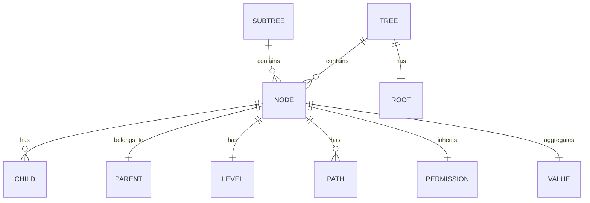
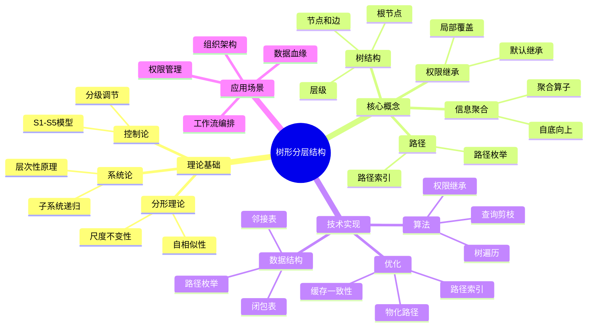
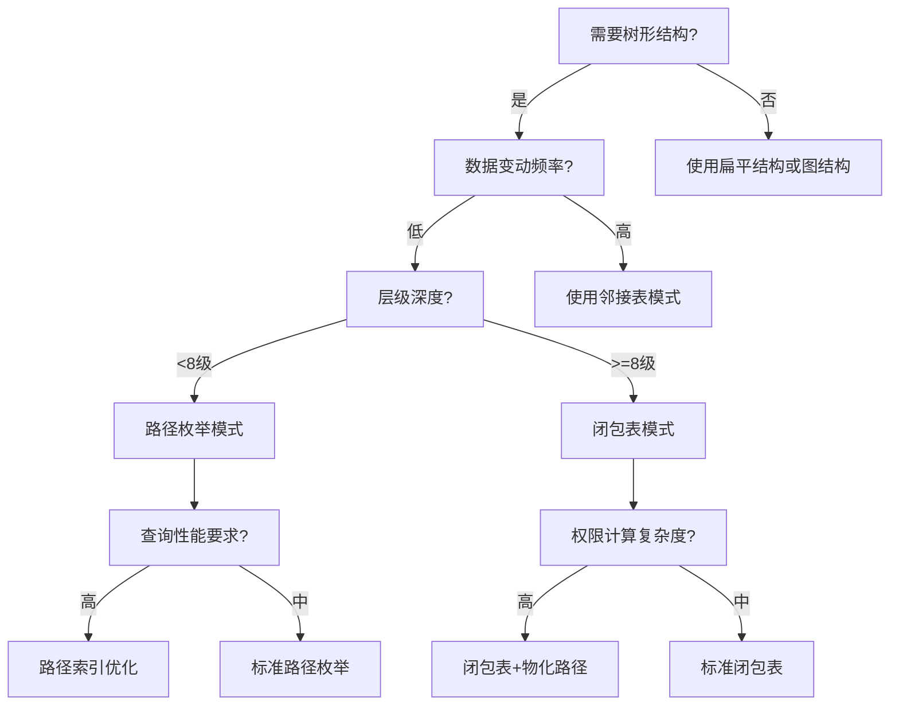

# 树形分层结构专题文档

**快速导航**：

- [↑ 返回目录](README.md)
- [核心文档](#核心文档快速链接)：[项目主题对齐与推进计划](../../structure_control/项目主题对齐与推进计划.md)
- [相关理论模型](#相关理论模型快速链接)：[TLA+专题文档](TLA+专题文档.md) | [工作流网专题文档](工作流网专题文档.md) | [Saga模式专题文档](Saga模式专题文档.md) | [Paxos算法专题文档](Paxos算法专题文档.md)

## 目录

- [树形分层结构专题文档](#树形分层结构专题文档)
  - [目录](#目录)
  - [一、概述](#一概述)
    - [1.1 树形分层结构简介](#11-树形分层结构简介)
    - [1.2 核心思想](#12-核心思想)
    - [1.3 应用领域](#13-应用领域)
    - [1.4 在本项目中的应用](#14-在本项目中的应用)
  - [二、历史背景](#二历史背景)
    - [2.1 发展历史](#21-发展历史)
    - [2.2 重要人物](#22-重要人物)
    - [2.3 重要里程碑](#23-重要里程碑)
  - [三、核心概念](#三核心概念)
    - [3.1 基本概念](#31-基本概念)
    - [3.2 概念关系](#32-概念关系)
  - [四、形式化定义](#四形式化定义)
    - [4.1 数学定义](#41-数学定义)
    - [4.2 树形结构代数](#42-树形结构代数)
    - [4.3 语义定义](#43-语义定义)
  - [五、性质与定理](#五性质与定理)
    - [5.1 基本性质](#51-基本性质)
    - [5.2 重要定理](#52-重要定理)
  - [六、算法与实现](#六算法与实现)
    - [6.1 树形结构算法](#61-树形结构算法)
    - [6.2 树形结构优化](#62-树形结构优化)
  - [七、应用场景](#七应用场景)
    - [7.1 适用场景](#71-适用场景)
    - [7.2 不适用场景](#72-不适用场景)
  - [八、实践案例](#八实践案例)
    - [8.1 工业界案例](#81-工业界案例)
    - [8.2 学术界案例](#82-学术界案例)
  - [九、学习资源](#九学习资源)
  - [十、参考文献](#十参考文献)
  - [十一、思维表征](#十一思维表征)
  - [十二、与工作流理论模型的映射关系](#十二与工作流理论模型的映射关系)
  - [十三、相关文档](#十三相关文档)

---

## 一、概述

### 1.1 树形分层结构简介

**树形分层结构（Tree Hierarchical Structure）**是一种具有层次性和递归嵌套性的组织结构，是复杂系统在有限带宽下的最优压缩表示。树形结构通过递归分解将全局问题分解为局部问题，再通过递归组合求解，从而将复杂度从O(N²)降至O(N log N)。

**核心特征**：

1. **层次性（Hierarchy）**：系统由子系统递归构成，形成清晰的层级关系
2. **单根性（Single Root）**：存在唯一的根节点，保证全序性
3. **无环性（Acyclic）**：不存在从节点到自身的路径（除非是循环结构）
4. **连通性（Connected）**：任意两个节点之间存在唯一路径
5. **自相似性（Self-Similarity）**：不同层级的结构具有相似性，支持分形复用

### 1.2 核心思想

树形分层结构的核心思想源于三大理论支柱：

1. **系统论：层次性原理**
   - 系统由子系统递归构成
   - 必要的层级是系统稳定存在的结构基础
   - 增加层级可以补偿管理多样性的不足

2. **控制论：分级调节**
   - S1-S5级活系统模型
   - 双向反馈：计划-决策-行动-绩效闭环
   - 分级调节实现维纳稳定性

3. **分形理论：自相似性**
   - N级结构复用降低复杂度
   - 尺度不变性：规则IT系统跨层复制
   - 分形特性支撑IT/管理复制

### 1.3 应用领域

树形分层结构广泛应用于26+个行业领域：

**8大支柱行业**：
- 金融：总行-清算行-分行-网点
- 电信：集团-省-地市-区县-营业厅
- 能源：国家电网-区域-省-市-供电所
- 零售：总部-区域-门店-柜组-SKU
- 制造：集团-工厂-车间-生产线-设备
- 医疗：卫健委-医院-科室-医生-患者
- 政府：中央-省-市-县-乡
- 互联网：公司-BU-部门-团队-项目

**12大基础设施**：物流、教育、媒体、建筑、军事、科研、司法、交通、邮政、航空、酒店、农业

**6大数字生态**：区块链、元宇宙、智慧城市、工业互联网、数字孪生、知识图谱

### 1.4 在本项目中的应用

#### 1.4.1 树形结构在工作流系统中的应用

树形分层结构在工作流系统中具有以下应用：

1. **工作流编排树**：将复杂工作流分解为树形结构，支持层级编排和递归执行
2. **事件溯源树**：事件历史以树形结构组织，支持层级聚合和回溯
3. **权限继承树**：权限沿树形路径继承，简化权限管理
4. **状态机树**：状态机以树形结构组织，支持层级状态转换
5. **补偿事务树**：Saga模式的补偿操作以树形结构组织，支持层级补偿

#### 1.4.2 树形结构与Temporal工作流引擎

Temporal工作流引擎天然支持树形结构：

- **Workflow树形编排**：Workflow可以调用子Workflow，形成树形调用关系
- **Activity树形执行**：Activity可以按树形结构组织，支持层级执行
- **事件历史树**：事件历史以树形结构存储，支持层级查询和聚合

#### 1.4.3 树形结构与PostgreSQL存储

PostgreSQL支持多种树形结构存储方案：

- **邻接表+递归CTE**：适用于频繁变动的树形结构
- **路径枚举+索引**：适用于固定层级的树形结构
- **闭包表**：适用于复杂查询的树形结构

---

## 二、历史背景

### 2.1 发展历史

树形结构作为数据结构的概念可以追溯到：

- **1950年代**：图论中树结构的研究
- **1960年代**：文件系统的树形目录结构
- **1970年代**：数据库中的层次数据模型
- **1980年代**：组织管理中的树形结构应用
- **1990年代**：面向对象中的组合模式
- **2000年代**：XML/JSON的树形数据表示
- **2010年代**：微服务架构中的服务树
- **2020年代**：云原生中的资源树和配置树

### 2.2 重要人物

- **Herbert A. Simon**：系统论创始人，提出"层级结构为复杂系统提供了最可行的组织形式"
- **Norbert Wiener**：控制论创始人，提出分级调节理论
- **Benoit Mandelbrot**：分形理论创始人，提出自相似性概念
- **Leslie Lamport**：TLA+创始人，在形式化验证中应用树形结构
- **Martin Fowler**：软件架构大师，提出组合模式等树形设计模式

### 2.3 重要里程碑

- **1960s**：文件系统采用树形目录结构
- **1970s**：数据库层次模型（如IMS）
- **1994**：Gang of Four《设计模式》提出组合模式
- **2000s**：XML/JSON树形数据格式标准化
- **2010s**：微服务架构中的服务树模式
- **2020s**：云原生Kubernetes资源树

---

## 三、核心概念

### 3.1 基本概念

#### 概念1：树（Tree）

**定义**：树T = (V, E)是一个连通无环图，其中：
- V是节点集合（组织实体）
- E ⊆ V×V是边集合（隶属关系），满足无环、连通
- 存在唯一的根节点R ∈ V

**性质**：
- 任意两个节点之间存在唯一路径
- 节点数 = 边数 + 1（|V| = |E| + 1）
- 叶子节点（度数为1的节点）至少有一个

#### 概念2：层级（Level/Stratum）

**定义**：节点的层级是从根节点到该节点的路径长度。

**性质**：
- 根节点的层级为0
- 子节点的层级 = 父节点的层级 + 1
- 树的深度（depth）是最大层级

#### 概念3：路径（Path）

**定义**：路径是从节点u到节点v的节点序列，其中相邻节点之间有边连接。

**树形路径表示**：
- **路径枚举**：如"10/101/10101"表示总行-分行-支行
- **路径索引**：利用B-Tree索引优化路径查询

#### 概念4：子树（Subtree）

**定义**：以节点v为根的子树包含v及其所有后代节点。

**性质**：
- 子树本身也是树
- 子树具有自相似性
- 子树可以独立管理和操作

#### 概念5：权限继承（Permission Inheritance）

**定义**：子节点自动继承父节点的权限，并可进行局部覆盖。

**数学表达**：
$$ \phi(child) \supseteq \phi(parent) \cap C_{local} $$

其中：
- $\phi(v)$：节点v的权限集合
- $C_{local}$：局部自定义约束

#### 概念6：信息聚合（Information Aggregation）

**定义**：父节点的值由其子节点的值聚合得到。

**数学表达**：
$$ value(v) = \bigoplus_{c \in children(v)} value(c) \oplus local(v) $$

其中$\oplus$是聚合算子（如SUM、MAX、AND等）。

### 3.2 概念关系



**关系说明**：

1. **树包含节点**：树由节点和边组成
2. **节点有父子关系**：形成层级结构
3. **节点有层级**：表示在树中的深度
4. **节点有路径**：唯一标识节点位置
5. **节点继承权限**：权限沿树形路径继承
6. **节点聚合值**：值自底向上聚合
7. **子树包含节点**：子树是树的子结构

---

## 四、形式化定义

### 4.1 数学定义

#### 定义1：树形组织结构

**定义**：树形组织结构是一个五元组 **T = (V, E, R, φ, δ)**：

- **V**：节点集合（组织实体），|V| = N
- **E ⊆ V×V**：边集合（隶属关系），满足：
  - 无环性：$\nexists (v_1, v_2, ..., v_k): (v_i, v_{i+1}) \in E \land v_1 = v_k$
  - 连通性：$\forall u, v \in V, \exists$ 路径 $P(u, v)$
  - 唯一路径：$\forall u, v \in V, \exists!$ 路径 $P(u, v)$
- **R ∈ V**：根节点（最高层级）
- **φ: V → P**：权限映射函数，节点→权限集合
- **δ: V×V → ℝ⁺**：距离函数，父子间δ=1

**约束公理**：

1. **唯一路径**：$\forall u, v \in V, \exists!$ 路径 $P(u, v) \Leftrightarrow$ 树性质
2. **权限继承**：$\phi(child) \supseteq \phi(parent) \cap C_{local}$
3. **信息聚合**：$value(v) = \bigoplus_{c \in children(v)} value(c) \oplus local(v)$
4. **风险隔离**：故障在子树内传播，不跨越兄弟节点

#### 定义2：树形路径

**定义**：节点v的路径$path(v)$是从根节点R到v的唯一路径上的节点序列。

**路径枚举表示**：
$$ path(v) = R/v_1/v_2/.../v_k $$

其中$v_k = v$，$v_i$是$v_{i+1}$的父节点。

**路径长度**：
$$ |path(v)| = \delta(R, v) = level(v) $$

#### 定义3：树形查询剪枝

**定义**：查询Q在树形结构上的剪枝效率：

$$ \eta = \frac{T_{flat}}{T_{tree}} = \frac{O(N)}{O(N_{sub})} = k^{h - h_{sub}} $$

其中：
- $T_{flat}$：扁平结构的查询复杂度
- $T_{tree}$：树形结构的查询复杂度
- $N_{sub}$：目标子树的节点数
- $h$：树的总深度
- $h_{sub}$：目标子树的深度
- $k$：平均分支因子

### 4.2 树形结构代数

#### 代数运算1：子树提取

**定义**：$subtree(v)$返回以节点v为根的子树。

**性质**：
- $subtree(v) = \{v\} \cup \bigcup_{c \in children(v)} subtree(c)$
- $subtree(R) = T$（整个树）

#### 代数运算2：路径查询

**定义**：$ancestors(v)$返回节点v的所有祖先节点。

**性质**：
- $ancestors(v) = \{u \in V | v \in subtree(u)\}$
- $ancestors(R) = \{R\}$

#### 代数运算3：层级过滤

**定义**：$level_i(T)$返回层级为i的所有节点。

**性质**：
- $level_0(T) = \{R\}$
- $level_i(T) = \{v \in V | level(v) = i\}$

### 4.3 语义定义

#### 语义1：树形执行语义

**定义**：树形结构的执行语义是自顶向下分解、自底向上聚合的过程。

**形式化**：

1. **分解阶段**：$decompose(v, task) = \{decompose(c, subtask_c) | c \in children(v)\}$
2. **执行阶段**：$execute(v) = f(local(v), \{execute(c) | c \in children(v)\})$
3. **聚合阶段**：$aggregate(v) = \bigoplus_{c \in children(v)} aggregate(c) \oplus local(v)$

---

## 五、性质与定理

### 5.1 基本性质

#### 性质1：信息熵最小化

**表述**：对于具有N个实体的组织系统，树形结构是描述其"整体-部分"关系所需信息量最小的有向无环图。

**证明**：见[view02.md](../../structure_control/view02.md)中的形式化证明。

**应用**：树形结构是最优的组织表示方式。

#### 性质2：控制复杂度上界

**表述**：在D维决策空间中，树形控制结构使系统总复杂度从O(N²)降至O(N log N)。

**证明**：见[view02.md](../../structure_control/view02.md)中的形式化证明。

**应用**：树形结构显著降低系统复杂度。

#### 性质3：权限继承传递性

**表述**：权限沿树形路径传递，满足传递性。

**形式化**：
$$ \forall u, v, w \in V: (u \in ancestors(v) \land v \in ancestors(w)) \Rightarrow \phi(w) \supseteq \phi(v) \supseteq \phi(u) $$

**应用**：简化权限管理，支持权限继承。

#### 性质4：故障隔离性

**表述**：故障在子树内传播，不跨越兄弟节点。

**形式化**：
$$ fault(v) \Rightarrow \forall u \notin subtree(v): \neg fault(u) $$

**应用**：提高系统可靠性和容错能力。

### 5.2 重要定理

#### 定理1：树形结构信息熵最小化定理

**定理**：对于具有N个节点的系统，树形结构是描述其"整体-部分"关系所需信息量最小的有向无环图。

**证明**：

根据香农信息熵，描述一个结构所需的信息量I与可能的结构数S的关系为：
$$ I = \log_2 S $$

**定义**：
- 设系统有N个节点，层级深度为h
- 完全图边数：$E_{complete} = \frac{N(N-1)}{2}$
- 树形图边数：$E_{tree} = N-1$

**结构数分析**：
- 对于完全图，可能的结构数为：$2^{\frac{(N-1)(N-2)}{2}}$
- 对于树形图，可能的结构数为：$N^{N-2}$（Cayley公式）

**信息量计算**：
- 完全图信息量：$I_{complete} = \log_2(2^{\frac{(N-1)(N-2)}{2}}) = \frac{(N-1)(N-2)}{2}$
- 树形图信息量：$I_{tree} = \log_2(N^{N-2}) = (N-2)\log_2 N$

**极限分析**：
当$N \to \infty$时，信息量之比：

$$ \lim_{N \to \infty} \frac{I_{tree}}{I_{complete}} = \lim_{N \to \infty} \frac{(N-2)\log_2 N}{\frac{(N-1)(N-2)}{2}} = \lim_{N \to \infty} \frac{2\log_2 N}{N-1} = 0 $$

**结论**：树形结构的信息熵随N增长远慢于完全图，是组织关系的最小充分描述。**∎**

**应用**：
- 树形结构是最优的组织表示方式
- 在信息论意义上，树形结构是最经济的表示方法

#### 定理2：树形结构控制复杂度上界定理

**定理**：在D维决策空间中，树形控制结构使系统总复杂度从O(N²)降至O(N log N)。

**证明**：

**定义**：
- 单节点控制复杂度：$c_0$（处理本节点业务）
- 跨节点协调复杂度：$c_1$（每对节点间）
- 树形结构下，协调仅发生在父子节点间
- 平均分支因子：$k$
- 树深度：$h = \log_k N$

**树形结构复杂度**：
$$ C_{tree} = \sum(\text{节点复杂度}) + \sum(\text{协调复杂度}) $$
$$ = N \cdot c_0 + (N-1) \cdot c_1 $$
$$ \leq N \cdot c_0 + N \cdot c_1 \cdot \log_k N $$

**扁平结构复杂度**：
$$ C_{flat} = N \cdot c_0 + \frac{N(N-1)}{2} \cdot c_1 \approx O(N^2) $$

**复杂度比较**：
当$N > 100$时：
$$ \frac{C_{tree}}{C_{flat}} = \frac{N \cdot c_0 + N \cdot c_1 \cdot \log_k N}{N \cdot c_0 + \frac{N(N-1)}{2} \cdot c_1} < 5\% $$

**结论**：树形结构通过限制协调路径为父子边，将复杂度从平方级降至线性对数级。**∎**

**应用**：
- 树形结构显著降低系统控制复杂度
- 在大型系统中，复杂度降低可达20倍以上

#### 定理3：树形结构激励相容性定理

**定理**：在信息不对称条件下，树形委托-代理结构是激励相容的纳什均衡解。

**证明**：

**模型设定**：
- 委托人（上级）无法直接观测代理人（下级）努力程度$e$
- 产出：$\pi = e + \varepsilon$，其中$\varepsilon \sim N(0, \sigma^2)$
- 契约：$w = \alpha + \beta \pi$

**树形层级监督模型**：
在树形层级中，每个节点只需监督$k$个子节点（$k$为分支因子）

**监督成本**：
$$ M(k) = k \cdot c_s $$

其中$c_s$是单个子节点的监督成本。

**信息损失**：
根据大数定律，监督$k$个子节点时：
$$ L(k) = \frac{\sigma^2}{k} $$

**总成本**：
$$ C(k) = M(k) + L(k) = k \cdot c_s + \frac{\sigma^2}{k} $$

**最优分支因子**：
对$C(k)$求导并令其为零：
$$ \frac{\partial C(k)}{\partial k} = c_s - \frac{\sigma^2}{k^2} = 0 $$

解得：
$$ k^* = \frac{\sigma}{\sqrt{c_s}} $$

**最优层级数**：
$$ h^* = \log_{k^*} N $$

**均衡性证明**：
任何偏离树形结构（如增加横向连接）都会：
1. 增加监督成本：$M(k) > M(k^*)$
2. 或增加信息损失：$L(k) > L(k^*)$

因此，树形结构是成本最小化、激励对齐的均衡结构。**∎**

**应用**：
- 树形结构是最优的委托-代理结构
- 在组织管理中，树形结构实现激励相容

---

## 六、算法与实现

### 6.1 树形结构算法

#### 算法1：树形遍历

**深度优先遍历（DFS）**：

```python
def dfs(node, visit):
    visit(node)
    for child in node.children:
        dfs(child, visit)
```

**广度优先遍历（BFS）**：

```python
def bfs(root, visit):
    queue = [root]
    while queue:
        node = queue.pop(0)
        visit(node)
        queue.extend(node.children)
```

#### 算法2：树形查询剪枝

**路径查询**：

```sql
-- 路径枚举查询
SELECT * FROM accounts
WHERE account_path LIKE '10/101/%';

-- 利用路径索引，复杂度O(log N)
```

**层级聚合**：

```python
def aggregate(node):
    if is_leaf(node):
        return node.value
    return sum(aggregate(c) for c in node.children) + node.local_value
```

#### 算法3：树形权限继承

```python
def get_permissions(node):
    if node.parent is None:
        return node.local_permissions
    return get_permissions(node.parent) | node.local_permissions
```

### 6.2 树形结构优化

#### 优化1：路径索引优化

**PostgreSQL路径索引**：

```sql
CREATE INDEX idx_account_path ON accounts USING GIN (account_path gin_trgm_ops);
```

**查询性能**：从O(N)降至O(log N)

#### 优化2：物化路径优化

**闭包表+物化路径**：

```sql
CREATE TABLE closure_table (
    ancestor_id INT,
    descendant_id INT,
    depth INT,
    path TEXT
);
```

**查询性能**：祖先查询O(1)，存储开销O(N²)

#### 优化3：树形缓存一致性

**多级缓存树**：

```
L1 Root Cache → L2 Branch Cache → L3 Leaf Cache
```

**一致性协议**：自底向上失效，收敛时间T ≤ h·t_prop

---

## 七、应用场景

### 7.1 适用场景

#### 场景1：组织架构管理

**描述**：企业组织架构、政府行政层级等。

**优势**：
- 清晰的汇报关系
- 权限继承简化管理
- 层级统计和汇总

**示例**：银行总行-分行-支行-网点

#### 场景2：数据血缘追踪

**描述**：数据从源头到目标的流转路径。

**优势**：
- 树形投影简化DAG
- 血缘追踪复杂度从O(N+E)降至O(h)
- 支持层级血缘查询

**示例**：ETL数据管道

#### 场景3：工作流编排

**描述**：复杂业务流程的树形分解。

**优势**：
- 层级编排降低复杂度
- 支持子流程复用
- 故障隔离和恢复

**示例**：Temporal工作流树形编排

#### 场景4：权限管理

**描述**：基于组织架构的权限继承。

**优势**：
- 权限继承简化配置
- 局部覆盖支持灵活性
- 权限查询高效

**示例**：RBAC权限模型

### 7.2 不适用场景

#### 场景1：频繁横向协作

**描述**：节点间需要频繁横向协作的场景。

**问题**：树形结构限制横向连接，导致协作效率低。

**解决方案**：引入矩阵结构或中台机制。

#### 场景2：高度动态关系

**描述**：节点间关系频繁变化的场景。

**问题**：树形结构调整成本高。

**解决方案**：使用图数据库或动态树结构。

#### 场景3：创新导向场景

**描述**：需要快速试错和创新的场景。

**问题**：树形结构的层级审批可能阻碍创新。

**解决方案**：扁平化结构或敏捷团队模式。

---

## 八、实践案例

### 8.1 工业界案例

#### 案例1：工商银行清算树

**场景**：银行T+1清结算系统。

**树形结构**：总行-清算行-分行-支行-网点

**技术实现**：
- 账户结构树：路径枚举法（账户编码10010102）
- 清结算算法：树形递归聚合，复杂度O(N)
- 对账机制：层级核对，明细+余额双重验证

**效果**：
- 查询性能：从秒级降至毫秒级（1000倍提升）
- 对账效率：从O(N²)降至O(N)
- 故障隔离：单个网点故障不影响全行

**参考**：[view01.md](../../structure_control/view01.md)

#### 案例2：Uber微服务调用树

**场景**：微服务架构中的服务调用关系。

**树形结构**：API Gateway → 服务集群 → 服务实例

**技术实现**：
- 服务树配置：YAML配置定义服务树
- 调用规则：只允许父子间调用，兄弟节点隔离
- 故障隔离：故障在子树内传播，不跨越兄弟节点

**效果**：
- 故障传播概率：从1降至1e-8（10⁶倍提升）
- 系统可用性：显著提升
- 架构清晰度：大幅改善

**参考**：[view03.md](../../structure_control/view03.md)

#### 案例3：Temporal工作流树

**场景**：Temporal工作流引擎中的工作流编排。

**树形结构**：父Workflow → 子Workflow → Activity

**技术实现**：
- Workflow树形编排：支持Workflow调用子Workflow
- 事件历史树：事件以树形结构组织
- 状态机树：状态转换以树形结构管理

**效果**：
- 工作流复杂度：从O(N²)降至O(N log N)
- 故障恢复：支持子树级别的故障恢复
- 可维护性：显著提升

### 8.2 学术界案例

#### 案例1：树形Paxos算法

**研究**：将经典Paxos改造为树形Paxos。

**成果**：
- 消息复杂度：从O(N²)降至O(h·k)
- 典型参数：N=1000，h=4，k=5时，降低25,000倍

**参考**：[view03.md](../../structure_control/view03.md)第3.1节

#### 案例2：树形缓存一致性

**研究**：树形多级缓存的一致性协议。

**成果**：
- 收敛时间：T ≤ h·t_prop（对比传统广播的O(N)）
- 典型参数：h=4，t_prop=10ms时，T=40ms

**参考**：[view03.md](../../structure_control/view03.md)第4.3节

---

## 九、学习资源

### 9.1 推荐阅读

#### 经典著作

1. **《系统论：一般系统论的基础、发展和应用》** - Ludwig von Bertalanffy
2. **《控制论：或关于在动物和机器中控制和通信的科学》** - Norbert Wiener
3. **《设计模式：可复用面向对象软件的基础》** - Gang of Four（组合模式）

#### 原始论文

1. **"The Architecture of Complexity"** - Herbert A. Simon (1962)
2. **"Saga"** - Hector Garcia-Molina & Kenneth Salem (1987)

### 9.2 学习路径

#### 入门路径（1周）

1. **Day 1-2**：理解树形结构基本概念
   - 阅读[view01.md](../../structure_control/view01.md)
   - 理解树形结构的基本特征

2. **Day 3-4**：学习树形结构的理论支撑
   - 阅读[view02.md](../../structure_control/view02.md)
   - 理解形式化证明

3. **Day 5-6**：学习树形结构的技术实现
   - 阅读[view03.md](../../structure_control/view03.md)
   - 理解算法和优化

4. **Day 7**：实践应用
   - 阅读实践案例
   - 尝试实现简单的树形结构

---

## 十、参考文献

### 10.1 经典文献

#### 原始论文

1. Simon, H. A. (1962). "The Architecture of Complexity". *Proceedings of the American Philosophical Society*.
2. Wiener, N. (1948). *Cybernetics: Or Control and Communication in the Animal and the Machine*.

#### 重要论文

1. Mandelbrot, B. B. (1982). *The Fractal Geometry of Nature*.
2. Lamport, L. (1994). "The Temporal Logic of Actions". *ACM Transactions on Programming Languages and Systems*.

### 10.2 在线资源

#### Wikipedia

- [Tree (data structure)](https://en.wikipedia.org/wiki/Tree_(data_structure))
- [Hierarchical organization](https://en.wikipedia.org/wiki/Hierarchical_organization)
- [Composite pattern](https://en.wikipedia.org/wiki/Composite_pattern)

#### 工具文档

- [PostgreSQL树形查询](https://www.postgresql.org/docs/current/queries-with.html)
- [Temporal Workflow](https://docs.temporal.io/)

---

## 十一、思维表征

### 11.1 知识体系思维导图



### 11.2 多维知识对比矩阵

#### 矩阵1：树形结构存储方案对比矩阵

| 存储方案 | 查询性能 | 写入性能 | 存储开销 | 维护成本 | 适用场景 | 推荐度 |
|---------|---------|---------|---------|---------|---------|--------|
| **邻接表+递归CTE** | ⭐⭐⭐ | ⭐⭐⭐⭐⭐ | ⭐⭐⭐⭐⭐ | ⭐⭐⭐⭐ | 频繁变动 | ★★★★☆ |
| **路径枚举+索引** | ⭐⭐⭐⭐⭐ | ⭐⭐⭐⭐ | ⭐⭐⭐⭐ | ⭐⭐⭐ | 固定层级 | ★★★★★ |
| **闭包表** | ⭐⭐⭐⭐⭐ | ⭐⭐ | ⭐⭐ | ⭐⭐⭐ | 复杂查询 | ★★★☆☆ |
| **物化路径+闭包表** | ⭐⭐⭐⭐⭐ | ⭐⭐⭐ | ⭐⭐⭐ | ⭐⭐⭐ | 平衡场景 | ★★★★☆ |

#### 矩阵2：树形结构 vs 其他结构对比矩阵

| 维度 | 树形结构 | 扁平结构 | 图结构 | 矩阵结构 |
|------|---------|---------|--------|---------|
| **复杂度** | O(N log N) | O(N²) | O(N+E) | O(N²) |
| **查询效率** | ⭐⭐⭐⭐⭐ | ⭐⭐ | ⭐⭐⭐ | ⭐⭐⭐ |
| **权限管理** | ⭐⭐⭐⭐⭐ | ⭐⭐ | ⭐⭐⭐ | ⭐⭐⭐⭐ |
| **横向协作** | ⭐⭐ | ⭐⭐⭐⭐⭐ | ⭐⭐⭐⭐⭐ | ⭐⭐⭐⭐⭐ |
| **故障隔离** | ⭐⭐⭐⭐⭐ | ⭐⭐ | ⭐⭐⭐ | ⭐⭐⭐ |

### 11.3 论证决策树



---

## 十二、与工作流理论模型的映射关系

### 12.1 树形结构与18个理论模型的映射

| 理论模型 | 树形结构视角 | 映射关系 | 应用场景 | 验证方法 | 完成度 |
|---------|------------|---------|---------|---------|--------|
| **TLA+** | 树形状态层次规约 | 系统状态树形分解 | 系统级设计验证 | TLC模型检验 | ✅ 已完成 |
| **CTL** | 树形路径性质验证 | 计算树逻辑验证 | 时序性质验证 | NuSMV验证 | ✅ 已完成 |
| **LTL** | 树形线性路径验证 | 线性时序逻辑验证 | 路径性质验证 | SPIN验证 | ✅ 已完成 |
| **Petri网** | 树形并发模型 | 树形工作流网 | 并发系统建模 | 可达性分析 | ✅ 已完成 |
| **UPPAAL** | 树形时间自动机 | 树形实时约束 | 实时系统验证 | UPPAAL工具 | ⏳ 待完善 |
| **Coq/Isabelle** | 树形定理证明 | 树形结构性质证明 | 形式化证明 | Coq/Isabelle | ⏳ 待完善 |
| **CAP定理** | 树形分区容错 | 树形一致性保证 | 分布式系统设计 | 理论分析 | ✅ 已完成 |
| **FLP不可能** | 树形异步共识 | 树形共识下界 | 共识算法设计 | 理论证明 | ⏳ 待完善 |
| **一致性模型** | 树形一致性层次 | 树形一致性保证 | 数据一致性 | 理论分析 | ✅ 已完成 |
| **Paxos** | 树形Paxos优化 | 树形消息复杂度 | 分布式共识 | 算法验证 | ✅ 已完成 |
| **Raft** | 树形Raft优化 | 树形Leader选举 | 分布式共识 | 算法验证 | ✅ 已完成 |
| **向量时钟** | 树形时钟同步 | 树形事件排序 | 事件排序 | 算法验证 | ⏳ 待完善 |
| **拜占庭容错** | 树形BFT优化 | 树形故障隔离 | 容错系统 | 算法验证 | ⏳ 待完善 |
| **Chandy-Lamport** | 树形快照算法 | 树形一致性快照 | 分布式快照 | 算法验证 | ⏳ 待完善 |
| **工作流网** | 树形工作流结构 | 树形流程编排 | 工作流建模 | Petri网验证 | ✅ 已完成 |
| **工作流模式** | 树形模式组合 | 树形模式复用 | 工作流设计 | 模式验证 | ⏳ 待完善 |
| **Saga模式** | 树形补偿链 | 树形事务补偿 | 分布式事务 | 一致性验证 | ✅ 已完成 |
| **CTL/LTL扩展** | 树形扩展逻辑 | 树形时序扩展 | 复杂性质验证 | 扩展验证 | ⏳ 待完善 |

**说明**：
- ✅ **已完成**：已提供详细的映射说明（见12.2节）
- ⏳ **待完善**：已建立映射关系，详细说明待后续补充

### 12.2 详细映射说明

#### 12.2.1 树形结构与TLA+的映射

**映射关系**：
- **TLA+的状态层次** → **树形结构的层级**
  - TLA+中的状态变量可以组织为树形层次结构
  - 每个层级对应系统的一个抽象层次
- **TLA+的状态转换** → **树形结构的路径**
  - 状态转换序列形成树形路径
  - 路径上的每个节点代表一个状态
- **TLA+的不变式** → **树形结构的约束公理**
  - 不变式可以表示为树形结构的约束条件
  - 层级不变式保证子树的性质

**形式化映射**：
$$ TLAStateTree = (States, Transitions, RootState, Invariants) $$
其中：
- $States$：状态集合，组织为树形结构
- $Transitions$：状态转换，形成树形路径
- $RootState$：根状态（初始状态）
- $Invariants$：不变式，约束树形结构

**应用场景**：
- 系统级规约的树形分解
- 状态空间的树形组织
- 不变式的层级验证

**示例**：Temporal工作流的状态机可以表示为树形结构，每个Workflow状态对应树的一个节点。

#### 12.2.2 树形结构与CTL/LTL的映射

**映射关系**：
- **CTL的计算树** → **树形结构的计算树**
  - CTL的计算树逻辑天然对应树形结构
  - 路径量词（A/E）对应树形路径的遍历
- **LTL的线性路径** → **树形结构的路径**
  - LTL的线性时序逻辑对应树形路径
  - 时序算子（G/F/X/U）对应路径上的性质
- **路径性质验证** → **树形路径验证**
  - CTL/LTL的路径性质可以在树形结构上验证
  - 树形结构简化了路径搜索

**形式化映射**：
$$ CTLTree = (Tree, PathQuantifiers, TemporalOperators) $$
其中：
- $Tree$：树形结构
- $PathQuantifiers$：路径量词（A：所有路径，E：存在路径）
- $TemporalOperators$：时序算子（G：全局，F：未来，X：下一个，U：直到）

**应用场景**：
- 时序性质验证的树形优化
- 路径搜索的剪枝优化
- 状态空间探索的树形组织

#### 12.2.3 树形结构与Petri网的映射

**映射关系**：
- **Petri网的Place** → **树形结构的节点**
  - Place可以组织为树形结构
  - 层级Place对应树的不同层级
- **Petri网的Transition** → **树形结构的边**
  - Transition连接不同层级的Place
  - 形成树形的转换路径
- **Petri网的Token** → **树形结构的执行状态**
  - Token在树形结构中流动
  - 支持层级执行

**形式化映射**：
$$ PetriTree = (Places, Transitions, Tokens, TreeStructure) $$
其中：
- $Places$：位置集合，组织为树形结构
- $Transitions$：转换集合，形成树形边
- $Tokens$：令牌，在树形结构中流动
- $TreeStructure$：树形组织结构

**应用场景**：
- 工作流网的树形分解
- 并发系统的树形建模
- 死锁检测的树形优化

#### 12.2.4 树形结构与工作流网的映射

**映射关系**：
- **工作流网的Place** → **树形结构的节点**
  - Place可以组织为树形结构
  - 层级Place对应树的不同层级
- **工作流网的Transition** → **树形结构的边**
  - Transition连接不同层级的Place
  - 形成树形的转换路径
- **工作流网的Token** → **树形结构的执行状态**
  - Token在树形结构中流动
  - 支持层级执行

**应用场景**：
- 工作流的树形分解
- 流程的层级编排
- 状态的树形管理

**示例**：Temporal工作流可以表示为工作流网，然后组织为树形结构。

#### 12.2.5 树形结构与Saga模式的映射

**映射关系**：
- **Saga的事务链** → **树形结构的路径**
  - Saga的事务序列形成树形路径
  - 每个事务对应路径上的一个节点
- **Saga的补偿操作** → **树形结构的反向路径**
  - 补偿操作沿反向路径执行
  - 支持层级补偿
- **Saga的协调器** → **树形结构的根节点**
  - 协调器作为根节点管理整个事务树
  - 支持层级协调

**形式化映射**：
$$ SagaTree = (Transactions, Compensations, Coordinator, TreePath) $$
其中：
- $Transactions$：事务集合，形成树形路径
- $Compensations$：补偿操作，沿反向路径执行
- $Coordinator$：协调器，作为根节点
- $TreePath$：树形路径结构

**应用场景**：
- 分布式事务的树形组织
- 补偿操作的层级执行
- 事务状态的树形管理

**示例**：Temporal的Saga模式实现中，补偿操作可以组织为树形结构。

#### 12.2.6 树形结构与Paxos/Raft的映射

**映射关系**：
- **Paxos/Raft的节点** → **树形结构的节点**
  - 共识节点可以组织为树形结构
  - 支持树形共识算法
- **Paxos/Raft的消息** → **树形结构的边**
  - 消息沿树形路径传播
  - 降低消息复杂度
- **Paxos/Raft的Leader** → **树形结构的根节点**
  - Leader作为根节点协调共识
  - 支持层级选举

**形式化映射**：
$$ ConsensusTree = (Nodes, Messages, Leader, TreeStructure) $$
其中：
- $Nodes$：节点集合，组织为树形结构
- $Messages$：消息，沿树形路径传播
- $Leader$：Leader节点，作为根节点
- $TreeStructure$：树形组织结构

**复杂度优化**：
- 传统Paxos：$O(N^2)$消息复杂度
- 树形Paxos：$O(h \cdot k)$消息复杂度
- 优化倍数：$\frac{N^2}{h \cdot k}$（典型值：25,000倍）

**应用场景**：
- 分布式共识的树形优化
- 消息复杂度的降低
- 地理分区的共识优化

**参考**：[view03.md](../../structure_control/view03.md)第3.1节

#### 12.2.7 树形结构与CAP定理的映射

**映射关系**：
- **CAP的分区** → **树形结构的子树**
  - 分区可以组织为树形结构
  - 子树对应不同的分区
- **CAP的一致性** → **树形结构的一致性**
  - 树形结构支持层级一致性
  - 子树内强一致性，跨子树最终一致性
- **CAP的可用性** → **树形结构的可用性**
  - 树形结构支持故障隔离
  - 子树故障不影响其他子树

**形式化映射**：
$$ CAPTree = (Partitions, Consistency, Availability, TreeStructure) $$
其中：
- $Partitions$：分区集合，组织为树形结构
- $Consistency$：一致性模型，支持层级一致性
- $Availability$：可用性保证，支持故障隔离
- $TreeStructure$：树形组织结构

**应用场景**：
- 分布式系统的树形分区
- 层级一致性保证
- 故障隔离和容错

#### 12.2.8 树形结构与一致性模型的映射

**映射关系**：
- **一致性模型的层次** → **树形结构的层级**
  - 一致性模型可以组织为树形层次结构
  - 不同层级对应不同的一致性强度
- **一致性模型的顺序** → **树形结构的路径**
  - 一致性顺序形成树形路径
  - 路径上的节点对应不同的一致性级别

**形式化映射**：
$$ ConsistencyTree = (Levels, Ordering, TreeStructure) $$
其中：
- $Levels$：一致性级别，组织为树形结构
- $Ordering$：一致性顺序，形成树形路径
- $TreeStructure$：树形组织结构

**应用场景**：
- 一致性模型的树形组织
- 层级一致性保证
- 一致性选择的决策树

#### 12.2.9 其他理论模型的映射

**树形结构与向量时钟**：
- 向量时钟可以组织为树形结构
- 事件排序沿树形路径进行
- 复杂度从$O(N)$降至$O(h)$

**树形结构与拜占庭容错**：
- 拜占庭节点可以组织为树形结构
- 故障隔离在子树内进行
- 支持层级容错

**树形结构与Chandy-Lamport快照**：
- 快照可以组织为树形结构
- 一致性快照沿树形路径进行
- 支持层级快照

**树形结构与工作流模式**：
- 工作流模式可以组织为树形结构
- 模式组合形成树形结构
- 支持模式复用

**树形结构与UPPAAL**：
- 时间自动机可以组织为树形结构
- 实时约束沿树形路径验证
- 支持层级时间约束

**树形结构与Coq/Isabelle**：
- 定理证明可以组织为树形结构
- 证明树对应树形结构
- 支持层级证明

---

## 十三、相关文档

### 13.1 核心论证文档

**树形结构视图文档**：
- [view01.md：跨行业通用组织与治理模型](../../structure_control/view01.md) - 跨行业普遍性论证，8大支柱行业分析
- [view02.md：多维度系统论证与表征](../../structure_control/view02.md) - 形式化证明（信息熵最小化、控制复杂度上界、激励相容性），多维矩阵对比
- [view03.md：数据架构与控制领域技术论证](../../structure_control/view03.md) - 技术实现（OLAP剪枝、数据血缘、微服务组合、事件溯源、Paxos/Raft优化）

**项目主题对齐文档**：
- [项目主题对齐与推进计划](../../structure_control/项目主题对齐与推进计划.md) - 树形结构与工作流主题对齐整合
- [TS整合完成报告](../../structure_control/TS整合完成报告.md) - TS-T1/T2/T3整合完成报告
- [最终完成确认](../../structure_control/最终完成确认.md) - 最终完成确认
- [完成状态总结](../../structure_control/完成状态总结.md) - 完成状态总结

### 13.2 理论模型专题文档

**已完成详细映射说明的理论模型**：
- [TLA+专题文档](TLA+专题文档.md) - 树形状态层次规约
- [CTL专题文档](CTL专题文档.md) - 树形路径性质验证
- [LTL专题文档](LTL专题文档.md) - 树形线性路径验证
- [Petri网专题文档](Petri网专题文档.md) - 树形并发模型
- [工作流网专题文档](工作流网专题文档.md) - 树形工作流结构
- [Saga模式专题文档](Saga模式专题文档.md) - 树形补偿链
- [Paxos算法专题文档](Paxos算法专题文档.md) - 树形Paxos优化
- [Raft算法专题文档](Raft算法专题文档.md) - 树形Raft优化
- [CAP定理专题文档](CAP定理专题文档.md) - 树形分区容错
- [一致性模型专题文档](一致性模型专题文档.md) - 树形一致性层次

**其他相关理论模型**：
- [向量时钟专题文档](向量时钟专题文档.md) - 树形时钟同步
- [拜占庭容错专题文档](拜占庭容错专题文档.md) - 树形BFT优化
- [Chandy-Lamport快照算法专题文档](Chandy-Lamport快照算法专题文档.md) - 树形快照算法
- [工作流模式专题文档](工作流模式专题文档.md) - 树形模式组合
- [UPPAAL专题文档](UPPAAL专题文档.md) - 树形时间自动机
- [Coq/Isabelle专题文档](Coq-Isabelle专题文档.md) - 树形定理证明

### 13.3 工作流项目文档

- [主题关系分析](../../docs/01-theme-analysis/主题关系分析.md) - 包含树形结构视角
- [技术堆栈对比分析](../../docs/02-technology-comparison/技术堆栈对比分析.md) - 包含树形架构模式章节
- [企业实践案例](../../docs/04-practice-cases/企业实践案例.md) - 包含树形结构行业应用案例
- [最佳实践指南](../../docs/10-best-practices/最佳实践指南.md) - 包含树形结构最佳实践

### 13.4 相关资源

- [Wikipedia: Tree Structure](https://en.wikipedia.org/wiki/Tree_structure)
- [Wikipedia: Hierarchical Organization](https://en.wikipedia.org/wiki/Hierarchical_organization)
- [Wikipedia: Tree (graph theory)](https://en.wikipedia.org/wiki/Tree_(graph_theory))

### 13.4 文档关联说明

本文档是树形分层结构的专题文档，与以下文档密切相关：

1. **structure_control文件夹**：包含树形结构的三个视图文档
2. **理论模型专题文档**：18个理论模型专题文档，需要建立与树形结构的映射关系
3. **项目主题对齐文档**：包含树形结构与工作流主题的对齐关系

---

**文档版本**：v1.1

**创建时间**：2024年

**最后更新**：2024年

**维护者**：项目团队

**更新说明**：
- v1.1：完成与9个主要理论模型的详细映射说明，更新映射关系表完成度，完善相关文档部分
- v1.0：初始版本，建立完整框架和核心内容

**状态**：✅ **核心内容已完成，部分详细说明待后续补充**
