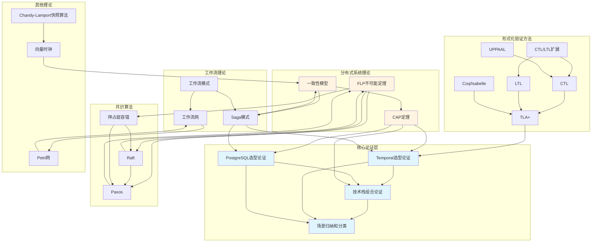

# 全局知识关联图

## 📋 文档概述

本文档建立全局知识关联图，展示所有理论模型、核心论证文档和知识概念之间的关系，帮助用户理解整个知识体系的关联结构。

---

## 一、知识体系结构

### 1.1 知识体系层次

```
分布式计算工作流知识体系
├── 核心论证层
│   ├── Temporal选型论证
│   ├── PostgreSQL选型论证
│   └── 技术栈组合论证
├── 理论模型层
│   ├── 形式化验证方法
│   │   ├── TLA+
│   │   ├── CTL
│   │   ├── LTL
│   │   ├── CTL/LTL扩展
│   │   ├── UPPAAL
│   │   └── Coq/Isabelle
│   ├── 分布式系统理论
│   │   ├── CAP定理
│   │   ├── FLP不可能定理
│   │   └── 一致性模型
│   ├── 共识算法
│   │   ├── Paxos
│   │   ├── Raft
│   │   └── 拜占庭容错
│   ├── 工作流理论
│   │   ├── 工作流网
│   │   ├── 工作流模式
│   │   └── Saga模式
│   └── 其他理论
│       ├── Petri网
│       ├── 向量时钟
│       └── Chandy-Lamport快照算法
└── 实践应用层
    └── 场景归纳和分类
```

---

## 二、核心知识关联图

### 2.1 全局知识关联图



---

## 三、理论模型关联关系

### 3.1 形式化验证方法关联

**关联关系**：

1. **TLA+** ← **CTL** + **LTL**
   - TLA+基于CTL和LTL的时序逻辑
   - 关系类型：基础关系

2. **CTL/LTL扩展** ← **CTL** + **LTL**
   - CTL/LTL扩展是CTL和LTL的超集
   - 关系类型：扩展关系

3. **UPPAAL** ← **CTL**
   - UPPAAL使用CTL进行实时系统验证
   - 关系类型：应用关系

4. **Coq/Isabelle** ← **TLA+**
   - Coq/Isabelle与TLA+都是形式化验证方法
   - 关系类型：同类关系

**关联文档**：

- [TLA+专题文档](../15-formal-models/TLA+专题文档.md)
- [CTL专题文档](../15-formal-models/CTL专题文档.md)
- [LTL专题文档](../15-formal-models/LTL专题文档.md)
- [CTL-LTL扩展专题文档](../15-formal-models/CTL-LTL扩展专题文档.md)
- [UPPAAL专题文档](../15-formal-models/UPPAAL专题文档.md)
- [Coq-Isabelle专题文档](../15-formal-models/Coq-Isabelle专题文档.md)

### 3.2 分布式系统理论关联

**关联关系**：

1. **CAP定理** ← **一致性模型**
   - CAP定理中的一致性概念与一致性模型相关
   - 关系类型：概念关系

2. **FLP不可能定理** ← **Paxos** + **Raft** + **拜占庭容错**
   - 共识算法通过故障检测器绕过FLP限制
   - 关系类型：绕过关系

3. **一致性模型** ← **Saga模式**
   - Saga模式提供最终一致性保证
   - 关系类型：实现关系

**关联文档**：

- [CAP定理专题文档](../15-formal-models/CAP定理专题文档.md)
- [FLP不可能定理专题文档](../15-formal-models/FLP不可能定理专题文档.md)
- [一致性模型专题文档](../15-formal-models/一致性模型专题文档.md)
- [Saga模式专题文档](../15-formal-models/Saga模式专题文档.md)

### 3.3 共识算法关联

**关联关系**：

1. **Raft** ← **Paxos**
   - Raft是Paxos的替代方案，更易理解
   - 关系类型：替代关系

2. **拜占庭容错** ← **Paxos** + **Raft**
   - 拜占庭容错是Paxos和Raft的扩展
   - 关系类型：扩展关系

3. **FLP不可能定理** ← **Paxos** + **Raft** + **拜占庭容错**
   - 共识算法通过故障检测器绕过FLP限制
   - 关系类型：绕过关系

**关联文档**：

- [Paxos算法专题文档](../15-formal-models/Paxos算法专题文档.md)
- [Raft算法专题文档](../15-formal-models/Raft算法专题文档.md)
- [拜占庭容错专题文档](../15-formal-models/拜占庭容错专题文档.md)
- [FLP不可能定理专题文档](../15-formal-models/FLP不可能定理专题文档.md)

### 3.4 工作流理论关联

**关联关系**：

1. **工作流网** ← **Petri网**
   - 工作流网基于Petri网理论
   - 关系类型：基础关系

2. **工作流模式** ← **工作流网**
   - 工作流模式基于工作流网理论
   - 关系类型：基础关系

3. **Saga模式** ← **工作流模式**
   - Saga模式是一种工作流模式
   - 关系类型：包含关系

4. **Saga模式** ← **一致性模型**
   - Saga模式提供最终一致性保证
   - 关系类型：实现关系

**关联文档**：

- [工作流网专题文档](../15-formal-models/工作流网专题文档.md)
- [工作流模式专题文档](../15-formal-models/工作流模式专题文档.md)
- [Saga模式专题文档](../15-formal-models/Saga模式专题文档.md)
- [Petri网专题文档](../15-formal-models/Petri网专题文档.md)

### 3.5 其他理论关联

**关联关系**：

1. **向量时钟** ← **一致性模型**
   - 向量时钟用于实现因果一致性
   - 关系类型：实现关系

2. **Chandy-Lamport快照算法** ← **向量时钟**
   - 快照算法可以使用向量时钟
   - 关系类型：使用关系

**关联文档**：

- [向量时钟专题文档](../15-formal-models/向量时钟专题文档.md)
- [Chandy-Lamport快照算法专题文档](../15-formal-models/Chandy-Lamport快照算法专题文档.md)
- [一致性模型专题文档](../15-formal-models/一致性模型专题文档.md)

---

## 四、核心论证文档关联

### 4.1 Temporal选型论证关联

**关联的理论模型**：

1. **CAP定理** - Temporal是CP系统
2. **FLP不可能定理** - Temporal通过故障检测器绕过FLP限制
3. **一致性模型** - Temporal的一致性保证
4. **Saga模式** - Temporal实现Saga模式
5. **工作流模式** - Temporal支持多种工作流模式
6. **TLA+** - 可以使用TLA+验证Temporal工作流

**关联文档**：

- [Temporal选型论证](Temporal选型论证.md)
- [CAP定理专题文档](../15-formal-models/CAP定理专题文档.md)
- [FLP不可能定理专题文档](../15-formal-models/FLP不可能定理专题文档.md)
- [一致性模型专题文档](../15-formal-models/一致性模型专题文档.md)
- [Saga模式专题文档](../15-formal-models/Saga模式专题文档.md)
- [工作流模式专题文档](../15-formal-models/工作流模式专题文档.md)
- [TLA+专题文档](../15-formal-models/TLA+专题文档.md)

### 4.2 PostgreSQL选型论证关联

**关联的理论模型**：

1. **CAP定理** - PostgreSQL是CP系统
2. **一致性模型** - PostgreSQL的ACID一致性保证
3. **Saga模式** - PostgreSQL可以作为Saga模式的资源管理器

**关联文档**：

- [PostgreSQL选型论证](PostgreSQL选型论证.md)
- [CAP定理专题文档](../15-formal-models/CAP定理专题文档.md)
- [一致性模型专题文档](../15-formal-models/一致性模型专题文档.md)
- [Saga模式专题文档](../15-formal-models/Saga模式专题文档.md)

### 4.3 技术栈组合论证关联

**关联的理论模型**：

1. **CAP定理** - Temporal + PostgreSQL的CAP权衡
2. **一致性模型** - 技术栈组合的一致性保证
3. **Saga模式** - 技术栈组合如何实现Saga模式
4. **工作流模式** - 技术栈组合支持的工作流模式
5. **TLA+** - 可以使用TLA+验证技术栈组合的正确性

**关联文档**：

- [技术栈组合论证](技术栈组合论证.md)
- [CAP定理专题文档](../15-formal-models/CAP定理专题文档.md)
- [一致性模型专题文档](../15-formal-models/一致性模型专题文档.md)
- [Saga模式专题文档](../15-formal-models/Saga模式专题文档.md)
- [工作流模式专题文档](../15-formal-models/工作流模式专题文档.md)
- [TLA+专题文档](../15-formal-models/TLA+专题文档.md)

---

## 五、知识关联矩阵

### 5.1 理论模型关联矩阵

| 理论模型 | TLA+ | CAP | FLP | 一致性模型 | Paxos | Raft | Saga | 工作流网 | 工作流模式 |
|---------|------|-----|-----|-----------|-------|------|------|---------|-----------|
| **TLA+** | - | 应用 | - | 应用 | - | - | 应用 | - | - |
| **CAP定理** | - | - | 相关 | 概念 | - | - | 应用 | - | - |
| **FLP不可能定理** | - | 相关 | - | - | 绕过 | 绕过 | - | - | - |
| **一致性模型** | - | 概念 | - | - | - | - | 实现 | - | - |
| **Paxos** | - | - | 绕过 | - | - | 替代 | - | - | - |
| **Raft** | - | - | 绕过 | - | 替代 | - | - | - | - |
| **Saga模式** | 应用 | 应用 | - | 实现 | - | - | - | - | 包含 |
| **工作流网** | - | - | - | - | - | - | - | - | 基础 |
| **工作流模式** | - | - | - | - | - | - | 包含 | 基础 | - |

**关联类型说明**：

- **基础**：基于关系，A基于B的理论
- **扩展**：扩展关系，A是B的扩展
- **替代**：替代关系，A是B的替代方案
- **应用**：应用关系，A应用于B
- **实现**：实现关系，A实现了B
- **包含**：包含关系，A包含B
- **概念**：概念关系，A与B概念相关
- **绕过**：绕过关系，A绕过了B的限制

### 5.2 核心论证文档关联矩阵

| 核心论证文档 | CAP定理 | FLP不可能定理 | 一致性模型 | Saga模式 | 工作流模式 | TLA+ |
|------------|--------|--------------|-----------|---------|-----------|------|
| **Temporal选型论证** | ✅ CP系统 | ✅ 绕过FLP | ✅ 一致性保证 | ✅ 实现Saga | ✅ 支持模式 | ✅ 验证方法 |
| **PostgreSQL选型论证** | ✅ CP系统 | - | ✅ ACID一致性 | ✅ 资源管理器 | - | - |
| **技术栈组合论证** | ✅ CAP权衡 | - | ✅ 一致性保证 | ✅ 实现Saga | ✅ 支持模式 | ✅ 验证方法 |

---

## 六、知识路径图

### 6.1 学习路径

**路径1：从理论基础到实践应用**

```
CAP定理 → 一致性模型 → Saga模式 → Temporal选型论证 → 技术栈组合论证 → 场景归纳和分类
```

**路径2：从形式化验证到实践应用**

```
TLA+ → CTL/LTL → Temporal选型论证 → 技术栈组合论证 → 场景归纳和分类
```

**路径3：从共识算法到实践应用**

```
FLP不可能定理 → Paxos/Raft → Temporal选型论证 → 技术栈组合论证 → 场景归纳和分类
```

**路径4：从工作流理论到实践应用**

```
Petri网 → 工作流网 → 工作流模式 → Saga模式 → Temporal选型论证 → 技术栈组合论证 → 场景归纳和分类
```

### 6.2 知识依赖关系

**依赖层次**：

1. **基础层**：Petri网、CTL、LTL、CAP定理、FLP不可能定理
2. **中间层**：工作流网、一致性模型、Paxos、Raft、TLA+
3. **应用层**：工作流模式、Saga模式、Temporal、PostgreSQL
4. **实践层**：技术栈组合、场景归纳和分类

---

## 七、知识关联说明

### 7.1 关联关系类型

1. **基础关系**：A基于B的理论基础
   - 示例：工作流网基于Petri网

2. **扩展关系**：A是B的扩展或变种
   - 示例：CTL/LTL扩展是CTL和LTL的超集

3. **替代关系**：A是B的替代方案
   - 示例：Raft是Paxos的替代方案

4. **应用关系**：A应用于B的验证或实现
   - 示例：TLA+应用于Temporal工作流验证

5. **实现关系**：A实现了B的概念或模式
   - 示例：Saga模式实现了最终一致性

6. **包含关系**：A包含B作为子集
   - 示例：工作流模式包含Saga模式

7. **概念关系**：A与B在概念上相关
   - 示例：CAP定理与一致性模型概念相关

8. **绕过关系**：A绕过了B的限制
   - 示例：Paxos绕过了FLP不可能定理的限制

### 7.2 关联强度

**强关联**（直接依赖）：

- CAP定理 ↔ 一致性模型
- FLP不可能定理 ↔ Paxos/Raft
- 工作流网 ↔ Petri网
- Saga模式 ↔ 一致性模型

**中等关联**（间接依赖）：

- TLA+ ↔ Temporal
- CAP定理 ↔ Temporal
- 工作流模式 ↔ Temporal

**弱关联**（概念相关）：

- CTL ↔ LTL
- Paxos ↔ Raft
- 向量时钟 ↔ 一致性模型

---

## 八、使用指南

### 8.1 如何阅读知识关联图

1. **从核心论证文档开始**：了解Temporal、PostgreSQL和技术栈组合
2. **追踪理论模型**：根据关联关系追踪相关的理论模型
3. **理解关联类型**：理解不同关联关系的含义
4. **探索知识路径**：沿着学习路径深入理解知识体系

### 8.2 如何利用知识关联

1. **学习规划**：根据知识依赖关系规划学习顺序
2. **问题解决**：根据关联关系找到相关的理论模型
3. **知识扩展**：根据关联关系扩展知识范围
4. **实践应用**：根据关联关系选择合适的技术和理论

---

## 九、相关文档

### 9.1 核心论证文档

- [Temporal选型论证](Temporal选型论证.md)
- [PostgreSQL选型论证](PostgreSQL选型论证.md)
- [技术栈组合论证](技术栈组合论证.md)
- [场景归纳和分类](场景归纳和分类.md)

### 9.2 理论模型专题文档

- [TLA+专题文档](../15-formal-models/TLA+专题文档.md)
- [CAP定理专题文档](../15-formal-models/CAP定理专题文档.md)
- [FLP不可能定理专题文档](../15-formal-models/FLP不可能定理专题文档.md)
- [一致性模型专题文档](../15-formal-models/一致性模型专题文档.md)
- [Paxos算法专题文档](../15-formal-models/Paxos算法专题文档.md)
- [Raft算法专题文档](../15-formal-models/Raft算法专题文档.md)
- [Saga模式专题文档](../15-formal-models/Saga模式专题文档.md)
- [工作流网专题文档](../15-formal-models/工作流网专题文档.md)
- [工作流模式专题文档](../15-formal-models/工作流模式专题文档.md)
- [Petri网专题文档](../15-formal-models/Petri网专题文档.md)
- [向量时钟专题文档](../15-formal-models/向量时钟专题文档.md)
- [Chandy-Lamport快照算法专题文档](../15-formal-models/Chandy-Lamport快照算法专题文档.md)
- [CTL专题文档](../15-formal-models/CTL专题文档.md)
- [LTL专题文档](../15-formal-models/LTL专题文档.md)
- [CTL-LTL扩展专题文档](../15-formal-models/CTL-LTL扩展专题文档.md)
- [UPPAAL专题文档](../15-formal-models/UPPAAL专题文档.md)
- [Coq-Isabelle专题文档](../15-formal-models/Coq-Isabelle专题文档.md)
- [拜占庭容错专题文档](../15-formal-models/拜占庭容错专题文档.md)

### 9.3 相关资源

- [总体推进计划v11.0](总体推进计划v11.0.md)
- [总体推进计划v12.0](总体推进计划v12.0.md)
- [v11.0完成总结](v11.0完成总结.md)
- [全局知识概念关系图](../17-enhancement-plan/全局知识概念关系图.md)

---

**文档版本**：1.0

**创建时间**：2024年

**维护者**：项目团队

**状态**：已完成
