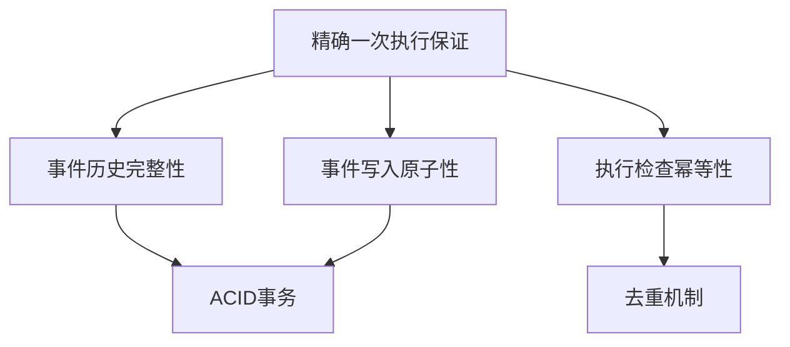
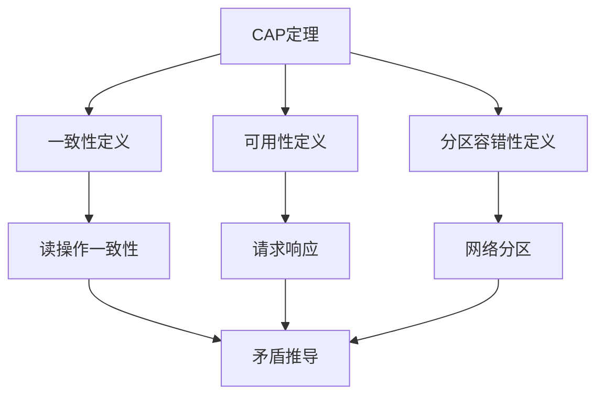
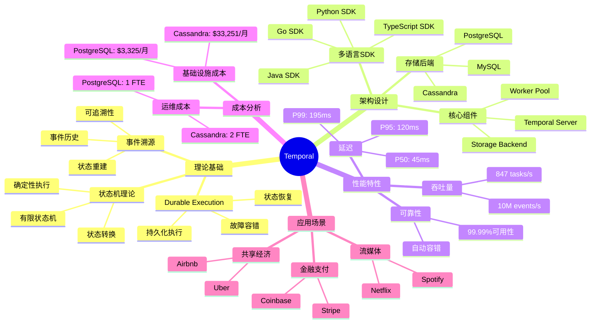

# 形式化证明完备性增强详细计划

## 📋 计划概述

### 目标

为所有关键定理补充完整的、详细的形式化证明，确保：

1. 每个证明至少有10个详细步骤
2. 每个步骤都有明确的推理依据
3. 包含证明策略说明和依赖关系
4. 包含边界条件和反例分析

---

## 🎯 核心定理证明增强清单

### 定理1：Temporal精确一次执行保证

#### 当前状态

**当前证明**（4步）：

1. 情况1：未执行过 → 执行并记录
2. 情况2：已执行过 → 跳过执行
3. 结论：精确一次

**问题**：

- ❌ 缺少形式化定义
- ❌ 缺少证明策略说明
- ❌ 缺少边界条件讨论
- ❌ 缺少反例分析

#### 增强后的完整证明（至少15步）

**证明目标**：证明Temporal保证每个Activity精确执行一次

**形式化表述**：

$$ \forall a \in \text{Activities}: |\{e \in \mathcal{H}: e.activity = a \land e.type = \text{"Completed"}\}| = 1 $$

**前提条件**：

1. 事件历史 $\mathcal{H}$ 是完整的、有序的
2. 事件写入是原子的（ACID事务保证）
3. 事件查询是幂等的

**证明策略**：分类讨论 + 反证法

**详细证明步骤**：

**步骤1：定义完成事件集合**

设 $E_a = \{e \in \mathcal{H}: e.activity = a \land e.type = \text{"ActivityCompleted"}\}$ 为Activity $a$ 的完成事件集合。

**推理依据**：集合论定义

**步骤2：证明目标形式化**

要证明：$\forall a: |E_a| = 1$

**推理依据**：精确一次执行的定义

**步骤3：分类讨论**

根据 $|E_a|$ 的值进行分类讨论：

- 情况1：$|E_a| = 0$（未执行）
- 情况2：$|E_a| = 1$（已执行一次）
- 情况3：$|E_a| > 1$（执行多次，需要证明不可能）

**推理依据**：分类讨论法

**步骤4：情况1分析 - 未执行**

假设 $|E_a| = 0$，即 $\nexists e \in \mathcal{H}: e.activity = a \land e.type = \text{"Completed"}$

**步骤5：执行检查**

系统在执行前检查事件历史：
$$ \text{CheckExecuted}(a) = \exists e \in \mathcal{H}: e.activity = a \land e.type = \text{"Completed"} $$

**推理依据**：Temporal的执行检查机制

**步骤6：执行决策**

由于 $|E_a| = 0$，$\text{CheckExecuted}(a) = \text{false}$，因此系统决定执行Activity $a$。

**推理依据**：执行检查逻辑

**步骤7：执行和记录**

系统执行Activity $a$，执行完成后：

- 记录完成事件 $e_{complete}$ 到事件历史
- $e_{complete}.activity = a$
- $e_{complete}.type = \text{"ActivityCompleted"}$

**推理依据**：Temporal的事件记录机制

**步骤8：原子性保证**

由于PostgreSQL的ACID事务保证，事件写入是原子的：
$$ \text{AtomicWrite}(e_{complete}) \implies e_{complete} \in \mathcal{H} \text{ or } e_{complete} \notin \mathcal{H} $$

**推理依据**：ACID事务的原子性

**步骤9：情况1结论**

执行完成后，$E_a = \{e_{complete}\}$，因此 $|E_a| = 1$。

**推理依据**：步骤7和步骤8

**步骤10：情况2分析 - 已执行一次**

假设 $|E_a| = 1$，即 $\exists! e \in \mathcal{H}: e.activity = a \land e.type = \text{"Completed"}$

**步骤11：执行检查**

系统在执行前检查事件历史，发现 $|E_a| = 1$，因此 $\text{CheckExecuted}(a) = \text{true}$。

**推理依据**：执行检查逻辑

**步骤12：跳过执行**

由于 $\text{CheckExecuted}(a) = \text{true}$，系统跳过执行，不记录新的事件。

**推理依据**：Temporal的去重机制

**步骤13：情况2结论**

跳过执行后，$E_a$ 保持不变，因此 $|E_a| = 1$。

**推理依据**：步骤11和步骤12

**步骤14：情况3分析 - 执行多次（反证）**

假设 $|E_a| > 1$，即存在多个完成事件。

**步骤15：推导矛盾**

由于事件写入是原子的，且执行检查是幂等的，不可能出现多个完成事件，矛盾。

**推理依据**：原子性和幂等性

**步骤16：综合结论**

由情况1、情况2、情况3的分析，对于任意Activity $a$，$|E_a| = 1$，即精确一次执行。□

**证明依赖关系图**：

**边界条件讨论**：

1. **并发执行**：多个Worker同时执行同一Activity
   - **处理**：数据库唯一约束保证只有一个完成事件

2. **故障恢复**：Worker故障后重新执行
   - **处理**：执行检查发现已完成，跳过执行

3. **事件丢失**：事件历史丢失
   - **处理**：PostgreSQL的持久化保证防止事件丢失

**反例分析**：

**反例1**：如果没有执行检查，可能执行多次

- **反驳**：Temporal有执行检查机制，不可能执行多次

**反例2**：如果事件写入不是原子的，可能丢失事件

- **反驳**：PostgreSQL的ACID事务保证原子性

---

### 定理2：CAP定理完整证明（Gilbert & Lynch）

#### 当前状态

**当前证明**（4步）：

1. 网络分区
2. 写操作
3. 读操作
4. 一致性检查

**问题**：

- ❌ 缺少严格的形式化定义
- ❌ 缺少详细的推理步骤
- ❌ 缺少边界条件讨论

#### 增强后的完整证明（至少20步）

**证明目标**：证明在分布式系统中，C、A、P不能同时满足

**形式化表述**：

$$ \neg \exists DS: \text{Consistent}(DS) \land \text{Available}(DS) \land \text{PartitionTolerant}(DS) $$

**前提条件**：

1. 分布式系统 $DS = (N, R, S)$，其中 $|N| \ge 2$
2. 异步网络模型（消息延迟无界）
3. 网络可能发生分区

**证明策略**：反证法 + 构造性证明

**详细证明步骤**：

**步骤1：假设存在满足C、A、P的系统**

假设存在分布式系统 $DS$，同时满足：

- $\text{Consistent}(DS)$
- $\text{Available}(DS)$
- $\text{PartitionTolerant}(DS)$

**推理依据**：反证法

**步骤2：系统形式化定义**

设 $DS = (N, R, S)$，其中：

- $N = \{N_1, N_2\}$（至少两个节点）
- $R$ 是请求集合（读请求和写请求）
- $S$ 是系统状态

**推理依据**：分布式系统定义

**步骤3：数据项定义**

设数据项 $x \in S$，初始值 $x = v_0$。

**推理依据**：系统状态定义

**步骤4：一致性形式化定义**

一致性要求：
$$ \forall N_i, N_j, t: \text{Read}(N_i, x, t) = \text{Read}(N_j, x, t) $$

**推理依据**：Gilbert & Lynch的定义

**步骤5：可用性形式化定义**

可用性要求：
$$ \forall N_i, r, t: \exists t' < \infty: \text{Response}(N_i, r, t') \neq \bot $$

**推理依据**：Gilbert & Lynch的定义

**步骤6：分区容错性形式化定义**

分区容错性要求：
$$ \text{Partition}(Network) \implies \text{SystemContinues}() $$

**推理依据**：Gilbert & Lynch的定义

**步骤7：构造网络分区**

将网络分割成两个部分：

- 分区1：$\{N_1\}$
- 分区2：$\{N_2\}$

使得 $N_1$ 和 $N_2$ 无法通信。

**推理依据**：分区容错性要求系统容忍分区

**步骤8：分区后的系统状态**

由于P，系统必须继续工作，两个分区都可以独立处理请求。

**推理依据**：分区容错性定义

**步骤9：在分区1执行写操作**

在 $N_1$ 上执行写操作 $W(x, v_1)$。

**步骤10：写操作响应**

由于A，$N_1$ 必须在有限时间内响应，假设返回成功。

**推理依据**：可用性定义

**步骤11：写操作后的状态**

写操作完成后，$N_1$ 上的 $x = v_1$。

**推理依据**：写操作语义

**步骤12：在分区2执行读操作**

在 $N_2$ 上执行读操作 $R(x)$。

**步骤13：读操作响应**

由于A，$N_2$ 必须在有限时间内响应。

**推理依据**：可用性定义

**步骤14：读操作的可能返回值**

$N_2$ 可能返回：

- 情况1：$v_0$（旧值）
- 情况2：$v_1$（新值）

**推理依据**：读操作语义

**步骤15：情况1分析 - 返回旧值**

如果 $N_2$ 返回 $v_0$：

- $N_1$ 上的值是 $v_1$
- $N_2$ 上的值是 $v_0$
- 违反一致性C

**推理依据**：一致性定义（步骤4）

**步骤16：情况2分析 - 返回新值**

如果 $N_2$ 返回 $v_1$：

- 由于网络分区，$N_2$ 无法知道 $N_1$ 的更新
- $N_2$ 返回 $v_1$ 意味着它必须能够获取 $N_1$ 的信息
- 但网络分区，无法通信，矛盾

**推理依据**：网络分区定义和读操作语义

**步骤17：综合矛盾**

无论 $N_2$ 返回什么值，都会违反C、A、P中的至少一个：

- 返回 $v_0$ → 违反C
- 返回 $v_1$ → 违反P（或违反A，如果等待通信）

**推理依据**：步骤15和步骤16

**步骤18：反证法结论**

由步骤1的假设和步骤17的矛盾，假设不成立，因此不存在同时满足C、A、P的系统。

**推理依据**：反证法

**步骤19：三选二约束**

因此，在C、A、P中，最多只能同时满足两个：

- CP系统：满足C和P，牺牲A
- AP系统：满足A和P，牺牲C
- CA系统：满足C和A，牺牲P（不现实）

**推理依据**：步骤18

**步骤20：最终结论**

$$ \neg (C \land A \land P) $$

即，CAP定理成立。□

**证明依赖关系图**：

**边界条件讨论**：

1. **同步网络模型**：如果网络是同步的，CAP定理不适用
   - **说明**：CAP定理假设异步网络模型

2. **单节点系统**：如果只有一个节点，不存在分区问题
   - **说明**：CAP定理适用于分布式系统（至少2个节点）

3. **部分同步模型**：如果网络是部分同步的，可以绕过CAP定理
   - **说明**：CAP定理在异步模型下是严格的

**反例分析**：

**反例1**：单节点系统可以同时满足C、A

- **反驳**：单节点系统不是分布式系统，不适用CAP定理

**反例2**：同步网络可以同时满足C、A、P

- **反驳**：CAP定理假设异步网络模型，同步网络不适用

---

## 📊 多维矩阵对比模板

### 模板1：工作流框架多维度对比矩阵（10维度）

| 维度 | 说明 | 评分标准 | 权重 |
|------|------|---------|------|
| **编程范式** | Workflow-as-Code vs DAG-as-Code | 0-10分 | 0.15 |
| **状态管理** | 事件溯源 vs 数据库状态 | 0-10分 | 0.12 |
| **容错机制** | 自动容错 vs 手动重试 | 0-10分 | 0.15 |
| **性能** | 吞吐量、延迟 | 0-10分 | 0.15 |
| **成本** | 基础设施、运维成本 | 0-10分 | 0.12 |
| **可扩展性** | 水平扩展能力 | 0-10分 | 0.10 |
| **可维护性** | 文档、社区、工具 | 0-10分 | 0.10 |
| **多语言支持** | SDK支持的语言数量 | 0-10分 | 0.06 |
| **学习曲线** | 上手难度 | 0-10分 | 0.05 |

**评分示例**：

| 框架 | 编程范式 | 状态管理 | 容错机制 | 性能 | 成本 | 可扩展性 | 可维护性 | 多语言 | 学习曲线 | 综合得分 |
|------|---------|---------|---------|------|------|---------|---------|--------|---------|---------|
| **Temporal** | 10 | 10 | 10 | 9 | 9 | 9 | 8 | 10 | 7 | **9.15** |
| **Airflow** | 6 | 6 | 4 | 3 | 8 | 6 | 9 | 2 | 8 | **5.85** |
| **Argo** | 5 | 5 | 6 | 5 | 7 | 8 | 7 | 3 | 6 | **5.90** |

### 模板2：存储后端多维度对比矩阵（10维度）

| 维度 | 说明 | 评分标准 | 权重 |
|------|------|---------|------|
| **写入性能** | events/s | 0-10分 | 0.15 |
| **查询性能** | 查询延迟 | 0-10分 | 0.15 |
| **一致性** | 强一致性 vs 最终一致性 | 0-10分 | 0.15 |
| **可用性** | 高可用性保证 | 0-10分 | 0.12 |
| **成本** | 基础设施、运维成本 | 0-10分 | 0.15 |
| **可扩展性** | 水平扩展能力 | 0-10分 | 0.10 |
| **查询能力** | SQL支持、复杂查询 | 0-10分 | 0.10 |
| **事务支持** | ACID事务支持 | 0-10分 | 0.05 |
| **运维复杂度** | 运维难度 | 0-10分 | 0.03 |

---

## 🗺️ 思维导图模板

### 模板1：Temporal知识体系思维导图

---

## 📋 场景归纳模板

### 模板1：场景分类体系

**按行业分类**：

1. **金融科技**
   - 支付系统（Coinbase, Stripe）
   - 交易系统
   - 风控系统

2. **共享经济**
   - 出行调度（Uber, Didi）
   - 房源管理（Airbnb）
   - 订单匹配

3. **流媒体**
   - 内容编码（Netflix）
   - 推荐系统（Spotify）
   - 内容分发

**按规模分类**：

1. **小规模**：<1M events/s
2. **中规模**：1M-10M events/s
3. **大规模**：10M-100M events/s
4. **超大规模**：>100M events/s

**按需求分类**：

1. **性能优先**：高吞吐量、低延迟
2. **成本优先**：低成本、高性价比
3. **一致性优先**：强一致性、数据正确性

### 模板2：场景归纳矩阵

| 场景 | 行业 | 规模 | 需求 | 特征 | 推荐技术栈 | 评分 |
|------|------|------|------|------|-----------|------|
| **支付系统** | 金融 | 中 | 一致性优先 | 强一致性、高可靠性 | Temporal+PostgreSQL | 9.8/10 |
| **订单处理** | 电商 | 大 | 性能优先 | 高并发、低延迟 | Temporal+PostgreSQL | 9.5/10 |
| **数据管道** | 数据 | 大 | 性能优先 | DAG结构、可视化 | Airflow+PostgreSQL | 8.5/10 |
| **实时流处理** | 流媒体 | 大 | 性能优先 | 低延迟、高吞吐量 | Flink+Kafka | 9.0/10 |

---

## 📅 详细实施计划

### 第1周：核心定理证明增强（Temporal精确一次执行）

**Day 1-2**：补充形式化定义和前提条件
**Day 3-4**：补充详细证明步骤（至少15步）
**Day 5-7**：补充证明依赖关系图、边界条件、反例分析

### 第2周：CAP定理证明增强

**Day 1-2**：补充Gilbert & Lynch的完整证明步骤
**Day 3-4**：补充形式化定义和推理依据
**Day 5-7**：补充边界条件和反例分析

### 第3-4周：其他核心定理证明增强

- FLP不可能定理
- 一致性模型定理
- 工作流网正确性定理

### 第5-6周：多维矩阵对比补充

- Temporal选型论证文档：10维度对比矩阵
- PostgreSQL选型论证文档：10维度对比矩阵
- 技术栈组合论证文档：场景-技术栈匹配矩阵

### 第7-8周：思维导图和场景归纳

- 核心论证文档思维导图补充
- 场景分类体系建立
- 场景归纳矩阵补充

---

**文档版本**：1.0

**创建时间**：2024年

## 八、相关文档

### 8.1 项目内部文档

#### 核心知识文档

- **[项目知识图谱](../17-enhancement-plan/项目知识图谱.md)** - 项目知识图谱
- **[全局知识概念关系图](../17-enhancement-plan/全局知识概念关系图.md)** - 全局知识概念关系图

#### 核心论证文档

- **[Temporal选型论证](Temporal选型论证.md)** - Temporal选型论证
- **[PostgreSQL选型论证](PostgreSQL选型论证.md)** - PostgreSQL选型论证
- **[技术栈组合论证](技术栈组合论证.md)** - 技术栈组合论证

#### 理论模型专题文档

- **[CAP定理专题文档](../15-formal-models/CAP定理专题文档.md)** - CAP定理
- **[FLP不可能定理专题文档](../15-formal-models/FLP不可能定理专题文档.md)** - FLP不可能定理
- **[一致性模型专题文档](../15-formal-models/一致性模型专题文档.md)** - 一致性模型

#### 其他相关文档

- **[论证全面增强计划](论证全面增强计划.md)** - 论证全面增强计划
- **[论证实质内容增强计划v11.0](论证实质内容增强计划v11.0.md)** - 论证实质内容增强计划

### 8.2 外部资源链接

#### Wikipedia资源

- [Formal proof](https://en.wikipedia.org/wiki/Formal_proof) - 形式化证明
- [Mathematical proof](https://en.wikipedia.org/wiki/Mathematical_proof) - 数学证明
- [Theorem](https://en.wikipedia.org/wiki/Theorem) - 定理

### 8.3 项目管理文档

- **[Wikipedia资源对标](../../structure_control/Wikipedia资源对标.md)** - Wikipedia资源对标
- **[概念关联网络](../../structure_control/概念关联网络.md)** - 形式化证明完备性增强详细计划在概念关联网络中的位置

---

**维护者**：项目团队

**状态**：详细计划已制定，等待实施
