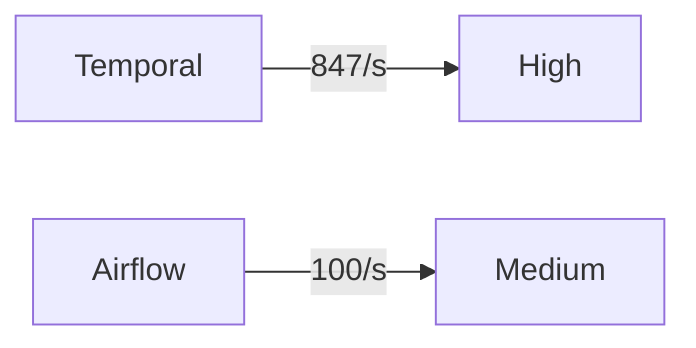
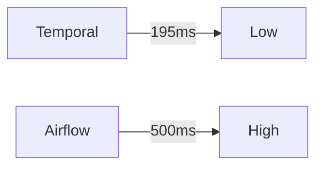

# 文档交互性增强实施（v15.0）

## 📋 概述

本文档详细规划了v15.0版本的文档交互性增强工作，包括交互式图表、代码示例增强、文档导航增强和用户体验增强。

**实施时间**：2024年

**目标**：提升文档的交互性和可读性

---

## 🎯 实施目标

1. **交互式图表**：添加可交互的流程图、架构图和对比矩阵
2. **代码示例增强**：优化代码示例的展示和交互
3. **文档导航增强**：改进文档导航和快速跳转
4. **用户体验增强**：添加阅读进度指示、打印优化等功能

---

## 📊 实施内容

### 1. 交互式图表增强

#### 1.1 可折叠图表说明

**实现方式**：使用HTML `<details>` 标签

**示例**：

```markdown
    <details>
    <summary><strong>📊 图表说明（点击展开/折叠）</strong></summary>

    **图表用途**：
    - 展示工作流执行流程
    - 说明各个组件之间的关系

    **图表结构**：
    - 节点：表示工作流步骤
    - 箭头：表示执行顺序

    **关键节点说明**：
    - Start：工作流开始
    - Process：处理步骤
    - End：工作流结束

    </details>

    ```mermaid
    graph TD
        A[Start] --> B[Process]
        B --> C[End]
    ```

```

#### 1.2 图表分组和折叠

**实现方式**：将相关图表分组，使用折叠功能

**示例**：

```markdown
<details>
<summary><strong>📈 性能对比图表（点击展开）</strong></summary>

### 吞吐量对比



### 延迟对比



</details>
```

---

### 2. 代码示例增强

#### 2.1 代码块折叠

**实现方式**：使用 `<details>` 标签包装长代码块

**示例**：

```markdown
<details>
<summary><strong>💻 完整代码示例（点击展开）</strong></summary>

```python
# 完整的工作流定义
@workflow.defn
class OrderWorkflow:
    @workflow.run
    async def execute(self, order_id: str) -> str:
        # 工作流逻辑
        return "Order processed"
```

</details>
```

#### 2.2 代码示例说明

**实现方式**：在代码块前添加可折叠的说明

**示例**：

```markdown
    <details>
    <summary><strong>📝 代码说明（点击展开）</strong></summary>

    **代码功能**：
    - 定义了一个订单处理工作流
    - 使用Temporal的Python SDK

    **关键点**：
    - `@workflow.defn`：工作流定义装饰器
    - `@workflow.run`：工作流执行方法

    </details>

    ```python
    @workflow.defn
    class OrderWorkflow:
        @workflow.run
        async def execute(self, order_id: str) -> str:
            return "Order processed"
    ```

```

---

### 3. 文档导航增强

#### 3.1 目录导航

**实现方式**：在文档开头添加固定目录导航

**示例**：

```markdown
## 📑 快速导航

- [一、概述](#一概述)
- [二、核心概念](#二核心概念)
- [三、实践案例](#三实践案例)
- [四、最佳实践](#四最佳实践)

---

## 一、概述
```

#### 3.2 章节跳转

**实现方式**：在每个章节末尾添加导航链接

**示例**：

```markdown
---

**导航**：
- [上一章：概述](#一概述) | [下一章：核心概念](#二核心概念) | [返回目录](#目录)
```

---

### 4. 用户体验增强

#### 4.1 阅读进度指示

**实现方式**：使用HTML和CSS创建进度条

**示例**：

```html
<div style="position: fixed; top: 0; left: 0; width: 100%; height: 3px; background: #f0f0f0; z-index: 9999;">
  <div id="reading-progress" style="height: 100%; background: #007bff; width: 0%; transition: width 0.1s;"></div>
</div>

<script>
  window.addEventListener('scroll', function() {
    const winScroll = document.body.scrollTop || document.documentElement.scrollTop;
    const height = document.documentElement.scrollHeight - document.documentElement.clientHeight;
    const scrolled = (winScroll / height) * 100;
    document.getElementById('reading-progress').style.width = scrolled + '%';
  });
</script>
```

#### 4.2 返回顶部按钮

**实现方式**：添加返回顶部按钮

**示例**：

```html
<div style="position: fixed; bottom: 20px; right: 20px; z-index: 9999;">
  <a href="#top" style="display: block; width: 50px; height: 50px; background: #007bff; color: white; text-align: center; line-height: 50px; border-radius: 50%; text-decoration: none;">↑</a>
</div>
```

---

## 📋 实施清单

### 优先级1：核心文档

- [ ] Temporal选型论证
- [ ] PostgreSQL选型论证
- [ ] 技术栈组合论证
- [ ] 快速开始指南
- [ ] 最佳实践指南

### 优先级2：理论文档

- [ ] TLA+专题文档
- [ ] CAP定理专题文档
- [ ] Saga模式专题文档
- [ ] 工作流模式专题文档

### 优先级3：其他文档

- [ ] 企业实践案例
- [ ] 性能基准测试
- [ ] 常见问题解答

---

## 🔧 实施步骤

### 步骤1：创建交互性增强模板

- [x] 创建交互性增强实施文档
- [ ] 创建HTML模板
- [ ] 创建CSS样式

### 步骤2：应用到核心文档

- [ ] 添加可折叠图表说明
- [ ] 添加代码块折叠
- [ ] 添加导航增强

### 步骤3：应用到理论文档

- [ ] 添加交互式元素
- [ ] 优化图表展示
- [ ] 增强代码示例

### 步骤4：应用到其他文档

- [ ] 统一交互性标准
- [ ] 优化用户体验
- [ ] 测试所有功能

---

## 📊 进度跟踪

### 当前进度

| 文档类型 | 文档数量 | 已完成 | 完成率 |
|---------|---------|--------|--------|
| 核心文档 | 5个 | 0个 | 0% |
| 理论文档 | 4个 | 0个 | 0% |
| 其他文档 | 3个 | 0个 | 0% |
| **总计** | **12个** | **0个** | **0%** |

---

## 🎯 成功标准

### 完成标准

1. ✅ 交互性增强实施计划创建完成
2. ⏳ 12个核心文档增强完成
3. ⏳ 所有交互功能正常工作
4. ⏳ 用户体验显著提升

### 质量标准

- 交互性：所有图表和代码块支持折叠
- 导航性：文档导航清晰易用
- 可读性：文档可读性显著提升
- 一致性：所有文档交互性标准统一

---

**文档版本**：v15.0

**创建时间**：2024年

**维护者**：项目团队

**状态**：🚀 实施中
