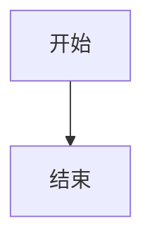
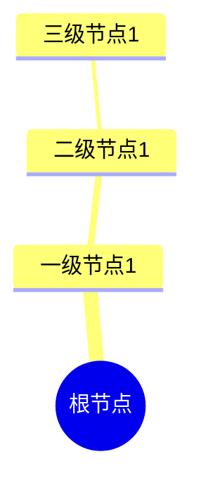
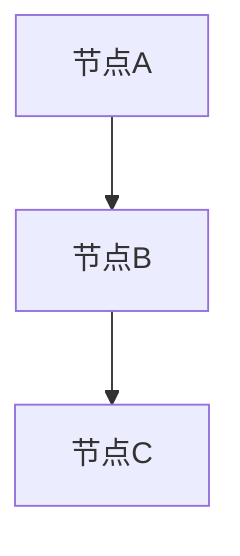

# 格式规范

## 📋 概述

本文档定义了项目中所有文档的格式规范，确保文档格式的一致性。

---

## 📝 Markdown格式规范

### 标题格式

#### 一级标题（文档标题）

**格式**：`# 标题名称`

**示例**：
```markdown
# Temporal选型论证
```

**规范**：
- 每个文档只有一个一级标题
- 标题名称简洁、明确
- 不使用标点符号结尾

#### 二级标题（主要章节）

**格式**：`## 章节名称`

**示例**：
```markdown
## 一、理论依据论证
```

**规范**：
- 使用中文数字编号（一、二、三...）
- 章节名称简洁、明确
- 章节之间用`---`分隔

#### 三级标题（子章节）

**格式**：`### 子章节名称`

**示例**：
```markdown
### 1.1 Durable Execution的理论基础
```

**规范**：
- 使用数字编号（1.1、1.2、1.3...）
- 子章节名称简洁、明确

#### 四级标题（小节）

**格式**：`#### 小节名称`

**示例**：
```markdown
#### 1.1.1 事件溯源（Event Sourcing）理论
```

**规范**：
- 使用数字编号（1.1.1、1.1.2...）
- 小节名称简洁、明确

---

### 列表格式

#### 无序列表

**格式**：
```markdown
- 项目1
- 项目2
- 项目3
```

**规范**：
- 使用`-`作为列表标记
- 列表项前后都有空行
- 列表项内容简洁、明确

#### 有序列表

**格式**：
```markdown
1. 步骤1
2. 步骤2
3. 步骤3
```

**规范**：
- 使用数字编号
- 列表项前后都有空行
- 列表项内容简洁、明确

#### 嵌套列表

**格式**：
```markdown
- 一级项目
  - 二级项目
    - 三级项目
```

**规范**：
- 使用2个空格缩进
- 保持缩进一致性

---

### 代码块格式

#### 行内代码

**格式**：`` `代码` ``

**示例**：
```markdown
使用`Temporal`框架
```

**规范**：
- 使用反引号包围代码
- 代码简洁、明确

#### 代码块

**格式**：
````markdown
```语言
代码内容
```
````

**示例**：
````markdown
```go
func main() {
    fmt.Println("Hello, World!")
}
```
````

**规范**：
- 指定代码语言
- 代码块前后都有空行
- 代码格式正确、可读

#### Mermaid图表

**格式**：
````markdown
```mermaid
图表代码
```
````

**示例**：
````markdown

````

**规范**：
- 图表代码前后都有空行
- 图表说明在图表之前
- 图表格式正确、可读

---

### 表格格式

**格式**：
```markdown
| 列1 | 列2 | 列3 |
|-----|-----|-----|
| 值1 | 值2 | 值3 |
| 值4 | 值5 | 值6 |
```

**规范**：
- 表格前后都有空行
- 列对齐使用`|`分隔
- 表头使用`---`分隔
- 表格内容简洁、明确

---

### 引用格式

#### 内部引用

**格式**：`` `\[链接文本\](文件路径)` `` （示例格式，请替换为实际路径）

**示例**：
```markdown
参见[Temporal选型论证](Temporal选型论证.md)
```

**规范**：
- 使用相对路径
- 链接文本简洁、明确
- 链接正确、有效

#### 外部引用

**格式**：`\[链接文本\](URL)` （示例格式，请替换为实际URL）

**示例**：
```markdown
参见[Temporal官方文档](https://temporal.io/docs)
```

**规范**：
- 使用完整URL
- 链接文本简洁、明确
- 链接正确、有效

#### 锚点引用

**格式**：`\[链接文本\](文件路径#锚点)` （示例格式，请替换为实际路径）

**示例**：
```markdown
参见[Temporal选型论证 - 实践案例](Temporal选型论证.md#七实践案例)
```

**规范**：
- 使用相对路径和锚点
- 锚点格式正确
- 链接正确、有效

---

## 🎨 图表格式规范

### 图表标题格式

**格式**：
```markdown
**图表名称**：
```

**示例**：
```markdown
**Temporal知识体系思维导图**：
```

**规范**：
- 使用粗体格式
- 标题简洁、明确
- 标题后使用冒号

---

### 图表说明格式

**格式**：
```markdown
**图表说明**：
说明内容

**图表结构**：
- 结构说明1
- 结构说明2

**使用方法**：
1. 使用步骤1
2. 使用步骤2
```

**规范**：
- 说明在图表之前
- 说明内容简洁、明确
- 包含图表说明、图表结构、使用方法三个部分

---

### Mermaid图表格式

#### 思维导图（Mindmap）

**格式**：
````markdown

````

**规范**：
- 根节点使用双括号
- 节点层次清晰
- 节点名称简洁、明确

#### 流程图（Flowchart）

**格式**：
````markdown

````

**规范**：
- 使用flowchart类型
- 方向明确（TD、LR等）
- 节点名称简洁、明确

#### 关系图（Graph）

**格式**：
````markdown

````

**规范**：
- 使用graph类型
- 方向明确（TB、LR等）
- 节点名称简洁、明确

---

## 📚 引用格式规范

### 内部引用格式

**格式**：`\[文档名称\](文件路径)` （示例格式，请替换为实际路径）

**示例**：
```markdown
参见[Temporal选型论证](Temporal选型论证.md)
```

**规范**：
- 使用相对路径
- 文档名称使用完整名称
- 链接正确、有效

### 外部引用格式

**格式**：`\[资源名称\](URL)` （示例格式，请替换为实际URL）

**示例**：
```markdown
参见[Temporal官方文档](https://temporal.io/docs)
```

**规范**：
- 使用完整URL
- 资源名称简洁、明确
- 链接正确、有效

### 参考文献格式

**格式**：
```markdown
**参考文献**：

1. **作者（年份）**："论文标题"
   - **来源**：期刊/会议名称
   - **链接**：`` `[URL](URL)` `` （示例格式，请替换为实际URL）
```

**规范**：
- 使用有序列表
- 包含作者、年份、标题、来源、链接
- 格式统一、规范

---

## ✅ 格式检查清单

### 标题检查

- [ ] 所有标题格式正确
- [ ] 标题层级清晰
- [ ] 标题编号正确

### 列表检查

- [ ] 所有列表格式正确
- [ ] 列表项前后都有空行
- [ ] 嵌套列表缩进正确

### 代码块检查

- [ ] 所有代码块格式正确
- [ ] 代码语言指定正确
- [ ] 代码格式正确、可读

### 表格检查

- [ ] 所有表格格式正确
- [ ] 表格前后都有空行
- [ ] 表格内容对齐

### 引用检查

- [ ] 所有引用格式正确
- [ ] 链接正确、有效
- [ ] 引用说明清晰

### 图表检查

- [ ] 所有图表格式正确
- [ ] 图表说明完整
- [ ] 图表可读、美观

---

**文档版本**：1.0

**创建时间**：2024年

**维护者**：项目团队

**状态**：✅ 已完成

**相关文档**：

- [术语表](术语表.md)
- [风格指南](风格指南.md)
-
