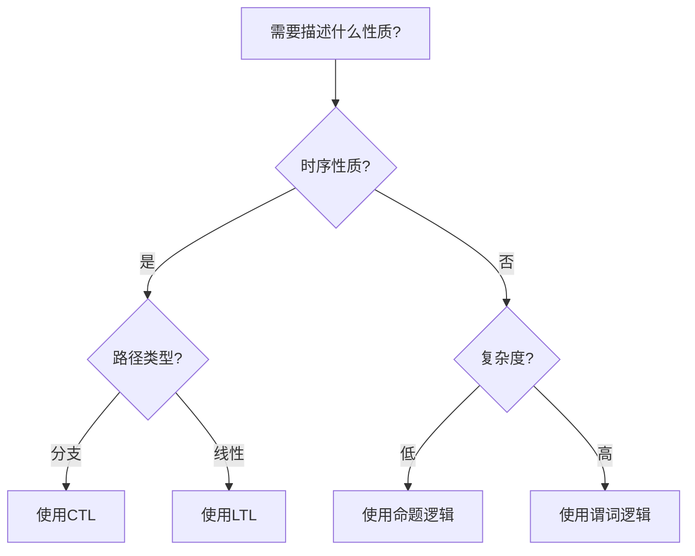

# 跨学科整合：逻辑学

**文档版本**：v1.0
**创建时间**：2025年11月28日
**优先级**：P1
**状态**：🔄 进行中

---

## 📑 目录

- [跨学科整合：逻辑学](#跨学科整合逻辑学)
  - [📑 目录](#-目录)
  - [一、概述](#一概述)
    - [1.1 文档目的](#11-文档目的)
    - [1.2 逻辑学定义](#12-逻辑学定义)
  - [二、逻辑学核心理论](#二逻辑学核心理论)
    - [2.1 命题逻辑（Propositional Logic）](#21-命题逻辑propositional-logic)
      - [2.1.1 基本概念](#211-基本概念)
      - [2.1.2 推理规则](#212-推理规则)
    - [2.2 谓词逻辑（Predicate Logic）](#22-谓词逻辑predicate-logic)
      - [2.2.1 基本概念](#221-基本概念)
      - [2.2.2 推理规则](#222-推理规则)
    - [2.3 时序逻辑（Temporal Logic）](#23-时序逻辑temporal-logic)
      - [2.3.1 CTL（Computation Tree Logic）](#231-ctlcomputation-tree-logic)
      - [2.3.2 LTL（Linear Temporal Logic）](#232-ltllinear-temporal-logic)
  - [三、在形式化验证中的应用](#三在形式化验证中的应用)
    - [3.1 TLA+中的应用](#31-tla中的应用)
      - [3.1.1 命题逻辑应用](#311-命题逻辑应用)
      - [3.1.2 时序逻辑应用](#312-时序逻辑应用)
    - [3.2 CTL/LTL中的应用](#32-ctlltl中的应用)
      - [3.2.1 CTL应用](#321-ctl应用)
      - [3.2.2 LTL应用](#322-ltl应用)
  - [四、逻辑系统对比分析](#四逻辑系统对比分析)
    - [4.1 对比矩阵](#41-对比矩阵)
    - [4.2 选择决策树](#42-选择决策树)
  - [五、应用案例](#五应用案例)
    - [5.1 案例1：Temporal一致性性质验证](#51-案例1temporal一致性性质验证)
    - [5.2 案例2：PostgreSQL事务ACID性质验证](#52-案例2postgresql事务acid性质验证)
  - [六、相关文档](#六相关文档)

---

## 一、概述

### 1.1 文档目的

本文档旨在整合逻辑学理论到工作流系统项目中，包括：

1. **逻辑学核心理论**：研究逻辑学的核心理论
2. **在形式化验证中的应用**：分析逻辑学在形式化验证中的应用
3. **逻辑系统对比分析**：对比分析不同的逻辑系统
4. **应用案例**：提供逻辑学在工作流系统中的应用案例

### 1.2 逻辑学定义

**逻辑学（Logic）**是研究推理和论证的学科，包括：

- **命题逻辑**：研究命题之间的逻辑关系
- **谓词逻辑**：研究谓词之间的逻辑关系
- **模态逻辑**：研究可能性和必然性的逻辑
- **时序逻辑**：研究时间相关的逻辑

---

## 二、逻辑学核心理论

### 2.1 命题逻辑（Propositional Logic）

#### 2.1.1 基本概念

- **命题**：可以判断真假的陈述句
- **逻辑连接词**：¬（非）、∧（与）、∨（或）、→（蕴含）、↔（等价）
- **真值表**：表示命题真值的表格

#### 2.1.2 推理规则

- **分离规则（Modus Ponens）**：如果P→Q且P，则Q
- **否定后件规则（Modus Tollens）**：如果P→Q且¬Q，则¬P

### 2.2 谓词逻辑（Predicate Logic）

#### 2.2.1 基本概念

- **谓词**：描述对象性质的函数
- **量词**：∀（全称量词）、∃（存在量词）
- **变量**：表示对象的变量

#### 2.2.2 推理规则

- **全称实例化**：从∀x P(x)推导出P(a)
- **存在实例化**：从∃x P(x)推导出P(a)（a是新的常量）

### 2.3 时序逻辑（Temporal Logic）

#### 2.3.1 CTL（Computation Tree Logic）

- **路径量词**：A（所有路径）、E（存在路径）
- **时序算子**：X（下一个）、F（最终）、G（全局）、U（直到）

#### 2.3.2 LTL（Linear Temporal Logic）

- **时序算子**：X（下一个）、F（最终）、G（全局）、U（直到）
- **路径性质**：描述路径上的时序性质

---

## 三、在形式化验证中的应用

### 3.1 TLA+中的应用

#### 3.1.1 命题逻辑应用

- **状态谓词**：使用命题逻辑描述系统状态
- **转换条件**：使用命题逻辑描述状态转换条件
- **不变式**：使用命题逻辑描述系统不变式

#### 3.1.2 时序逻辑应用

- **时序性质**：使用时序逻辑描述系统时序性质
- **公平性**：使用时序逻辑描述公平性条件
- **活性**：使用时序逻辑描述活性性质

### 3.2 CTL/LTL中的应用

#### 3.2.1 CTL应用

- **路径性质**：使用CTL描述计算树上的路径性质
- **分支性质**：使用CTL描述分支性质
- **模型检验**：使用CTL进行模型检验

#### 3.2.2 LTL应用

- **线性性质**：使用LTL描述线性路径上的性质
- **时序约束**：使用LTL描述时序约束
- **模型检验**：使用LTL进行模型检验

---

## 四、逻辑系统对比分析

### 4.1 对比矩阵

| 逻辑系统 | 表达能力 | 计算复杂度 | 适用场景 | 工具支持 |
|---------|---------|-----------|---------|---------|
| **命题逻辑** | 低 | 低（NP完全） | 简单系统 | SAT求解器 |
| **谓词逻辑** | 中 | 高（不可判定） | 复杂系统 | 定理证明器 |
| **CTL** | 高 | 中（PSPACE完全） | 分支时序性质 | NuSMV |
| **LTL** | 高 | 中（PSPACE完全） | 线性时序性质 | SPIN |

### 4.2 选择决策树

---

## 五、应用案例

### 5.1 案例1：Temporal一致性性质验证

**场景**：验证Temporal工作流引擎的一致性性质

**逻辑学应用**：

- 使用LTL描述一致性性质：G(consistent → F(committed))
- 使用CTL描述分支性质：AG(consistent)
- 使用模型检验器验证性质

**效果**：

- 形式化验证一致性性质
- 发现潜在问题
- 提高系统可靠性

### 5.2 案例2：PostgreSQL事务ACID性质验证

**场景**：验证PostgreSQL事务的ACID性质

**逻辑学应用**：

- 使用谓词逻辑描述ACID性质
- 使用时序逻辑描述事务执行过程
- 使用定理证明器验证性质

**效果**：

- 形式化验证ACID性质
- 保证事务正确性
- 提高系统可靠性

---

## 六、相关文档

- [跨学科整合-认知科学](跨学科整合-认知科学.md)
- [跨学科整合-其他学科](跨学科整合-其他学科.md)
- [形式逻辑推理方法](形式逻辑推理方法.md)
- [TLA+专题文档](../15-formal-models/TLA+专题文档.md)
- [CTL专题文档](../15-formal-models/CTL专题文档.md)
- [LTL专题文档](../15-formal-models/LTL专题文档.md)

---

**文档版本**：v1.1
**最后更新**：2025年11月28日
**维护者**：项目团队
**状态**：✅ 已完成（核心理论已整合，应用案例已补充）
