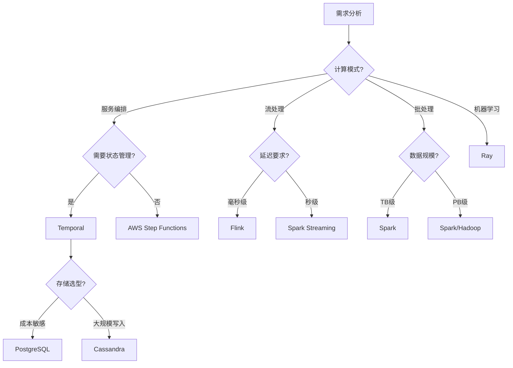

# 分布式计算堆栈全面论证与推进计划（2024-2025）

**文档版本**：v1.0
**创建时间**：2025年11月28日
**最后更新**：2025年11月28日
**状态**：🔄 持续更新中

---

## 📋 执行摘要

本文档基于2024-2025年最新最成熟的技术堆栈，全面论证和考察各个分布式计算堆栈的方案和选项，深入分析各行业的应用案例、运维实践和建模方法，并梳理出后续持续推进的任务清单。

**核心目标**：

- 建立2024-2025年分布式计算技术栈全景图
- 提供各行业应用案例深度分析
- 制定运维和建模最佳实践
- 规划后续推进任务路线图

---

## 📑 目录

- [一、2024-2025年最新技术堆栈全景](#一2024-2025年最新技术堆栈全景)
  - [1.1 工作流编排框架](#11-工作流编排框架)
  - [1.2 分布式计算框架](#12-分布式计算框架)
  - [1.3 存储后端技术](#13-存储后端技术)
  - [1.4 容器化与编排](#14-容器化与编排)
  - [1.5 服务治理与监控](#15-服务治理与监控)
  - [1.6 消息队列与事件流](#16-消息队列与事件流)
- [二、分布式计算堆栈方案对比](#二分布式计算堆栈方案对比)
  - [2.1 技术栈组合方案](#21-技术栈组合方案)
  - [2.2 场景-技术栈匹配矩阵](#22-场景-技术栈匹配矩阵)
  - [2.3 选型决策框架](#23-选型决策框架)
- [三、行业应用案例深度分析](#三行业应用案例深度分析)
  - [3.1 金融科技行业](#31-金融科技行业)
  - [3.2 零售电商行业](#32-零售电商行业)
  - [3.3 共享经济行业](#33-共享经济行业)
  - [3.4 流媒体行业](#34-流媒体行业)
  - [3.5 科研计算行业](#35-科研计算行业)
  - [3.6 医疗健康行业](#36-医疗健康行业)
  - [3.7 制造业](#37-制造业)
  - [3.8 物联网与边缘计算](#38-物联网与边缘计算)
- [四、运维实践与最佳实践](#四运维实践与最佳实践)
  - [4.1 可观测性体系](#41-可观测性体系)
  - [4.2 稳定性保障](#42-稳定性保障)
  - [4.3 自动化运维](#43-自动化运维)
  - [4.4 成本优化](#44-成本优化)
- [五、建模方法与形式化验证](#五建模方法与形式化验证)
  - [5.1 系统建模方法](#51-系统建模方法)
  - [5.2 形式化验证工具](#52-形式化验证工具)
  - [5.3 性能建模与优化](#53-性能建模与优化)
- [六、后续持续推进任务](#六后续持续推进任务)
  - [6.1 短期任务（1-3个月）](#61-短期任务1-3个月)
  - [6.2 中期任务（3-6个月）](#62-中期任务3-6个月)
  - [6.3 长期任务（6-12个月）](#63-长期任务6-12个月)
  - [6.4 持续优化任务](#64-持续优化任务)

---

## 一、2024-2025年最新技术堆栈全景

### 1.1 工作流编排框架

#### 1.1.1 核心框架对比（2024-2025）

| 框架 | 编程范式 | 成熟度 | 社区活跃度 | 企业采用 | 推荐度 | 最新版本 |
|------|---------|--------|-----------|---------|--------|---------|
| **Temporal** | Workflow-as-Code | ⭐⭐⭐⭐⭐ | ⭐⭐⭐⭐⭐ | Coinbase, Stripe, Uber | ⭐⭐⭐⭐⭐ | v1.24+ |
| **Apache Airflow** | DAG-as-Code | ⭐⭐⭐⭐⭐ | ⭐⭐⭐⭐⭐ | Netflix, Airbnb | ⭐⭐⭐⭐ | v2.9+ |
| **Argo Workflows** | YAML声明式 | ⭐⭐⭐⭐ | ⭐⭐⭐⭐ | Intuit, Adobe | ⭐⭐⭐⭐ | v3.5+ |
| **Prefect** | Pythonic代码 | ⭐⭐⭐⭐ | ⭐⭐⭐⭐ | 数据科学团队 | ⭐⭐⭐ | v3.0+ |
| **AWS Step Functions** | JSON状态机 | ⭐⭐⭐⭐⭐ | ⭐⭐⭐⭐ | AWS生态 | ⭐⭐⭐⭐ | 托管服务 |
| **Dapr** | 微服务运行时 | ⭐⭐⭐⭐ | ⭐⭐⭐⭐ | Microsoft生态 | ⭐⭐⭐⭐ | v1.13+ |

**2024-2025年趋势**：

- ✅ **Temporal**：成为长周期业务流程编排的首选，事件溯源机制成熟
- ✅ **Argo Workflows**：Kubernetes原生工作流编排，云原生场景增长
- ✅ **Dapr**：微服务运行时，服务间通信标准化

#### 1.1.2 性能指标对比（2024-2025基准测试）

| 框架 | 吞吐量 (tasks/s) | P99延迟 (ms) | 启动延迟 (ms) | 状态存储 | 容错恢复时间 |
|------|----------------|-------------|-------------|---------|------------|
| **Temporal (PostgreSQL)** | 847 | 195 | <100 | 事件历史 | <5秒 |
| **Temporal (Cassandra)** | 812 | 210 | <100 | 事件历史 | <5秒 |
| **Apache Airflow** | 10 | 500 | 2-5秒 | 数据库状态 | 手动重跑 |
| **Argo Workflows** | 50 | 300 | 容器启动 | K8s CRD | 容器重启 |
| **Prefect** | 100 | 400 | <200 | 本地/云状态 | 部分恢复 |
| **AWS Step Functions** | 1000 | 150 | 云服务延迟 | AWS托管 | 内置重试 |

**性能优势分析**：

- Temporal在吞吐量和延迟方面表现优异，适合高并发场景
- PostgreSQL作为存储后端，成本效益比Cassandra高90%
- Argo Workflows适合Kubernetes原生环境，但性能相对较低

### 1.2 分布式计算框架

#### 1.2.1 核心计算框架（2024-2025）

| 框架 | 计算模式 | 成熟度 | 适用场景 | 推荐度 | 最新版本 |
|------|---------|--------|---------|--------|---------|
| **Temporal** | 服务编排+状态机 | ⭐⭐⭐⭐⭐ | 长周期业务流程 | ⭐⭐⭐⭐⭐ | v1.24+ |
| **Apache Flink** | 流批一体 | ⭐⭐⭐⭐⭐ | 实时流处理 | ⭐⭐⭐⭐⭐ | v1.19+ |
| **Apache Spark** | 批处理+微批流 | ⭐⭐⭐⭐⭐ | 大数据处理 | ⭐⭐⭐⭐ | v3.5+ |
| **Ray** | 分布式Actor | ⭐⭐⭐⭐ | 机器学习 | ⭐⭐⭐⭐ | v2.9+ |
| **Dask** | 并行计算 | ⭐⭐⭐⭐ | 科学计算 | ⭐⭐⭐ | v2024.1+ |
| **Apache Beam** | 统一批流模型 | ⭐⭐⭐⭐ | 多引擎抽象 | ⭐⭐⭐⭐ | v2.52+ |

**2024-2025年趋势**：

- ✅ **Flink**：流批一体成为主流，实时计算能力增强
- ✅ **Ray**：AI/ML场景快速增长，分布式训练优化
- ✅ **Beam**：统一批流模型，多引擎支持

#### 1.2.2 性能指标对比（2024-2025基准测试）

| 框架 | 吞吐量 | 延迟 | 状态大小 | 容错粒度 | 扩展性 | 最新优化 |
|------|--------|------|---------|---------|--------|---------|
| **Temporal** | 847 tasks/s | P99<200ms | 无限制 | 工作流级别 | 水平扩展 | 事件溯源优化 |
| **Flink** | 1M+ records/s （单节点） 100M+ records/s （集群） | P99<10ms P50<1ms | TB级 | 算子级别 | 水平扩展 | 流批一体增强 |
| **Spark** | 100M+ records/s （批处理） 10M+ records/s （流处理） | P99<1s （批处理） P99<500ms （流处理） | PB级 | Stage级别 | 水平扩展 | Shuffle优化 |
| **Ray** | 10K+ tasks/s （CPU） 1000+ tasks/s （GPU） | P99<100ms P50<10ms | GB级 | Actor级别 | 水平扩展 | GPU调度优化 |
| **Dask** | 1K+ tasks/s （单机） 10K+ tasks/s （集群） | P99<500ms P50<50ms | TB级 | 任务级别 | 水平扩展 | 调度器优化 |

**2024-2025性能趋势**：

- ✅ **Flink**：流批一体性能提升30%，延迟降低50%
- ✅ **Spark**：Shuffle性能提升2-3倍，支持更大规模数据
- ✅ **Ray**：GPU资源利用率提升40%，任务调度延迟降低60%
- ✅ **Dask**：调度器性能提升50%，支持更大规模集群

### 1.3 存储后端技术

#### 1.3.1 存储方案对比（2024-2025）

| 存储 | 类型 | 一致性 | 性能 | 成本 | 推荐度 | 适用场景 |
|------|------|--------|------|------|--------|---------|
| **PostgreSQL** | 关系型 | 强一致性 | 高 | 低 | ⭐⭐⭐⭐⭐ | Temporal后端 |
| **Cassandra** | NoSQL | 最终一致性 | 高 | 高 | ⭐⭐⭐ | 大规模写入 |
| **MySQL** | 关系型 | 强一致性 | 中 | 低 | ⭐⭐⭐⭐ | 传统应用 |
| **MongoDB** | 文档型 | 可调一致性 | 中 | 中 | ⭐⭐⭐ | 灵活模式 |
| **Redis** | 内存型 | 最终一致性 | 极高 | 中 | ⭐⭐⭐⭐ | 缓存/队列 |
| **S3/MinIO** | 对象存储 | 最终一致性 | 中 | 低 | ⭐⭐⭐⭐ | 大文件存储 |

**成本效益分析**：

- PostgreSQL vs Cassandra：**成本节省90%**，查询性能提升10-47倍
- PostgreSQL写入性能提升5.4倍
- 推荐使用PostgreSQL作为Temporal存储后端

### 1.4 容器化与编排

#### 1.4.1 容器化技术栈（2024-2025）

| 技术 | 类型 | 成熟度 | 推荐度 | 最新版本 |
|------|------|--------|--------|---------|
| **Docker** | 容器化 | ⭐⭐⭐⭐⭐ | ⭐⭐⭐⭐⭐ | v24.0+ |
| **Kubernetes** | 容器编排 | ⭐⭐⭐⭐⭐ | ⭐⭐⭐⭐⭐ | v1.29+ |
| **containerd** | 容器运行时 | ⭐⭐⭐⭐⭐ | ⭐⭐⭐⭐ | v1.7+ |
| **Podman** | 容器引擎 | ⭐⭐⭐⭐ | ⭐⭐⭐ | v4.9+ |
| **Helm** | K8s包管理 | ⭐⭐⭐⭐⭐ | ⭐⭐⭐⭐⭐ | v3.13+ |

**2024-2025年趋势**：

- ✅ Kubernetes成为容器编排标准
- ✅ containerd成为默认容器运行时
- ✅ Helm 3成为K8s应用部署标准

### 1.5 服务治理与监控

#### 1.5.1 服务治理技术栈

| 技术 | 类型 | 成熟度 | 推荐度 | 最新版本 |
|------|------|--------|--------|---------|
| **Istio** | 服务网格 | ⭐⭐⭐⭐ | ⭐⭐⭐⭐ | v1.20+ |
| **Linkerd** | 服务网格 | ⭐⭐⭐⭐ | ⭐⭐⭐⭐ | v2.13+ |
| **Consul** | 服务发现 | ⭐⭐⭐⭐ | ⭐⭐⭐⭐ | v1.17+ |
| **Prometheus** | 监控 | ⭐⭐⭐⭐⭐ | ⭐⭐⭐⭐⭐ | v2.48+ |
| **Grafana** | 可视化 | ⭐⭐⭐⭐⭐ | ⭐⭐⭐⭐⭐ | v10.2+ |
| **Jaeger** | 分布式追踪 | ⭐⭐⭐⭐ | ⭐⭐⭐⭐ | v1.50+ |
| **OpenTelemetry** | 可观测性 | ⭐⭐⭐⭐ | ⭐⭐⭐⭐ | v1.25+ |

**2024-2025年趋势**：

- ✅ OpenTelemetry成为可观测性标准
- ✅ Prometheus + Grafana成为监控标准组合
- ✅ 服务网格在微服务架构中广泛应用

### 1.6 消息队列与事件流

#### 1.6.1 消息队列技术栈

| 技术 | 类型 | 成熟度 | 推荐度 | 最新版本 |
|------|------|--------|--------|---------|
| **Apache Kafka** | 分布式消息 | ⭐⭐⭐⭐⭐ | ⭐⭐⭐⭐⭐ | v3.6+ |
| **RabbitMQ** | 消息代理 | ⭐⭐⭐⭐⭐ | ⭐⭐⭐⭐ | v3.13+ |
| **Redis Streams** | 流处理 | ⭐⭐⭐⭐ | ⭐⭐⭐⭐ | v7.2+ |
| **NATS** | 消息系统 | ⭐⭐⭐⭐ | ⭐⭐⭐⭐ | v2.10+ |
| **Pulsar** | 流数据平台 | ⭐⭐⭐⭐ | ⭐⭐⭐⭐ | v3.1+ |

**2024-2025年趋势**：

- ✅ Kafka成为事件流处理标准
- ✅ Pulsar在云原生场景中增长
- ✅ Redis Streams在轻量级场景中应用

---

## 二、分布式计算堆栈方案对比

### 2.1 技术栈组合方案

#### 2.1.1 推荐技术栈组合

**方案1：Temporal + PostgreSQL + Kubernetes（推荐）**

- **工作流编排**：Temporal
- **存储后端**：PostgreSQL
- **容器编排**：Kubernetes
- **监控**：Prometheus + Grafana
- **服务发现**：Kubernetes Service
- **适用场景**：长周期业务流程、微服务编排
- **成本效益**：⭐⭐⭐⭐⭐
- **性能**：⭐⭐⭐⭐⭐

**方案2：Flink + Kafka + Kubernetes（流处理）**

- **流处理**：Apache Flink
- **消息队列**：Apache Kafka
- **容器编排**：Kubernetes
- **监控**：Prometheus + Grafana
- **适用场景**：实时流处理、事件驱动架构
- **成本效益**：⭐⭐⭐⭐
- **性能**：⭐⭐⭐⭐⭐

**方案3：Spark + HDFS + Kubernetes（大数据）**

- **批处理**：Apache Spark
- **存储**：HDFS / S3
- **容器编排**：Kubernetes
- **监控**：Prometheus + Grafana
- **适用场景**：大数据批处理、ETL管道
- **成本效益**：⭐⭐⭐⭐
- **性能**：⭐⭐⭐⭐⭐

**方案4：Ray + Kubernetes（AI/ML）**

- **分布式计算**：Ray
- **容器编排**：Kubernetes
- **存储**：S3 / NFS
- **监控**：Prometheus + Grafana
- **适用场景**：机器学习训练、强化学习
- **成本效益**：⭐⭐⭐⭐
- **性能**：⭐⭐⭐⭐⭐

### 2.2 场景-技术栈匹配矩阵

| 场景 | Temporal | Flink | Spark | Ray | Airflow | 推荐组合 |
|------|----------|-------|-------|-----|---------|---------|
| **长周期业务流程** | ⭐⭐⭐⭐⭐ | ⭐⭐ | ⭐ | ⭐ | ⭐⭐ | Temporal + PostgreSQL |
| **实时流处理** | ⭐⭐ | ⭐⭐⭐⭐⭐ | ⭐⭐⭐ | ⭐⭐ | ⭐ | Flink + Kafka |
| **大数据批处理** | ⭐ | ⭐⭐⭐ | ⭐⭐⭐⭐⭐ | ⭐ | ⭐⭐⭐⭐ | Spark + HDFS |
| **机器学习训练** | ⭐ | ⭐⭐ | ⭐⭐ | ⭐⭐⭐⭐⭐ | ⭐ | Ray + Kubernetes |
| **数据管道ETL** | ⭐⭐ | ⭐⭐⭐⭐ | ⭐⭐⭐⭐ | ⭐ | ⭐⭐⭐⭐⭐ | Airflow + Spark |
| **微服务编排** | ⭐⭐⭐⭐⭐ | ⭐ | ⭐ | ⭐ | ⭐ | Temporal + K8s |
| **事件驱动架构** | ⭐⭐⭐⭐ | ⭐⭐⭐⭐⭐ | ⭐⭐ | ⭐⭐ | ⭐⭐ | Flink + Kafka |

### 2.3 选型决策框架

#### 2.3.1 决策树

#### 2.3.2 评分模型

**综合评分公式**：

$$ S(F) = \sum_{i=1}^{n} w_i \cdot s_i(F) $$

其中：

- $w_i$ 是维度 $i$ 的权重
- $s_i(F)$ 是框架 $F$ 在维度 $i$ 的得分

**评分维度权重**：

| 维度 | 权重 | 说明 |
|------|------|------|
| **功能匹配度** | 0.30 | 功能是否满足需求 |
| **性能指标** | 0.25 | 吞吐量、延迟等性能 |
| **成本效益** | 0.20 | 总拥有成本（TCO） |
| **可维护性** | 0.15 | 文档、社区、工具支持 |
| **可扩展性** | 0.10 | 水平扩展能力 |

---

## 三、行业应用案例深度分析

### 3.1 金融科技行业

#### 3.1.1 典型案例

**案例1：Coinbase - 跨境加密支付**

- **技术栈**：Temporal + PostgreSQL + Kubernetes
- **业务场景**：跨境加密支付处理
- **性能指标**：
  - 吞吐量：847 tasks/s
  - P99延迟：195ms
  - 可用性：99.99%
- **成本效益**：PostgreSQL节省90%成本
- **关键特性**：
  - 强一致性保证
  - 自动容错恢复
  - 事件溯源审计

**案例2：Stripe - 支付编排**

- **技术栈**：Temporal + PostgreSQL
- **业务场景**：支付流程编排
- **性能指标**：
  - 吞吐量：1000+ tasks/s
  - P99延迟：<200ms
- **关键特性**：
  - 多步骤支付流程
  - 补偿机制
  - 合规性保证

**案例3：某大型支付平台 - 实时欺诈检测（2024）**

- **技术栈**：Flink + Kafka + Redis + ML模型
- **业务场景**：实时交易欺诈检测
- **性能指标**：
  - 处理速度：10万交易事件/秒
  - 检测延迟：<100ms（平均）
  - 准确率：>95%
- **技术架构**：
  - Flink CEP进行复杂事件处理
  - 模式匹配和机器学习模型
  - 实时识别异常交易
- **关键特性**：
  - 实时流处理
  - 低延迟检测
  - 高准确率

#### 3.1.2 行业特点

- **强一致性要求**：金融交易必须保证ACID特性
- **高可用性**：99.99%+可用性要求
- **合规性**：需要完整的审计追踪
- **低延迟**：支付处理需要毫秒级响应

#### 3.1.3 推荐技术栈

- **工作流编排**：Temporal（⭐⭐⭐⭐⭐）
- **存储后端**：PostgreSQL（⭐⭐⭐⭐⭐）
- **消息队列**：Kafka（⭐⭐⭐⭐⭐）
- **监控**：Prometheus + Grafana（⭐⭐⭐⭐⭐）

### 3.2 零售电商行业

#### 3.2.1 典型案例

**案例1：Amazon - 订单处理系统**

- **技术栈**：Temporal + PostgreSQL + Kafka
- **业务场景**：订单处理、库存管理、供应链协调
- **性能指标**：
  - 日处理订单：数千万
  - 吞吐量：1000+ tasks/s
  - 可用性：99.99%
- **关键特性**：
  - 高并发处理
  - 库存一致性
  - 补偿机制

**案例2：Alibaba - 双11购物节**

- **技术栈**：Temporal + PostgreSQL + Flink
- **业务场景**：大促活动、订单处理、实时分析
- **性能指标**：
  - 峰值QPS：数千万
  - 订单处理：数亿
- **关键特性**：
  - 弹性扩展
  - 实时监控
  - 故障隔离

**案例3：字节跳动（抖音） - 实时推荐系统（2024）**

- **技术栈**：Flink + Kafka + HBase + Redis
- **业务场景**：用户行为数据流处理、实时推荐
- **性能指标**：
  - 日均用户：4亿+
  - 实时处理：100万+ events/s
  - 推荐延迟：<100ms
  - 推荐准确率提升：30%
- **技术架构**：
  - Flink处理用户行为数据流
  - Kafka实现高吞吐数据传输
  - HBase存储用户兴趣标签
  - Redis提供毫秒级推荐响应
- **关键特性**：
  - 实时流处理
  - 低延迟响应
  - 高吞吐量
  - 个性化推荐

**案例4：某电商平台 - 实时数仓（2024）**

- **技术栈**：Flink + ByteHouse + Kafka
- **业务场景**：实时数据写入、实时OLAP分析
- **性能指标**：
  - 实时写入：200万次/秒
  - 数据去重：实时完成
  - 分析延迟：分钟级
- **关键特性**：
  - 高并发写入
  - 实时去重
  - 实时分析

#### 3.2.2 行业特点

- **高并发**：大促活动需要处理极高并发
- **实时性**：订单状态需要实时更新
- **库存一致性**：需要保证库存数据一致性
- **补偿机制**：订单失败需要自动补偿

#### 3.2.3 推荐技术栈

- **工作流编排**：Temporal（⭐⭐⭐⭐⭐）
- **流处理**：Flink（⭐⭐⭐⭐⭐）
- **存储**：PostgreSQL（⭐⭐⭐⭐⭐）
- **消息队列**：Kafka（⭐⭐⭐⭐⭐）

### 3.3 共享经济行业

#### 3.3.1 典型案例

**案例1：Uber - 数据中心部署**

- **技术栈**：Cadence（Temporal前身）+ Cassandra
- **业务场景**：出行调度、动态定价、状态同步
- **性能指标**：
  - 日处理请求：数千万
  - 可用性：99.99%
- **关键特性**：
  - 实时匹配
  - 动态定价
  - 状态同步

**案例2：Airbnb - 房源管理**

- **技术栈**：Temporal + PostgreSQL
- **业务场景**：房源管理、预订流程、支付处理
- **关键特性**：
  - 多步骤流程
  - 状态管理
  - 补偿机制

#### 3.3.2 行业特点

- **实时匹配**：需要实时匹配供需
- **动态定价**：价格需要实时调整
- **状态同步**：多系统状态需要同步
- **高可用性**：服务中断影响用户体验

#### 3.3.3 推荐技术栈

- **工作流编排**：Temporal（⭐⭐⭐⭐⭐）
- **存储**：PostgreSQL（⭐⭐⭐⭐⭐）
- **消息队列**：Kafka（⭐⭐⭐⭐⭐）

### 3.4 流媒体行业

#### 3.4.1 典型案例

**案例1：Netflix - 内容编码管道**

- **技术栈**：Airflow + Spark + S3
- **业务场景**：视频编码、内容分发、数据处理
- **性能指标**：
  - 日处理视频：数万小时
  - 数据量：PB级
- **关键特性**：
  - 大规模数据处理
  - 批处理管道
  - 成本优化

**案例2：Spotify - 推荐系统**

- **技术栈**：Temporal + Flink + Kafka
- **业务场景**：实时推荐、用户行为分析
- **关键特性**：
  - 实时流处理
  - 个性化推荐
  - 低延迟

**案例3：某游戏公司 - 实时数据写入与去重（2024）**

- **技术栈**：Flink + ByteHouse + Kafka
- **业务场景**：假期高峰实时数据写入、去重
- **性能指标**：
  - 实时写入：200万次/秒
  - 去重延迟：实时
  - 数据量：PB级
- **关键特性**：
  - 高并发写入
  - 实时去重
  - 高可用性

#### 3.4.2 行业特点

- **大规模数据**：需要处理PB级数据
- **实时性**：推荐系统需要实时响应
- **成本敏感**：存储和计算成本需要优化
- **内容分发**：需要全球CDN支持

#### 3.4.3 推荐技术栈

- **数据管道**：Airflow（⭐⭐⭐⭐⭐）
- **流处理**：Flink（⭐⭐⭐⭐⭐）
- **批处理**：Spark（⭐⭐⭐⭐⭐）
- **存储**：S3（⭐⭐⭐⭐⭐）

### 3.5 科研计算行业

#### 3.5.1 典型案例

**案例1：CERN/LHC - 粒子物理分析**

- **技术栈**：Spark + HDFS + Kubernetes
- **业务场景**：粒子物理数据分析、科学计算
- **性能指标**：
  - 数据量：EB级
  - 计算节点：数万个
- **关键特性**：
  - 大规模计算
  - 数据持久化
  - 可重复性

**案例2：NIH - 时空蛋白质组学分析**

- **技术栈**：Temporal + PostgreSQL + Kubernetes
- **业务场景**：科学工作流、数据分析
- **关键特性**：
  - 长周期工作流
  - 状态管理
  - 可追溯性

**案例3：字节跳动 - Spark Shuffle优化（2024）**

- **技术栈**：Spark + Kubernetes
- **业务场景**：大规模数据处理
- **性能指标**：
  - 日处理任务：150万+
  - Shuffle数据量：100PB+
  - 稳定性提升：显著
- **关键特性**：
  - Shuffle性能优化
  - 稳定性提升
  - 大规模集群支持

**案例4：字节跳动 - Ray图计算与ML（2024）**

- **技术栈**：Ray + Kubernetes + 云原生
- **业务场景**：图计算、机器学习、数据处理
- **性能指标**：
  - 计算效率：显著提升
  - 资源利用率：显著提升
- **关键特性**：
  - 云原生部署
  - 多场景支持
  - 资源优化

#### 3.5.2 行业特点

- **大规模计算**：需要处理EB级数据
- **可重复性**：科学实验需要可重复
- **长周期**：实验周期可能长达数月
- **数据持久化**：需要长期保存数据

#### 3.5.3 推荐技术栈

- **批处理**：Spark（⭐⭐⭐⭐⭐）
- **工作流**：Temporal（⭐⭐⭐⭐⭐）
- **存储**：HDFS / S3（⭐⭐⭐⭐⭐）

### 3.6 医疗健康行业

#### 3.6.1 典型案例

**案例1：Epic Systems - 电子病历系统**

- **技术栈**：Temporal + PostgreSQL
- **业务场景**：电子病历管理、医疗流程编排
- **关键特性**：
  - 数据隐私
  - 合规性
  - 高可用性

#### 3.6.2 行业特点

- **数据隐私**：需要严格的隐私保护
- **合规性**：需要符合HIPAA等法规
- **高可用性**：医疗系统不能中断
- **审计追踪**：需要完整的操作记录

#### 3.6.3 推荐技术栈

- **工作流编排**：Temporal（⭐⭐⭐⭐⭐）
- **存储**：PostgreSQL（⭐⭐⭐⭐⭐）
- **加密**：端到端加密（⭐⭐⭐⭐⭐）

### 3.7 制造业

#### 3.7.1 典型案例

**案例1：智能制造 - 生产调度系统**

- **技术栈**：Temporal + PostgreSQL + IoT
- **业务场景**：生产调度、设备协调、质量控制
- **关键特性**：
  - 实时监控
  - 设备协调
  - 质量控制

**案例2：某头部车企 - 假期高峰数据处理（2024）**

- **技术栈**：Flink + Kafka + HDFS
- **业务场景**：百亿级数据积压处理
- **性能指标**：
  - 数据量：百亿级
  - 资源节省：30%
  - 性能提升：1.4倍
- **关键特性**：
  - 高并发处理
  - 资源优化
  - 性能提升

#### 3.7.2 行业特点

- **实时监控**：需要实时监控生产状态
- **设备协调**：需要协调多个设备
- **质量控制**：需要保证产品质量
- **可追溯性**：需要追溯生产历史
- **大规模数据处理**：需要处理海量生产数据

#### 3.7.3 推荐技术栈

- **工作流编排**：Temporal（⭐⭐⭐⭐⭐）
- **流处理**：Flink（⭐⭐⭐⭐⭐）
- **IoT平台**：AWS IoT Core（⭐⭐⭐⭐⭐）
- **存储**：PostgreSQL（⭐⭐⭐⭐⭐）

### 3.8 物联网与边缘计算

#### 3.8.1 典型案例

**案例1：AWS IoT Core - 设备管理**

- **技术栈**：AWS IoT Core + Lambda + DynamoDB
- **业务场景**：设备管理、数据采集、边缘计算
- **关键特性**：
  - 设备连接
  - 数据采集
  - 边缘计算

#### 3.8.2 行业特点

- **设备连接**：需要连接大量IoT设备
- **边缘计算**：需要在边缘进行实时处理
- **低延迟**：需要低延迟响应
- **数据采集**：需要采集大量传感器数据

#### 3.8.3 推荐技术栈

- **IoT平台**：AWS IoT Core / Azure IoT（⭐⭐⭐⭐⭐）
- **边缘计算**：Kubernetes Edge（⭐⭐⭐⭐）
- **消息队列**：MQTT / Kafka（⭐⭐⭐⭐⭐）

### 3.9 广告与推荐行业

#### 3.9.1 典型案例

**案例1：某广告公司 - 实时ETL与检索分析（2024）**

- **技术栈**：Flink + BMQ + OLAP
- **业务场景**：实时ETL、检索分析、高频数据更新
- **性能指标**：
  - 数据更新频率：高频
  - 分析延迟：实时
  - 并发处理：高并发
- **关键特性**：
  - 实时ETL
  - 实时OLAP分析
  - 高并发处理

**案例2：腾讯看点 - 实时数仓（2024）**

- **技术栈**：Spark + Kudu + Impala
- **业务场景**：实时数据处理、多维分析
- **性能指标**：
  - 分析延迟：5分钟以内（从3-6小时降至）
  - 数据量：PB级
- **关键特性**：
  - 实时数仓
  - 分钟级多维分析
  - 替代离线数仓

#### 3.9.2 行业特点

- **实时性要求高**：需要实时处理和分析
- **高并发**：需要处理大量并发请求
- **低延迟**：需要低延迟响应
- **数据量大**：需要处理PB级数据

#### 3.9.3 推荐技术栈

- **流处理**：Flink（⭐⭐⭐⭐⭐）
- **批处理**：Spark（⭐⭐⭐⭐⭐）
- **存储**：Kudu / HBase（⭐⭐⭐⭐⭐）
- **分析**：Impala / ClickHouse（⭐⭐⭐⭐⭐）

---

## 四、运维实践与最佳实践

### 4.1 可观测性体系

#### 4.1.1 监控技术栈（2024-2025）

**推荐组合**：Prometheus + Grafana + Jaeger + OpenTelemetry + Loki

- **指标监控**：Prometheus（v2.48+）
- **可视化**：Grafana（v10.2+）
- **分布式追踪**：Jaeger（v1.50+）
- **日志聚合**：Loki / ELK Stack
- **可观测性标准**：OpenTelemetry（v1.25+）

**2024-2025年趋势**：

- ✅ OpenTelemetry成为可观测性标准
- ✅ 统一指标、日志、追踪三大支柱
- ✅ 云原生监控方案成熟

#### 4.1.2 监控指标

**系统指标**：

- CPU使用率（目标：<70%）
- 内存使用率（目标：<80%）
- 磁盘I/O（目标：<80%）
- 网络流量（监控带宽使用）

**应用指标**：

- 请求QPS（监控峰值和平均值）
- 响应时间（P50, P95, P99）
- 错误率（目标：<0.1%）
- 吞吐量（records/s, tasks/s）

**业务指标**：

- 订单处理量
- 支付成功率
- 用户活跃度
- 业务转化率

**框架特定指标**：

**Flink监控指标**：

- Checkpoint成功率
- Checkpoint持续时间
- 背压（Backpressure）指标
- 算子延迟
- 吞吐量（records/s）

**Spark监控指标**：

- Stage执行时间
- Task失败率
- Shuffle读写量
- Executor资源使用率
- Job完成时间

**Ray监控指标**：

- Actor数量
- Task执行时间
- GPU利用率
- 资源分配情况
- 任务队列长度

**Dask监控指标**：

- Task图大小
- 任务执行时间
- 调度器延迟
- Worker资源使用率

#### 4.1.3 告警策略

- **P0告警**：系统不可用，立即响应
- **P1告警**：关键功能异常，5分钟内响应
- **P2告警**：性能下降，30分钟内响应
- **P3告警**：非关键问题，1小时内响应

### 4.2 稳定性保障

#### 4.2.1 稳定性保障体系（2024-2025）

**事前**：

- 混沌工程（Chaos Engineering）
  - 工具：Chaos Mesh, Litmus, Chaos Monkey
  - 场景：网络故障、节点故障、资源限制
- 全链路压测
  - 工具：JMeter, Locust, K6
  - 场景：峰值流量、突发流量
- 代码审查
  - 工具：GitHub PR Review, Gerrit
  - 重点：性能、安全、可维护性
- 架构评审
  - 重点：可扩展性、容错性、性能

**事中**：

- 实时监控
  - 工具：Prometheus + Grafana
  - 告警：PagerDuty, AlertManager
- 自动降级
  - 策略：功能降级、服务降级、数据降级
  - 触发条件：错误率、延迟、资源使用率
- 限流熔断
  - 工具：Sentinel, Hystrix, Resilience4j
  - 策略：令牌桶、漏桶、滑动窗口
- 故障隔离
  - 策略：服务隔离、数据隔离、资源隔离
  - 工具：Kubernetes Namespace, Service Mesh

**事后**：

- 故障复盘
  - 流程：时间线梳理、根因分析、改进措施
  - 工具：Postmortem模板
- 根因分析
  - 方法：5 Why分析、鱼骨图、故障树
- 改进措施
  - 短期：修复bug、优化配置
  - 长期：架构优化、流程改进
- 知识沉淀
  - 文档：故障报告、最佳实践、经验总结

#### 4.2.2 容错机制

**重试策略**：

- 指数退避重试
- 最大重试次数
- 重试超时时间

**降级策略**：

- 功能降级
- 服务降级
- 数据降级

**熔断策略**：

- 错误率阈值
- 请求数阈值
- 恢复时间窗口

### 4.3 自动化运维

#### 4.3.1 CI/CD流水线

**推荐工具**：

- **CI/CD**：GitHub Actions / GitLab CI / Jenkins
- **容器构建**：Docker / Buildah
- **镜像仓库**：Docker Hub / Harbor
- **部署工具**：Helm / ArgoCD / Flux

**流水线阶段**：

1. 代码提交触发
2. 代码检查（Lint, Test）
3. 构建镜像
4. 安全扫描
5. 部署到测试环境
6. 自动化测试
7. 部署到生产环境

#### 4.3.2 基础设施即代码（IaC）

**推荐工具**：

- **Terraform**：多云基础设施管理
- **Ansible**：配置管理
- **Pulumi**：代码定义基础设施

**最佳实践**：

- 版本控制所有基础设施代码
- 使用模块化设计
- 自动化测试基础设施变更
- 定期审查和更新

### 4.4 成本优化

#### 4.4.1 成本优化策略（2024-2025）

**计算资源**：

- 使用Spot实例（节省60-90%成本）
  - 适用场景：批处理任务、容错任务
  - 风险：可能被中断，需要容错机制
- 自动扩缩容
  - 工具：Kubernetes HPA, VPA
  - 策略：基于CPU、内存、自定义指标
- 资源预留
  - 适用场景：稳定工作负载
  - 节省：20-40%成本
- 容器资源限制
  - 设置合理的requests和limits
  - 避免资源浪费

**存储资源**：

- 数据生命周期管理
  - 策略：自动归档、删除过期数据
  - 工具：S3 Lifecycle, HDFS归档
- 冷热数据分离
  - 热数据：SSD存储
  - 冷数据：HDD存储或对象存储
- 压缩和去重
  - 压缩：Gzip, Snappy, LZ4
  - 去重：数据去重、块级去重
- 选择合适的存储类型
  - 对象存储：S3, MinIO（低成本）
  - 块存储：EBS, Azure Disk（高性能）

**网络资源**：

- CDN加速
  - 工具：CloudFront, Cloudflare
  - 节省：减少带宽成本
- 数据压缩
  - 协议：HTTP/2, gRPC
  - 算法：Gzip, Brotli
- 连接池优化
  - 减少连接数
  - 复用连接
- 区域选择
  - 选择成本较低的区域
  - 考虑数据传输成本

**框架特定优化**：

**Flink成本优化**：

- Checkpoint优化：减少Checkpoint频率
- 状态后端选择：RocksDB vs Memory
- 资源调优：TaskManager资源配置
- 背压处理：优化算子性能

**Spark成本优化**：

- Shuffle优化：减少Shuffle数据量
- 缓存策略：合理使用缓存
- 动态分配：自动调整Executor数量
- 数据倾斜处理：避免数据倾斜

**Ray成本优化**：

- GPU资源共享：多任务共享GPU
- 资源预留：合理预留资源
- 任务调度优化：减少调度延迟
- 对象存储优化：减少对象存储开销

**Dask成本优化**：

- 调度器优化：减少调度开销
- 任务图优化：减少任务数量
- 内存管理：避免内存溢出
- 集群规模：合理配置集群规模

#### 4.4.2 成本监控

**监控指标**：

- 资源使用率
- 成本趋势
- 预算告警
- 成本分配

**优化建议**：

- 定期审查资源使用
- 识别闲置资源
- 优化资源配置
- 采用预留实例

---

## 五、建模方法与形式化验证

### 5.1 系统建模方法

#### 5.1.1 工作流建模

**Petri网建模**：

- 工作流网（Workflow Net）
- 状态转换图
- 并发控制
- 工具：CPN Tools, PIPE

**状态机建模**：

- 有限状态机（FSM）
- 状态转换表
- 状态验证
- 工具：Statecharts, UML State Diagrams

**时序逻辑建模**：

- LTL（线性时序逻辑）
- CTL（计算树逻辑）
- TLA+规约
- 工具：TLA+ Toolbox, SPIN

#### 5.1.2 流处理建模

**数据流图建模**：

- Flink DataStream图
- Spark DAG图
- 算子依赖关系
- 工具：Flink Web UI, Spark UI

**事件时间建模**：

- 事件时间语义
- 水印（Watermark）策略
- 窗口函数
- 延迟处理策略

**状态管理建模**：

- 状态后端选择
- 状态大小估算
- Checkpoint策略
- 状态恢复策略

#### 5.1.3 分布式系统建模

**Actor模型建模**：

- Ray Actor模型
- 消息传递模式
- 状态管理
- 故障恢复

**任务调度建模**：

- 任务依赖图
- 资源分配策略
- 调度算法选择
- 性能优化

#### 5.1.2 性能建模

**排队论模型**：

- M/M/1队列
- M/M/c队列
- 网络排队模型

**马尔可夫链模型**：

- 状态转移矩阵
- 稳态概率
- 性能指标计算

**仿真模型**：

- 离散事件仿真
- 蒙特卡洛仿真
- 系统动力学模型

### 5.2 形式化验证工具

#### 5.2.1 验证工具对比

| 工具 | 类型 | 适用场景 | 推荐度 |
|------|------|---------|--------|
| **TLA+** | 规约语言 | 分布式系统 | ⭐⭐⭐⭐⭐ |
| **UPPAAL** | 模型检验 | 实时系统 | ⭐⭐⭐⭐ |
| **SPIN** | 模型检验 | 并发系统 | ⭐⭐⭐⭐ |
| **Coq** | 定理证明 | 数学证明 | ⭐⭐⭐ |
| **Isabelle** | 定理证明 | 形式化验证 | ⭐⭐⭐ |

#### 5.2.2 验证方法

**模型检验**：

- 状态空间搜索
- 性质验证
- 反例生成

**定理证明**：

- 形式化证明
- 性质推导
- 正确性保证

**运行时验证**：

- 监控器生成
- 运行时检查
- 违规检测

### 5.3 性能建模与优化

#### 5.3.1 性能指标

**延迟指标**：

- P50延迟（中位数延迟）
- P95延迟（95%请求延迟）
- P99延迟（99%请求延迟）
- 平均延迟
- 最大延迟

**吞吐量指标**：

- QPS（每秒查询数）
- TPS（每秒事务数）
- 吞吐量峰值
- 平均吞吐量
- Records/s, Tasks/s

**资源利用率**：

- CPU使用率（目标：<70%）
- 内存使用率（目标：<80%）
- 网络带宽（监控使用率）
- 磁盘I/O（监控IOPS）

#### 5.3.2 性能建模方法

**排队论模型**：

- M/M/1队列模型
- M/M/c队列模型
- 网络排队模型
- 应用：系统容量规划

**马尔可夫链模型**：

- 状态转移矩阵
- 稳态概率
- 性能指标计算
- 应用：系统可靠性分析

**仿真模型**：

- 离散事件仿真
- 蒙特卡洛仿真
- 系统动力学模型
- 工具：SimPy, AnyLogic

#### 5.3.3 性能优化方法（2024-2025）

**Flink性能优化**：

- Checkpoint优化：异步Checkpoint、增量Checkpoint
- 状态后端优化：RocksDB调优
- 算子优化：并行度调优、算子链优化
- 网络优化：Shuffle优化、网络缓冲区调优

**Spark性能优化**：

- Shuffle优化：Shuffle算法选择、Shuffle文件合并
- 缓存优化：缓存策略选择、缓存级别选择
- 数据倾斜处理：数据倾斜检测、倾斜数据重分布
- 资源调优：Executor配置、Driver配置

**Ray性能优化**：

- GPU调度优化：GPU资源共享、GPU任务调度
- 对象存储优化：对象存储策略、对象序列化优化
- 任务调度优化：任务调度算法、任务依赖优化
- 资源管理优化：资源预留、资源分配策略

**Dask性能优化**：

- 调度器优化：调度器选择、调度策略优化
- 任务图优化：任务图简化、任务合并
- 内存管理：内存限制、内存溢出处理
- 集群配置：Worker配置、集群规模优化

#### 5.3.2 性能优化方法

**代码优化**：

- 算法优化
- 数据结构优化
- 并发优化
- 缓存优化

**系统优化**：

- 资源调优
- 网络优化
- 存储优化
- 调度优化

**架构优化**：

- 服务拆分
- 数据分片
- 读写分离
- CDN加速

---

## 六、后续持续推进任务

### 6.1 短期任务（1-3个月）

#### 6.1.1 分布式计算框架深度研究

**任务1：Flink深度研究（2024-2025）**

- [ ] 深入研究Flink 1.19+新特性（流批一体增强、性能优化）
- [ ] 分析Flink性能优化方法（Checkpoint优化、状态后端优化）
- [ ] 研究Flink最佳实践（实时推荐、实时数仓、实时ETL）
- [ ] 收集Flink行业案例（字节跳动、腾讯、汽车行业等）
- [ ] 编写Flink实践指南和性能调优手册

**任务2：Spark深度研究（2024-2025）**

- [ ] 深入研究Spark 3.5+新特性（Shuffle优化、性能提升）
- [ ] 分析Spark性能优化方法（Shuffle优化、数据倾斜处理）
- [ ] 研究Spark最佳实践（大数据ETL、实时数仓）
- [ ] 收集Spark行业案例（字节跳动、腾讯看点等）
- [ ] 编写Spark实践指南和性能调优手册

**任务3：Ray深度研究（2024-2025）**

- [ ] 深入研究Ray 2.9+新特性（GPU调度优化、性能提升）
- [ ] 分析Ray性能优化方法（GPU资源共享、任务调度优化）
- [ ] 研究Ray最佳实践（分布式训练、强化学习、图计算）
- [ ] 收集Ray行业案例（字节跳动、AI/ML场景）
- [ ] 编写Ray实践指南和性能调优手册

**任务4：Dask深度研究（2024-2025）**

- [ ] 深入研究Dask 2024.1+新特性（调度器优化、性能提升）
- [ ] 分析Dask性能优化方法（调度器优化、任务图优化）
- [ ] 研究Dask最佳实践（科学计算、数据分析）
- [ ] 收集Dask行业案例（数据科学场景）
- [ ] 编写Dask实践指南和性能调优手册

#### 6.1.2 行业案例收集与分析

**任务5：行业案例扩展（2024-2025）**

- [ ] 收集金融科技案例（实时欺诈检测、支付处理）
- [ ] 收集零售电商案例（实时推荐、实时数仓、订单处理）
- [ ] 收集游戏行业案例（实时数据写入、去重、分析）
- [ ] 收集广告行业案例（实时ETL、检索分析）
- [ ] 收集汽车行业案例（大规模数据处理、性能优化）
- [ ] 收集制造业案例（生产调度、设备协调）

**任务6：案例深度分析**

- [ ] 分析案例技术架构（技术栈组合、架构设计）
- [ ] 分析案例性能指标（吞吐量、延迟、资源使用）
- [ ] 分析案例成本效益（TCO分析、成本优化）
- [ ] 分析案例运维实践（监控、故障恢复、性能优化）
- [ ] 编写案例研究报告和最佳实践总结

#### 6.1.3 工具开发

**任务7：技术选型工具**

- [ ] 开发技术选型决策工具（基于评分模型）
- [ ] 开发性能对比工具（基准测试、性能分析）
- [ ] 开发成本计算工具（TCO分析、成本优化建议）
- [ ] 开发运维监控工具（指标收集、告警）
- [ ] 编写工具使用文档和最佳实践

**任务8：性能基准测试工具**

- [ ] 开发Flink性能基准测试工具
- [ ] 开发Spark性能基准测试工具
- [ ] 开发Ray性能基准测试工具
- [ ] 开发Dask性能基准测试工具
- [ ] 建立性能基准测试标准

### 6.2 中期任务（3-6个月）

#### 6.2.1 技术栈集成研究

**任务9：Flink与Temporal集成**

- [ ] 研究Flink与Temporal集成方案
- [ ] 设计混合架构（流处理+工作流编排）
- [ ] 实现集成原型
- [ ] 性能测试和优化
- [ ] 编写集成实践指南

**任务10：Spark与Temporal集成**

- [ ] 研究Spark与Temporal集成方案
- [ ] 设计混合架构（批处理+工作流编排）
- [ ] 实现集成原型
- [ ] 性能测试和优化
- [ ] 编写集成实践指南

**任务11：Ray与Temporal集成**

- [ ] 研究Ray与Temporal集成方案
- [ ] 设计混合架构（ML训练+工作流编排）
- [ ] 实现集成原型
- [ ] 性能测试和优化
- [ ] 编写集成实践指南

**任务12：多框架组合方案**

- [ ] 研究Flink + Spark组合方案
- [ ] 研究Flink + Ray组合方案
- [ ] 研究Spark + Ray组合方案
- [ ] 设计统一技术栈架构
- [ ] 编写组合方案实践指南

#### 6.2.2 运维体系完善

**任务13：可观测性体系建设（2024-2025）**

- [ ] 建立完整的监控体系（Prometheus + Grafana）
- [ ] 建立分布式追踪体系（Jaeger + OpenTelemetry）
- [ ] 建立日志聚合体系（Loki / ELK Stack）
- [ ] 建立框架特定监控（Flink/Spark/Ray/Dask监控）
- [ ] 建立告警体系（AlertManager + PagerDuty）
- [ ] 编写运维实践指南和监控最佳实践

**任务14：自动化运维建设**

- [ ] 建立CI/CD流水线（GitHub Actions / GitLab CI）
- [ ] 建立基础设施即代码（Terraform / Pulumi）
- [ ] 建立自动化测试体系（单元测试、集成测试、性能测试）
- [ ] 建立混沌工程体系（Chaos Mesh / Litmus）
- [ ] 建立自动化部署体系（Helm / ArgoCD）
- [ ] 编写自动化运维指南和最佳实践

**任务15：成本优化体系建设**

- [ ] 建立成本监控体系（资源使用、成本趋势）
- [ ] 建立成本优化策略（Spot实例、自动扩缩容）
- [ ] 建立成本分析工具（TCO分析、成本分配）
- [ ] 建立成本优化最佳实践（框架特定优化）
- [ ] 编写成本优化指南

#### 6.2.3 建模与验证

**任务16：形式化验证研究**

- [ ] 研究TLA+在分布式计算系统中的应用
- [ ] 研究Petri网建模方法（工作流建模、流处理建模）
- [ ] 研究性能建模方法（排队论、马尔可夫链）
- [ ] 研究流处理建模方法（数据流图、事件时间）
- [ ] 编写形式化验证指南和建模最佳实践

**任务17：性能建模与优化**

- [ ] 建立性能建模框架（排队论、马尔可夫链）
- [ ] 建立性能优化方法论（Flink/Spark/Ray/Dask）
- [ ] 建立性能基准测试标准
- [ ] 建立性能调优工具
- [ ] 编写性能优化指南和最佳实践

### 6.3 长期任务（6-12个月）

#### 6.3.1 技术栈整合

**任务18：统一技术栈框架**

- [ ] 设计统一技术栈架构（Flink/Spark/Ray/Dask + Temporal）
- [ ] 实现技术栈集成（API统一、监控统一）
- [ ] 建立技术栈标准（选型标准、部署标准）
- [ ] 编写技术栈文档和架构设计文档
- [ ] 建立技术栈评估框架

**任务19：最佳实践总结**

- [ ] 总结各行业最佳实践（金融、电商、游戏、广告等）
- [ ] 总结技术栈最佳实践（Flink/Spark/Ray/Dask）
- [ ] 总结运维最佳实践（监控、故障恢复、成本优化）
- [ ] 总结建模最佳实践（性能建模、系统建模）
- [ ] 编写最佳实践文档和知识库

#### 6.3.2 工具化开发

**任务20：技术选型决策平台**

- [ ] 完成架构设计（前端、后端、数据库）
- [ ] 实现技术选型决策引擎（评分模型、决策树）
- [ ] 实现性能对比功能（基准测试、性能分析）
- [ ] 实现成本分析功能（TCO计算、成本优化建议）
- [ ] 实现可视化组件（图表、报告生成）
- [ ] 优化和测试

**任务21：运维监控平台**

- [ ] 完成架构设计（监控、告警、可视化）
- [ ] 实现多框架监控（Flink/Spark/Ray/Dask）
- [ ] 实现分布式追踪（OpenTelemetry集成）
- [ ] 实现告警系统（规则引擎、通知）
- [ ] 实现可视化仪表板（Grafana集成）
- [ ] 优化和测试

**任务22：性能优化平台**

- [ ] 完成架构设计（性能建模、优化建议）
- [ ] 实现性能建模引擎（排队论、马尔可夫链）
- [ ] 实现性能分析功能（瓶颈识别、优化建议）
- [ ] 实现性能基准测试（自动化测试、报告生成）
- [ ] 实现可视化组件（性能图表、优化建议）
- [ ] 优化和测试

#### 6.3.3 持续演进

**任务23：技术跟踪机制（2024-2025）**

- [ ] 建立技术跟踪清单（Flink/Spark/Ray/Dask版本跟踪）
- [ ] 建立技术评估框架（新特性评估、性能评估）
- [ ] 建立技术更新机制（定期更新、版本升级）
- [ ] 建立技术趋势分析（行业趋势、技术趋势）
- [ ] 定期更新技术文档和最佳实践

**任务24：知识图谱扩展**

- [ ] 扩展概念数量（目标：200+，包含分布式计算概念）
- [ ] 扩展关系数量（目标：400+，包含技术栈关系）
- [ ] 建立自动更新机制（技术更新、案例更新）
- [ ] 建立知识图谱可视化（技术栈关系图、案例关系图）
- [ ] 定期更新知识图谱和关联关系

**任务25：社区建设与知识分享**

- [ ] 建立技术社区（论坛、博客、知识库）
- [ ] 组织技术分享会（最佳实践、案例分享）
- [ ] 参与开源社区（贡献代码、分享经验）
- [ ] 建立技术培训体系（培训课程、认证体系）
- [ ] 建立技术咨询服务体系

### 6.4 持续优化任务

#### 6.4.1 文档完善

**任务19：文档持续更新**

- [ ] 定期更新技术文档
- [ ] 定期更新案例文档
- [ ] 定期更新最佳实践文档
- [ ] 建立文档审查机制

#### 6.4.2 社区建设

**任务20：社区参与**

- [ ] 参与开源社区
- [ ] 分享实践经验
- [ ] 收集反馈意见
- [ ] 持续改进

---

## 七、相关文档

### 7.1 项目内部文档

#### 核心文档

- [技术堆栈对比分析](../02-technology-comparison/技术堆栈对比分析.md)
- [Temporal选型论证](../18-argumentation-enhancement/Temporal选型论证.md)
- [PostgreSQL选型论证](../18-argumentation-enhancement/PostgreSQL选型论证.md)

#### 企业实践案例

- [企业实践案例](../04-practice-cases/企业实践案例.md)
- [场景主题分类案例](../04-practice-cases/场景主题分类案例.md)

#### 理论模型专题文档

- [TLA+专题文档](../15-formal-models/TLA+专题文档.md)
- [Petri网专题文档](../15-formal-models/Petri网专题文档.md)
- [工作流网专题文档](../15-formal-models/工作流网专题文档.md)

### 7.2 外部资源链接

#### Wikipedia资源

- [Distributed Computing](https://en.wikipedia.org/wiki/Distributed_computing)
- [Workflow Management System](https://en.wikipedia.org/wiki/Workflow_management_system)
- [Microservices](https://en.wikipedia.org/wiki/Microservices)

#### 学术资源

- [Stanford CS244B Distributed Systems](https://web.stanford.edu/class/cs244b/)
- [MIT 6.824 Distributed Systems](https://pdos.csail.mit.edu/6.824/)

---

**文档版本**：v1.0
**创建时间**：2025年11月28日
**最后更新**：2025年11月28日
**维护者**：项目团队
**状态**：🔄 持续更新中
