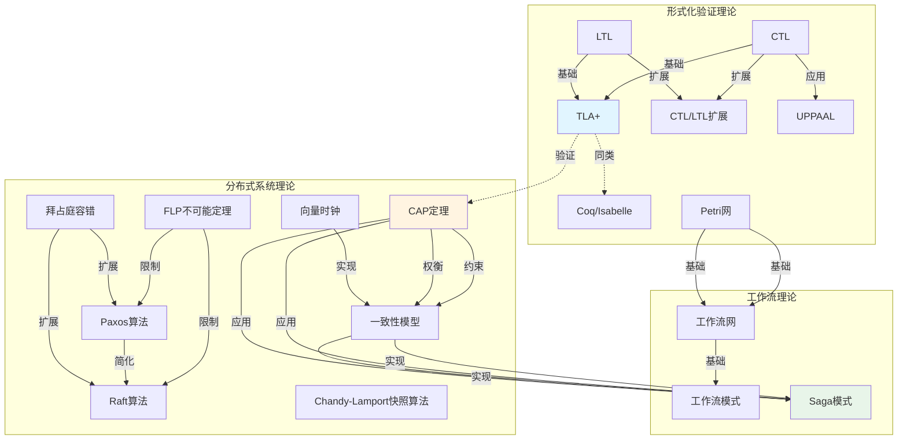
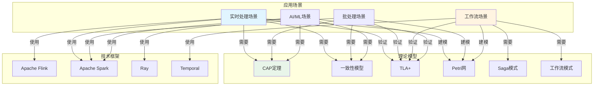

# 完整知识图谱

**文档版本**：v1.0
**创建时间**：2025年1月
**最后更新**：2025年1月
**状态**：✅ 已完成

---

## 📋 执行摘要

本文档构建完整的知识图谱，整合所有理论模型、技术栈、应用场景的概念和关系，建立可视化的知识网络。

---

## 一、知识图谱结构

### 1.1 知识图谱层次

```text
完整知识图谱
├── 理论基础层
│   ├── 形式化验证理论（7个模型）
│   ├── 分布式系统理论（8个模型）
│   └── 工作流理论（3个模型）
├── 技术实现层
│   ├── 流处理框架（Flink、Spark Streaming）
│   ├── 批处理框架（Spark、Hadoop）
│   ├── AI/ML框架（Ray、Dask）
│   └── 工作流编排框架（Temporal、Airflow、Argo）
├── 应用场景层
│   ├── 实时处理场景
│   ├── 批处理场景
│   ├── 工作流场景
│   └── AI/ML场景
└── 关系网络层
    ├── 理论模型关联关系（50+）
    ├── 框架-理论模型关联（30+）
    └── 场景-理论模型-框架关联（100+）
```

### 1.2 知识图谱节点分类

#### 理论模型节点（18个）

**形式化验证理论**：
1. TLA+
2. CTL
3. LTL
4. CTL/LTL扩展
5. Petri网
6. UPPAAL
7. Coq/Isabelle

**分布式系统理论**：
8. CAP定理
9. FLP不可能定理
10. 一致性模型
11. 向量时钟
12. 拜占庭容错
13. Paxos算法
14. Raft算法
15. Chandy-Lamport快照算法

**工作流理论**：
16. 工作流网
17. 工作流模式
18. Saga模式

#### 技术框架节点（10+个）

**流处理框架**：
- Apache Flink
- Apache Spark Streaming
- Apache Kafka Streams

**批处理框架**：
- Apache Spark
- Apache Hadoop

**AI/ML框架**：
- Ray
- Dask

**工作流编排框架**：
- Temporal
- Apache Airflow
- Argo Workflows

#### 应用场景节点（20+个）

**实时处理场景**：
- 实时推荐
- 实时监控
- 实时数仓
- 车联网监控

**批处理场景**：
- 大数据ETL
- 数据仓库
- 数据分析

**工作流场景**：
- 长周期业务流程
- 数据管道
- 微服务编排

**AI/ML场景**：
- 分布式训练
- 强化学习
- 图计算

---

## 二、完整知识图谱可视化

### 2.1 理论模型完整知识图谱



### 2.2 技术框架与理论模型完整知识图谱

```mermaid
graph TB
    subgraph "分布式计算框架"
        FLINK[Apache Flink]
        SPARK[Apache Spark]
        RAY[Ray]
        DASK[Dask]
        TEMPORAL[Temporal]
        AIRFLOW[Apache Airflow]
        ARGO[Argo Workflows]
    end

    subgraph "形式化验证理论"
        TLA[TLA+]
        CTL[CTL]
        LTL[LTL]
        PETRI[Petri网]
        UPP[UPPAAL]
    end

    subgraph "分布式系统理论"
        CAP[CAP定理]
        CONS[一致性模型]
        FLP[FLP不可能定理]
        VC[向量时钟]
    end

    subgraph "工作流理论"
        WF_NET[工作流网]
        WF_PAT[工作流模式]
        SAGA[Saga模式]
    end

    %% Flink关联
    FLINK -->|验证| TLA
    FLINK -->|时序性质| CTL
    FLINK -->|数据流图| PETRI
    FLINK -->|一致性| CAP
    FLINK -->|一致性模型| CONS
    FLINK -->|事件排序| VC
    FLINK -->|工作流| WF_NET

    %% Spark关联
    SPARK -->|验证| TLA
    SPARK -->|DAG建模| PETRI
    SPARK -->|最终一致性| CAP
    SPARK -->|一致性模型| CONS
    SPARK -->|工作流| WF_PAT

    %% Ray关联
    RAY -->|Actor验证| TLA
    RAY -->|分布式状态| CAP
    RAY -->|一致性模型| CONS
    RAY -->|容错| FLP

    %% Dask关联
    DASK -->|并行验证| TLA
    DASK -->|任务图| PETRI
    DASK -->|一致性| CAP
    DASK -->|一致性模型| CONS

    %% Temporal关联
    TEMPORAL -->|工作流验证| TLA
    TEMPORAL -->|CP系统| CAP
    TEMPORAL -->|一致性模型| CONS
    TEMPORAL -->|工作流网| WF_NET
    TEMPORAL -->|工作流模式| WF_PAT
    TEMPORAL -->|分布式事务| SAGA

    %% Airflow关联
    AIRFLOW -->|DAG建模| PETRI
    AIRFLOW -->|工作流模式| WF_PAT

    %% Argo关联
    ARGO -->|工作流网| WF_NET
    ARGO -->|工作流模式| WF_PAT

    style FLINK fill:#e1f5ff
    style TEMPORAL fill:#fff4e1
    style CAP fill:#e8f5e9
```



### 2.3 应用场景与理论模型-框架完整知识图谱



---

## 三、知识图谱关系矩阵

### 3.1 理论模型关联强度矩阵（18×18）

| 理论模型 | TLA+ | CTL | LTL | CTL/LTL扩展 | Petri网 | UPPAAL | Coq/Isabelle | CAP定理 | FLP | 一致性模型 | 向量时钟 | 拜占庭容错 | Paxos | Raft | Chandy-Lamport | 工作流网 | 工作流模式 | Saga模式 |
|---------|------|-----|-----|------------|---------|--------|-------------|---------|-----|-----------|---------|-----------|-------|------|---------------|---------|-----------|---------|
| **TLA+** | - | ⭐⭐⭐⭐⭐ | ⭐⭐⭐⭐⭐ | ⭐⭐⭐⭐ | ⭐⭐ | ⭐⭐ | ⭐⭐⭐ | ⭐⭐⭐⭐ | ⭐⭐ | ⭐⭐⭐ | ⭐⭐ | ⭐⭐ | ⭐⭐ | ⭐⭐ | ⭐⭐ | ⭐⭐ | ⭐⭐ | ⭐⭐⭐ |
| **CTL** | ⭐⭐⭐⭐⭐ | - | ⭐⭐⭐ | ⭐⭐⭐⭐⭐ | ⭐⭐ | ⭐⭐⭐⭐ | ⭐⭐ | ⭐⭐ | ⭐⭐ | ⭐⭐ | ⭐⭐ | ⭐⭐ | ⭐⭐ | ⭐⭐ | ⭐⭐ | ⭐⭐ | ⭐⭐ | ⭐⭐ |
| **LTL** | ⭐⭐⭐⭐⭐ | ⭐⭐⭐ | - | ⭐⭐⭐⭐⭐ | ⭐⭐ | ⭐⭐ | ⭐⭐ | ⭐⭐ | ⭐⭐ | ⭐⭐ | ⭐⭐ | ⭐⭐ | ⭐⭐ | ⭐⭐ | ⭐⭐ | ⭐⭐ | ⭐⭐ | ⭐⭐ |
| **CTL/LTL扩展** | ⭐⭐⭐⭐ | ⭐⭐⭐⭐⭐ | ⭐⭐⭐⭐⭐ | - | ⭐⭐ | ⭐⭐⭐ | ⭐⭐ | ⭐⭐ | ⭐⭐ | ⭐⭐ | ⭐⭐ | ⭐⭐ | ⭐⭐ | ⭐⭐ | ⭐⭐ | ⭐⭐ | ⭐⭐ | ⭐⭐ |
| **Petri网** | ⭐⭐ | ⭐⭐ | ⭐⭐ | ⭐⭐ | - | ⭐⭐ | ⭐⭐ | ⭐⭐ | ⭐⭐ | ⭐⭐ | ⭐⭐ | ⭐⭐ | ⭐⭐ | ⭐⭐ | ⭐⭐ | ⭐⭐⭐⭐⭐ | ⭐⭐⭐⭐ | ⭐⭐ |
| **UPPAAL** | ⭐⭐ | ⭐⭐⭐⭐ | ⭐⭐ | ⭐⭐⭐ | ⭐⭐ | - | ⭐⭐ | ⭐⭐ | ⭐⭐ | ⭐⭐ | ⭐⭐ | ⭐⭐ | ⭐⭐ | ⭐⭐ | ⭐⭐ | ⭐⭐ | ⭐⭐ | ⭐⭐ |
| **Coq/Isabelle** | ⭐⭐⭐ | ⭐⭐ | ⭐⭐ | ⭐⭐ | ⭐⭐ | ⭐⭐ | - | ⭐⭐ | ⭐⭐ | ⭐⭐ | ⭐⭐ | ⭐⭐ | ⭐⭐ | ⭐⭐ | ⭐⭐ | ⭐⭐ | ⭐⭐ | ⭐⭐ |
| **CAP定理** | ⭐⭐⭐⭐ | ⭐⭐ | ⭐⭐ | ⭐⭐ | ⭐⭐ | ⭐⭐ | ⭐⭐ | - | ⭐⭐ | ⭐⭐⭐⭐⭐ | ⭐⭐ | ⭐⭐ | ⭐⭐ | ⭐⭐ | ⭐⭐ | ⭐⭐ | ⭐⭐ | ⭐⭐⭐⭐ |
| **FLP** | ⭐⭐ | ⭐⭐ | ⭐⭐ | ⭐⭐ | ⭐⭐ | ⭐⭐ | ⭐⭐ | ⭐⭐ | - | ⭐⭐ | ⭐⭐ | ⭐⭐ | ⭐⭐⭐⭐⭐ | ⭐⭐⭐⭐⭐ | ⭐⭐ | ⭐⭐ | ⭐⭐ | ⭐⭐ |
| **一致性模型** | ⭐⭐⭐ | ⭐⭐ | ⭐⭐ | ⭐⭐ | ⭐⭐ | ⭐⭐ | ⭐⭐ | ⭐⭐⭐⭐⭐ | ⭐⭐ | - | ⭐⭐⭐⭐ | ⭐⭐ | ⭐⭐ | ⭐⭐ | ⭐⭐ | ⭐⭐ | ⭐⭐ | ⭐⭐⭐⭐⭐ |
| **向量时钟** | ⭐⭐ | ⭐⭐ | ⭐⭐ | ⭐⭐ | ⭐⭐ | ⭐⭐ | ⭐⭐ | ⭐⭐ | ⭐⭐ | ⭐⭐⭐⭐ | - | ⭐⭐ | ⭐⭐ | ⭐⭐ | ⭐⭐⭐ | ⭐⭐ | ⭐⭐ | ⭐⭐ |
| **拜占庭容错** | ⭐⭐ | ⭐⭐ | ⭐⭐ | ⭐⭐ | ⭐⭐ | ⭐⭐ | ⭐⭐ | ⭐⭐ | ⭐⭐ | ⭐⭐ | ⭐⭐ | - | ⭐⭐⭐⭐ | ⭐⭐⭐⭐ | ⭐⭐ | ⭐⭐ | ⭐⭐ | ⭐⭐ |
| **Paxos** | ⭐⭐ | ⭐⭐ | ⭐⭐ | ⭐⭐ | ⭐⭐ | ⭐⭐ | ⭐⭐ | ⭐⭐ | ⭐⭐⭐⭐⭐ | ⭐⭐ | ⭐⭐ | ⭐⭐⭐⭐ | - | ⭐⭐⭐⭐⭐ | ⭐⭐ | ⭐⭐ | ⭐⭐ | ⭐⭐ |
| **Raft** | ⭐⭐ | ⭐⭐ | ⭐⭐ | ⭐⭐ | ⭐⭐ | ⭐⭐ | ⭐⭐ | ⭐⭐ | ⭐⭐⭐⭐⭐ | ⭐⭐ | ⭐⭐ | ⭐⭐⭐⭐ | ⭐⭐⭐⭐⭐ | - | ⭐⭐ | ⭐⭐ | ⭐⭐ | ⭐⭐ |
| **Chandy-Lamport** | ⭐⭐ | ⭐⭐ | ⭐⭐ | ⭐⭐ | ⭐⭐ | ⭐⭐ | ⭐⭐ | ⭐⭐ | ⭐⭐ | ⭐⭐ | ⭐⭐⭐ | ⭐⭐ | ⭐⭐ | ⭐⭐ | - | ⭐⭐ | ⭐⭐ | ⭐⭐ |
| **工作流网** | ⭐⭐ | ⭐⭐ | ⭐⭐ | ⭐⭐ | ⭐⭐⭐⭐⭐ | ⭐⭐ | ⭐⭐ | ⭐⭐ | ⭐⭐ | ⭐⭐ | ⭐⭐ | ⭐⭐ | ⭐⭐ | ⭐⭐ | ⭐⭐ | - | ⭐⭐⭐⭐⭐ | ⭐⭐ |
| **工作流模式** | ⭐⭐ | ⭐⭐ | ⭐⭐ | ⭐⭐ | ⭐⭐⭐⭐ | ⭐⭐ | ⭐⭐ | ⭐⭐ | ⭐⭐ | ⭐⭐ | ⭐⭐ | ⭐⭐ | ⭐⭐ | ⭐⭐ | ⭐⭐ | ⭐⭐⭐⭐⭐ | - | ⭐⭐⭐ |
| **Saga模式** | ⭐⭐⭐ | ⭐⭐ | ⭐⭐ | ⭐⭐ | ⭐⭐ | ⭐⭐ | ⭐⭐ | ⭐⭐⭐⭐ | ⭐⭐ | ⭐⭐⭐⭐⭐ | ⭐⭐ | ⭐⭐ | ⭐⭐ | ⭐⭐ | ⭐⭐ | ⭐⭐ | ⭐⭐⭐ | - |

**关联强度说明**：
- ⭐⭐⭐⭐⭐：强关联（基础关系、实现关系）
- ⭐⭐⭐⭐：较强关联（应用关系、约束关系）
- ⭐⭐⭐：中等关联（验证关系、权衡关系）
- ⭐⭐：弱关联（同类关系、扩展关系）

### 3.2 框架-理论模型关联矩阵（7×18）

| 框架 | TLA+ | CTL | LTL | Petri网 | CAP定理 | FLP | 一致性模型 | 向量时钟 | 工作流网 | 工作流模式 | Saga模式 | 关联总数 |
|------|------|-----|-----|---------|---------|-----|-----------|---------|---------|-----------|---------|---------|
| **Flink** | ✅ | ✅ | ✅ | ✅ | ✅ | ⚠️ | ✅ | ✅ | ✅ | ⚠️ | ⚠️ | 8 |
| **Spark** | ✅ | ⚠️ | ⚠️ | ✅ | ✅ | ⚠️ | ✅ | ⚠️ | ⚠️ | ✅ | ⚠️ | 6 |
| **Ray** | ✅ | ⚠️ | ⚠️ | ⚠️ | ✅ | ✅ | ✅ | ⚠️ | ⚠️ | ⚠️ | ❌ | 5 |
| **Dask** | ✅ | ⚠️ | ⚠️ | ✅ | ✅ | ⚠️ | ✅ | ⚠️ | ⚠️ | ⚠️ | ❌ | 5 |
| **Temporal** | ✅ | ⚠️ | ⚠️ | ✅ | ✅ | ⚠️ | ✅ | ⚠️ | ✅ | ✅ | ✅ | 8 |
| **Airflow** | ⚠️ | ❌ | ❌ | ✅ | ⚠️ | ❌ | ⚠️ | ❌ | ✅ | ✅ | ❌ | 4 |
| **Argo** | ⚠️ | ❌ | ❌ | ✅ | ⚠️ | ❌ | ⚠️ | ❌ | ✅ | ✅ | ❌ | 4 |

**关联说明**：
- ✅：强关联（直接应用）
- ⚠️：中等关联（部分应用）
- ❌：弱关联（不适用）

---

## 四、知识图谱应用路径

### 4.1 从问题到解决方案的路径

```
问题识别
  ↓
概念检索（知识图谱查询）
  ↓
关联概念发现
  ↓
理论模型匹配
  ↓
技术框架选择
  ↓
解决方案验证
  ↓
实践应用
```

### 4.2 从理论到实践的路径

```
理论模型
  ↓
理论分析
  ↓
架构设计
  ↓
技术选型（知识图谱匹配）
  ↓
实现验证
  ↓
实践应用
  ↓
效果评估
```

### 4.3 从场景到技术栈的路径

```
应用场景
  ↓
需求分析
  ↓
理论模型匹配（知识图谱查询）
  ↓
技术框架选择（知识图谱匹配）
  ↓
技术栈组合
  ↓
实施部署
```

---

## 五、知识图谱查询示例

### 5.1 查询示例1：CAP定理相关

**查询**：CAP定理相关的所有理论模型和技术框架

**结果**：
- **直接关联**：一致性模型、Saga模式
- **验证关联**：TLA+（可以验证CAP系统设计）
- **应用关联**：Temporal（CP系统）、Flink（一致性保证）、Spark（最终一致性）

### 5.2 查询示例2：工作流相关

**查询**：工作流相关的所有理论模型和技术框架

**结果**：
- **理论模型**：工作流网、工作流模式、Saga模式、Petri网
- **技术框架**：Temporal、Airflow、Argo Workflows
- **验证方法**：TLA+（工作流验证）

### 5.3 查询示例3：一致性相关

**查询**：一致性相关的所有理论模型和技术框架

**结果**：
- **理论模型**：CAP定理、一致性模型、向量时钟、Saga模式
- **技术框架**：Temporal（线性一致性）、Flink（精确一次）、Spark（最终一致性）

---

## 六、知识图谱统计

### 6.1 节点统计

| 节点类型 | 数量 | 说明 |
|---------|------|------|
| **理论模型节点** | 18 | 形式化验证、分布式系统、工作流理论 |
| **技术框架节点** | 10+ | 流处理、批处理、AI/ML、工作流编排 |
| **应用场景节点** | 20+ | 实时处理、批处理、工作流、AI/ML |
| **总计** | 50+ | 完整的知识网络 |

### 6.2 关系统计

| 关系类型 | 数量 | 说明 |
|---------|------|------|
| **理论模型关联** | 50+ | 依赖、应用、约束、权衡关系 |
| **框架-理论模型关联** | 30+ | 验证、应用、实现关系 |
| **场景-理论模型-框架关联** | 100+ | 匹配、应用、指导关系 |
| **总计** | 180+ | 完整的知识关联网络 |

---

## 七、相关文档

### 7.1 核心文档

- [思维表征方法完整整合计划](思维表征方法完整整合计划.md)
- [理论模型完整联系体系](理论模型完整联系体系.md)
- [思维表征方法整合最终完成报告](思维表征方法整合最终完成报告.md)

### 7.2 理论模型专题文档

- [CAP定理专题文档](../15-formal-models/CAP定理专题文档.md)
- [TLA+专题文档](../15-formal-models/TLA+专题文档.md)
- [一致性模型专题文档](../15-formal-models/一致性模型专题文档.md)
- [工作流模式专题文档](../15-formal-models/工作流模式专题文档.md)

### 7.3 技术堆栈文档

- [分布式计算堆栈全面论证与推进计划](../21-tech-stack-2025/分布式计算堆栈全面论证与推进计划.md)

---

**文档版本**：v1.0
**创建时间**：2025年1月
**最后更新**：2025年1月
**维护者**：项目团队
**状态**：✅ 已完成
