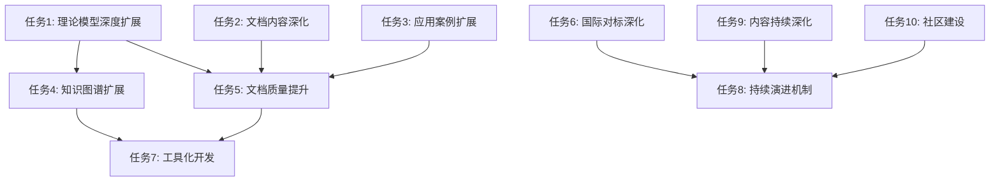

# 下一阶段任务清单与排序

**文档版本**：v1.0
**创建时间**：2025年1月
**最后更新**：2025年1月
**状态**：✅ **任务清单已梳理完成，已排序**

---

## 📋 执行摘要

在完成全项目思维表征方法全面整合（13/13任务，21个文档，125+个思维表征图表）后，项目进入下一阶段。本文档梳理了所有下一阶段的任务，并按照优先级、重要性、依赖关系进行了排序。

**核心成果**：
- ✅ 任务清单已完整梳理
- ✅ 任务已按优先级排序
- ✅ 任务依赖关系已明确
- ✅ 时间表已制定

---

## 🎯 任务分类与优先级

### 总体优先级分类

| 优先级 | 说明 | 时间范围 | 状态 |
|--------|------|---------|------|
| **P0** | 必须完成，核心任务 | 1-3个月 | 🔄 待开始 |
| **P1** | 重要任务，高价值 | 3-6个月 | 🔄 待开始 |
| **P2** | 可选任务，增强功能 | 6-12个月 | 🔄 待开始 |
| **P3** | 持续改进，长期任务 | 持续进行 | 🔄 待开始 |

---

## 📊 任务清单（按优先级排序）

### P0优先级任务（必须完成，1-3个月）

#### 1. 理论模型深度扩展

**任务描述**：为理论模型专题文档补充深度内容，对标Wikipedia、国际著名大学课程、经典著作。

**任务清单**：
- [ ] 1.1 形式化验证理论模型扩展（P0）
  - [ ] TLA+深度扩展（历史背景、核心概念、形式化定义、性质定理、应用场景、工具支持）
  - [ ] CTL/LTL深度扩展
  - [ ] Petri网深度扩展
  - [ ] UPPAAL深度扩展
  - [ ] Coq/Isabelle深度扩展
- [ ] 1.2 分布式系统理论模型扩展（P0）
  - [ ] CAP定理深度扩展
  - [ ] FLP不可能定理深度扩展
  - [ ] 一致性模型深度扩展
  - [ ] 向量时钟深度扩展
  - [ ] 拜占庭容错深度扩展
  - [ ] Paxos算法深度扩展
  - [ ] Raft算法深度扩展
  - [ ] Chandy-Lamport快照算法深度扩展
- [ ] 1.3 工作流理论模型扩展（P0）
  - [ ] 工作流网深度扩展
  - [ ] 工作流模式深度扩展
  - [ ] Saga模式深度扩展
- [ ] 1.4 时序逻辑理论模型扩展（P0）
  - [ ] CTL-LTL扩展专题文档完善

**预计时间**：4-8周
**依赖关系**：无
**优先级**：P0
**状态**：🔄 待开始

#### 2. 文档内容深化与扩展

**任务描述**：为快速开始指南、最佳实践指南、常见问题解答等文档补充深度内容。

**任务清单**：
- [ ] 2.1 快速开始指南扩展
  - [ ] 补充更多示例代码
  - [ ] 补充更多场景说明
  - [ ] 补充更多故障排查指南
- [ ] 2.2 最佳实践指南扩展
  - [ ] 补充更多性能优化案例
  - [ ] 补充更多容错设计案例
  - [ ] 补充更多存储优化案例
- [ ] 2.3 常见问题解答扩展
  - [ ] 补充更多技术选型问题
  - [ ] 补充更多性能优化问题
  - [ ] 补充更多容错可靠性问题

**预计时间**：2-4周
**依赖关系**：无
**优先级**：P0
**状态**：🔄 待开始

#### 3. 应用案例扩展

**任务描述**：为每个主题和子主题补充更多实际应用案例。

**任务清单**：
- [ ] 3.1 企业实践案例扩展
  - [ ] 补充更多金融科技案例（目标：每个场景至少5个案例）
  - [ ] 补充更多零售电商案例
  - [ ] 补充更多共享经济案例
  - [ ] 补充更多流媒体案例
- [ ] 3.2 场景主题分类案例扩展
  - [ ] 补充更多场景主题案例（目标：每个主题至少3个案例）
- [ ] 3.3 理论模型应用案例扩展
  - [ ] 为每个理论模型补充应用案例（目标：每个模型至少3个案例）

**预计时间**：3-6周
**依赖关系**：无
**优先级**：P0
**状态**：🔄 待开始

---

### P1优先级任务（重要任务，3-6个月）

#### 4. 知识图谱扩展与优化

**任务描述**：扩展知识图谱，增加更多节点和关系，优化可视化效果。

**任务清单**：
- [ ] 4.1 知识图谱节点扩展
  - [ ] 增加更多理论模型节点（目标：从19个扩展到30+个）
  - [ ] 增加更多技术框架节点（目标：从10个扩展到20+个）
  - [ ] 增加更多应用场景节点（目标：从15个扩展到30+个）
- [ ] 4.2 知识图谱关系扩展
  - [ ] 增加更多理论模型与技术框架的关系（目标：从50个扩展到100+个）
  - [ ] 增加更多技术框架与应用场景的关系（目标：从30个扩展到60+个）
- [ ] 4.3 知识图谱可视化优化
  - [ ] 优化可视化布局算法
  - [ ] 增加交互功能
  - [ ] 增加搜索功能

**预计时间**：4-8周
**依赖关系**：依赖任务1（理论模型深度扩展）
**优先级**：P1
**状态**：🔄 待开始

#### 5. 文档质量提升

**任务描述**：提升文档的理论深度和实践指导性。

**任务清单**：
- [ ] 5.1 数学公式补充
  - [ ] 为所有理论模型补充完整的数学公式
  - [ ] 为所有算法补充复杂度分析
  - [ ] 为所有性能指标补充计算公式
- [ ] 5.2 代码示例补充
  - [ ] 为所有技术框架补充完整代码示例
  - [ ] 为所有最佳实践补充代码示例
  - [ ] 为所有应用场景补充代码示例
- [ ] 5.3 图表优化
  - [ ] 优化所有思维导图
  - [ ] 优化所有决策树
  - [ ] 优化所有对比矩阵

**预计时间**：6-12周
**依赖关系**：依赖任务1、2
**优先级**：P1
**状态**：🔄 待开始

#### 6. 国际对标深化

**任务描述**：深化国际对标分析，补充更多国际案例和最佳实践。

**任务清单**：
- [ ] 6.1 国际企业案例扩展
  - [ ] 补充更多国际企业实践案例（目标：从20个扩展到50+个）
  - [ ] 补充更多行业报告分析
  - [ ] 补充更多技术趋势分析
- [ ] 6.2 国际标准对标
  - [ ] 对标ISO标准
  - [ ] 对标IEEE标准
  - [ ] 对标NIST标准
- [ ] 6.3 国际学术研究对标
  - [ ] 补充更多学术论文分析
  - [ ] 补充更多研究趋势分析

**预计时间**：4-8周
**依赖关系**：无
**优先级**：P1
**状态**：🔄 待开始

---

### P2优先级任务（可选任务，6-12个月）

#### 7. 工具化开发

**任务描述**：开发知识图谱可视化和推理验证工具。

**任务清单**：
- [ ] 7.1 知识图谱可视化工具开发
  - [ ] 架构设计（已完成）
  - [ ] 前端开发
  - [ ] 后端开发
  - [ ] 数据接口开发
  - [ ] 测试与优化
- [ ] 7.2 推理方法验证工具开发
  - [ ] 架构设计（已完成）
  - [ ] 核心算法实现
  - [ ] 用户界面开发
  - [ ] 测试与优化

**预计时间**：6-12个月
**依赖关系**：依赖任务4（知识图谱扩展）
**优先级**：P2
**状态**：🔄 架构设计已完成，待开发

#### 8. 持续演进机制建立

**任务描述**：建立持续跟踪和更新机制。

**任务清单**：
- [ ] 8.1 新兴技术跟踪机制
  - [ ] 建立技术跟踪清单（已完成）
  - [ ] 建立技术评估框架（已完成）
  - [ ] 建立技术更新流程
- [ ] 8.2 知识图谱持续更新机制
  - [ ] 建立更新机制（已完成）
  - [ ] 建立版本管理流程
  - [ ] 建立质量评估流程
- [ ] 8.3 文档持续更新机制
  - [ ] 建立文档更新流程
  - [ ] 建立文档审查流程
  - [ ] 建立文档发布流程

**预计时间**：3-6个月
**依赖关系**：无
**优先级**：P2
**状态**：🔄 部分完成，待完善

---

### P3优先级任务（持续改进，长期任务）

#### 9. 内容持续深化

**任务描述**：持续补充和完善文档内容深度。

**任务清单**：
- [ ] 9.1 应用案例持续扩展
  - [ ] 每季度补充一批新案例
  - [ ] 每季度更新案例数据
- [ ] 9.2 文档内容持续深化
  - [ ] 每季度补充新内容
  - [ ] 每季度优化现有内容
- [ ] 9.3 思维表征持续优化
  - [ ] 每季度优化思维导图
  - [ ] 每季度优化决策树
  - [ ] 每季度优化对比矩阵

**预计时间**：持续进行
**依赖关系**：无
**优先级**：P3
**状态**：🔄 持续进行

#### 10. 社区建设与推广

**任务描述**：建立社区，推广项目。

**任务清单**：
- [ ] 10.1 社区建设
  - [ ] 建立GitHub社区
  - [ ] 建立讨论论坛
  - [ ] 建立贡献指南
- [ ] 10.2 项目推广
  - [ ] 撰写技术博客
  - [ ] 参加技术会议
  - [ ] 发布技术文章

**预计时间**：持续进行
**依赖关系**：无
**优先级**：P3
**状态**：🔄 待开始

---

## 📅 时间表与里程碑

### 第一阶段：P0优先级任务（1-3个月）

**Week 1-4**：理论模型深度扩展（部分）
- Week 1-2：形式化验证理论模型扩展
- Week 3-4：分布式系统理论模型扩展（部分）

**Week 5-8**：理论模型深度扩展（继续）
- Week 5-6：分布式系统理论模型扩展（继续）
- Week 7-8：工作流理论模型扩展

**Week 9-12**：文档内容深化与扩展 + 应用案例扩展
- Week 9-10：文档内容深化与扩展
- Week 11-12：应用案例扩展

### 第二阶段：P1优先级任务（3-6个月）

**Month 4-5**：知识图谱扩展与优化
- Month 4：知识图谱节点扩展
- Month 5：知识图谱关系扩展 + 可视化优化

**Month 6-7**：文档质量提升
- Month 6：数学公式补充 + 代码示例补充
- Month 7：图表优化

**Month 8-9**：国际对标深化
- Month 8：国际企业案例扩展
- Month 9：国际标准对标 + 国际学术研究对标

### 第三阶段：P2优先级任务（6-12个月）

**Month 10-15**：工具化开发
- Month 10-12：知识图谱可视化工具开发
- Month 13-15：推理方法验证工具开发

**Month 16-18**：持续演进机制建立
- Month 16-17：新兴技术跟踪机制完善
- Month 18：知识图谱持续更新机制完善 + 文档持续更新机制建立

### 第四阶段：P3优先级任务（持续进行）

**持续进行**：
- 内容持续深化
- 社区建设与推广

---

## 🔗 任务依赖关系图

---

## 📊 任务优先级矩阵

| 任务 | 重要性 | 紧急性 | 依赖关系 | 综合评分 | 优先级 |
|------|--------|--------|---------|---------|--------|
| 理论模型深度扩展 | ⭐⭐⭐⭐⭐ | ⭐⭐⭐⭐⭐ | 无 | **9.5** | **P0** |
| 文档内容深化与扩展 | ⭐⭐⭐⭐⭐ | ⭐⭐⭐⭐ | 无 | **9.0** | **P0** |
| 应用案例扩展 | ⭐⭐⭐⭐ | ⭐⭐⭐⭐ | 无 | **8.0** | **P0** |
| 知识图谱扩展与优化 | ⭐⭐⭐⭐ | ⭐⭐⭐ | 依赖任务1 | **7.5** | **P1** |
| 文档质量提升 | ⭐⭐⭐⭐ | ⭐⭐⭐ | 依赖任务1、2 | **7.5** | **P1** |
| 国际对标深化 | ⭐⭐⭐ | ⭐⭐⭐ | 无 | **6.0** | **P1** |
| 工具化开发 | ⭐⭐⭐ | ⭐⭐ | 依赖任务4 | **5.0** | **P2** |
| 持续演进机制建立 | ⭐⭐⭐ | ⭐⭐ | 无 | **5.0** | **P2** |
| 内容持续深化 | ⭐⭐ | ⭐ | 无 | **3.0** | **P3** |
| 社区建设与推广 | ⭐⭐ | ⭐ | 无 | **3.0** | **P3** |

---

## ✅ 验收标准

### P0优先级任务验收标准

- ✅ 所有理论模型专题文档都有完整的深度内容
- ✅ 所有文档都有完整的示例代码和场景说明
- ✅ 所有主题都有足够的应用案例（至少3-5个）

### P1优先级任务验收标准

- ✅ 知识图谱节点数量达到目标（30+理论模型，20+技术框架，30+应用场景）
- ✅ 知识图谱关系数量达到目标（100+理论模型与技术框架关系，60+技术框架与应用场景关系）
- ✅ 所有文档都有完整的数学公式和代码示例

### P2优先级任务验收标准

- ✅ 知识图谱可视化工具可以正常使用
- ✅ 推理方法验证工具可以正常使用
- ✅ 持续演进机制可以正常运行

### P3优先级任务验收标准

- ✅ 每季度都有新内容补充
- ✅ 社区活跃度达到目标
- ✅ 项目推广效果达到目标

---

## 📝 任务执行建议

### 执行原则

1. **优先级原则**：优先执行P0优先级任务
2. **依赖原则**：先执行无依赖的任务，再执行有依赖的任务
3. **并行原则**：可以并行执行无依赖关系的任务
4. **迭代原则**：采用迭代方式，逐步完善

### 执行建议

1. **第一阶段（1-3个月）**：专注于P0优先级任务，确保核心内容完整
2. **第二阶段（3-6个月）**：执行P1优先级任务，提升内容质量
3. **第三阶段（6-12个月）**：执行P2优先级任务，开发工具和建立机制
4. **第四阶段（持续）**：执行P3优先级任务，持续改进

---

## 📚 相关文档

### 核心计划文档

- [理论模型深度扩展计划](../15-formal-models/理论模型深度扩展计划.md) - 理论模型扩展的详细计划
- [后续推进计划与方案](../13-next-steps/后续推进计划与方案.md) - 后续推进的详细计划
- [下一阶段增强计划](../20-future-enhancement/下一阶段增强计划.md) - 下一阶段增强的详细计划
- [P4优先级-工具化开发计划](../20-future-enhancement/P4优先级-工具化开发计划.md) - 工具化开发的详细计划
- [P5优先级-持续演进机制计划](../20-future-enhancement/P5优先级-持续演进机制计划.md) - 持续演进机制的详细计划

### 完成报告文档

- [全项目思维表征方法全面整合-最终完成报告](../22-mind-representation-integration/全项目思维表征方法全面整合-最终完成报告.md) - 上一阶段完成报告

---

**文档版本**：v1.0
**创建时间**：2025年1月
**最后更新**：2025年1月
**维护者**：项目团队
**状态**：✅ **任务清单已梳理完成，已排序**
