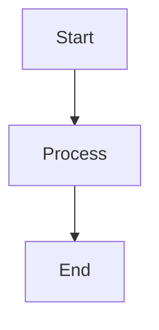

# Document Translation Template

This template provides a standard structure for translating documents from Chinese to English.

## 📋 Template Structure

### Document Header

```markdown
# Document Title (English)

\[English\](en-US/...) | \[中文\](../zh-CN/...) （示例格式，请替换为实际路径）

## Table of Contents

- [Document Title](#document-title)
  - [Section 1](#section-1)
    - [Subsection 1.1](#subsection-11)
  - [Section 2](#section-2)
```

---

## 🔤 Translation Guidelines

### 1. Title Translation

**Guidelines**:

- Translate titles accurately
- Maintain the same structure as the original
- Use proper capitalization

**Example**:

- Chinese: `快速开始指南`
- English: `Quick Start Guide`

---

### 2. Terminology Translation

**Guidelines**:

- Use terms from the terminology glossary
- First occurrence: English term (Chinese term)
- Subsequent use: English term only
- Maintain consistency throughout the document

**Example**:

- First: `Workflow（工作流）`
- Subsequent: `Workflow`

---

### 3. Code Blocks

**Guidelines**:

- Keep code unchanged
- Translate comments if necessary
- Maintain code formatting

**Example**:

```python
# Create a workflow
@workflow.defn
class MyWorkflow:
    @workflow.run
    async def execute(self, input_data: str) -> str:
        return f"Processed: {input_data}"
```

---

### 4. Mathematical Formulas

**Guidelines**:

- Keep LaTeX formulas unchanged
- Translate formula descriptions
- Maintain formula formatting

**Example**:

```markdown
The formula for calculating throughput:

$$ \text{Throughput} = \frac{\text{Workflows}}{\text{Time}} $$
```

---

### 5. Tables

**Guidelines**:

- Translate table headers
- Translate table content
- Maintain table structure

**Example**:

| Framework | Performance | Cost |
|-----------|-------------|------|
| Temporal | High | Low |
| Airflow | Medium | Medium |

---

### 6. Links

**Guidelines**:

- Update internal links to English paths
- Maintain link structure
- Test link validity

**Example**:

- Chinese: `\[快速开始指南\](../09-quickstart/快速开始指南.md)` （示例格式）
- English: `\[Quick Start Guide\](../09-quickstart/quick-start-guide.md)` （示例格式：此文件可能尚未创建）

---

### 7. Diagrams

**Guidelines**:

- Translate diagram titles
- Translate diagram content
- Maintain diagram structure

**Example**:



---

## 📋 Translation Checklist

### Content Translation

- [ ] All text translated accurately
- [ ] Technical terms consistent with glossary
- [ ] Code examples unchanged
- [ ] Formulas unchanged
- [ ] Tables translated
- [ ] Links updated

### Language Quality

- [ ] Grammar correct
- [ ] Spelling correct
- [ ] Style consistent
- [ ] Tone appropriate
- [ ] Readability good

### Format Consistency

- [ ] Markdown format correct
- [ ] Headings consistent
- [ ] Lists formatted correctly
- [ ] Code blocks formatted correctly
- [ ] Tables formatted correctly

---

## 🔍 Quality Assurance

### Technical Review

- [ ] Technical content accurate
- [ ] Code examples correct
- [ ] Formulas correct
- [ ] Links valid

### Language Review

- [ ] Language fluent
- [ ] Grammar correct
- [ ] Terminology consistent
- [ ] Style appropriate

### Format Review

- [ ] Format consistent
- [ ] Structure correct
- [ ] Navigation working
- [ ] Display correct

---

**Template Version**: v15.0

**Created**: 2024

**Maintainer**: Project Team
