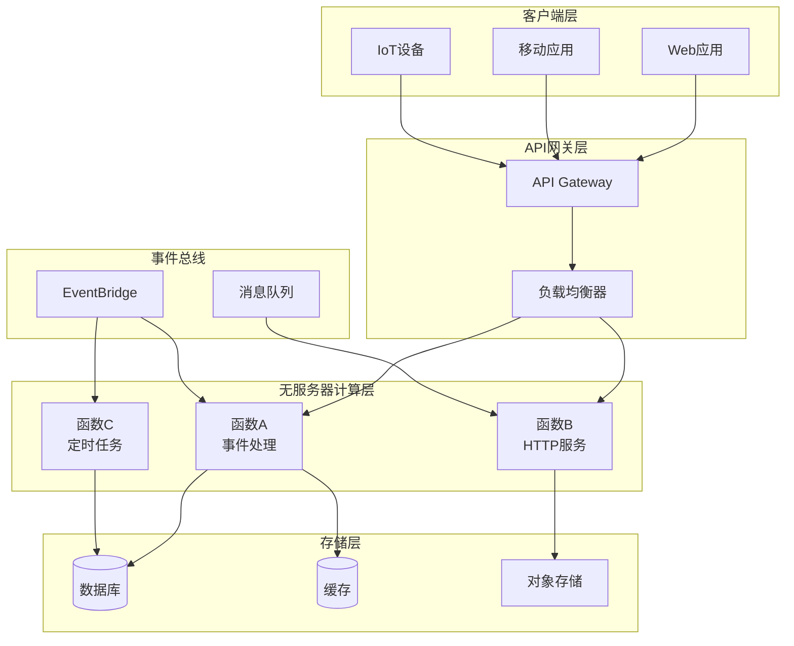
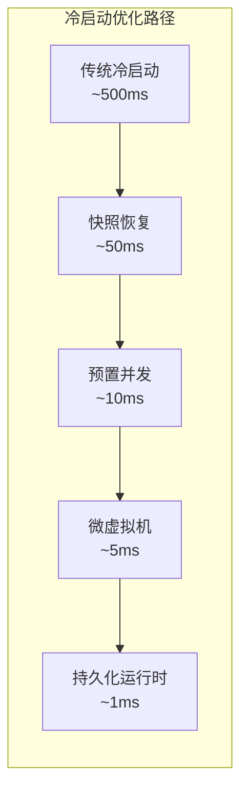
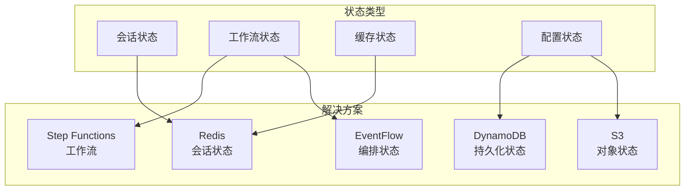

# Serverless 分布式系统（2024-2025）

## 概述

Serverless架构已成为现代分布式系统的主流范式，通过完全抽象基础设施层，使开发者专注于业务逻辑。2024-2025年，Serverless技术在企业级应用、AI推理、实时数据处理等领域实现重大突破，冷启动延迟降至毫秒级，状态管理能力显著增强。

---

## 1. FaaS 架构模式演进

### 1.1 典型架构



### 1.2 架构模式对比

| 模式 | 适用场景 | 代表服务 | 特点 |
|------|----------|----------|------|
| **纯FaaS** | 事件驱动、短任务 | AWS Lambda | 极致弹性，按调用计费 |
| **容器化Serverless** | 长时间运行、自定义运行时 | AWS Fargate, Cloud Run | 灵活度高，支持长连接 |
| **边缘Serverless** | 低延迟全球分发 | Cloudflare Workers, Vercel Edge | 全球边缘节点部署 |

---

## 2. 冷启动优化技术

### 2.1 冷启动时间演进（2024-2025）



### 2.2 2024-2025最新优化方案

#### Firecracker MicroVM 快照技术

```yaml
# AWS Lambda 预置并发配置
ProvisionedConcurrencyConfig:
  ProvisionedConcurrentExecutions: 100
  AutoScalingPolicy:
    TargetTrackingScalingPolicyConfiguration:
      TargetValue: 70.0
      PredefinedMetricSpecification:
        PredefinedMetricType: LambdaProvisionedConcurrencyUtilization
```

#### 运行时缓存策略

```python
# 全局初始化 - 冷启动只执行一次
import boto3
import redis

# 连接池在容器复用时保持
_dynamodb = None
_redis_client = None

def get_dynamodb():
    global _dynamodb
    if _dynamodb is None:
        _dynamodb = boto3.resource('dynamodb')
    return _dynamodb

def get_redis():
    global _redis_client
    if _redis_client is None:
        _redis_client = redis.Redis(
            host=os.environ['REDIS_HOST'],
            connection_pool_kwargs={'max_connections': 10}
        )
    return _redis_client

def lambda_handler(event, context):
    # 热路径 - 直接使用缓存的连接
    db = get_dynamodb()
    cache = get_redis()
    # 业务逻辑...
```

### 2.3 各平台冷启动性能对比

| 平台 | 冷启动时间 | 优化技术 | 2024新特性 |
|------|------------|----------|------------|
| AWS Lambda | 50-200ms | Firecracker + SnapStart | Java 21 优化 |
| Azure Functions | 100-300ms | Proxies + Premium Plan | .NET 8 AOT |
| Cloudflare Workers | <1ms | V8 Isolates | 无冷启动 |
| Google Cloud Run | 200-500ms | 容器预热 | 始终分配CPU |

---

## 3. 状态管理挑战与解决方案

### 3.1 Serverless状态管理架构



### 3.2 Durable Functions / Step Functions 工作流

```yaml
# AWS Step Functions - 分布式事务编排
AWSTemplateFormatVersion: '2010-09-09'
Resources:
  OrderProcessingWorkflow:
    Type: AWS::StepFunctions::StateMachine
    Properties:
      StateMachineName: OrderProcessing
      Definition:
        Comment: "订单处理工作流"
        StartAt: ValidateOrder
        States:
          ValidateOrder:
            Type: Task
            Resource: !GetAtt ValidateOrderFunction.Arn
            Next: CheckInventory
            Catch:
              - ErrorEquals: ["OrderValidationError"]
                Next: OrderFailed

          CheckInventory:
            Type: Task
            Resource: !GetAtt InventoryFunction.Arn
            Next: ProcessPayment
            Retry:
              - ErrorEquals: ["InventoryServiceException"]
                IntervalSeconds: 2
                MaxAttempts: 3

          ProcessPayment:
            Type: Task
            Resource: !GetAtt PaymentFunction.Arn
            Next: ShipOrder
            Catch:
              - ErrorEquals: ["PaymentFailed"]
                Next: ReleaseInventory

          ReleaseInventory:
            Type: Task
            Resource: !GetAtt ReleaseInventoryFunction.Arn
            Next: OrderFailed

          ShipOrder:
            Type: Task
            Resource: !GetAtt ShippingFunction.Arn
            End: true

          OrderFailed:
            Type: Task
            Resource: !GetAtt NotifyFailureFunction.Arn
            End: true
```

### 3.3 分布式会话管理

```typescript
// Cloudflare Workers KV 边缘状态管理
export interface Env {
  SESSION_KV: KVNamespace;
}

export default {
  async fetch(request: Request, env: Env): Promise<Response> {
    const sessionId = request.headers.get('Session-ID');

    // 从边缘KV读取会话状态
    let session = await env.SESSION_KV.get(sessionId, 'json');

    if (!session) {
      session = { created: Date.now(), data: {} };
    }

    // 更新会话
    session.lastAccess = Date.now();
    session.data.counter = (session.data.counter || 0) + 1;

    // 写入边缘KV（全球同步）
    await env.SESSION_KV.put(sessionId, JSON.stringify(session), {
      expirationTtl: 3600 // 1小时过期
    });

    return new Response(JSON.stringify(session), {
      headers: { 'Content-Type': 'application/json' }
    });
  }
};
```

---

## 4. 主流平台深度对比

### 4.1 功能特性矩阵

```mermaid
flowchart LR
    subgraph AWS["AWS Lambda"]
        A1[与200+服务集成]
        A2[Firecracker隔离]
        A3[Provisioned Concurrency]
        A4[Lambda Extensions]
    end

    subgraph Azure["Azure Functions"]
        B1[与Azure生态深度集成]
        B2[Durable Functions]
        B3[Premium Plan持久连接]
        B4[OpenAPI自动生成]
    end

    subgraph CF["Cloudflare Workers"]
        C1[V8 Isolates<br/>无冷启动]
        C2[全球310+节点]
        C3[边缘存储KV/D1/R2]
        C4[AI推理@Edge]
    end
```

### 4.2 2024-2025最新特性对比

| 特性 | AWS Lambda | Azure Functions | Cloudflare Workers |
|------|------------|-----------------|-------------------|
| **运行时支持** | Python 3.12, Node 20, Java 21, .NET 8 | .NET 8, Node 20, Python 3.11, Java 21 | 仅支持JS/TS/Rust/C++/Python (Wasm) |
| **最大执行时间** | 15分钟 | 无限（Premium） | 30s（HTTP）/15min（Cron） |
| **内存配置** | 128MB-10GB | 128MB-14GB | 128MB-1GB |
| **并发限制** | 1000（可提升） | 无限制 | 无限制 |
| **VPC网络** | 完整支持 | 完整支持 | 不支持 |
| **冷启动** | 50-200ms | 100-300ms | <1ms |
| **边缘部署** | Lambda@Edge | 不支持 | 原生支持 |
| **AI/ML推理** | Lambda + SageMaker | Functions + ML.NET | Workers AI原生支持 |

### 4.3 部署配置示例

#### Terraform 多云Serverless部署

```hcl
# AWS Lambda 部署
resource "aws_lambda_function" "api_handler" {
  function_name = "distributed-api-handler"
  runtime       = "provided.al2023"
  handler       = "bootstrap"

  filename         = "function.zip"
  source_code_hash = filebase64sha256("function.zip")

  memory_size = 512
  timeout     = 30

  environment {
    variables = {
      TABLE_NAME = aws_dynamodb_table.main.name
      REDIS_URL  = aws_elasticache_cluster.redis.cache_nodes[0].address
    }
  }

  provisioned_concurrent_executions = 50

  vpc_config {
    subnet_ids         = aws_subnet.private[*].id
    security_group_ids = [aws_security_group.lambda.id]
  }
}

# Azure Function 部署
resource "azurerm_linux_function_app" "main" {
  name                = "distributed-functions"
  resource_group_name = azurerm_resource_group.main.name
  location            = azurerm_resource_group.main.location
  service_plan_id     = azurerm_service_plan.premium.id

  storage_account_name       = azurerm_storage_account.main.name
  storage_account_access_key = azurerm_storage_account.main.primary_access_key

  site_config {
    application_stack {
      node_version = "20"
    }
    pre_warmed_instance_count = 2
    elastic_instance_minimum  = 2
  }

  app_settings = {
    FUNCTIONS_WORKER_RUNTIME = "node"
    WEBSITE_RUN_FROM_PACKAGE = "1"
  }
}
```

---

## 5. 2024-2025技术趋势

### 5.1 AI原生Serverless

大语言模型与Serverless深度融合，实现按需AI推理：

- **AWS Lambda + Bedrock**: 托管大模型调用，按token计费
- **Cloudflare Workers AI**: 边缘节点内置Llama 3、Mistral等模型
- **Azure Functions + OpenAI**: 与Azure OpenAI服务深度集成

### 5.2 容器化Serverless融合

Kubernetes与Serverless边界模糊：

- **AWS App Runner**: 容器化应用的Serverless体验
- **Azure Container Apps**: KEDA驱动的事件驱动容器
- **Google Cloud Run**: Knative开源标准的商业化实现

### 5.3 WebAssembly边缘计算

```rust
// Rust编译为Wasm在边缘运行
#[event(fetch)]
pub async fn main(req: Request, env: Env, _ctx: worker::Context) -> Result<Response> {
    let url = req.url()?;

    // 边缘KV读取
    let cache = env.kv("CACHE")?;
    if let Ok(Some(cached)) = cache.get(&url.to_string()).text().await {
        return Response::ok(cached);
    }

    // 边缘计算逻辑
    let result = compute_intensive_task().await;

    // 缓存结果
    cache.put(&url.to_string(), result.clone())?
        .expiration_ttl(300)
        .execute()
        .await?;

    Response::ok(result)
}
```

---

## 6. 最佳实践建议

1. **函数粒度设计**: 单一职责，避免函数过大或过小
2. **连接池管理**: 利用全局变量缓存数据库连接
3. **异步事件驱动**: 优先使用消息队列解耦
4. **监控可观测性**: 集成X-Ray/Datadog/分布式追踪
5. **安全最小权限**: 遵循IAM最小权限原则

---

## 参考资源

- [AWS Lambda 2024新特性](https://aws.amazon.com/lambda/whats-new/)
- [Azure Functions Premium Plan](https://docs.microsoft.com/azure/azure-functions/functions-premium-plan)
- [Cloudflare Workers AI](https://developers.cloudflare.com/workers-ai/)
- [Knative Serverless标准](https://knative.dev/)
