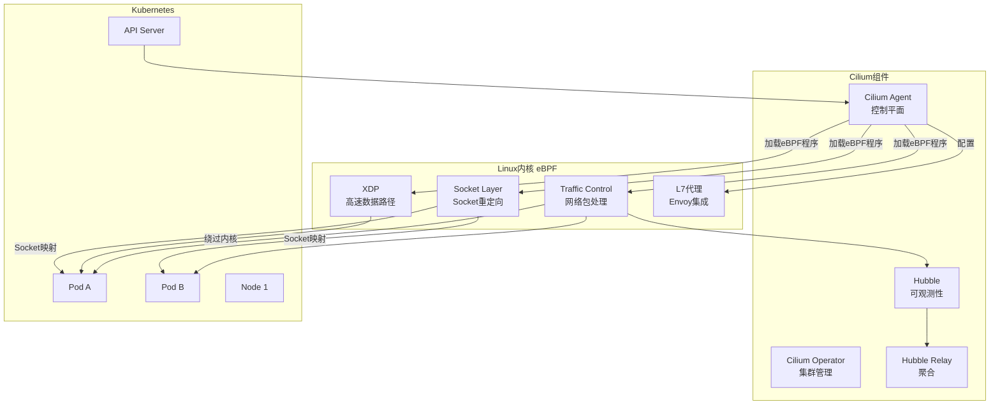
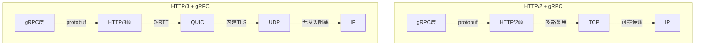

# 云原生网络服务（2024-2025）

## 概述

云原生网络正在经历从传统iptables/ipvs到eBPF的深度变革。2024-2025年，Cilium成为Kubernetes网络的事实标准，Service Mesh从Sidecar模式向Ambient架构演进，gRPC与HTTP/3重塑服务通信协议栈。eBPF技术将网络、安全、可观测性统一到内核层，实现零侵入的高性能网络服务。

---

## 1. Cilium eBPF 网络架构

### 1.1 整体架构



### 1.2 eBPF数据路径

```mermaid
flowchart LR
    subgraph Traditional["传统数据路径<br/>iptables"]
        T1[网卡] --> T2[内核网络栈<br/>多次上下文切换]
        T2 --> T3[iptables规则遍历<br/>O(n)]
        T3 --> T4[Socket]
        T4 --> T5[应用]
    end

    subgraph EBPF["eBPF数据路径"]
        E1[网卡] --> E2[XDP<br/>内核外直接处理]
        E2 --> E3[eBPF程序<br/>O(1)哈希查找]
        E3 --> E4[Socket重定向<br/>绕过TCP栈]
        E4 --> E5[应用]
    end

    style Traditional fill:#ffcccc
    style EBPF fill:#ccffcc
```

### 1.3 Cilium部署配置

```yaml
# cilium-values.yaml - Helm部署配置
# Cilium 1.15+ 版本配置

cluster:
  name: production-cluster
  id: 1

# 数据路径模式
bpf:
  # 启用eBPF主机路由
  hostRouting: true
  # 加速Service处理
  masquerade: true

# 负载均衡配置
loadBalancer:
  # eBPF负载均衡模式
  mode: dsr          # 选项: snat, dsr, hybrid
  # 算法: random, maglev
  algorithm: maglev

# Service Mesh配置
serviceMesh:
  # 启用L7代理
  enabled: true
  # Sidecarless模式
  sidecarlessProxy:
    enabled: true
    port: 8080

# 安全策略
policyEnforcementMode: default  # default, always, never

# Hubble可观测性
hubble:
  enabled: true
  relay:
    enabled: true
  ui:
    enabled: true
    # Hubble UI Ingress
    ingress:
      enabled: true
      hosts:
        - hubble.example.com
  # 流量监控
  metrics:
    enabled:
      - dns:query
      - drop
      - tcp
      - flow
      - icmp
      - http

# 集群网格（多集群）
clustermesh:
  useAPIServer: true
  apiserver:
    service:
      type: LoadBalancer
  # 跨集群Service发现
  globalServices:
    enabled: true

# 带宽管理
bandwidthManager:
  enabled: true

# 本地重定向策略
localRedirectPolicy: true

# IPAM配置
ipam:
  mode: cluster-pool
  operator:
    clusterPoolIPv4PodCIDR: 10.0.0.0/8
    clusterPoolIPv4MaskSize: 24
```

### 1.4 eBPF网络策略示例

```yaml
# cilium-network-policy.yaml
# CiliumNetworkPolicy 替代传统NetworkPolicy

# 1. 基础L3/L4策略
apiVersion: cilium.io/v2
kind: CiliumNetworkPolicy
metadata:
  name: backend-policy
  namespace: production
spec:
  endpointSelector:
    matchLabels:
      app: backend
  ingress:
  - fromEndpoints:
    - matchLabels:
        app: frontend
    toPorts:
    - ports:
      - port: "8080"
        protocol: TCP
      rules:
        http:
        - method: GET
          path: "/api/.*"
        - method: POST
          path: "/api/data"
  egress:
  - toEndpoints:
    - matchLabels:
        k8s:io.kubernetes.pod.namespace: kube-system
        k8s:k8s-app: kube-dns
    toPorts:
    - ports:
      - port: "53"
        protocol: UDP
      rules:
        dns:
        - matchPattern: "*.internal.example.com"

  - toFQDNs:
    - matchName: "api.stripe.com"
    toPorts:
    - ports:
      - port: "443"
        protocol: TCP

---
# 2. L7应用层策略
apiVersion: cilium.io/v2
kind: CiliumNetworkPolicy
metadata:
  name: rate-limit-policy
spec:
  endpointSelector:
    matchLabels:
      app: api-gateway
  ingress:
  - fromEndpoints:
    - matchLabels:
        io.kubernetes.pod.namespace: default
    toPorts:
    - ports:
      - port: "80"
        protocol: TCP
      rules:
        http:
        - headers:
          - name: X-RateLimit
            value: "100/min"
        - method: "^(GET|POST)$"

---
# 3. 集群间策略（Cluster Mesh）
apiVersion: cilium.io/v2
kind: CiliumClusterwideNetworkPolicy
metadata:
  name: multi-cluster-policy
spec:
  endpointSelector:
    matchLabels:
      app: global-service
  ingress:
  - fromEndpoints:
    - matchLabels:
        io.cilium.k8s.policy.cluster: cluster-b
        app: trusted-client
```

---

## 2. Service Mesh 演进

### 2.1 架构演进对比

```mermaid
flowchart TB
    subgraph Sidecar["Sidecar模式<br/>传统Istio"]
        S1[App Pod]
        S1 -->|localhost| S2[Envoy Sidecar]
        S2 -->|mTLS| S3[Envoy Sidecar]
        S3 -->|localhost| S4[App Pod]

        Note1[资源开销: 2x<br/>延迟: +3-5ms]
    end

    subgraph Ambient["Ambient模式<br/>Istio 1.18+"]
        A1[App Pod]
        A2[zTunnel<br/>L4节点代理]
        A3[Waypoint Proxy<br/>L7按需]
        A4[zTunnel]
        A5[App Pod]

        A1 -.->|无Sidecar| A2
        A2 -->|mTLS| A4
        A4 -.->|无Sidecar| A5
        A2 -.->|L7需要时| A3
        A3 -.-> A4

        Note2[资源开销: 1x<br/>延迟: +0.5ms]
    end

    subgraph Sidecarless["Sidecarless<br/>Cilium"]
        C1[App Pod]
        C2[内核eBPF<br/>L3/L4处理]
        C3[Envoy DaemonSet<br/>L7按需]
        C4[内核eBPF]
        C5[App Pod]

        C1 --> C2
        C2 --> C4
        C4 --> C5
        C2 -.->|L7需要时| C3
        C3 -.-> C4

        Note3[资源开销: 1x<br/>延迟: +0.1ms]
    end
```



### 2.2 Istio Ambient Mesh 部署

```yaml
# istio-ambient-profile.yaml
apiVersion: install.istio.io/v1alpha1
kind: IstioOperator
spec:
  profile: ambient

  meshConfig:
    defaultConfig:
      proxyMetadata:
        ISTIO_META_DNS_CAPTURE: "true"

    # 启用Waypoint代理
    ambient:
      enabled: true

  components:
    pilot:
      k8s:
        resources:
          requests:
            cpu: 2000m
            memory: 4Gi

    # zTunnel配置
    ztunnel:
      k8s:
        resources:
          requests:
            cpu: 500m
            memory: 512Mi
        # 使用eBPF加速
        env:
        - name: ISTIO_META_DNS_CAPTURE
          value: "true"

  values:
    global:
      proxy:
        resources:
          requests:
            cpu: 100m
            memory: 128Mi

---
# Waypoint Proxy配置
apiVersion: gateway.networking.k8s.io/v1beta1
kind: Gateway
metadata:
  name: productpage-waypoint
  namespace: bookinfo
  labels:
    istio.io/waypoint-for: service  # 或 all, workload
spec:
  gatewayClassName: istio-waypoint
  listeners:
  - name: mesh
    port: 15008
    protocol: HBONE
---
# 为Service启用Waypoint
apiVersion: v1
kind: Service
metadata:
  name: productpage
  namespace: bookinfo
  labels:
    istio.io/use-waypoint: productpage-waypoint
spec:
  ports:
  - port: 9080
    name: http
  selector:
    app: productpage
```

### 2.3 Cilium Service Mesh配置

```yaml
# cilium-service-mesh.yaml
apiVersion: cilium.io/v2
kind: CiliumClusterwideEnvoyConfig
metadata:
  name: load-balancing-config
spec:
  services:
    - name: backend-service
      namespace: production
  resources:
    - "@type": type.googleapis.com/envoy.config.listener.v3.Listener
      name: backend-listener
      address:
        socket_address:
          address: 0.0.0.0
          port_value: 8080
      filter_chains:
        - filters:
            - name: envoy.filters.network.http_connection_manager
              typed_config:
                "@type": type.googleapis.com/envoy.extensions.filters.network.http_connection_manager.v3.HttpConnectionManager
                stat_prefix: backend
                codec_type: AUTO
                route_config:
                  name: backend_route
                  virtual_hosts:
                    - name: backend
                      domains: ["*"]
                      routes:
                        - match:
                            prefix: "/"
                          route:
                            cluster: backend_cluster
                            retry_policy:
                              retry_on: gateway-error,connect-failure
                              num_retries: 3
                              per_try_timeout: 5s
                http_filters:
                  - name: envoy.filters.http.router

    - "@type": type.googleapis.com/envoy.config.cluster.v3.Cluster
      name: backend_cluster
      connect_timeout: 5s
      lb_policy: LEAST_REQUEST  # 负载均衡算法
      health_checks:
        - timeout: 5s
          interval: 10s
          unhealthy_threshold: 3
          healthy_threshold: 2
          http_health_check:
            path: /health
      load_assignment:
        cluster_name: backend_cluster
        endpoints:
          - lb_endpoints:
              - endpoint:
                  address:
                    socket_address:
                      address: backend-service
                      port_value: 8080

---
# 流量分割 (金丝雀发布)
apiVersion: cilium.io/v2
kind: CiliumEnvoyConfig
metadata:
  name: canary-routing
  namespace: production
spec:
  services:
    - name: frontend
  resources:
    - "@type": type.googleapis.com/envoy.config.route.v3.RouteConfiguration
      name: canary_route
      virtual_hosts:
        - name: frontend
          domains: ["*"]
          routes:
            - match:
                prefix: "/"
                headers:
                  - name: canary
                    exact_match: "true"
              route:
                weighted_clusters:
                  runtime_key_prefix: routing.canary
                  clusters:
                    - name: frontend-v2
                      weight: 100
                    - name: frontend-v1
                      weight: 0
            - match:
                prefix: "/"
              route:
                weighted_clusters:
                  clusters:
                    - name: frontend-v1
                      weight: 90
                    - name: frontend-v2
                      weight: 10
```

---

## 3. gRPC与HTTP/3现代协议

### 3.1 协议栈对比



### 3.2 gRPC服务部署

```yaml
# grpc-deployment.yaml
apiVersion: apps/v1
kind: Deployment
metadata:
  name: grpc-service
spec:
  replicas: 3
  selector:
    matchLabels:
      app: grpc-service
  template:
    metadata:
      labels:
        app: grpc-service
      annotations:
        # Cilium L7 gRPC解析
        io.cilium/l7-parser: "grpc"
    spec:
      containers:
      - name: server
        image: example/grpc-service:v2.0
        ports:
        - containerPort: 50051
          name: grpc
          protocol: TCP
        resources:
          requests:
            memory: "256Mi"
            cpu: "250m"
          limits:
            memory: "512Mi"
            cpu: "500m"
        # gRPC健康检查
        livenessProbe:
          grpc:
            port: 50051
            service: ""
          initialDelaySeconds: 10
          periodSeconds: 15
        readinessProbe:
          grpc:
            port: 50051
            service: ""
          initialDelaySeconds: 5
          periodSeconds: 10
---
# gRPC Service与Ingress
apiVersion: v1
kind: Service
metadata:
  name: grpc-service
  annotations:
    # Cilium LB配置
    io.cilium/lb-ipam-ips: "10.0.0.50"
spec:
  type: LoadBalancer
  ports:
  - port: 50051
    targetPort: 50051
    name: grpc
  selector:
    app: grpc-service
---
# gRPC Gateway (HTTP/JSON转gRPC)
apiVersion: networking.istio.io/v1beta1
kind: Gateway
metadata:
  name: grpc-gateway
spec:
  selector:
    istio: ingressgateway
  servers:
  - port:
      number: 443
      name: grpc
      protocol: GRPC
    tls:
      mode: SIMPLE
      credentialName: grpc-cert
    hosts:
    - "api.example.com"
---
apiVersion: networking.istio.io/v1beta1
kind: VirtualService
metadata:
  name: grpc-routing
spec:
  hosts:
  - "api.example.com"
  gateways:
  - grpc-gateway
  grpc:
  - match:
    - port: 443
      headers:
        :authority:
          exact: "api.example.com"
    route:
    - destination:
        host: grpc-service
        port:
          number: 50051
      # gRPC重试策略
      retries:
        attempts: 3
        perTryTimeout: 5s
        retryOn: gateway-error,refused-stream,unavailable
```

### 3.3 HTTP/3与QUIC配置

```yaml
# nginx-http3.yaml
apiVersion: apps/v1
kind: Deployment
metadata:
  name: nginx-http3
spec:
  replicas: 2
  selector:
    matchLabels:
      app: nginx-http3
  template:
    metadata:
      labels:
        app: nginx-http3
    spec:
      containers:
      - name: nginx
        image: nginx:alpine
        ports:
        - containerPort: 80
        - containerPort: 443
        - containerPort: 443
          protocol: UDP  # QUIC使用UDP
        volumeMounts:
        - name: config
          mountPath: /etc/nginx/nginx.conf
          subPath: nginx.conf
        - name: certs
          mountPath: /etc/nginx/certs
      volumes:
      - name: config
        configMap:
          name: nginx-http3-config
      - name: certs
        secret:
          secretName: tls-secret
---
# nginx.conf with HTTP/3
# ConfigMap内容
apiVersion: v1
kind: ConfigMap
metadata:
  name: nginx-http3-config
data:
  nginx.conf: |
    worker_processes auto;

    events {
        worker_connections 1024;
    }

    http {
        include /etc/nginx/mime.types;
        default_type application/octet-stream;

        # HTTP/3支持
        server {
            listen 443 quic reuseport;      # QUIC+HTTP/3
            listen 443 ssl;                  # 回退HTTP/2

            server_name example.com;

            ssl_certificate /etc/nginx/certs/tls.crt;
            ssl_certificate_key /etc/nginx/certs/tls.key;

            # 启用TLS 1.3 (HTTP/3必需)
            ssl_protocols TLSv1.3;

            # Alt-Svc头部通知客户端支持HTTP/3
            add_header Alt-Svc 'h3=":443"; ma=86400' always;
            add_header x-quic 'h3' always;

            # 0-RTT早期数据
            ssl_early_data on;

            location / {
                proxy_pass http://backend;
                proxy_http_version 1.1;
            }
        }

        # HTTP重定向到HTTPS
        server {
            listen 80;
            server_name example.com;
            return 301 https://$server_name$request_uri;
        }
    }
---
# Cilium HTTP/3负载均衡
apiVersion: cilium.io/v2
kind: CiliumClusterwideEnvoyConfig
metadata:
  name: http3-lb
spec:
  services:
    - name: web-service
      namespace: default
  resources:
    - "@type": type.googleapis.com/envoy.config.listener.v3.Listener
      name: http3_listener
      address:
        socket_address:
          address: 0.0.0.0
          port_value: 443
      udp_listener_config:
        quic_options: {}
        downstream_socket_config:
          prefer_gro: true
      filter_chains:
        - transport_socket:
            name: envoy.transport_sockets.tls
            typed_config:
              "@type": type.googleapis.com/envoy.extensions.transport_sockets.tls.v3.DownstreamTlsContext
              common_tls_context:
                tls_certificate_sds_secret_configs:
                  - name: default_certificate
              tls_params:
                tls_maximum_protocol_version: TLSv1_3
          filters:
            - name: envoy.filters.network.http_connection_manager
              typed_config:
                "@type": type.googleapis.com/envoy.extensions.filters.network.http_connection_manager.v3.HttpConnectionManager
                codec_type: HTTP3
                http3_protocol_options:
                  allow_extended_connect: true
                route_config:
                  name: local_route
                  virtual_hosts:
                    - name: backend
                      domains: ["*"]
                      routes:
                        - match:
                            prefix: "/"
                          route:
                            cluster: web_cluster
```

---

## 4. 2024-2025技术趋势

### 4.1 eBPF技术发展

| 特性 | 2023 | 2024 | 2025趋势 |
|------|------|------|----------|
| 内核支持 | 5.10+ | 6.1+ | 6.6+内置 |
| 编程语言 | C/Go | Rust | 更高层抽象 |
| 安全模型 | CAP_BPF | LSM BPF | 细粒度沙箱 |
| 可观测性 | 基础 | 全栈 | AI驱动分析 |

### 4.2 Service Mesh对比

| 特性 | Istio Sidecar | Istio Ambient | Cilium | Linkerd |
|------|---------------|---------------|--------|---------|
| 架构 | Sidecar | 分层 | eBPF内核 | Sidecar |
| 延迟开销 | 3-5ms | 0.5-1ms | 0.1ms | 1-2ms |
| 资源开销 | 高 | 中 | 低 | 中 |
| L7支持 | 完整 | 按需 | 完整 | 完整 |
| 零信任mTLS | 是 | 是 | 是 | 是 |
| 复杂度 | 高 | 中 | 低 | 低 |

---

## 5. 性能调优最佳实践

### 5.1 Cilium性能检查清单

```yaml
# cilium-performance-tuning.yaml
bpf:
  # 启用主机防火墙直通
  hostFirewall: true

  # 启用IPv6大段路由优化
  ipv6:
    enabled: true

  # 启用Netkit加速（内核6.7+）
  datapathMode: netkit

# XDP加速配置
nodePort:
  mode: dsr
  acceleration: native  # 原生XDP

# 会话亲和性
sessionAffinity: true

# 大页内存支持
extraConfig:
  bpf-map-dynamic-size-ratio: "0.0025"

# 监控配置
prometheus:
  enabled: true
  port: 9090
  serviceMonitor:
    enabled: true
```

### 5.2 网络延迟优化

```yaml
# 内核参数优化 - sysctl
net.core.somaxconn: 65535
net.core.netdev_max_backlog: 65535
net.ipv4.tcp_max_syn_backlog: 65535
net.ipv4.tcp_fin_timeout: 10
net.ipv4.tcp_keepalive_time: 300
net.ipv4.tcp_tw_reuse: 1

# Cilium特定
net.ipv4.ip_forward: 1
net.ipv6.conf.all.forwarding: 1
net.core.bpf_jit_enable: 1
net.core.bpf_jit_harden: 0
```

---

## 参考资源

- [Cilium Documentation](https://docs.cilium.io/)
- [eBPF.io](https://ebpf.io/)
- [Istio Ambient Mesh](https://istio.io/latest/docs/ambient/)
- [Cilium Service Mesh](https://cilium.io/use-cases/service-mesh/)
- [gRPC Load Balancing](https://grpc.io/blog/grpc-load-balancing/)
- [HTTP/3 RFC 9114](https://www.rfc-editor.org/rfc/rfc9114.html)
