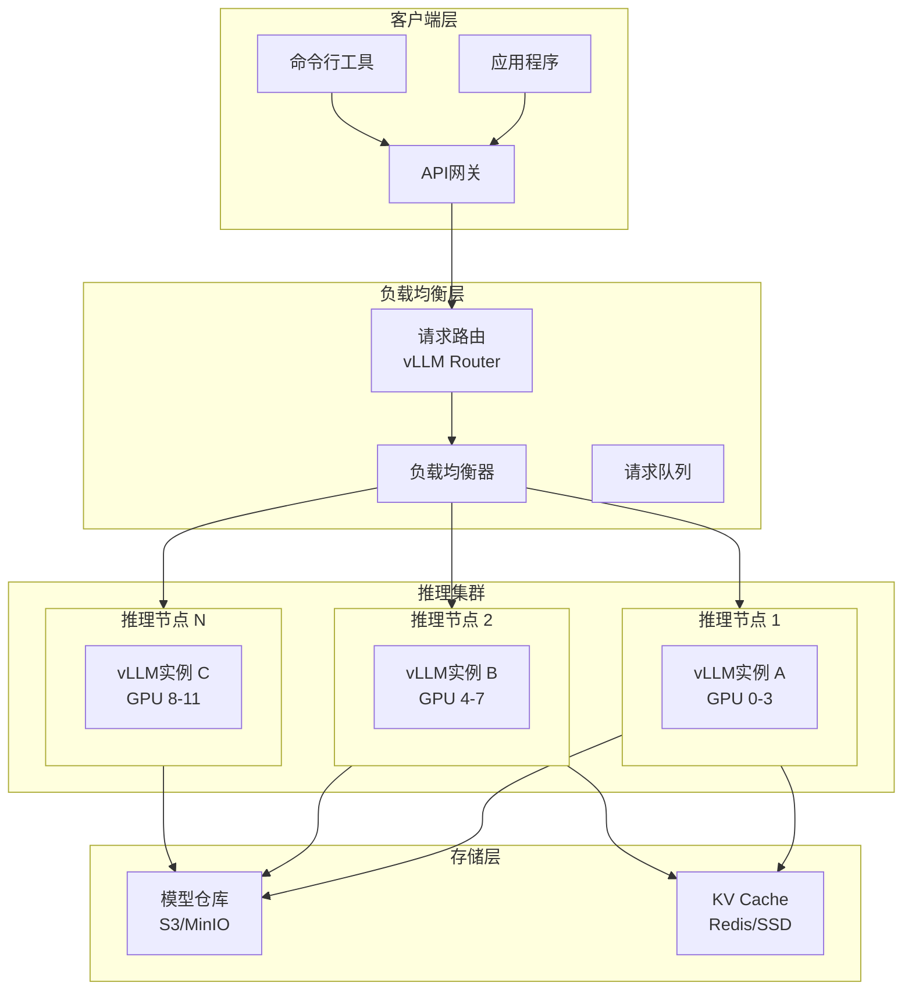
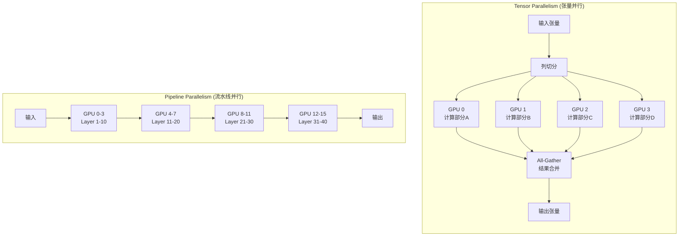
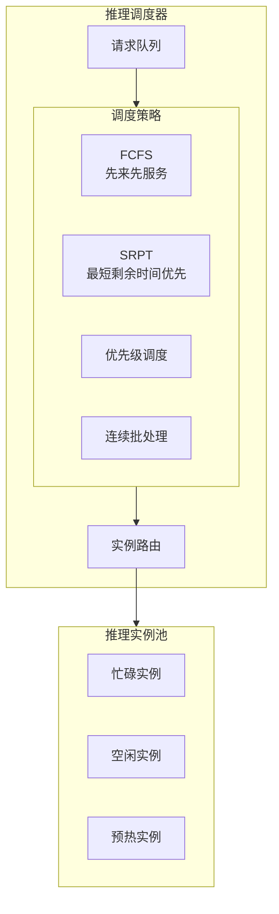
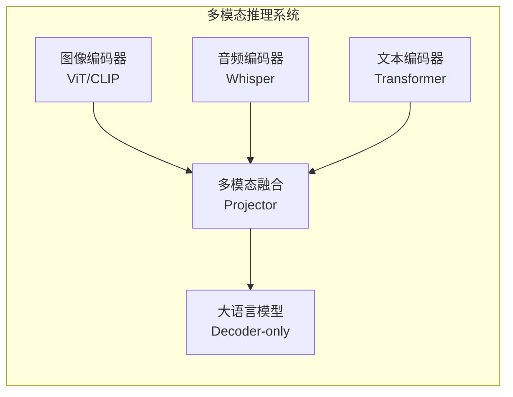

# 分布式 LLM 推理架构（2024-2025）

## 概述

随着大语言模型（LLM）参数规模突破万亿级别，单机推理已无法满足生产需求。2024-2025年，分布式LLM推理架构迎来爆发式发展，vLLM、TensorRT-LLM等推理引擎成为行业标准，多GPU并行推理、连续批处理（Continuous Batching）、投机采样（Speculative Decoding）等技术将推理吞吐量提升10倍以上。

---

## 1. 大模型分布式部署架构

### 1.1 典型分布式推理架构



### 1.2 部署模式对比

| 部署模式 | 适用场景 | 延迟 | 吞吐量 | 成本 |
|----------|----------|------|--------|------|
| **单卡推理** | 7B以下模型，原型验证 | 低 | 低 | 低 |
| **张量并行** | 70B+模型，单节点 | 中 | 中 | 中 |
| **流水线并行** | 超长序列，超大规模 | 高 | 高 | 高 |
| **专家混合(MoE)** | 万亿参数稀疏模型 | 中 | 极高 | 极高 |

---

## 2. vLLM 推理优化技术

### 2.1 PagedAttention 核心机制

```mermaid
flowchart LR
    subgraph Traditional["传统注意力内存"]
        T1[请求A KV Cache<br/>连续内存]
        T2[请求B KV Cache<br/>连续内存]
        T3[空闲碎片<br/>无法利用]
        T4[请求C KV Cache<br/>连续内存]
    end

    subgraph Paged["PagedAttention"]
        P1[请求A<br/>块1|块2|块5]
        P2[请求B<br/>块3|块6|块7]
        P3[请求C<br/>块4|块8]
        P4[块池<br/>固定大小块]
    end

    style T3 fill:#ff9999
    style P4 fill:#99ff99
```

### 2.2 vLLM 部署配置

```yaml
# vLLM 分布式推理配置 - docker-compose.yml
version: '3.8'

services:
  vllm-server:
    image: vllm/vllm-openai:latest
    runtime: nvidia
    environment:
      - CUDA_VISIBLE_DEVICES=0,1,2,3
    volumes:
      - /mnt/models:/models
    ports:
      - "8000:8000"
    command: >
      --model /models/meta-llama/Llama-3.1-70B-Instruct
      --tensor-parallel-size 4
      --pipeline-parallel-size 1
      --max-num-seqs 256
      --max-model-len 32768
      --gpu-memory-utilization 0.95
      --dtype bfloat16
      --enable-prefix-caching
      --enable-chunked-prefill
      --max-num-batched-tokens 8192
      --quantization fp8
    deploy:
      resources:
        reservations:
          devices:
            - driver: nvidia
              count: 4
              capabilities: [gpu]

  # vLLM Router - 多实例负载均衡
  vllm-router:
    image: vllm/vllm-openai:latest
    command: >
      serve-router
      --port 8001
      --vllm-server-urls http://vllm-server-1:8000,http://vllm-server-2:8000
      --routing-strategy round-robin
    ports:
      - "8001:8001"
    depends_on:
      - vllm-server
```

### 2.3 Kubernetes 大规模部署

```yaml
# vllm-deployment.yaml
apiVersion: apps/v1
kind: Deployment
metadata:
  name: vllm-llama-70b
spec:
  replicas: 2
  selector:
    matchLabels:
      app: vllm
  template:
    metadata:
      labels:
        app: vllm
    spec:
      nodeSelector:
        node-type: gpu-a100
      containers:
      - name: vllm
        image: vllm/vllm-openai:latest
        command:
        - python3
        - -m
        - vllm.entrypoints.openai.api_server
        args:
        - --model
        - meta-llama/Llama-3.1-70B-Instruct
        - --tensor-parallel-size
        - "4"
        - --max-num-seqs
        - "256"
        - --gpu-memory-utilization
        - "0.95"
        - --enable-prefix-caching
        - --enable-chunked-prefill
        resources:
          limits:
            nvidia.com/gpu: "4"
            memory: "384Gi"
            cpu: "32"
        volumeMounts:
        - name: model-storage
          mountPath: /models
        livenessProbe:
          httpGet:
            path: /health
            port: 8000
          initialDelaySeconds: 60
          periodSeconds: 10
        readinessProbe:
          httpGet:
            path: /health
            port: 8000
          initialDelaySeconds: 30
      volumes:
      - name: model-storage
        persistentVolumeClaim:
          claimName: model-pvc
      affinity:
        podAntiAffinity:
          requiredDuringSchedulingIgnoredDuringExecution:
          - labelSelector:
              matchLabels:
                app: vllm
            topologyKey: kubernetes.io/hostname
---
apiVersion: v1
kind: Service
metadata:
  name: vllm-service
spec:
  selector:
    app: vllm
  ports:
  - port: 8000
    targetPort: 8000
  type: ClusterIP
---
# 自动扩缩容配置
apiVersion: autoscaling/v2
kind: HorizontalPodAutoscaler
metadata:
  name: vllm-hpa
spec:
  scaleTargetRef:
    apiVersion: apps/v1
    kind: Deployment
    name: vllm-llama-70b
  minReplicas: 2
  maxReplicas: 10
  metrics:
  - type: Pods
    pods:
      metric:
        name: vllm:num_requests_running
      target:
        type: AverageValue
        averageValue: "200"
```

---

## 3. 并行策略深度对比

### 3.1 Tensor Parallelism vs Pipeline Parallelism



### 3.2 并行策略选择矩阵

| 维度 | Tensor Parallelism | Pipeline Parallelism | Sequence Parallelism |
|------|-------------------|---------------------|---------------------|
| **切分对象** | 权重矩阵、激活值 | 模型层 | 序列维度 |
| **通信量** | 大（每层的All-Reduce） | 小（仅边界激活值） | 中（序列维度的All-Gather）|
| **扩展性** | 限于单节点GPU数 | 可跨节点扩展 | 可跨节点扩展 |
| **适用场景** | 70B以下单节点 | 超长模型、多节点 | 超长上下文 |
| **延迟影响** | 小 | 大（流水线气泡） | 小 |

### 3.3 混合并行配置

```python
# Megatron-LM 混合并行配置
from megatron import get_args
from megatron.model import GPTModel

# 3D并行配置
parallel_config = {
    # 张量并行：单机内4卡
    "tensor_model_parallel_size": 4,

    # 流水线并行：跨节点2阶段
    "pipeline_model_parallel_size": 2,

    # 序列并行：长序列优化
    "sequence_parallel": True,

    # 数据并行：整体并行度
    "data_parallel_size": 2,

    # 总GPU数 = 4 * 2 * 2 = 16
}

# 流水线调度优化
pipeline_config = {
    # 交错流水线调度减少气泡
    "num_layers_per_virtual_pipeline_stage": 2,

    # 激活重计算节省内存
    "recompute_activations": True,

    # 变长序列批处理
    "variable_seq_lengths": True,
}
```

---

## 4. 推理服务调度架构

### 4.1 智能请求路由



### 4.2 连续批处理（Continuous Batching）

```python
# vLLM 连续批处理实现
class ContinuousBatchingScheduler:
    """
    连续批处理调度器 - 动态添加/移除请求
    """
    def __init__(self, max_batch_size: int = 256):
        self.max_batch_size = max_batch_size
        self.waiting_queue = deque()      # 等待队列
        self.running_requests = []         # 运行中请求

    def schedule(self) -> Batch:
        """
        动态批处理：尽可能填满当前批次
        """
        current_batch = self.running_requests.copy()

        # 尝试添加新请求
        while len(current_batch) < self.max_batch_size:
            if not self.waiting_queue:
                break

            new_req = self.waiting_queue.popleft()

            # 检查是否可以容纳（内存预算）
            if self.can_fit(current_batch, new_req):
                current_batch.append(new_req)
            else:
                # 无法容纳，放回队列
                self.waiting_queue.appendleft(new_req)
                break

        # 移除已完成的请求
        current_batch = [r for r in current_batch if not r.is_finished()]
        self.running_requests = current_batch

        return Batch(current_batch)

    def can_fit(self, batch: List[Request], new_req: Request) -> bool:
        # 检查KV Cache内存预算
        total_tokens = sum(r.num_tokens for r in batch) + new_req.num_tokens
        return total_tokens <= self.available_kv_cache()
```

### 4.3 投机采样（Speculative Decoding）

```python
# 投机采样加速推理
class SpeculativeDecoder:
    """
    使用小模型草稿 + 大模型验证的投机采样
    可将解码速度提升2-3倍
    """
    def __init__(self,
                 draft_model,  # 小模型（如1B）
                 target_model, # 大模型（如70B）
                 gamma: int = 5):  # 每次推测的token数
        self.draft_model = draft_model
        self.target_model = target_model
        self.gamma = gamma

    def generate(self, input_ids: torch.Tensor) -> torch.Tensor:
        output = input_ids.clone()

        while not self.eos_reached(output):
            # 1. 小模型快速生成gamma个草稿token
            draft_tokens = []
            draft_probs = []

            draft_input = output
            for _ in range(self.gamma):
                logits = self.draft_model(draft_input)
                prob = F.softmax(logits[:, -1, :], dim=-1)
                token = torch.multinomial(prob, num_samples=1)

                draft_tokens.append(token)
                draft_probs.append(prob)
                draft_input = torch.cat([draft_input, token], dim=-1)

            # 2. 大模型并行验证所有草稿位置
            target_logits = self.target_model(
                torch.cat([output] + draft_tokens, dim=-1)
            )
            target_probs = F.softmax(target_logits, dim=-1)

            # 3. 接受或拒绝token
            accepted = 0
            for i, (draft_t, draft_p) in enumerate(zip(draft_tokens, draft_probs)):
                target_p = target_probs[:, output.shape[1] + i - 1, draft_t]

                # 接受概率
                accept_prob = torch.min(
                    torch.ones_like(target_p),
                    target_p / (draft_p.gather(-1, draft_t) + 1e-8)
                )

                if torch.rand(1) < accept_prob:
                    output = torch.cat([output, draft_t], dim=-1)
                    accepted += 1
                else:
                    # 拒绝，从调整后的分布重新采样
                    adjusted_prob = target_probs[:, output.shape[1] + i - 1, :]
                    adjusted_prob = F.normalize(
                        torch.clamp(adjusted_prob - draft_p, min=0),
                        p=1, dim=-1
                    )
                    new_token = torch.multinomial(adjusted_prob, num_samples=1)
                    output = torch.cat([output, new_token], dim=-1)
                    break

        return output
```

---

## 5. 2024-2025技术趋势

### 5.1 推理引擎演进

| 引擎 | 特点 | 2024新特性 |
|------|------|------------|
| **vLLM** | PagedAttention, 高吞吐 | FP8量化, 多模态, MLA支持 |
| **TensorRT-LLM** | NVIDIA优化, 极致性能 | Blackwell架构支持, 多LoRA |
| **llama.cpp** | 边缘设备, GGUF格式 | KV Cache量化, 移动端优化 |
| **SGLang** | 结构化生成, RadixAttention | 编程式交互, 多轮对话优化 |
| **TGI** | HuggingFace生态 | Tool Calling, 连续批处理 |

### 5.2 量化与压缩技术

```python
# GPTQ/AWQ/GGUF 量化配置
quantization_config = {
    "load_in_4bit": True,
    "bnb_4bit_quant_type": "nf4",  # 4-bit Normal Float
    "bnb_4bit_compute_dtype": "bfloat16",
    "bnb_4bit_use_double_quant": True,  # 嵌套量化
}

# AWQ 量化 - 激活感知权重量化
# 保持关键权重精度，推理速度提升3x
awq_config = {
    "zero_point": True,
    "q_group_size": 128,
    "w_bit": 4,
    "version": "GEMM"
}

# FP8 量化 - H100/H200原生支持
fp8_config = {
    "kv_cache_dtype": "fp8",
    "quantization_config": {
        "quant_method": "fp8",
        "activation_scheme": "dynamic"
    }
}
```

### 5.3 多模态推理架构



---

## 6. 性能优化最佳实践

### 6.1 部署清单

- [ ] 启用 Prefix Caching 复用KV Cache
- [ ] 配置 Chunked Prefill 降低首Token延迟
- [ ] 使用 FP8/INT8 量化减少显存占用
- [ ] 启用投机采样加速解码
- [ ] 配置连续批处理提升吞吐
- [ ] 使用序列并行支持超长上下文

### 6.2 监控指标

```yaml
# Prometheus 监控配置
metrics:
  - name: vllm:time_to_first_token
    help: "首Token生成时间"
    type: histogram

  - name: vllm:time_per_output_token
    help: "每Token生成时间"
    type: histogram

  - name: vllm:num_requests_waiting
    help: "等待队列长度"
    type: gauge

  - name: vllm:gpu_cache_usage_perc
    help: "KV Cache使用率"
    type: gauge

  - name: vllm:num_preemptions
    help: "请求抢占次数"
    type: counter
```

---

## 参考资源

- [vLLM Documentation](https://docs.vllm.ai/)
- [NVIDIA TensorRT-LLM](https://github.com/NVIDIA/TensorRT-LLM)
- [Megatron-LM](https://github.com/NVIDIA/Megatron-LM)
- [DeepSpeed Inference](https://www.deepspeed.ai/inference/)
- [Efficient LLM Inference Survey](https://arxiv.org/abs/2404.14294)
