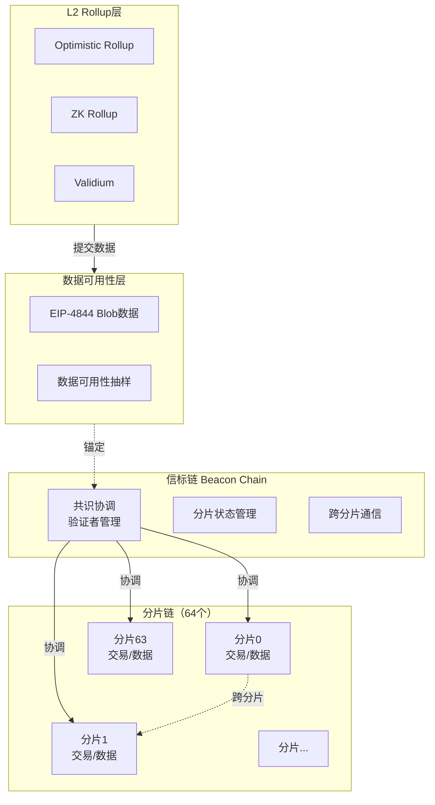
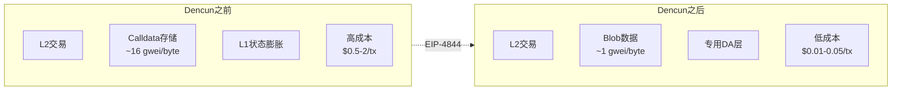
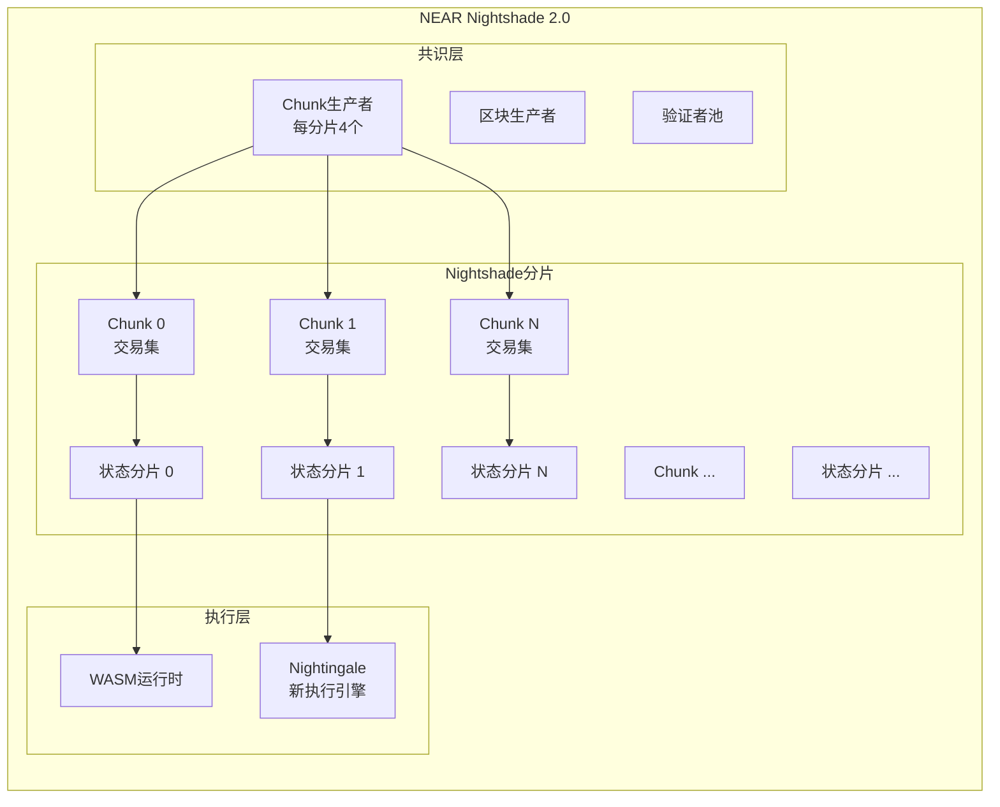
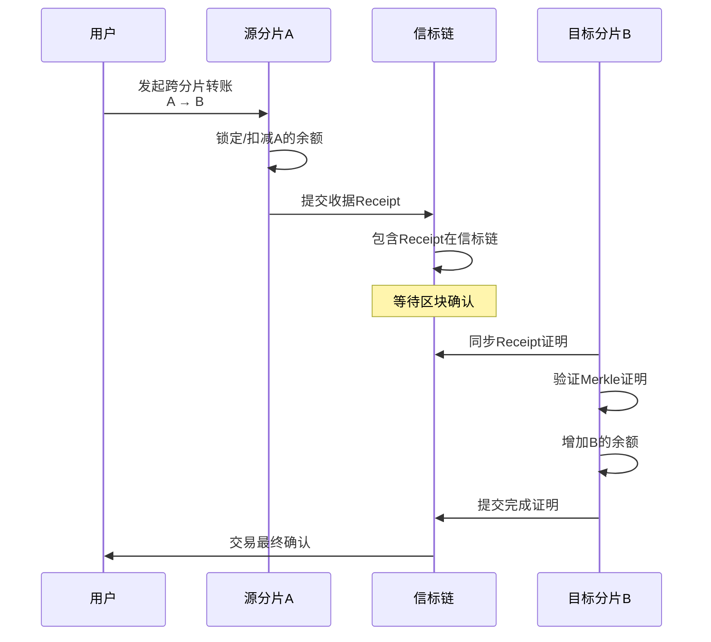
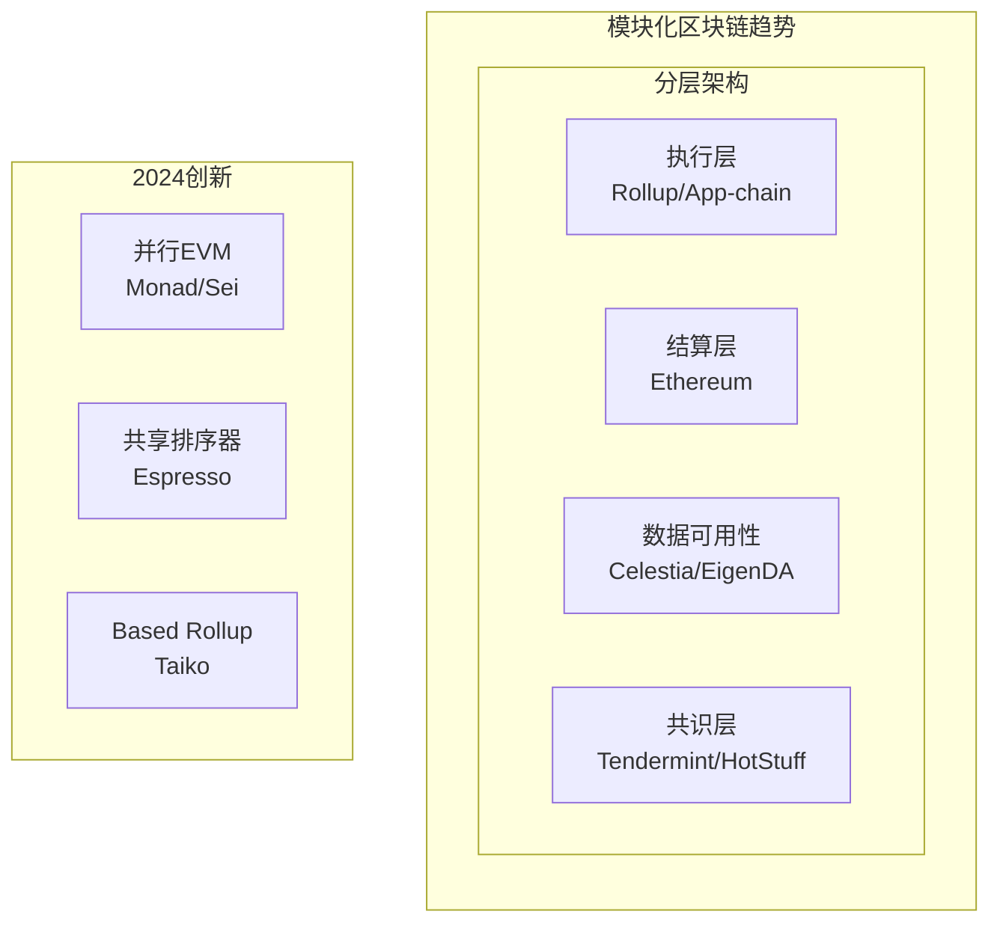

# 区块链分片技术（2024-2025）

## 概述

区块链分片（Sharding）是解决公链扩展性问题的核心技术路线。2024-2025年，以太坊Dencun升级（EIP-4844）大幅降低L2成本，NEAR Protocol的Nightshade 2.0实现100k+ TPS，Monad、Celestia等新型分片架构持续创新。分片技术从单纯的交易分片演进为状态分片、数据可用性分片的全栈解决方案。

---

## 1. 以太坊2.0分片架构

### 1.1 整体架构



### 1.2 Dencun升级与EIP-4844

2024年3月Dencun升级引入Proto-Danksharding，为完整分片奠定基础：



#### Blob交易数据结构

```python
# EIP-4844 Blob交易结构
class BlobTransaction:
    """
    分片Blob交易 - 临时数据存储
    """
    def __init__(self):
        # 标准交易字段
        self.chain_id: int          # 链ID
        self.nonce: int             # 交易序号
        self.max_priority_fee_per_gas: int  # 优先费用
        self.max_fee_per_gas: int   # 最高费用
        self.gas_limit: int         # Gas限制

        # EIP-4844新增字段
        self.max_fee_per_blob_gas: int      # Blob Gas费用上限
        self.blob_versioned_hashes: List[bytes32]  # Blob哈希列表

        # 关联数据（不直接上链）
        self.blobs: List[Blob]      # Blob数据（每个128KB）
        self.commitments: List[KZGCommitment]  # KZG承诺
        self.proofs: List[KZGProof] # KZG证明

    def validate(self) -> bool:
        """验证Blob交易有效性"""
        # 1. 验证Blob数量限制
        assert len(self.blobs) <= 6, "最多6个Blob"

        # 2. 验证KZG承诺
        for blob, commitment, proof in zip(
            self.blobs, self.commitments, self.proofs
        ):
            # 验证KZG证明
            assert verify_kzg_proof(blob, commitment, proof)

            # 验证版本化哈希
            versioned_hash = kzg_to_versioned_hash(commitment)
            assert versioned_hash in self.blob_versioned_hashes

        return True

# Blob Gas计算
class BlobGasCalculator:
    """Blob Gas费用计算"""

    TARGET_BLOB_GAS_PER_BLOCK = 393216    # 目标Blob Gas/区块
    MAX_BLOB_GAS_PER_BLOCK = 786432       # 最大Blob Gas/区块
    MIN_BLOB_BASE_FEE = 1                 # 最低Blob基础费用

    def calculate_blob_fee(self, parent_blob_gas_used: int) -> int:
        """
        计算Blob基础费用 - 类似EIP-1559机制
        """
        parent_blob_base_fee = self.get_parent_blob_base_fee()

        # 根据使用量调整费用
        if parent_blob_gas_used > self.TARGET_BLOB_GAS_PER_BLOCK:
            # 超额使用，费用上涨
            excess_gas = parent_blob_gas_used - self.TARGET_BLOB_GAS_PER_BLOCK
            fee_delta = max(
                parent_blob_base_fee * excess_gas // self.TARGET_BLOB_GAS_PER_BLOCK // 16,
                1
            )
            return parent_blob_base_fee + fee_delta
        else:
            # 使用不足，费用下降
            shortage = self.TARGET_BLOB_GAS_PER_BLOCK - parent_blob_gas_used
            fee_delta = max(
                parent_blob_base_fee * shortage // self.TARGET_BLOB_GAS_PER_BLOCK // 16,
                1
            )
            return max(parent_blob_base_fee - fee_delta, self.MIN_BLOB_BASE_FEE)
```

---

## 2. NEAR Nightshade 分片

### 2.1 Nightshade 2.0 架构



### 2.2 分片共识机制

```rust
// NEAR Nightshade 分片共识简化实现
pub struct NightshadeConsensus {
    num_shards: u64,
    validators: Vec<Validator>,
    epoch_manager: EpochManager,
}

impl NightshadeConsensus {
    /// 生产Chunk（分片区块）
    pub fn produce_chunk(
        &self,
        shard_id: ShardId,
        prev_block_hash: CryptoHash,
        transactions: Vec<SignedTransaction>,
    ) -> Result<ShardChunk, Error> {
        // 1. 验证交易有效性
        let valid_txs: Vec<_> = transactions
            .into_iter()
            .filter(|tx| self.validate_transaction(tx, shard_id))
            .collect();

        // 2. 执行交易，生成状态根
        let (state_root, outcomes) = self.apply_transactions(
            shard_id,
            &prev_block_hash,
            &valid_txs,
        )?;

        // 3. 构建Chunk
        let chunk = ShardChunk {
            shard_id,
            prev_block_hash,
            transactions: valid_txs,
            header: ChunkHeader {
                state_root,
                outcome_root: compute_outcome_root(&outcomes),
                height_included: self.get_next_height(),
                gas_used: outcomes.iter().map(|o| o.gas_burnt).sum(),
            },
        };

        Ok(chunk)
    }

    /// 验证Chunk
    pub fn validate_chunk(&self, chunk: &ShardChunk) -> Result<bool, Error> {
        // 1. 验证生产者权限
        let producer = self.get_chunk_producer(chunk.shard_id, chunk.header.height_included);
        assert_eq!(producer, chunk.producer);

        // 2. 验证状态转换
        let expected_state_root = self.compute_state_root(chunk)?;
        assert_eq!(expected_state_root, chunk.header.state_root);

        // 3. 验证交易根
        let tx_root = merklize(&chunk.transactions);
        assert_eq!(tx_root, chunk.header.tx_root);

        Ok(true)
    }
}

/// 分片分配算法 - 基于账户地址
pub fn account_to_shard(account_id: &AccountId, num_shards: u64) -> ShardId {
    let hash = sha256(account_id.as_bytes());
    let shard_idx = u64::from_le_bytes(hash[0..8].try_into().unwrap()) % num_shards;
    shard_idx as ShardId
}
```

### 2.3 简化的夜影协议

```python
class SimpleNightshade:
    """
    简化版Nightshade协议演示
    支持动态分片数调整
    """

    def __init__(self, initial_shards: int = 4):
        self.num_shards = initial_shards
        self.shards: Dict[int, Shard] = {
            i: Shard(shard_id=i) for i in range(initial_shards)
        }
        self.chunks: Dict[int, List[Chunk]] = defaultdict(list)

    def assign_transaction(self, tx: Transaction) -> int:
        """将交易分配到分片"""
        # 基于发送方地址分配
        sender_hash = hash(tx.sender)
        shard_id = sender_hash % self.num_shards
        return shard_id

    def process_block(self, transactions: List[Transaction]) -> Block:
        """处理区块 - 并行处理所有分片"""
        # 1. 按分片分组交易
        shard_txs: Dict[int, List[Transaction]] = defaultdict(list)
        for tx in transactions:
            shard_id = self.assign_transaction(tx)
            shard_txs[shard_id].append(tx)

        # 2. 并行生成Chunks
        chunks = []
        with ThreadPoolExecutor() as executor:
            futures = {
                executor.submit(
                    self.shards[sid].produce_chunk, txs
                ): sid for sid, txs in shard_txs.items()
            }
            for future in as_completed(futures):
                chunk = future.result()
                chunks.append(chunk)

        # 3. 组装区块
        block = Block(
            chunks=chunks,
            chunk_root=merkle_root([c.hash for c in chunks]),
            prev_hash=self.get_latest_block_hash(),
            timestamp=time.time(),
        )

        return block

    def resharding(self, new_shard_count: int):
        """
        动态重新分片
        当分片负载不均衡时触发
        """
        assert new_shard_count > self.num_shards

        # 1. 创建新分片
        for i in range(self.num_shards, new_shard_count):
            self.shards[i] = Shard(shard_id=i)

        # 2. 迁移状态（渐进式）
        for old_shard in range(self.num_shards):
            accounts_to_migrate = self.select_accounts_to_migrate(old_shard)
            for account in accounts_to_migrate:
                new_shard = hash(account) % new_shard_count
                if new_shard != old_shard:
                    self.migrate_account(account, old_shard, new_shard)

        self.num_shards = new_shard_count
```

---

## 3. 跨分片交易处理

### 3.1 跨分片交易生命周期



### 3.2 异步跨分片协议

```rust
/// 跨分片收据系统
pub struct CrossShardReceipt {
    /// 源分片
    pub from_shard: ShardId,
    /// 目标分片
    pub to_shard: ShardId,
    /// 收据数据
    pub data: ReceiptData,
    /// 生成该收据的Chunk哈希
    pub origin_chunk_hash: CryptoHash,
    /// 收据索引
    pub receipt_index: u64,
}

pub struct ReceiptData {
    pub predecessor_id: AccountId,
    pub receiver_id: AccountId,
    pub actions: Vec<Action>,
    pub gas: Gas,
}

/// 跨分片交易管理器
pub struct CrossShardManager {
    /// 待处理的出向收据
    outgoing_receipts: HashMap<ShardId, Vec<CrossShardReceipt>>,
    /// 待处理的入向收据
    incoming_receipts: HashMap<ShardId, Vec<CrossShardReceipt>>,
    /// 已完成的收据证明
    receipt_proofs: HashMap<CryptoHash, ReceiptProof>,
}

impl CrossShardManager {
    /// 处理跨分片交易 - 在源分片执行
    pub fn process_cross_shard_transaction(
        &mut self,
        tx: &SignedTransaction,
    ) -> Result<ExecutionOutcome, Error> {
        let sender_shard = account_to_shard(&tx.transaction.signer_id);
        let receiver_shard = account_to_shard(&tx.transaction.receiver_id);

        if sender_shard == receiver_shard {
            // 同分片交易，直接执行
            return self.apply_transaction(tx);
        }

        // 跨分片交易：在源分片扣除，生成收据
        let mut outcome = self.apply_transaction_in_shard(tx, sender_shard)?;

        // 创建收据发送到目标分片
        let receipt = CrossShardReceipt {
            from_shard: sender_shard,
            to_shard: receiver_shard,
            data: ReceiptData {
                predecessor_id: tx.transaction.signer_id.clone(),
                receiver_id: tx.transaction.receiver_id.clone(),
                actions: tx.transaction.actions.clone(),
                gas: tx.transaction.gas,
            },
            origin_chunk_hash: outcome.chunk_hash,
            receipt_index: outcome.receipt_index,
        };

        // 添加到出向队列
        self.outgoing_receipts
            .entry(receiver_shard)
            .or_default()
            .push(receipt);

        outcome.status = ExecutionStatus::PendingCrossShard;
        Ok(outcome)
    }

    /// 处理入向收据 - 在目标分片执行
    pub fn process_incoming_receipts(
        &mut self,
        receipts: Vec<CrossShardReceipt>,
        proof: ReceiptProof,
    ) -> Result<Vec<ExecutionOutcome>, Error> {
        let mut outcomes = vec![];

        for receipt in receipts {
            // 验证收据证明
            self.verify_receipt_proof(&receipt, &proof)?;

            // 在目标分片执行收据动作
            let outcome = self.apply_receipt(&receipt)?;
            outcomes.push(outcome);

            // 可能产生新的跨分片收据
            if let Some(new_receipt) = outcome.generated_receipt {
                self.outgoing_receipts
                    .entry(new_receipt.to_shard)
                    .or_default()
                    .push(new_receipt);
            }
        }

        Ok(outcomes)
    }
}
```

---

## 4. 数据可用性抽样（DAS）

### 4.1 DAS架构

```mermaid
flowchart TB
    subgraph Data["原始数据"]
        Blob[2MB Blob数据]
    end

    subgraph Encode["编码扩展"]
        RS[Reed-Solomon编码<br/>2MB → 4MB]
        Matrix[二维矩阵<br/>128x128 cells]
    end

    subgraph Commitment["承诺生成"]
        KZG[KZG多项式承诺]
        Commitment[数据承诺<br/>发布到链上]
    end

    subgraph Sampling["轻节点抽样"]
        LN1[轻节点1<br/>随机抽20个cell]
        LN2[轻节点2<br/>随机抽20个cell]
        LNN[轻节点N<br/>随机抽20个cell]
    end

    subgraph Verification["验证"]
        Proof[采样证明验证]
        Reconstruct[足够样本可重建]
    end

    Blob --> RS --> Matrix --> KZG --> Commitment
    Commitment --> LN1
    Commitment --> LN2
    Commitment --> LNN
    LN1 --> Proof
    LN2 --> Proof
    LNN --> Proof
    Proof --> Reconstruct
```

### 4.2 KZG承诺与DAS实现

```python
import py_ecc.bn128 as bn128
from py_ecc.fields import bn128_FQ
from typing import List, Tuple
import random

class KZGCommitment:
    """
    KZG多项式承诺方案
    用于数据可用性抽样
    """

    def __init__(self, secret_tau: int = None):
        """初始化可信设置"""
        # 模拟可信设置 - 生成SRS（结构化参考字符串）
        if secret_tau is None:
            secret_tau = random.randint(1, bn128.curve_order - 1)

        self.tau = secret_tau
        self.G1 = bn128.G1  # 生成元
        self.G2 = bn128.G2

        # 生成SRS: [G, tau*G, tau^2*G, ...]
        self.srs_g1: List[Tuple] = []
        self.srs_g2: Tuple = bn128.multiply(self.G2, self.tau)

        current = self.G1
        for _ in range(1024):  # 支持最高1023次多项式
            self.srs_g1.append(current)
            current = bn128.multiply(current, self.tau)

    def commit(self, polynomial: List[int]) -> Tuple:
        """
        对多项式生成承诺
        C = f(tau) * G = sum(coeff_i * tau^i * G)
        """
        assert len(polynomial) <= len(self.srs_g1)

        commitment = None
        for coeff, srs in zip(polynomial, self.srs_g1):
            term = bn128.multiply(srs, coeff)
            if commitment is None:
                commitment = term
            else:
                commitment = bn128.add(commitment, term)

        return commitment

    def create_proof(self, polynomial: List[int], point: int) -> Tuple:
        """
        创建在某点的评估证明
        证明 f(point) = value
        """
        value = self.eval_poly(polynomial, point)

        # 构造商多项式 q(x) = (f(x) - f(point)) / (x - point)
        numerator = polynomial.copy()
        numerator[0] -= value  # f(x) - f(point)

        # 多项式除法
        quotient = self.poly_div_by_linear(numerator, point)

        # 承诺商多项式
        proof = self.commit(quotient)
        return proof, value

    def verify(self, commitment: Tuple, point: int,
               value: int, proof: Tuple) -> bool:
        """
        验证评估证明
        检查 e(C - [value]*G, G) == e(proof, [tau - point]*G)
        """
        lhs_g1 = bn128.add(
            commitment,
            bn128.neg(bn128.multiply(self.G1, value))
        )

        rhs_g2 = bn128.add(
            self.srs_g2,
            bn128.neg(bn128.multiply(self.G2, point))
        )

        # 配对检查
        pair1 = bn128.pairing(lhs_g1, self.G2)
        pair2 = bn128.pairing(proof, rhs_g2)

        return pair1 == pair2

    def eval_poly(self, poly: List[int], x: int) -> int:
        """评估多项式在某点的值"""
        result = 0
        power = 1
        for coeff in poly:
            result = (result + coeff * power) % bn128.curve_order
            power = (power * x) % bn128.curve_order
        return result


class DataAvailabilitySampling:
    """
    数据可用性抽样实现
    """

    def __init__(self, kzg: KZGCommitment):
        self.kzg = kzg
        self.samples_required = 20  # 每个轻节点抽样数
        self.confidence_threshold = 0.99

    def encode_data(self, data: bytes) -> Tuple[List[List[int]], Tuple]:
        """
        将数据编码为二维矩阵并生成承诺
        """
        # 1. 将数据分为256个chunk
        chunk_size = len(data) // 256
        chunks = [data[i*chunk_size:(i+1)*chunk_size]
                  for i in range(256)]

        # 2. Reed-Solomon编码扩展（水平）
        extended = self.rs_encode(chunks)

        # 3. 构建二维矩阵（16x32）
        matrix = [extended[i*32:(i+1)*32] for i in range(16)]

        # 4. 列方向再次RS编码
        full_matrix = self.rs_encode_columns(matrix)

        # 5. 生成承诺（每行一个承诺）
        commitments = []
        for row in full_matrix:
            poly = self.bytes_to_poly(row)
            commitment = self.kzg.commit(poly)
            commitments.append(commitment)

        return full_matrix, commitments

    def sample_and_verify(self, commitments: List[Tuple],
                          sample_indices: List[Tuple[int, int]]) -> bool:
        """
        轻节点抽样验证
        随机选择matrix中的cell进行验证
        """
        verified = 0

        for row_idx, col_idx in sample_indices:
            # 从网络获取cell数据和证明
            cell_data, proof = self.fetch_cell_with_proof(row_idx, col_idx)

            # 验证证明
            commitment = commitments[row_idx]
            point = col_idx
            value = self.bytes_to_field(cell_data)

            if self.kzg.verify(commitment, point, value, proof):
                verified += 1

        # 计算数据可用性置信度
        availability_prob = self.compute_availability_probability(
            verified, len(sample_indices)
        )

        return availability_prob >= self.confidence_threshold

    def compute_availability_probability(self,
                                         verified: int,
                                         total_samples: int) -> float:
        """
        计算数据可用性概率
        基于抽样比例和验证通过率
        """
        # 简化的概率模型
        if verified < total_samples * 0.5:
            return 0.0

        # 数据不可用的概率随样本数指数下降
        missing_ratio = 0.5  # 假设最坏情况下50%数据缺失
        prob_unavailable = missing_ratio ** verified

        return 1 - prob_unavailable
```

---

## 5. 2024-2025技术趋势

### 5.1 分片项目对比

| 项目 | 分片类型 | TPS | 共识机制 | 2024新特性 |
|------|----------|-----|----------|------------|
| **Ethereum 2.0** | 数据分片 | 100k+ (完整) | PoS/Casper | EIP-4844 Blob, Dencun升级 |
| **NEAR** | 状态分片 | 100k+ | Nightshade | Nightshade 2.0, 动态重分片 |
| **Polkadot** | 异构分片 | 1M+ (理论) | NPoS/GRANDPA | 异步支持, XCM v3 |
| **Celestia** | 数据可用性 | - | PoS | 数据可用性层, 轻节点 |
| **Monad** | 并行EVM | 10k+ | PoS | 乐观并行执行 |
| **Shardeum** | 动态分片 | 100k+ | PoS+PoQu | 自动扩展分片数 |

### 5.2 新架构趋势



---

## 6. 性能优化策略

### 6.1 分片性能指标

```yaml
# 分片监控配置
metrics:
  # 分片级别指标
  shard_tps:
    description: "每分片TPS"
    labels: [shard_id]

  cross_shard_ratio:
    description: "跨分片交易比例"
    target: "< 30%"

  shard_balance:
    description: "分片负载均衡度"
    formula: "max(load) / avg(load)"
    target: "< 1.5"

  data_availability:
    description: "数据可用性置信度"
    target: "> 99.9%"

  # 跨分片指标
  cross_shard_latency:
    description: "跨分片确认延迟"
    target: "< 2 blocks"

  receipt_backlog:
    description: "待处理收据队列长度"
    alert_threshold: "> 1000"
```

### 6.2 优化建议

1. **账户分配优化**: 基于交易模式智能分片，减少跨分片交易
2. **动态负载均衡**: 实时监控分片负载，触发自动重分片
3. **收据聚合**: 批量处理跨分片收据，降低证明验证开销
4. **状态剪枝**: 定期清理历史状态，降低存储负担

---

## 参考资源

- [Ethereum Sharding Roadmap](https://ethereum.org/roadmap/danksharding/)
- [NEAR Nightshade Paper](https://near.org/papers/nightshade/)
- [Celestia Documentation](https://docs.celestia.org/)
- [Data Availability Sampling](https://arxiv.org/abs/1809.09044)
- [Danksharding Workshop](https://notes.ethereum.org/@vbuterin/danksharding)
