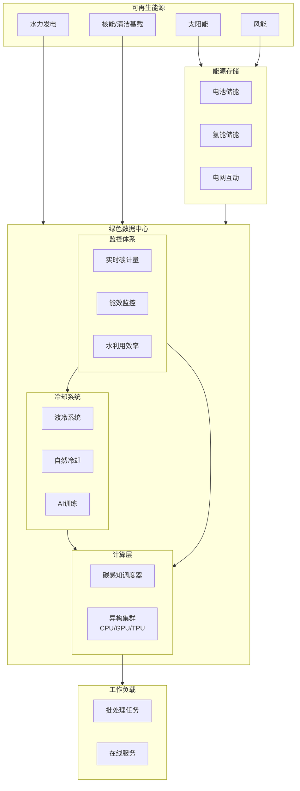
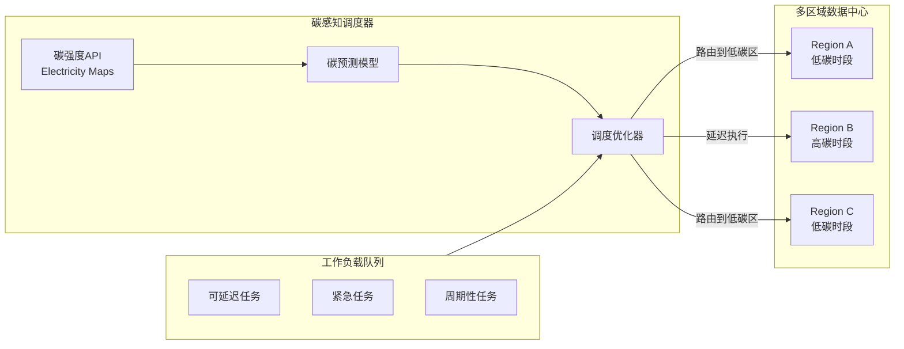
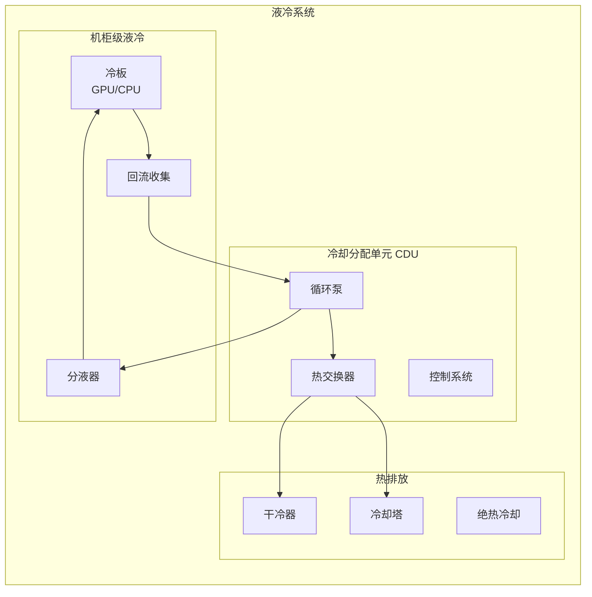

# 可持续分布式计算（2024-2025）

## 概述

随着AI训练集群功耗突破百兆瓦级，数据中心能耗已占全球用电量的2-3%。2024-2025年，可持续计算从边缘需求走向核心战略，碳感知调度、液冷技术、可再生能源整合成为分布式系统设计的必备要素。微软、Google、AWS等云厂商相继承诺2030年实现碳中和，推动绿色计算技术全面落地。

---

## 1. 绿色计算架构

### 1.1 可持续数据中心架构



### 1.2 碳感知调度系统



---

## 2. 碳足迹优化

### 2.1 碳计量模型

```python
# carbon_footprint_calculator.py
from dataclasses import dataclass
from typing import Dict, List
from datetime import datetime, timedelta
import requests

@dataclass
class CarbonIntensity:
    """碳强度数据"""
    timestamp: datetime
    location: str
    carbon_intensity_g_co2_kwh: float  # g CO2/kWh
    energy_mix: Dict[str, float]       # 能源结构占比

@dataclass
class WorkloadProfile:
    """工作负载特征"""
    name: str
    estimated_energy_kwh: float
    deadline: datetime
    flexibility_hours: float  # 可延迟时间窗口
    priority: int            # 1-10, 10最高

class CarbonAwareScheduler:
    """
    碳感知调度器 - 将工作负载路由到低碳区域/时段
    """

    CARBON_API_URL = "https://api.electricitymap.org/v3/carbon-intensity/latest"

    def __init__(self, api_key: str):
        self.api_key = api_key
        self.regions = [
            "DE",  # 德国 - 可再生能源丰富
            "FR",  # 法国 - 核电为主
            "NO",  # 挪威 - 水电为主
            "SE",  # 瑞典 - 水电风电
            "DK",  # 丹麦 - 风电领先
        ]

    def fetch_carbon_intensity(self, region: str) -> CarbonIntensity:
        """获取区域实时碳强度"""
        headers = {"auth-token": self.api_key}
        response = requests.get(
            f"{self.CARBON_API_URL}?zone={region}",
            headers=headers
        )
        data = response.json()

        return CarbonIntensity(
            timestamp=datetime.now(),
            location=region,
            carbon_intensity_g_co2_kwh=data["carbonIntensity"],
            energy_mix=data.get("powerConsumptionBreakdown", {})
        )

    def get_all_regions_intensity(self) -> Dict[str, CarbonIntensity]:
        """获取所有区域的碳强度"""
        intensities = {}
        for region in self.regions:
            try:
                intensities[region] = self.fetch_carbon_intensity(region)
            except Exception as e:
                print(f"Failed to fetch {region}: {e}")
        return intensities

    def calculate_workload_carbon(
        self,
        workload: WorkloadProfile,
        intensity: CarbonIntensity
    ) -> float:
        """
        计算工作负载碳排放
        排放(kg CO2) = 能耗(kWh) x 碳强度(g/kWh) / 1000
        """
        carbon_g = workload.estimated_energy_kwh * intensity.carbon_intensity_g_co2_kwh
        return carbon_g / 1000  # 转换为kg

    def schedule_workload(
        self,
        workload: WorkloadProfile
    ) -> Dict:
        """
        为工作负载选择最优执行区域和时段
        """
        # 获取所有区域当前碳强度
        intensities = self.get_all_regions_intensity()

        # 如果任务紧急，选择当前最低碳区域
        if workload.priority >= 8 or workload.flexibility_hours < 1:
            best_region = min(
                intensities.items(),
                key=lambda x: x[1].carbon_intensity_g_co2_kwh
            )
            return {
                "region": best_region[0],
                "schedule_time": datetime.now(),
                "carbon_intensity": best_region[1].carbon_intensity_g_co2_kwh,
                "estimated_emissions_kg": self.calculate_workload_carbon(
                    workload, best_region[1]
                ),
                "strategy": "immediate_lowest_carbon"
            }

        # 对于灵活任务，预测未来碳强度
        future_schedules = []
        for hours_offset in range(int(workload.flexibility_hours)):
            scheduled_time = datetime.now() + timedelta(hours=hours_offset)

            for region, intensity in intensities.items():
                # 简化：假设碳强度每小时变化±20%
                predicted_intensity = intensity.carbon_intensity_g_co2_kwh * (
                    0.8 + 0.4 * (hours_offset % 24) / 24
                )

                future_schedules.append({
                    "region": region,
                    "schedule_time": scheduled_time,
                    "predicted_intensity": predicted_intensity,
                    "estimated_emissions_kg": (
                    workload.estimated_energy_kwh * predicted_intensity / 1000
                    )
                })

        # 选择碳排放最低的方案
        best_schedule = min(future_schedules, key=lambda x: x["estimated_emissions_kg"])
        best_schedule["strategy"] = "delayed_lowest_carbon"

        return best_schedule

    def generate_shift_report(
        self,
        original_region: str,
        optimized_schedule: Dict,
        workload: WorkloadProfile
    ) -> Dict:
        """生成碳减排报告"""
        original_intensity = self.fetch_carbon_intensity(original_region)
        original_emissions = self.calculate_workload_carbon(workload, original_intensity)

        saved_emissions = original_emissions - optimized_schedule["estimated_emissions_kg"]
        reduction_percent = (saved_emissions / original_emissions) * 100

        return {
            "workload_name": workload.name,
            "original_region": original_region,
            "optimized_region": optimized_schedule["region"],
            "original_emissions_kg": original_emissions,
            "optimized_emissions_kg": optimized_schedule["estimated_emissions_kg"],
            "emissions_saved_kg": saved_emissions,
            "reduction_percentage": reduction_percent,
            "delay_hours": (
                optimized_schedule["schedule_time"] - datetime.now()
            ).total_seconds() / 3600
        }


# Kubernetes碳感知调度器集成
class K8sCarbonScheduler:
    """Kubernetes碳感知调度器插件"""

    def __init__(self, carbon_scheduler: CarbonAwareScheduler):
        self.carbon = carbon_scheduler
        self.region_labels = {
            "europe-west1": "DE",
            "europe-west2": "FR",
            "europe-north1": "FI",
        }

    def schedule_pod(self, pod_spec: dict) -> str:
        """
        为Pod选择最优节点/区域
        """
        # 估算Pod能耗
        cpu_request = pod_spec.get("resources", {}).get("requests", {}).get("cpu", "1")
        memory_request = pod_spec.get("resources", {}).get("requests", {}).get("memory", "4Gi")

        estimated_energy = self.estimate_pod_energy(cpu_request, memory_request)

        # 检查Pod是否可延迟
        annotations = pod_spec.get("annotations", {})
        flexibility = float(annotations.get("carbon-aware/flexibility-hours", "0"))

        workload = WorkloadProfile(
            name=pod_spec["name"],
            estimated_energy_kwh=estimated_energy,
            deadline=datetime.now() + timedelta(hours=flexibility + 1),
            flexibility_hours=flexibility,
            priority=int(annotations.get("carbon-aware/priority", "5"))
        )

        # 获取调度建议
        schedule = self.carbon.schedule_workload(workload)

        # 返回节点选择器
        return schedule["region"]

    def estimate_pod_energy(self, cpu: str, memory: str) -> float:
        """估算Pod能耗"""
        # 简化估算：1 CPU core ≈ 50W, 4GB RAM ≈ 10W
        # 假设运行1小时
        cpu_cores = int(cpu.replace("m", "")) / 1000 if "m" in cpu else int(cpu)
        memory_gb = int(memory.replace("Gi", "").replace("G", ""))

        power_watts = cpu_cores * 50 + (memory_gb / 4) * 10
        return power_watts / 1000  # 转换为kWh
```

### 2.2 数据中心PUE优化

```yaml
# pue-monitoring.yaml - PUE监控配置
apiVersion: v1
kind: ConfigMap
metadata:
  name: pue-metrics-config
data:
  metrics.yaml: |
    # PUE (Power Usage Effectiveness) 计算
    # PUE = 总设施能耗 / IT设备能耗
    # 目标: 1.1-1.2 (传统数据中心 1.5-2.0)

    metrics:
      - name: datacenter_pue
        query: |
          sum(power_consumption_total_watts) /
          sum(power_consumption_it_watts)
        target: "< 1.2"
        alert_threshold: "> 1.3"

      - name: wue_water_usage
        query: |
          sum(water_consumption_liters) /
          sum(it_equipment_energy_kwh)
        target: "< 1.0 L/kWh"

      - name: carbon_usage_effectiveness
        query: |
          sum(carbon_emissions_total_kg) /
          sum(it_equipment_energy_kwh)
        target: "< 0.5 kg/kWh"

      - name: renewable_energy_percentage
        query: |
          sum(energy_from_renewable_kwh) /
          sum(total_energy_kwh) * 100
        target: "> 80%"

---
# 碳感知Deployment示例
apiVersion: apps/v1
kind: Deployment
metadata:
  name: batch-processing
  annotations:
    carbon-aware.io/enabled: "true"
    carbon-aware.io/flexibility-hours: "24"
    carbon-aware.io/max-delay-hours: "48"
spec:
  replicas: 3
  selector:
    matchLabels:
      app: batch-processor
  template:
    metadata:
      labels:
        app: batch-processor
    spec:
      nodeSelector:
        carbon-aware.io/region: "auto"
      containers:
      - name: processor
        image: batch-processor:v1.0
        resources:
          requests:
            cpu: "4"
            memory: "16Gi"
          limits:
            cpu: "8"
            memory: "32Gi"
        env:
        - name: CARBON_AWARE_SCHEDULING
          value: "enabled"
        - name: OPTIMIZATION_TARGET
          value: "carbon-minimum"
```

---

## 3. 能源感知调度

### 3.1 Kubernetes能源调度器

```yaml
# energy-scheduler.yaml
apiVersion: v1
kind: ConfigMap
metadata:
  name: scheduler-policy
data:
  policy.cfg: |
    {
      "kind": "Policy",
      "apiVersion": "v1",
      "predicates": [
        {"name": "PodFitsResources"},
        {"name": "PodFitsHost"},
        {"name": "PodFitsHostPorts"}
      ],
      "priorities": [
        {"name": "LeastCarbonIntensity", "weight": 100},
        {"name": "LeastRequestedEnergy", "weight": 80},
        {"name": "BalancedResourceAllocation", "weight": 50},
        {"name": "ServiceSpreadingPriority", "weight": 20}
      ],
      "extenders": [
        {
          "urlPrefix": "http://carbon-scheduler.default.svc",
          "filterVerb": "filter",
          "prioritizeVerb": "prioritize",
          "weight": 100,
          "enableHttps": false,
          "nodeCacheCapable": false
        }
      ]
    }

---
# 能源感知Pod调度
apiVersion: v1
kind: Pod
metadata:
  name: ml-training-job
  labels:
    app: ml-training
    energy-profile: "high"
  annotations:
    # 能源感知调度注解
    scheduler.alpha.kubernetes.io/carbon-aware: "true"
    energy.kubernetes.io/preferred-regions: "nordics,eu-west"
    energy.kubernetes.io/flexible-scheduling: "true"
    energy.kubernetes.io/max-wait-duration: "6h"
spec:
  schedulerName: carbon-aware-scheduler
  containers:
  - name: trainer
    image: ml-training:latest
    command: ["python", "train.py"]
    resources:
      requests:
        nvidia.com/gpu: 4
        cpu: "32"
        memory: "128Gi"
      limits:
        nvidia.com/gpu: 4
        cpu: "64"
        memory: "256Gi"
    env:
    - name: CUDA_VISIBLE_DEVICES
      value: "0,1,2,3"
    - name: NCCL_P2P_LEVEL
      value: "NVL"
  nodeSelector:
    node.kubernetes.io/instance-type: "gpu-high-mem"
  affinity:
    podAntiAffinity:
      preferredDuringSchedulingIgnoredDuringExecution:
      - weight: 100
        podAffinityTerm:
          labelSelector:
            matchExpressions:
            - key: energy-profile
              operator: In
              values:
              - high
          topologyKey: kubernetes.io/hostname
```

### 3.2 动态功耗管理

```python
# power_management.py
import subprocess
import time
from typing import Dict

class GPUPowerManager:
    """
    GPU动态功耗管理
    根据负载调整GPU功耗限制
    """

    def __init__(self):
        self.gpu_info = self._get_gpu_info()

    def _get_gpu_info(self) -> Dict:
        """获取GPU信息"""
        result = subprocess.run(
            ["nvidia-smi", "--query-gpu=index,name,power.limit,power.draw",
             "--format=csv,noheader,nounits"],
            capture_output=True, text=True
        )
        gpus = {}
        for line in result.stdout.strip().split('\n'):
            parts = [p.strip() for p in line.split(',')]
            gpus[int(parts[0])] = {
                'name': parts[1],
                'power_limit': float(parts[2]),
                'current_draw': float(parts[3])
            }
        return gpus

    def set_power_limit(self, gpu_id: int, limit_watts: int):
        """设置GPU功耗限制"""
        subprocess.run([
            "nvidia-smi", "-i", str(gpu_id),
            "-pl", str(limit_watts)
        ], check=True)
        print(f"GPU {gpu_id}: Power limit set to {limit_watts}W")

    def optimize_for_efficiency(self):
        """
        优化GPU功耗效率
        研究表明：降低20%功耗可能只损失5%性能
        """
        for gpu_id, info in self.gpu_info.items():
            max_power = info['power_limit']
            # 设置为最大功耗的80%以获得最佳能效比
            efficient_power = int(max_power * 0.8)
            self.set_power_limit(gpu_id, efficient_power)

    def dynamic_scaling(self, gpu_id: int, target_utilization: float = 0.8):
        """
        根据利用率动态调整功耗
        """
        while True:
            # 获取当前利用率
            result = subprocess.run(
                ["nvidia-smi", "--query-gpu=utilization.gpu",
                 "--format=csv,noheader,nounits", "-i", str(gpu_id)],
                capture_output=True, text=True
            )
            utilization = float(result.stdout.strip()) / 100

            current_limit = self.gpu_info[gpu_id]['power_limit']

            if utilization < target_utilization - 0.1:
                # 利用率低，降低功耗
                new_limit = int(current_limit * 0.95)
                self.set_power_limit(gpu_id, max(new_limit, 100))
            elif utilization > target_utilization + 0.1:
                # 利用率高，增加功耗（不超过最大）
                new_limit = int(current_limit * 1.05)
                max_limit = self.gpu_info[gpu_id]['power_limit']
                self.set_power_limit(gpu_id, min(new_limit, int(max_limit)))

            time.sleep(60)  # 每分钟调整一次


class CPUPowerGovernor:
    """CPU功耗管理"""

    GOVERNORS = ['powersave', 'ondemand', 'performance']

    def set_governor(self, governor: str):
        """设置CPU频率调节策略"""
        if governor not in self.GOVERNORS:
            raise ValueError(f"Invalid governor. Choose from {self.GOVERNORS}")

        # 设置所有CPU核心
        for cpu in range(64):  # 假设最多64核
            try:
                with open(f"/sys/devices/system/cpu/cpu{cpu}/cpufreq/scaling_governor", "w") as f:
                    f.write(governor)
            except FileNotFoundError:
                break

        print(f"CPU governor set to: {governor}")

    def eco_mode(self):
        """启用节能模式"""
        self.set_governor('powersave')

    def performance_mode(self):
        """启用性能模式"""
        self.set_governor('performance')

    def adaptive_mode(self):
        """启用自适应模式（推荐）"""
        self.set_governor('ondemand')
```

---

## 4. 液冷数据中心

### 4.1 液冷架构



### 4.2 液冷部署配置

```yaml
# liquid-cooled-deployment.yaml
apiVersion: v1
kind: ConfigMap
metadata:
  name: liquid-cooling-config
data:
  cooling-policy.yaml: |
    # 液冷系统配置
    cooling_system:
      type: direct_liquid_cooling

      # 冷却液参数
      coolant:
        type: dielectric_fluid
        inlet_temperature_c: 40
        outlet_temperature_c: 60
        flow_rate_lpm: 15

      # 温度控制
      temperature_control:
        target_cpu_temp: 75
        target_gpu_temp: 65
        emergency_shutdown_temp: 85

      # 与调度器集成
      scheduler_integration:
        enabled: true
        thermal_aware_placement: true
        cooldown_period_minutes: 10

    # 节点液冷标签
    node_labels:
      - key: cooling-type
        values: [dlc, hybrid, air]
      - key: cooling-capacity-kw
        values: [10, 20, 30, 50]

---
# 液冷节点配置
apiVersion: v1
kind: Node
metadata:
  name: gpu-node-liquid-01
  labels:
    cooling-type: dlc
    cooling-capacity-kw: "50"
    thermal-zone: "high-density"
spec:
  # 节点污点阻止非液冷工作负载
  taints:
  - key: cooling-required
    value: dlc
    effect: NoSchedule
---
# 液冷工作负载
apiVersion: apps/v1
kind: StatefulSet
metadata:
  name: ai-training-liquid
spec:
  serviceName: "ai-training"
  replicas: 8
  selector:
    matchLabels:
      app: ai-training
  template:
    metadata:
      labels:
        app: ai-training
    spec:
      # 容忍液冷节点污点
      tolerations:
      - key: cooling-required
        operator: Equal
        value: dlc
        effect: NoSchedule

      # 选择液冷节点
      nodeSelector:
        cooling-type: dlc

      # 拓扑分布：跨不同液冷机柜
      topologySpreadConstraints:
      - maxSkew: 1
        topologyKey: rack
        whenUnsatisfiable: DoNotSchedule
        labelSelector:
          matchLabels:
            app: ai-training

      containers:
      - name: training
        image: ai-training:v2.0
        resources:
          limits:
            nvidia.com/gpu: 8
            nvidia.com/gpumemory: "80Gi"
            cpu: "128"
            memory: "1Ti"
        # 温度感知资源请求
        env:
        - name: NVIDIA_TEMPERATURE_THRESHOLD
          value: "75"
        - name: LIQUID_COOLING_ENABLED
          value: "true"
        # 热备份迁移设置
        lifecycle:
          preStop:
            exec:
              command: ["/bin/sh", "-c", "sleep 10 && /opt/checkpoint.sh"]
```

---

## 5. 2024-2025技术趋势

### 5.1 可持续计算技术成熟度

| 技术 | 成熟度 | 节能效果 | 应用现状 |
|------|--------|----------|----------|
| **碳感知调度** | 生产级 | 15-30% | Google、微软大规模部署 |
| **液冷技术** | 生产级 | 40-50% | AI训练集群标配 |
| **可再生能源** | 成熟 | 100%清洁 | 北欧数据中心领先 |
| **AI优化冷却** | 规模化 | 20-30% | DeepMind数据中心应用 |
| **热量回收** | 发展中 | 额外收益 | 北欧试点项目 |
| **氢能备用** | 试验 | 零排放备用 | 微软2025试点 |

### 5.2 云厂商碳中和承诺


---

## 6. 实施建议

### 6.1 渐进式绿色转型路径

1. **第一阶段 - 监测（0-6个月）**
   - 部署碳计量工具
   - 建立PUE/WUE基线
   - 识别高能耗工作负载

2. **第二阶段 - 优化（6-12个月）**
   - 实施碳感知调度
   - 优化服务器利用率
   - 采用动态功耗管理

3. **第三阶段 - 转型（1-2年）**
   - 液冷技术改造
   - 可再生能源采购
   - 余热回收利用

### 6.2 监控告警配置

```yaml
# sustainable-computing-alerts.yaml
apiVersion: monitoring.coreos.com/v1
kind: PrometheusRule
metadata:
  name: sustainability-alerts
spec:
  groups:
  - name: carbon.rules
    rules:
    - alert: HighCarbonIntensity
      expr: |
        carbon_intensity_g_co2_kwh > 500
      for: 15m
      labels:
        severity: warning
      annotations:
        summary: "区域碳强度过高"
        description: "当前碳强度{{ $value }} g/kWh，考虑迁移工作负载"

    - alert: HighPUE
      expr: |
        datacenter_pue > 1.3
      for: 5m
      labels:
        severity: critical
      annotations:
        summary: "数据中心PUE过高"

    - alert: LowRenewableRatio
      expr: |
        renewable_energy_percentage < 60
      for: 1h
      labels:
        severity: warning
      annotations:
        summary: "可再生能源比例过低"
```

---

## 参考资源

- [Green Software Foundation](https://greensoftware.foundation/)
- [Electricity Maps API](https://www.electricitymaps.com/)
- [Microsoft Sustainability](https://www.microsoft.com/sustainability)
- [Google 24/7 Carbon Free Energy](https://sustainability.google/progress/energy/)
- [AWS Sustainability](https://sustainability.aboutamazon.com/)
- [The Green Grid](https://www.thegreengrid.org/)
- [SCI Specification](https://sci.greensoftware.foundation/)
