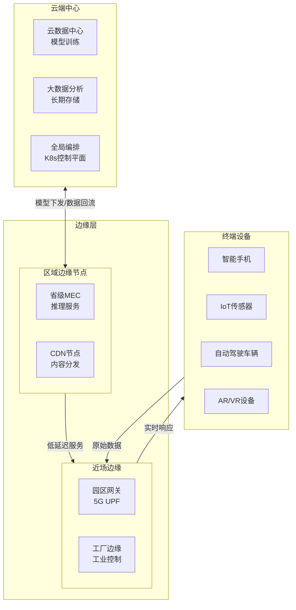
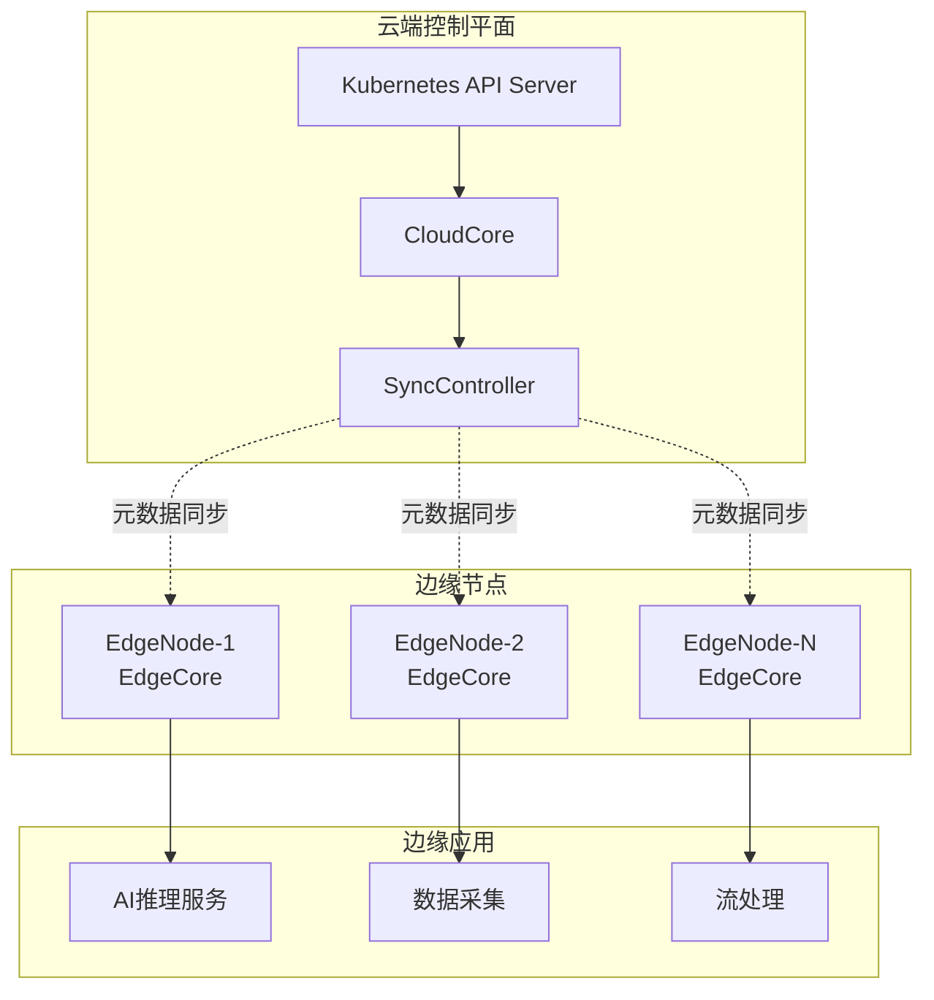
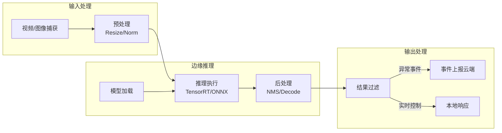
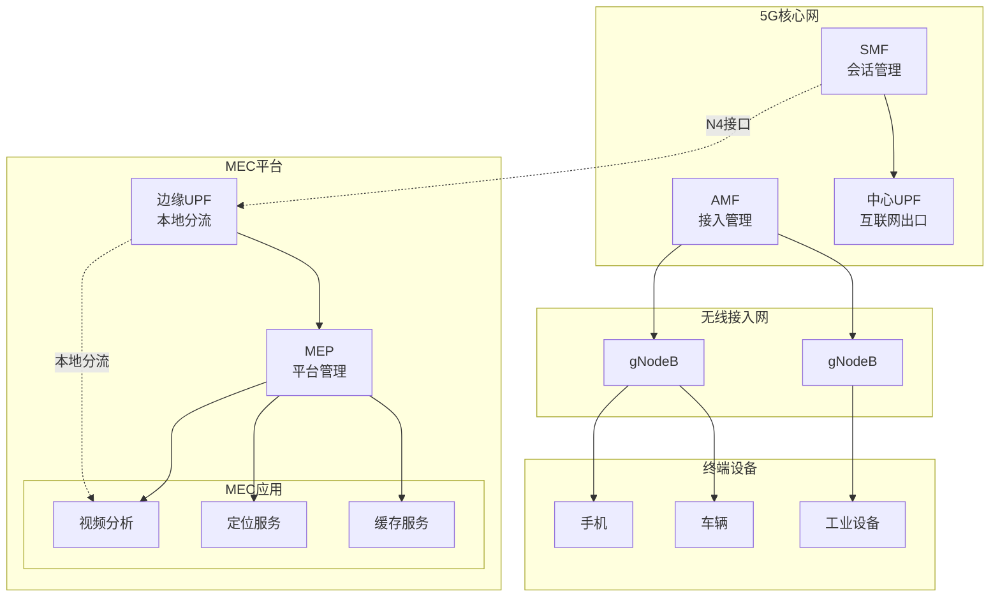
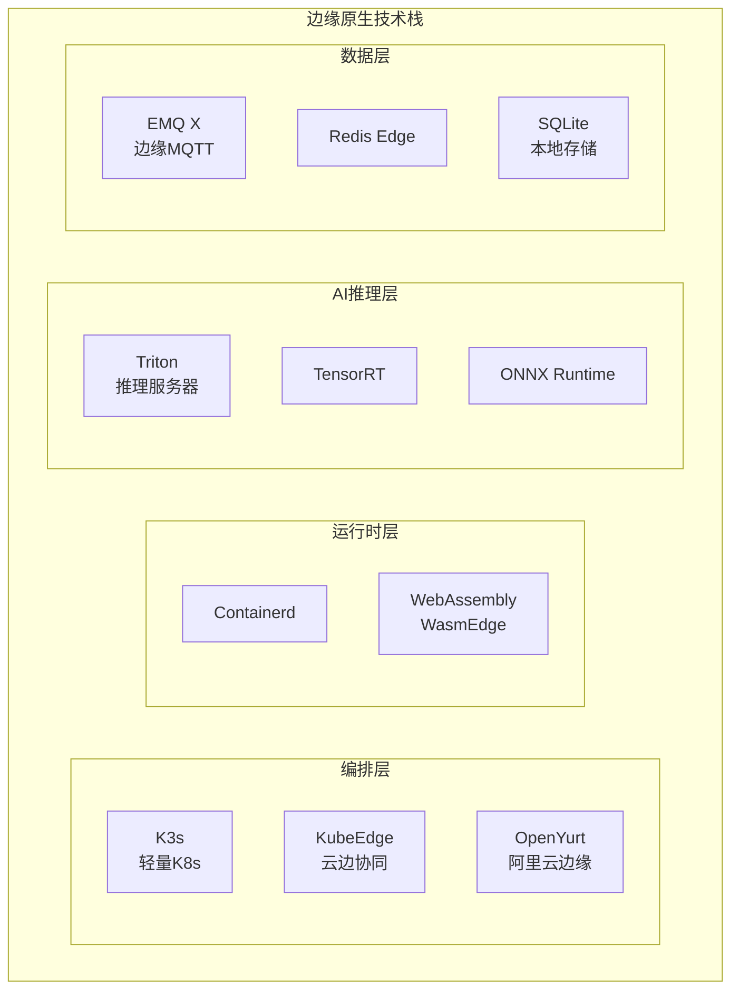

# 边缘计算架构（2024-2025）

## 概述

边缘计算作为云计算的延伸，将计算能力下沉至网络边缘，实现毫秒级响应和带宽优化。2024-2025年，随着5G-A（5G-Advanced）商用部署和AI推理需求爆发，边缘计算与云原生、AI深度融合，形成"云-边-端"协同的智能计算架构。Gartner预测，到2025年75%的企业数据将在边缘侧处理。

---

## 1. 边缘计算架构模式

### 1.1 云-边-端协同架构



### 1.2 边缘计算分层模型

| 层级 | 位置 | 延迟 | 计算能力 | 典型应用 |
|------|------|------|----------|----------|
| **云端** | 数据中心 | 50-100ms | 无限 | 训练、大数据 |
| **区域边缘** | 省级/大区 | 10-20ms | 中等 | 内容分发、视频 |
| **近场边缘** | 园区/街道 | 5-10ms | 受限 | 实时推理、控制 |
| **现场边缘** | 设备旁 | 1-5ms | 极小 | PLC、RTU |
| **终端** | 设备内 | <1ms | 嵌入式 | 推理芯片、MCU |

---

## 2. 云边协同技术架构

### 2.1 KubeEdge 边缘编排



### 2.2 KubeEdge 部署配置

```yaml
# cloudcore.yaml - 云端核心配置
apiVersion: v1
kind: ConfigMap
metadata:
  name: cloudcore
  namespace: kubeedge
data:
  cloudcore.yaml: |
    apiVersion: cloudcore.config.kubeedge.io/v1alpha2
    kind: CloudCore
    kubeAPIConfig:
      kubeConfig: /etc/kubeedge/kubeconfig
      master: ""
    modules:
      cloudHub:
        nodeLimit: 10000          # 支持节点数
        tlsCAFile: /etc/kubeedge/ca/ca.crt
        tlsCertFile: /etc/kubeedge/certs/server.crt
        tlsPrivateKeyFile: /etc/kubeedge/certs/server.key
        unixsocket:
          enable: true
          address: unix:///var/lib/kubeedge/kubeedge.sock
        websocket:
          enable: true
          address: 0.0.0.0:10000
          port: 10000
        https:
          enable: true
          address: 0.0.0.0:10002
          port: 10002
      deviceController:
        enable: true
      syncController:
        enable: true
        # 边缘节点离线后数据持久化时间
        buffer:
          messageStoreType: sqlite
          messageBufferSize: 10240

---
# edgecore.yaml - 边缘节点配置
apiVersion: v1
kind: ConfigMap
metadata:
  name: edgecore
  namespace: kubeedge
data:
  edgecore.yaml: |
    apiVersion: edgecore.config.kubeedge.io/v1alpha2
    kind: EdgeCore
    modules:
      edged:
        enable: true
        nodeIP: 192.168.1.100
        clusterDNS: 169.254.96.16
        clusterDomain: cluster.local
        podSandboxImage: kubeedge/pause:3.6
        # 边缘容器运行时
        runtimeType: remote
        remoteRuntimeEndpoint: unix:///run/containerd/containerd.sock
        remoteImageEndpoint: unix:///run/containerd/containerd.sock
      edgeHub:
        enable: true
        heartbeat: 15
        projectID: e632aba927ea4ac2b575ec1603d56f10
        quic:
          enable: false
        websocket:
          enable: true
          server: 192.168.1.1:10000
          handshakeTimeout: 30
          writeDeadline: 15
      metaManager:
        enable: true
        # 边缘本地持久化
        metaServer:
          enable: true
          server: 127.0.0.1:10550
      eventBus:
        enable: true
        mqttMode: 2              # 外置MQTT
        mqttServer: tcp://127.0.0.1:1883
```

### 2.3 边缘AI推理部署

```yaml
# edge-ai-deployment.yaml
apiVersion: apps/v1
kind: Deployment
metadata:
  name: edge-inference-service
  namespace: edge-apps
spec:
  replicas: 1
  selector:
    matchLabels:
      app: edge-inference
  template:
    metadata:
      labels:
        app: edge-inference
    spec:
      nodeSelector:
        node-type: edge-gpu
      affinity:
        nodeAffinity:
          requiredDuringSchedulingIgnoredDuringExecution:
            nodeSelectorTerms:
            - matchExpressions:
              - key: edge-node-type
                operator: In
                values:
                - nvidia-jetson
                - coral-edge-tpu
      containers:
      - name: inference
        image: edge-registry/edge-inference:v2.1
        resources:
          limits:
            nvidia.com/gpu: 1
            memory: "8Gi"
          requests:
            memory: "4Gi"
        env:
        - name: MODEL_PATH
          value: /models/edge-optimized.onnx
        - name: INFERENCE_DEVICE
          value: "cuda"
        - name: BATCH_SIZE
          value: "4"
        volumeMounts:
        - name: model-volume
          mountPath: /models
        - name: config
          mountPath: /config
        livenessProbe:
          httpGet:
            path: /health
            port: 8080
          initialDelaySeconds: 30
          periodSeconds: 10
      volumes:
      - name: model-volume
        hostPath:
          path: /opt/edge/models
          type: Directory
      - name: config
        configMap:
          name: inference-config
      # 边缘节点污点容忍
      tolerations:
      - key: "node.kubernetes.io/unreachable"
        operator: "Exists"
        effect: "NoExecute"
        tolerationSeconds: 300
      - key: "edge-node"
        operator: "Equal"
        value: "true"
        effect: "NoSchedule"
```

---

## 3. 边缘AI推理架构

### 3.1 边缘AI推理流程



### 3.2 模型优化与部署

```python
# 边缘设备模型优化 pipeline
import torch
import onnx
from onnxruntime.quantization import quantize_dynamic, QuantType

class EdgeModelOptimizer:
    """
    边缘设备模型优化器
    支持 TensorRT, ONNX Runtime, OpenVINO
    """

    def __init__(self, model_path: str, target_device: str):
        self.model_path = model_path
        self.target_device = target_device  # 'jetson', 'coral', 'nuc'

    def optimize(self) -> str:
        """执行完整优化流程"""
        # 1. 转换为ONNX
        onnx_path = self._to_onnx()

        # 2. 动态量化
        quant_path = self._quantize(onnx_path)

        # 3. 设备特定优化
        if self.target_device == 'jetson':
            return self._to_tensorrt(quant_path)
        elif self.target_device == 'coral':
            return self._to_tflite(quant_path)
        else:
            return quant_path

    def _to_onnx(self) -> str:
        """PyTorch模型转ONNX"""
        model = torch.load(self.model_path)
        dummy_input = torch.randn(1, 3, 224, 224)

        onnx_path = self.model_path.replace('.pth', '.onnx')
        torch.onnx.export(
            model, dummy_input, onnx_path,
            input_names=['input'],
            output_names=['output'],
            dynamic_axes={'input': {0: 'batch_size'}},
            opset_version=13
        )
        return onnx_path

    def _quantize(self, onnx_path: str) -> str:
        """INT8动态量化 - 模型大小减半"""
        quant_path = onnx_path.replace('.onnx', '_int8.onnx')
        quantize_dynamic(
            model_input=onnx_path,
            model_output=quant_path,
            weight_type=QuantType.QInt8,
            optimize_model=True
        )
        return quant_path

    def _to_tensorrt(self, onnx_path: str) -> str:
        """NVIDIA Jetson TensorRT优化"""
        import tensorrt as trt

        logger = trt.Logger(trt.Logger.INFO)
        builder = trt.Builder(logger)
        network = builder.create_network(
            1 << int(trt.NetworkDefinitionCreationFlag.EXPLICIT_BATCH)
        )
        parser = trt.OnnxParser(network, logger)

        with open(onnx_path, 'rb') as f:
            parser.parse(f.read())

        config = builder.create_builder_config()
        config.max_workspace_size = 1 << 30  # 1GB
        config.set_flag(trt.BuilderFlag.FP16)  # FP16推理

        # Jetson Orin优化
        config.set_flag(trt.BuilderFlag.DIRECT_IO)

        engine_path = onnx_path.replace('.onnx', '.trt')
        engine = builder.build_engine(network, config)

        with open(engine_path, 'wb') as f:
            f.write(engine.serialize())

        return engine_path

# 边缘推理运行时
class EdgeInferenceRuntime:
    """轻量级边缘推理运行时"""

    def __init__(self, model_path: str, device: str = 'cpu'):
        import onnxruntime as ort

        # 根据设备选择执行提供程序
        if device == 'cuda':
            providers = ['CUDAExecutionProvider', 'CPUExecutionProvider']
        elif device == 'tensorrt':
            providers = ['TensorrtExecutionProvider', 'CUDAExecutionProvider']
        else:
            providers = ['CPUExecutionProvider']

        self.session = ort.InferenceSession(model_path, providers=providers)
        self.input_name = self.session.get_inputs()[0].name

    def infer(self, input_data: np.ndarray) -> np.ndarray:
        """执行推理"""
        return self.session.run(None, {self.input_name: input_data})[0]
```

---

## 4. 5G MEC 架构

### 4.1 5G MEC参考架构



### 4.2 MEC应用部署配置

```yaml
# mec-app-deployment.yaml - 5G MEC应用部署
apiVersion: mec.app/v1
kind: MECApplication
metadata:
  name: video-analytics-app
  namespace: mec-system
spec:
  # 应用基本信息
  appInfo:
    name: "智能视频分析"
    version: "2.0.0"
    provider: "EdgeAI Corp"
    description: "基于AI的实时视频分析服务"

  # 网络要求
  networkRequirements:
    bandwidth: 1000  # Mbps
    latency: 10      # ms
    jitter: 2        # ms
    packetLoss: 0.001 # 0.1%

  # 计算资源
  computeResources:
    cpu: 8
    memory: 32Gi
    gpu: 2
    storage: 100Gi

  # 部署位置要求
  placement:
    locationConstraints:
      - type: proximity
        target: "base-station"
        ids: ["gNB-001", "gNB-002"]
    affinity:
      - labelSelector:
          matchLabels:
            mec-zone: "industrial-park"

  # 网络服务
  networkServices:
    - type: UPF
      dnns: ["video-analytics.local"]
      trafficRules:
        - priority: 1
          trafficFilter:
            srcAddress: ["10.0.0.0/24"]
            dstPort: ["8080", "9090"]
          action: "ALLOW"

    - type: AF
      influenceTrafficRouting: true
      qosReference: "QOS_VIDEO_STREAMING"

  # 生命周期管理
  lifecycle:
    maxInstance: 3
    minInstance: 1
    autoScaling:
      enabled: true
      metrics:
        - type: cpu
          targetAverageUtilization: 70
        - type: memory
          targetAverageUtilization: 80
      scaleUp:
        stabilizationWindow: 60
        policies:
          - type: percent
            value: 50
            periodSeconds: 60
      scaleDown:
        stabilizationWindow: 300
        policies:
          - type: percent
            value: 10
            periodSeconds: 60
```

---

## 5. 2024-2025技术趋势

### 5.1 边缘AI芯片发展

| 芯片 | 厂商 | 算力 | 功耗 | 适用场景 |
|------|------|------|------|----------|
| Jetson Orin Nano | NVIDIA | 40 TOPS | 5-15W | 机器人、无人机 |
| Jetson AGX Orin | NVIDIA | 275 TOPS | 15-60W | 自动驾驶、医疗 |
| Coral TPU | Google | 4 TOPS | 2W | IoT、嵌入式 |
| Intel NCS2 | Intel | 1 TOPS | 1W | 边缘推理 |
| Apple Neural Engine | Apple | 38 TOPS | - | 移动设备 |
| Qualcomm Cloud AI | Qualcomm | 400 TOPS | 75W | 边缘服务器 |

### 5.2 边缘原生技术栈



### 5.3 联邦学习与边缘隐私

```python
# 边缘联邦学习框架
class FederatedEdgeLearning:
    """
    边缘联邦学习 - 数据不出域的协同训练
    """

    def __init__(self, edge_nodes: List[str], aggregation_server: str):
        self.edge_nodes = edge_nodes
        self.aggregation_server = aggregation_server
        self.round = 0

    def local_train(self, node_id: str, global_weights: dict) -> dict:
        """边缘节点本地训练"""
        # 加载本地数据（不出域）
        local_data = self.load_local_data(node_id)

        # 使用全局权重初始化
        model = self.create_model()
        model.load_state_dict(global_weights)

        # 本地训练
        optimizer = torch.optim.SGD(model.parameters(), lr=0.01)
        for epoch in range(5):
            for batch in local_data:
                optimizer.zero_grad()
                loss = model(batch)
                loss.backward()
                optimizer.step()

        # 返回梯度或权重更新
        return model.state_dict()

    def federated_aggregate(self, local_updates: List[dict]) -> dict:
        """
        联邦聚合 - 服务器端聚合
        FedAvg算法
        """
        global_weights = {}

        # 加权平均
        total_samples = sum(u['num_samples'] for u in local_updates)

        for key in local_updates[0]['weights'].keys():
            global_weights[key] = sum(
                u['weights'][key] * (u['num_samples'] / total_samples)
                for u in local_updates
            )

        return global_weights

    def secure_aggregation(self, local_updates: List[dict]) -> dict:
        """
        安全聚合 - 差分隐私
        """
        # 添加噪声实现差分隐私
        epsilon = 1.0  # 隐私预算
        sensitivity = 2.0  # 敏感度

        noise_scale = sensitivity / epsilon

        aggregated = self.federated_aggregate(local_updates)

        # 添加高斯噪声
        for key in aggregated:
            noise = torch.randn_like(aggregated[key]) * noise_scale
            aggregated[key] += noise

        return aggregated
```

---

## 6. 最佳实践与运维

### 6.1 边缘部署清单

- [ ] 边缘节点资源评估（CPU/内存/存储/GPU）
- [ ] 网络带宽与延迟基线测试
- [ ] 离线容灾策略（断网续传）
- [ ] 模型加密与签名验证
- [ ] 边缘日志聚合方案
- [ ] OTA更新机制

### 6.2 监控告警配置

```yaml
# edge-monitoring.yaml
apiVersion: monitoring.coreos.com/v1
kind: ServiceMonitor
metadata:
  name: edge-metrics
  namespace: monitoring
spec:
  selector:
    matchLabels:
      app: edge-node
  endpoints:
  - port: metrics
    interval: 30s
    path: /metrics
    relabelings:
    - sourceLabels: [__address__]
      targetLabel: edge_location
      replacement: "factory-zone-1"

  # 边缘特定指标
  metricRelabelings:
  - sourceLabels: [__name__]
    regex: 'edge_inference_latency_seconds|edge_gpu_utilization|edge_network_latency'
    action: keep

---
# 边缘告警规则
apiVersion: monitoring.coreos.com/v1
kind: PrometheusRule
metadata:
  name: edge-alerts
spec:
  groups:
  - name: edge.rules
    rules:
    - alert: EdgeNodeOffline
      expr: up{job="edge-nodes"} == 0
      for: 5m
      labels:
        severity: critical
      annotations:
        summary: "边缘节点离线"

    - alert: EdgeHighInferenceLatency
      expr: histogram_quantile(0.95, edge_inference_latency_seconds) > 0.1
      for: 2m
      labels:
        severity: warning
      annotations:
        summary: "边缘推理延迟过高"
```

---

## 参考资源

- [KubeEdge官方文档](https://kubeedge.io/)
- [CNCF边缘计算白皮书](https://www.cncf.io/reports/edge-computing/)
- [5G MEC技术规范](https://www.etsi.org/technologies/multi-access-edge-computing)
- [NVIDIA Jetson文档](https://developer.nvidia.com/embedded/jetson)
- [EdgeX Foundry](https://www.edgexfoundry.org/)
