# 雾计算架构详解

> 介于云端与边缘之间的分布式计算层，实现计算、存储、网络资源的层次化部署

---

## 📋 目录

- [1. 雾计算概述](#1-雾计算概述)
- [2. 雾计算参考架构](#2-雾计算参考架构)
- [3. 分层架构详解](#3-分层架构详解)
- [4. 雾节点功能](#4-雾节点功能)
- [5. 应用场景](#5-应用场景)
- [6. 开源实现](#6-开源实现)

---

## 1. 雾计算概述

### 1.1 什么是雾计算

雾计算（Fog Computing）是一种分布式计算范式，将云计算能力扩展到网络边缘，介于云端数据中心和终端设备之间。雾计算由Cisco于2014年提出，旨在解决纯云计算在延迟、带宽和隐私方面的局限。

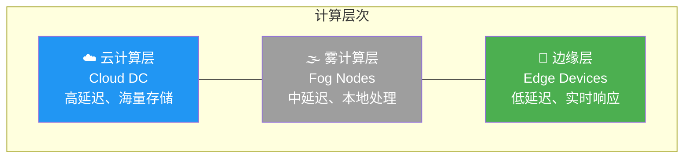

### 1.2 雾计算 vs 云计算 vs 边缘计算

| 特性 | 云计算 | 雾计算 | 边缘计算 |
|:---|:---|:---|:---|
| **位置** | 远程数据中心 | 局域网/接入网 | 设备本地 |
| **延迟** | 100ms+ | 10-100ms | <10ms |
| **计算能力** | 极强 | 中等 | 有限 |
| **存储容量** | PB级 | TB级 | GB级 |
| **部署规模** | 集中式 | 分布式 | 超分布式 |
| **管理复杂度** | 相对简单 | 中等 | 复杂 |
| **典型应用** | 大数据分析、AI训练 | IoT汇聚、实时分析 | 工业控制、自动驾驶 |

**形式化定义**：

设系统有 $n$ 层计算节点，第 $i$ 层节点集合为 $L_i$，则雾计算层 $F$ 满足：

$$
F = \{f | D_{cloud}(f) > D_{edge}(f) \land Latency(f) < Latency(cloud)\}
$$

其中 $D$ 表示距离，$Latency$ 表示到终端的延迟。

### 1.3 为什么需要雾计算

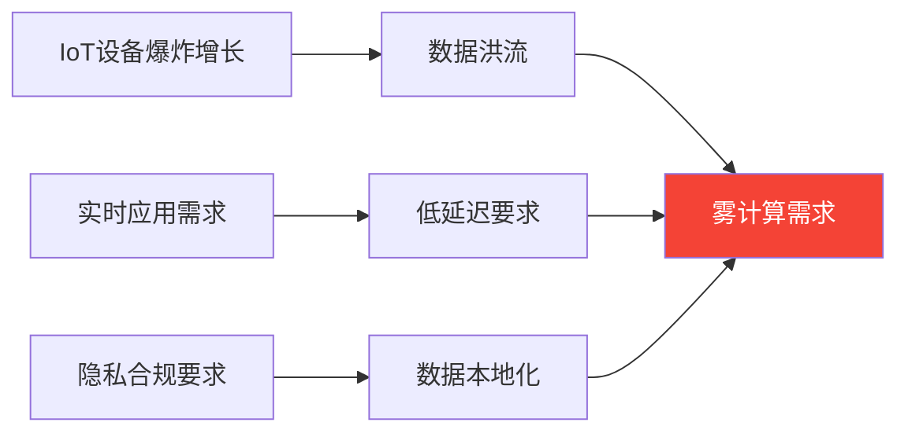

**典型场景挑战**：

- **智能交通**：每辆车每天产生数GB数据，全部上传云端不现实
- **工业IoT**：产线控制要求毫秒级响应
- **智慧城市**：摄像头视频分析需要本地隐私保护

---

## 2. 雾计算参考架构

### 2.1 NIST雾计算参考架构

NIST（美国国家标准与技术研究院）定义的雾计算参考架构包含以下核心组件：

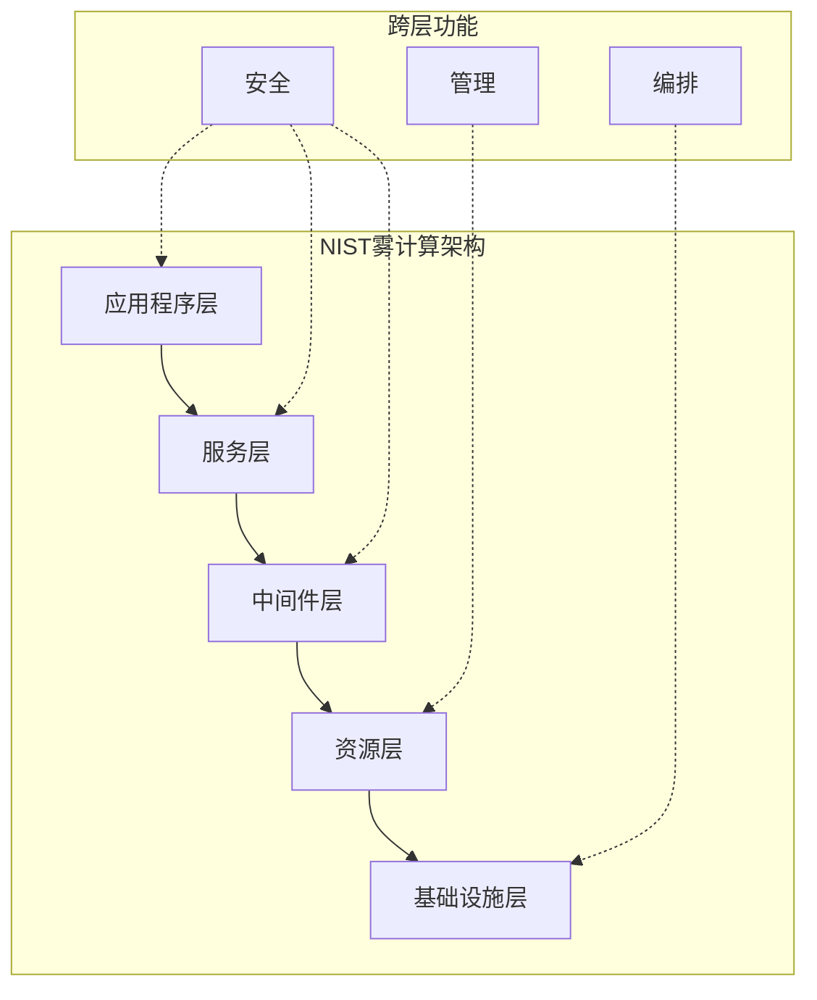

### 2.2 系统架构组件

| 层次 | 功能 | 典型组件 |
|:---|:---|:---|
| **应用层** | 业务逻辑实现 | 视频分析、预测维护 |
| **服务层** | 通用服务提供 | 数据聚合、流处理 |
| **中间件层** | 通信与协调 | MQTT broker、服务网格 |
| **资源层** | 资源抽象与管理 | 容器运行时、虚拟化 |
| **基础设施层** | 物理资源 | 服务器、网关、网络 |

---

## 3. 分层架构详解

### 3.1 云-雾-边缘三层架构

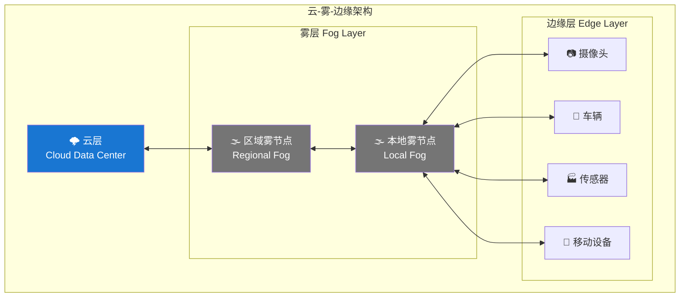

**各层职责**：

| 层次 | 计算任务 | 数据特征 | 决策类型 |
|:---|:---|:---|:---|
| **云** | 全局优化、AI训练、长期存储 | 聚合数据、历史数据 | 战略决策 |
| **雾** | 区域协调、数据过滤、实时分析 | 区域数据、上下文数据 | 战术决策 |
| **边缘** | 实时控制、数据采集、本地推理 | 原始数据、流数据 | 操作决策 |

### 3.2 数据流与任务编排

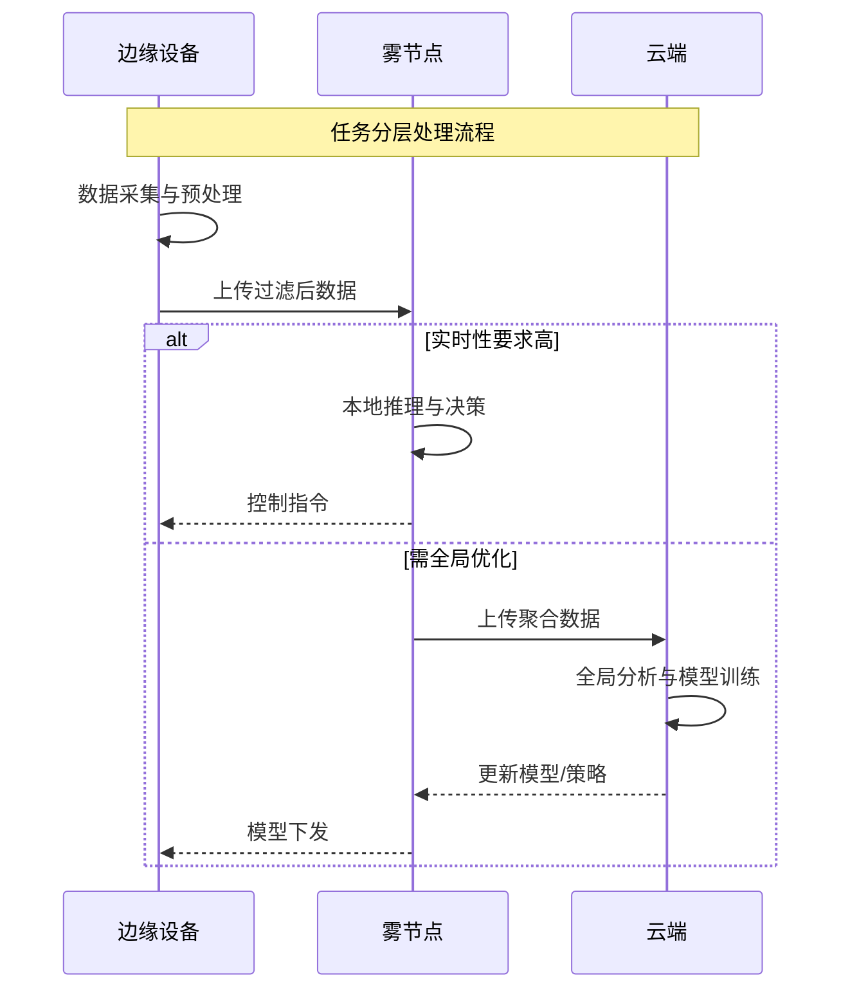

**任务调度策略**：

设任务 $T$ 的特征为 $(D_{size}, D_{deadline}, C_{compute})$，则任务放置决策：

$$
Placement(T) = \begin{cases}
Edge & \text{if } D_{deadline} < 10ms \\
Fog & \text{if } 10ms \leq D_{deadline} < 100ms \\
Cloud & \text{otherwise}
\end{cases}
$$

### 3.3 雾节点层次结构

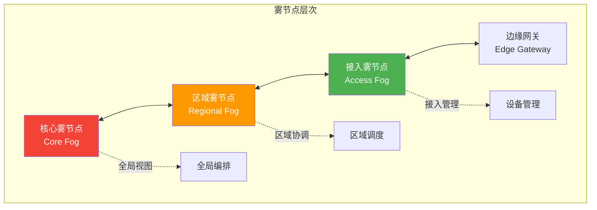

| 类型 | 位置 | 覆盖范围 | 典型延迟 |
|:---|:---|:---|:---:|
| **核心雾节点** | 城域网/数据中心 | 城市级 | 10-50ms |
| **区域雾节点** | 基站/接入点 | 街区级 | 5-20ms |
| **接入雾节点** | 园区/建筑 | 建筑级 | 1-10ms |
| **边缘网关** | 现场 | 设备级 | <5ms |

---

## 4. 雾节点功能

### 4.1 核心功能模块

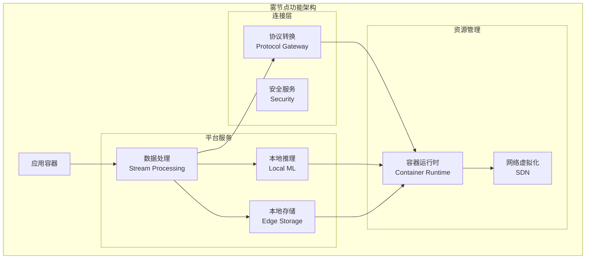

**功能详解**：

| 模块 | 职责 | 技术实现 |
|:---|:---|:---|
| **数据处理** | 流式计算、数据过滤、聚合 | Apache Flink, Kafka Streams |
| **本地存储** | 缓存、时序数据库 | Redis, InfluxDB |
| **本地推理** | 模型推理、特征提取 | TensorFlow Lite, ONNX Runtime |
| **协议转换** | 设备协议到标准协议 | MQTT, CoAP, Modbus网关 |
| **安全管理** | 身份认证、加密传输 | mTLS, SPIFFE |

### 4.2 雾节点实现代码示例

```python
# 雾节点任务调度器示例
import asyncio
from enum import Enum
from typing import Dict, List, Optional
from dataclasses import dataclass

class TaskPriority(Enum):
    CRITICAL = 1    # 关键任务：本地执行
    HIGH = 2        # 高优先级：优先本地，可上云
    NORMAL = 3      # 普通：根据负载决定
    LOW = 4         # 低优先级：上云执行

@dataclass
class Task:
    task_id: str
    priority: TaskPriority
    deadline_ms: int
    compute_complexity: float  # 计算复杂度
    data_size_mb: float
    required_resources: Dict[str, float]

class FogNodeScheduler:
    """雾节点任务调度器"""

    def __init__(self, node_id: str, cloud_endpoint: str):
        self.node_id = node_id
        self.cloud_endpoint = cloud_endpoint
        self.local_resources = {
            'cpu': 8.0,      # CPU核心数
            'memory': 32.0,  # GB
            'gpu': 1.0       # GPU数量
        }
        self.running_tasks: Dict[str, Task] = {}
        self.task_queue: asyncio.Queue = asyncio.Queue()

    async def submit_task(self, task: Task) -> str:
        """提交任务到雾节点"""
        await self.task_queue.put(task)

        # 立即进行调度决策
        decision = self.schedule_decision(task)

        if decision == 'local':
            await self.execute_local(task)
        elif decision == 'upstream':
            await self.offload_to_cloud(task)
        elif decision == 'peer':
            await self.offload_to_peer(task)

        return f"Task {task.task_id} scheduled to {decision}"

    def schedule_decision(self, task: Task) -> str:
        """调度决策：本地执行、上云、或转发到对等节点"""

        # 关键任务必须本地执行
        if task.priority == TaskPriority.CRITICAL:
            return 'local'

        # 检查本地资源
        available_resources = self.get_available_resources()

        # 计算本地执行可行性得分
        local_score = self.calculate_local_score(task, available_resources)
        cloud_score = self.calculate_cloud_score(task)

        # 延迟敏感任务优先本地
        if task.deadline_ms < 50:
            return 'local' if local_score > 0.3 else 'peer'

        # 大数据量任务考虑带宽
        if task.data_size_mb > 100:
            return 'local' if local_score > cloud_score else 'upstream'

        return 'local' if local_score > cloud_score else 'upstream'

    def get_available_resources(self) -> Dict[str, float]:
        """获取当前可用资源"""
        used = {'cpu': 0.0, 'memory': 0.0, 'gpu': 0.0}

        for task in self.running_tasks.values():
            for resource, amount in task.required_resources.items():
                used[resource] = used.get(resource, 0) + amount

        return {
            r: self.local_resources.get(r, 0) - used.get(r, 0)
            for r in self.local_resources
        }

    def calculate_local_score(self, task: Task,
                             available: Dict[str, float]) -> float:
        """计算本地执行得分（0-1）"""
        # 资源满足度
        resource_satisfaction = 1.0
        for resource, required in task.required_resources.items():
            available_amount = available.get(resource, 0)
            if available_amount < required:
                return 0.0  # 资源不足
            resource_satisfaction *= (available_amount / self.local_resources[resource])

        # 延迟优势
        latency_advantage = 1.0 - (task.deadline_ms / 1000)

        # 计算复杂度适配
        complexity_factor = 1.0 if task.compute_complexity < 0.7 else 0.5

        return (resource_satisfaction * 0.4 +
                latency_advantage * 0.4 +
                complexity_factor * 0.2)

    def calculate_cloud_score(self, task: Task) -> float:
        """计算上云执行得分"""
        # 带宽影响
        bandwidth_factor = 1.0 - (task.data_size_mb / 1000)

        # 延迟惩罚
        latency_penalty = task.deadline_ms / 1000

        # 云上计算优势
        cloud_compute = 0.8  # 假设云上计算能力更强

        return (bandwidth_factor * 0.3 +
                cloud_compute * 0.5 -
                latency_penalty * 0.2)

    async def execute_local(self, task: Task):
        """本地执行任务"""
        print(f"[Fog-{self.node_id}] 本地执行任务: {task.task_id}")
        self.running_tasks[task.task_id] = task

        # 模拟任务执行
        await asyncio.sleep(task.compute_complexity * 0.1)

        del self.running_tasks[task.task_id]
        print(f"[Fog-{self.node_id}] 任务完成: {task.task_id}")

    async def offload_to_cloud(self, task: Task):
        """任务上云执行"""
        print(f"[Fog-{self.node_id}] 任务上云: {task.task_id}")
        # 实际实现：通过gRPC/HTTP调用云端服务

    async def offload_to_peer(self, task: Task):
        """任务转发到对等雾节点"""
        print(f"[Fog-{self.node_id}] 任务转发: {task.task_id}")
        # 实际实现：查找负载较低的对等节点


# 使用示例
async def main():
    scheduler = FogNodeScheduler("fog-node-001", "cloud.example.com")

    # 提交关键任务
    critical_task = Task(
        task_id="task-001",
        priority=TaskPriority.CRITICAL,
        deadline_ms=10,
        compute_complexity=0.5,
        data_size_mb=5,
        required_resources={'cpu': 2.0, 'memory': 4.0}
    )

    # 提交普通任务
    normal_task = Task(
        task_id="task-002",
        priority=TaskPriority.NORMAL,
        deadline_ms=500,
        compute_complexity=0.9,
        data_size_mb=200,
        required_resources={'cpu': 4.0, 'memory': 8.0}
    )

    await asyncio.gather(
        scheduler.submit_task(critical_task),
        scheduler.submit_task(normal_task)
    )

if __name__ == "__main__":
    asyncio.run(main())
```

---

## 5. 应用场景

### 5.1 智能交通

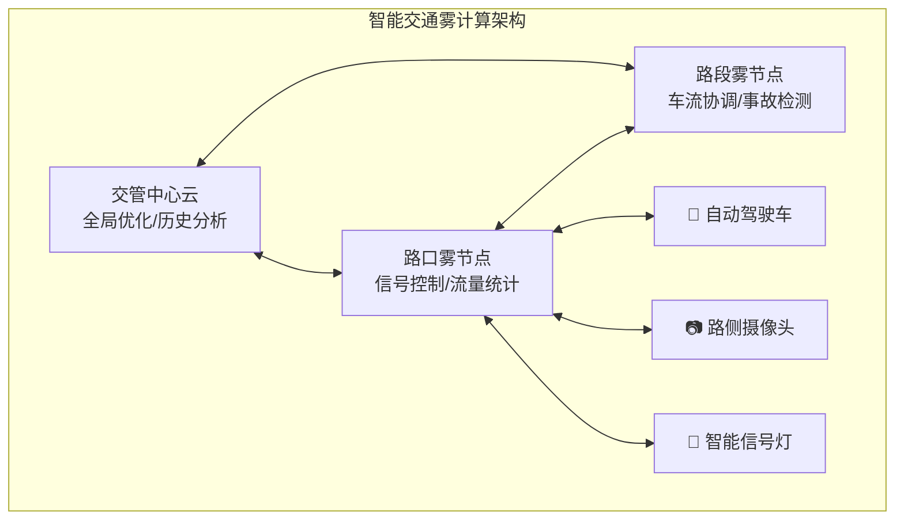

**雾计算价值**：

| 场景 | 延迟要求 | 雾节点作用 |
|:---|:---:|:---|
| **车路协同** | <20ms | 实时交通信息共享 |
| **信号优化** | <100ms | 区域信号灯协调 |
| **事故检测** | <50ms | 视频分析，快速响应 |

### 5.2 工业IoT

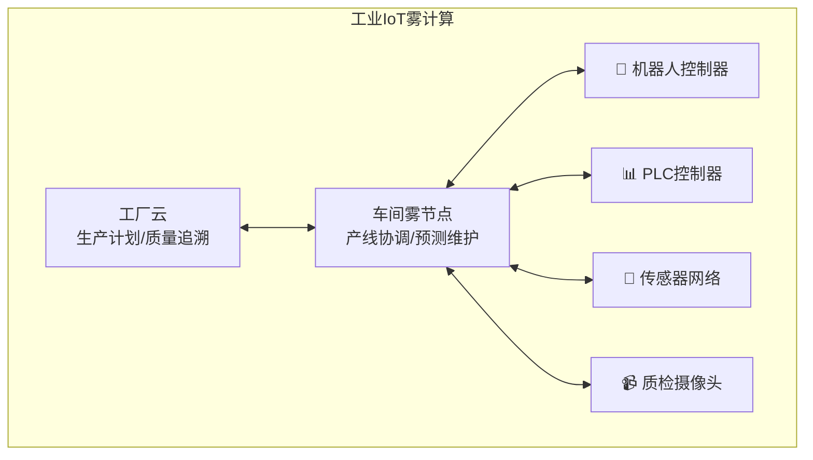

**工业场景需求**：

- **实时控制**：PLC控制周期 < 10ms
- **预测维护**：本地分析设备振动数据
- **质量检测**：产线视觉检测，毫秒级响应

---

## 6. 开源实现

### 6.1 KubeEdge

KubeEdge是Kubernetes原生的边缘计算平台，支持云边协同。

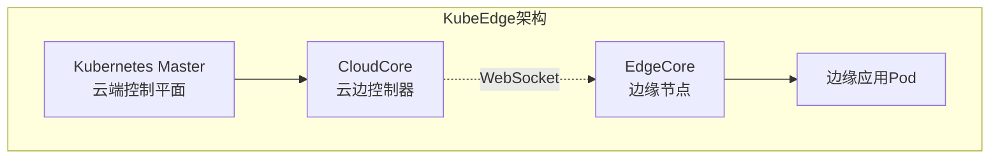

**核心特性**：

| 特性 | 说明 |
|:---|:---|
| **云边协同** | 应用从云端编排到边缘执行 |
| **边缘自治** | 断网时边缘节点可独立运行 |
| **设备管理** | 支持MQTT/Modbus等设备接入 |
| **数据路由** | 边缘到云的数据流管理 |

```yaml
# KubeEdge设备模型示例
apiVersion: devices.kubeedge.io/v1alpha2
kind: Device
metadata:
  name: temperature-sensor
  labels:
    description: 'temperature sensor'
spec:
  deviceModelRef:
    name: sensor-model
  nodeSelector:
    nodeSelectorTerms:
      - matchExpressions:
          - key: 'node-role.kubernetes.io/edge'
            operator: Exists
  protocol:
    mqtt:
      server: tcp://127.0.0.1:1883
  propertyVisitors:
    - propertyName: temperature
      mqtt:
        topic: /device/temperature
```

### 6.2 EdgeX Foundry

EdgeX Foundry是Linux基金会托管的 vendor-neutral 开源边缘计算框架。

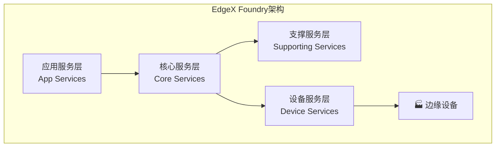

**服务层职责**：

| 层 | 服务 | 功能 |
|:---|:---|:---|
| **应用服务** | App Service Configurable | 数据导出到云端/企业系统 |
| **核心服务** | Core Data, Metadata, Command | 数据持久化、设备元数据、命令下发 |
| **支撑服务** | Rules Engine, Scheduling, Alerts | 规则引擎、调度、告警 |
| **设备服务** | Device MQTT, Modbus, etc. | 设备协议适配 |

**雾计算定位**：

- EdgeX Foundry可作为雾节点的软件栈
- 支持多实例部署形成雾层
- 通过MQTT/NATS实现雾节点间通信

---

## 参考资料

1. NIST. "Fog Computing Conceptual Model", NIST Special Publication 500-325, 2018
2. Cisco. "Fog Computing and the Internet of Things: Extend the Cloud to Where the Things Are", White Paper
3. OpenFog Consortium. "OpenFog Reference Architecture for Fog Computing", 2017
4. Hong, Z., et al. "KubeEdge: A Kubernetes Native Edge Computing Framework", IEEE EDGE 2021

## 相关主题

- [边缘计算架构](./边缘计算架构.md) - 边缘层技术详解
- [分布式llm推理架构](./分布式llm推理架构.md) - 雾计算在AI推理中的应用
- [serverless分布式系统](./serverless分布式系统.md) - Serverless与雾计算结合

---

**文档版本**：v1.0
**最后更新**：2026-04-04
**作者**：分布式计算知识库团队
