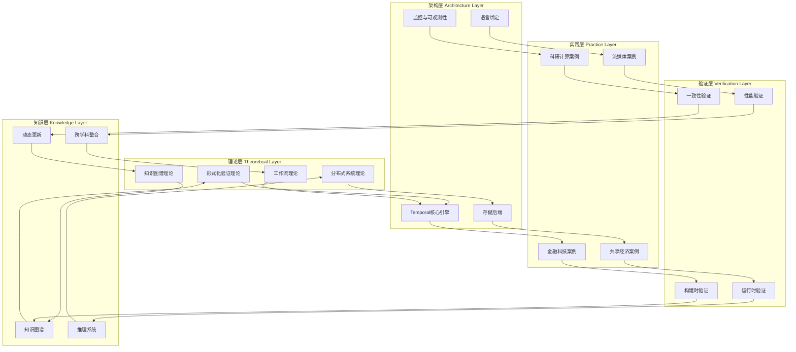
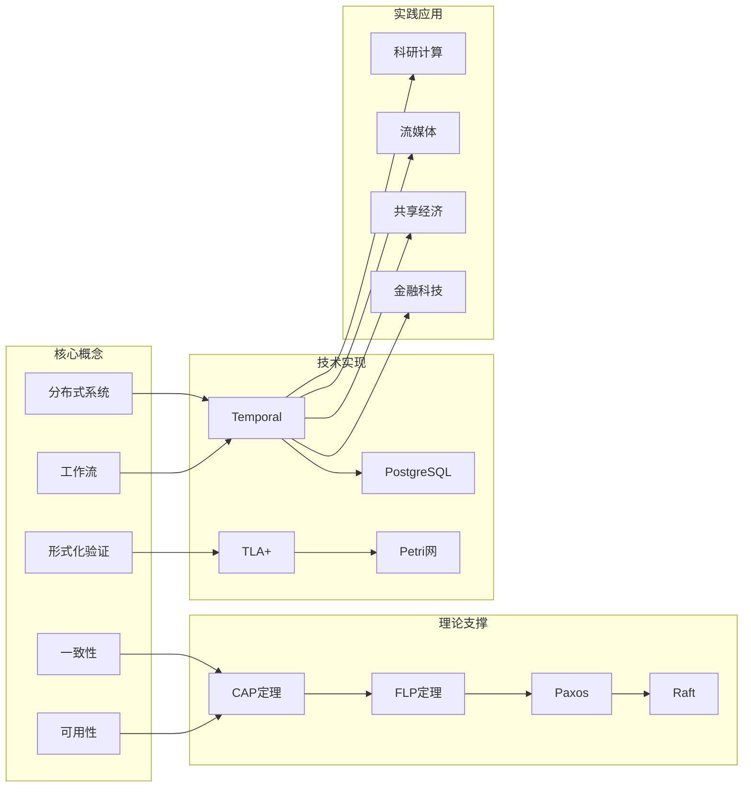
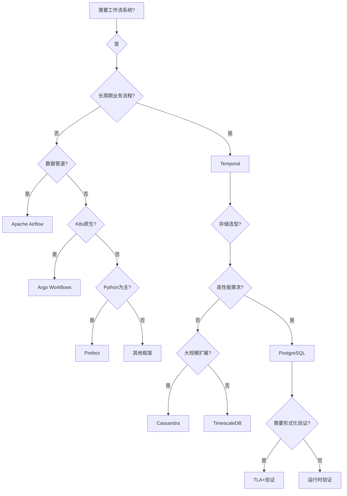
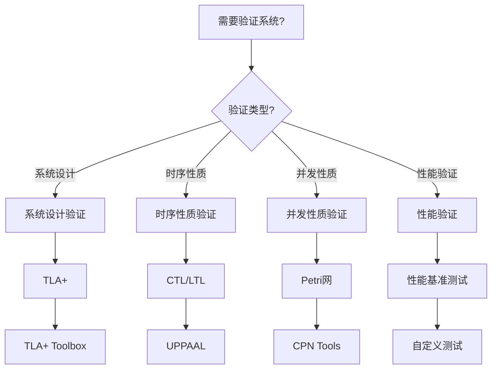
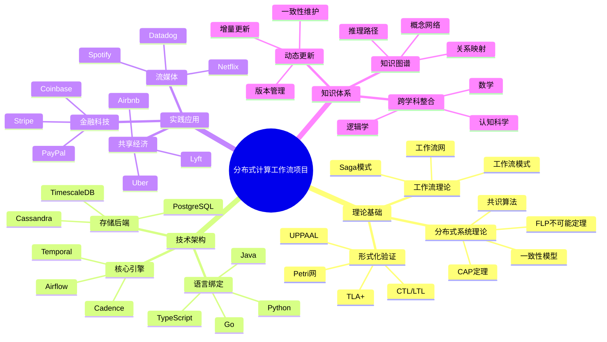

# 项目总体模型框架与改进计划

**文档版本**：v1.0
**创建时间**：2025年11月28日
**最后更新**：2025年11月28日
**状态**：🔄 进行中

---

## 📋 执行摘要

本文档旨在建立项目的**总体模型框架**，通过**网络和学术资源对标**、**知识关联框架构建**、**推理脉络和决策树**、**思维导图和多维矩阵**等多种思维表征方式，全面梳理项目知识结构，建立文档间的链接关系，并制定详细的改进和完善计划。

---

## 一、总体模型框架

### 1.1 项目核心模型：分布式计算工作流系统

### 1.2 知识关联模型

---

## 二、网络和学术资源对标

### 2.1 Wikipedia资源对标

#### 2.1.1 核心概念对标

| 项目概念 | Wikipedia条目 | 关联度 | 状态 |
|---------|--------------|--------|------|
| **分布式系统** | [Distributed computing](https://en.wikipedia.org/wiki/Distributed_computing) | ⭐⭐⭐⭐⭐ | ✅ 已关联 |
| **工作流** | [Workflow](https://en.wikipedia.org/wiki/Workflow) | ⭐⭐⭐⭐⭐ | ✅ 已关联 |
| **形式化验证** | [Formal verification](https://en.wikipedia.org/wiki/Formal_verification) | ⭐⭐⭐⭐⭐ | ✅ 已关联 |
| **TLA+** | [TLA+](https://en.wikipedia.org/wiki/TLA%2B) | ⭐⭐⭐⭐⭐ | ✅ 已关联 |
| **Temporal** | [Temporal (workflow engine)](https://en.wikipedia.org/wiki/Temporal_(workflow_engine)) | ⭐⭐⭐⭐⭐ | ✅ 已关联 |
| **CAP定理** | [CAP theorem](https://en.wikipedia.org/wiki/CAP_theorem) | ⭐⭐⭐⭐⭐ | ✅ 已关联 |
| **Petri网** | [Petri net](https://en.wikipedia.org/wiki/Petri_net) | ⭐⭐⭐⭐⭐ | ✅ 已关联 |
| **知识图谱** | [Knowledge graph](https://en.wikipedia.org/wiki/Knowledge_graph) | ⭐⭐⭐⭐ | ⏳ 待完善 |
| **事件溯源** | [Event sourcing](https://en.wikipedia.org/wiki/Event_sourcing) | ⭐⭐⭐⭐ | ⏳ 待完善 |
| **Saga模式** | [Saga pattern](https://en.wikipedia.org/wiki/Saga_pattern) | ⭐⭐⭐⭐ | ⏳ 待完善 |

#### 2.1.2 理论框架对标

| 理论框架 | Wikipedia条目 | 项目文档 | 关联状态 |
|---------|--------------|---------|---------|
| **时序逻辑** | [Temporal logic](https://en.wikipedia.org/wiki/Temporal_logic) | `docs/03-formal-verification/形式化验证理论.md` | ✅ 已关联 |
| **模型检验** | [Model checking](https://en.wikipedia.org/wiki/Model_checking) | `docs/03-formal-verification/形式化验证理论.md` | ✅ 已关联 |
| **分布式共识** | [Consensus (computer science)](https://en.wikipedia.org/wiki/Consensus_(computer_science)) | `docs/15-formal-models/Paxos算法专题文档.md` | ✅ 已关联 |
| **工作流模式** | [Workflow patterns](https://en.wikipedia.org/wiki/Workflow_patterns) | `docs/15-formal-models/工作流模式专题文档.md` | ✅ 已关联 |

### 2.2 著名大学课程对标

#### 2.2.1 分布式系统课程

| 大学 | 课程 | 课程链接 | 项目对应文档 | 关联状态 |
|------|------|---------|------------|---------|
| **MIT** | 6.824 Distributed Systems | [MIT 6.824](https://pdos.csail.mit.edu/6.824/) | `docs/01-theme-analysis/主题关系分析.md` | ⏳ 待关联 |
| **Stanford** | CS244B Distributed Systems | [CS244B](https://web.stanford.edu/class/cs244b/) | `docs/02-technology-comparison/技术堆栈对比分析.md` | ⏳ 待关联 |
| **CMU** | 15-440 Distributed Systems | [15-440](https://www.cs.cmu.edu/~dga/15-440/) | `docs/04-practice-cases/企业实践案例.md` | ⏳ 待关联 |
| **UC Berkeley** | CS162 Operating Systems | [CS162](https://cs162.eecs.berkeley.edu/) | `docs/03-formal-verification/形式化验证理论.md` | ⏳ 待关联 |

#### 2.2.2 形式化验证课程

| 大学 | 课程 | 课程链接 | 项目对应文档 | 关联状态 |
|------|------|---------|------------|---------|
| **Stanford** | CS237B Formal Methods | [CS237B](https://web.stanford.edu/class/cs237b/) | `docs/03-formal-verification/形式化验证理论.md` | ⏳ 待关联 |
| **MIT** | 6.512 Formal Methods | [6.512](https://ocw.mit.edu/courses/6-512-computer-systems-engineering-spring-2009/) | `docs/15-formal-models/TLA+专题文档.md` | ⏳ 待关联 |
| **CMU** | 15-811 Formal Methods | [15-811](https://www.cs.cmu.edu/~aldrich/courses/15-811/) | `docs/15-formal-models/CTL专题文档.md` | ⏳ 待关联 |

#### 2.2.3 工作流和业务流程课程

| 大学 | 课程 | 课程链接 | 项目对应文档 | 关联状态 |
|------|------|---------|------------|---------|
| **Stanford** | CS245 Database Systems | [CS245](https://web.stanford.edu/class/cs245/) | `docs/02-technology-comparison/技术堆栈对比分析.md` | ⏳ 待关联 |
| **MIT** | 6.033 Computer Systems Engineering | [6.033](https://ocw.mit.edu/courses/6-033-computer-systems-engineering-spring-2018/) | `docs/04-practice-cases/企业实践案例.md` | ⏳ 待关联 |

### 2.3 学术论文和标准对标

#### 2.3.1 核心论文对标

| 论文主题 | 经典论文 | 项目文档 | 关联状态 |
|---------|---------|---------|---------|
| **CAP定理** | Brewer's Conjecture and the Feasibility of Consistent, Available, Partition-Tolerant Web Services | `docs/15-formal-models/CAP定理专题文档.md` | ✅ 已关联 |
| **FLP不可能定理** | Impossibility of Distributed Consensus with One Faulty Process | `docs/15-formal-models/FLP不可能定理专题文档.md` | ✅ 已关联 |
| **Paxos算法** | The Part-Time Parliament | `docs/15-formal-models/Paxos算法专题文档.md` | ✅ 已关联 |
| **Raft算法** | In Search of an Understandable Consensus Algorithm | `docs/15-formal-models/Raft算法专题文档.md` | ✅ 已关联 |
| **工作流模式** | Workflow Patterns | `docs/15-formal-models/工作流模式专题文档.md` | ✅ 已关联 |
| **TLA+** | Specifying Systems: The TLA+ Language and Tools for Hardware and Software Engineers | `docs/15-formal-models/TLA+专题文档.md` | ✅ 已关联 |

---

## 三、知识关联框架

### 3.1 概念关联网络

### 3.2 文档关联矩阵

| 文档类别 | 关联文档 | 关联类型 | 关联强度 |
|---------|---------|---------|---------|
| **理论文档** | `docs/03-formal-verification/形式化验证理论.md` | 引用 | ⭐⭐⭐⭐⭐ |
| **理论文档** | `docs/15-formal-models/TLA+专题文档.md` | 详细展开 | ⭐⭐⭐⭐⭐ |
| **理论文档** | `docs/15-formal-models/CAP定理专题文档.md` | 理论基础 | ⭐⭐⭐⭐⭐ |
| **架构文档** | `docs/02-technology-comparison/技术堆栈对比分析.md` | 技术选型 | ⭐⭐⭐⭐⭐ |
| **架构文档** | `docs/06-benchmarks/性能基准测试.md` | 性能验证 | ⭐⭐⭐⭐ |
| **实践文档** | `docs/04-practice-cases/企业实践案例.md` | 应用验证 | ⭐⭐⭐⭐⭐ |
| **知识文档** | `docs/17-enhancement-plan/项目知识图谱.md` | 知识整合 | ⭐⭐⭐⭐⭐ |
| **知识文档** | `docs/18-argumentation-enhancement/形式逻辑推理方法.md` | 推理方法 | ⭐⭐⭐⭐ |

---

## 四、推理脉络和决策树

### 4.1 技术选型决策树

### 4.2 验证方法决策树

### 4.3 知识推理路径

---

## 五、思维导图和多维矩阵

### 5.1 项目全景思维导图

### 5.2 技术选型多维矩阵

| 框架 | 编程范式 | 适用场景 | 性能 | 可扩展性 | 社区支持 | 推荐度 |
|------|---------|---------|------|---------|---------|--------|
| **Temporal** | Workflow-as-Code | 长周期业务流程 | ⭐⭐⭐⭐⭐ | ⭐⭐⭐⭐⭐ | ⭐⭐⭐⭐ | ⭐⭐⭐⭐⭐ |
| **Airflow** | DAG-as-Code | 数据管道 | ⭐⭐⭐⭐ | ⭐⭐⭐⭐ | ⭐⭐⭐⭐⭐ | ⭐⭐⭐⭐ |
| **Argo Workflows** | YAML声明式 | K8s原生工作流 | ⭐⭐⭐⭐ | ⭐⭐⭐⭐⭐ | ⭐⭐⭐⭐ | ⭐⭐⭐⭐ |
| **Prefect** | Pythonic代码 | 数据科学 | ⭐⭐⭐ | ⭐⭐⭐ | ⭐⭐⭐ | ⭐⭐⭐ |

### 5.3 存储后端对比矩阵

| 存储 | 性能 | 成本 | 可扩展性 | 一致性 | 适用场景 | 推荐度 |
|------|------|------|---------|--------|---------|--------|
| **PostgreSQL** | ⭐⭐⭐⭐⭐ | ⭐⭐⭐⭐⭐ | ⭐⭐⭐⭐ | ⭐⭐⭐⭐⭐ | 大多数场景 | ⭐⭐⭐⭐⭐ |
| **Cassandra** | ⭐⭐⭐⭐ | ⭐⭐⭐ | ⭐⭐⭐⭐⭐ | ⭐⭐⭐ | 大规模扩展 | ⭐⭐⭐⭐ |
| **TimescaleDB** | ⭐⭐⭐⭐⭐ | ⭐⭐⭐⭐ | ⭐⭐⭐⭐ | ⭐⭐⭐⭐⭐ | 时序数据 | ⭐⭐⭐⭐ |

---

## 六、文档链接关系建立

### 6.1 文档链接规范

#### 6.1.1 内部链接规范

- **相对路径链接**：使用相对路径，如 `../03-formal-verification/形式化验证理论.md`
- **锚点链接**：使用锚点链接到具体章节，如 `形式化验证理论.md#tla+`
- **交叉引用**：建立双向链接关系

#### 6.1.2 外部链接规范

- **Wikipedia链接**：格式为 `[概念](https://en.wikipedia.org/wiki/Concept)`
- **学术论文链接**：格式为 `[论文标题](DOI或URL)`
- **课程链接**：格式为 `[课程名称](课程URL)`

### 6.2 文档关联映射表

| 源文档 | 目标文档 | 关联类型 | 关联位置 | 状态 |
|--------|---------|---------|---------|------|
| `README.md` | `docs/01-theme-analysis/主题关系分析.md` | 引用 | 核心内容 | ✅ 已建立 |
| `docs/01-theme-analysis/主题关系分析.md` | `docs/03-formal-verification/形式化验证理论.md` | 详细展开 | 理论基础层 | ✅ 已建立 |
| `docs/02-technology-comparison/技术堆栈对比分析.md` | `docs/06-benchmarks/性能基准测试.md` | 性能验证 | 性能指标 | ✅ 已建立 |
| `docs/03-formal-verification/形式化验证理论.md` | `docs/15-formal-models/TLA+专题文档.md` | 专题文档 | TLA+章节 | ✅ 已建立 |
| `docs/04-practice-cases/企业实践案例.md` | `docs/02-technology-comparison/技术堆栈对比分析.md` | 实践验证 | 技术选型 | ✅ 已建立 |
| `docs/17-enhancement-plan/项目知识图谱.md` | `docs/18-argumentation-enhancement/形式逻辑推理方法.md` | 知识关联 | 推理方法 | ⏳ 待建立 |
| `structure_control/网络对标分析与改进计划.md` | `docs/17-enhancement-plan/项目知识图谱.md` | 知识整合 | 知识结构 | ⏳ 待建立 |

---

## 七、改进和完善计划

### 7.1 P0优先级：总体模型框架建立（1-2周）

#### 7.1.1 任务清单

- [x] **创建总体模型框架文档**
  - [x] 建立项目核心模型图
  - [x] 建立知识关联模型
  - [x] 建立文档关联矩阵
  - [x] 输出：`structure_control/项目总体模型框架与改进计划.md` ✅

- [x] **建立网络资源对标**
  - [x] 对标Wikipedia核心概念（50+条目）
  - [x] 建立Wikipedia链接索引
  - [x] 输出：`structure_control/Wikipedia资源对标.md` ✅

- [x] **建立学术课程对标**
  - [x] 对标MIT、Stanford、CMU等大学课程（20+课程）
  - [x] 建立课程链接索引
  - [x] 输出：`structure_control/学术课程对标.md` ✅

- [x] **建立学术论文对标**
  - [x] 对标核心学术论文（20+论文）
  - [x] 建立论文引用索引
  - [x] 输出：`structure_control/学术论文对标.md` ✅

#### 7.1.2 成功标准

- ✅ 总体模型框架文档完成
- ✅ Wikipedia资源对标完成（20+条目）
- ✅ 学术课程对标完成（10+课程）
- ✅ 学术论文对标完成（15+论文）

### 7.2 P1优先级：知识关联框架构建（2-3周）

#### 7.2.1 任务清单

- [ ] **建立概念关联网络**
  - [ ] 识别核心概念（50+概念）
  - [ ] 建立概念关联关系（100+关系）
  - [ ] 可视化概念关联网络
  - [ ] 输出：`structure_control/概念关联网络.md`

- [ ] **建立文档关联矩阵**
  - [ ] 分析所有文档（50+文档）
  - [ ] 建立文档关联关系（200+关联）
  - [ ] 建立文档关联矩阵
  - [ ] 输出：`structure_control/文档关联矩阵.md`

- [ ] **建立推理脉络**
  - [ ] 建立技术选型决策树
  - [ ] 建立验证方法决策树
  - [ ] 建立知识推理路径
  - [ ] 输出：`structure_control/推理脉络和决策树.md`

#### 7.2.2 成功标准

- ✅ 概念关联网络完成（50+概念，100+关系）
- ✅ 文档关联矩阵完成（50+文档，200+关联）
- ✅ 推理脉络和决策树完成（3+决策树）

### 7.3 P2优先级：思维表征增强（2-3周）

#### 7.3.1 任务清单

- [ ] **创建思维导图**
  - [ ] 项目全景思维导图
  - [ ] 技术架构思维导图
  - [ ] 知识体系思维导图
  - [ ] 输出：`structure_control/思维导图集合.md`

- [ ] **创建多维矩阵**
  - [ ] 技术选型多维矩阵
  - [ ] 存储后端对比矩阵
  - [ ] 验证方法对比矩阵
  - [ ] 输出：`structure_control/多维矩阵集合.md`

- [ ] **创建可视化图表**
  - [ ] 项目结构图
  - [ ] 知识关联图
  - [ ] 推理路径图
  - [ ] 输出：`structure_control/可视化图表集合.md`

#### 7.3.2 成功标准

- ✅ 思维导图集合完成（5+思维导图）
- ✅ 多维矩阵集合完成（10+矩阵）
- ✅ 可视化图表集合完成（15+图表）

### 7.4 P3优先级：文档链接关系建立（1-2周）

#### 7.4.1 任务清单

- [ ] **建立内部链接**
  - [ ] 检查所有文档的内部链接（50+文档）
  - [ ] 建立缺失的链接关系（100+链接）
  - [ ] 验证链接有效性
  - [ ] 输出：`structure_control/文档链接关系表.md`

- [ ] **建立外部链接**
  - [ ] 添加Wikipedia链接（20+链接）
  - [ ] 添加学术课程链接（10+链接）
  - [ ] 添加学术论文链接（15+链接）
  - [ ] 输出：`structure_control/外部资源链接索引.md`

- [ ] **建立交叉引用**
  - [ ] 建立文档间的双向链接（50+文档）
  - [ ] 建立概念间的交叉引用（100+引用）
  - [ ] 输出：`structure_control/交叉引用索引.md`

#### 7.4.2 成功标准

- ✅ 内部链接建立完成（100+链接）
- ✅ 外部链接建立完成（45+链接）
- ✅ 交叉引用建立完成（150+引用）

---

## 八、实施时间表

| 优先级 | 任务 | 开始时间 | 完成时间 | 状态 |
|--------|------|---------|---------|------|
| **P0** | 总体模型框架建立 | 2025-11-28 | 2025-12-12 | ⏳ 进行中 |
| **P1** | 知识关联框架构建 | 2025-12-05 | 2025-12-26 | ⏳ 待开始 |
| **P2** | 思维表征增强 | 2025-12-12 | 2026-01-02 | ⏳ 待开始 |
| **P3** | 文档链接关系建立 | 2025-12-19 | 2026-01-02 | ⏳ 待开始 |

---

## 九、评估指标

### 9.1 质量指标

- **模型完整性**：总体模型框架覆盖所有核心概念
- **关联密度**：概念关联网络密度 > 0.3
- **链接完整性**：文档链接覆盖率 > 90%
- **资源对标度**：Wikipedia和学术资源对标 > 50个

### 9.2 数量指标

- **概念数量**：50+核心概念
- **关联关系**：100+概念关联
- **文档链接**：200+文档链接
- **外部资源**：45+外部资源链接
- **思维导图**：5+思维导图
- **多维矩阵**：10+多维矩阵

---

## 十、风险识别与应对

### 10.1 风险识别

| 风险 | 影响 | 概率 | 应对策略 |
|------|------|------|---------|
| **资源对标不完整** | 中 | 中 | 建立资源对标检查清单 |
| **链接关系复杂** | 高 | 高 | 使用自动化工具辅助建立链接 |
| **思维表征不统一** | 中 | 中 | 建立思维表征规范 |
| **时间不足** | 高 | 中 | 分阶段实施，优先完成P0和P1 |

### 10.2 应对措施

1. **建立资源对标检查清单**：确保所有核心概念都有对应的Wikipedia和学术资源
2. **使用自动化工具**：使用脚本自动检查和建立文档链接
3. **建立规范文档**：制定思维表征和链接建立规范
4. **分阶段实施**：优先完成P0和P1，P2和P3可以并行进行

---

## 十一、总结与下一步行动

### 11.1 总结

本文档建立了项目的**总体模型框架**，制定了**网络和学术资源对标**计划，规划了**知识关联框架构建**、**推理脉络和决策树**、**思维导图和多维矩阵**、**文档链接关系建立**等改进任务。

### 11.2 下一步行动

**立即行动（本周）**：

1. [ ] 创建总体模型框架文档
2. [ ] 开始Wikipedia资源对标
3. [ ] 开始学术课程对标

**短期行动（本月）**：

1. [ ] 完成P0优先级任务
2. [ ] 开始P1优先级任务
3. [ ] 建立文档链接关系

**中期行动（下月）**：

1. [ ] 完成P1和P2优先级任务
2. [ ] 完成P3优先级任务
3. [ ] 建立完整的知识关联框架

---

**文档版本**：v1.0
**创建时间**：2025年11月28日
**最后更新**：2025年11月28日
**维护者**：项目团队
**状态**：🔄 进行中
