# 树形分层结构通用模型：多维度系统论证与表征

## 一、全域行业归纳体系（三级分类法）

### **一级核心领域（8大支柱行业）**

```mermaid
graph TD
    A[树形分层通用模型] --> B[金融]
    A --> C[电信]
    A --> D[能源]
    A --> E[零售]
    A --> F[制造]
    A --> G[医疗]
    A --> H[政府]
    A --> I[互联网]

    B --> B1[银行: 总行-清算行-分行-网点]
    B --> B2[证券: 交易所-结算公司-券商-营业部]
    B --> B3[保险: 集团-省分公司-市支公司-代理点]

    C --> C1[运营商: 集团-省-地市-区县-营业厅]
    C --> C2[设备商: 总部-大区-办事处-项目组]

    D --> D1[电力: 国家电网-区域-省-市-供电所]
    D --> D2[石油: 集团-油田-采油厂-作业区-井站]

    E --> E1[连锁: 总部-区域-城市-门店-柜组]
    E --> E2[电商: 平台-类目-品牌-店铺-SKU]

    F --> F1[汽车: 集团-工厂-车间-生产线-工位]
    F --> F2[电子: 公司-事业部-工厂-产线-工序]

    G --> G1[医院: 卫健委-医院-科室-医生-患者]
    G --> G2[医保: 国家局-省局-市局-定点机构]

    H --> H1[行政: 中央-省-市-县-乡]
    H --> H2[税务: 总局-省局-市局-分局-办税厅]

    I --> I1[企业: 公司-BU-部门-团队-项目]
    I --> I2[产品: 生态-平台-应用-模块-功能]
```



### **二级支撑领域（12大基础设施）**

| 领域 | 树形结构实例 | 约束机制 | 核对机制 |
|------|--------------|----------|----------|
| **物流** | 总部-大区-转运中心-网点-快递员 | 路由规划、运力配额 | 签收率、时效考核 |
| **教育** | 教育部-教育厅-教育局-学校-年级-班级 | 招生指标、经费预算 | 学籍管理、成绩统计 |
| **媒体** | 总台-频道-栏目-节目组-岗位 | 播出权限、广告配额 | 收视率分级汇总 |
| **建筑** | 集团-分公司-项目部-楼栋-楼层-工序 | 安全规范、材料定额 | 进度款按节点支付 |
| **军事** | 军委-战区-军-师-旅-营-连-排 | 指挥权限、资源调配 | 作战效能评估 |
| **科研** | 科技部-院所-实验室-项目组-任务 | 经费预算、设备共享 | 成果分级验收 |
| **司法** | 最高法-高院-中院-基层法院-庭室 | 案件管辖、审批权限 | 案件质量评查 |
| **交通** | 部-厅-局-大队-中队-路段 | 执法权划分、装备配置 | 事故率统计 |
| **邮政** | 集团-省公司-市分公司-支局-网点 | 邮路规划、资费标准 | 业务量层级汇总 |
| **航空** | 总部-分公司-基地-航线-航班 | 时刻权、运力分配 | 收入结算、成本分摊 |
| **酒店** | 集团-区域-门店-部门-班组 | 房价策略、采购权限 | RevPAR层级分析 |
| **农业** | 部-省-市-县-乡-村-合作社 | 补贴标准、农技推广 | 产量分层统计 |

### **三级新兴领域（6大数字生态）**

- **区块链**：主链-侧链-分片-节点-账户（层级验证与跨链结算）
- **元宇宙**：宇宙-大陆-城市-地块-建筑-房间（资源树与权限树）
- **智慧城市**：市-区-街道-社区-网格-IoT设备（事件分级处置）
- **工业互联网**：平台-行业子平台-企业-工厂-产线-设备（数据血缘）
- **数字孪生**：实体-系统-部件-组件-属性（多级仿真校验）
- **知识图谱**：学科-领域-主题-概念-实体（层级推理）

---

## 二、形式化证明：树形结构的数学必然性

### **证明1：信息熵最小化原理**

**定理**：对于具有N个实体的组织系统，树形结构是描述其"整体-部分"关系所需信息量最小的有向无环图。

**定义**：

- 设系统有N个节点，层级深度为h
- 完全图边数：E_complete = N(N-1)/2
- 树形图边数：E_tree = N-1

**证明**：
根据香农信息熵，描述一个结构所需的信息量I与可能的结构数S的关系为 I = log₂S。

对于完全图，可能的结构数为 2^(N-1)(N-2)/2
对于树形图，可能的结构数为 N^(N-2)（Cayley公式）

当N→∞时，信息量之比：

```text
lim(N→∞) I_tree / I_complete = lim(N→∞) [log₂(N^(N-2))] / [log₂(2^(N-1)(N-2)/2)]
= (N-2)log₂N / [(N-1)(N-2)/2]
= 2log₂N / (N-1) → 0
```

**结论**：树形结构的信息熵随N增长远慢于完全图，是组织关系的最小充分描述。**∎**

---

### **证明2：控制复杂度上界定理**

**定理**：在D维决策空间中，树形控制结构使系统总复杂度从O(N²)降至O(N log N)。

**定义**：

- 单节点控制复杂度：c₀（处理本节点业务）
- 跨节点协调复杂度：c₁（每对节点间）
- 树形结构下，协调仅发生在父子节点间

**推导**：

```text
总复杂度 C_total = Σ(节点复杂度) + Σ(协调复杂度)
= N·c₀ + (N-1)·c₁  （树形）
≤ N·c₀ + N·c₁·logₖN  （k叉树，平均路径长度）

对比扁平结构：
C_flat = N·c₀ + N(N-1)/2·c₁ ≈ O(N²)

当N>100时，C_tree / C_flat < 5%
```

**结论**：树形结构通过限制协调路径为父子边，将复杂度从平方级降至线性对数级。**∎**

---

### **证明3：激励相容性博弈**

**定理**：在信息不对称条件下，树形委托-代理结构是激励相容的纳什均衡解。

**模型**：

- 委托人（上级）无法直接观测代理人（下级）努力程度e
- 产出π = e + ε，ε~N(0,σ²)
- 契约：w = α + βπ

**证明**：

```text
在树形层级中，每个节点只需监督k个子节点（k为分支因子）
监督成本：M(k) = k·c_s
信息损失：L(k) = σ²/k  （大数定律）

最优分支因子满足：
∂[M(k)+L(k)]/∂k = c_s - σ²/k² = 0
→ k* = σ/√c_s

此时，层级数h = log_{k*}N，形成最优树结构
任何偏离（如增加横向连接）都会增加监督成本或信息损失
```

**结论**：树形结构是委托-代理链上成本最小化、激励对齐的均衡结构。**∎**

---

## 三、思维导图：树形模型全要素图谱

```text
树形分层通用模型
│
├─ 理论根基层（3大支柱）
│   ├─ 系统论：层次性原理 → 系统稳定存在的结构基础
│   │   └─ 卡斯特：增加层级补偿多样性不足
│   ├─ 控制论：分级调节 → 活系统模型(S1-S5级)
│   │   └─ 双向反馈：计划-决策-行动-绩效闭环
│   └─ 分形理论：自相似性 → N级结构复用降低复杂度
│       └─ 尺度不变性：规则IT系统跨层复制
│
├─ 行业应用层（26+领域）
│   ├─ 金融类（3）：银行清算树、证券结算树、保险理赔树
│   │   └─ 约束：资金归集、分级授权、T+1对账
│   ├─ 基础设施类（5）：电网调度树、电信OSS树、物流路由树
│   │   └─ 约束：资源配额、拓扑优化、故障隔离
│   ├─ 消费类（4）：零售品类树、酒店房态树、餐饮SKU树
│   │   └─ 约束：库存分配、价格策略、营销触达
│   ├─ 工业类（3）：制造BOM树、项目WBS树、质量追溯树
│   │   └─ 约束：工艺路线、成本归集、责任链
│   ├─ 社会管理类（6）：政府行政树、司法管辖树、教育学籍树
│   │   └─ 约束：审批权限、预算拨付、统计上报
│   └─ 数字原生类（5）：区块链merkle树、微服务调用树、知识图谱层级树
│       └─ 约束：共识机制、熔断降级、推理路径
│
├─ 技术实现层（3大构件）
│   ├─ 数据结构：邻接表 → 路径枚举 → 闭包表
│   │   └─ 选型逻辑：变动频率 vs 查询效率权衡
│   ├─ 算法模式：组合模式 → 递归遍历 → 深度/广度优先
│   │   └─ 典型应用：清结算批量对账、权限继承计算
│   └─ 权限模型：默认继承 → 局部覆盖 → 约束聚合
│       └─ 数学表达：权限(P)=∪子节点∩父节点约束
│
├─ 价值函数层（4大优势）
│   ├─ 复杂性分治：O(N²) → O(N log N)
│   ├─ 风险隔离：故障域天然分割
│   ├─ 认知友好：符合人类7±2记忆法则
│   └─ 标准化复用：分形特性支撑IT/管理复制
│
└─ 演进趋势层（3代架构）
    ├─ Gen1.0：纯树结构（1980-2000）
    │   └─ 问题：横向协同僵化
    ├─ Gen2.0：增强树（2000-2020）
    │   └─ 特征：引入矩阵/中台，跨树协作通道
    └─ Gen3.0：动态树（2020-）
        └─ 特征：AI驱动、自适应调整、虚实双生
```

---

## 四、多维矩阵对比体系

### **矩阵1：九大行业应用全维度对比**

| 行业 | **结构深度** | **核心约束** | **核对机制** | **技术平台** | **典型案例** | **复杂度** | **风险点** |
|------|--------------|--------------|--------------|--------------|--------------|------------|------------|
| **银行** | 5-7级 | 资金归集、分级授权 | T+1余额+明细对账 | 核心系统+ECIF | 工行清算树 | ★★★★★ | 清算失败、资金错配 |
| **电信** | 5级 | 号段资源、资费策略 | 省分+集团两级结算 | OSS/BSS | 移动省间结算 | ★★★★☆ | 网间套利、数据漫游 |
| **电力** | 6级 | 电量调度、电价审批 | 发电-输电-配电分环节结算 | SCADA/EMS | 国家电网调度 | ★★★★★ | 电网崩溃、调度事故 |
| **零售** | 4-6级 | 库存配额、促销策略 | 销售额+毛利分层汇总 | ERP/POS | 沃尔玛品类树 | ★★★★☆ | 库存积压、价格紊乱 |
| **制造** | 5-7级 | 工艺路线、成本定额 | 工单级成本归集+追溯 | MES/PLM | 丰田BOM树 | ★★★★★ | 质量缺陷、成本失控 |
| **医疗** | 5级 | 诊疗权限、医保额度 | 按DRG/DIP分值结算 | HIS/EMR | 华西医院科室树 | ★★★★☆ | 越级诊疗、医保欺诈 |
| **政府** | 5级 | 预算额度、审批权限 | 财政收支+GDP分层统计 | 电子政务平台 | 浙江"最多跑一次" | ★★★☆☆ | 数据烟囱、推诿扯皮 |
| **互联网** | 4-5级 | 预算分配、代码权限 | OKR对齐+资源使用率 | 微服务/云原生 | 阿里BU树 | ★★★★☆ | 部门墙、资源争抢 |
| **区块链** | 动态深度 | Gas限制、共识权限 | merkle根校验 | 区块链节点 | 以太坊状态树 | ★★★★★ | 分叉攻击、状态失效 |

---

### **矩阵2：技术实现路径对比决策树**

| **维度** | **邻接表模式** | **路径枚举模式** | **闭包表模式** | **图数据库模式** |
|----------|----------------|------------------|----------------|------------------|
| **适用场景** | 频繁增删节点 | 层级固定，深度查询 | 复杂权限计算 | 动态关系推理 |
| **查询复杂度** | O(N)递归 | O(1)直接定位 | O(1)祖先查询 | O(logN)索引 |
| **写入复杂度** | O(1)单条插入 | O(h)路径更新 | O(N²)关系重建 | O(E)边调整 |
| **存储开销** | O(N) | O(N·h) | O(N²) | O(N+E) |
| **典型SQL** | `WITH RECURSIVE` | `WHERE path LIKE '1/2%'` | `JOIN closure_table` | Cypher/Gremlin |
| **银行采用** | 账户关系表 | 账户编码(10010102) | 跨机构权限表 | 反洗钱关联分析 |
| **推荐阈值** | 节点变动>10%/天 | 层级深度<8 | 权限规则>1000条 | 关系维度>3 |

---

### **矩阵3：理论模型效能对比**

| **理论** | **核心公理** | **数学工具** | **解释力** | **预测力** | **可操作性** | **局限** |
|----------|--------------|--------------|------------|------------|--------------|----------|
| **系统论** | 层次性是系统稳定必要属性 | 集合论、微分方程 | ★★★★★ | ★★★☆☆ | ★★★☆☆ | 定性为主，定量难 |
| **控制论** | 分级调节实现维纳稳定性 | 传递函数、状态空间 | ★★★★☆ | ★★★★☆ | ★★★★★ | 线性假设，非线性难 |
| **分形理论** | 自相似性降低复杂度 | 分形维、迭代函数 | ★★★★☆ | ★★★☆☆ | ★★★★☆ | 尺度有限，宏观失效 |
| **信息论** | 最小描述长度原理 | 熵、互信息 | ★★★★★ | ★★★★★ | ★★★★☆ | 需大量数据支撑 |
| **博弈论** | 层级是激励相容均衡 | 纳什均衡、契约理论 | ★★★★☆ | ★★★★☆ | ★★★★☆ | 理性人假设偏强 |

---

### **矩阵4：三代架构演进路线图**

| **代际** | **时间** | **结构特征** | **技术栈** | **优势** | **瓶颈** | **转型成本** |
|----------|----------|--------------|------------|----------|----------|--------------|
| **Gen1.0<br>纯树结构** | 1980-2000 | 严格层级，无跨节点连接 | 主机/小型机<br>COBOL/RPG | 简单可靠<br>审计友好 | 响应迟缓<br>创新窒息 | 极高（烟囱系统） |
| **Gen2.0<br>增强树** | 2000-2020 | 树为主干，横向中台/矩阵 | SOA/ESB<br>Java/.NET | 兼顾管控与灵活<br>服务复用 | 中台臃肿<br>职责模糊 | 高（系统重构） |
| **Gen3.0<br>动态树** | 2020-2030 | AI驱动自适应调整<br>虚实双生树 | 云原生/微服务<br>AIops/低代码 | 自优化<br>抗脆弱 | 算法黑箱<br>安全难控 | 中（渐进式改造） |
| **Gen4.0<br>量子树** | 2030+ | 量子叠加态层级<br>观察时坍缩 | 量子计算<br>全息存储 | 指数级效率<br>终极并行 | 技术不成熟<br>伦理风险 | 极高（范式革命） |

---

## 五、元模型抽象：形式化定义

### **5.1 树形组织代数结构**

定义五元组 **T = (V, E, R, φ, δ)**：

- **V**：节点集合（组织实体）
- **E ⊆ V×V**：边集合（隶属关系），满足无环、连通
- **R ∈ V**：根节点（最高层级）
- **φ: V → P**：权限映射函数，节点→权限集合
- **δ: V×V → ℝ⁺**：距离函数，父子间δ=1

**约束公理**：

1. **唯一路径**：∀u,v∈V, ∃! 路径 P(u,v) ⇔ 树性质
2. **权限继承**：φ(child) ⊇ φ(parent) ∩ C_局部（C_局部为自定义约束）
3. **信息聚合**：value(v) = ⊕_{c∈children(v)} value(c) ⊕ local(v)（⊕为聚合算子）
4. **风险隔离**：故障在子树内传播，不跨越兄弟节点

### **5.2 清结算核对形式化**

**问题**：证明树形结构使T+1对账复杂度从O(N²)降至O(N)。

**模型**：

- 设账户集合A，|A|=N
- 交易集合T⊆A×A×ℝ，|T|=M
- 对账需验证：∀a∈A, balance(a) = Σ_{t∈T} amount(t)

**树形算法**：

```python
function reconcile(node):
    if is_leaf(node):
        return node.balance  // O(1)

    child_balances = [reconcile(c) for c in node.children]  // 并行
    aggregated = sum(child_balances)

    assert aggregated == node.balance  // 单点验证 O(1)
    return aggregated

// 总复杂度：T(N) = k·T(N/k) + O(1) = O(N)
```

**对比扁平结构**：需N×N两两核对 → Ω(N²)

**结论**：树形递归将问题规模线性分解，达到理论下界。**∎**

---

## 六、终极认知：树形作为"思维操作系统"

### **6.1 跨物种认知普遍性**

- **生物神经系统**：大脑皮层-脑区-功能柱-神经元（树形连接）
- **生态系统**：域-界-门-纲-目-科-属-种（林奈分类树）
- **计算机系统**：文件系统、DOM树、调用栈、决策树
- **人类语言**：语法树、词义层级（WordNet）

### **6.2 认知神经科学解释**

- **工作记忆**：人类同时处理7±2个组块，树形通过层级分组扩展认知边界
- **预测加工**：大脑是层级贝叶斯推理机，树形结构匹配先验预期
- **进化适应**：灵长类社会等级（alpha-beta-omega）硬编码于边缘系统

### **6.3 哲学本体论意义**

树形结构是 **"部分-整体"关系** 在离散系统中的最优表征，符合：

- **奥卡姆剃刀**：如无必要，勿增实体（层级即最小必要性）
- **莱布尼茨同一性**：子树可替换性保证系统模块化
- **怀特海过程哲学**：每一节点既是主体（对下管理）又是客体（对上汇报）

---

## 七、决策清单：何时用/何时不用树形

### **✅ 必须使用树形**

- [ ] 实体数>100且存在天然包含关系
- [ ] 需要强审计追踪（财务、合规）
- [ ] 风险隔离是首要要求（金融、能源）
- [ ] 资源需层层分配（预算、编制）
- [ ] 汇报关系单线清晰（军队、政府）

### **❌ 避免纯树形**

- [ ] 跨实体协作频繁>60%时间（纯矩阵更优）
- [ ] 创新是核心KPI（扁平化网络更优）
- [ ] 实体间关系动态多变（图数据库更优）
- [ ] 系统规模<30节点（管理成本>收益）
- [ ] 需要快速试错迭代（临时项目组更优）

### **⚠️ 混合模式**

- [ ] 主结构用树，横向用**中台/流程/数据**连接
- [ ] 战略层用树，执行层用**敏捷团队**（Spotify模型）
- [ ] 物理组织用树，虚拟社区用**网络**（海尔人单合一）

---

## 八、总结：树形模型的第一性原理

树形分层结构之所以成为跨行业"默认架构"，其第一性原理是：

**在不确定性环境下，以有限理性实现可控规模扩展的最小可行结构。**

它用**递归分解**应对复杂性，用**权限继承**解决激励问题，用**信息聚合**降低认知负荷，用**故障隔离**增强系统韧性。所有行业实践都是这一元模型在特定约束条件下的**实例化**。

未来的演进不是抛弃树形，而是**在树形骨架上生长出更丰富的连接模式**，形成 **"树为体、网为用、智为魂"** 的次世代组织形态。
