# 可视化图表集合

**文档版本**：v1.0
**创建时间**：2025年11月28日
**最后更新**：2025年11月28日
**状态**：🔄 进行中

---

## 📋 执行摘要

本文档提供项目的可视化图表集合，包括项目结构图、知识关联图、推理路径图等，帮助用户直观理解项目的结构和关系。

---

## 一、项目结构图

### 1.1 项目整体结构图

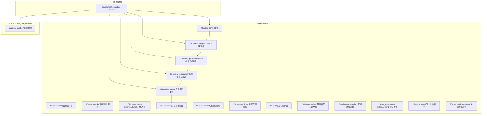

### 1.2 文档层级结构图

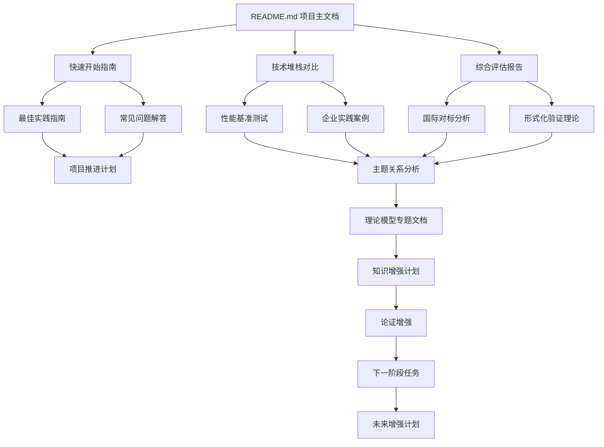

### 1.3 知识体系结构图

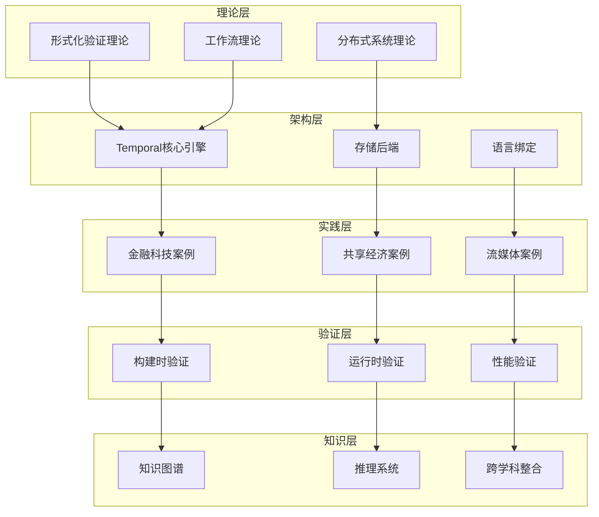

---

## 二、知识关联图

### 2.1 核心概念关联图

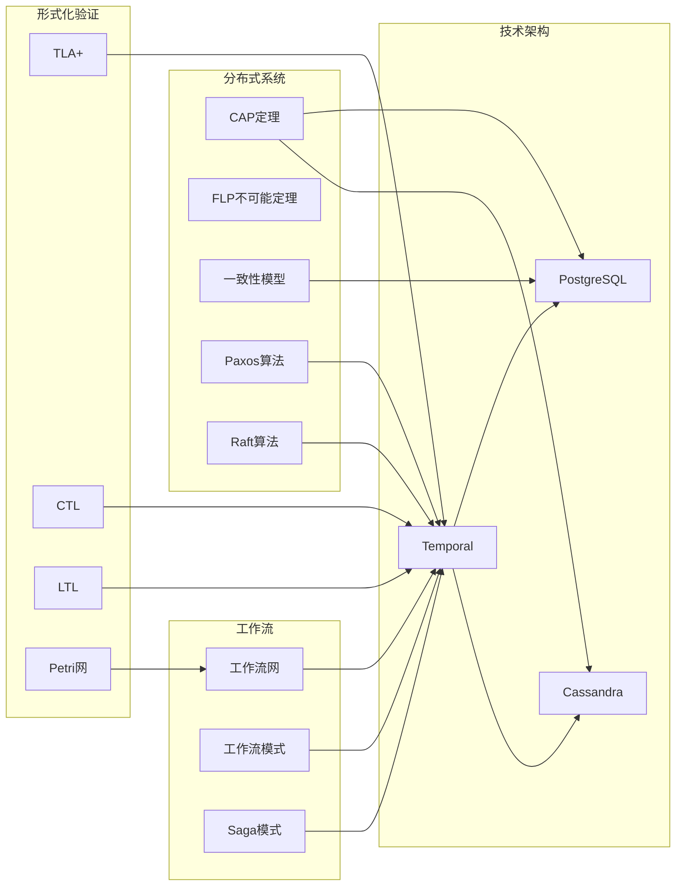

### 2.2 文档关联网络图

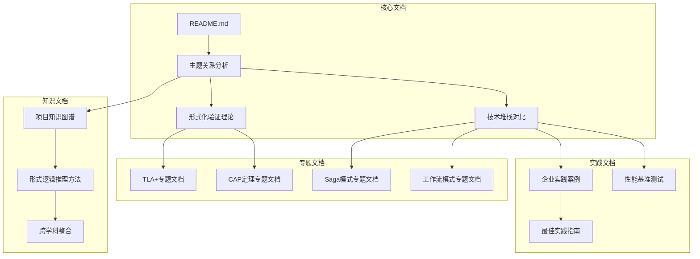

### 2.3 概念依赖关系图

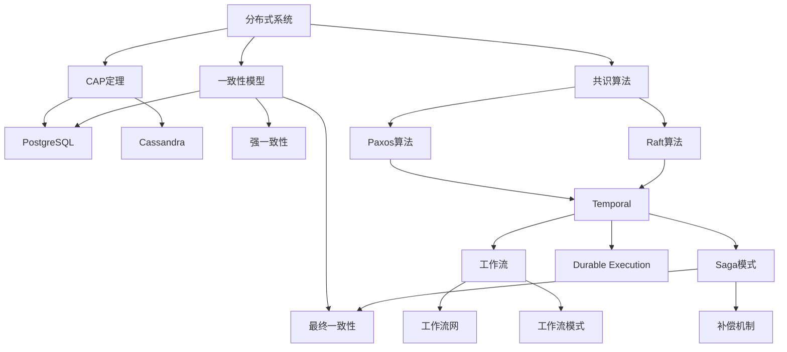

---

## 三、推理路径图

### 3.1 技术选型推理路径

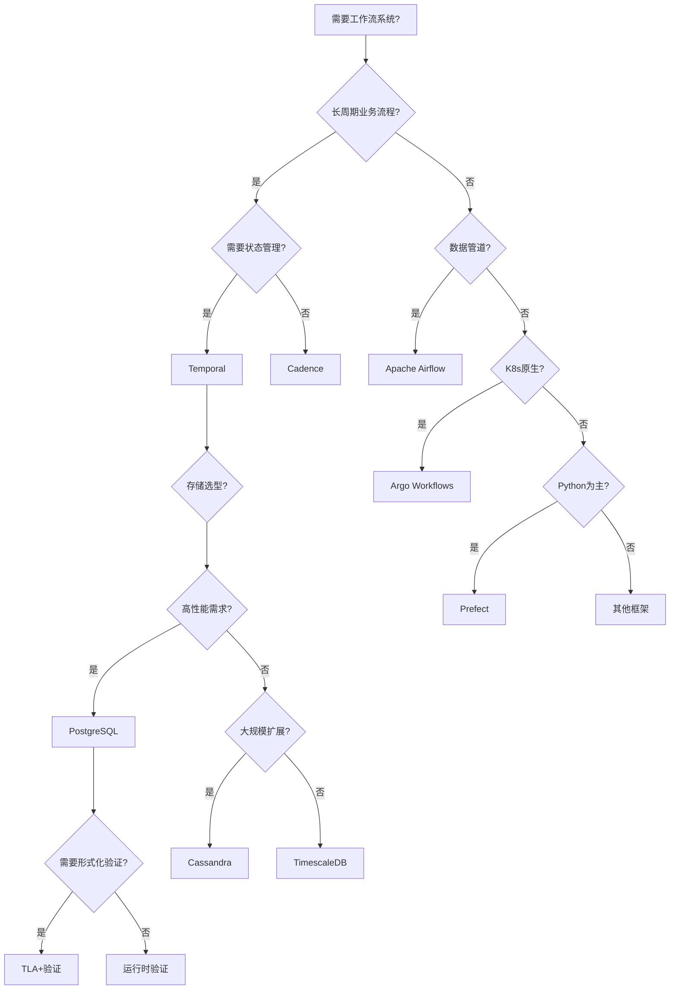

### 3.2 问题到解决方案推理路径

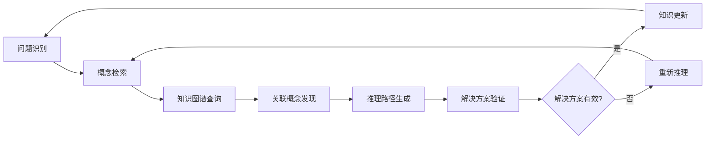

### 3.3 理论到实践推理路径

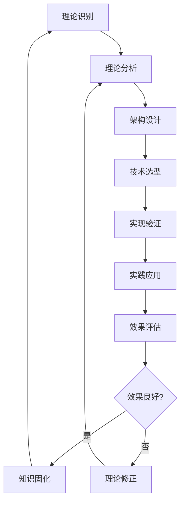

### 3.4 概念到概念推理路径

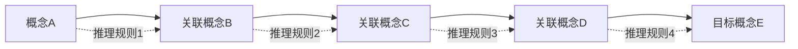

---

## 四、决策树图

### 4.1 工作流系统选型决策树

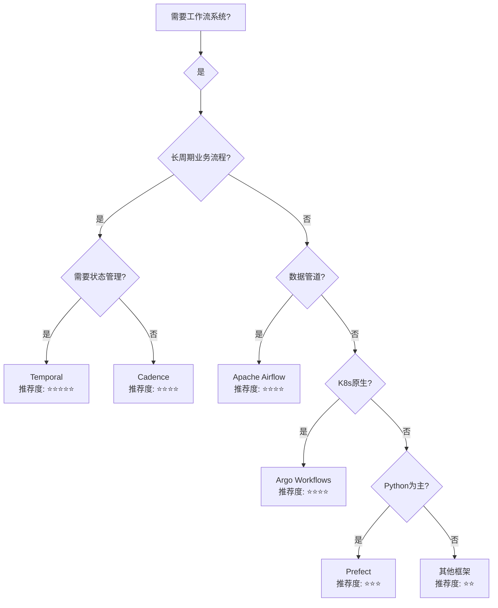

### 4.2 存储后端选型决策树

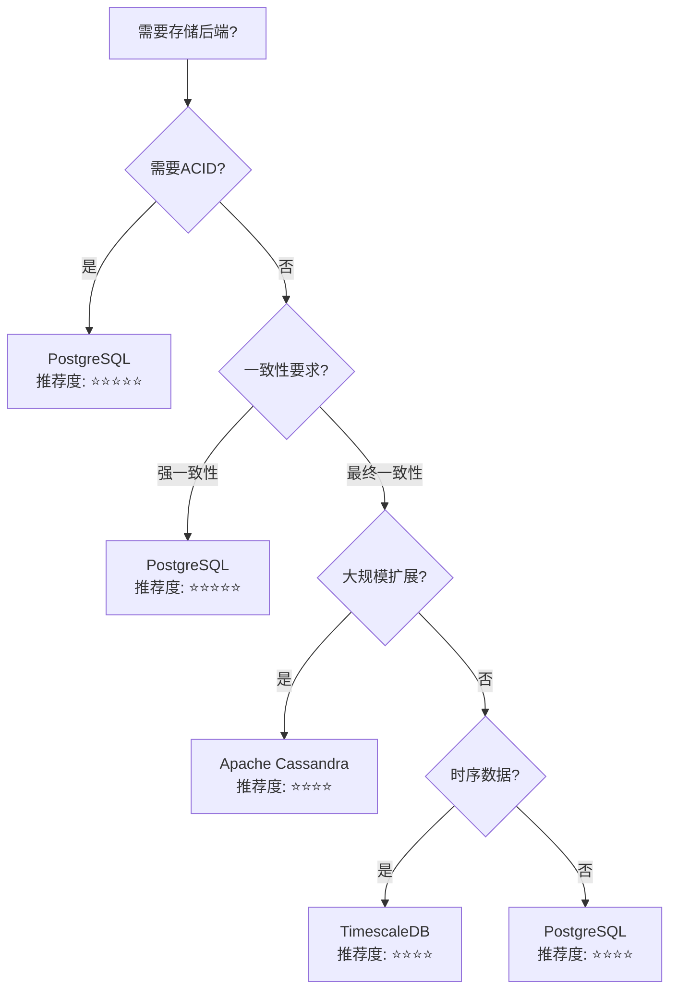

### 4.3 验证方法选型决策树

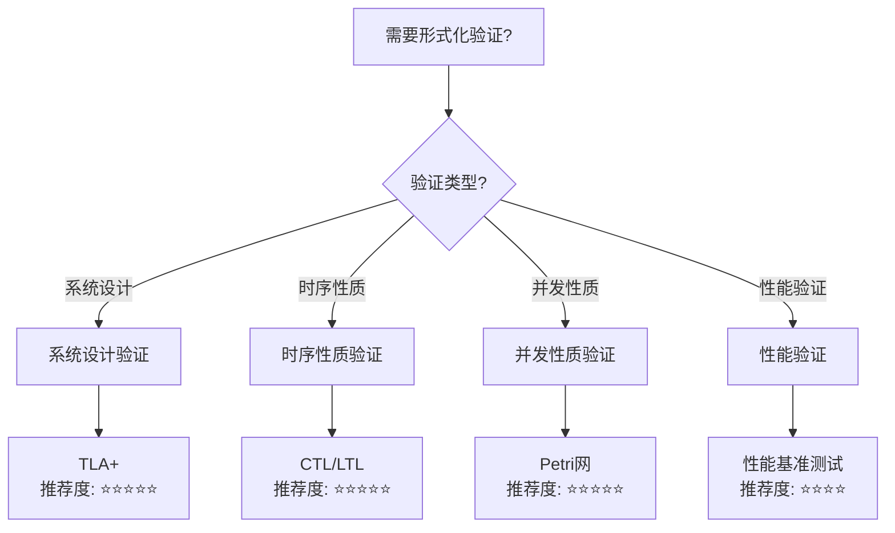

---

## 五、流程图

### 5.1 项目推进流程图

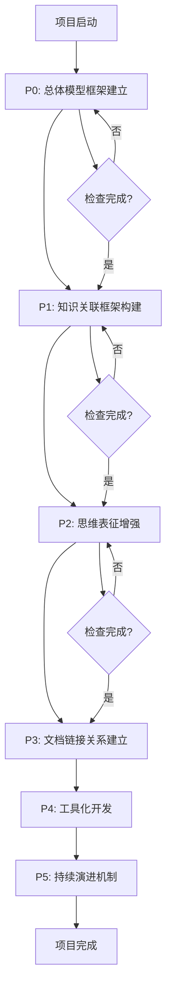

### 5.2 知识更新流程图

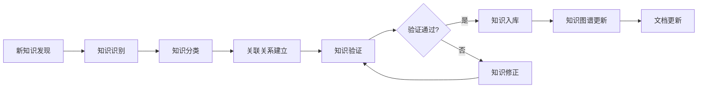

### 5.3 文档关联建立流程图

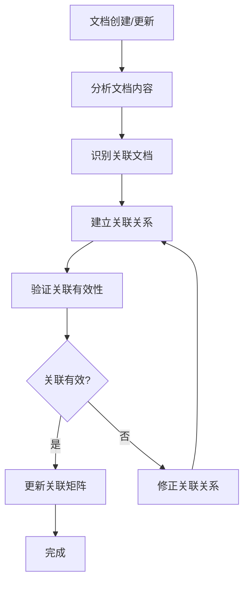

---

## 六、可视化图表使用指南

### 6.1 如何使用可视化图表

1. **快速浏览**：使用图表快速了解项目的整体结构
2. **深入探索**：点击图表中的节点，查看相关文档
3. **路径导航**：使用推理路径图进行知识导航
4. **决策支持**：使用决策树图进行技术选型决策

### 6.2 图表类型说明

- **项目结构图**：展示项目的整体结构和文档组织
- **知识关联图**：展示概念和文档之间的关联关系
- **推理路径图**：展示从问题到解决方案的推理过程
- **决策树图**：展示技术选型和决策的流程
- **流程图**：展示项目推进和知识更新的流程

### 6.3 图表更新

- **定期更新**：根据项目进展定期更新图表
- **版本管理**：记录图表的版本历史
- **反馈收集**：收集用户反馈，优化图表结构

---

## 七、相关文档

- [项目总体模型框架与改进计划](项目总体模型框架与改进计划.md)
- [概念关联网络](概念关联网络.md)
- [文档关联矩阵](文档关联矩阵.md)
- [推理脉络和决策树](推理脉络和决策树.md)
- [思维导图集合](思维导图集合.md)
- [多维矩阵集合](多维矩阵集合.md)

---

**文档版本**：v1.0
**创建时间**：2025年11月28日
**最后更新**：2025年11月28日

## 八、相关文档

### 8.1 项目内部文档

#### 核心知识文档

- **[项目知识图谱](../docs/17-enhancement-plan/项目知识图谱.md)** - 项目知识图谱
- **[全局知识概念关系图](../docs/17-enhancement-plan/全局知识概念关系图.md)** - 全局知识概念关系图

#### 其他相关文档

- **[思维导图集合](思维导图集合.md)** - 思维导图集合
- **[多维矩阵集合](多维矩阵集合.md)** - 多维矩阵集合
- **[文档关联矩阵](文档关联矩阵.md)** - 文档关联矩阵
- **[概念关联网络](概念关联网络.md)** - 概念关联网络

### 8.2 外部资源链接

#### Wikipedia资源

- [Information visualization](https://en.wikipedia.org/wiki/Information_visualization) - 信息可视化
- [Data visualization](https://en.wikipedia.org/wiki/Data_visualization) - 数据可视化
- [Diagram](https://en.wikipedia.org/wiki/Diagram) - 图表

### 8.3 项目管理文档

- **[Wikipedia资源对标](Wikipedia资源对标.md)** - Wikipedia资源对标
- **[概念关联网络](概念关联网络.md)** - 可视化图表集合在概念关联网络中的位置

---

**维护者**：项目团队
**状态**：🔄 进行中
