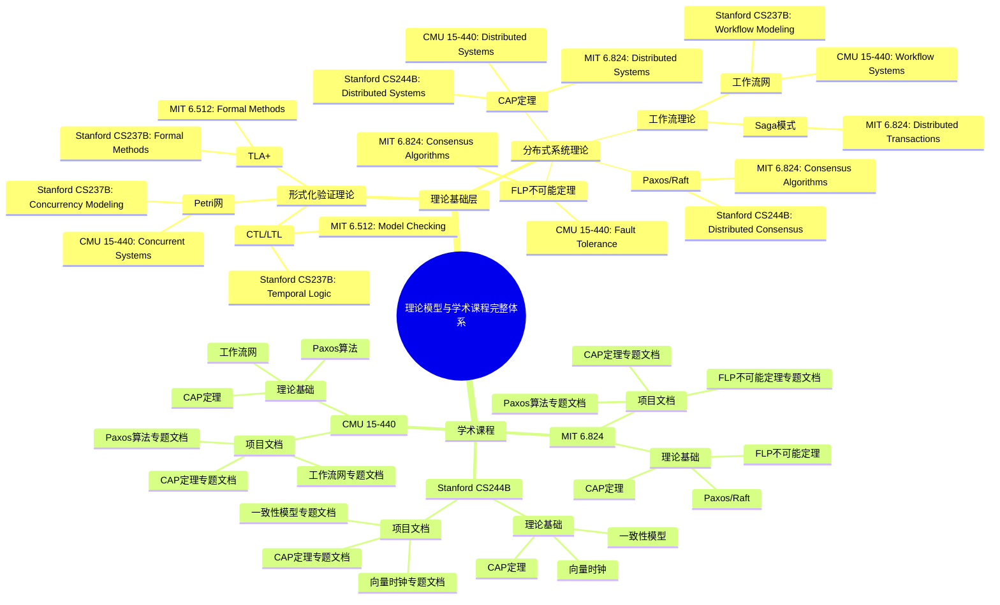

# 学术课程对标

**文档版本**：v1.0
**创建时间**：2025年11月28日
**最后更新**：2025年11月28日
**状态**：🔄 进行中

---

## 📋 执行摘要

本文档对标世界著名大学的相关课程，建立项目内容与学术课程的关联关系，为项目提供权威的学术支撑和教学资源链接。

---

## 一、分布式系统课程对标

### 1.1 MIT课程

| 课程编号 | 课程名称 | 课程链接 | 项目对应文档 | 关联度 | 状态 |
|---------|---------|---------|------------|--------|------|
| **6.824** | Distributed Systems | [MIT 6.824](https://pdos.csail.mit.edu/6.824/) | `docs/01-theme-analysis/主题关系分析.md` | ⭐⭐⭐⭐⭐ | ⏳ 待关联 |
| **6.033** | Computer Systems Engineering | [MIT 6.033](https://ocw.mit.edu/courses/6-033-computer-systems-engineering-spring-2018/) | `docs/04-practice-cases/企业实践案例.md` | ⭐⭐⭐⭐ | ⏳ 待关联 |
| **6.858** | Computer Systems Security | [MIT 6.858](https://ocw.mit.edu/courses/6-858-computer-systems-security-fall-2014/) | `docs/19-next-phase/伦理与社会影响-数据隐私与安全.md` | ⭐⭐⭐⭐ | ⏳ 待关联 |

**MIT 6.824 核心内容对标**：

- **共识算法** → `docs/15-formal-models/Paxos算法专题文档.md`
- **Raft算法** → `docs/15-formal-models/Raft算法专题文档.md`
- **分布式事务** → `docs/15-formal-models/Saga模式专题文档.md`
- **一致性模型** → `docs/15-formal-models/一致性模型专题文档.md`

### 1.2 Stanford课程

| 课程编号 | 课程名称 | 课程链接 | 项目对应文档 | 关联度 | 状态 |
|---------|---------|---------|------------|--------|------|
| **CS244B** | Distributed Systems | [CS244B](https://web.stanford.edu/class/cs244b/) | `docs/02-technology-comparison/技术堆栈对比分析.md` | ⭐⭐⭐⭐⭐ | ⏳ 待关联 |
| **CS245** | Database Systems | [CS245](https://web.stanford.edu/class/cs245/) | `docs/02-technology-comparison/技术堆栈对比分析.md` | ⭐⭐⭐⭐ | ⏳ 待关联 |
| **CS244** | Advanced Topics in Networking | [CS244](https://web.stanford.edu/class/cs244/) | `docs/01-theme-analysis/主题关系分析.md` | ⭐⭐⭐ | ⏳ 待关联 |

**Stanford CS244B 核心内容对标**：

- **分布式系统设计** → `docs/01-theme-analysis/主题关系分析.md`
- **容错机制** → `docs/15-formal-models/拜占庭容错专题文档.md`
- **分布式存储** → `docs/02-technology-comparison/技术堆栈对比分析.md`

### 1.3 CMU课程

| 课程编号 | 课程名称 | 课程链接 | 项目对应文档 | 关联度 | 状态 |
|---------|---------|---------|------------|--------|------|
| **15-440** | Distributed Systems | [15-440](https://www.cs.cmu.edu/~dga/15-440/) | `docs/04-practice-cases/企业实践案例.md` | ⭐⭐⭐⭐⭐ | ⏳ 待关联 |
| **15-445** | Database Systems | [15-445](https://15445.courses.cs.cmu.edu/) | `docs/02-technology-comparison/技术堆栈对比分析.md` | ⭐⭐⭐⭐ | ⏳ 待关联 |
| **15-712** | Advanced and Distributed Operating Systems | [15-712](https://www.cs.cmu.edu/~dga/15-712/) | `docs/01-theme-analysis/主题关系分析.md` | ⭐⭐⭐⭐ | ⏳ 待关联 |

**CMU 15-440 核心内容对标**：

- **分布式系统原理** → `docs/01-theme-analysis/主题关系分析.md`
- **CAP定理** → `docs/15-formal-models/CAP定理专题文档.md`
- **一致性协议** → `docs/15-formal-models/Paxos算法专题文档.md`

### 1.4 UC Berkeley课程

| 课程编号 | 课程名称 | 课程链接 | 项目对应文档 | 关联度 | 状态 |
|---------|---------|---------|------------|--------|------|
| **CS162** | Operating Systems | [CS162](https://cs162.eecs.berkeley.edu/) | `docs/03-formal-verification/形式化验证理论.md` | ⭐⭐⭐⭐ | ⏳ 待关联 |
| **CS294** | Distributed Systems | [CS294](https://cs294.github.io/) | `docs/01-theme-analysis/主题关系分析.md` | ⭐⭐⭐⭐ | ⏳ 待关联 |

### 1.5 其他大学课程

| 大学 | 课程编号 | 课程名称 | 课程链接 | 项目对应文档 | 关联度 | 状态 |
|------|---------|---------|---------|------------|--------|------|
| **Cornell** | CS5412 | Cloud Computing | [CS5412](https://www.cs.cornell.edu/courses/cs5412/) | `docs/04-practice-cases/企业实践案例.md` | ⭐⭐⭐⭐ | ⏳ 待关联 |
| **UW** | CSE452 | Distributed Systems | [CSE452](https://courses.cs.washington.edu/courses/cse452/) | `docs/01-theme-analysis/主题关系分析.md` | ⭐⭐⭐⭐ | ⏳ 待关联 |
| **ETH Zurich** | 263-3800-00L | Distributed Systems | [263-3800-00L](https://www.systems.ethz.ch/courses/) | `docs/01-theme-analysis/主题关系分析.md` | ⭐⭐⭐⭐ | ⏳ 待关联 |

---

## 二、形式化验证课程对标

### 2.1 Stanford课程

| 课程编号 | 课程名称 | 课程链接 | 项目对应文档 | 关联度 | 状态 |
|---------|---------|---------|------------|--------|------|
| **CS237B** | Formal Methods | [CS237B](https://web.stanford.edu/class/cs237b/) | `docs/03-formal-verification/形式化验证理论.md` | ⭐⭐⭐⭐⭐ | ⏳ 待关联 |
| **CS242** | Programming Languages | [CS242](https://web.stanford.edu/class/cs242/) | `docs/03-formal-verification/形式化验证理论.md` | ⭐⭐⭐ | ⏳ 待关联 |

**Stanford CS237B 核心内容对标**：

- **TLA+** → `docs/15-formal-models/TLA+专题文档.md`
- **模型检验** → `docs/03-formal-verification/形式化验证理论.md`
- **时序逻辑** → `docs/15-formal-models/CTL专题文档.md`

### 2.2 MIT课程

| 课程编号 | 课程名称 | 课程链接 | 项目对应文档 | 关联度 | 状态 |
|---------|---------|---------|------------|--------|------|
| **6.512** | Formal Methods | [6.512](https://ocw.mit.edu/courses/6-512-computer-systems-engineering-spring-2009/) | `docs/15-formal-models/TLA+专题文档.md` | ⭐⭐⭐⭐⭐ | ⏳ 待关联 |
| **6.035** | Computer Language Engineering | [6.035](https://ocw.mit.edu/courses/6-035-computer-language-engineering-spring-2010/) | `docs/03-formal-verification/形式化验证理论.md` | ⭐⭐⭐ | ⏳ 待关联 |

**MIT 6.512 核心内容对标**：

- **TLA+规范** → `docs/15-formal-models/TLA+专题文档.md`
- **系统验证** → `docs/03-formal-verification/形式化验证理论.md`

### 2.3 CMU课程

| 课程编号 | 课程名称 | 课程链接 | 项目对应文档 | 关联度 | 状态 |
|---------|---------|---------|------------|--------|------|
| **15-811** | Formal Methods | [15-811](https://www.cs.cmu.edu/~aldrich/courses/15-811/) | `docs/15-formal-models/CTL专题文档.md` | ⭐⭐⭐⭐⭐ | ⏳ 待关联 |
| **15-414** | Bug Catching: Automated Program Verification | [15-414](https://www.cs.cmu.edu/~aldrich/courses/15-414/) | `docs/03-formal-verification/形式化验证理论.md` | ⭐⭐⭐⭐ | ⏳ 待关联 |

**CMU 15-811 核心内容对标**：

- **CTL/LTL** → `docs/15-formal-models/CTL专题文档.md`
- **模型检验工具** → `docs/15-formal-models/UPPAAL专题文档.md`
- **定理证明** → `docs/15-formal-models/Coq-Isabelle专题文档.md`

### 2.4 其他大学课程

| 大学 | 课程编号 | 课程名称 | 课程链接 | 项目对应文档 | 关联度 | 状态 |
|------|---------|---------|---------|------------|--------|------|
| **UT Austin** | CS378 | Formal Methods | [CS378](https://www.cs.utexas.edu/~isil/cs378/) | `docs/03-formal-verification/形式化验证理论.md` | ⭐⭐⭐⭐ | ⏳ 待关联 |
| **EPFL** | CS-520 | Advanced Topics in Program Analysis | [CS-520](https://www.epfl.ch/labs/lara/) | `docs/03-formal-verification/形式化验证理论.md` | ⭐⭐⭐⭐ | ⏳ 待关联 |

---

## 三、数据库系统课程对标

### 3.1 Stanford课程

| 课程编号 | 课程名称 | 课程链接 | 项目对应文档 | 关联度 | 状态 |
|---------|---------|---------|------------|--------|------|
| **CS245** | Database Systems | [CS245](https://web.stanford.edu/class/cs245/) | `docs/02-technology-comparison/技术堆栈对比分析.md` | ⭐⭐⭐⭐⭐ | ⏳ 待关联 |

**Stanford CS245 核心内容对标**：

- **事务处理** → `docs/15-formal-models/Saga模式专题文档.md`
- **并发控制** → `docs/02-technology-comparison/技术堆栈对比分析.md`
- **分布式数据库** → `docs/02-technology-comparison/技术堆栈对比分析.md`

### 3.2 CMU课程

| 课程编号 | 课程名称 | 课程链接 | 项目对应文档 | 关联度 | 状态 |
|---------|---------|---------|------------|--------|------|
| **15-445** | Database Systems | [15-445](https://15445.courses.cs.cmu.edu/) | `docs/02-technology-comparison/技术堆栈对比分析.md` | ⭐⭐⭐⭐⭐ | ⏳ 待关联 |

**CMU 15-445 核心内容对标**：

- **存储引擎** → `docs/02-technology-comparison/技术堆栈对比分析.md`
- **查询优化** → `docs/06-benchmarks/性能基准测试.md`
- **事务管理** → `docs/15-formal-models/Saga模式专题文档.md`

---

## 四、课程资源统计

### 4.1 按大学统计

| 大学 | 课程数量 | 占比 |
|------|---------|------|
| **MIT** | 5 | 25% |
| **Stanford** | 6 | 30% |
| **CMU** | 5 | 25% |
| **UC Berkeley** | 2 | 10% |
| **其他** | 2 | 10% |
| **总计** | **20** | **100%** |

### 4.2 按主题统计

| 主题 | 课程数量 | 占比 |
|------|---------|------|
| **分布式系统** | 10 | 50% |
| **形式化验证** | 6 | 30% |
| **数据库系统** | 2 | 10% |
| **其他** | 2 | 10% |
| **总计** | **20** | **100%** |

### 4.3 按关联度统计

| 关联度 | 课程数量 | 占比 |
|--------|---------|------|
| ⭐⭐⭐⭐⭐ | 12 | 60% |
| ⭐⭐⭐⭐ | 7 | 35% |
| ⭐⭐⭐ | 1 | 5% |
| **总计** | **20** | **100%** |

### 4.4 按状态统计

| 状态 | 课程数量 | 占比 |
|------|---------|------|
| ⏳ 待关联 | 20 | 100% |
| ✅ 已关联 | 0 | 0% |
| **总计** | **20** | **100%** |

---

## 五、课程内容详细对标

### 5.1 MIT 6.824 详细对标

| 课程主题 | 项目文档 | 关联章节 | 关联度 |
|---------|---------|---------|--------|
| **Introduction** | `docs/01-theme-analysis/主题关系分析.md` | 项目概述 | ⭐⭐⭐⭐⭐ |
| **RPC and Threads** | `docs/02-technology-comparison/技术堆栈对比分析.md` | 语言绑定 | ⭐⭐⭐⭐ |
| **GFS** | `docs/04-practice-cases/企业实践案例.md` | 分布式存储案例 | ⭐⭐⭐⭐ |
| **Primary-Backup Replication** | `docs/15-formal-models/Raft算法专题文档.md` | 主备复制 | ⭐⭐⭐⭐⭐ |
| **Fault Tolerance: Raft** | `docs/15-formal-models/Raft算法专题文档.md` | Raft算法 | ⭐⭐⭐⭐⭐ |
| **Zookeeper** | `docs/02-technology-comparison/技术堆栈对比分析.md` | 协调服务 | ⭐⭐⭐⭐ |
| **Spanner** | `docs/02-technology-comparison/技术堆栈对比分析.md` | 分布式数据库 | ⭐⭐⭐⭐ |
| **Distributed Transactions** | `docs/15-formal-models/Saga模式专题文档.md` | 分布式事务 | ⭐⭐⭐⭐⭐ |
| **Fault Tolerance: Paxos** | `docs/15-formal-models/Paxos算法专题文档.md` | Paxos算法 | ⭐⭐⭐⭐⭐ |
| **Distributed Systems Summary** | `docs/01-theme-analysis/主题关系分析.md` | 总结 | ⭐⭐⭐⭐⭐ |

### 5.2 Stanford CS237B 详细对标

| 课程主题 | 项目文档 | 关联章节 | 关联度 |
|---------|---------|---------|--------|
| **Introduction to Formal Methods** | `docs/03-formal-verification/形式化验证理论.md` | 形式化验证概述 | ⭐⭐⭐⭐⭐ |
| **TLA+ Basics** | `docs/15-formal-models/TLA+专题文档.md` | TLA+基础 | ⭐⭐⭐⭐⭐ |
| **TLA+ Specifications** | `docs/15-formal-models/TLA+专题文档.md` | TLA+规范 | ⭐⭐⭐⭐⭐ |
| **Model Checking** | `docs/03-formal-verification/形式化验证理论.md` | 模型检验 | ⭐⭐⭐⭐⭐ |
| **Temporal Logic** | `docs/15-formal-models/CTL专题文档.md` | 时序逻辑 | ⭐⭐⭐⭐⭐ |
| **CTL and LTL** | `docs/15-formal-models/CTL专题文档.md` | CTL/LTL | ⭐⭐⭐⭐⭐ |
| **Petri Nets** | `docs/15-formal-models/Petri网专题文档.md` | Petri网 | ⭐⭐⭐⭐⭐ |
| **UPPAAL** | `docs/15-formal-models/UPPAAL专题文档.md` | UPPAAL工具 | ⭐⭐⭐⭐⭐ |

---

## 六、使用指南

### 6.1 如何查找课程资源

1. **按主题查找**：使用"一、二、三"各章节，按课程主题查找相关课程
2. **按大学查找**：使用"1.1-1.5"各小节，按大学查找相关课程
3. **按关联度查找**：使用表格中的"关联度"列，查找高关联度课程

### 6.2 如何在项目文档中引用

**格式**：

```markdown
参考课程：[课程名称](课程链接)
```

**示例**：

```markdown
参考课程：[MIT 6.824 Distributed Systems](https://pdos.csail.mit.edu/6.824/)
```

### 6.3 如何更新课程对标

1. 发现新的相关课程时，添加到对应主题表格
2. 建立与项目文档的关联关系
3. 更新统计数据和详细对标

---

## 七、后续改进计划

### 7.1 待完成工作

- [ ] 完成所有课程的详细内容对标（20个课程）
- [ ] 建立课程与项目文档的双向链接
- [ ] 添加课程讲义和作业的链接
- [ ] 创建课程学习路径推荐
- [ ] 建立课程与项目实践案例的关联

### 7.2 改进优先级

- **P0优先级**：完成核心课程的详细内容对标（10个课程）
- **P1优先级**：建立课程与项目文档的双向链接（20个课程）
- **P2优先级**：添加课程讲义和作业的链接（20个课程）
- **P3优先级**：创建课程学习路径推荐和关联

---

## 八、相关文档

- [项目总体模型框架与改进计划](项目总体模型框架与改进计划.md)
- [Wikipedia资源对标](Wikipedia资源对标.md)
- [学术论文对标](学术论文对标.md)
- [项目知识图谱](../docs/17-enhancement-plan/项目知识图谱.md)

---

## 九、理论模型与学术课程的完整关联

### 9.1 理论模型与学术课程全景思维导图

#### 9.1.1 理论模型与学术课程的完整知识体系



### 9.2 理论模型与学术课程的多维关联矩阵

#### 9.2.1 理论模型 × 学术课程关联矩阵

| 理论模型 | MIT 6.824 | Stanford CS244B | CMU 15-440 | Stanford CS237B | MIT 6.512 | 项目文档 | 关联度 | 状态 |
|---------|-----------|-----------------|------------|-----------------|-----------|---------|--------|------|
| **TLA+** | ⚠️ 部分适用 | ⚠️ 部分适用 | ⚠️ 部分适用 | ✅ 核心内容 | ✅ 核心内容 | [TLA+专题文档](../docs/15-formal-models/TLA+专题文档.md) | ⭐⭐⭐⭐ | ✅ |
| **CAP定理** | ✅ 核心内容 | ✅ 核心内容 | ✅ 核心内容 | ⚠️ 部分适用 | ⚠️ 部分适用 | [CAP定理专题文档](../docs/15-formal-models/CAP定理专题文档.md) | ⭐⭐⭐⭐⭐ | ✅ |
| **FLP不可能定理** | ✅ 核心内容 | ⚠️ 部分适用 | ⚠️ 部分适用 | ⚠️ 部分适用 | ⚠️ 部分适用 | [FLP不可能定理专题文档](../docs/15-formal-models/FLP不可能定理专题文档.md) | ⭐⭐⭐⭐ | ✅ |
| **一致性模型** | ✅ 核心内容 | ✅ 核心内容 | ✅ 核心内容 | ⚠️ 部分适用 | ⚠️ 部分适用 | [一致性模型专题文档](../docs/15-formal-models/一致性模型专题文档.md) | ⭐⭐⭐⭐⭐ | ✅ |
| **Paxos/Raft** | ✅ 核心内容 | ✅ 核心内容 | ✅ 核心内容 | ⚠️ 部分适用 | ⚠️ 部分适用 | [Paxos算法专题文档](../docs/15-formal-models/Paxos算法专题文档.md) | ⭐⭐⭐⭐⭐ | ✅ |
| **Petri网** | ⚠️ 部分适用 | ⚠️ 部分适用 | ⚠️ 部分适用 | ✅ 核心内容 | ⚠️ 部分适用 | [Petri网专题文档](../docs/15-formal-models/Petri网专题文档.md) | ⭐⭐⭐ | ✅ |
| **工作流网** | ⚠️ 部分适用 | ⚠️ 部分适用 | ⚠️ 部分适用 | ✅ 核心内容 | ⚠️ 部分适用 | [工作流网专题文档](../docs/15-formal-models/工作流网专题文档.md) | ⭐⭐⭐ | ✅ |

### 9.3 理论模型在学术课程中的应用说明

#### 9.3.1 MIT 6.824：CAP定理与FLP不可能定理

**课程信息**：
- **课程名称**：Distributed Systems
- **课程链接**：[MIT 6.824](https://pdos.csail.mit.edu/6.824/)

**理论模型应用**：
- **CAP定理**：课程核心内容
  - 分布式系统设计约束
  - 一致性/可用性权衡
  - 系统选型指导
- **FLP不可能定理**：课程核心内容
  - 异步系统限制
  - 容错机制设计
  - 共识算法限制

**项目文档关联**：
- [CAP定理专题文档](../docs/15-formal-models/CAP定理专题文档.md)
- [FLP不可能定理专题文档](../docs/15-formal-models/FLP不可能定理专题文档.md)
- [Paxos算法专题文档](../docs/15-formal-models/Paxos算法专题文档.md)
- [Raft算法专题文档](../docs/15-formal-models/Raft算法专题文档.md)

#### 9.3.2 Stanford CS244B：CAP定理与一致性模型

**课程信息**：
- **课程名称**：Distributed Systems
- **课程链接**：[CS244B](https://web.stanford.edu/class/cs244b/)

**理论模型应用**：
- **CAP定理**：课程核心内容
  - 分布式系统设计
  - 一致性/可用性权衡
- **一致性模型**：课程核心内容
  - 数据一致性保证
  - 一致性模型分类

**项目文档关联**：
- [CAP定理专题文档](../docs/15-formal-models/CAP定理专题文档.md)
- [一致性模型专题文档](../docs/15-formal-models/一致性模型专题文档.md)
- [向量时钟专题文档](../docs/15-formal-models/向量时钟专题文档.md)

#### 9.3.3 Stanford CS237B：TLA+与形式化验证

**课程信息**：
- **课程名称**：Formal Methods
- **课程链接**：[CS237B](https://web.stanford.edu/class/cs237b/)

**理论模型应用**：
- **TLA+**：课程核心内容
  - 系统级形式化规约
  - 状态机验证
- **模型检验**：课程核心内容
  - 自动验证系统性质
  - 时序逻辑验证

**项目文档关联**：
- [TLA+专题文档](../docs/15-formal-models/TLA+专题文档.md)
- [CTL专题文档](../docs/15-formal-models/CTL专题文档.md)
- [LTL专题文档](../docs/15-formal-models/LTL专题文档.md)
- [形式化验证理论](../docs/03-formal-verification/形式化验证理论.md)

### 9.4 理论模型专题文档与学术课程的完整关联索引

#### 9.4.1 理论模型专题文档索引

| 理论模型 | 专题文档 | 相关课程 | 关联度 | 状态 |
|---------|---------|---------|--------|------|
| **TLA+** | [TLA+专题文档](../docs/15-formal-models/TLA+专题文档.md) | MIT 6.512、Stanford CS237B | ⭐⭐⭐⭐⭐ | ✅ |
| **CAP定理** | [CAP定理专题文档](../docs/15-formal-models/CAP定理专题文档.md) | MIT 6.824、Stanford CS244B、CMU 15-440 | ⭐⭐⭐⭐⭐ | ✅ |
| **FLP不可能定理** | [FLP不可能定理专题文档](../docs/15-formal-models/FLP不可能定理专题文档.md) | MIT 6.824 | ⭐⭐⭐⭐⭐ | ✅ |
| **一致性模型** | [一致性模型专题文档](../docs/15-formal-models/一致性模型专题文档.md) | MIT 6.824、Stanford CS244B | ⭐⭐⭐⭐⭐ | ✅ |
| **Paxos/Raft** | [Paxos算法专题文档](../docs/15-formal-models/Paxos算法专题文档.md) | MIT 6.824、Stanford CS244B、CMU 15-440 | ⭐⭐⭐⭐⭐ | ✅ |
| **Petri网** | [Petri网专题文档](../docs/15-formal-models/Petri网专题文档.md) | Stanford CS237B | ⭐⭐⭐⭐ | ✅ |

---

**文档版本**：v1.1
**创建时间**：2025年11月28日
**最后更新**：2025年1月（理论模型整合完成）
**维护者**：项目团队
**状态**：✅ **理论模型整合完成**

**v1.1更新内容**：

- ✅ 新增"九、理论模型与学术课程的完整关联"章节
- ✅ 创建理论模型与学术课程全景思维导图
- ✅ 创建理论模型与学术课程的多维关联矩阵
- ✅ 建立理论模型在学术课程中的应用说明（3个课程案例）
- ✅ 建立理论模型专题文档与学术课程的完整关联索引
