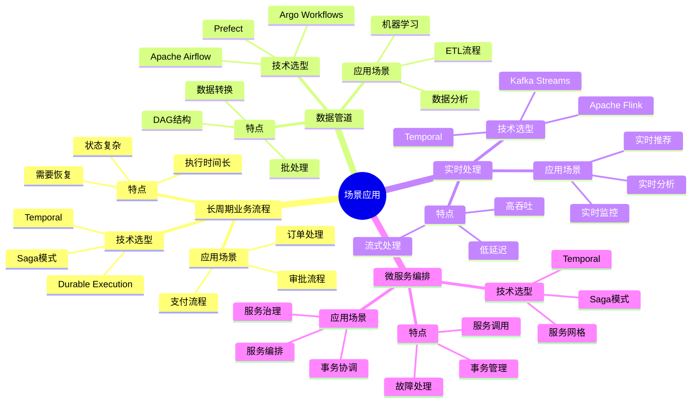

# 思维导图集合

**文档版本**：v1.0
**创建时间**：2025年11月28日
**最后更新**：2025年11月28日
**状态**：🔄 进行中

---

## 📋 执行摘要

本文档提供项目的思维导图集合，包括项目全景思维导图、技术架构思维导图、知识体系思维导图等，帮助用户快速理解项目的整体结构和知识体系。

---

## 一、项目全景思维导图

### 1.1 项目核心全景

### 1.2 项目层次结构全景

---

## 二、技术架构思维导图

### 2.1 Temporal技术架构

### 2.2 存储架构思维导图

### 2.3 验证架构思维导图

---

## 三、知识体系思维导图

### 3.1 知识图谱结构

### 3.2 推理系统结构

### 3.3 跨学科整合结构

---

## 四、实践应用思维导图

### 4.1 行业应用全景

### 4.2 场景应用全景

---

## 五、思维导图使用指南

### 5.1 如何使用思维导图

1. **快速浏览**：使用思维导图快速了解项目的整体结构
2. **深入探索**：点击感兴趣的节点，查看相关文档
3. **知识导航**：使用思维导图作为知识导航工具
4. **概念关联**：通过思维导图理解概念之间的关联关系

### 5.2 思维导图分类

- **项目全景思维导图**：了解项目的整体结构
- **技术架构思维导图**：理解技术架构和组件
- **知识体系思维导图**：掌握知识体系和推理方法
- **实践应用思维导图**：学习实践应用和案例

### 5.3 思维导图更新

- **定期更新**：根据项目进展定期更新思维导图
- **版本管理**：记录思维导图的版本历史
- **反馈收集**：收集用户反馈，优化思维导图结构

---

## 六、相关文档

- [项目总体模型框架与改进计划](项目总体模型框架与改进计划.md)
- [概念关联网络](概念关联网络.md)
- [文档关联矩阵](文档关联矩阵.md)
- [推理脉络和决策树](推理脉络和决策树.md)
- [多维矩阵集合](多维矩阵集合.md)
- [可视化图表集合](可视化图表集合.md)

---

**文档版本**：v1.0
**创建时间**：2025年11月28日
**最后更新**：2025年11月28日

## 八、相关文档

### 8.1 项目内部文档

#### 核心知识文档

- **[项目知识图谱](../docs/17-enhancement-plan/项目知识图谱.md)** - 项目知识图谱
- **[全局知识概念关系图](../docs/17-enhancement-plan/全局知识概念关系图.md)** - 全局知识概念关系图

#### 其他相关文档

- **[多维矩阵集合](多维矩阵集合.md)** - 多维矩阵集合
- **[可视化图表集合](可视化图表集合.md)** - 可视化图表集合
- **[文档关联矩阵](文档关联矩阵.md)** - 文档关联矩阵

### 8.2 外部资源链接

#### Wikipedia资源

- [Mind map](https://en.wikipedia.org/wiki/Mind_map) - 思维导图
- [Concept map](https://en.wikipedia.org/wiki/Concept_map) - 概念图
- [Knowledge visualization](https://en.wikipedia.org/wiki/Knowledge_visualization) - 知识可视化

### 8.3 项目管理文档

- **[Wikipedia资源对标](Wikipedia资源对标.md)** - Wikipedia资源对标
- **[概念关联网络](概念关联网络.md)** - 思维导图集合在概念关联网络中的位置

---

**维护者**：项目团队
**状态**：🔄 进行中
