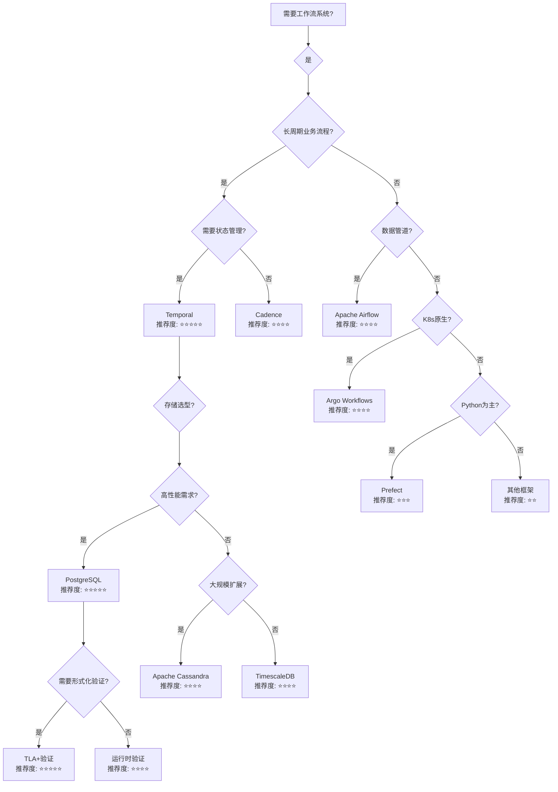
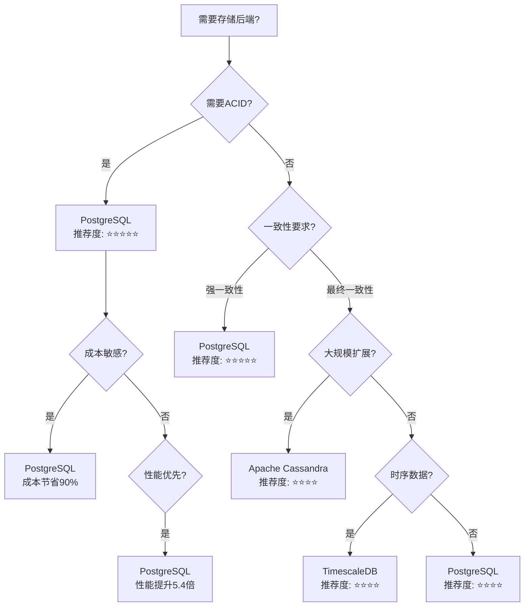
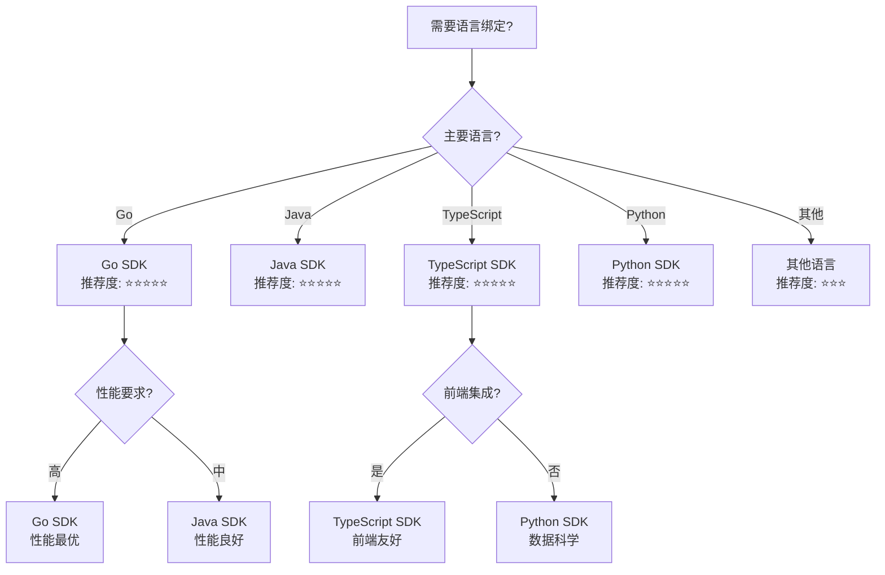
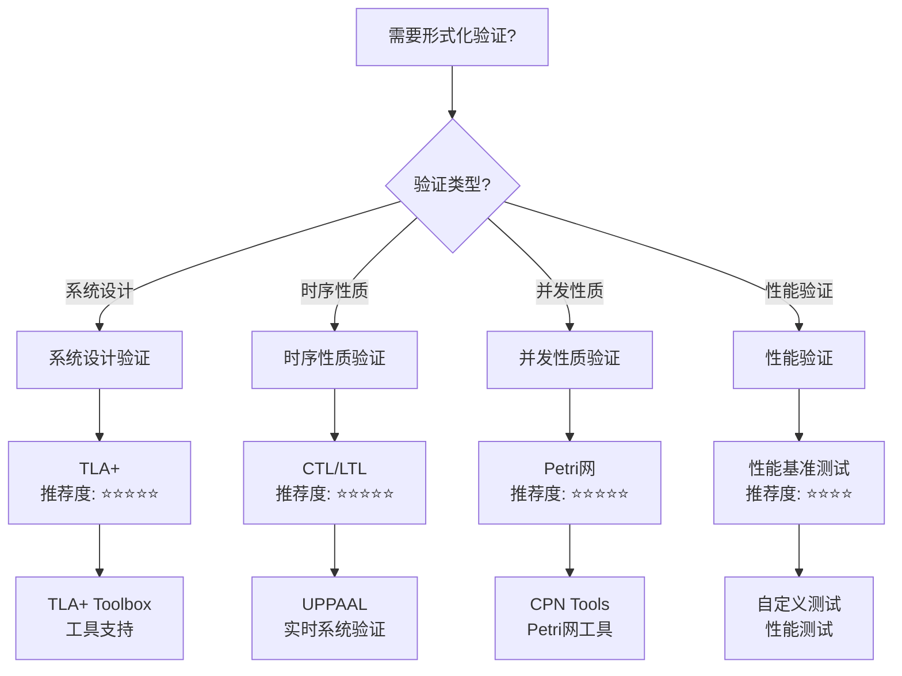
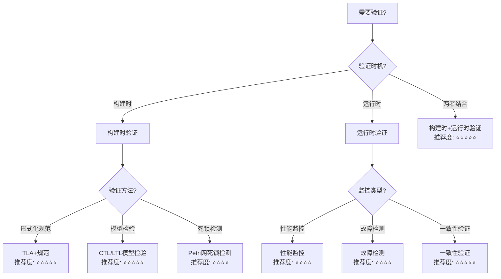
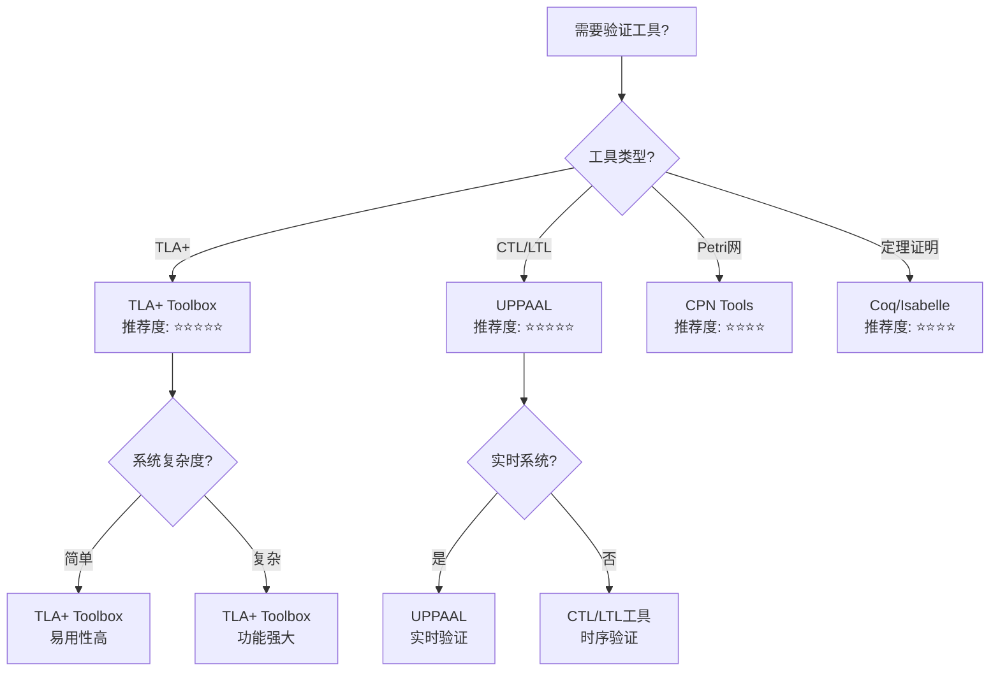
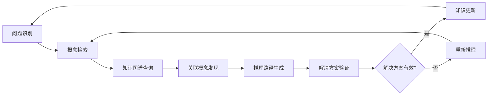
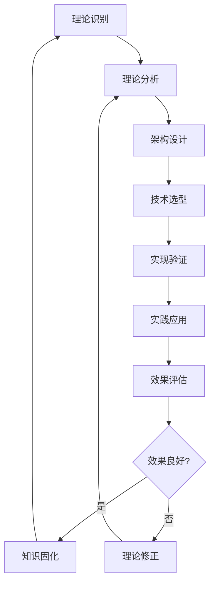
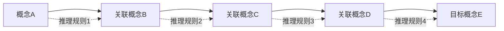

# 推理脉络和决策树

**文档版本**：v1.0
**创建时间**：2025年11月28日
**最后更新**：2025年11月28日
**状态**：🔄 进行中

---

## 📋 执行摘要

本文档建立项目的推理脉络和决策树，包括技术选型决策树、验证方法决策树、知识推理路径等，为项目提供清晰的推理框架和决策支持。

---

## 一、技术选型决策树

### 1.1 工作流系统选型决策树



### 1.2 存储后端选型决策树



### 1.3 语言绑定选型决策树



---

## 二、验证方法决策树

### 2.1 形式化验证方法选型决策树



### 2.2 构建时验证 vs 运行时验证决策树



### 2.3 验证工具选型决策树



---

## 三、知识推理路径

### 3.1 从问题到解决方案的推理路径



### 3.2 从理论到实践的推理路径



### 3.3 从概念到概念的推理路径



---

## 四、具体推理案例

### 4.1 案例1：Temporal选型推理

**问题**：需要选择工作流引擎

**推理路径**：

```
1. 问题识别：需要长周期业务流程支持
2. 概念检索：工作流引擎、Durable Execution、Saga模式
3. 知识图谱查询：Temporal、Cadence、Airflow
4. 关联概念发现：
   - Temporal → Durable Execution（实现）
   - Temporal → Saga模式（支持）
   - Temporal → 事件溯源（支持）
5. 推理路径生成：
   - 长周期业务流程 → 需要状态管理 → Temporal支持
   - 分布式事务 → 需要Saga模式 → Temporal支持
6. 解决方案验证：
   - Coinbase使用Temporal（实践验证）
   - Stripe使用Temporal（实践验证）
7. 知识更新：Temporal是长周期业务流程的最佳选择
```

**决策结果**：选择Temporal

### 4.2 案例2：PostgreSQL选型推理

**问题**：需要选择存储后端

**推理路径**：

```
1. 问题识别：需要ACID事务支持
2. 概念检索：ACID、一致性模型、CAP定理
3. 知识图谱查询：PostgreSQL、Cassandra、TimescaleDB
4. 关联概念发现：
   - PostgreSQL → ACID（保证）
   - PostgreSQL → MVCC（实现）
   - CAP定理 → PostgreSQL（指导选型）
5. 推理路径生成：
   - ACID需求 → 强一致性 → PostgreSQL支持
   - 成本敏感 → PostgreSQL成本低90%
   - 性能要求 → PostgreSQL性能提升5.4倍
6. 解决方案验证：
   - 性能基准测试验证（性能验证）
   - Coinbase使用PostgreSQL（实践验证）
7. 知识更新：PostgreSQL是大多数场景的最佳选择
```

**决策结果**：选择PostgreSQL

### 4.3 案例3：TLA+验证推理

**问题**：需要验证系统设计

**推理路径**：

```
1. 问题识别：需要验证系统设计正确性
2. 概念检索：形式化验证、模型检验、TLA+
3. 知识图谱查询：TLA+、CTL/LTL、Petri网
4. 关联概念发现：
   - TLA+ → 系统设计验证（实现）
   - TLA+ → 模型检验（方法）
   - TLA+ → 时序逻辑（基础）
5. 推理路径生成：
   - 系统设计验证 → TLA+规范 → 模型检验
   - Amazon使用TLA+（实践验证）
   - Microsoft使用TLA+（实践验证）
6. 解决方案验证：
   - TLA+ Toolbox验证（工具验证）
   - 系统性质验证（性质验证）
7. 知识更新：TLA+是系统设计验证的最佳工具
```

**决策结果**：使用TLA+进行系统设计验证

---

## 五、推理规则

### 5.1 技术选型推理规则

#### 规则1：需求匹配规则

**规则**：如果需求X，则选择支持X的技术Y

**示例**：

- 如果需求是"长周期业务流程"，则选择"Temporal"
- 如果需求是"ACID事务"，则选择"PostgreSQL"
- 如果需求是"大规模扩展"，则选择"Cassandra"

#### 规则2：性能优先规则

**规则**：如果性能要求高，则选择性能最优的技术

**示例**：

- PostgreSQL性能提升5.4倍 → 选择PostgreSQL
- Go SDK性能最优 → 选择Go SDK

#### 规则3：成本优先规则

**规则**：如果成本敏感，则选择成本最低的技术

**示例**：

- PostgreSQL成本节省90% → 选择PostgreSQL

### 5.2 验证方法推理规则

#### 规则1：验证类型匹配规则

**规则**：如果验证类型X，则选择适合X的验证方法Y

**示例**：

- 如果验证类型是"系统设计"，则选择"TLA+"
- 如果验证类型是"时序性质"，则选择"CTL/LTL"
- 如果验证类型是"并发性质"，则选择"Petri网"

#### 规则2：工具支持规则

**规则**：如果工具支持好，则选择该工具

**示例**：

- TLA+ Toolbox工具支持好 → 选择TLA+
- UPPAAL实时系统验证 → 选择UPPAAL

### 5.3 知识推理规则

#### 规则1：概念关联规则

**规则**：如果概念A关联概念B，则可以从A推理到B

**示例**：

- CAP定理关联一致性模型 → 可以从CAP定理推理一致性模型
- Saga模式关联Temporal → 可以从Saga模式推理Temporal

#### 规则2：路径推理规则

**规则**：如果存在路径A→B→C，则可以从A推理到C

**示例**：

- 理论层→架构层→实践层 → 可以从理论推理到实践
- CAP定理→PostgreSQL→Coinbase → 可以从CAP定理推理到Coinbase

---

## 六、决策树应用指南

### 6.1 如何使用决策树

1. **从根节点开始**：从决策树的根节点开始
2. **回答问题**：根据实际情况回答每个节点的问题
3. **沿着路径前进**：根据答案沿着相应的路径前进
4. **到达叶子节点**：到达叶子节点时，获得决策结果
5. **验证决策**：使用推理路径验证决策的正确性

### 6.2 决策树优化建议

1. **简化决策树**：减少不必要的节点和路径
2. **优化问题**：使问题更加清晰和具体
3. **更新推荐度**：根据新的实践和经验更新推荐度
4. **添加新路径**：根据新的技术和实践添加新路径

---

## 七、推理脉络统计

### 7.1 决策树统计

| 决策树类型 | 节点数 | 路径数 | 叶子节点数 |
|-----------|--------|--------|-----------|
| **工作流系统选型** | 15+ | 10+ | 5+ |
| **存储后端选型** | 12+ | 8+ | 4+ |
| **语言绑定选型** | 8+ | 5+ | 4+ |
| **验证方法选型** | 10+ | 6+ | 4+ |
| **总计** | **45+** | **29+** | **17+** |

### 7.2 推理路径统计

| 推理路径类型 | 路径数 | 平均长度 |
|------------|--------|---------|
| **问题到解决方案** | 10+ | 6步 |
| **理论到实践** | 8+ | 5步 |
| **概念到概念** | 15+ | 3步 |
| **总计** | **33+** | **4.7步** |

### 7.3 推理规则统计

| 推理规则类型 | 规则数 |
|------------|--------|
| **技术选型推理规则** | 3 |
| **验证方法推理规则** | 2 |
| **知识推理规则** | 2 |
| **总计** | **7** |

---

## 八、后续改进计划

### 8.1 待完成工作

- [ ] 添加更多决策树（目标：10+决策树）
- [ ] 优化现有决策树的结构和问题
- [ ] 添加更多推理路径（目标：50+路径）
- [ ] 建立推理规则的验证机制
- [ ] 创建决策树的交互式工具

### 8.2 改进优先级

- **P0优先级**：优化核心决策树（5个）
- **P1优先级**：添加扩展决策树（5个）
- **P2优先级**：建立推理规则的验证机制
- **P3优先级**：创建决策树的交互式工具

---

## 九、相关文档

- [项目总体模型框架与改进计划](项目总体模型框架与改进计划.md)
- [概念关联网络](概念关联网络.md)
- [文档关联矩阵](文档关联矩阵.md)
- [形式逻辑推理方法](../docs/18-argumentation-enhancement/形式逻辑推理方法.md)

---

**文档版本**：v1.0
**创建时间**：2025年11月28日
**最后更新**：2025年11月28日
**维护者**：项目团队
**状态**：🔄 进行中
