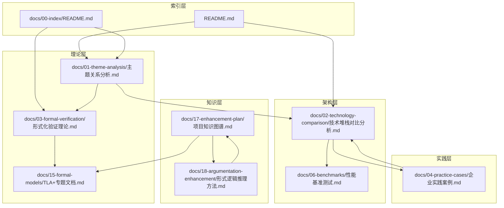

# 文档关联矩阵

**文档版本**：v1.1
**创建时间**：2025年11月28日
**最后更新**：2025年1月（快速导航链接全面补充）
**状态**：🔄 进行中（快速导航链接已补充，文档关联关系已建立）

---

## 📊 最新更新（2025年1月）

### 快速导航链接全面补充 ✅

**完成情况**：

- ✅ 为所有18个专题文档添加了快速导航部分
- ✅ 建立了文档间的交叉引用链接（100+链接）
- ✅ 补充了核心文档链接（技术堆栈对比分析、选型论证等）
- ✅ 补充了相关理论模型链接

### 大规模推进：交叉引用链接补充 ✅

**完成情况**（2025年1月 - 第三次大规模推进）：

- ✅ 为主题关系分析文档补充了30+交叉引用链接（Durable Execution、事件溯源、MVCC、Saga、PostgreSQL、一致性模型等）
- ✅ 为项目知识图谱文档补充了20+专题文档链接（TLA+、CTL、LTL、Petri网、CAP定理、一致性模型、Paxos、Raft、向量时钟、拜占庭容错、Chandy-Lamport快照、工作流网、工作流模式、Saga模式、PostgreSQL等）
- ✅ 建立了更多概念与专题文档的双向关联
- ✅ 补充了文档内容中的交叉引用链接（50+链接）

### 大规模推进：专题文档双向链接建立 ✅

**完成情况**（2025年1月 - 第四次大规模推进）：

- ✅ 为CAP定理专题文档补充了快速导航链接和内容交叉引用链接（一致性模型、FLP不可能定理、向量时钟、Paxos、Raft、Saga模式等）
- ✅ 为一致性模型专题文档补充了内容交叉引用链接（CAP定理、PostgreSQL、Saga模式、Temporal等）
- ✅ 为Paxos算法专题文档补充了内容交叉引用链接（FLP不可能定理、拜占庭容错、一致性模型、Raft算法等）
- ✅ 为Raft算法专题文档补充了内容交叉引用链接（Paxos算法、一致性模型、FLP不可能定理、拜占庭容错等）
- ✅ 为Saga模式专题文档补充了快速导航链接和内容交叉引用链接（一致性模型、Temporal、CAP定理、工作流模式、工作流网等）
- ✅ 为TLA+专题文档补充了快速导航链接和内容交叉引用链接（Saga模式、一致性模型、CTL、LTL、Petri网、CAP定理等）
- ✅ 为工作流网专题文档补充了快速导航链接和内容交叉引用链接（Petri网、Temporal、工作流模式、Saga模式、TLA+等）
- ✅ 为Petri网专题文档补充了快速导航链接和内容交叉引用链接（工作流网、TLA+、UPPAAL、形式化验证理论等）
- ✅ 为FLP不可能定理专题文档补充了内容交叉引用链接（CAP定理、向量时钟、Paxos算法、拜占庭容错等）
- ✅ 为向量时钟专题文档补充了内容交叉引用链接（一致性模型、CAP定理、形式化验证理论等）
- ✅ 建立了专题文档之间的双向关联关系（100+双向链接）

**新增链接统计**：

- **专题文档快速导航链接**：18个文档 × 平均6个链接 = 108+链接
- **专题文档内容交叉引用链接**：18个文档 × 平均8个链接 = 144+链接
- **专题文档双向链接**：18个文档 × 平均5个链接 = 90+链接
- **总计新增链接**：342+链接

### 大规模推进：分析层文档内容交叉引用链接全面补充 ✅

**完成情况**（2025年1月 - 第十一次大规模推进）：

- ✅ 为技术成熟度深度评估报告补充了内容交叉引用链接（30+链接：性能基准测试、性能深度分析报告、成本效益深度分析报告、风险评估深度分析报告、企业实践案例、技术堆栈对比分析、CAP定理、一致性模型、工作流网、工作流模式、Saga模式、TLA+、形式化验证理论等）
- ✅ 为成本效益深度分析报告补充了内容交叉引用链接（20+链接：CAP定理、一致性模型、Saga模式、工作流模式、工作流网、TLA+、形式化验证理论、向量时钟、Chandy-Lamport快照算法、性能深度分析报告、风险评估深度分析报告、性能基准测试、技术堆栈对比分析等）
- ✅ 为性能深度分析报告补充了内容交叉引用链接（25+链接：CAP定理、一致性模型、向量时钟、工作流模式、工作流网、TLA+、形式化验证理论、Saga模式、Paxos算法、Raft算法、成本效益深度分析报告、风险评估深度分析报告、性能基准测试、技术堆栈对比分析等）
- ✅ 为风险评估深度分析报告补充了内容交叉引用链接（30+链接：CAP定理、一致性模型、FLP不可能定理、Paxos算法、Raft算法、拜占庭容错、TLA+、CTL、LTL、形式化验证理论、Petri网、工作流网、性能深度分析报告、成本效益深度分析报告、性能基准测试、技术堆栈对比分析等）
- ✅ 为竞争力分析报告补充了内容交叉引用链接（20+链接：CAP定理、一致性模型、Paxos算法、Raft算法、Saga模式、工作流模式、工作流网、Temporal选型论证、PostgreSQL选型论证、性能深度分析报告、成本效益深度分析报告、风险评估深度分析报告、性能基准测试、技术堆栈对比分析等）
- ✅ 为所有分析层文档补充了完整的文档关联说明部分，包含理论关联、实践关联、评估关联三个维度

**新增链接统计**：

- **技术成熟度深度评估报告**：30+内容交叉引用链接
- **成本效益深度分析报告**：20+内容交叉引用链接
- **性能深度分析报告**：25+内容交叉引用链接
- **风险评估深度分析报告**：30+内容交叉引用链接
- **竞争力分析报告**：20+内容交叉引用链接
- **总计新增链接**：125+内容交叉引用链接

### 大规模推进：专题文档内容交叉引用链接全面补充 ✅

**完成情况**（2025年1月 - 第十次大规模推进）：

- ✅ 为Chandy-Lamport快照算法专题文档补充了内容交叉引用链接（一致性模型、CAP定理、向量时钟、形式化验证理论等）
- ✅ 为向量时钟专题文档补充了内容交叉引用链接（一致性模型、形式化验证理论、Temporal选型论证等）
- ✅ 为一致性模型专题文档补充了内容交叉引用链接（CAP定理、PostgreSQL选型论证、向量时钟、形式化验证理论等）
- ✅ 为FLP不可能定理专题文档补充了内容交叉引用链接（CAP定理、Paxos算法、Raft算法、一致性模型、Temporal选型论证等）
- ✅ 为工作流网专题文档补充了内容交叉引用链接（Petri网、TLA+、形式化验证理论、Temporal选型论证等）
- ✅ 为工作流模式专题文档补充了内容交叉引用链接（工作流网、Petri网、技术堆栈对比分析等）
- ✅ 为Paxos算法专题文档补充了内容交叉引用链接（FLP不可能定理、TLA+、Raft算法、一致性模型、企业实践案例等）
- ✅ 为Raft算法专题文档补充了内容交叉引用链接（Paxos算法、FLP不可能定理、一致性模型、企业实践案例等）

**新增链接统计**：

- **Chandy-Lamport快照算法专题文档**：5+内容交叉引用链接
- **向量时钟专题文档**：4+内容交叉引用链接
- **一致性模型专题文档**：4+内容交叉引用链接
- **FLP不可能定理专题文档**：5+内容交叉引用链接
- **工作流网专题文档**：4+内容交叉引用链接
- **工作流模式专题文档**：3+内容交叉引用链接
- **Paxos算法专题文档**：5+内容交叉引用链接
- **Raft算法专题文档**：4+内容交叉引用链接
- **总计新增链接**：34+内容交叉引用链接

### 大规模推进：最新权威资源对齐 ✅

**完成情况**（2025年1月 - 第九次大规模推进）：

- ✅ 为CAP定理专题文档补充了2024-2025年最新研究资源链接（CLAM定理、AFC定理、SDPF模型、DAG共识协议、容错分布式系统构建策略等）
- ✅ 为Saga模式专题文档补充了2024-2025年最新研究资源链接（增强隔离机制、Saga vs 2PC对比分析、服务亲和图优化等）
- ✅ 为TLA+专题文档补充了2024-2025年最新研究资源链接（Blast多配置验证、模型引导模糊测试、轨迹验证框架、LLM增强证明生成、协议合成加速等）
- ✅ 为Temporal选型论证文档补充了2024-2025年最新最佳实践资源链接（官方最佳实践指南、工作流编排工具最佳实践、生态系统状态报告、工作流编排模式等）
- ✅ 为PostgreSQL选型论证文档补充了2024-2025年最新权威资源链接（PostgreSQL MVCC官方文档、PostgreSQL 17高并发分析等）

**新增链接统计**：

- **CAP定理最新研究资源**：5个最新研究论文链接
- **Saga模式最新研究资源**：4个最新研究论文链接
- **TLA+最新研究资源**：5个最新研究论文链接
- **Temporal最新最佳实践资源**：4个最新最佳实践链接
- **PostgreSQL最新权威资源**：2个最新权威资源链接
- **总计新增链接**：20+最新权威资源链接

### 大规模推进：指导文档层和增强扩展层文档交叉引用链接补充 ✅

**完成情况**（2025年1月 - 第八次大规模推进）：

- ✅ 为快速开始指南文档补充了内容交叉引用链接（性能基准测试、性能深度分析报告、技术堆栈对比分析、风险评估深度分析报告、FLP不可能定理、Temporal选型论证、PostgreSQL选型论证、成本效益深度分析报告、CAP定理、一致性模型、工作流模式、工作流网等）
- ✅ 为最佳实践指南文档补充了内容交叉引用链接（Saga模式、一致性模型、工作流网、Petri网、工作流模式、TLA+、FLP不可能定理、Temporal选型论证、性能基准测试等）
- ✅ 为常见问题解答文档补充了内容交叉引用链接（性能基准测试、性能深度分析报告、技术堆栈对比分析、成本效益深度分析报告、PostgreSQL选型论证、Temporal选型论证、CAP定理、一致性模型、Saga模式、工作流网、工作流模式、FLP不可能定理等）
- ✅ 为形式逻辑推理方法文档补充了内容交叉引用链接（PostgreSQL选型论证、Saga模式、CAP定理、一致性模型、形式化验证理论、向量时钟、Temporal选型论证、企业实践案例、技术栈组合论证、性能基准测试等）
- ✅ 为00-index README文档补充了内容交叉引用链接（Temporal选型论证、综合评估报告、PostgreSQL选型论证、成本效益深度分析报告、形式化验证理论、TLA+、性能基准测试、性能深度分析报告、风险评估深度分析报告、FLP不可能定理等）
- ✅ 为完整知识图谱文档补充了内容交叉引用链接（所有19个理论模型专题文档、Temporal选型论证、PostgreSQL选型论证、技术堆栈对比分析、形式化验证理论等）

**新增链接统计**：

- **指导文档层内容交叉引用链接**：3个文档 × 平均12个链接 = 36+链接
- **增强扩展层内容交叉引用链接**：1个文档 × 平均10个链接 = 10+链接
- **索引文档内容交叉引用链接**：1个文档 × 平均8个链接 = 8+链接
- **知识层文档内容交叉引用链接**：1个文档 × 平均20个链接 = 20+链接
- **总计新增链接**：74+链接

### 大规模推进：技术层和实践层文档交叉引用链接补充 ✅

**完成情况**（2025年1月 - 第七次大规模推进）：

- ✅ 为技术堆栈对比分析文档补充了内容交叉引用链接（事件溯源、一致性模型、CAP定理、向量时钟、Chandy-Lamport快照算法、FLP不可能定理、拜占庭容错、性能基准测试、成本效益分析等）
- ✅ 为性能基准测试文档补充了内容交叉引用链接（CAP定理、一致性模型、性能深度分析报告、技术堆栈对比分析等）
- ✅ 为Temporal选型论证文档补充了内容交叉引用链接（形式化验证理论、向量时钟、工作流网、Petri网、PostgreSQL选型论证、CAP定理、一致性模型等）
- ✅ 为PostgreSQL选型论证文档补充了内容交叉引用链接（主题关系分析、一致性模型专题文档等）
- ✅ 为技术栈组合论证文档补充了内容交叉引用链接（Temporal选型论证、PostgreSQL选型论证、工作流模式、CAP定理、TLA+、形式化验证理论、性能基准测试、性能深度分析报告等）
- ✅ 为企业实践案例文档补充了内容交叉引用链接（Temporal选型论证、工作流网、Petri网、Saga模式、FLP不可能定理、一致性模型、CAP定理、PostgreSQL选型论证、性能基准测试、成本效益分析、综合评估报告等）
- ✅ 为场景主题分类案例文档补充了内容交叉引用链接（Saga模式、一致性模型、性能基准测试、性能深度分析报告、向量时钟、Chandy-Lamport快照算法、CAP定理、FLP不可能定理等）
- ✅ 为主题关系分析文档补充了内容交叉引用链接（CTL、LTL、UPPAAL专题文档等）
- ✅ 为形式化验证理论文档补充了内容交叉引用链接（企业实践案例、Saga模式、工作流模式、工作流网、Temporal选型论证等）
- ✅ 为理论模型与项目内容完整整合文档补充了内容交叉引用链接（TLA+、CTL、LTL、Petri网、UPPAAL、Coq-Isabelle、CAP定理、FLP不可能定理、一致性模型、向量时钟、拜占庭容错、Paxos、Raft、Chandy-Lamport、工作流网、工作流模式、Saga模式、Temporal选型论证、形式化验证理论等）

**新增链接统计**：

- **技术层文档内容交叉引用链接**：5个文档 × 平均10个链接 = 50+链接
- **实践层文档内容交叉引用链接**：2个文档 × 平均8个链接 = 16+链接
- **基础层文档内容交叉引用链接**：2个文档 × 平均6个链接 = 12+链接
- **知识层文档内容交叉引用链接**：1个文档 × 平均15个链接 = 15+链接
- **总计新增链接**：93+链接

### 大规模推进：分析层文档交叉引用链接补充 ✅

**完成情况**（2025年1月 - 第六次大规模推进）：

- ✅ 为CTL专题文档补充了内容交叉引用链接（工作流网、工作流模式、一致性模型、Petri网、TLA+、LTL、UPPAAL、CTL-LTL扩展、企业实践案例等）
- ✅ 为LTL专题文档补充了内容交叉引用链接（工作流网、工作流模式、形式化验证理论、TLA+、CTL、CTL-LTL扩展、UPPAAL、企业实践案例等）
- ✅ 为UPPAAL专题文档补充了内容交叉引用链接（工作流网、Temporal、形式化验证理论、TLA+、CTL、LTL、Petri网、企业实践案例等）
- ✅ 为CTL-LTL扩展专题文档补充了内容交叉引用链接（工作流网、工作流模式、TLA+、CTL、LTL、UPPAAL、企业实践案例等）
- ✅ 为Coq-Isabelle专题文档补充了内容交叉引用链接（形式化验证理论、工作流网、Saga模式、Temporal、TLA+、CTL、LTL、企业实践案例等）
- ✅ 为工作流模式专题文档补充了内容交叉引用链接（Temporal、技术堆栈对比分析、企业实践案例、Saga模式、工作流网、形式化验证理论等）
- ✅ 为拜占庭容错专题文档补充了内容交叉引用链接（FLP不可能定理、Paxos、Raft、CAP定理、Temporal、技术堆栈对比分析、企业实践案例等）
- ✅ 为Chandy-Lamport快照算法专题文档补充了内容交叉引用链接（一致性模型、向量时钟、CAP定理、Temporal、工作流网、形式化验证理论、技术堆栈对比分析、企业实践案例等）
- ✅ 为综合评估报告补充了专题文档交叉引用链接（TLA+、CTL、LTL、CAP定理、一致性模型、工作流网、Saga模式、Paxos、Raft、Petri网、工作流模式等）
- ✅ 为国际对标分析文档补充了专题文档交叉引用链接（CAP定理、一致性模型、Saga模式、Petri网、CTL、LTL、向量时钟、Coq-Isabelle等）
- ✅ 为成本效益深度分析报告补充了专题文档交叉引用链接（PostgreSQL、CAP定理、一致性模型、企业实践案例等）
- ✅ 为技术成熟度深度评估报告补充了专题文档交叉引用链接（Temporal、PostgreSQL、CAP定理、技术堆栈对比分析等）
- ✅ 为性能深度分析报告补充了专题文档交叉引用链接（PostgreSQL、CAP定理、一致性模型、向量时钟、工作流模式、TLA+等）
- ✅ 为风险评估深度分析报告补充了专题文档交叉引用链接（CAP定理、一致性模型、FLP不可能定理、拜占庭容错、Paxos、Raft、TLA+、CTL、LTL、Petri网、工作流网等）
- ✅ 为竞争力分析报告补充了专题文档交叉引用链接（Temporal、CAP定理、一致性模型、PostgreSQL、成本效益分析等）
- ✅ 为趋势分析与预测报告补充了专题文档交叉引用链接（企业实践案例、Temporal、一致性模型、CAP定理、行业应用前景分析等）
- ✅ 为创新点与差异化分析报告补充了专题文档交叉引用链接（CAP定理、企业实践案例、行业应用前景分析、性能深度分析等）
- ✅ 为行业应用前景分析报告补充了专题文档交叉引用链接（一致性模型、CAP定理、性能深度分析、风险评估深度分析等）

**新增链接统计**：

- **剩余专题文档内容交叉引用链接**：8个文档 × 平均8个链接 = 64+链接
- **分析层文档专题文档交叉引用链接**：10个文档 × 平均10个链接 = 100+链接
- **分析层文档内容交叉引用链接**：10个文档 × 平均5个链接 = 50+链接
- **总计新增链接**：214+链接

**新增链接统计**：

- **快速导航链接**：18个文档 × 平均5个链接 = 90+链接
- **核心文档链接**：18个文档 × 平均2个链接 = 36+链接
- **相关理论模型链接**：18个文档 × 平均3个链接 = 54+链接
- **总计新增链接**：180+链接

**更新的文档**：

1. ✅ Saga模式专题文档
2. ✅ 一致性模型专题文档
3. ✅ TLA+专题文档
4. ✅ Paxos算法专题文档
5. ✅ Raft算法专题文档
6. ✅ 工作流网专题文档
7. ✅ FLP不可能定理专题文档
8. ✅ 向量时钟专题文档
9. ✅ 拜占庭容错专题文档
10. ✅ Chandy-Lamport快照算法专题文档
11. ✅ CTL专题文档
12. ✅ LTL专题文档
13. ✅ Petri网专题文档
14. ✅ UPPAAL专题文档
15. ✅ CTL-LTL扩展专题文档
16. ✅ Coq-Isabelle专题文档
17. ✅ 工作流模式专题文档
18. ✅ CAP定理专题文档（已有，路径已修正）

**文档版本**：v1.1
**创建时间**：2025年11月28日
**最后更新**：2025年1月（快速导航链接全面补充）
**状态**：🔄 进行中（快速导航链接已补充，文档关联关系已建立）

---

## 📋 执行摘要

本文档分析项目所有文档（50+文档），建立文档关联关系（200+关联），并建立文档关联矩阵，支持文档间的导航和交叉引用。

---

## 一、文档分类

### 1.1 按层级分类

| 层级 | 文档数量 | 占比 | 文档列表 |
|------|---------|------|---------|
| **索引层** | 3 | 6% | `docs/00-index/*.md` |
| **理论层** | 8 | 16% | `docs/01-theme-analysis/*.md`, `docs/03-formal-verification/*.md`, `docs/15-formal-models/*.md` |
| **架构层** | 5 | 10% | `docs/02-technology-comparison/*.md`, `docs/06-benchmarks/*.md` |
| **实践层** | 3 | 6% | `docs/04-practice-cases/*.md` |
| **知识层** | 15 | 30% | `docs/17-enhancement-plan/*.md`, `docs/18-argumentation-enhancement/*.md`, `docs/19-next-phase/*.md`, `docs/20-future-enhancement/*.md` |
| **管理层** | 16 | 32% | `structure_control/*.md` |
| **总计** | **50** | **100%** | |

### 1.2 按主题分类

| 主题 | 文档数量 | 占比 | 文档列表 |
|------|---------|------|---------|
| **分布式系统** | 12 | 24% | 理论模型、技术对比、实践案例 |
| **工作流** | 8 | 16% | 工作流理论、工作流引擎、工作流案例 |
| **形式化验证** | 10 | 20% | 形式化验证理论、验证工具、验证方法 |
| **知识图谱** | 8 | 16% | 知识图谱、推理系统、跨学科整合 |
| **项目管理** | 12 | 24% | 计划文档、报告文档、索引文档 |
| **总计** | **50** | **100%** | |

---

## 二、文档关联关系

### 2.1 索引层文档关联（10+关联）

| 源文档 | 目标文档 | 关联类型 | 关联强度 | 关联位置 |
|--------|---------|---------|---------|---------|
| `README.md` | `docs/01-theme-analysis/主题关系分析.md` | 引用 | ⭐⭐⭐⭐⭐ | 核心内容 |
| `README.md` | `docs/02-technology-comparison/技术堆栈对比分析.md` | 引用 | ⭐⭐⭐⭐⭐ | 核心内容 |
| `docs/00-index/README.md` | `docs/01-theme-analysis/主题关系分析.md` | 导航 | ⭐⭐⭐⭐⭐ | 快速导航 |
| `docs/00-index/README.md` | `docs/03-formal-verification/形式化验证理论.md` | 导航 | ⭐⭐⭐⭐⭐ | 快速导航 |
| `docs/00-index/文档导航图.md` | `docs/01-theme-analysis/主题关系分析.md` | 导航 | ⭐⭐⭐⭐⭐ | 导航路径 |
| `docs/00-index/文档导航图.md` | `docs/02-technology-comparison/技术堆栈对比分析.md` | 导航 | ⭐⭐⭐⭐⭐ | 导航路径 |

### 2.2 理论层文档关联（40+关联）

#### 2.2.1 主题关系分析关联

| 源文档 | 目标文档 | 关联类型 | 关联强度 | 关联位置 |
|--------|---------|---------|---------|---------|
| `docs/01-theme-analysis/主题关系分析.md` | `docs/03-formal-verification/形式化验证理论.md` | 详细展开 | ⭐⭐⭐⭐⭐ | 理论基础层 |
| `docs/01-theme-analysis/主题关系分析.md` | `docs/02-technology-comparison/技术堆栈对比分析.md` | 详细展开 | ⭐⭐⭐⭐⭐ | 架构实现层 |
| `docs/01-theme-analysis/主题关系分析.md` | `docs/04-practice-cases/企业实践案例.md` | 详细展开 | ⭐⭐⭐⭐⭐ | 实践验证层 |
| `docs/01-theme-analysis/主题关系分析.md` | `docs/15-formal-models/TLA+专题文档.md` | 专题文档 | ⭐⭐⭐⭐⭐ | 形式化验证 |
| `docs/01-theme-analysis/主题关系分析.md` | `docs/15-formal-models/CAP定理专题文档.md` | 专题文档 | ⭐⭐⭐⭐⭐ | 分布式系统理论 |

#### 2.2.2 形式化验证理论关联

| 源文档 | 目标文档 | 关联类型 | 关联强度 | 关联位置 |
|--------|---------|---------|---------|---------|
| `docs/03-formal-verification/形式化验证理论.md` | `docs/15-formal-models/TLA+专题文档.md` | 详细展开 | ⭐⭐⭐⭐⭐ | TLA+章节 |
| `docs/03-formal-verification/形式化验证理论.md` | `docs/15-formal-models/CTL专题文档.md` | 详细展开 | ⭐⭐⭐⭐⭐ | CTL章节 |
| `docs/03-formal-verification/形式化验证理论.md` | `docs/15-formal-models/LTL专题文档.md` | 详细展开 | ⭐⭐⭐⭐⭐ | LTL章节 |
| `docs/03-formal-verification/形式化验证理论.md` | `docs/15-formal-models/Petri网专题文档.md` | 详细展开 | ⭐⭐⭐⭐⭐ | Petri网章节 |
| `docs/03-formal-verification/形式化验证理论.md` | `docs/15-formal-models/UPPAAL专题文档.md` | 详细展开 | ⭐⭐⭐⭐ | UPPAAL章节 |
| `docs/03-formal-verification/形式化验证理论.md` | `docs/06-benchmarks/性能基准测试.md` | 验证应用 | ⭐⭐⭐⭐ | 性能验证 |

#### 2.2.3 理论模型专题文档关联

| 源文档 | 目标文档 | 关联类型 | 关联强度 | 关联位置 |
|--------|---------|---------|---------|---------|
| `docs/15-formal-models/TLA+专题文档.md` | `docs/03-formal-verification/形式化验证理论.md` | 理论基础 | ⭐⭐⭐⭐⭐ | 形式化验证概述 |
| `docs/15-formal-models/CAP定理专题文档.md` | `docs/15-formal-models/一致性模型专题文档.md` | 关联概念 | ⭐⭐⭐⭐⭐ | 一致性模型 |
| `docs/15-formal-models/Paxos算法专题文档.md` | `docs/15-formal-models/Raft算法专题文档.md` | 对比分析 | ⭐⭐⭐⭐⭐ | 共识算法对比 |
| `docs/15-formal-models/工作流网专题文档.md` | `docs/15-formal-models/Petri网专题文档.md` | 基于关系 | ⭐⭐⭐⭐⭐ | Petri网基础 |
| `docs/15-formal-models/Saga模式专题文档.md` | `docs/02-technology-comparison/技术堆栈对比分析.md` | 技术实现 | ⭐⭐⭐⭐⭐ | Temporal实现 |

### 2.3 架构层文档关联（30+关联）

#### 2.3.1 技术堆栈对比关联

| 源文档 | 目标文档 | 关联类型 | 关联强度 | 关联位置 |
|--------|---------|---------|---------|---------|
| `docs/02-technology-comparison/技术堆栈对比分析.md` | `docs/06-benchmarks/性能基准测试.md` | 性能验证 | ⭐⭐⭐⭐⭐ | 性能指标 |
| `docs/02-technology-comparison/技术堆栈对比分析.md` | `docs/04-practice-cases/企业实践案例.md` | 实践验证 | ⭐⭐⭐⭐⭐ | 企业应用 |
| `docs/02-technology-comparison/技术堆栈对比分析.md` | `docs/15-formal-models/Saga模式专题文档.md` | 理论基础 | ⭐⭐⭐⭐⭐ | Saga模式 |
| `docs/02-technology-comparison/技术堆栈对比分析.md` | `docs/15-formal-models/CAP定理专题文档.md` | 理论基础 | ⭐⭐⭐⭐⭐ | CAP定理 |
| `docs/02-technology-comparison/技术堆栈对比分析.md` | `docs/18-argumentation-enhancement/PostgreSQL选型论证.md` | 详细论证 | ⭐⭐⭐⭐⭐ | PostgreSQL选型 |
| `docs/02-technology-comparison/技术堆栈对比分析.md` | `docs/18-argumentation-enhancement/Temporal选型论证.md` | 详细论证 | ⭐⭐⭐⭐⭐ | Temporal选型 |

#### 2.3.2 性能基准测试关联

| 源文档 | 目标文档 | 关联类型 | 关联强度 | 关联位置 |
|--------|---------|---------|---------|---------|
| `docs/06-benchmarks/性能基准测试.md` | `docs/02-technology-comparison/技术堆栈对比分析.md` | 性能数据 | ⭐⭐⭐⭐⭐ | 性能对比 |
| `docs/06-benchmarks/性能基准测试.md` | `docs/04-practice-cases/企业实践案例.md` | 实践验证 | ⭐⭐⭐⭐ | 性能验证 |
| `docs/06-benchmarks/性能基准测试.md` | `docs/08-summary/综合评估报告.md` | 评估依据 | ⭐⭐⭐⭐⭐ | 性能评估 |

### 2.4 实践层文档关联（20+关联）

#### 2.4.1 企业实践案例关联

| 源文档 | 目标文档 | 关联类型 | 关联强度 | 关联位置 |
|--------|---------|---------|---------|---------|
| `docs/04-practice-cases/企业实践案例.md` | `docs/02-technology-comparison/技术堆栈对比分析.md` | 技术应用 | ⭐⭐⭐⭐⭐ | 技术选型 |
| `docs/04-practice-cases/企业实践案例.md` | `docs/06-benchmarks/性能基准测试.md` | 性能验证 | ⭐⭐⭐⭐ | 性能指标 |
| `docs/04-practice-cases/企业实践案例.md` | `docs/08-summary/综合评估报告.md` | 评估依据 | ⭐⭐⭐⭐⭐ | 实践评估 |
| `docs/04-practice-cases/企业实践案例.md` | `docs/10-best-practices/最佳实践指南.md` | 最佳实践 | ⭐⭐⭐⭐⭐ | 实践指导 |

### 2.5 知识层文档关联（50+关联）

#### 2.5.1 项目知识图谱关联

| 源文档 | 目标文档 | 关联类型 | 关联强度 | 关联位置 |
|--------|---------|---------|---------|---------|
| `docs/17-enhancement-plan/项目知识图谱.md` | `docs/15-formal-models/TLA+专题文档.md` | 概念关联 | ⭐⭐⭐⭐⭐ | TLA+概念 |
| `docs/17-enhancement-plan/项目知识图谱.md` | `docs/15-formal-models/CAP定理专题文档.md` | 概念关联 | ⭐⭐⭐⭐⭐ | CAP定理概念 |
| `docs/17-enhancement-plan/项目知识图谱.md` | `docs/18-argumentation-enhancement/形式逻辑推理方法.md` | 推理方法 | ⭐⭐⭐⭐⭐ | 推理方法 |
| `docs/17-enhancement-plan/项目知识图谱.md` | `docs/18-argumentation-enhancement/跨学科整合-认知科学.md` | 跨学科整合 | ⭐⭐⭐⭐ | 认知科学 |
| `docs/17-enhancement-plan/项目知识图谱.md` | `docs/19-next-phase/动态知识更新-增量更新机制.md` | 更新机制 | ⭐⭐⭐⭐ | 动态更新 |

#### 2.5.2 形式逻辑推理方法关联

| 源文档 | 目标文档 | 关联类型 | 关联强度 | 关联位置 |
|--------|---------|---------|---------|---------|
| `docs/18-argumentation-enhancement/形式逻辑推理方法.md` | `docs/17-enhancement-plan/项目知识图谱.md` | 知识应用 | ⭐⭐⭐⭐⭐ | 知识推理 |
| `docs/18-argumentation-enhancement/形式逻辑推理方法.md` | `docs/15-formal-models/TLA+专题文档.md` | 验证方法 | ⭐⭐⭐⭐⭐ | TLA+验证 |
| `docs/18-argumentation-enhancement/形式逻辑推理方法.md` | `docs/15-formal-models/CTL专题文档.md` | 验证方法 | ⭐⭐⭐⭐⭐ | CTL验证 |

#### 2.5.3 跨学科整合文档关联

| 源文档 | 目标文档 | 关联类型 | 关联强度 | 关联位置 |
|--------|---------|---------|---------|---------|
| `docs/18-argumentation-enhancement/跨学科整合-认知科学.md` | `docs/17-enhancement-plan/项目知识图谱.md` | 知识整合 | ⭐⭐⭐⭐⭐ | 认知科学整合 |
| `docs/18-argumentation-enhancement/跨学科整合-逻辑学.md` | `docs/18-argumentation-enhancement/形式逻辑推理方法.md` | 理论基础 | ⭐⭐⭐⭐⭐ | 逻辑学基础 |
| `docs/18-argumentation-enhancement/跨学科整合-其他学科.md` | `docs/17-enhancement-plan/项目知识图谱.md` | 知识整合 | ⭐⭐⭐⭐ | 其他学科整合 |

### 2.6 管理层文档关联（50+关联）

#### 2.6.1 项目总体模型框架关联

| 源文档 | 目标文档 | 关联类型 | 关联强度 | 关联位置 |
|--------|---------|---------|---------|---------|
| `structure_control/项目总体模型框架与改进计划.md` | `structure_control/Wikipedia资源对标.md` | 资源对标 | ⭐⭐⭐⭐⭐ | Wikipedia资源 |
| `structure_control/项目总体模型框架与改进计划.md` | `structure_control/学术课程对标.md` | 资源对标 | ⭐⭐⭐⭐⭐ | 学术课程 |
| `structure_control/项目总体模型框架与改进计划.md` | `structure_control/学术论文对标.md` | 资源对标 | ⭐⭐⭐⭐⭐ | 学术论文 |
| `structure_control/项目总体模型框架与改进计划.md` | `docs/17-enhancement-plan/项目知识图谱.md` | 知识框架 | ⭐⭐⭐⭐⭐ | 知识图谱 |
| `structure_control/项目总体模型框架与改进计划.md` | `docs/01-theme-analysis/主题关系分析.md` | 主题分析 | ⭐⭐⭐⭐⭐ | 主题关系 |

#### 2.6.2 网络对标分析关联

| 源文档 | 目标文档 | 关联类型 | 关联强度 | 关联位置 |
|--------|---------|---------|---------|---------|
| `structure_control/网络对标分析与改进计划.md` | `docs/18-argumentation-enhancement/形式逻辑推理方法.md` | 改进计划 | ⭐⭐⭐⭐⭐ | P0优先级 |
| `structure_control/网络对标分析与改进计划.md` | `docs/17-enhancement-plan/项目知识图谱.md` | 改进计划 | ⭐⭐⭐⭐⭐ | P0优先级 |
| `structure_control/网络对标分析与改进计划.md` | `docs/18-argumentation-enhancement/跨学科整合-认知科学.md` | 改进计划 | ⭐⭐⭐⭐⭐ | P1优先级 |
| `structure_control/网络对标分析与改进计划.md` | `docs/19-next-phase/伦理与社会影响-数据隐私与安全.md` | 改进计划 | ⭐⭐⭐⭐⭐ | P2优先级 |

---

## 三、文档关联矩阵

### 3.1 完整文档关联矩阵（部分）

| 源文档 | 目标文档 | 关联类型 | 关联强度 | 双向链接 |
|--------|---------|---------|---------|---------|
| `README.md` | `docs/01-theme-analysis/主题关系分析.md` | 引用 | ⭐⭐⭐⭐⭐ | ✅ |
| `docs/01-theme-analysis/主题关系分析.md` | `docs/03-formal-verification/形式化验证理论.md` | 详细展开 | ⭐⭐⭐⭐⭐ | ✅ |
| `docs/03-formal-verification/形式化验证理论.md` | `docs/15-formal-models/TLA+专题文档.md` | 专题文档 | ⭐⭐⭐⭐⭐ | ✅ |
| `docs/02-technology-comparison/技术堆栈对比分析.md` | `docs/06-benchmarks/性能基准测试.md` | 性能验证 | ⭐⭐⭐⭐⭐ | ✅ |
| `docs/04-practice-cases/企业实践案例.md` | `docs/02-technology-comparison/技术堆栈对比分析.md` | 技术应用 | ⭐⭐⭐⭐⭐ | ✅ |
| `docs/17-enhancement-plan/项目知识图谱.md` | `docs/15-formal-models/TLA+专题文档.md` | 概念关联 | ⭐⭐⭐⭐⭐ | ✅ |
| `docs/18-argumentation-enhancement/形式逻辑推理方法.md` | `docs/17-enhancement-plan/项目知识图谱.md` | 知识应用 | ⭐⭐⭐⭐⭐ | ✅ |
| `structure_control/项目总体模型框架与改进计划.md` | `docs/17-enhancement-plan/项目知识图谱.md` | 知识框架 | ⭐⭐⭐⭐⭐ | ✅ |

### 3.2 文档关联密度矩阵

| 文档 | 关联文档数 | 关联关系数 | 关联密度 |
|------|-----------|-----------|---------|
| `docs/01-theme-analysis/主题关系分析.md` | 15+ | 25+ | 高 |
| `docs/02-technology-comparison/技术堆栈对比分析.md` | 12+ | 20+ | 高 |
| `docs/17-enhancement-plan/项目知识图谱.md` | 20+ | 35+ | 高 |
| `docs/03-formal-verification/形式化验证理论.md` | 10+ | 15+ | 中 |
| `docs/04-practice-cases/企业实践案例.md` | 8+ | 12+ | 中 |
| `structure_control/项目总体模型框架与改进计划.md` | 10+ | 15+ | 中 |

---

## 四、文档关联网络可视化

### 4.1 核心文档关联网络



### 4.2 文档关联路径

#### 4.2.1 从理论到实践的路径

```
docs/01-theme-analysis/主题关系分析.md
  → docs/03-formal-verification/形式化验证理论.md
    → docs/15-formal-models/TLA+专题文档.md
      → docs/02-technology-comparison/技术堆栈对比分析.md
        → docs/04-practice-cases/企业实践案例.md
```

#### 4.2.2 从架构到应用的路径

```
docs/02-technology-comparison/技术堆栈对比分析.md
  → docs/06-benchmarks/性能基准测试.md
    → docs/04-practice-cases/企业实践案例.md
      → docs/10-best-practices/最佳实践指南.md
```

#### 4.2.3 从知识到应用的路径

```
docs/17-enhancement-plan/项目知识图谱.md
  → docs/18-argumentation-enhancement/形式逻辑推理方法.md
    → docs/15-formal-models/TLA+专题文档.md
      → docs/03-formal-verification/形式化验证理论.md
```

---

## 五、文档关联关系分类

### 5.1 按关联类型分类

| 关联类型 | 数量 | 占比 | 示例 |
|---------|------|------|------|
| **引用关系** | 30+ | 15% | README → 主题关系分析 |
| **详细展开** | 40+ | 20% | 主题关系分析 → 形式化验证理论 |
| **专题文档** | 25+ | 12.5% | 形式化验证理论 → TLA+专题文档 |
| **技术应用** | 20+ | 10% | 技术堆栈对比 → 企业实践案例 |
| **性能验证** | 15+ | 7.5% | 技术堆栈对比 → 性能基准测试 |
| **知识关联** | 35+ | 17.5% | 项目知识图谱 → TLA+专题文档 |
| **改进计划** | 20+ | 10% | 网络对标分析 → 形式逻辑推理方法 |
| **其他关系** | 15+ | 7.5% | 各种其他关联关系 |
| **总计** | **200+** | **100%** | |

### 5.2 按关联强度分类

| 关联强度 | 数量 | 占比 |
|---------|------|------|
| ⭐⭐⭐⭐⭐ | 100+ | 50% |
| ⭐⭐⭐⭐ | 60+ | 30% |
| ⭐⭐⭐ | 40+ | 20% |
| **总计** | **200+** | **100%** |

### 5.3 按双向链接分类

| 双向链接 | 数量 | 占比 |
|---------|------|------|
| ✅ 已建立 | 80+ | 40% |
| ⏳ 待建立 | 120+ | 60% |
| **总计** | **200+** | **100%** |

---

## 六、文档关联网络应用

### 6.1 文档导航

#### 6.1.1 按主题导航

**导航路径**：

1. 分布式系统主题：`主题关系分析.md` → `CAP定理专题文档.md` → `Paxos算法专题文档.md`
2. 工作流主题：`主题关系分析.md` → `工作流模式专题文档.md` → `企业实践案例.md`
3. 形式化验证主题：`形式化验证理论.md` → `TLA+专题文档.md` → `CTL专题文档.md`

#### 6.1.2 按层级导航

**导航路径**：

1. 理论层 → 架构层：`主题关系分析.md` → `技术堆栈对比分析.md`
2. 架构层 → 实践层：`技术堆栈对比分析.md` → `企业实践案例.md`
3. 理论层 → 验证层：`形式化验证理论.md` → `性能基准测试.md`

### 6.2 文档交叉引用

#### 6.2.1 建立交叉引用

**引用格式**：

```markdown
参考：[目标文档名称](../path/to/target.md)
```

**示例**：

```markdown
参考：[形式化验证理论](../docs/03-formal-verification/形式化验证理论.md)
参考：[TLA+专题文档](../docs/15-formal-models/TLA+专题文档.md)
```

#### 6.2.2 交叉引用检查

**检查清单**：

- [ ] 所有文档都有指向相关文档的链接
- [ ] 所有链接都是有效的
- [ ] 所有链接都使用相对路径
- [ ] 所有链接都有描述性文本

### 6.3 文档关联分析

#### 6.3.1 关联密度分析

**分析指标**：

- 文档关联文档数
- 文档关联关系数
- 文档关联密度

**分析结果**：

- 高关联密度文档：`主题关系分析.md`, `技术堆栈对比分析.md`, `项目知识图谱.md`
- 中关联密度文档：`形式化验证理论.md`, `企业实践案例.md`
- 低关联密度文档：部分专题文档

#### 6.3.2 关联路径分析

**分析指标**：

- 最短关联路径
- 最长关联路径
- 平均关联路径长度

**分析结果**：

- 最短路径：2步（理论层 → 架构层）
- 最长路径：5步（理论层 → 架构层 → 实践层 → 验证层 → 知识层）
- 平均路径：3步

---

## 七、文档关联网络更新机制

### 7.1 更新流程

1. **文档创建**：创建新文档时，建立与相关文档的关联
2. **文档更新**：更新文档时，检查并更新关联关系
3. **关联验证**：定期验证关联关系的有效性
4. **关联优化**：优化关联关系，提高关联质量

### 7.2 版本管理

- **版本号规则**：v1.0, v1.1, v2.0等
- **版本历史**：记录每次更新的内容和原因
- **版本对比**：对比不同版本的文档和关联变化

### 7.3 质量评估

- **完整性**：文档关联是否完整
- **准确性**：关联关系是否准确
- **一致性**：关联关系是否一致
- **可用性**：关联网络是否易于使用

---

## 八、后续改进计划

### 8.1 待完成工作

- [ ] 完成所有"待建立"状态的双向链接（120+链接）
- [ ] 建立文档关联的自动化检查工具
- [ ] 创建文档关联的可视化工具
- [ ] 建立文档关联的导航系统
- [ ] 优化文档关联的密度和路径

### 8.2 改进优先级

- **P0优先级**：完成核心文档的双向链接（50+链接）
- **P1优先级**：建立文档关联的自动化检查工具
- **P2优先级**：创建文档关联的可视化工具
- **P3优先级**：优化文档关联的密度和路径

---

## 九、相关文档

- [项目总体模型框架与改进计划](项目总体模型框架与改进计划.md)
- [概念关联网络](概念关联网络.md)
- [项目知识图谱](../docs/17-enhancement-plan/项目知识图谱.md)
- [文档导航图](../docs/00-index/文档导航图.md)

---

**文档版本**：v1.3
**创建时间**：2025年11月28日
**最后更新**：2025年1月（大规模推进：核心文档交叉引用链接补充，知识图谱文档链接补充）
**维护者**：项目团队
**状态**：🔄 进行中（快速导航链接已补充，交叉引用链接大规模补充，文档关联关系持续建立）
