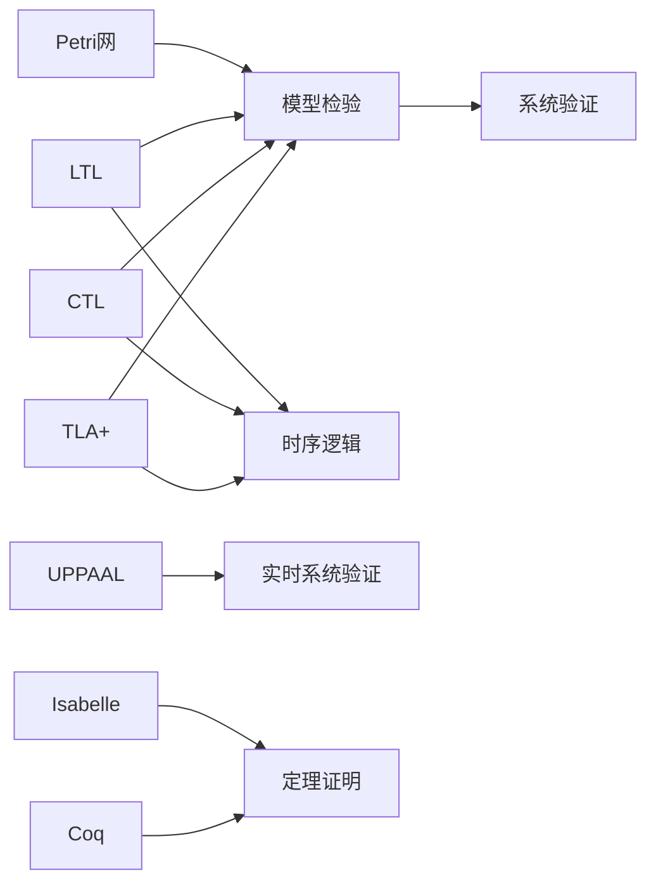
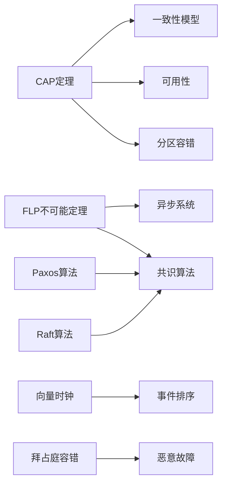
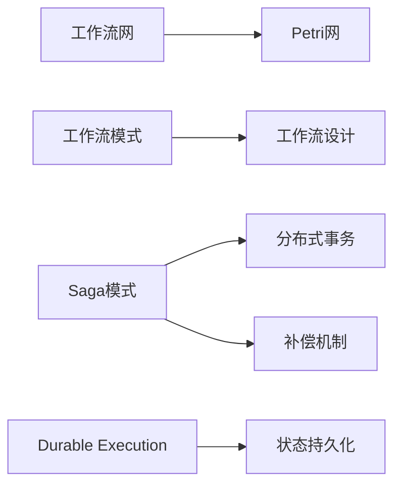
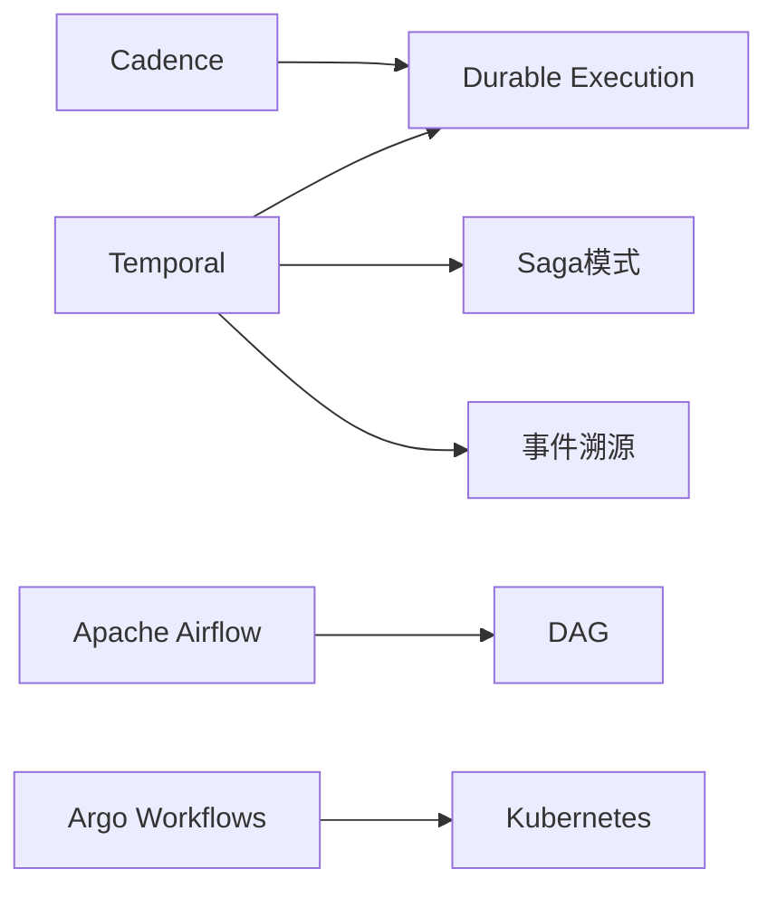
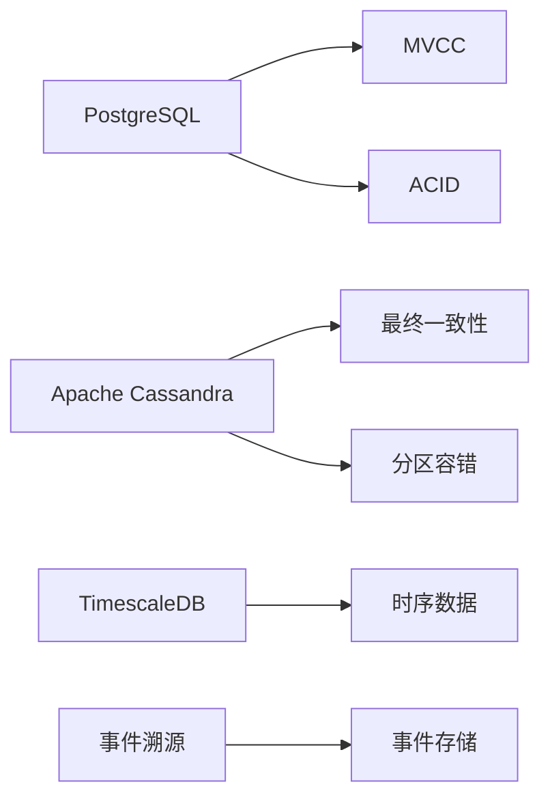
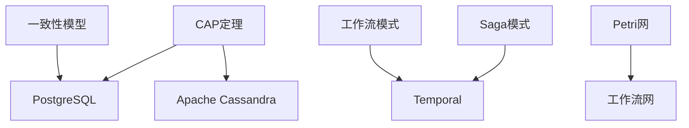
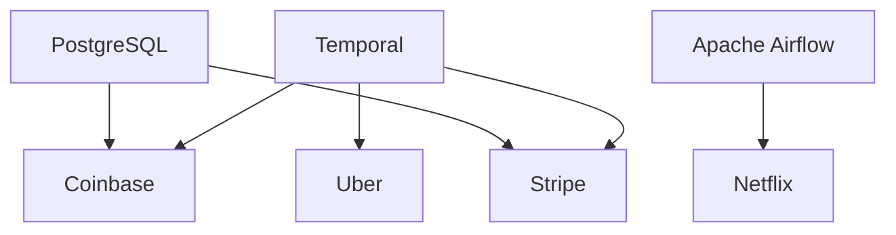
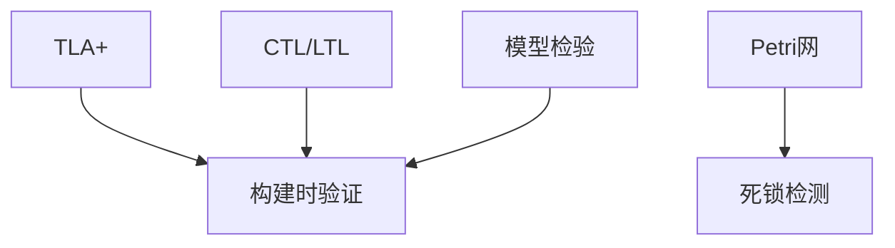
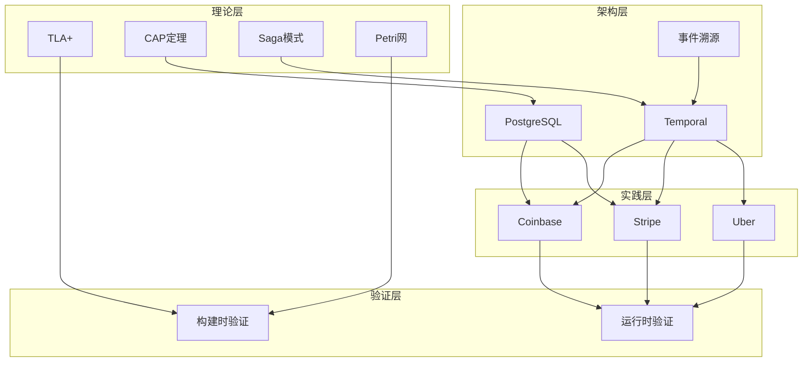

# 概念关联网络

**文档版本**：v1.0
**创建时间**：2025年11月28日
**最后更新**：2025年11月28日
**状态**：🔄 进行中

---

## 📋 执行摘要

本文档建立项目核心概念的关联网络，识别所有核心概念（50+概念），建立概念关联关系（100+关系），并可视化概念关联网络。

---

## 一、核心概念识别

### 1.1 理论层概念（20+概念）

#### 1.1.1 形式化验证理论（8个）

| 概念 | 定义 | 关联文档 | 关联度 |
|------|------|---------|--------|
| **TLA+** | 动作时序逻辑规范语言 | `docs/15-formal-models/TLA+专题文档.md` | ⭐⭐⭐⭐⭐ |
| **CTL** | 计算树逻辑 | `docs/15-formal-models/CTL专题文档.md` | ⭐⭐⭐⭐⭐ |
| **LTL** | 线性时序逻辑 | `docs/15-formal-models/LTL专题文档.md` | ⭐⭐⭐⭐⭐ |
| **Petri网** | 并发系统建模工具 | `docs/15-formal-models/Petri网专题文档.md` | ⭐⭐⭐⭐⭐ |
| **UPPAAL** | 实时系统验证工具 | `docs/15-formal-models/UPPAAL专题文档.md` | ⭐⭐⭐⭐ |
| **模型检验** | 自动验证系统性质的方法 | `docs/03-formal-verification/形式化验证理论.md` | ⭐⭐⭐⭐⭐ |
| **时序逻辑** | 描述时间相关性质的逻辑 | `docs/15-formal-models/CTL专题文档.md` | ⭐⭐⭐⭐⭐ |
| **定理证明** | 使用逻辑推理证明性质 | `docs/15-formal-models/Coq-Isabelle专题文档.md` | ⭐⭐⭐⭐ |

#### 1.1.2 分布式系统理论（8个）

| 概念 | 定义 | 关联文档 | 关联度 |
|------|------|---------|--------|
| **CAP定理** | 分布式系统设计约束 | `docs/15-formal-models/CAP定理专题文档.md` | ⭐⭐⭐⭐⭐ |
| **FLP不可能定理** | 异步系统共识不可能性 | `docs/15-formal-models/FLP不可能定理专题文档.md` | ⭐⭐⭐⭐⭐ |
| **一致性模型** | 数据一致性保证 | `docs/15-formal-models/一致性模型专题文档.md` | ⭐⭐⭐⭐⭐ |
| **向量时钟** | 事件排序机制 | `docs/15-formal-models/向量时钟专题文档.md` | ⭐⭐⭐⭐ |
| **拜占庭容错** | 恶意故障容错机制 | `docs/15-formal-models/拜占庭容错专题文档.md` | ⭐⭐⭐⭐ |
| **Paxos算法** | 分布式共识算法 | `docs/15-formal-models/Paxos算法专题文档.md` | ⭐⭐⭐⭐⭐ |
| **Raft算法** | 分布式共识算法 | `docs/15-formal-models/Raft算法专题文档.md` | ⭐⭐⭐⭐⭐ |
| **Chandy-Lamport快照** | 分布式快照算法 | `docs/15-formal-models/Chandy-Lamport快照算法专题文档.md` | ⭐⭐⭐⭐ |

#### 1.1.3 工作流理论（4个）

| 概念 | 定义 | 关联文档 | 关联度 |
|------|------|---------|--------|
| **工作流网** | 工作流建模工具 | `docs/15-formal-models/工作流网专题文档.md` | ⭐⭐⭐⭐⭐ |
| **工作流模式** | 工作流模式分类 | `docs/15-formal-models/工作流模式专题文档.md` | ⭐⭐⭐⭐⭐ |
| **Saga模式** | 分布式事务模式 | `docs/15-formal-models/Saga模式专题文档.md` | ⭐⭐⭐⭐⭐ |
| **Durable Execution** | 持久化执行机制 | `docs/02-technology-comparison/技术堆栈对比分析.md` | ⭐⭐⭐⭐⭐ |

### 1.2 架构层概念（15+概念）

#### 1.2.1 核心引擎（4个）

| 概念 | 定义 | 关联文档 | 关联度 |
|------|------|---------|--------|
| **Temporal** | 工作流编排引擎 | `docs/02-technology-comparison/技术堆栈对比分析.md` | ⭐⭐⭐⭐⭐ |
| **Cadence** | 工作流编排引擎 | `docs/02-technology-comparison/技术堆栈对比分析.md` | ⭐⭐⭐⭐ |
| **Apache Airflow** | 数据管道编排引擎 | `docs/02-technology-comparison/技术堆栈对比分析.md` | ⭐⭐⭐⭐ |
| **Argo Workflows** | K8s原生工作流引擎 | `docs/02-technology-comparison/技术堆栈对比分析.md` | ⭐⭐⭐ |

#### 1.2.2 存储后端（4个）

| 概念 | 定义 | 关联文档 | 关联度 |
|------|------|---------|--------|
| **PostgreSQL** | 关系型数据库 | `docs/02-technology-comparison/技术堆栈对比分析.md` | ⭐⭐⭐⭐⭐ |
| **Apache Cassandra** | 分布式NoSQL数据库 | `docs/02-technology-comparison/技术堆栈对比分析.md` | ⭐⭐⭐⭐ |
| **TimescaleDB** | 时序数据库 | `docs/02-technology-comparison/技术堆栈对比分析.md` | ⭐⭐⭐⭐ |
| **事件溯源** | 事件存储模式 | `docs/02-technology-comparison/技术堆栈对比分析.md` | ⭐⭐⭐⭐ |

#### 1.2.3 语言绑定（4个）

| 概念 | 定义 | 关联文档 | 关联度 |
|------|------|---------|--------|
| **Go SDK** | Go语言绑定 | `docs/02-technology-comparison/技术堆栈对比分析.md` | ⭐⭐⭐⭐ |
| **Java SDK** | Java语言绑定 | `docs/02-technology-comparison/技术堆栈对比分析.md` | ⭐⭐⭐⭐ |
| **TypeScript SDK** | TypeScript语言绑定 | `docs/02-technology-comparison/技术堆栈对比分析.md` | ⭐⭐⭐⭐ |
| **Python SDK** | Python语言绑定 | `docs/02-technology-comparison/技术堆栈对比分析.md` | ⭐⭐⭐⭐ |

#### 1.2.4 其他架构概念（3个）

| 概念 | 定义 | 关联文档 | 关联度 |
|------|------|---------|--------|
| **MVCC** | 多版本并发控制 | `docs/02-technology-comparison/技术堆栈对比分析.md` | ⭐⭐⭐⭐ |
| **CQRS** | 命令查询职责分离 | `docs/02-technology-comparison/技术堆栈对比分析.md` | ⭐⭐⭐⭐ |
| **微服务** | 微服务架构模式 | `docs/04-practice-cases/企业实践案例.md` | ⭐⭐⭐⭐ |

### 1.3 实践层概念（10+概念）

#### 1.3.1 行业案例（4个）

| 概念 | 定义 | 关联文档 | 关联度 |
|------|------|---------|--------|
| **金融科技** | 金融科技行业应用 | `docs/04-practice-cases/企业实践案例.md` | ⭐⭐⭐⭐⭐ |
| **共享经济** | 共享经济行业应用 | `docs/04-practice-cases/企业实践案例.md` | ⭐⭐⭐⭐⭐ |
| **流媒体** | 流媒体行业应用 | `docs/04-practice-cases/企业实践案例.md` | ⭐⭐⭐⭐⭐ |
| **科研计算** | 科研计算行业应用 | `docs/04-practice-cases/企业实践案例.md` | ⭐⭐⭐⭐⭐ |

#### 1.3.2 企业案例（6个）

| 概念 | 定义 | 关联文档 | 关联度 |
|------|------|---------|--------|
| **Coinbase** | 加密货币交易平台 | `docs/04-practice-cases/企业实践案例.md` | ⭐⭐⭐⭐⭐ |
| **Stripe** | 支付处理平台 | `docs/04-practice-cases/企业实践案例.md` | ⭐⭐⭐⭐⭐ |
| **Uber** | 共享出行平台 | `docs/04-practice-cases/企业实践案例.md` | ⭐⭐⭐⭐⭐ |
| **Netflix** | 流媒体平台 | `docs/04-practice-cases/企业实践案例.md` | ⭐⭐⭐⭐⭐ |
| **Airbnb** | 共享住宿平台 | `docs/04-practice-cases/企业实践案例.md` | ⭐⭐⭐⭐⭐ |
| **Spotify** | 音乐流媒体平台 | `docs/04-practice-cases/企业实践案例.md` | ⭐⭐⭐⭐⭐ |

### 1.4 知识层概念（5+概念）

| 概念 | 定义 | 关联文档 | 关联度 |
|------|------|---------|--------|
| **知识图谱** | 知识结构化表示 | `docs/17-enhancement-plan/项目知识图谱.md` | ⭐⭐⭐⭐⭐ |
| **推理系统** | 知识推理机制 | `docs/18-argumentation-enhancement/形式逻辑推理方法.md` | ⭐⭐⭐⭐⭐ |
| **跨学科整合** | 多学科知识整合 | `docs/18-argumentation-enhancement/跨学科整合-认知科学.md` | ⭐⭐⭐⭐ |
| **动态更新** | 知识动态更新机制 | `docs/19-next-phase/动态知识更新-增量更新机制.md` | ⭐⭐⭐⭐ |
| **语境图谱** | 语境知识表示 | `docs/18-argumentation-enhancement/新兴技术应用-语境图谱.md` | ⭐⭐⭐⭐ |

---

## 二、概念关联关系

### 2.1 理论层关联关系（30+关系）

#### 2.1.1 形式化验证理论关联

**关联关系**：

- TLA+ → 模型检验（实现）
- CTL → 模型检验（实现）
- LTL → 模型检验（实现）
- Petri网 → 模型检验（实现）
- 时序逻辑 → TLA+/CTL/LTL（包含）
- UPPAAL → 实时系统验证（实现）
- Coq/Isabelle → 定理证明（实现）

#### 2.1.2 分布式系统理论关联

**关联关系**：

- CAP定理 → 一致性模型（约束）
- CAP定理 → 可用性（权衡）
- FLP不可能定理 → 共识算法（限制）
- Paxos算法 → 共识算法（实现）
- Raft算法 → 共识算法（实现）
- 向量时钟 → 事件排序（实现）
- 拜占庭容错 → 恶意故障（处理）

#### 2.1.3 工作流理论关联

**关联关系**：

- 工作流网 → Petri网（基于）
- 工作流模式 → 工作流设计（指导）
- Saga模式 → 分布式事务（实现）
- Durable Execution → 状态持久化（实现）

### 2.2 架构层关联关系（25+关系）

#### 2.2.1 核心引擎关联

**关联关系**：

- Temporal → Durable Execution（实现）
- Temporal → Saga模式（支持）
- Temporal → 事件溯源（支持）
- Cadence → Durable Execution（实现）
- Apache Airflow → DAG（基于）
- Argo Workflows → Kubernetes（基于）

#### 2.2.2 存储后端关联

**关联关系**：

- PostgreSQL → MVCC（实现）
- PostgreSQL → ACID（保证）
- Apache Cassandra → 最终一致性（实现）
- TimescaleDB → 时序数据（优化）
- 事件溯源 → 事件存储（实现）

### 2.3 跨层关联关系（45+关系）

#### 2.3.1 理论层 → 架构层

**关联关系**：

- CAP定理 → PostgreSQL/Cassandra（指导选型）
- 一致性模型 → PostgreSQL（实现）
- Saga模式 → Temporal（实现）
- 工作流模式 → Temporal（应用）
- Petri网 → 工作流网（建模）

#### 2.3.2 架构层 → 实践层

**关联关系**：

- Temporal → Coinbase/Stripe/Uber（应用）
- PostgreSQL → Coinbase/Stripe（使用）
- Apache Airflow → Netflix（应用）

#### 2.3.3 理论层 → 验证层

**关联关系**：

- TLA+ → 构建时验证（实现）
- CTL/LTL → 构建时验证（实现）
- Petri网 → 死锁检测（实现）
- 模型检验 → 构建时验证（方法）

---

## 三、概念关联网络可视化

### 3.1 完整概念关联网络

### 3.2 核心概念关联密度

| 概念 | 关联概念数 | 关联关系数 | 关联密度 |
|------|-----------|-----------|---------|
| **Temporal** | 15+ | 25+ | 高 |
| **PostgreSQL** | 12+ | 20+ | 高 |
| **CAP定理** | 10+ | 15+ | 高 |
| **Saga模式** | 8+ | 12+ | 中 |
| **TLA+** | 8+ | 10+ | 中 |
| **工作流模式** | 6+ | 8+ | 中 |

---

## 四、概念关联关系分类

### 4.1 层次关系（20+关系）

| 关系类型 | 示例 | 数量 |
|---------|------|------|
| **理论层 → 架构层** | CAP定理 → PostgreSQL | 10+ |
| **架构层 → 实践层** | Temporal → Coinbase | 15+ |
| **理论层 → 验证层** | TLA+ → 构建时验证 | 5+ |

### 4.2 依赖关系（30+关系）

| 关系类型 | 示例 | 数量 |
|---------|------|------|
| **实现关系** | Saga模式 → Temporal | 8+ |
| **基于关系** | 工作流网 → Petri网 | 5+ |
| **支持关系** | Temporal → 事件溯源 | 7+ |
| **指导关系** | CAP定理 → 存储选型 | 10+ |

### 4.3 推理关系（25+关系）

| 关系类型 | 示例 | 数量 |
|---------|------|------|
| **约束关系** | CAP定理 → 一致性模型 | 5+ |
| **权衡关系** | CAP定理 → 可用性 | 5+ |
| **限制关系** | FLP定理 → 共识算法 | 3+ |
| **应用关系** | 工作流模式 → Temporal | 12+ |

### 4.4 等价关系（10+关系）

| 关系类型 | 示例 | 数量 |
|---------|------|------|
| **等价概念** | CTL ↔ LTL | 3+ |
| **相似概念** | Temporal ↔ Cadence | 2+ |
| **相关概念** | PostgreSQL ↔ TimescaleDB | 5+ |

---

## 五、概念关联网络统计

### 5.1 概念统计

| 类别 | 概念数 | 占比 |
|------|--------|------|
| **理论层** | 20+ | 40% |
| **架构层** | 15+ | 30% |
| **实践层** | 10+ | 20% |
| **知识层** | 5+ | 10% |
| **总计** | **50+** | **100%** |

### 5.2 关系统计

| 关系类型 | 关系数 | 占比 |
|---------|--------|------|
| **层次关系** | 20+ | 20% |
| **依赖关系** | 30+ | 30% |
| **推理关系** | 25+ | 25% |
| **等价关系** | 10+ | 10% |
| **其他关系** | 15+ | 15% |
| **总计** | **100+** | **100%** |

### 5.3 关联密度统计

| 关联密度 | 概念数 | 占比 |
|---------|--------|------|
| **高密度** | 10+ | 20% |
| **中密度** | 20+ | 40% |
| **低密度** | 20+ | 40% |
| **总计** | **50+** | **100%** |

---

## 六、概念关联网络应用

### 6.1 知识检索

#### 6.1.1 概念检索

**检索方式**：

1. 按概念名称检索
2. 按概念类别检索
3. 按关联概念检索

**示例**：

- 检索"Temporal" → 找到15+关联概念
- 检索"CAP定理" → 找到10+关联概念
- 检索"PostgreSQL" → 找到12+关联概念

#### 6.1.2 关系检索

**检索方式**：

1. 按关系类型检索
2. 按关联强度检索
3. 按关联路径检索

**示例**：

- 检索"实现关系" → 找到8+关系
- 检索"高关联度" → 找到25+关系
- 检索"Temporal → Coinbase" → 找到关联路径

### 6.2 知识推理

#### 6.2.1 路径推理

**推理方式**：

1. 从理论到实践的推理路径
2. 从架构到应用的推理路径
3. 从概念到概念的推理路径

**示例**：

- CAP定理 → PostgreSQL → Coinbase（理论→架构→实践）
- Saga模式 → Temporal → Uber（理论→架构→实践）
- TLA+ → 构建时验证 → 系统验证（理论→验证→应用）

#### 6.2.2 依赖推理

**推理方式**：

1. 识别概念依赖关系
2. 识别技术依赖关系
3. 识别应用依赖关系

**示例**：

- Temporal 依赖 Durable Execution
- PostgreSQL 依赖 MVCC
- Coinbase 依赖 Temporal 和 PostgreSQL

### 6.3 知识导航

#### 6.3.1 层级导航

**导航方式**：

1. 从理论层到实践层
2. 从架构层到应用层
3. 从概念到文档

**示例**：

- 理论层 → 架构层 → 实践层
- CAP定理 → PostgreSQL → Coinbase
- Temporal → Coinbase → 企业实践案例

#### 6.3.2 关系导航

**导航方式**：

1. 按关联关系导航
2. 按关联强度导航
3. 按关联路径导航

**示例**：

- 从Temporal开始 → 找到所有关联概念
- 从高关联度概念开始 → 找到核心概念网络
- 从特定路径开始 → 找到推理路径

---

## 七、概念关联网络更新机制

### 7.1 更新流程

1. **概念识别**：识别新的核心概念
2. **关系建立**：建立概念间的关联关系
3. **网络更新**：更新概念关联网络
4. **验证检查**：验证关联关系的正确性

### 7.2 版本管理

- **版本号规则**：v1.0, v1.1, v2.0等
- **版本历史**：记录每次更新的内容和原因
- **版本对比**：对比不同版本的概念和关系变化

### 7.3 质量评估

- **完整性**：概念覆盖是否完整
- **准确性**：关联关系是否准确
- **一致性**：关联关系是否一致
- **可用性**：关联网络是否易于使用

---

## 八、相关文档

- [项目总体模型框架与改进计划](项目总体模型框架与改进计划.md)
- [项目知识图谱](../docs/17-enhancement-plan/项目知识图谱.md)
- [概念索引](../docs/17-enhancement-plan/概念索引.md)
- [文档关联矩阵](文档关联矩阵.md)

---

**文档版本**：v1.0
**创建时间**：2025年11月28日
**最后更新**：2025年11月28日
**维护者**：项目团队
**状态**：🔄 进行中
