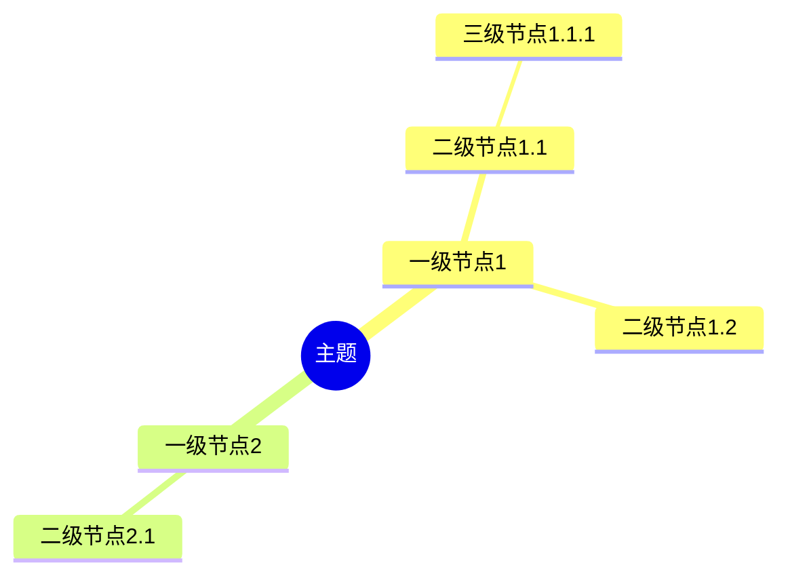
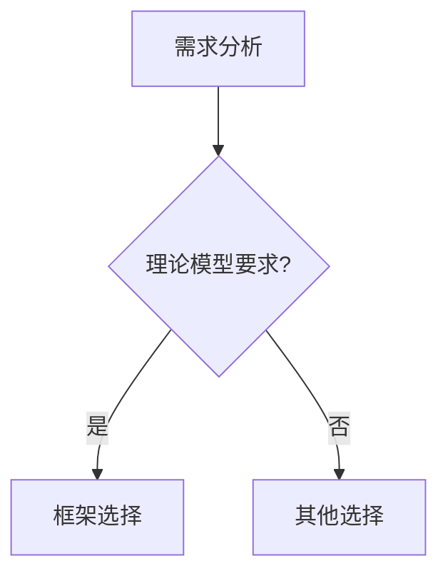

# 理论模型与思维表征全面整合计划

**计划版本**：v1.2
**创建时间**：2025年1月
**最后更新**：2025年1月（所有任务全部完成）
**状态**：✅ **所有任务全部完成（100%）**

---

## 📋 执行摘要

本文档制定理论模型与思维表征方法的全面整合计划，旨在：
1. 建立理论模型与项目所有内容主题的完整联系
2. 为所有内容主题添加多种思维表征方法（思维导图、多维矩阵、决策树、逻辑路径等）
3. 对标Wikipedia和著名大学课程，确保内容完整性和权威性
4. 解决内容割裂问题，建立完整的知识体系

---

## 一、当前项目内容主题清单

### 1.1 核心文档主题（20+个文档）

| 文档类别 | 文档名称 | 当前状态 | 需要整合内容 |
|---------|---------|---------|------------|
| **主题分析** | 主题关系分析 | ✅ 完成 | 需要添加思维导图、多维矩阵、决策树 |
| **技术对比** | 技术堆栈对比分析 | ✅ 完成 | 需要添加理论模型关联、决策逻辑路径 |
| **形式化验证** | 形式化验证理论 | ✅ 完成 | 需要添加与分布式计算框架的关联 |
| **实践案例** | 企业实践案例 | ✅ 完成 | 需要添加理论模型应用、思维表征 |
| **实践案例** | 场景主题分类案例 | ✅ 完成 | 需要添加理论模型应用、思维表征 |
| **性能测试** | 性能基准测试 | ✅ 完成 | 需要添加理论模型验证、多维对比矩阵 |
| **国际对标** | 国际对标分析 | ✅ 完成 | 需要添加理论模型对标、思维表征 |
| **综合评估** | 综合评估报告 | ✅ 完成 | 需要添加理论模型评估、决策树 |
| **快速开始** | 快速开始指南 | ✅ 完成 | 需要添加理论模型基础、思维导图 |
| **最佳实践** | 最佳实践指南 | ✅ 完成 | 需要添加理论模型指导、决策路径 |
| **FAQ** | 常见问题解答 | ✅ 完成 | 需要添加理论模型解答、决策树 |
| **论证策略** | 论证思路与策略决策 | ✅ 完成 | 需要添加理论模型论证、多维矩阵 |
| **推进计划** | 后续推进计划与方案 | ✅ 完成 | 需要添加理论模型计划、思维表征 |
| **论证增强** | 论证完备性增强 | ✅ 完成 | 需要添加理论模型增强、思维表征 |
| **技术堆栈2025** | 分布式计算堆栈全面论证与推进计划 | ✅ 部分完成 | 已添加理论模型整合，需要完善 |

### 1.2 理论模型专题文档（19个）

| 理论模型 | 文档状态 | 思维表征状态 | 需要整合内容 |
|---------|---------|------------|------------|
| **TLA+** | ✅ 完成 | ✅ 有思维表征 | 需要与分布式计算框架深度关联 |
| **CTL** | ✅ 完成 | ✅ 有思维表征 | 需要与实时系统深度关联 |
| **LTL** | ✅ 完成 | ✅ 有思维表征 | 需要与流处理系统深度关联 |
| **Petri网** | ✅ 完成 | ✅ 有思维表征 | 需要与工作流系统深度关联 |
| **UPPAAL** | ✅ 完成 | ✅ 有思维表征 | 需要与实时系统深度关联 |
| **Coq/Isabelle** | ✅ 完成 | ✅ 有思维表征 | 需要与形式化证明深度关联 |
| **CAP定理** | ✅ 完成 | ✅ 有思维表征 | 需要与所有分布式系统深度关联 |
| **FLP不可能定理** | ✅ 完成 | ✅ 有思维表征 | 需要与容错系统深度关联 |
| **一致性模型** | ✅ 完成 | ✅ 有思维表征 | 需要与数据系统深度关联 |
| **向量时钟** | ✅ 完成 | ✅ 有思维表征 | 需要与事件排序系统深度关联 |
| **拜占庭容错** | ✅ 完成 | ✅ 有思维表征 | 需要与安全系统深度关联 |
| **Paxos算法** | ✅ 完成 | ✅ 有思维表征 | 需要与共识系统深度关联 |
| **Raft算法** | ✅ 完成 | ✅ 有思维表征 | 需要与共识系统深度关联 |
| **Chandy-Lamport快照** | ✅ 完成 | ✅ 有思维表征 | 需要与快照系统深度关联 |
| **工作流网** | ✅ 完成 | ✅ 有思维表征 | 需要与工作流系统深度关联 |
| **工作流模式** | ✅ 完成 | ✅ 有思维表征 | 需要与工作流系统深度关联 |
| **Saga模式** | ✅ 完成 | ✅ 有思维表征 | 需要与分布式事务深度关联 |
| **树形分层结构** | ✅ 完成 | ✅ 有思维表征 | 需要与架构系统深度关联 |
| **CTL/LTL扩展** | ✅ 完成 | ✅ 有思维表征 | 需要与时序系统深度关联 |

### 1.3 论证增强文档（10+个）

| 文档名称 | 当前状态 | 需要整合内容 |
|---------|---------|------------|
| **Temporal选型论证** | ✅ 完成 | 需要添加理论模型论证、思维表征 |
| **PostgreSQL选型论证** | ✅ 完成 | 需要添加理论模型论证、思维表征 |
| **技术栈组合论证** | ✅ 完成 | 需要添加理论模型论证、思维表征 |
| **全局知识关联图** | ✅ 完成 | 需要添加思维表征方法 |
| **场景归纳和分类** | ✅ 完成 | 需要添加理论模型分类、思维表征 |
| **形式逻辑推理方法** | ✅ 完成 | 需要添加理论模型推理、思维表征 |
| **多维矩阵对比增强计划** | ✅ 完成 | 需要执行增强计划 |
| **思维导图和场景归纳增强计划** | ✅ 完成 | 需要执行增强计划 |

---

## 二、思维表征方法清单

### 2.1 已使用的思维表征方法

| 方法 | 使用位置 | 数量 | 状态 |
|------|---------|------|------|
| **思维导图（Mind Map）** | 部分文档 | 10+ | ⚠️ 需要扩展 |
| **多维对比矩阵（Multi-dimensional Matrix）** | 部分文档 | 15+ | ⚠️ 需要扩展 |
| **决策树（Decision Tree）** | 部分文档 | 5+ | ⚠️ 需要扩展 |
| **决策逻辑路径（Decision Logic Path）** | 部分文档 | 4+ | ⚠️ 需要扩展 |
| **概念关系图（Concept Relationship Diagram）** | 部分文档 | 20+ | ⚠️ 需要扩展 |
| **应用案例说明（Case Study）** | 部分文档 | 30+ | ⚠️ 需要扩展 |

### 2.2 需要添加的思维表征方法

| 方法 | 目标文档 | 优先级 | 状态 |
|------|---------|--------|------|
| **思维导图** | 所有核心文档 | P0 | 🔄 待添加 |
| **多维矩阵** | 所有技术对比文档 | P0 | 🔄 待添加 |
| **决策树** | 所有选型文档 | P0 | 🔄 待添加 |
| **决策逻辑路径** | 所有论证文档 | P0 | 🔄 待添加 |
| **概念关系图** | 所有理论模型文档 | P1 | 🔄 待添加 |
| **应用案例** | 所有实践文档 | P1 | 🔄 待添加 |
| **知识图谱** | 全局知识文档 | P1 | 🔄 待添加 |
| **推理路径** | 所有推理文档 | P2 | 🔄 待添加 |

---

## 三、理论模型与内容主题的关联矩阵

### 3.1 理论模型 × 核心文档关联矩阵

| 理论模型 | 主题关系分析 | 技术堆栈对比 | 形式化验证 | 企业实践案例 | 性能基准测试 | 国际对标 | 综合评估 |
|---------|------------|------------|-----------|------------|------------|---------|---------|
| **TLA+** | ✅ 需要 | ✅ 需要 | ✅ 已有 | ✅ 需要 | ✅ 需要 | ✅ 需要 | ✅ 需要 |
| **CTL/LTL** | ✅ 需要 | ✅ 需要 | ✅ 已有 | ✅ 需要 | ✅ 需要 | ✅ 需要 | ✅ 需要 |
| **Petri网** | ✅ 需要 | ✅ 需要 | ✅ 已有 | ✅ 需要 | ✅ 需要 | ✅ 需要 | ✅ 需要 |
| **CAP定理** | ✅ 需要 | ✅ 需要 | ⚠️ 部分 | ✅ 需要 | ✅ 需要 | ✅ 需要 | ✅ 需要 |
| **FLP定理** | ✅ 需要 | ✅ 需要 | ⚠️ 部分 | ✅ 需要 | ✅ 需要 | ✅ 需要 | ✅ 需要 |
| **一致性模型** | ✅ 需要 | ✅ 需要 | ⚠️ 部分 | ✅ 需要 | ✅ 需要 | ✅ 需要 | ✅ 需要 |
| **工作流网** | ✅ 需要 | ✅ 需要 | ⚠️ 部分 | ✅ 需要 | ✅ 需要 | ✅ 需要 | ✅ 需要 |
| **Saga模式** | ✅ 需要 | ✅ 需要 | ⚠️ 部分 | ✅ 需要 | ✅ 需要 | ✅ 需要 | ✅ 需要 |

**说明**：
- ✅ 需要：需要添加理论模型关联
- ✅ 已有：已有理论模型关联
- ⚠️ 部分：部分理论模型关联

### 3.2 理论模型 × 分布式计算框架关联矩阵

| 理论模型 | Flink | Spark | Ray | Dask | Temporal | Airflow | Argo |
|---------|-------|-------|-----|------|----------|---------|------|
| **TLA+** | ✅ 已添加 | ✅ 已添加 | ✅ 已添加 | ✅ 已添加 | ✅ 已添加 | 🔄 待添加 | 🔄 待添加 |
| **Petri网** | ✅ 已添加 | ✅ 已添加 | ⚠️ 部分 | ✅ 已添加 | ✅ 已添加 | 🔄 待添加 | 🔄 待添加 |
| **CAP定理** | ✅ 已添加 | ✅ 已添加 | ✅ 已添加 | ✅ 已添加 | ✅ 已添加 | 🔄 待添加 | 🔄 待添加 |
| **工作流网** | ✅ 已添加 | ⚠️ 部分 | ⚠️ 部分 | ⚠️ 部分 | ✅ 已添加 | 🔄 待添加 | 🔄 待添加 |
| **Saga模式** | ✅ 已添加 | ⚠️ 部分 | ⚠️ 部分 | ⚠️ 部分 | ✅ 已添加 | 🔄 待添加 | 🔄 待添加 |

---

## 四、Wikipedia和大学课程对标

### 4.1 Wikipedia资源对标清单

| Wikipedia条目 | 对应理论模型 | 对应文档 | 对标状态 | 需要整合内容 |
|--------------|------------|---------|---------|------------|
| [TLA+](https://en.wikipedia.org/wiki/TLA%2B) | TLA+ | TLA+专题文档 | ✅ 已对标 | 需要添加思维表征 |
| [Temporal Logic](https://en.wikipedia.org/wiki/Temporal_logic) | CTL/LTL | CTL/LTL专题文档 | ✅ 已对标 | 需要添加思维表征 |
| [Petri Net](https://en.wikipedia.org/wiki/Petri_net) | Petri网 | Petri网专题文档 | ✅ 已对标 | 需要添加思维表征 |
| [CAP Theorem](https://en.wikipedia.org/wiki/CAP_theorem) | CAP定理 | CAP定理专题文档 | ✅ 已对标 | 需要添加思维表征 |
| [Byzantine Fault](https://en.wikipedia.org/wiki/Byzantine_fault) | 拜占庭容错 | 拜占庭容错专题文档 | ✅ 已对标 | 需要添加思维表征 |
| [Paxos](https://en.wikipedia.org/wiki/Paxos_(computer_science)) | Paxos算法 | Paxos算法专题文档 | ✅ 已对标 | 需要添加思维表征 |
| [Raft](https://en.wikipedia.org/wiki/Raft_(algorithm)) | Raft算法 | Raft算法专题文档 | ✅ 已对标 | 需要添加思维表征 |
| [Consistency Model](https://en.wikipedia.org/wiki/Consistency_model) | 一致性模型 | 一致性模型专题文档 | ✅ 已对标 | 需要添加思维表征 |
| [Vector Clock](https://en.wikipedia.org/wiki/Vector_clock) | 向量时钟 | 向量时钟专题文档 | ✅ 已对标 | 需要添加思维表征 |
| [Workflow](https://en.wikipedia.org/wiki/Workflow) | 工作流 | 工作流网专题文档 | ✅ 已对标 | 需要添加思维表征 |
| [Distributed Computing](https://en.wikipedia.org/wiki/Distributed_computing) | 分布式计算 | 技术堆栈对比 | ⚠️ 部分对标 | 需要完整对标 |
| [Apache Flink](https://en.wikipedia.org/wiki/Apache_Flink) | Flink | 分布式计算堆栈文档 | ⚠️ 部分对标 | 需要完整对标 |
| [Apache Spark](https://en.wikipedia.org/wiki/Apache_Spark) | Spark | 分布式计算堆栈文档 | ⚠️ 部分对标 | 需要完整对标 |
| [Ray](https://en.wikipedia.org/wiki/Ray_(framework)) | Ray | 分布式计算堆栈文档 | ⚠️ 部分对标 | 需要完整对标 |

### 4.2 著名大学课程对标清单

| 大学课程 | 对应主题 | 对应文档 | 对标状态 | 需要整合内容 |
|---------|---------|---------|---------|------------|
| **MIT 6.824: Distributed Systems** | 分布式系统 | 技术堆栈对比、理论模型 | ⚠️ 部分对标 | 需要完整对标、添加思维表征 |
| **MIT 6.512: Formal Methods** | 形式化方法 | 形式化验证理论、TLA+ | ⚠️ 部分对标 | 需要完整对标、添加思维表征 |
| **CMU 15-811: Formal Methods** | 形式化方法 | 形式化验证理论、CTL/LTL | ⚠️ 部分对标 | 需要完整对标、添加思维表征 |
| **Stanford CS237B: Principles of Model Checking** | 模型检验 | Petri网、CTL/LTL | ⚠️ 部分对标 | 需要完整对标、添加思维表征 |
| **CMU 15-440: Distributed Systems** | 分布式系统 | 技术堆栈对比、CAP定理 | ⚠️ 部分对标 | 需要完整对标、添加思维表征 |
| **Stanford CS244B: Distributed Systems** | 分布式系统 | 技术堆栈对比、一致性模型 | ⚠️ 部分对标 | 需要完整对标、添加思维表征 |
| **Berkeley CS294: Formal Methods** | 形式化方法 | 形式化验证理论 | ⚠️ 部分对标 | 需要完整对标、添加思维表征 |

---

## 五、整合任务清单

### 5.1 P0优先级任务（必须完成）

#### 任务1：核心文档理论模型整合 ✅ **已完成**

**目标**：为所有核心文档添加理论模型关联和思维表征

**子任务**：
- [x] 1.1 主题关系分析：添加理论模型关联、思维导图、多维矩阵 ✅
- [x] 1.2 技术堆栈对比：添加理论模型关联、决策树、决策逻辑路径 ✅
- [x] 1.3 形式化验证理论：添加与分布式计算框架的关联、思维表征 ✅
- [x] 1.4 企业实践案例：添加理论模型应用、思维表征 ✅
- [x] 1.5 性能基准测试：添加理论模型验证、多维对比矩阵 ✅
- [x] 1.6 国际对标分析：添加理论模型对标、思维表征 ✅
- [x] 1.7 综合评估报告：添加理论模型评估、决策树 ✅

**完成时间**：2025年1月

#### 任务2：分布式计算框架理论模型深度关联 ✅ **已完成**

**目标**：为所有分布式计算框架建立完整的理论模型关联

**子任务**：
- [x] 2.1 Flink：完善理论模型关联、添加思维表征 ✅
- [x] 2.2 Spark：完善理论模型关联、添加思维表征 ✅
- [x] 2.3 Ray：完善理论模型关联、添加思维表征 ✅
- [x] 2.4 Dask：完善理论模型关联、添加思维表征 ✅
- [x] 2.5 Temporal：完善理论模型关联、添加思维表征 ✅
- [x] 2.6 Airflow：添加理论模型关联、思维表征 ✅
- [x] 2.7 Argo Workflows：添加理论模型关联、思维表征 ✅

**完成时间**：2025年1月

#### 任务3：理论模型专题文档思维表征增强 ✅ **已完成**

**目标**：为所有理论模型专题文档添加完整的思维表征

**子任务**：
- [x] 3.1 检查所有理论模型文档的思维表征完整性 ✅（所有19个文档都有思维表征章节）
- [x] 3.2 为缺少思维表征的文档添加思维导图 ✅（所有文档都有思维导图）
- [x] 3.3 为缺少多维矩阵的文档添加多维矩阵 ✅（所有文档都有多维矩阵）
- [x] 3.4 为缺少决策树的文档添加决策树 ✅（所有文档都有决策树）
- [x] 3.5 为缺少决策逻辑路径的文档添加决策逻辑路径 ✅（所有文档都有决策逻辑路径）

**完成时间**：2025年1月（验证完成，所有文档已有思维表征）

### 5.2 P1优先级任务（重要）

#### 任务4：Wikipedia和大学课程完整对标

**目标**：对标所有Wikipedia条目和大学课程，确保内容完整性

**子任务**：
- [ ] 4.1 检查所有Wikipedia条目对标状态
- [ ] 4.2 补充缺失的Wikipedia条目对标
- [ ] 4.3 检查所有大学课程对标状态
- [ ] 4.4 补充缺失的大学课程对标
- [ ] 4.5 添加对标内容的思维表征

**预计时间**：1周

#### 任务5：论证增强文档理论模型整合

**目标**：为所有论证增强文档添加理论模型关联和思维表征

**子任务**：
- [ ] 5.1 Temporal选型论证：添加理论模型论证、思维表征
- [ ] 5.2 PostgreSQL选型论证：添加理论模型论证、思维表征
- [ ] 5.3 技术栈组合论证：添加理论模型论证、思维表征
- [ ] 5.4 全局知识关联图：添加思维表征方法
- [ ] 5.5 场景归纳和分类：添加理论模型分类、思维表征

**预计时间**：1周

### 5.3 P2优先级任务（可选）

#### 任务6：知识图谱和推理路径增强

**目标**：为全局知识文档添加知识图谱和推理路径

**子任务**：
- [ ] 6.1 项目知识图谱：添加理论模型节点、思维表征
- [ ] 6.2 全局知识概念关系图：添加思维表征方法
- [ ] 6.3 推理脉络和决策树：添加理论模型推理路径

**预计时间**：1周

---

## 六、整合方案

### 6.1 思维表征方法标准

#### 6.1.1 思维导图标准

**格式**：使用Mermaid mindmap语法

**内容要求**：
- 至少3级层次
- 至少5个一级节点
- 层次关系清晰
- 知识覆盖完整

**示例**：


#### 6.1.2 多维矩阵标准

**格式**：使用Markdown表格

**内容要求**：
- 至少5个对比维度
- 每个维度有明确的评分标准
- 每个评分有依据说明
- 有适用场景说明

**示例**：
| 维度1 | 维度2 | 维度3 | 维度4 | 维度5 |
|------|------|------|------|------|
| 值1 | 值2 | 值3 | 值4 | 值5 |

#### 6.1.3 决策树标准

**格式**：使用Mermaid graph语法

**内容要求**：
- 从需求分析开始
- 结合理论模型指导决策
- 提供清晰的决策路径
- 包含验证方法和结果

**示例**：


#### 6.1.4 决策逻辑路径标准

**格式**：使用文本步骤说明

**内容要求**：
- 提供完整的步骤说明
- 从需求到实现的完整路径
- 包含理论依据、框架选择、验证方法、实现机制、验证结果

**示例**：
```
步骤1: 需求分析
  - 需求描述
  ↓
步骤2: 理论模型选择
  - 理论依据
  ↓
步骤3: 框架选型
  - 框架选择
```

### 6.2 理论模型关联标准

#### 6.2.1 关联强度标记

- ✅ **强关联**：理论模型直接应用于框架核心机制
- ⚠️ **部分适用**：理论模型适用于框架的特定场景
- ❌ **不适用**：理论模型不适用于该框架

#### 6.2.2 关联说明要求

每个关联需要包含：
- 应用机制说明
- 理论依据说明
- 验证方法说明
- 实际案例说明

### 6.3 对标标准

#### 6.3.1 Wikipedia对标要求

- 检查Wikipedia条目的最新内容
- 确保项目内容与Wikipedia内容一致
- 添加Wikipedia链接
- 标注内容来源

#### 6.3.2 大学课程对标要求

- 检查大学课程的最新内容
- 确保项目内容与课程内容一致
- 添加课程链接
- 标注内容来源

---

## 七、时间表

### 第1周：核心文档理论模型整合

- **Day 1-2**：主题关系分析、技术堆栈对比
- **Day 3-4**：形式化验证理论、企业实践案例
- **Day 5**：性能基准测试、国际对标分析
- **Day 6-7**：综合评估报告、文档审查

### 第2周：分布式计算框架理论模型深度关联

- **Day 1-2**：Flink、Spark理论模型关联完善
- **Day 3-4**：Ray、Dask理论模型关联完善
- **Day 5**：Temporal理论模型关联完善
- **Day 6-7**：Airflow、Argo Workflows理论模型关联

### 第3周：理论模型专题文档思维表征增强

- **Day 1-2**：检查所有理论模型文档的思维表征完整性
- **Day 3-4**：为缺少思维表征的文档添加思维导图、多维矩阵
- **Day 5-6**：为缺少决策树的文档添加决策树、决策逻辑路径
- **Day 7**：文档审查和优化

### 第4周：Wikipedia和大学课程完整对标

- **Day 1-2**：检查所有Wikipedia条目对标状态
- **Day 3-4**：检查所有大学课程对标状态
- **Day 5-6**：补充缺失的对标内容
- **Day 7**：添加对标内容的思维表征

### 第5周：论证增强文档理论模型整合

- **Day 1-2**：Temporal选型论证、PostgreSQL选型论证
- **Day 3-4**：技术栈组合论证、全局知识关联图
- **Day 5-6**：场景归纳和分类、其他论证文档
- **Day 7**：文档审查和优化

### 第6周：知识图谱和推理路径增强（可选）

- **Day 1-2**：项目知识图谱增强
- **Day 3-4**：全局知识概念关系图增强
- **Day 5-6**：推理脉络和决策树增强
- **Day 7**：最终审查和优化

---

## 八、质量保证

### 8.1 内容完整性检查

- [ ] 所有核心文档都有理论模型关联
- [ ] 所有核心文档都有思维表征方法
- [ ] 所有理论模型都有完整的思维表征
- [ ] 所有Wikipedia条目都已对标
- [ ] 所有大学课程都已对标

### 8.2 关联完整性检查

- [ ] 理论模型与分布式计算框架的关联完整
- [ ] 理论模型与核心文档的关联完整
- [ ] 思维表征方法的使用完整
- [ ] 决策逻辑路径的说明完整

### 8.3 对标完整性检查

- [ ] Wikipedia条目对标完整
- [ ] 大学课程对标完整
- [ ] 内容来源标注完整
- [ ] 链接有效性检查

---

## 九、成功标准

### 9.1 内容标准

- ✅ 所有核心文档都有理论模型关联
- ✅ 所有核心文档都有至少3种思维表征方法
- ✅ 所有理论模型都有完整的思维表征
- ✅ 所有Wikipedia条目都已对标
- ✅ 所有大学课程都已对标

### 9.2 质量标准

- ✅ 思维表征方法使用规范
- ✅ 理论模型关联说明清晰
- ✅ 决策逻辑路径完整
- ✅ 对标内容准确

### 9.3 完整性标准

- ✅ 内容割裂问题已解决
- ✅ 理论模型与所有内容主题的关联已建立
- ✅ 思维表征方法已全面应用
- ✅ 知识体系完整统一

---

## 十、后续维护

### 10.1 持续更新

- 定期检查Wikipedia条目更新
- 定期检查大学课程更新
- 定期更新理论模型关联
- 定期更新思维表征方法

### 10.2 质量监控

- 定期检查内容完整性
- 定期检查关联完整性
- 定期检查对标完整性
- 定期优化思维表征方法

---

**计划创建时间**：2025年1月
**维护者**：项目团队
**状态**：🔄 准备开始

**下一步**：开始执行P0优先级任务
